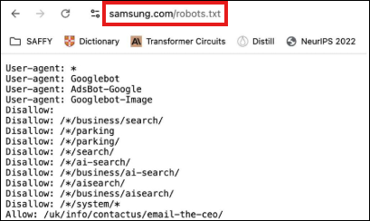
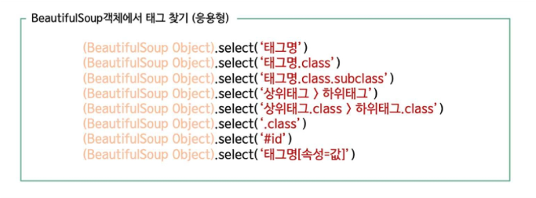
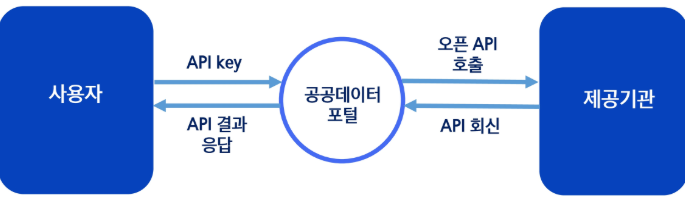

# 데이터 수집
## 웹 크롤링의 구조와 이해
### 웹 크롤링
Web(거미줄) + Crawling(기어다니다)

-> 인터넷 상의 웹 페이지를 자동으로 탐색하고 데이터를 수집하는 기술

- 웹 크롤링의 특징
  - 자동화
  - 대량 데이터 수집
  - 구조화된 데이터 추출

- **스크래핑**
  - 특정 웹페이지에서 원하는 데이터(텍스트, 이미지, 표 등)를 추출하는 과정

- 웹 데이터 수집 방법
  - 웹 페이지를 가져와서 필요한 정보만 추출하기 (스크래핑)
  - WebDriver를 이용해 웹 브라우저 자동화하기 (스크래핑 or 크롤링)
    - 웹 브라우저를 조작해서 동적인 데이터 가져올 때(ex. 로그인 버튼이 있다던지 등)
  - 제공된 OpenAPI를 이용해 실시간으로 데이터 가져오기

### 웹 페이지에서 데이터 추출
- 웹 페이지는 HTML(hyper text markup language)을 중심으로 이루어져 있음
  - 원하는 주소의 웹 페이지로 들어가 HTML 내용을 가져오고, 그 안에서 원하는 데이터가 어디 있는지 가져오는 직업 -> `parsing`
  - Python에는 `BeautifulSoup` 라이브러리 주로 사용

    

- 공개된 Open API 사용하기
  - 만약 기관 등의 서버에서 Open API를 제공하고 있다면, 손쉽게 정제된 형태의 데이터를 가져올 수 있음
  - 주로 `XML`이나 `JSON`이라는 데이터 형식으로 인코딩 하고있음

    

### WebDriver
크롬, 파이어폭스, edge등의 웹 브라우저에서 클릭, 텍스트 입력 등의 행동을 코드로 제어 할 수 있게끔 만든 브라우저

- WebDriver로 웹 브라우저 자동화
  - 로그인이 필요한 서비스 등 단순 URL만으로는 접속할 수 없는 세션 유지가 필요한 작업이나, 옵션이나 드롭다운 메뉴를 클릭해야 데이터를 얻을 수 있는 작업에 필요함
    - 꼭 크롤링이 아니더라도, 웹 브라우저의 행동을 자동화하는 다른 작업 (게시판에 자동 글쓰기, 새 메일 자동 읽기 등)에도 사용할 수 있음

    

  - Python에서는 `Selenium` 라이브러리를 사용함

### 기타 고급 작업
아주 드물게 HTML이나 WebDriver만으로는 접근이 불가능한 데이터도 있음 (공인인증서 등 추가 팝업 프로그램을 사용하는 경우, 이미지 내의 텍스트 등)

- 웹 브라우저를 넘어서는 수준의 조작이 필요한 경우
  - Python에서는 `win32api`나 `pyautogui` 등의 라이브러리를 사용
  - 데스크탑 수준에서 마우스 강제이동, 클릭, 키보드 입력 등을 제어할 수 있음
  - 따라서, 거의 모든 작업을 자동화할 수 있음

- 이미지 인식이 필요한 경우 
  - `opencv-python(cv2)`, `DirectPython`, `PyGTK`, `PIL` 등의 라이브러리를 사용
  - 화면 실시간 캡처, 이미지 인식까지 구현할 수 있음

- 크롤링 정보 저장이 필요한 경우
  - `*.txt`, `*.csv` 형태로 저장하거나 혹은 `pickle` 라이브러리를 써서 내보냄
  - 그러나 간혹 엑셀(`*.xlsx`)형태로 가공하여, 셀 크기나 색상 등의 속성, 글꼴 속성 등을 설정하고자 하는 경우가 있음
    - 이 경우 `openpyxl`을 사용하면 python으로 엑셀 문서의 거의 모든 것을 편집할 수 있음
    - 비슷하게 MS Word는 `python-docx`, 아래한글은 `pyHWP`로 편집할 수 있음
    
### 웹 페이지의 구조
웹 페이지는 HTML, CSS, JavaScript의 조합으로 구성됨

- HTML(hypertext markup language)
  - 웹 페이지를 구성하는 필수 언어
  - 제목, 단락, 목록 등과 같은 본문을 위한 구조적 의미를 나타내는 것 뿐만 아니라 링크, 인용과 그 밖의 항목으로 구조적 문서를 만들 수 있는 방법을 제공함
  - 웹 크롤링을 통해 얻고자 하는 데이터는 HTML의 어딘가에 들어 있음
    - 따라서 웹 페이지 내의 어느 정보가 HTML의 어디에 위치하는지를 파악하기 위해, HTML의 구조를 알아야 함
    - 데이터를 뽑아내 원하는 형태로 가공하는 작업을 파싱(parsing)이라 함

- HTMP 기본 구성 요소

  

  - 속성
    - 해당 요소에 추가적인 내용을 담고 싶을 때
    - ex. 글자색 크기, 배경색, 배경이미지, 여백 등
      
      
    - 현재 예시는 가운데 정렬

- HTML 구조
  ```HTML
  <html>  <!-- 해당 프로그램 언어가 HTML임을 알림 -->
    <head>  <!-- 문서 서문의 시작과 끝을 알림 -->
      <title>  <!-- 문서 제목을 나타냄 -->
        test 홈페이지
      </title>
    </head>
    <body>  <!-- 문서 본문 시작을 알림 -->
      환영합니다
    </body>
  </html>
  ```

- HTML 태그 구조

  

  


- CSS(cascading stylesheets)
  - HTML의 요소의 외관을 디자인 함

    

- CSS 기본 문법

  

- CSS 타입선택자
  - 타입 선택자
    - HTML 태그 이름 그대로 선택하는 방식
      ```CSS
      p {
        color : red;
      }
      ```
      
  
  - 아이디 선택자
    - html의 고유한 id 요소를 선택하는 방식
      ```CSS
      #item {
        color : yellow;
      }
      ```
      

  - 클래스 선택자
    - 여러 요소에 동일하게 선택하는 방식
    - 즉, 같은 유형의 데이터를 한번에 수집할 때 사용
      ```CSS
      .item {
        color : yellow;
      }
      ```
      

  - 자식 선택자
    - 중첩된 구조에서 쓸데없는 태그 제외하고 필요한 태그만 가져오고 싶을 때 선택하는 방식
      ```CSS
      body > p {
        color : blue;
      } 
      ```
      

  - 가상 클래스 선택자
    - 순서가 중요한 표 등 특정 몇번째 데이터를 정확히 추출하고자 할 때 사용
      ```CSS
      ul > li:nth-child(3){ /* ul의 자식 li들 중 3번째 자식 선택 */
        
        color : yellow;
      }
      ```
      

### Robots.txt
웹사이트 소유자가 검색 엔진의 웹 크롤러(로봇)가 사이트의 특정 부분을 **크롤링하거나 인덱싱하는 것을 허용하거나 차단하기 위해 사용하는 텍스트 파일**



-> 웹사이트의 최상위 디렉토리에 `/robots.txt` 추가로 입력하면 크롤링 가능한 영역 등을 지정해놓은 규칙이 적힌 txt파일이 보임

-> 웹사이트 소유자가 공개 여부를 제어하고자 할 때 사용


## Beautiful Soup의 활용
- HTTP 통신
  - 웹 브라우저와 웹 서버 사이에 데이터를 주고 받는데 사용되는 통신

    
    - request 라이브러리를 통해 가져온 HTML 문서를 분석하는 것이 BeautifulSoup

### Requests 라이브러리
접근할 웹 페이지의 데이터를 요청/응답 받기 위한 라이브러리

```python
import requests as req

# 예시: 네이버 페이지 요청하기
  # 나: request야, 네이버 메인 페이지 정보 좀~
  # request: 네, 근데 네이버가 어디?
  # 나: www.naver.com
res = req.get("http://www.naver.com")

# 응답 확인
  # <Response [200]> = 데이터 잘 가지고 옴. 통신 성공!
res   # <Response [200]>

# res 변수에서 내용 보기
res.text
```


- 필요 라이브러리 설치
  ```python
  pip install requests
  pip install bs4

  # 위 실행이 안될 경우, pip 경로를 인식 못하고 있는 상태이므로 아래와 같이 시도
  python -m pip install requests
  python -m pip install bs4
  ```
  - requests
    - 웹 통신 라이브러리
  - BeautifulSoup(bs4)
    - HTML 파싱 라이브러리

- GET 메소드와 URL
  - GET 메소드
    - 웹 서버에게 파라미터를 포함해 요청을 보내는 가장 쉬운 방법으로, URL에 파라미터 정보를 담아서 보내는 것
    - 사용자가 서버에게 웹 페이지를 보여 달라고 하는 것을 **요청**이라 하고
    - 서버가 요청에 대한 대답을 담아 HTML문서로 주는 것을 **응답**이라고 함

      
      - 위 예제는 가상의 사이트 www.example.com 의 로그인 페이지에 bigdata라는 id와 123456이라는 비밀번호로 로그인 요청을 보내는 것이다.
      - 요청을 보낼 페이지의 URL과 파라미터 사이는 반드시 `?` 로 구분되어야 한다.
      - 파라미터는 '변수명=값'형태로 나열되며, 변수 사이는 `&` 로 구분해야 한다.

        
  
  - 예시
    - 해당 페이지의 title만 출력
      ```python
      # 1. 원하는 url로 요청 보낸 뒤, 응답 문자열을 html로 받는다
      # 2. html 문자열에서 <title>과 </title>의 위치를 각각 찾아 인덱스를 저장한다
      # 3. html 문자열 중 title 시작과 끝 인덱스 사이의 문자열을 출력한다
      import requests

      url = 'http://mysnu.ac.kr'
      html = requests.get(url).text

      title_begin = html.index('<title>')
      title_end = html.index('</title>')
      title = html[title_begin : title_end]

      print(title)
      ```
      
    
    - 주식 종목코드로 기업 이름 알아내기
      ```python
      # 1. 검색할 종목코드를 code라는 변수로 선언한다
      # 2. GET 방식 파라미터를 포함한 URL에 code를 더하여 requests.get으로 요청한다
      # 3. title을 출력한다 (ex. 코드 005930은 삼성전자)
      import requests

      code = '005930'
      url = 'https://finance.naver.com/item/main.nhn?code='
      html = requests.get(url + code).text

      title_begin = html.index('<title>')
      title_end = html.index('</title>')
      title = html[title_begin : title_end]

      print(title)
      ```
      


### BeautifulSoup
HTML 및 XML 문서를 구문 분석하기 위한 Python 패키지로, 데이터를 쉽게 추출할 수 있도록 도와줌

-> 웹 브라우저가 하는 일과 비슷하게, HTML 소스를 트리 형태로 해석한 뒤 접근할 수 있음

- 예시
  - 학식 정보 가져오기
    ```python
    # 1. 구글에 '서울대학교 식단'을 검색
      # 생활협동조합 식단 페이지(https://snuco,snu.ac.kr/foodmenu)에 접속할 수 있음
    # 2. 이를 GET으로 요청한 뒤, 응답 텍스트를 BeautifulSoup의 인자로 넣고 실행
    import requests
    from bs4 import BeautifulSoup

    url = 'https://snuco.snu.ac.kr/foodmenu'
    html = requests.get(url).text
    bs = BeautifulSoup(html)
    print(bs)
    ```
    
    
- BeautifulSoup 활용
  - 겉보기엔 별 변화가 없지만, 현재 bs 객체에는 이미 HTML의 정보가 BeautifulSoup를 통해 해석되어 있음
    - 예를 들어, 아래처럼 title을 쉽게 출력할 수 있음
      ```python
      print(bs.title)
      ```
      
  
  - 학생회관식당의 점심 메뉴가 HTML코드 상에서 어디에 위치하는지 알기 위해, 우클릭으로 요소 검사를 시행

    

  - 개발자도구로 코드를 보기
    - 점심 메뉴는 `<td>`와 `<p>` 두 가지 태그에 이중으로 포함되어 있음을 알 수 있음

      

    - `<p>` 태그는 다른 곳에서도 많은 용도로 사용되지만, `<td>`는 그중 표 안의 내용으로 한정됨
    - `class = view-field views-field-lunch` 까지 만족하는 태그는 점심메뉴로 한정됨
    - 따라서 이 경우는 `<td>` 가운데 해당 클래스를 만족하는 것을 검색하면 점심 메뉴의 리스트를 얻을 수 있음

      
      ```python
      # <p> 태그로 선택 (모든 정보가 포함됨)
      # 즉, 점심메뉴 뿐만 아니라 온갖 정보들이 섞여나옴
      bs.select('p')
      ```
      

  - 태그의 식별을 위한 속성으로 주로 `id` 와 `class` 가 사용됨
    - id 는 문서 내에서 유일한 존재이며, class 는 중복될 수 있음
    - 따라서 이 경우는 `<td>` 가운데 해당 클래스를 만족하는 것을 검색하면 점심 메뉴의 리스트를 얻을 수 있음
      

      

    - 점심 메뉴의 하위클래스는 lunch이므로, 이를 갖는 `<td>` 태그만 선택하면 됨
      ```python
      bs.select('td.lunch')
      ```
      

    - 이 가운데 학생회관식당 메뉴만 얻으려면, 리스트의 첫 번째 요소를 출력하면 됨
      ```python
      bs.select('td.lunch')[1]
      ```
      

    - 태그 객체 안에 들어있는 텍스트만 원한다면, `.text` 속성을 읽으면 됨
      ```python
      bs.select('td.lunch')[1].text.strip().split('\n')[0].replace('\r', '')
      ```
      


## OpenAPI의 활용
### OpenAPI
오픈 API(Open Application Programming Interfae)는 누구나 사용할 수 있도록 공개된 API를 말함


-> 웹 사이트가 가진 기능을 모두가 이용할 수 있도록 공개한 프로그래밍 인터페이스

-> 네이버 지도, 구글 맵 등이 대표적인 예시

-> 코로나 사태 때 생긴 라이브코로나, 코로나 맵 등의 서비스는 네이버 클라우드 플랫폼의 API 지원을 받고 있음

-> 대한민국 정부에서는 공공데이터포털을 통해 도로명주소조회서비스, 동네예보정보조회 서비스 등 현재 약 92,771종의 데이터를 제공하고 있음

-> 일반적인 웹 페이지에 GET요청을 보내면 HTML 문서를 응답해주지만, **OpenAPI에 GET요청을 보내면 데이터를 정해진 형식의 텍스트로 응답**해줌

- Open API 데이터 유형
  - XML
    - 각 자료마다 태그를 붙여서 자료의 형태를 표현함
    - 트리 형태 구조임

      
  - CSV
    - 콤마 `,` 로 자료 내용 구분함

      
  - JSON
    - `key:value` 페어로 데이터 표현함

      

  - 기타
    | 유형 | 설명 | 확장자 예시 |
    |---|---|---|
    | 텍스트 | - 이미지, 표, 동영상 등을 미포함하는 텍스트만 포함된 표준 텍스트 문서<br> - 윈도우, 리눅스 등에서 제공하는 기본 텍스트 편집 파일 형식| txt, vi 등|
    | 문서 | - 이미지, 동영상 등 멀티미디어 포함이 가능하고 XML 포맷으로 작성된 문서<br> - '문서'의 경우 특정SW를 통해 편집, 열람 등이 가능하고, '텍스트'의 경우 | hwpX, docx 등|
    | 이미지 | - 레스터, 벡터 등의 형태를 가진 디지털 이미지 데이터<br>- 레스터: 비트맵 형식의 파일로 배열 형태의 이미지<br>- 벡터: 선이나 도형으로 만들어진 이미지 | jpg, png 등|
    | 음성(음향)| 소리, 음성을 담은 디지털 오디오 데이터 | mp3, acc 등|
    | 동영상 | 프레임을 활용하여 만들어진 움직이는 이미지와 음성 및 음향의 모음 | mp4, mpg 등 |
    | 공간 정보 | 지리정보, 위치정보 등 공간 데이터를 포함하는 비정형 데이터 유형| Shapefile (SHP, SHX, DBF) 등|

- 공공데이터 포털의 OpenAPI 사용 절차

  

- 공공 데이터 포털의 OpenAPI 활용
  1. 먼저 공공데이터포털(https://www.data.go.kr/index.do)에 접속한다.

      
  2. 검색창에 관심 주제를 검색한다. 혹은 인기검색어로 검색한다.

      
      -  분류에서 파일데이터는 다운로드 가능한 과거 데이터, 오픈API는 실시간 상황이 반영되는 API를 의미한다. 
  3. 오픈 API중 원하는 주제를 선택한다.

      
  4. 적절히 활용 목적을 쓰고, 동의 후 활용신청 버튼을 누른다. (검토단계 없음)

      
  5. 이후 `마이페이지>오픈API>인증키방급현황`에서 인증키를 확인한다.

      
      - 오픈API는 서버의 과도한 부담을 막기 위해 인증키를 사용하는 경우가 많다.
      - 동일한 인증키로 과도한 요청이 들어오면, 해당 키의 권한이 일시정지된다.
  6. 다시 해당 OpenAPI의 상세페이지로 돌아가면, 요청변수에 무엇을 입력해야 하는지 설명되어있으므로, 샘플데이터의 입력방식을 참고하여 GET요청을 보내면 된다. 

      
      - 필수 항목은 반드시 입력해야 하고, 옵션 항목은 GET에 포함시키지 않아도 된다. 
      - 여기서는 ServiceKey만이 필수요건이고 나머지는 옵션이다.
  
- 코드
  - `!pip install load_dotenv`
  - Open API 사용
    ```python
    import requests
    import os
    from dotenv import load_dotenv

    # .env 파일 로드
    load_dotenv()

    # 환경변수에서 서비스키 불러오기
    key = "발급받은 키"
    print(key)

    url = 'http://apis.data.go.kr/1352000/ODMS_COVID_05/callCovid05Api' \
          + '?serviceKey=' + key \
          + '&pageNo=1' \
          + '&numOfRows=10' \
          + '&create_dt=2022-01-08'

    xml = requests.get(url).text
    print(xml)
    ```
    
    - 구분자 `?` 와 `&` 의 위치에 주의하며 URL 변수를 작성
    - Oprional 파라미터는 공란으로 두더라도, 일단 변수명은 써주는게 좋음
    - python에서 한 행이 너무 길어지면 줄 끝에 `\`를 삽입해 줄 바꿈 가능
    - 응답 텍스트가 길게 나타나면 성공
    - 해당 API 는 결과를 XML형태로 반환해줌

      
      - XML도 HTML과 비슷한 문법으로 해석 가능
  
  - 내용 구성 확인
    ```python
    xml = requests.get(url).text
    bs = BeautifulSoup(xml)
    items = bs.select('item') # 아이템 단위로 파싱

    for item in items:
        confCase = item.select_one('confCase').text
        gubun = item.select_one('gubun').text
        print('구분', gubun, '확진자', confCase)
    ```
    
    - 각 `<item>`마다 연령이나 성별을 기준으로 구별되어 있으며, 하루에 한 번씩 데이터가 추가되고 있음
    - 현재 연령별 통계를 알고 싶다면, 가장 최근 9개의 `<item>`을 확인하면 됨
    - 유일한 태그를 검색하려는 경우 `select_one('tag')`를 사용하여 선택 가능
    - 이 예제에서는 각 item에 gubun이나 confCase가 하나씩만 있으므로 select_one 을 사용함
    - 테스트 결과, 이 API에서 pageNo 나 numOfRows 는 별로 의미가 없는 옵션이라서 생략해도 무방함


## 추가 개념 및 정리
### Selenium
웹 자동화 프레임워크로, 웹 페이지를 프로그래밍 방식으로 제어하는 데 사용됨

- 특징
  - 브라우저를 실행하고, 페이지를 이동하며, 요소를 찾고, 클릭하는 등의 동작을 자동화할 수 있음
  - 웹 크롤링, UI 테스트, 자동화된 데이터 입력 등에 활용됨
  - `WebDriverWait`, `expected_conditions(EC)`를 활용하여 동적 웹 페이지의 요소가 로드될 때까지 기다릴 수 있음
  - 동적 웹페이지에서 데이터를 추출하는 기술은 **실시간 데이터를 수집하여 최신 정보를 반영한 분석을 가능**하게 함

- Selenium과 BeautifulSoup의 차이점
  - Selenium
    - 동적인 웹사이트(자바스크립트 기반 콘텐츠)를 크롤링할 때 사용
    - 브라우저를 직접 실행하여 페이지를 렌더링하고 데이터를 가져올 수 있음
  - BeautifulSoup
    - 정적인 HTML을 파싱하는 데 적합
    - Selenium과 달리 브라우저를 실행하지 않음
    - 주로 requests와 함께 사용하여 HTML 소스를 받아 분석하는 방식으로 동작함

※ Selenium은 더 강력하지만 속도가 느릴 수 있으며, BeautifulSoup은 빠르지만 동적 요소를 처리할 수 없음

- 예시 코드
  - Selenium을 사용해 서울시 실시간 교통 정보 웹페이지에 접속, 특정 구의 정류소 정보를 수집, 수집된 데이터를 시각화
  ```python
  import pandas as pd
  from selenium import webdriver
  from selenium.webdriver.common.by import By
  from selenium.webdriver.support.ui import WebDriverWait
  from selenium.webdriver.support import expected_conditions as EC
  from selenium.common.exceptions import TimeoutException, NoSuchElementException
  import folium

  def setup_driver():
      """Chrome WebDriver 설정 및 초기화"""
      options = webdriver.ChromeOptions()
      options.add_argument("--no-sandbox")  # 샌드박스 모드 비활성화 (리눅스 환경에서 필요할 수 있음)
      options.add_argument("--disable-dev-shm-usage")  # 공유 메모리 사용 제한 (리소스 문제 방지)
      
      # TODO: Chrome 드라이버 실행
      driver = webdriver.Chrome(options=options)  # (options 인자를 전달해야 함)
      
      return driver


  def navigate_to_page(driver):
      """TOPIS 서울교통정보 웹사이트로 이동 및 로딩 대기"""
      
      # TODO: 웹사이트 접속 (.get() 메서드 사용)
      driver.get("https://topis.seoul.go.kr")
      
      # TODO: 페이지 요소 로딩 대기 (WebDriverWait을 사용하여 특정 요소가 로드될 때까지 기다림)
      WebDriverWait(driver, 20).until(EC.presence_of_element_located((By.ID, "contents-area")))  
      print("페이지에 접속했습니다.")


  def search_keyword(driver, keyword):
      """검색 창에 키워드를 입력하고 검색 버튼 클릭"""
      print(f"'{keyword}' 정류소 정보를 수집합니다.")
      
      # TODO: 검색 영역 찾기
      contents_area = driver.find_element(By.ID, "contents-area")
      
      # TODO: 검색 입력 필드 찾기 (CSS_SELECTOR 사용)
      search_box = contents_area.find_element(By.CSS_SELECTOR, "input.int-search")  
      
      search_box.clear()  # 기존 입력값 제거
      search_box.send_keys(keyword)  # 검색어 입력
      
      # TODO: 검색 버튼 찾기
      search_button = contents_area.find_element(By.CSS_SELECTOR, "input.int-btn")
      
      search_button.click()  # 검색 버튼 클릭
      
      # TODO: 검색 결과 로딩 대기
      WebDriverWait(driver, 20).until(EC.presence_of_element_located((By.CLASS_NAME, "asideContent")))  
      print(f"'{keyword}' 검색 결과를 찾았습니다.")


  def scrape_bus_stop_data(driver):
      """검색된 버스 정류소 정보를 크롤링하여 DataFrame으로 반환"""
      print("정류소 정보를 수집합니다.")
      try:
          # TODO: 검색 결과 영역 찾기
          aside_content = driver.find_element(By.CLASS_NAME, "asideContent") 
          
          # TODO: 정류소 리스트 찾기 (find_elements 사용, ID: "resultListBusStn")
          results = aside_content.find_element(By.ID, "resultListBusStn").find_elements(By.TAG_NAME, "li")
          
          data = []
          for result in results:
              try:
                  # TODO: 정류소 이름 추출 (find_element, TAG_NAME 사용)
                  name = result.find_element(By.TAG_NAME, "a").text.strip()
                  
                  # TODO: 정류소 번호 추출 (문자열 메서드 split, replace 활용)
                  bus_stop_number = name.split("(")[-1].replace(")", "")
                  
                  data.append([name, bus_stop_number])
              except NoSuchElementException:
                  print("일부 정류소 정보를 찾을 수 없습니다.")
          
          # TODO: Pandas DataFrame 생성
          df = pd.DataFrame(data, columns=["정류소 이름", "정류소 번호"])
          print("정류소 정보가 성공적으로 수집되었습니다.")
          return df
      
      except Exception as e:
          print(f"정류소 정보 수집 중 오류 발생: {e}")
          return pd.DataFrame()


  def visualize_data(df):
      """수집된 정류소 데이터를 folium을 이용해 지도에 시각화"""
      if df.empty:
          print("시각화할 데이터가 없습니다.")
          return
      # folium: 파이썬 기반 지도 시각화 라이브러리로, 
        # OpenStreetMap 및 기타 타일셋을 활용해 지도 상에 데이터를 시각적으로 표현 가능함.
      # 주요 기능: 지도 마커 추가, 폴리곤/라인 오버레이, 팝업 및 툴팁 지원 등
      
      # 서울 강남구 중심 좌표를 기준으로 지도 생성
      # 지도 초기화 (folium.Map 사용, 중심 좌표는 서울 강남구)
      map_center = [37.4979, 127.0276]  
      m = folium.Map(location=map_center, zoom_start=13)

      # TODO: 정류소 데이터를 지도에 마커로 추가 (for문 사용, folium.Marker 활용)
      for index, row in df.iterrows():
          folium.Marker(
              location=map_center,  # 현재는 임의 좌표 사용
              popup=row['정류소 이름'],  # 정류소 이름을 팝업으로 표시
              tooltip=row['정류소 번호']  # 정류소 번호를 툴팁으로 표시
          ).add_to(m)

      # TODO: 생성된 지도를 HTML 파일로 저장
      m.save("bus_stop_map.html")
      print("정류소 시각화가 완료되었습니다. 'bus_stop_map.html' 파일을 확인하세요.")


  def main():
      """메인 실행 함수"""
      driver = setup_driver()         # Chrome 드라이버 설정
      navigate_to_page(driver)         # 웹사이트 이동
      search_keyword(driver, "강남구")   # 강남구 버스 정류소 검색
      df = scrape_bus_stop_data(driver)   # 데이터 수집
      driver.quit()  # 드라이버 종료

      if not df.empty:
          print("\n수집된 정류소 데이터 분석:")
          print(df.head())  # 데이터 확인
          print(f"총 {len(df)}개의 정류소가 수집되었습니다.")

          # TODO: 중복된 정류소 확인
          if df.duplicated(subset=["정류소 번호"]).any():
              print("중복된 정류소가 있습니다.")
          else:
              print("중복된 정류소가 없습니다.")

          # 시각화 실행
          visualize_data(df)
      else:
          print("정류소 데이터 수집에 실패하였습니다.")

  if __name__ == "__main__":
      main()
  ```


### Open API 연습
- 서울시 교통 정보 API를 활용해 버스와 지하철 이용 데이터를 수집하고, 이를 통합하여 일별 교통 흐름을 분석
  ```python
  import requests  # HTTP 요청을 보내고 응답을 받을 수 있도록 해주는 라이브러리
  import xml.etree.ElementTree as ET  # XML 데이터를 파싱(분석)하고 다루기 위한 라이브러리
  import pandas as pd  # 데이터프레임을 활용하여 데이터를 효율적으로 처리하기 위한 라이브러리
  from datetime import datetime, timedelta  # 날짜 및 시간 계산을 위해 필요한 라이브러리

  '''
  # 참고사항
  공공데이터의 api를 다루는 사이트는 여러 곳이 있습니다.
  그 중에서 과제에 해당하는 사이트: https://data.seoul.go.kr 에 가입 후 인증키를 발급받아야 합니다.

  버스 api 사이트: https://data.seoul.go.kr/dataList/OA-12914/S/1/datasetView.do
  지하철 api 사이트: https://data.seoul.go.kr/dataList/OA-12912/S/1/datasetView.do
  각각의 사이트에서 인증키를 받아야 하며 첫 번째 이미지의 인증키 신청을 누르고 두 번째의 내용을 작성합니다.
  여기서 사용URL이 헷갈릴 수 있는데, 이건 "API 테스트 및 학습용" 정도로 기입해주시면 인증키를 발급받을 수 있고 
  이 인증키를 두 개의 사이트에 대해서 발급받고 진행합니다.
  '''

  # API 키 및 기본 URL 설정 (실제 사용 시 보안상 환경 변수로 관리하는 것이 바람직함)
  BUS_API_KEY = "____________________"  # 서울시 버스 교통 데이터 API 키 (빈칸 채우기)
  SUBWAY_API_KEY = "____________________"  # 서울시 지하철 교통 데이터 API 키 (빈칸 채우기)
  BUS_URL = "http://openapi.seoul.go.kr:8088/"  # 서울시 버스 API 기본 URL
  SUBWAY_URL = "http://openapi.seoul.go.kr:8088/"  # 서울시 지하철 API 기본 URL

  def get_bus_data(date):
      """
      주어진 날짜에 대한 서울시 버스 승하차 데이터를 API에서 가져와 DataFrame으로 변환하는 함수

      Args:
          date (str): YYYYMMDD 형식의 날짜 문자열

      Returns:
          pandas.DataFrame: 버스 데이터가 저장된 데이터프레임
      """
      # API URL 구성 (날짜별 버스 데이터 요청)
      # ( BUS_URL과 BUS_API_KEY, date를 이용하여 API 요청 URL 생성)
      url = f"{BUS_URL}{BUS_API_KEY}/xml/CardBusStatisticsServiceNew/1/1000/{date}"  

      # API 요청을 보냄
      response = requests.get(url)  # requests 라이브러리를 사용하여 GET 요청 보내기)
      
      # 응답 상태 코드 확인 (200이면 정상)
      print("\n문제 1. 버스 데이터 수집")
      print("답: 상태 코드:", response.status_code)
      print("설명: 상태 코드 200은 API 호출이 성공적으로 완료되었음을 의미합니다.")
      
      # XML 응답 데이터를 파싱
      root = ET.fromstring(response.content)  # API 응답 데이터를 XML 형식으로 변환)

      # 데이터를 저장할 리스트 생성
      bus_data = []
      
      # XML에서 <row> 태그를 찾아 각 데이터 항목을 추출
      for row in root.findall('.//row'):
          bus_data.append({
              '날짜': row.find('USE_YMD').text if row.find('USE_YMD') is not None else '',  # 사용일자
              '노선번호': row.find('RTE_NM').text if row.find('RTE_NM') is not None else 0,  # row에서 'RTE_NM' 태그의 텍스트 추출)
              '정류장명': row.find('SBWY_STNS_NM').text if row.find('SBWY_STNS_NM') is not None else '',  # row에서 'SBWY_STNS_NM' 태그의 텍스트 추출)
              '승차인원': int(row.find('GTON_TNOPE').text) if row.find('GTON_TNOPE') is not None else 0,  # 승차 인원
              '하차인원': int(row.find('GTOFF_TNOPE').text) if row.find('GTOFF_TNOPE') is not None else 0  # 하차 인원
          })

      print(f"설명: {date} 날짜의 버스 데이터를 수집하여 리스트에 저장했습니다.")
      
      # 리스트를 데이터프레임으로 변환하여 반환
      return pd.DataFrame(bus_data)


  def get_subway_data(date):
      """
      주어진 날짜에 대한 서울시 지하철 승하차 데이터를 API에서 가져와 DataFrame으로 변환하는 함수
      """
      # API URL 구성 (날짜별 지하철 데이터 요청)
      # SUBWAY_URL과 SUBWAY_API_KEY, date를 이용하여 API 요청 URL 생성)
      url = f"{SUBWAY_URL}{SUBWAY_API_KEY}/xml/CardSubwayStatsNew/1/1000/{date}"  
      
      # API 요청을 보냄
      response = requests.get(url)  # requests 라이브러리를 사용하여 GET 요청 보내기)
      
      # 응답 상태 코드 확인 (200이면 정상)
      print("\n문제 2. 지하철 데이터 수집")
      print("답: 상태 코드:", response.status_code)
      print("설명: 상태 코드 200은 API 호출이 성공적으로 완료되었음을 의미합니다.")
      
      # XML 응답 데이터를 파싱
      root = ET.fromstring(response.content)  # API 응답 데이터를 XML 형식으로 변환)

      # 데이터를 저장할 리스트 생성
      subway_data = []
      
      # XML에서 <row> 태그를 찾아 각 데이터 항목을 추출
      for row in root.findall('.//row'):
          subway_data.append({
              '날짜': row.find('USE_YMD').text if row.find('USE_YMD') is not None else '',  
              '노선번호': row.find('SBWY_ROUT_LN_NM').text if row.find('SBWY_ROUT_LN_NM') is not None else '',  
              '역명': row.find('SBWY_STNS_NM').text if row.find('SBWY_STNS_NM') is not None else '',  # row에서 'SBWY_STNS_NM' 태그의 텍스트 추출)
              '승차인원': int(row.find('GTON_TNOPE').text) if row.find('GTON_TNOPE') is not None else 0,  
              '하차인원': int(row.find('GTOFF_TNOPE').text) if row.find('GTOFF_TNOPE') is not None else 0  # row에서 'GTOFF_TNOPE' 태그의 텍스트 추출 후 정수로 변환)
          })

      print(f"설명: {date} 날짜의 지하철 데이터를 수집하여 리스트에 저장했습니다.")
      
      # 리스트를 데이터프레임으로 변환하여 반환
      return pd.DataFrame(subway_data)


  def integrate_data(bus_data, subway_data):
      """
      버스 및 지하철 데이터를 하나의 데이터프레임으로 통합하는 함수
      """
      # 버스 데이터에 '교통수단' 컬럼 추가 후 '정류장명'을 '역/정류장명'으로 변경
      bus_data['교통수단'] = '버스'
      bus_data = bus_data.rename(columns={'정류장명': '역/정류장명'})

      # 지하철 데이터에 '교통수단' 컬럼 추가 후 '역명'을 '역/정류장명'으로 변경
      subway_data['교통수단'] = '지하철'
      subway_data = subway_data.rename(columns={'역명': '역/정류장명'})  # subway_data에서 '역명' 컬럼을 '역/정류장명'으로 변경)

      # 두 데이터를 합치기
      integrated_df = pd.concat([bus_data, subway_data], ignore_index=True)
      
      print("\n문제 3. 데이터 통합")
      print("답: 버스와 지하철 데이터가 통합되었습니다.")
      print(f"설명: 통합된 데이터의 컬럼은 {integrated_df.columns.tolist()} 입니다.")

      # 최종적으로 '교통수단', '날짜', '노선번호', '역/정류장명', '승차인원', '하차인원' 컬럼만 포함한 데이터프레임 반환)
      return integrated_df[['교통수단', '날짜', '노선번호', '역/정류장명', '승차인원', '하차인원']]  

  def get_data_for_date_range(start_date, end_date):
      """
      주어진 날짜 범위에 대해 버스 및 지하철 데이터를 수집하고 통합하는 함수

      Args:
          start_date (datetime): 데이터 수집 시작 날짜
          end_date (datetime): 데이터 수집 종료 날짜

      Returns:
          pandas.DataFrame: 통합된 전체 데이터프레임
      """
      current_date = start_date
      all_data = []

      while current_date <= end_date:
          date_str = current_date.strftime("%Y%m%d")
          print(f"\n설명: {date_str} 날짜의 데이터를 수집 중입니다.")

          bus_data = get_bus_data(date_str)
          subway_data = get_subway_data(date_str)

          daily_data = integrate_data(bus_data, subway_data)
          all_data.append(daily_data)

          current_date += timedelta(days=1)

      return pd.concat(all_data, ignore_index=True)

  def main():
      # 데이터를 수집할 시작 날짜와 종료 날짜를 설정합니다.
      start_date = datetime(2023, 9, 1)
      end_date = datetime(2023, 9, 7)  # 일주일 치 데이터

      # 지정된 날짜 범위에 대한 데이터를 수집하고 통합합니다.
      all_data = get_data_for_date_range(start_date, end_date)

      # 일별 총 승하차 인원을 계산합니다.
      daily_totals = all_data.groupby(['교통수단', '날짜']).agg({
          '승차인원': 'sum',
          '하차인원': 'sum'
      }).reset_index()
      print("\n문제 4. 일별 총 승하차 인원 계산")
      print(daily_totals.head())  # 일별 총 승하차 인원 데이터를 출력합니다.
      print("설명: 일별로 교통수단별 총 승하차 인원을 계산하여 데이터프레임에 저장했습니다.")

      # 노선별 평균 승하차 인원을 계산합니다.
      route_averages = all_data.groupby(['교통수단', '노선번호']).agg({
          '승차인원': 'mean',
          '하차인원': 'mean'
      }).reset_index()
      print("\n문제 5. 노선별 평균 승하차 인원 계산")
      print(route_averages.head())  # 노선별 평균 승하차 인원 데이터를 출력합니다.
      print("설명: 노선별로 평균 승하차 인원을 계산하여 데이터프레임에 저장했습니다.")

      # 결과를 CSV 파일로 저장합니다.
      all_data.to_csv("seoul_transport_data_detailed.csv", index=False, encoding='utf-8-sig')
      daily_totals.to_csv("seoul_transport_daily_totals.csv", index=False, encoding='utf-8-sig')
      route_averages.to_csv("seoul_transport_route_averages.csv", index=False, encoding='utf-8-sig')
      print("\n문제 6. 결과 CSV 파일로 저장")
      print("설명: 데이터를 분석하고, CSV 파일로 저장하여 나중에 참고할 수 있도록 했습니다.")
      print("Data has been saved to CSV files.")

  if __name__ == "__main__":
      main()
```

