# 머신러닝 개요 및 평가지표
## 인공지능의 기본 개념
### AI (Artificial Intelligence)
인간의 지능을 인공적으로 만든 것

- 지능이란 -> 지적 능력 -> 인간은 어떻게 알까?

- 인공지능 vs 머신러닝 vs 딥러닝

  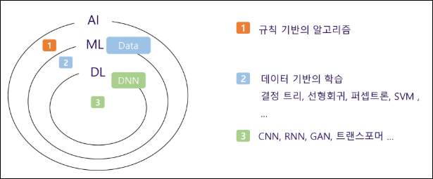
  - 인공지능 AI (Artificial Intelligence)
    - 규칙 기반의 알고리즘
    - 사람이 규칙을 정해주면 규칙에 맞게 동작
  - 머신러닝 ML (Machine Learning)
    - 데이터 기반의 학습
    - 데이터 기반으로 패턴을 파악하여 스스로 학습
    - 결정 트리, 선형회귀, 퍼셉트론, SVM, ...
  - 딥러닝 DL (Deep Learning)
    - 머신러닝 중에서도 인공신경망을 깊게 쌓아서 만든 기술
    - CNN, RNN, GAN, 트랜스포머 ...

- 머신러닝과 딥러닝의 구조적 차이
  - Perceoptron과 Deep Neural Network

    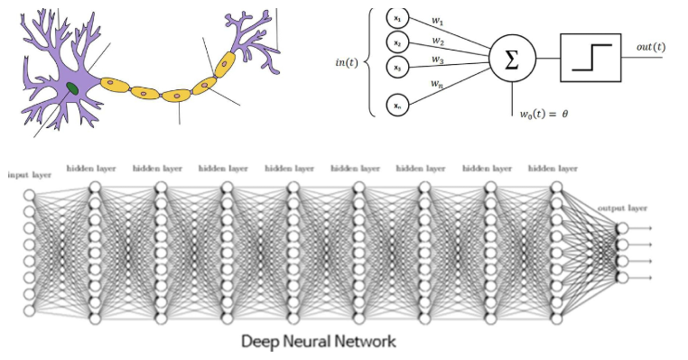
  
  - Perceoptron
    - 사람의 뇌를 본떠서 만들었음(뉴런을 표방함)
    - 여러 입력값에 가중치를 곱해 합산한 결과가 특정 임계값을 넘는지 여부에 따라 하나의 출력값(0 또는 1)을 결정하는 인공 신경망의 초기 모델
    - 복잡한 패턴을 인식하기엔 활성화 함수 한개로는 한계가 있음
    - 그래서 굉장히 많은 퍼셉트론을 이어붙여서 사용 -> MLP (Multi Layer Perceoptron)

  - Deep Neural Network
    - 딥러닝을 위한 네트워크를 쌓아놓은 형태
    - 퍼셉트론을 여러개 뭉쳐서 층단위로 연결되고, 이 층 자체가 깊어지면 Deep Neural Network라는 형태로 표현됨
    - 입력층, 여러 은닉층, 출력층으로 구성되어 있고, 은닉층이 많을수록 딥하다고 표현함
  
  - 딥러닝의 핵심
    - 복잡한 문제를 층을 깊게 쌓아(가중치가 많아진다는 의미) 점진적으로 문제를 해결하는 것


## 머신러닝과 딥러닝 소개
### 머신러닝
- Arthur Samuel(1959)
  - "기계 학습은 컴퓨터가 **명시적으로 프로그래밍되지 않아도 스스로 학습할 수 있**는 능력을 부여하는 학문 분야이다."

- Tom Mitchell(1998)
  - "컴퓨터 프로그램이 어떤 작업 집합 T와 성능 척도 P에 대해 경험 E로부터 학습한다고 할 때, 경험 E를 통해 T 작업에 대한 성능이 P로 측정한 결과 향상되는 경우를 말한다."
    - 경험 (E): 데이터, 과거의 사례 
      - ex. 체커게임 여러번 하면서 스스로 생긴 데이터
    - 작업 (T): 해결하려는 문제, 과제 
      - ex. 체커 게임
    - 성능 척도 (P): 얼마나 잘했는지 평가 기준 
      - ex. 승률
  - 머신러닝은 데이터(E)를 통해 과제(T)를 더 잘 수행하도록, 성능(P)이 향상되는 과정

### Feature Engineering
모델이 더 좋은 예측을 할 수 있도록 데이터를 가공하는 과정
    
-> 데이터를 단순히 수집하는 것보다 적절한 피처(Feature, 변수)를 만드는 것이 성능 향상에 중요

- 피처 엔지니어링 필요성
  - 원본 데이터는 모델이 바로 이해하기 어려운 형태일 수 있음
  - 좋은 피처를 만들면 복잡한 모델 없이도 높은 성능을 낼 수 있음
  - 불필요한 변수를 제거하면 연산 속도가 빨라지고 해석력이 향상됨

- 피처 엔지니어링 주요 기법
  - 피처 선택 (Feature Selection)
    - 모델 성능에 **중요한 변수만 선택**하고 **불필요한 변수 제거**
    - 방법:
      - 상관계수 분석 -> 상관관계가 높은 변수 제거 (비슷한 정보를 가지고 있을테니)
      - 분산 기반 선택 -> 변화가 거의 없는 변수 제거 (모델 학습에 큰 기여를 하지 않을 것 같으니)
      - Recursive Feature Elimination(RFE) -> 모델 성능에 가장 중요한 변수 선택

  - 피처 생성 (Feature Creation)
    - 기존 데이터를 활용하여 **새로운 변수를 만드는 과정**
    - 예시:
      - 날짜 데이터 -> "요일", "주말 여부", "계절" 변수 추가
      - 판매 데이터 -> "가격 * 판매량" 으로 매출 변수 생성

  - 피처 변환 (Feature Transformation)
    - 모델이 데이터를 더 잘 학습할 수 있도록 **변형**
    - 방법:
      - 정규화 (Normalization): 값의 범위를 `[0,1]`로 조정
      - 표준화 (Standardization): `평균 0`, `표준편차 1`로 조정
      - 로그 변환 (Log Transformation): 데이터 분포를 정규분포에 가깝게 변형

  - 범주형 데이터 인코딩 (Categorical Encoding)
    - **문자 데이터를 숫자로 변환**하여 모델이 이해할 수 있도록 함
    - 방법:
      - 원-핫 인코딩(One-Hot Encoding): 카테고리를 0과 1로 변환 -> 순서가 없는 형태로 변환함
        - red [1, 0, 0]
        - green [0, 1, 0]
        - blue [0, 0, 1]
        - 범주가 많을수록 차원이 높아져서 고려해야할 연산량이 많아질 수 있음
      - 라벨 인코딩(Label Encoding): 카테고리를 숫자로 변환 -> 순서가 있는 형태로 변환함 (예:"Red"->1, "Blue"->2)

  - 결측값 처리 (Handling Missing Values)
    - 데이터에서 **비어있는 값(결측치)을 처리**하는 과정
    - 방법:
      - 삭제: 결측치가 적으면 해당 행 제거
      - 대체: 평균, 중앙값, 최빈값으로 채우기
      - 예측 모델 사용: 머신러닝을 활용하여 결측값 예측

  - 이상치 처리 (Outlier Handling)
    - **극단적인 값을 감지하고 처리**하는 과정
    - 방법:
      - Z-score, IQR(사분위 범위) 기반 이상치 제거
      - 로그 변환으로 이상치 영향을 줄이기
        - 이상치를 없애는 것이 아니라 영향력을 줄이는 것
        - 데이터의 스케일을 바꾸는 것


### 머신러닝의 분류
1. Supervised Learning (지도학습)
2. Unsupervised Learning (비지도학습)
3. Reinforcement Learning (강화학습)

※ 서로 다 분리되어 있는 것이 아니라, 어떤 문제는 복합적으로 적용되기도 하고 다양한 방식으로 조합해서 사용하기도 함

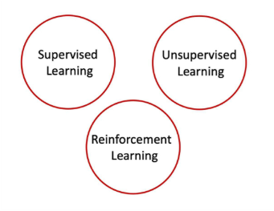
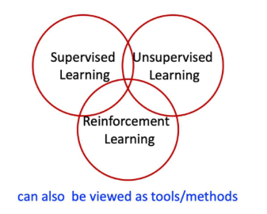

### Supervised Learning
정답(label)을 기반으로 학습을 하는 과정

-> 입력과 정답이 함께 주어진 데이터셋을 기반으로 모델을 학습시키는 방법

- 집 가격 예측
  - n개의 샘플을 포함한 데이터셋이 주어졌을 때,

    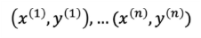
    - x가 주어졌을 때 y를 반복적으로 알려주고, 학습하지 않은 x가 들어왔을 때 y을 예측할 수 있도록 학습시키는 것
  - Task: 주거지가 x 평방피트일 때, 그 가격을 예측하라

    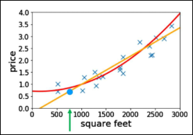
  - 추가 정보: 대지 크기를 알고 있다고 가정
  - Task: (면적, 대지 크기) -> 가격으로 매핑하는 함수를 찾아라

    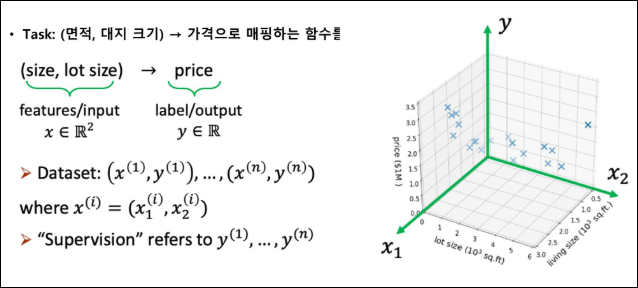
  - 만약 우리가 많은 데이터를 가지고 있다면?

    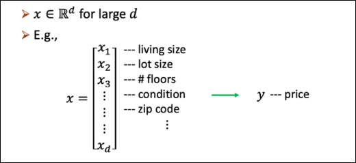
    - 피처가 많아질수록(차원이 늘어날수록) 공간상의 밀도가 줄어듦
    - 즉, 데이터가 가진 밀도가 희박해지고 예측을 위한 연산이 많아지기 때문에 feature selection이나 '차원축소' 기법 등을 사용함

- 컴퓨터 비전에서의 Supervised Learning
  - 이미지 분류
    - `x = raw pixels of the image` -> 픽셀 값
    - `y = the main object` -> 이미지에 등장하는 주된 객체
    - https://arxiv.org/abs/1409.0575

      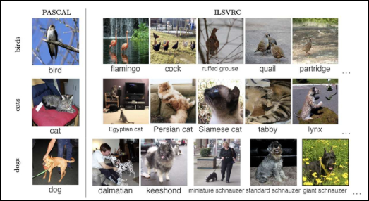

  - 객체 위치 지정 및 탐지
    - `x = raw pixels of the image` -> 픽셀 값
    - `y = the bounding boxes` -> 객체 위치 지정/탐지

      

- 자연어 처리에서의 Supervised Learning
  - 기계 번역

    

### Unsupervised Learning
정답(label)이 데이터 셋에 없음

-> 데이터에서 패턴, 구조, 또는 관계를 스스로 찾아내는 머신러닝 방식

-> 비슷한 것들끼리 묶는 방식(=클러스터링)을 통해 군집을 형성시킴

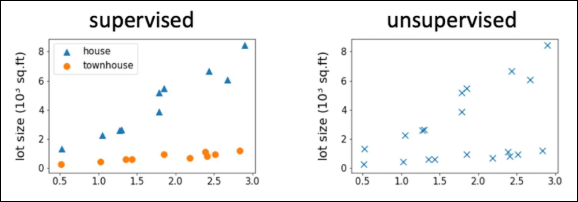

- 목표
  - 모호하게 제시됨
  - 데이터에서 흥미로운 구조를 발견하는 것

- 유전자 클러스터링
  - 클러스터링을 통해 분류를 진행함
    
    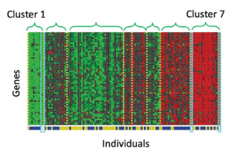

### Self-Supervised Learning
레이블이 없는 데이터로부터 학습하는 인공지능 기법으로, 레이블이 필요하지 않은 대신에 데이터 자체에서 학습 과제를 생성함

-> ex. 이미지에서 일부를 가리고 모델이 가려진 부분을 예측하게 하는 것이 자기지도 학습의 한 예시

-> 지도 학습처럼 명시적인 목표를 가지고 학습하지만, 비지도 학습처럼 레이블이 필요하지 않음

-> 즉, 자기가 스스로 학습을 위한 정답을 만들어내는 방식

-> 정답 없이, 데이터 내부 구조만으로 학습 쌍을 자동으로 생성하는 형태

- Large Language Model (LLM)
  - 대규모 언어 데이터셋을 통해 학습된 기계 학습 모델
  - 다양한 목적으로 활용 가능
  - https://arxiv.org/pdf/2005.14165

    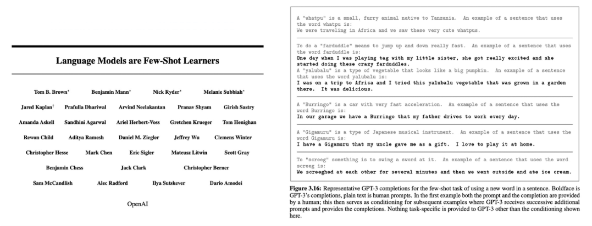
    

  - 자기 지도 학습
    - 지도 학습의 단점인 정답 데이터에 대한 한계를 극복 -> 정답이 없는 데이터도 자체 데이터로 학습
    - 사전 학습 (Pre-training)과 미세 조정(Fine-tuning) 단계로 진행

      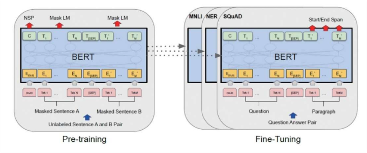

### Reinforcement Learning
어떤 환경 안에서 정의된 에이전트가 현재의 상태를 인식하여, 선택 가능한 행동들 중 보상을 최대화하는 행동 혹은 행동 순서를 선택하는 방법

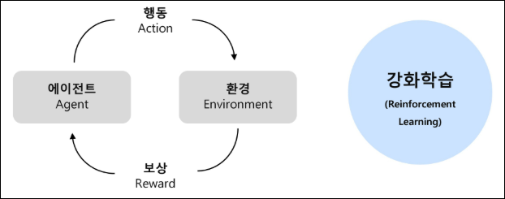

-> 순차적인 결정을 내리는 학습 (강화학습)

-> 알고리즘은 데이터를 상호작용적으로 수집할 수 있음

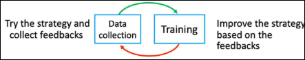

### 모델 성능 평가
- `Overfitting` vs `Underfitting`
  - Overfitting (과적합)
    - 모델이 학습 데이터에 **지나치게 적합**하여, 복잡한 패턴까지 모두 학습
    - 학습 데이터에서는 높은 성능, 하지만 새로운 데이터에서는 성능이 저하
  - Underfitting (과소적합)
    - 모델이 충분히 학습되지 않아 **중요한 패턴조차 학습하지 못함**
    - 학습 데이터와 테스트 데이터 모두에서 성능 저조
    
    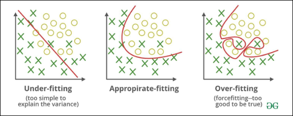

- 평가(Evaluation)
  - 실제값과 모델에 의해 예측된 값을 비교하여 두 값의 차리(오차)를 구하는것
  - `(실제값 - 예측값) = 0` 이면, 오차가 없는 것으로 모델이 100% 성능을 보임
  - But, 성능이 100%인 모델은 현실적으로 힘들기 때문에 오차를 구하여 어느 정도까지 오차를 허용할지 결정
    - 과적합(Overfitting)을 방지하고 최적의 모델을 찾기 위해 실시
  - 모델링의 목적 또는 목표 변수의 유형에 따라 다른 평가지표 사용

    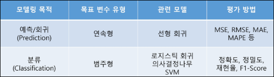
    - 의사결정나무, SVM은 분류 문제에 주로 쓰이기는 것이지, 회귀 문제에서 쓰지 못하는 것은 아님

**※ 분류 vs 회귀**
- 분류 분석
  - 범주형 데이터를 예측
  - 목표
    - 주어진 데이터를 특정 카테고리나 클래스로 분류하는 것
    - 각 데이터가 어떤 그룹에 속하는지를 예측하는 문제
  - 결과 값
    - 주로 **이산형** 값으로 나타남
    - ex. `Yes or No`, `1 or 0`

- 회귀 분석
  - 연속형 데이터를 예측
  - 목표
    - 독립 변수와 종속 변수 간의 관계를 분석하여 수치 값을 예측하는 것
    - 데이터 간의 상관관계를 활용하여 미래의 값을 예측할 수 있음
  - 결과 값
    - 주로 **연속형** 값으로 나타남
    - ex. 100, 200, 350과 같은 수치값을 예측함

### 회귀 모델 평가 방법
- 하나의 목표를 가지고 다양한 회귀 모델을 만들어 테스트
- 그 중 어떤 모델이 가장 나은 모델인지 판단할 때 모델 평가지표 사용
- 실제 데이터와 예측 결과 데이터가 얼마나 비슷한 지에 기반하지만, 단순하게 이것만 가지고 판단하기에는 무리가 있음
- 주요 지표
  1. 평균 절대 오차 (MAE, Mean Absolute Error)
  2. 평균 절대 백분율 오차 (MAPE, Mean Absolute Percentage Error)
  3. 평균 제곱 오차 (MSE, Mean Squared Error)
  4. 평균 제곱근 오차(RMSE, Root Mean Squared Error)
  5. 결정 계수 (R² Score)

- MAE(Mean Absolute Error)
  - 실제 정답 값과 예측 값의 차이를 절댓값으로 변환한 뒤 합산하여 평균을 구함
  - 이상치를 고려하지 않는 경우에 주로 사용
  - 값이 낮을수록 좋은 모델(값이 작을수록 예측이 실제와 가까움)

    
    - $y$ = 실제값 (정답값)
    - $\hat{y}$ = 예측값
    - $|y - \hat{y}|$ = 절대 오차 (실제값과 예측값 차이의 절댓값)
    - $n$ = 데이터 개수 (샘플 수)  
  - 실제 정답보다 낮게 예측했는지, 높게 했는지를 파악이 어려움
  - 스케일에 의존적이기 때문에 모델마다 에러 크기가 동일해도 에러율(비율)은 동일하지 않음

- MAPE(Mean Absolute Percentage Error)
  - MAE를 상대적 오차로 변환하여 데이터의 스케일에 영향을 덜 받도록 함
  - 실제값 대비 백분율로 환산하여 단위 상관 없이 상대적인 예측 정확도를 직관적으로 해석 가능함
    - ex. MAPE=5% -> 평균적으로 실제값의 5%만큼 오차
  - 이상치를 고려하지 않는 경우에 주로 사용
  - 값이 낮을수록 좋은 모델

    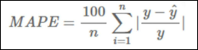
    - $y$ = 실제값 (정답값)  
    - $\hat{y}$ = 예측값  
    - $\left|\frac{y - \hat{y}}{y}\right|$ = 각 샘플의 **상대 오차** (예측 오차를 실제값으로 나눈 비율)   
    - $n$ = 데이터 개수 (샘플 수) 

  - 실제 정답보다 낮게 예측했는지, 높게 했는지를 파악하기 어려움
  - 실제 정답이 0에 가까운 경우 값이 발산할 수 있으므로 주의

- MSE(Mean Squared Error)
  - 실제 정답 값과 예측 값의 차이를 제곱한 뒤 평균을 구함
  - 시계열 데이터에서, 미분이 연속적이어야 할 때 주로 사용
  - 값이 낮을수록 좋은 모델

    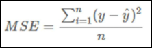
    - $y$ = 실제값 (정답값)  
    - $\hat{y}$ = 예측값  
    - $(y - \hat{y})^2$ = 제곱 오차 (실제값과 예측값 차이를 제곱한 값)   
    - $n$ = 데이터 개수 (샘플 수)  
  - 이상치(outlier)에 매우 민감 (큰 오차에 큰 패널티)
  - 데이터에 이상치가 많다면 MSE 대신 MAE를 고려
  - 스케일 의존적이므로 모델 비교 시 주의 필요

- RMSE(Root Mean Squared Error)
  - MSE에 루트를 씌워서 에러를 제공해 값의 왜곡을 줄임
  - 시계열 데이터에서, 미분이 연속적인 순간이 필요할 때 주로 사용
  - 값이 낮을수록 좋은 모델

    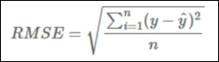
    - $y$ = 실제값 (정답값)  
    - $\hat{y}$ = 예측값  
    - $(y - \hat{y})^2$ = 제곱 오차 (실제값과 예측값 차이를 제곱한 값)   
    - $n$ = 데이터 개수 (샘플 수)  
  - 이상치에 대한 패널티가 여전히 존재 (MSE보다는 덜 민감)
  - 데이터의 크기가 다르면 RMSE 값도 다르게 나와 서로 다른 스케일의 모델 비교 어려움
  - 데이터에 이상치가 많다면 MSE 대신 MAE 계열 사용

- R2 score (R squared)
  - 모델이 실제 데이터의 변동성을 얼마나 잘 설명하는지를 나타내는 지표
  - 실제 값의 전체 변동성(SST) 중에서 모델이 설명할 수 있는 비율

    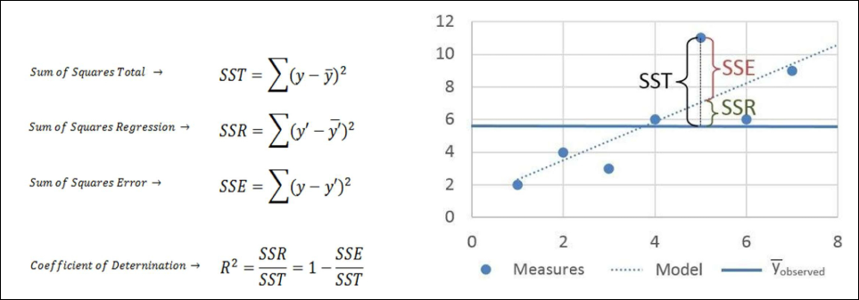
    - $y$ = 실제값 , $\hat{y}$ = 예측값  
    - $\bar{y}$ = 실제값의 평균  
    - $\sum (y - \hat{y})^2$ = SSE (Sum of Squared Errors, 잔차 제곱합)  
    - $\sum (y - \bar{y})^2$ = SST (Total Sum of Squares, 전체 변동)
    - $SST = SSE + SSR$
    - $R^2 = \frac{SSR}{SST} = 1 - \frac{SSE}{SST}$

  - $R^2$는 모델이 **데이터의 분산을 얼마나 설명하는지** 나타냄
  - 값의 범위:
    - $R^2 = 1$ -> 완벽한 예측 (모델이 모든 변동을 100% 설명)  
    - $R^2 = 0$ -> 평균값을 예측하는 것과 동일 (설명력 없음)  
    - $R^2 < 0$ -> 평균 예측보다도 못한 모델 
    - 즉, 1에 가까울수록 좋은 모델

### 분류 모델 평가 방법
- 하나의 목표를 가지고 다양한 분류 모델을 만들어 테스트
- 그 중 어떤 모델이 가장 나은 모델인지 판단할 때 모델 평가 지표 사용
- 회귀모형과 비슷하게 실제 데이터와 예측 결과 데이터가 얼마나 비슷한지에 기반하지만, 단순히 이것만 가지고 판단하기에는 무리가 있음
- 주요 지표
  1. 정확도(Accuracy)
  2. 오차행렬(Confusion Matrix)
  3. 정밀도(Precision)
  4. 재현율(Recall)
  5. F1-스코어
  6. ROC AUC

- 오차행렬(Confusion Matrix)
  - 분류 모델이 예측한 결과와 실제 정답을 비교하여 성능을 평가하는 방법
  - 특히 **이진 분류(binary classification)** 문제에서 모델이 얼마나 정확하게 예측했는지를 분석하는 데 유용
  - 구성 요소

    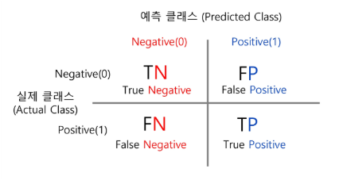
    - TP (True Positive): 실제로 참인 데이터를 모델이 참으로 예측한 경우
    - TN (True Negative): 실제로 거짓인 데이터를 모델이 거짓으로 예측한 경우
    - FP (False Positive): 실제로 거짓인데 모델이 참으로 예측한 경우
    - FN (False Negative): 실제로 참인데 모델이 거짓으로 예측한 경우

- 정확도(Accuracy)
  - 전체 샘플 중에서 모델이 맞춘 비율
  - 하지만 데이터가 불균형한 경우에는 부적절할 수 있음 (예: 99% 건강한 데이터, 1% 암 환자)

    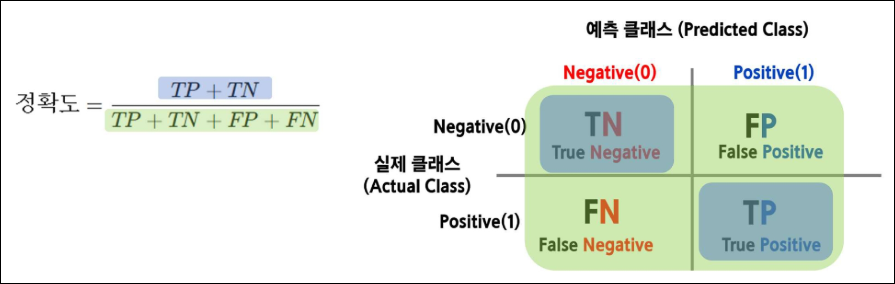
    - $Accuracy = \frac{TP + TN}{TP + TN + FP + FN}$

- 정밀도(Precision)
  - 모델이 "참(Positive)"이라고 예측한 것 중 실제로 참인 비율
  - **FP(거짓을 참으로 예측하는 경우)를 줄이는 데 초점**을 맞춰야 함
  - ex. 스팸 필터에서 중요 (스팸 아닌 메일을 스팸으로 분류하면 안 됨)

    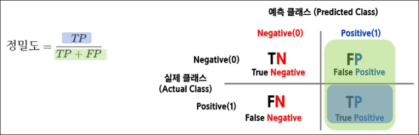
    - $Precision = \frac{TP}{TP + FP}$

- 재현율(Recall)
  - 실제 참(Positive) 중에서 모델이 맞춘 비율
  - **FN(참을 거짓으로 예측하는 경우)을 줄이는 데 초점**을 맞춰야 함
  - ex. 암 진단 모델에서 중요 (암 환자를 놓치면 안 됨)

    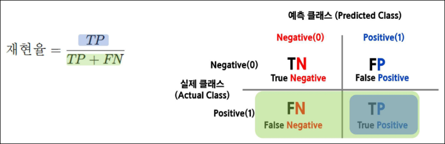
    - $Recall = \frac{TP}{TP + FN}$

- Precision과 Recall의 Trade off
  - 재현율(Recall)이 중요한 경우 -> 실제 Positive(양성)을 놓치면 안 되는 상황
    - ex. 암 진단: 암 환자를 놓치면 치명적
    - ex. 금융 사기 탐지: 사기 거래를 놓치면 피해 발생

  - 정밀도(Precision)이 중요한 경우 -> 실제 Negative(음성)을 잘못 Positive(양성)으로 예측하면 문제가 되는 상황
    - ex. 스팸 필터: 중요한 이메일을 스팸으로 분류하면 안 됨
    - ex. 의료 검사: 불필요한 추가 검사(비용 증가)
  
  - 정밀도와 재현율은 반비례 관계
  - 임계값(Threshold)을 조정하면 정밀도(Precision) 또는 재현율(Recall)을 조절할 수 있음
    - 하지만 정밀도를 높이면 재현율이 낮아지고, 재현율을 높이면 정밀도가 낮아지는 관계

    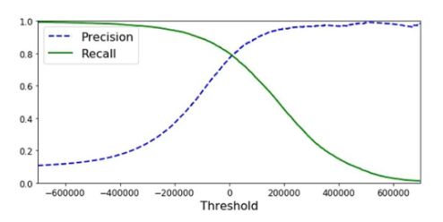
    - 재현율을 높이면 (모든 Positive를 잡으려 함) -> 정밀도가 낮아짐 (False Positive 증가)
    - 정밀도를 높이면 (정확한 Positive만 잡으려 함) -> 재현율이 낮아짐 (False Negative 증가)

- 정밀도를 100%로 만드는 방법
  - 확실한 경우만 Positive로 예측하고 나머지는 모두 Negative로 예측
  - ex. 1000명 중 단 1명만 확실한 양성이라 판단하고 나머지는 모두 음성으로 처리
  - 결과
    - FP(거짓 양성) = 0 -> 정밀도 100%
  - 문제
    - 대부분의 양성을 놓칠 위험 (재현율이 극도로 낮아짐)

- 재현율을 100%로 만드는 방법
  - 모든 데이터를 Positive(양성)으로 예측
  - ex. 1000명 모두 양성이라 가정하면 실제 양성 30명은 모두 검출됨
  - 결과
    - FN(거짓 음성) = 0 -> 재현율 100%
  - 문제
    - 너무 많은 FP(거짓 양성) 발생 -> 정밀도 급락

※ 정밀도와 재현율을 극단적으로 높이면 성능이 왜곡됨

※ 업무에 따라 적절한 균형이 필요 (F1-score 활용)

- F1-score
  - 정밀도와 재현율의 조화 평균

    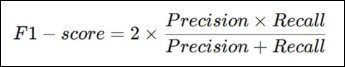
  - 조화평균 특징
    - 작은 값의 영향을 크게 반영함
    - 두 값 중 하나라도 작으면 조화평균 전체가 낮아짐
    - 즉, 둘 다 고르게 높아야 조화평균이 커짐
  - 데이터가 불균형할 때 유용
  - 정밀도와 재현율 사이에서 균형을 맞춘 지표
  - 정밀도와 재현율이 어느 한쪽으로 치우치지 않는 수치를 나타낼 때 높은 값을 가짐
    - Precision이나 Recall 중 하나라도 낮으면 F1 Score도 낮아짐

- ROC 곡선(Receiver Operating Characteristic Curve)
  - False Positive Rate(FPR) 변화에 따른 True Positive Rate(TPR) 변화를 나타내는 그래프
  - X축: False Positive Rate (FPR, 잘못 양성으로 예측한 비율)
  - Y축: True Positive Rate (TPR, 실제 양성을 맞춘 비율)
  - 곡선이 왼쪽 위로 올라갈수록 좋은 모델
    - 좋은 모델은 보통 왼쪽 위 모서리(0,1)에 가까운 형태의 ROC 곡선을 가짐
    - 높은 TPR과 낮은 FPR을 의미
    - 즉, 분류기가 높은 정확도로 예측한다는 것을 나타냄

- AUC (Area Under Curve)
  - ROC 곡선 아래 면적을 의미하며 1에 가까울수록 좋은 성능
  - 일반적으로 의학 및 머신러닝의 이진 분류 평가 지표로 활용됨

    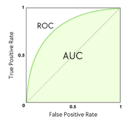

- ROC 곡선과 AUC

  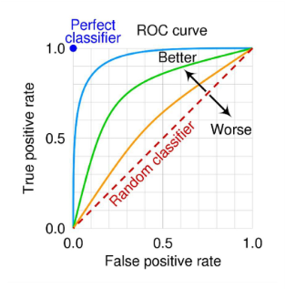
  - TPR (True Positive Rate, 재현율)
    - 실제 양성(Positive) 중에서 모델이 맞게 예측한 비율
    - 값이 클수록 좋은 모델 (양성을 잘 찾아냄)
  - FPR (False Positive Rate)
    - 실제 음성(Negative) 중에서 모델이 잘못 예측한 비율
    - 값이 작을수록 좋은 모델 (불필요한 오답을 줄임)
  - ROC 곡선의 의미
    - X축: `FPR` (False Positive Rate)
    - Y축: `TPR` (True Positive Rate)
    - 곡선이 왼쪽 위로 갈수록 좋은 모델
    - 임계값(Threshold)에 따라 FPR과 TPR이 변화
  - 결론
    - 좋은 모델일수록 ROC 곡선이 좌상단에 위치
    - **AUC (ROC 아래 면적)가 1에 가까울수록 성능이 우수함**


## 벡터의 정의와 개념
### 벡터
벡터는 선형대수학의 기본 요소로, 크기와 방향을 가짐

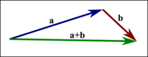

-> 좌표 평면에서 점을 나타낼 때 (x, y)와 같은 형태로 표현

-> 벡터는 머신러닝과 데이터 분석 등에서 데이터를 표현하는 기본 단위로 사용

-> 파이썬에서는 숫자로 이루어진 배열(리스트) 형태로 표현

- 벡터의 좌표
  - 벡터는 좌표로 표현되며, 두 숫자가 원점에서의 이동을 나타냄
  - 첫 번째 숫자는 x축 방향 이동, 두 번째 숫자는 y축 방향 이동
  - 3차원에서는 z축이 추가됨

    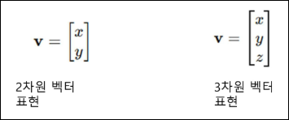

- 데이터를 표현하는 방법
  - 스칼라: 하나의 숫자 (0차원)
  - 벡터: 여러 개의 숫자가 나열된 1차원 배열
  - 행렬: 숫자의 행과 열로 구성된 2차원 배열
  - 텐서: 3차원 이상을 포함하는 행렬보다 높은 다차원 배열

    

- 텐서의 활용
  - 텐서는 공간을 수치적으로 표현하는 도구
  - 데이터 분석에서는 벡터를 사용하여 여러 특성을 표현함
  - 벡터를 이용해 공간 내 객체를 표현하고 조작하는데 활용
  - 텐서를 활용하여 딥러닝, 머신러닝에 적용하여 데이터를 표현함
  - 이를 활용해 복잡한 데이터와 패턴을 학습하고 분석하는 데 사용

    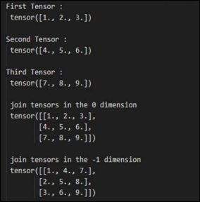


## 추가 개념 및 정리
### 데이터 전처리
- 불필요한 컬럼 제거
  ```python
  data_cleaned = data.drop(columns=['Age', 'Car Color'])
  ```

- 파생 변수 생성
  - 예시: 장거리 여부 플래그 (Feature Creation) 생성
    ```python
    # 기준선 정해두면 집계·비율 확인이 쉬워짐
    # is_long: 기준선 이상이면 1, 아니면 0 (type: int)
    THRESHOLD_KM = 20  # 목적 기준선
    data_feat = data_cleaned.copy()
    data_feat['is_long'] = (data_feat['Distance (km)'] >= THRESHOLD_KM).astype(int)

    print("[파생변수] is_long (>=20km):")
    print(data_feat[['Destination From', 'Destination To', 'Distance (km)', 'is_long']])
    print()
    ```
    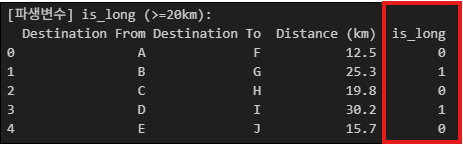
    - `astype(int)`: True/False를 정수로 변환 (True -> 1, False -> 0)
    - `.astype()`: 판다스에서 Series나 DataFrame의 데이터타입을 다른 타입으로 변환할 때 사용하는 메서드
      ```python
      # new_dtype에 int, float, str, bool 등 가능
      df['col'].astype(new_dtype)
      ```

- 결측치 점검 및 이상치 점검
  - 결측치 점검
    ```python
    # 컬럼 별 결측치 개수
    na_summary = data_feat.isna().sum()

    print("[결측치 점검]")
    print(na_summary)
    ```
    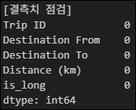

  - 이상치 점검(IQR 방법)
    ```python
    q1 = data_feat['Distance (km)'].quantile(0.25)
    q3 = data_feat['Distance (km)'].quantile(0.75)
    iqr = q3 - q1
    low, high = q1 - 1.5*iqr, q3 + 1.5*iqr
    outliers = data_feat[ (data_feat['Distance (km)'] < low) | data_feat['Distance (km)'] > high ]

    print("[이상치(IQR) 점검]")
    print(f"Q1={q1:.2f}, Q3={q3:.2f}, IQR={iqr:.2f}, 범위=({low:.2f} ~ {high:.2f})")
    print("이상치 후보:\n", outliers if not outliers.empty else "없음")
    ```
    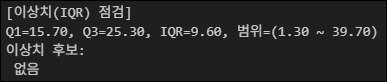

- 범주형 인코딩 (One-Hot Encoding)
  - 예시: 문자형(출발지/도착지)을 0/1 숫자 형태 컬럼으로 변환
    ```python
    encoded = pd.get_dummies(
        data_feat,
        columns=['Destination From', 'Destination To'],
        drop_first=False,
        dtype='int8'
    )

    print("[원-핫 인코딩 결과 컬럼]")
    print(list(encoded.columns))
    # ['Trip ID', 'Distance (km)', 'is_long', 'Destination From_A', 'Destination From_B', 'Destination From_C', ..]
    ```
    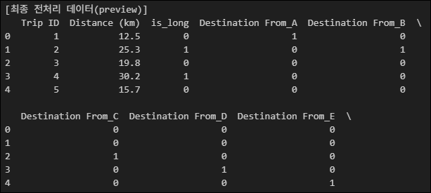

### `pd.get_dummies()` 함수
Pandas에서 제공하는 원-핫 인코딩(One-Hot Encoding) 함수

- **범주형** 데이터를 **0/1 더미 변수(dummy variable)**로 변환
- 각 범주(category)를 새로운 열(column)로 만들고, 해당 범주이면 1, 아니면 0을 채움
- 기본 문법
  ```python
  pd.get_dummies(data, prefix=None, prefix_sep='_', dummy_na=False, 
                columns=None, sparse=False, drop_first=False, dtype=None)
  ```
  - `data`
    - 변환할 대상 (Series, DataFrame)
  - `prefix`
    - 생성되는 더미 변수 컬럼 이름 앞에 붙일 접두사
    - ex. prefix='city' → city_Seoul, city_Busan
  - `prefix_sep`
    - 접두사와 값 사이에 넣을 구분자 (기본값 _)
  - `dummy_na`
    - True: NaN(결측값)도 하나의 카테고리로 처리해 별도 컬럼 생성
    - False: `NaN` 무시
  - `columns`
    - 더미 변수를 만들 컬럼 지정 (DataFrame 입력 시 사용)
    - 지정하지 않으면 문자열/범주형 컬럼 전체에 적용
  - `sparse`
    - 희소 행렬(sparse matrix)로 반환할지 여부 (메모리 절약용)
    - 기본값: False (DataFrame 반환)
  - `drop_first`
    - True: 첫 번째 카테고리를 제거 -> 다중공선성(dummy variable trap) 방지
    - False: 모든 카테고리에 대해 컬럼 생성
  - `dtype`
    - 새로 생성되는 더미 변수의 자료형 (예: np.uint8, int8 등)
    - 기본값: `np.uint8`
  
### 모델 성능 평가
- 실제값(y_true)과 예측값(y_pred) 생성
  ```python
  y_true = [0, 1, 1, 0, 1, 0, 1, 1, 0, 0]  # 실제 값 (Ground Truth, 참값)
  y_pred = [0, 1, 0, 0, 1, 0, 1, 1, 1, 0]  # 모델이 예측한 값 (Predicted Labels)
  ```

- 혼동 행렬
  - 혼동 행렬은 모델이 얼마나 정확하게 예측했는지를 나타내는 중요한 지표
    ```python
    confusion_matrix(y_true, y_pred)
    # [TF, FP]
    # [FN, TP]
    ```
    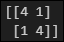

- 정확도(Accuracy) 계산
  ```python
  accuracy = accuracy_score(y_true, y_pred)

  print("\n모델 정확도 (Accuracy): {:.2f}".format(accuracy))
  # 모델 정확도 (Accuracy): 0.80
  ```

- Precision, Recall, F1-score 계산
  ```python
  # 개별 클래스(0: 사고 없음, 1: 사고 발생)에 대한 Precision, Recall, F1-score 계산

  # Precision (정밀도): 모델이 '사고 발생'이라고 예측한 값 중에서 실제로 사고가 발생한 비율
  precision_class_0 = precision_score(y_true, y_pred, pos_label=0)
  precision_class_1 = precision_score(y_true, y_pred, pos_label=1)

  # Recall (재현율): 실제 사고 발생 중에서 모델이 '사고 발생'으로 올바르게 예측한 비율
  recall_class_0 = recall_score(y_true, y_pred, pos_label=0)
  recall_class_1 = recall_score(y_true, y_pred, pos_label=1)

  # F1-score: Precision과 Recall의 조화 평균 (균형을 고려한 성능 평가 지표)
  f1_class_0 = f1_score(y_true, y_pred, pos_label=0)
  f1_class_1 = f1_score(y_true, y_pred, pos_label=1)

  print("\n개별 클래스별 Precision, Recall, F1-score:")
  print("Class 0 - Precision: {:.2f}, Recall: {:.2f}, F1-score: {:.2f}".format(precision_class_0, recall_class_0, f1_class_0))  
  print("Class 1 - Precision: {:.2f}, Recall: {:.2f}, F1-score: {:.2f}".format(precision_class_1, recall_class_1, f1_class_1))  
  ```
  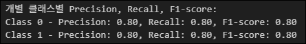

- 전체 Classification Report
  ```python
  print(classification_report(y_true, y_pred))
  ```
  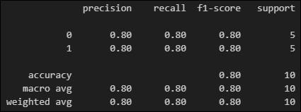

### 모델 성능 평가 함수 정리 (sklearn.metrics)
- 분류(Classification) 평가 함수
  - `confusion_matrix(y_true, y_pred)`  
    - 혼동 행렬 (TP, TN, FP, FN 계산)

  - `accuracy_score(y_true, y_pred)`  
    - 정확도 (전체 예측 중 정답 비율)

  - `precision_score(y_true, y_pred, pos_label=1)`  
    - 정밀도 (양성 예측 중 실제 양성 비율)

  - `recall_score(y_true, y_pred, pos_label=1)`  
    - 재현율 (실제 양성 중 올바르게 맞춘 비율)

  - `f1_score(y_true, y_pred, pos_label=1)`  
    - F1 점수 (정밀도와 재현율의 조화평균)

  - `classification_report(y_true, y_pred)`  
    - Precision, Recall, F1-score, Support(샘플 수)까지 한꺼번에 출력

- 회귀(Regression) 평가 함수
  - `mean_absolute_error(y_true, y_pred)`  
    - MAE (Mean Absolute Error, 평균 절대 오차)  
    - $MAE = \frac{1}{n}\sum |y - \hat{y}|$

  - `mean_squared_error(y_true, y_pred)`  
    - MSE (Mean Squared Error, 평균 제곱 오차)  
    - $MSE = \frac{1}{n}\sum (y - \hat{y})^2$

  - `mean_squared_error(y_true, y_pred, squared=False)`  
    - RMSE (Root Mean Squared Error, 평균 제곱근 오차)  
    - $RMSE = \sqrt{MSE}$

  - `mean_absolute_percentage_error(y_true, y_pred)`  
    - MAPE (Mean Absolute Percentage Error, 평균 절대 백분율 오차)  
    - $MAPE = \frac{100}{n}\sum \left|\frac{y - \hat{y}}{y}\right|$

  - `r2_score(y_true, y_pred)`  
    - $R^2$ Score (결정계수, 설명력)  
    - $R^2 = 1 - \frac{SSE}{SST} = \frac{SSR}{SST}$


