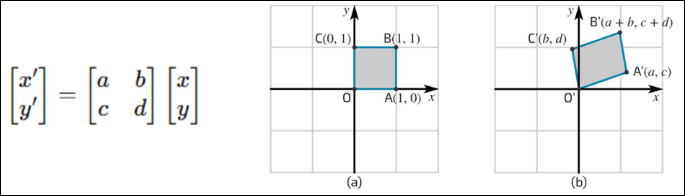
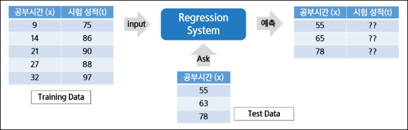
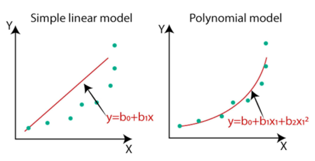

# 데이터 분석을 위한 머신러닝 알고리즘 1
## 선형변환 및 행렬 연산
- 머신러닝과 데이터 분석에서 행렬의 중요성
  - 데이터를 효율적으로 표현하고, 모델을 학습시키기 위해 행렬 사용

  1. 데이터 표현
      - 대부분의 데이터(이미지, 텍스트, 수치 데이터)는 행렬 형태로 저장
  2. 머신러닝 알고리즘
      - 선형 회귀, 로지스틱 회귀, 신경망 등에서 가중치와 데이터 처리 연산 및 데이터 변형, 차원 축소를 위해 행렬 사용
  3. 최적화 및 학습 과정
      - 경사 하강법 등 최적화 알고리즘 및 딥러닝에서 미분과 행렬 연산 사용

### 행렬(Matrix)
숫자가 행(row)과 열(column)로 배열된 2차원 구조

```python
import numpy as np

A = np.array([[1, 2], [3, 4]])
print(A)
```


- 행렬 덧셈과 스칼라 곱
  - 행렬 간 덧셈
    - 같은 크기의 행렬끼리 요소별로 더함
  - 스칼라 곱
    - 행렬의 각 요소에 숫자를 곱함
    ```python
    import numpy as np

    A = np.array([[1, 2], [3, 4]])  # 2x2 행렬
    B = np.array([[5, 6], [7, 8]])  # 2x2 행렬

    C = A + B  # 행렬 덧셈
    D = 2 * A  # 스칼라 곱

    print(C)
    print("=" * 50)
    print(D)
    ```
    

- 행렬 곱(Matrix Multiplication)
  - 두 개의 행렬을 곱하는 연산 
  - `A (m x n) * B (n x p)` -> 결과 행렬 C (m x p)
  - 첫 번째 행렬(A)의 열 개수와 두 번째 행렬(B)의 행 개수가 같아야 곱셈 가능
  - ex. `A (2*3) * B (3*2)` -> 결과 행렬 C (2*2)
    ```python
    import numpy as np

    A = np.array([[1, 2, 3], [4, 5, 6]])
    B = np.array([[7, 8], [9, 10], [11, 12]])

    C = np.dot(A, B)  # 행렬 곱
    print(C)
    # [[ 58  64]
    # [139 154]]
    ```
    
  - `1xn` 행렬과 `nx1` 행렬의 곱으로 표현하는 형태를 벡터의 **내적**이라 볼 수 있음(결과는 스칼라 나옴)
  - 내적의 의미
    - 두 벡터가 얼마나 같은 방향을 가리키는지를 측정
    - 즉, **유사도(Similarity)**를 수치로 나타낸 것
    - 방향이 같으면 크고, 직각이면 0, 반대면 음수
  - `.dot()`
    - 벡터 내적(Dot Product), **행렬 곱(Matrix Multiplication)**을 계산하는 함수
    - 벡터끼리 연산: 내적 결과 = 스칼라(숫자) -> 유사도(방향) 의미함
    - 행렬끼리 연산: 행렬 곱 결과 = 새로운 행렬 -> 선형 변환 결과를 의미함
    - `@` 연산자와 동일 (`A @ B == np.dot(A, B)`)

- 머신러닝에서 행렬 곱 활용
  - 선형 회귀 (Linear Regression)
    - 모델의 가중치와 입력 데이터($x$)의 행렬 곱을 통해 예측값 계산
  - 신경망 (Neural Networks)
    - 각 레이어에서 가중치와 입력 데이터의 행렬 곱 수행

- 전치 행렬 (Transpose Matrix)
  - 행과 열을 바꾸는 연산
  - 행렬 A (m x n)의 전치 행렬 -> $A^T$ (n x m)
  - 원소: $A^T[i, j] = A[j, i]$
    ```python
    import numpy as np

    # 원래 행렬 A (2x3)
    A = np.array([[1, 2, 3],
                  [4, 5, 6]])

    # 전치 행렬 A^T (3x2)
    A_T = A.transpose()

    print("원래 행렬 A:")
    print(A)
    print("\n전치 행렬 A^T:")
    print(A_T)
    ```
    

### 선형 변환 (Linear Transformation)
공간을 변형시키는 규칙(한 벡터를 다른 벡터 공간으로 변환하는 과정)

- 크기(배율을 조절), 회전, 대칭, 변형(왜곡) 같은 작업을 위해 사용
  - 모든 원소에 어떠한 값을 **더하는** 변환은 선형변환XX
    - 즉, 평행이동은 선형변환XX
    - 선형변환은 항상 원점(0)을 원점으로 보내야 하지만, 평행 이동은 원점을 다른 위치로 옮겨버림
    - ex. `T(x)= x + [3,3]` -> 원점이 `0 -> [3,3]`으로 움직였으므로 선형변환XX
- 행렬 연산(특히 행렬 곱)을 통해 구현
- 선형 변환은 공간의 점들을 일정한 규칙에 따라 이동시키는 것
- 데이터 분석에서 차원을 줄여서 중요한 정보만 남길 때 사용가능

  
  - 좌표 하나를 움직였다기엔 좌표 각각이 다름
  - 공간 전체를 정해진 규칙에 따라 변형한 것!

- 선형 변환의 대표 예시
  - 크기 변경 (Scaling)
    - 벡터를 일정 배율로 확대 또는 축소하는 변환
    - 방향은 그대로, 길이만 변환하는 것
    - 스칼라 곱으로 표현 가능
      ```python
      import numpy as np

      A = np.array([[2, 0], [0, 2]])
      v = np.array([3, 4])

      result = np.dot(A, v)
      print(result)
      # [6, 8]
      ```
      


## Regression
### 회귀(Regression)
연속적인 숫자 값을 예측하는 지도 학습의 한 유형

- 목적
  - **입력 데이터를 기반으로 특정 연속적 목표 값(출력)을 예측**하는 것

- 회귀 문제의 목표
  - 입력 변수(특징)를 사용하여 출력 값의 추세를 학습하고, 이를 기반으로 새로운 데이터에 대해 예측을 수행
    
- 회귀 활용 예시
  - 주택 가격 예측
    - 집의 크기, 위치, 연도 등의 정보를 바탕으로 가격을 예측
  - 주식 시장 분석
    - 과거 주가 데이터를 바탕으로 미래 주가를 예측
  - 날씨 예측
    - 기온, 습도, 풍속 등의 데이터를 사용해 내일의 기온을 예측

- 회귀와 분류의 차이점
  - 회귀: 연속적인 값을 예측하는 문제(ex. 온도, 가격).
  - 분류: 이산적인 범주를 예측하는 문제(ex. 스팸/비스팸, 고양이/개)

- 회귀 문제의 예시
  - 주택 가격 예측
    - 주택의 크기, 방 개수, 위치 등의 특징(입력 변수)을 기반으로 주택의 가격(출력 변수)을 예측하는 문제
    - ex. 100m^2의 아파트가 5억 원일 가능성을 예측
  - 주식 시장 분석
    - 과거 주가 데이터, 거래량, 경제 지표 등을 바탕으로 미래 주가를 예측하는 문제
    - ex. 주식 X의 다음 달 가격을 예측
  - 날씨 예측
    - 기온, 습도, 풍속 등의 환경 데이터를 바탕으로 다음 날의 기온을 예측
    - ex. 내일의 최고 기온을 25°C로 예측
  - 자동차 연비 예측
    - 자동차의 배기량, 마력, 중량 등의 데이터를 기반으로 연비를 예측
    - ex. 특정 차량이 1리터당 12km를 갈 가능성 예측
  - 판매량 예측
    - 과거 판매 기록, 계절, 마케틸 투자 등을 통해 미래의 판매량을 예측
    - ex. 특정 제품이 다음 달에 1000개 판매될 가능성 예측

※ 머신러닝이 가진 문제 풀이 방식

-> `x`를 `f(x)`에 넣어서 `y`를 예측($\hat{y}$)

- 입력 변수 (Features, 독립 변수)
  - 회귀 문제에서 입력 변수는 **예측에 필요한 다양한 특성**을 의미
  - 입력 변수는 하나일 수도 있고, 여러 개일 수도 있음
  - 예시
    - 주택 가격 예측에서의 입력 변수: 주택 크기, 위치, 방 개수 등
    - 자동차 연비 예측에서의 입력 변수: 배기량, 중량, 마력 등

- 출력 변수 (Target, 종속 변수)
  - 회귀 문제의 출력은 **예측하고자 하는 연속적인 값**
  - 출력 변수는 모델이 학습하여 예측하는 목표 값
    - 주택 가격 예측에서의 출력 변수: 예측된 주택의 가격
    - 자동차 연비 예측에서의 출력 변수: 1리터당 이동할 수 있는 거리(km/L)

- 모델의 목적
  - 입력 변수(특성)와 출력 변수(목표 값) 간의 관계를 학습해, 새로운 입력이 주어졌을 때 적절한 출력 값을 예측
  - 예시: 주택의 크기와 위치 정보를 입력으로 받아 주택 가격을 예측


- 회귀
  - Training Data를 이용해서 데이터의 특성과 상관 관계 등을 파악하고, 그 결과를 바탕으로 Training Data에 없는 미지의 데이터가 주어졌을 경우에, 그 결과를 연속적인 (숫자) 값으로 예측하는 것
  - ex. 공부시간과 시험 성적 관계 등

    

- 회귀의 종류
  - 단순 선형회귀
    - 한 개의 독립변수(X)로 종속변수(Y)를 예측  
    - 선형적(1차항 이상의 연산없음)
    - 독립변수와 종속변수 간의 관계를 직선(1차 함수)으로 표현 
  - 다중 선형회귀
    - 두 개 이상의 독립변수로 종속변수를 예측
    - 독립변수들이 종속변수에 선형적으로 영향을 준다고 가정
    - 2차원에서는 직선, 3차원 이상에서는 평면(Hyperplane)으로 표현  

    
  - 다항 회귀
    - 독립변수의 2차항 이상을 포함해 종속변수를 예측
    - 실제 데이터가 직선보다 곡선에 더 잘 맞을 때 사용
    - 다항식으로 확장하여 비선형 관계도 표현 가능

      

### 선형 회귀
입력 변수(특성)와 출력 변수(목표 값) 간의 **선형 관계를 가정**하여 예측하는 모델

-> 데이터가 직선으로 표현될 수 있을 때, 가장 간단하고 직관적인 방법

- 모델 수식
  - $y = wx + b$
    - `y` : 출력 값(예측 값)
    - `x` : 입력 값
    - `w` : 가중치(기울기)
    - `b` : 절편

    

- 예측 방법
  - 주어진 데이터를 기반으로 최적의 직선(회귀선)을 찾아 입력 값에 대한 출력 값을 예측
  - 모델은 오차를 최소화하는 방향으로 직선의 기울기 w와 절편 b를 학습

- 장점
  - 해석이 용이하고 계산이 빠름
  - 비교적 단순한 문제에 대해 좋은 성능을 발휘

- 단점
  - 입력 변수와 출력 변수 간의 관계가 비선형적일 경우 성능이 저하될 수 있음
  - 과적합의 위험이 있으며, 다중 공선성이 있을 때 문제가 발생할 수 있음
    - ※ 다중 공선성: 회귀분석에서 독립변수들 간에 강한 선형 상관관계가 존재하는 현상

- 사용 예시
  - 주택 가격 예측 
    - ex. 주택 크기에 따른 가격 예측
  - 광고 비용과 판매량의 관계 분석

- 코드
  ```python
  # 필수 라이브러리 불러오기
  from sklearn.model_selection import train_test_split
  from sklearn.linear_model import LinearRegression
  from sklearn.metrics import mean_squared_error, r2_score
  from sklearn.datasets import fetch_california_housing
  import pandas as pd

  # 캘리포니아 주택 가격 데이터셋 로드
  data = fetch_california_housing()
  X = pd.DataFrame(data.data, columns=data.feature_names)  # 독립 변수(특징 데이터)
  y = data.target  # 종속 변수 (중간 주택 가격)

  # 주택 크기(House Size) 특성만 선택
  X_house_size = X[['HouseAge']]

  # 데이터를 학습용 및 테스트용 데이터로 분할
  X_train, X_test, y_train, y_test = train_test_split(
      X_house_size, y, test_size=0.3, random_state=42
  )

  # 선형 회귀 모델 학습
  model = LinearRegression()
  model.fit(X_train, y_train)

  # 예측 수행
  y_pred = model.predict(X_test)

  # 모델 평가
  mse = mean_squared_error(y_test, y_pred)  # 평균 제곱 오차 계산
  r2 = r2_score(y_test, y_pred)  # 결정 계수(R²) 계산

  # 결과 출력
  print(f"Mean Squared Error (MSE): {mse:.2f}")
  print(f"R² Score: {r2:.4f}")
  ```
  
  - train_test_split
    ```python
    from sklearn.model_selection import train_test_split
    ```
    - 데이터를 학습용(train)과 테스트용(test)으로 분할하는 함수
    - 주요 파라미터
      - `X`, `y`: 입력 데이터와 레이블(목표값)
      - `test_size`: 테스트 데이터 비율 
      - `random_state`: 랜덤 시드(재현성을 위해 고정)

  - LinearRegression
    ```python
    from sklearn.linear_model import LinearRegression
    ```
    - 선형 회귀 모델 클래스
    - 입력 변수(특성)와 출력 변수 간의 선형 관계를 학습
    - 주요 메서드
      - `.fit(X_train, y_train)` : 모델 학습
      - `.predict(X_test)` : 학습된 모델로 새로운 데이터 예측
      - `.coef_` : 회귀 계수(가중치, w 값)
      - `.intercept_` : 절편(bias, b 값)

  - mean_squared_error
    ```python
    from sklearn.metrics import mean_squared_error
    ```
    - 회귀 모델 평가 지표 중 하나
    - 실제값(y_true)과 예측값(y_pred)의 차이 제곱 평균
    - 값이 작을수록 모델의 예측이 실제와 가깝다
  
  - r2_score
    ```python
    from sklearn.metrics import r2_score
    ```
    - 결정계수(R², Coefficient of Determination)
    - 모델이 데이터를 얼마나 잘 설명하는지 비율로 나타냄


### 다중 회귀
여러 개의 입력 변수(특성)를 사용하여 출력 변수를 예측하는 선형 회귀 모델
  
-> 단일 입력 변수를 사용하는 선형 회귀와 달리, 다중 회귀는 다수의 변수를 고려하여 보다 정확한 예측 가능

- 모델의 수식
  - $y = w_1x_1 + w_2x_2 + ... + w_nx_n + b$
    - `y` : 예측 값
    - $x_1, x_2, ... , x_n$ : 입력 변수들
    - $w_1, w_2, ... , w_n$ : 각 특성의 가중치
    - `b` : 절편

- 예측 방법
  - 각 입력 변수에 해당하는 가중치를 곱한 수, 그 값을 모두 더하여 예측 값을 계산
  - 모델은 모든 입력 변수의 영향을 고려하여 오차를 최소화하는 방향으로 가중치와 절편을 학습

- 코드
  ```python
  # 필요한 라이브러리 임포트
  from sklearn.model_selection import train_test_split
  from sklearn.linear_model import LinearRegression
  from sklearn.metrics import mean_squared_error, r2_score
  from sklearn.datasets import fetch_california_housing
  import pandas as pd
  import matplotlib.pyplot as plt

  # 캘리포니아 주택 가격 데이터셋 로드
  data = fetch_california_housing()
  X = pd.DataFrame(data.data, columns=data.feature_names)  # 특성 데이터
  y = data.target  # 목표 변수 (중간 주택 가격)

  # 데이터를 학습용 및 테스트용으로 분할
  X_train, X_test, y_train, y_test = train_test_split(X, y, test_size=0.3, random_state=42)

  # 선형 회귀 모델 학습
  model = LinearRegression()
  model.fit(X_train, y_train)

  # 예측 수행
  y_pred = model.predict(X_test)

  # 모델 평가
  mse = mean_squared_error(y_test, y_pred)  # 평균 제곱 오차 계산
  r2 = r2_score(y_test, y_pred)  # 결정 계수(R²) 계산

  # 결과 출력
  print(f"Mean Squared Error (MSE): {mse:.2f}")
  print(f"R² Score: {r2:.4f}")
  ```
  
  - 선형 회귀와 모델 훈련, 예측 과정은 동일함
    - `X`에 포함되는 **열의 개수**에만 차이가 있음
      ```python
      X = pd.DataFrame(data.data, columns=data.feature_names)  # 모든 독립변수 사용
      ```

※ 선형 회귀 vs 다중 회귀


### 다항 회귀
입력 변수(특성)와 출력 변수(목표 값) 간의 **비선형 관계**를 가정하여 예측하는 회귀 방법

-> 선형 회귀와 달리, 입력 변수의 거듭제곱을 포함한 **다항식을 사용하여 비선형 패턴을 학습**

- 장점
  - 데이터가 비선형적인 경우, 선형 회귀보다 더 나은 예측 성능을 보임
  - 다양한 비선형 패턴을 유연하게 모델링할 수 있음

- 단점
  - 과적합(Overfitting)의 위험이 큼
  - 특히 다항 차수가 높아질수록 모델이 복잡해져 과적합 가능성이 증가
  - 데이터가 부족할 경우, 모델이 안정적이지 않을 수 있음

- 사용 예시
  - 곡선 패턴이 있는 데이터 예측
    - ex. 온도 변화에 따른 전력 사용량 예측
  - 주택 가격 예측에서, 방 개수와 가격 간의 비선형 관계 모델링

- 모델 수식
  - $y = w_1x + w_2x^2 + w_3x^3 + ... + w_nx^n + b$
    - `y` : 예측 값
    - `x` : 입력 변수
    - $w_1, w_2, ... , w_n$ : 각 특성의 가중치
    - `b` : 절편

- 예측 방법
  - 입력 값 x의 거듭제곱을 사용해 곡선 형태의 관계를 모델링
  - 선형 회귀로는 설명할 수 없는 비선형 패턴을 더 잘 포착 가능

- 코드
  ```python
  # 필요한 라이브러리 임포트
  from sklearn.model_selection import train_test_split
  from sklearn.preprocessing import PolynomialFeatures
  from sklearn.linear_model import LinearRegression
  from sklearn.metrics import mean_squared_error, r2_score
  from sklearn.datasets import fetch_california_housing
  import pandas as pd
  import numpy as np
  import matplotlib.pyplot as plt

  # 캘리포니아 주택 가격 데이터셋 로드
  data = fetch_california_housing()
  df = pd.DataFrame(data.data, columns=data.feature_names)  # 데이터를 DataFrame으로 변환
  df["MedHouseVal"] = data.target  # 목표 변수(주택 가격) 추가

  # 특정 특성 선택 (가구당 평균 방 개수)
  X = df[["AveRooms"]]  # 독립 변수(특징)
  y = df["MedHouseVal"]  # 종속 변수(주택 가격)

  # 데이터를 학습용 및 테스트용으로 분할
  X_train, X_test, y_train, y_test = train_test_split(X, y, test_size=0.3, random_state=42)

  # 다항 특성 변환 (차수=2)
  poly = PolynomialFeatures(degree=2)  # X를 [1, X, X^2] 형태로 변환
  X_train_poly = poly.fit_transform(X_train)
  X_test_poly = poly.transform(X_test)

  # 다항 회귀 모델 학습
  model = LinearRegression()
  model.fit(X_train_poly, y_train)

  # 예측 수행
  y_pred = model.predict(X_test_poly)

  # 모델 평가
  mse = mean_squared_error(y_test, y_pred)  # 평균 제곱 오차 계산
  r2 = r2_score(y_test, y_pred)  # 결정 계수(R²) 계산

  # 결과 출력
  print(f"Mean Squared Error (MSE): {mse:.2f}")
  print(f"R² Score: {r2:.4f}")
  ```
  

  - PolynomialFeatures
    ```python
    from sklearn.preprocessing import PolynomialFeatures
    poly = PolynomialFeatures(degree=2)
    ```
    - 입력 데이터 X를 다항식 특성으로 확장해줌
    - 파라미터
      - `degree`: 다항식 차수
      - `include_bias`: True면 상수항 1 추가 (기본값 True)
      - `interaction_only`: 상호작용 항만 포함할지 여부 (기본값 False)
    - 메서드
      - `.fit_transform(X)`: 학습 + 변환 (훈련 데이터에 사용)
      - `.transform(X)`: 변환만 수행 (테스트 데이터에 사용)
    - 예시
      ```python
      X = [[2], [3]]
      poly = PolynomialFeatures(degree=2)
      print(poly.fit_transform(X))
      # [[1, 2, 4], [1, 3, 9]]
      ```
  
  - fit_transform / transform 
    - `fit_transform`: **훈련 데이터**를 기준으로 변환 규칙을 학습(fit)한 뒤, 변환(transform)까지 수행
    - `transform` : 이미 학습된 규칙을 그대로 적용 (**테스트 데이터 변환할 때 사용**)

※ 선형 회귀 vs 다항 회귀




---
---
---

## 베이즈 정리, 나이브 베이즈
  - 문제
    - 문제 정의: 10만개의 메일 중 스팸 메일과 정상 메일을 분류하고 싶다면?
    - 메일: 독립 사건으로 가정하는 텍스트 데이터
    - 해결방안: 나이브 베이즈 분류 알고리즘 활용
  - 나이브 베이즈 분류
    - 각 특징들이 독립적(서로 영향을 미치지 않을 것)이라는 가정 설정
    - 베이즈 정리(Bayes Rule)를 활용한 확률 통계학적 분류 알고리즘
  - 베이즈 정리
    - 맑은 날 비가 오지 않을 확률은?
    - P(비가 안옴 | 맑은 날) = P(맑은 날|비가 안옴) * P(비가 안옴) / P(맑은 날)
  - 베이즈 정리
    - 문제 적용: 스팸 메일 분류
      - 스팸 메일과 정상 메일의 단어를 체크
      - 새로운 메일의 단어들에 대한 확률로 스팸 메일을 구분
      - P(스팸단어1, 단어2, 단어3...) > P(정상단어1, 단어2, 단어3...) 이면 스팸
  - 나이브 베이즈 분류
    - 베이즈 정리를 활용하여 입력값이 해당 클래스에 속할 확률을 계산하여 분류
      - P(스팸단어1, 단어2, 단어3...) > P(정상단어1, 단어2, 단어3...) 이면 스팸
    - 각 특징들이 독립이라면 다른 분류 방식에 비해 결과가 좋고, 학습 데이터도 적게 필요
    - 각 특징들이 독립이 아니라면 즉, 특징들이 서로 영향을 미치면 분류 결과 신뢰성 하락
    - 학습 데이터에 없는 범주의 데이터일 경우 정상적 예측 불가능


    
## Classification
  - 분류(Classification)란 무엇인가?
    - 분류의 정의
      - 분류는 입력 데이터를 여러 개의 카테고리 중 하나에 속하도록 지정하는 작업
      - 주로 지도 학습(Supervised Learning) 방식으로 이루어지며, 데이터의 특징(Feature)을 기반으로 해당 데이터가 어느 범주에 속하는지를 예측
    - 분류 문제의 목표
      - 학습 알고리즘은 함수 f 를 생성하여 입력 벡터 x 가 어떤 카테고리 y 에 속하는지를 예측
      - 예를 들어, 이미지 인식에서 입력은 이미지의 픽셀 값으로 이루어지고, 출력은 이미지에 포함된 객체를 나타내는 카테고리 번호
    - 분류 문제의 예시
      - 객체 인식(Object Recognition): 이미지 속 사물(예: 음료수 종류)을 인식하여 해당 사물이 무엇인지 분류하는 작업
      - 얼굴 인식(Face Recognition): 사진 속 인물을 인식하고 자동으로 태그하는 기술로, 사용자와 컴퓨터 간의 자연스러운 상호작용을 가능하게 함
  - 분류와 회귀의 차이
    - 분류(Classification)
      - 정의: 데이터를 미리 정의된 카테고리(범주)로 분류하는 작업
      - 출력값: 이산적인 값(카테고리 또는 레이블)
      - 예시: 이메일이 스팸인지 아닌지 구분, 암 진단 여부(양성/음성) 분류, 이미지 속 객체 인식
    - 회귀(Regression)
      - 정의: 연속적인 숫자 값을 예측하는 작업
      - 출력값: 연속적인 실수 값
      - 예시: 주택 가격 예측, 온도 변화 예측, 주식 시장 가격 예측
    - 핵심 차이점
      - 분류는 결과가 ‘카테고리’로 나타나며, 이산적인 값으로 분류
      - 회귀는 결과가 ‘숫자’로 나타나며, 연속적인 값을 예측
  - 분류
    - Training Data를 이용해서 데이터의 특성과 상관 관계 등을 파악하고,
      그 결과를 바탕으로 Training Data에 없는 미지의 데이터가 주어졌을 경우에,
      그 결과를 어떤 종류의 값으로 분류 될 수 있는지 예측하는 것
    - (예) 스팸문자 분류(Spam or Ham), 암 판별(악성종양 or 종양)
  - 분류 문제의 입력과 출력
    - 입력 데이터 (Features, 입력 변수)
      - 분류 문제에서 입력 데이터는 하나 이상의 특징(Feature)으로 이루어진 벡터로 표현
      - 특징 벡터
        - 예: 이미지 인식에서 이미지의 각 픽셀 값이 특징이 될 수 있음
        - 입력 데이터는 연속형(숫자) 또는 이산형(범주형) 값으로 구성될 수 있음
    - 출력 데이터 (Labels, 출력 변수)
      - 분류 문제의 출력은 데이터가 속한 클래스(범주)를 나타냄
      - 출력 레이블: y
        - 예: 이진 분류에서 출력은 0(음성) 또는 1(양성)
        - 다중 클래스 분류에서는 y가 1, 2, 3 등 여러 클래스를 나타냄
    - 입력과 출력의 관계
      - 분류 모델은 주어진 입력 x에 대해 적절한 출력 y를 예측하는 함수 f(x)를 학습
      - 예시: f(x)는 특정 사진을 입력받아 그것이 고양이인지, 개인지, 또는 새인지를 예측
  - 결정 경계 (Decision Boundaries)란?
    - 분류 모델이 데이터를 분류하기 위해 공간을 나누는 경계선
    - 입력 데이터를 특징 공간(Feature Space)에서 서로 다른 클래스 영역으로 구분
  - 결정 경계의 역할
    - 각 클래스에 속하는 데이터 포인트를 구분하는 기준을 제공
    - 새로운 데이터가 주어졌을 때, 그 데이터가 어느 클래스에 속하는지 결정
  - 결정 경계의 예시
    - 선형 결정 경계
      - 단순한 직선이나 평면으로 클래스 간의 경계를 나눔
      - 예: 로지스틱 회귀, 선형 서포트 벡터 머신(SVM)
    - 비선형 결정 경계
      - 더 복잡한 경계를 만들어 클래스 간의 경계를 나눔
      - 예: 결정 트리, 랜덤 포레스트, 심층 신경망(Deep Neural Networks)
  - 결정 경계 시각화
    - 2차원 특징 공간에서는 결정 경계를 쉽게 시각화 가능
    - 각 클래스 영역이 어떻게 나누어져 있는지를 시각적으로 표현하면 모델의 동작을 더 쉽게 이해할 수 있음
  - 분류 문제에 회귀 알고리즘 적용하기
    - 일반적인 회귀 알고리즘은 분류 문제에 그대로 사용할 수 없음
    - Why? 선형 회귀는 -∞ ~ +∞의 값을 가질 수 있음
      - 우리의 목표는 지연 여부 판별인데 결과값이 1000이라면?
  - 로지스틱 회귀
    - 해당 클래스에 속할 확률인 0 또는 1 사이의 값만 내보낼 수 있도록 선형 회귀 알고리즘 수정하기
    - 이처럼 분류 문제에 적용하기 위해 출력 값의 범위를 수정한 회귀를 로지스틱 회귀(Logistic Regression)라고 함
      - 최소값 0, 최대값 1로 결과값을 수렴시키기 위해 Sigmoid (logistic) 함수 사용
  - 로지스틱 회귀 (Logistic Regression)란?
    - 이진 분류를 위한 대표적인 선형 모델
    - 입력 데이터를 기반으로 특정 클래스에 속할 확률을 예측
    - 회귀라는 이름이 붙었지만 분류 문제에 사용
  - 로지스틱 함수 (Sigmoid 함수)
    - 예측값을 0과 1 사이의 확률로 변환하는 함수
  - 장점
    - 해석이 간단하고 계산이 빠름
    - 데이터가 선형적으로 분리될 수 있는 경우 좋은 성능
  - 단점
    - 비선형 데이터에는 적합하지 않을 수 있음
    - 복잡한 결정 경계를 만들기 어려움
  - 로지스틱 함수
    - S자형 곡선을 가지는 함수
      - x 값이 커질 경우 g(x) 값은 점점 1에 수렴하고, x 값이 작아질 경우 g(x) 값은 점점 -에 수렴
  - 결정 트리(Decision Tree)란?
    - 데이터를 feature에 따라 트리 구조로 분할하여 분류하거나 예측하는 알고리즘
    - 각 노드는 특성의 조건을 기반으로 데이터를 분기하며, 최종 리프 노드는 예측 결과(클래스)를 나타냄
  - 작동 방식
    1. 특성 선택: 각 특성을 기준으로 데이터를 분할할 수 있는 최적의 조건을 찾음
    2. 분할: 데이터를 해당 특성 조건에 따라 좌우로 분기함
    3. 리프 노드 도달 시 각 분할된 노드가 특정 클래스(분류)로 분류될 때까지 분할을 반복함
  - 특성 선택 기준
    - 지니 지수(Gini Index) 또는 엔트로피(Entropy)를 사용하여 분할의 순도를 측정
    - 순도가 높을수록(한쪽 클래스만 치우칠수록) 해당되는 특성은 더 좋은 분할 기준(값이 작으면 좋음)
  - 장점
    - 해석이 용이: 트리 구조로 시각화가 가능하며, 결과 해석이 직관적
    - 비선형 데이터에도 적합: 복잡한 결정 경계를 만들 수 있음
    - 데이터 전처리 과정이 간단하며, 범주형 데이터도 다룰 수 있음
  - 단점
    - 트리가 너무 깊어지면 과적합(overfitting)의 위험이 있음
    - 작은 변화에도 모델이 민감하게 반응할 수 있음
    - 데이터가 많아질수록 성능 저하가 발생할 수 있음
  - 사용 예시
    - 고객 이탈 예측
    - 의사결정 지원 시스템
    - 의료 진단 등 다양한 분야에서 활용
## KNN
  - k-최근접 이웃 알고리즘 (k-Nearest Neighbors, k-NN) 이란?
    - 지도 학습에서 사용되는 간단한 분류 알고리즘
    - 데이터 포인트가 주어졌을 때, 그 데이터와 가장 가까운 k개의 이웃을 기준으로 클래스를 결정
  - 작동 방식:
    1. 거리 계산: 새로운 데이터와 훈련 데이터 간의 거리를 계산
    2. k개의 이웃 선택: 가장 가까운 k개의 이웃을 선택
    3. 다수결 투표: 선택된 이웃 중 가장 많은 클래스에 속하는 클래스를 새로운 데이터의 클래스로 예측
  - 하이퍼파라미터 k
    - k값은 미리 정해지는 값이며, k가 너무 작으면 과적합(overfitting)이 발생하고, k가 너무 크면 과소적합(underfitting)이 발생할 수 있음
  - 장점
    - 직관적이고 이해하기 쉬움
    - 복잡한 결정 경계도 학습할 수 있음
  - 단점
    - 데이터가 많아지면 계산 비용이 많아짐
    - 차원의 저주(Curse of Dimensionality)에 취약함
    - 중요한 특징을 자동으로 학습하지 않으므로 Feature Engineering이 필요할 수 있음
  - 사용 예시
    - 이미지 인식, 추천 시스템, 패턴 인식 등에서 사용
  - k-최근접 이웃 알고리즘 (k-Nearest Neighbors, k-NN) 이란? (설명 보강)
    - 기존 데이터 가운데 가장 가까운 k개 이웃의 정보로 새로운 데이터를 예측하는 방법론
    - 유사한 특성을 가진 데이터는 유사 범주에 속하는 경향이 있다는 가정 하에 분류
    - 설정된 K값에 따라 가까운 거리 내의 이웃의 수에 따라 분류
    - 새로운 고객 데이터(검정색)가 들어왔을 때 만약
      - K=1이면 주황색 클래스로 분류
      - K=30이면 초록색 클래스로 분류