# 데이터 분석을 위한 머신러닝 알고리즘 2
## SVM
### 서포트 벡터 머신(SVM)
여백(Margin)을 최대화하는 초평면(Hyperplane)을 찾는 지도 학습 알고리즘

-> 딥러닝의 대두 이전까지 **분류, 회귀에 모두 사용**할 수 있는 매우 강력한 모델

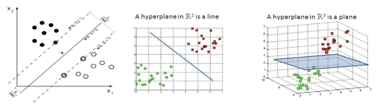

-> 두 그룹을 나누기에 가장 좋은 선, 면을 찾는 방법

-> 가장 좋은 선은 두 그룹의 간격이 가장 넓어지는 선을 의미함

- 서포트 벡터 머신(SVM)
  - 데이터를 고차원 공간에 매핑하여 두 클래스를 최대한 잘 구분할 수 있는 최적의 초평면(Hyperplane)을 찾는 분류 알고리즘
  - 이 초평면과 가장 가까운 데이터 포인트(서포트 벡터)들에 의해 결정

- 작동 방식
  1. 초평면 결정
      - 두 클래스 사이의 간격(마진)을 최대화하는 초평면을 찾음
  2. 서포트 벡터
      - 초평면에 가장 가까운 데이터 포인트들이 서포트 벡터 역할을 하며, 이들이 결정 경계를 형성
  3. 비선형 데이터 처리
      - 커널 트릭(Kernel Trick)을 사용하여 비선형 데이터를 고차원 공간으로 변환한 후, 선형 분리를 수행할 수 있음
      - 원래 공간에서는 곡선(비선형 경계)으로 나눠야 하는 데이터를, 고차원에서는 직선(선형 초평면)으로 나눌 수 있게 만들어줌

      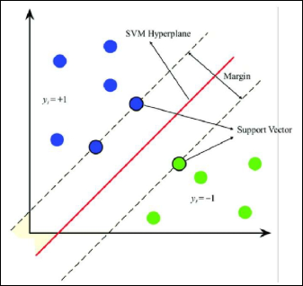

- 장점
  - 상대적으로 데이터의 이해도가 떨어져도 사용이 용이함
    - 피처 수가 많고, 샘플 수가 적을 때 유용하게 사용 가능
    - 왜? SVM은 전체 데이터를 쓰는 것이 아니라, 결정 경계 근처의 데이터 포인트들을 사용하기 때문
    - 즉, 서포트 벡터가 마진을 결정함 -> 데이터가 많지 않아도 충분히 괜찮은 Hyperplane을 찾을 수 있음
  - 예측 정확도가 통상적으로 높음
    - 커널 트릭으로 비선형 데이터까지 선형 분리 가능하기 때문

- 단점
  - C(에러에 부여하는 가중치)를 결정해야 함
    - 에러를 얼마나 허용할지 결정하는데, 너무 크면 과적합/너무 적으면 과소적합
  - 파라미터의 결정과 모형의 구축에 시간이 오래걸림
    - 커널 트릭이 가진 문제점 -> 거리(내적) 계산 해야하므로 상대적으로 연산량 늘고 학습속도 느림

### 여백(Margin)
주어진 데이터가 오류를 발생시키지 않고 움직일 수 있는 최대공간

-> 분류 문제와 회귀 문제 각각의 문제에 따라 정의가 다름

  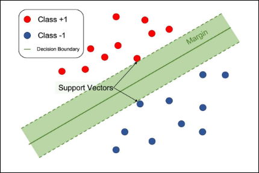

- 최적의 결정 경계(Decision Boundary)
  - 최적의 결정 경계는 데이터 군집으로부터 최대한 멀리 떨어지는 것

    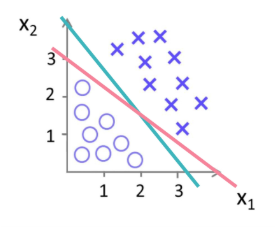

- 분류에서의 여백(Margin)
  - 데이터가 2차원이며, 라벨은 파란색과 빨간색 두개의 클래스가 있다고 가정
  - 이를 분류하는 초평면은 초록색 직선
    - 1번 데이터를 기준으로 해당 데이터가 직선과 수직으로 움직일 때
    - 1번 데이터가 직선을 초과해 움직이면, 해당 데이터를 직선이 빨간색 데이터로 예측해 오류가 발생
  - 즉, **파란색 1번 데이터와 직선과의 거리가 여백(Margin)임**

    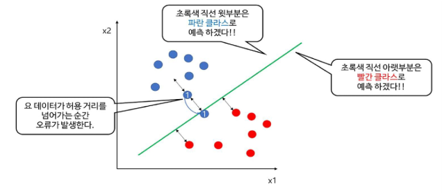

- 회귀에서의 여백(Margin)
  - 단순 선형 모델(설명 변수 1개)를 생성하고, 데이터들이 초평면으로부터 `ε > 0` 범위 내에 있다고 가정
    - `ε` : 허용 가능한 오차 범위
  - 데이터들은 초록색 직선으로 부터 `ε` 범위(양쪽 점선 사이)에 있으며, 데이터들은 x축 상에서 움직임
    - 양 점선 사이의 수평거리를 데이터가 넘어가게 되면 `ε` 범위를 넘어가게 되어 오류를 발생시킴
  - 즉, **양 점선 사이의 수평거리가 여백(Margin)임**
    
    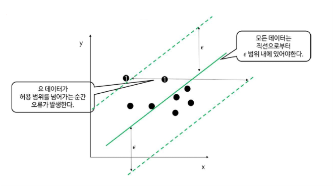

- `Soft Margin` vs `Hard Margin`
  - Soft Margin
    - Soft Margin은 결정 경계를 조금씩 넘어가는 데이터들을 어느 정도 허용하여 **유연한 결정 경계**를 만듦
    - 아래와 같은 데이터 분포는 직선으로 두 클래스를 분류하기 어렵기 때문에 어느 정도의 비용(Cost, C)을 감수하면서 가장 최선의 결정 경계를 찾음

      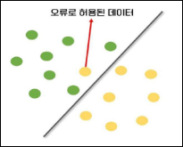
    - Cost는 모델링을 하면서 설정 가능
    - Cost 값이 크면 클수록 Hard Margin을, 작으면 작을수록 Soft Margin을 만듦
    - 즉, Cost (C)는 마진 위반에 부여하는 패널티의 강도를 조절하는 하이퍼파라미터

  - Hard Margin
    - Hard Margin은 이상치들을 허용하지 않고, **분명하게 나누는 결정 경계**를 만듦
    - 과적합(Overfitting)의 오류가 발생하기 쉬움
    - 노이즈로 인해 최적의 결정 경계를 잘못 설정하거나 못 찾는 경우가 발생할 수 있음

      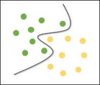

---
---
---

- Kernel Trick
  - SVM은 기본적으로 선형 분류를 위한 결정 경계를 만들지만, Kernel Trick을 사용한다면 비선형 분류도 가능
  - 아래와 같은 데이터 분포는 저차원(2D)에서는 선형 분리가 되지 않을 수 있지만, 고차원(3D)에서는 선형 분리가 가능

    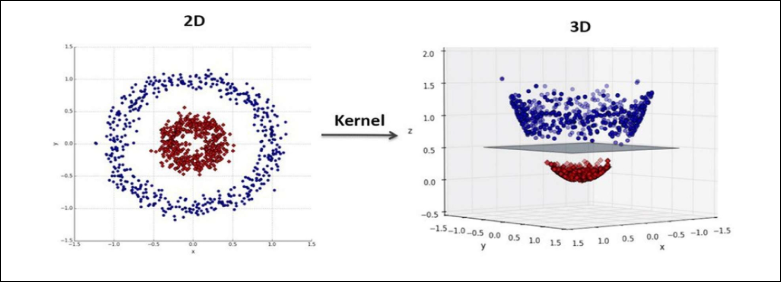
  - '데이터를 고차원으로 보내서 서포트 벡터를 구하고 다시 저차원으로 축소하는 과정'은 복잡하고 많은 연산량이 필요하기 때문에 Kernel Trick을 사용
  - **Kernel Trick은 선형 분리가 불가능한 저차원 데이터를 고차원으로 보내 선형 분리**를 하는 이론을 이용한 일종의 Trick 기법
  - Kernel Trick은 고차원 Mapping과 고차원에서의 연산이 가능함

- 대표적인 Kernel 함수

  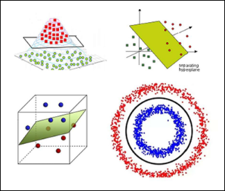
  - Linear 선형 함수
  - Poly 다항식 함수
  - RBF 방사 기저 함수
  - Hyperbolic Tangent 쌍곡선 탄젠트

- 코드
  ```python
  # 필요한 라이브러리 임포트
  from sklearn.model_selection import train_test_split
  from sklearn.svm import SVC
  from sklearn.metrics import accuracy_score
  from sklearn.datasets import load_digits

  # 데이터셋 로드 (Iris 데이터셋 사용)
  data = load_digits()
  X = data.data  # 특성 데이터
  y = data.target  # 목표 변수 (클래스 레이블)

  # 데이터를 학습용 및 테스트용으로 분할
  X_train, X_test, y_train, y_test = train_test_split(X, y, test_size=0.3, random_state=42)

  # SVM 모델 학습 (선형 커널 사용)
  model = SVC(kernel='linear', random_state=42)  # 선형 커널 SVM 모델 생성
  model.fit(X_train, y_train)

  # 예측 수행
  y_pred = model.predict(X_test)

  # 모델 평가
  accuracy = accuracy_score(y_test, y_pred)  # 정확도 계산

  # 결과 출력
  print(f"Accuracy: {accuracy * 100:.2f}%")
  ```
  - SVC (Support Vector Classification)
    - `kernel` : 커널 종류 선택
      - `linear` : 선형 초평면
      - `rbf` : 가우시안(RBF) 커널 (비선형 데이터에 많이 사용)
      - `poly` : 다항식 커널
      - `sigmoid` : 시그모이드 커널
    - `C`: 규제(Regularization) 강도 (기본값=1.0) -> 크면 Hard Margin, 작으면 Soft Margin
    - `gamma` : RBF, poly 커널에서 데이터 영향 범위 조절
    - `random_state` : 결과 재현성을 위해 난수 고정


## Tree 기반 모델과 앙상블 기법
### 의사결정 트리(Decision Tree)
**분류, 회귀 문제에 모두 사용**할 수 있는 모델로, 의사결정 트리는 입력 변수를 특정한 기준으로 분기해 트리 형태의 구조로 분류하는 모델

  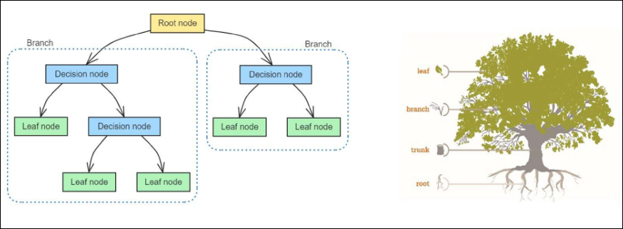

- 장점
  - 해석이 쉬움
  - 입력 값이 주어졌을 때 설명 변수의 영역의 흐름을 따라 출력값이 어떻게 나오는지 파악하기 용이

- 단점
  - 예측력이 떨어짐
  - 단순히 평균 또는 다수결 법칙에 의해 예측을 수행
  - 회귀모델에서 반응 변수의 평균을 예측값으로 추정할 때 평균을 사용해 이상치에 영향을 많이 받음

- 구성 예시

  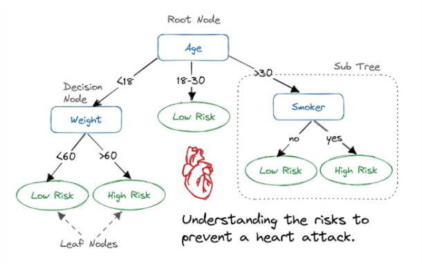

### 앙상블 학습(Ensemble Learning)
여러 개의 분류기를 생성하고, 그 에측을 결합함으로써 보다 정확한 예측을 도출하는 기법

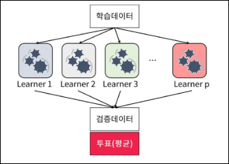

-> 강력한 하나의 모델을 사용하는 대신 보다 약한 모델 여러 개를 조합하여 더 정확한 예측에 도움을 주는 방식

-> **보팅(Voting), 배깅(Bagging), 부스팅(Boosting)** 세 가지의 유형이 존재

- 보팅(Voting)
  - 여러 개의 분류기가 투표를 통해 최종 예측 결과를 결정하는 방식
  - 서로 다른 알고리즘을 여러 개 결합하여 사용

    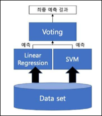

- 보팅 방식
  - 하드 보팅(Hard Voting)
    - 다수의 분류기가 예측한 결과값을 최종 결과로 선정

      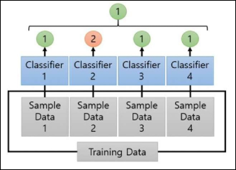
  - 소프트 보팅(Soft Voting)
    - 모든 분류기가 예측한 레이블 값의 결정 확률 평균을 구한 뒤 가장 확률이 높은 레이블 값을 최종 결과로 선정

      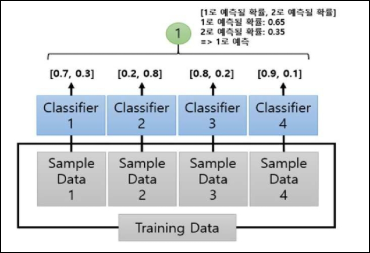

- 배깅(Bootstrap AGGregatING, Bagging)
  - 데이터 샘플링(Bootstrap)을 통해 모델을 학습시키고 결과를 집계(Aggregation)하는 방법으로 **모두 같은 유형의 알고리즘 기반의 분류기를 사용**

    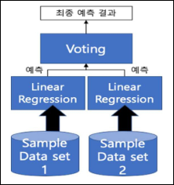
  - 데이터 분할 시 중복을 허용
  - 범주형 데이터는 다수결 투표 방식으로 결과 집계
  - 연속형 데이터는 평균값 집계를 활용
  - **과적합(Overfitting) 방지에 효과적**

- 부스팅(Boosting)
  - 여러 개의 분류기가 순차적으로 학습을 수행
  - 이전 분류기가 틀린 데이터를 다음 분류기가 더 잘 맞출 수 있도록 가중치를 부여하며 학습을 이어감

    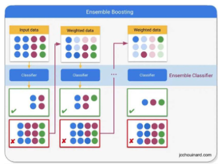
  - 예측 성능이 뛰어나 앙상블 학습을 주도
  - 보통 부스팅 방식은 배깅에 비해 성능이 좋음
    - 그러나, 속도가 느리고 과적합이 발생할 가능성이 존재하므로 상황에 따라 적절하게 사용해야 함
  - 대표적인 부스팅 모듈 `XGBoost`, `AdaBoost`, `Gradient Boosting`

### 랜덤 포레스트(Random Forest)
여러 개의 결정 트리들을 임의적으로 학습하는 방식의 앙상블 방법

-> 여러가지 학습기들을 생성한 후 이를 선형 결합하여 최종 학습기를 만드는 방법

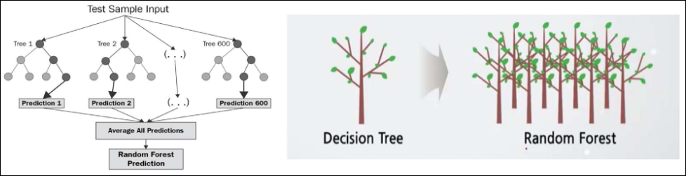

- 기반 기술
  - 의사결정 트리
    - 여러가지 요소를 기준으로 갈라지는 트리형태로 구성하여 분석하는 기법
    - 의사결정 트리의 한계
      - 학습 데이터에 따라 생성되는 결정 트리가 크게 달라져 일반화가 어려운 과적합 문제 발생
      - 계층적 접근방식으로, 중간에 에러 발생 시 하위 계층으로 에러
  - 앙상블 학습
    - 주어진 데이터를 여러 모델로 학습하고 종합하여 정확도를 높이는 기법
  - 배깅(Bagging)
    - 같은 알고리즘으로 여러 개의 분류기를 만들어서 결합하는 앙상블 학습 기법
    
- 특징
  - 임의성: 서로 조금씩 다른 특성의 트리들로 구성
  - 비상관화: 각 트리들의 예측이 서로 연관되지 않음
  - 견고성: 오류가 전파되지 않아 노이즈에 강함
  - 일반화: 임의화를 통한 과적합 문제 극복

    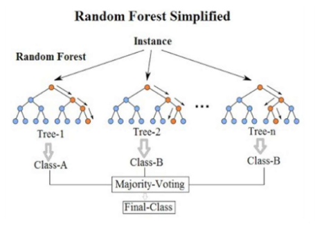

- 장점
  - 과적합이 잘 일어나지 않음
  - 결측치나 이상치에 강함
  - 의사결정나무 알고리즘에 기반한 기법이기 때문에 scaling, 정규화 과정이 필요 없음
  - 비선형적 데이터에 강함
  - 새로운 데이터가 들어와도 크게 영향을 받지 않음

- 단점
  - 수 많은 트리를 계산하기 때문에 학습 시간과 계산 연산량이 큼


## 군집(Clustering)
  - 군집 분석은 비슷한 특성을 가진 데이터를 그룹화하는 비지도 학습 기법
  - 데이터의 내재된 구조를 발견하고, 패턴을 파악하는데 활용
  - 마케팅 세분화, 이상치 탐지, 추천 시스템 등 다양한 분야에서 사용
  - Cluster 간 거리 계산 방법
    1. 단일 연결법 (최단 연결법, Single linkage)
      - 각각의 군집에서 하나씩 선택한 개체를 연결했을 때 가장 짧은 거리
    2. 완전 연결법 (최장 연결법, Complete linkage)
      - 각각의 군집에서 하나씩 선택한 개체를 연결했을 때 가장 긴 거리
    3. 평균 연결법 (Average linkage)
      - 각각의 군집에서 하나씩 선택한 개체를 연결한 전체 거리의 평균
    4. 중심 연결법 (Centriod linkage)
      - 각각의 군집 내에서 개체의 중간에 해당하는 점(Center)를 연결한 거리
    5. ward 연결법 (Ward linkage)
      - 각각의 군집 내에서 개체의 중간에 해당하는 점(Center)과 각각의 개체 사이의 거리를 제곱하여 합한 값과(Level 1), 군집을 하나로 묶을 때 모든 개체의 중간에 해당하는 점(Center)과 각각의 개체 사이의 거리를 제곱하여 합한 값(Level 2)를 더한 거리
  - K-평균(K-means clustering)
    - K-평균 알고리즘은 가장 대표적인 군집화 알고리즘
      1. 사용자가 지정한 K개의 군집 중심점을 초기화하고, 반복적으로 업데이트
      2. 각 데이터 포인트를 가장 가까운 군집 중심점에 할당하고, 군집 중심점을 재계산하는 과정을 수렴할 때까지 반복
    - 간단하고 빠르지만, K 값을 사전에 지정해야 함
## Bias, Variance, Regularization
  - 예측 오차의 구성
    - 머신러닝 모델의 총 예측 오차는 크게 세 가지 요소로 나눌 수 있습니다
      - 편향(Bias): 모델이 단순화되어 발생하는 오류
      - 분산(Variance): 모델이 데이터의 작은 변화에 민감하게 반응하여 발생하는 오류
      - 불확실성(Noise): 데이터 자체의 본질적인 변동성
  - Bias-Variance Trade-Off
    - Bias (편향)
      - 모델이 실제 데이터 패턴을 단순화하여 학습
      - 편향이 높으면: 복잡한 패턴을 제대로 학습하지 못해 언더피팅(Underfitting)
      - 결과: 학습 데이터와 테스트 데이터 모두에서 성능이 낮음
    - Variance (분산)
      - 모델이 학습 데이터에 민감하여 작은 변화에도 큰 차이를 보임
      - 분산이 높으면: 학습 데이터에 과적합하여 오버피팅(Overfitting)
      - 결과: 학습 데이터에서는 성능이 좋지만, 테스트 데이터에서는 성능 저하
    - Bias-Variance Trade-Off
      - 모델의 복잡도를 조절하면서 편향과 분산 간의 균형을 맞추는 것
      - 복잡도가 높으면: 편향 ↑, 분산 ↓ (오버피팅 위험)
      - 복잡도가 낮으면: 편향 ↓, 분산 ↑ (언더피팅 위험)
    - 최적화 목표
      - Bias와 Variance를 모두 최소화해 일반화 성능을 극대화
      - 해결 방법: 교차 검증, 정규화, 모델 튜닝
  - Regularization (정규화)
    - WTF
    - Data loss: Model predictions should match training data
    - Regularization: Prevent the model from doing too well on training data
    - 왜 정규화를 할까?
      - Express preferences over weights
        - 가중치에 대한 선호를 표현하기 위해
      - Make the model simple so it works on test data
        - 모델을 단순하게 만들어 테스트 데이터에서도 잘 작동하도록 하기 위해
      - Improve optimization by adding curvature
        - 곡률을 추가하여 최적화를 개선하기 위해
    - 만약 training dataset이 다음과 같은 형태라고 가정
    - 정규화는 데이터에 너무 잘 맞추는 것을 방지하여, 데이터에 있는 노이즈까지 학습하지 않도록 합니다
    - 오컴의 면도날: 여러 경쟁 가설들 중에서 가장 단순한 것이 최선이다.
      - 오컴의 윌리엄 (1285-1347)
  - Standardization & Normalization
    - Normalization: 데이터셋의 numerical value 범위의 차이를 왜곡하지 않고 공통 척도로 변경
      - 데이터의 크기(범위)가 제각각이면 모델이 특정 값에 영향을 많이 받거나 학습이 비효율적이 될 수 있음
    - Standardization: 표준정규분포의 속성을 갖도록 피처가 재조정되는 것
      - 데이터가 정규분포 형태를 따르게 해서 모델이 더 잘 학습할 수 있도록 함