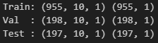

# 데이터 분석을 위한 딥러닝 기초
## 딥러닝 개념 및 흐름
### 딥러닝(Deep Learning)
데이터를 반복 학습하며 패턴을 찾는 인공지능 기술

-> 영상, 음성, 텍스트 등 다양한 데이터에 활용됨

- 딥러닝과 머신러닝 차이
    - 머신러닝은 **사람이 특징을 설계**해야 함
    - 딥러닝은 특징 추출까지 **모델이 자동으로 수행**함
    - 모두 학습 기반이지만 처리 방식에 차이가 있음

        

### 딥러닝 모델 구조
- 수능점수 예측 모델

    

    

    

### 모델 학습 방법
1. 순전파
2. Loss 계산
3. 역전파

- 순전파

    
    
    - `w1, w2, ...` : 가중치(weight)
    - 모두 덧셈, 곱셈으로만 이루어져 있음

- Loss 계산
    - 대표적인 활성화 함수
        - `sigmoid` : 출력값을 0과 1 사이로 압축하는 S자 곡선 형태 함수
        - `Hyperbolic tangent` : Sigmoid를 변형한 함수로, 출력 범위가 -1 ~ 1
        - `Rectified Linear Unit(ReLU)` : 음수 입력은 0, 양수 입력은 그대로 출력

        

    - 예시

        
        
        . . .
        - 학생 7명 넣었을 때의 결과

            
        - 모델이 얼마나 예측을 틀렸는지 판단해주는 근거 = `Loss`

    - 대표적인 Loss 함수
        - MSE (Mean Squared Error)

            
        - RMSE (Root Mean Squared Error)

            

- 역전파(Back propagation)
    - 각 노드의 가중치(w)가 최종 예측값에 얼마나 영향을 끼치는지 파악하여, 오차(손실)을 줄이는 방향으로 가중치를 업데이트 하는 것

    - 예시: `(a + b) * c` 식에서 a,b,c가 각각 최종 결과에 끼치는 영향은 얼마일까?
        - ex. `a = 6`, `b = 11`, `c = -3`

            
        
        - f,g 계산하면 `f = 17`, `g = -51`
        - a, b를 계산해서 만들어진 f를 a, b로 편미분하면 수식 f에 a, b가 끼치는 영향이 어느정도인지 알 수 있음

            
            - `f = a + b` 를 a로 편미분
            - `f = a + b` 를 b로 편미분

        - 전체 식에서 a가 끼치는 영향

            
            - `g = f * c`를 f로 편미분하면 f가 g에 미치는 영향은 -3만큼임
            - (g를 f로 편미분) * (f를 a로 편미분) = g를 a로 편미분
            - 즉, $\left(\frac{\partial g}{\partial f}\right) \cdot \left(\frac{\partial f}{\partial a}\right) = \frac{\partial g}{\partial a}$ 성립
            - 왜? 합성함수의 미분법칙인 **연쇄법칙**에 의해 성립함
            - a가 변할 때 g가 변하는 정도는 'a가 f에 끼치는 영향과, f가 g에 끼치는 영향을 곱한 값'으로 표현할 수 있음
            - 따라서 g (전체식)에 a가 미치는 영향을 구할 수 있음 

        - 전체 식에서 b가 끼치는 영향

            
            - $f = a + b$
            - $g = f \cdot c$
            - $\frac{\partial f}{\partial b} = 1$ -> b가 1만큼 변할 때 f도 1만큼 변함
            - $\frac{\partial g}{\partial f} = c$ -> f가 1만큼 변할 때 g는 c만큼 변함
            - $\left(\frac{\partial g}{\partial f}\right) \cdot \left(\frac{\partial f}{\partial b}\right) = \frac{\partial g}{\partial b}$
            - 즉, b가 변하면 g는 상수 c의 크기만큼 영향을 받음
        
        - 전체 식에서 c가 끼치는 영향

            


### 딥러닝 흐름
1. 순전파 과정을 거쳐 예측값 계산
    - 가중치를 연산하여 예측값을 모델이 추론함

        

2. Loss(손실) 계산
    - 예측값을 실제 정답과 비교하여 오차를 확인하고,
    - 손실 함수를 통해 오차를 계산함

        

3. 역전파 기반 가중치 업데이트
    - 각 가중치가 예측값에 얼마나 영향을 끼치는지 계산한 뒤,
    - 오차를 줄이는 방향으로 가중치 업데이트

    
    
    

- 딥러닝 전체 흐름 요약

    

### Epoch, Batch, Iteration
모델은 전체 데이터를 반복적으로 학습하며, 이 과정을 작은 묶음 단위로 나누어 처리함


- `Epoch` : 전체 학습 데이터가 모델을 한 번 통과한 횟수
- `Batch` : 한 번에 처리하는 데이터 묶음 크기
- `Iteration` : 하나의 Batch를 학습하는 횟수 (한 Epoch 안에 여러 Iteration 존재)


## 이미지 데이터 처리
### 이미지 특징


-> 이미지를 확대해보면 사진이 픽셀들로 구성되어있음을 알 수 있음

-> 하나의 픽셀을 찍어보면, 해당 픽셀의 색상 코드를 확인할 수 있음

-> **이미지도 결국 숫자**

### 이미지 학습 과정


- 학습 과정
    1. 입력 단계 
        - 이미지가 수천~수만 개 픽셀로 분해되어 입력층에 전달됨
    2. 특징 추출 단계
        - 각 픽셀 값은 가중치(w)와 곱해지고, 더해지고, 활성화 함수 등을 거치며 특징(feature)을 뽑아냄
        - 단순한 색·선·모양 같은 저수준 특징부터, 층이 깊어질수록 귀 모양, 털 패턴 같은 고수준 특징까지 추출 가능
    3. 출력 단계
        - 마지막 층에서 추출된 특징들을 종합해 "사진이 강아지일 확률"을 계산함
        - 소프트맥스(Softmax) 같은 함수를 사용해 여러 클래스 중 확률로 변환함
    4. 학습(역전파)
        - 예측 확률과 실제 정답(라벨)의 차이를 **오차(loss)**로 계산
        - 이 오차를 줄이기 위해 **연쇄법칙(Chain Rule)**을 이용한 역전파로 가중치들을 조정
        - 이 과정을 반복하면서 네트워크가 점점 더 정확하게 학습

- 이미지의 특징
    - 이미지는 작은 픽셀들의 집합
    - 각 픽셀은 색(RGB)이나 밝기 같은 정보를 숫자로 표현할 수 있음

    - 픽셀 -> 입력값
        - 딥러닝 모델은 숫자를 다루기 때문에, 이미지를 그대로 모델에 넣을 수는 없음
        - 보통은 이미지를 **1차원 벡터(1열로 나열된 숫자 리스트)**로 바꿔서 입력값으로 사용함
    
    - MLP(다층 퍼셉트론)과 한계
        - 이렇게 변환된 픽셀 벡터를 **MLP(다층 퍼셉트론)**에 넣어 학습할 수 있음
        - MLP는 픽셀 간의 공간적 구조(예: 눈, 귀 위치 관계)를 고려하지 않고 **모든 픽셀을 독립적으로 처리**함
        - 따라서 단순 패턴 학습에는 괜찮지만, 이미지의 위치적/지역적 특징을 잡는 데에는 비효율적
        - 아래 그림과 같이 이미지를 해체시켜 1차원 벡터로 바꾸면 이미지의 특성이 깨짐을 볼 수 있음 -> 이미지가 조금만 바뀌어도 예측 잘 못함

            .gif)
    
    - 그래서 나온 것이 **CNN (합성곱 신경망)**
        - CNN은 이미지의 공간 구조를 고려해 **필터(커널)**로 국소 특징을 추출하고, 이를 쌓아가며 복잡한 패턴을 학습함
        - 즉, 이미지의 특징을 유지한 채로 압축하자

            

            .gif)

### Convolutional Neural Network (CNN)
이미지 및 영상 인식을 위한 딥러닝의 기본 모델


-> 커널(필터)를 이용해 원본 이미지의 특징을 뽑아내고, 새로운 레이어(Feature map)를 만듦

- 커널
    - 커널은 이미지에서 특정 특징이 있는지 없는지를 수치적으로 판단하는 역할을 함
    - 이미지의 일부분과 커널을 곱하고 합산했을 때,
        - 해당 특징이 잘 맞으면 **큰 값**
        - 해당되지 않으면 **작은 값**
    - 이 차이가 피처맵(Feature map)에 기록됨
    - 예시: 고양이

        
        - 꼬리를 감지하는 커널로 꼬리 탐색

            

            
        - 꼬리를 감지하는 커널로 귀 탐색

            
        - 꼬리를 감지하는 커널을 적용하면 꼬리 부분에서는 큰 값이 나오고, 귀 부분에서는 작은 값이 나옴
        - 반대로 귀를 감지하는 커널을 적용하면 귀 영역에서 큰 값이 나오게 됨
    - 여러 개의 커널을 사용하면, 각 커널이 서로 다른 특징을 잘 잡아내고, 최종적으로 이미지 구분에 필요한 다양한 특징들을 뽑아낼 수 있음

        
        - 이렇게 여러 개의 커널을 동시에 적용하면, 각각의 커널이 자기 역할에 맞는 피처맵을 생성
        - 즉, 원본 이미지가 '귀 피처맵, 꼬리 피처맵..' 같은 형태로 분해되어 저장되는 것

- CNN (합성곱 신경망) 전체 구조

    
    1. Input Image (입력 이미지)
        - 원본 이미지를 픽셀 값(RGB 등)으로 신경망에 입력
        - ex. 강아지 사진

    2. Convolution Layer (합성곱 층)
        - 여러 개의 **커널(필터)**을 이용해 이미지의 국소 영역을 훑으며 특징을 추출
        - ex. 직선, 곡선, 귀 모양, 꼬리 등 다양한 패턴을 감지
        - 출력은 여러 개의 피처맵(Feature map)으로 나타남

    3. ReLU Layer (활성화 함수 층)
        - 합성곱 연산 결과에 **비선형성(Non-linearity)**을 추가
        - ReLU(Rectified Linear Unit)는 음수 값을 0으로 바꿔주고 양수는 그대로 전달 -> 계산 단순 & 기울기 소실 문제 완화
        - 신경망이 단순 선형모델을 넘어서 복잡한 패턴을 학습할 수 있음

    4. Pooling Layer (풀링 층)
        - 피처맵의 크기를 줄여 연산량을 감소시키고, 동시에 중요한 특징을 유지
        - 대표 방식:
            - `Max Pooling`: 영역 내 최댓값 선택 -> 가장 강한 특징만 남김
            - `Average Pooling`: 영역 내 평균값 선택 -> 전체적 특징 유지

    5. Fully Connected Layer (완전 연결층)
        - 풀링된 특징들을 1차원 벡터로 펼쳐서 전통적인 신경망(MLP) 구조에 연결
        - 이미지 전체의 추출된 특징들을 종합해 **최종 분류를 수행**함
        - ex. "Dog" vs "Not Dog" 같은 클래스 확률 계산

    - CNN 구조 예시 (자동차 분류)

        

### 예시: Fashion MNIST 데이터셋
- 데이터셋 알아보기
    - 60000개의 학습 데이터, 10000개의 테스트 데이터
    - 10개의 카테고리 -> 각 카테고리별 7000개의 이미지들로 구성

        

- TrainSet (학습데이터) / ValidationSet (검증데이터) / TestSet (테스트데이터)
    - 검증 데이터는 무엇인가?
        - ex. 시험기간

            
            - 수많은 문제들로 단련하고, 모의고사랑 기출문제로 실력 점검하며 반복적으로 공부하다가 최종적으로 테스트를 봄
        - 즉, 검증 데이터는 **학습 과정 중 모델의 성능을 점검하고 튜닝하기 위해 사용하는 데이터**

    - 전체 데이터 구분하기

        
        - `batch` : 모델이 한 번에 학습하는 데이터의 양
        - `epoch` : 모델이 학습 데이터를 몇 번 학습할 것인지
        - 배치를 12로 설정했을 때

            
        - ex. 1000개의 학습 데이터가 있을 때, 배치는 50, 에폭은 10으로 설정해서 모델을 만들었다면
            1. 총 몇 번의 배치가 반복될까? `(1000 / 50) * 10 = 200번`
            2. 각 데이터는 모델이 몇 번 확인할까? `10번`

    - 1 에폭 학습한 모델이 잘 학습했는지 평가할 때 **검증 데이터**를 사용함
        - 즉, 학습 도중 각 에폭이 끝날때마다 '검증셋'을 통해 평가
        - 에폭을 10으로 설정한 모델이라면, 10 에폭 학습한 최종 모델을 평가할 때 '테스트셋' 사용함

### 예시: Fashion MNIST 데이터셋 코드
- 목표: 흑백 옷 이미지(28x28)를 10종류로 분류
- 필요한 라이브러리
    ```python
    import numpy as np
    import matplotlib.pyplot as plt
    from tensorflow.keras.datasets import fashion_mnist   # 데이터셋
    from tensorflow.keras.models import Sequential
    from tensorflow.keras.layers import Conv2D, MaxPooling2D, Flatten, Dense
    from sklearn.model_selection import train_test_split
    ```

- 데이터 불러오기
    ```python
    # 1) 데이터 불러오기
    #   - X: 픽셀값(0~255)인 28x28 흑백 이미지
    #   - y: 정수 레이블(0~9, 10클래스)
    (X_train_full, y_train_full), (X_test, y_test) = fashion_mnist.load_data()
    ```

- 정규화
    ```python
    # 2) 정규화 (0~255 → 0~1)
    #   - 신경망 학습 안정화 및 수렴 속도 향상
    X_train_full = X_train_full.astype("float32") / 255.0
    X_test = X_test.astype("float32") / 255.0
    ```
    - 정규화를 통해 0 ~ 1 사이의 실수로 바꿔줌 
    - 정규화는 모델이 좀 더 안정적이고 빠르게 학습 하는 데 도움을 줌

- 데이터 분할
    ```python
    # 3) 훈련/검증 분할
    #   - 원본 훈련 전체(X_train_full)에서 10%를 검증으로 분리
    #   - 이미지 분류는 시계열(순서가 중요)이 아니므로 무작위 분할 사용해도 무방
    X_train, X_val, y_train, y_val = train_test_split(
        X_train_full, y_train_full, test_size=0.1, random_state=42
    )

    # 분할된 데이터의 크기 출력
    print(f"학습 데이터: {X_train.shape}, 검증 데이터: {X_val.shape}, 테스트 데이터: {X_test.shape}")
    ```
    

- 모델 생성
    ```python
    # 5) 모델 정의
    #   - CNN 기본 흐름: (Conv → ReLU → Pool) × k → Flatten → Dense → 출력
    #   - 아래 구조는 Conv + Pool 두 번이 아니라 Pool을 두 번 연속 적용
    #     → 특징 맵 크기가 급격히 작아질 수 있으므로, 
    #     → 실제로는 Conv+Pool을 여러 번 반복하는 것이 더 흔함

    # 커널 크기와 스트라이드(얼마나 건너뛰면서 넘어갈거냐)에 따라 
    # 입력 크기가 나눠떨어지지 않으면 남는 부분은 잘려 나가고 버려짐
    model = Sequential()

    # 첫 번째 합성곱 층
    #   - 필터 수: 32, 커널 크기: 3x3, 활성함수: ReLU
    #   - input_shape: (높이, 너비, 채널) = (32, 32, 1)
    model.add(Conv2D(32, (3, 3), activation='relu', input_shape=(28, 28, 1)))

    # 최대 풀링(MaxPooling)으로 공간 크기 절반 축소
    model.add(MaxPooling2D(pool_size=(2, 2)))

    # 여기서는 두 번째 Conv 없이 Pool을 또 적용
    #   - 학습 목적의 간단 예시로는 가능하지만, 성능 최적화에는 Conv→Pool 쌍을 반복하는 구성이 일반적
    model.add(MaxPooling2D(pool_size=(2, 2)))

    # 2D 특징 맵 → 1D 벡터로 펼치기
    model.add(Flatten())

    # 완전연결층(Dense): 128 유닛, ReLU
    model.add(Dense(128, activation='relu'))

    # 출력층: 10클래스, softmax (확률 분포 출력)
    model.add(Dense(10, activation='softmax'))

    # 모델 구조 요약 출력
    model.summary()
    ```
    

    - `Sequential()`
        - Keras에서 순차적으로 레이어를 쌓을 수 있게 해주는 모델 클래스
        - `model.add(...)`로 레이어를 순서대로 추가
    
    - `Conv2D(filters, kernel_size, activation, input_shape)`
        - 2D 합성곱 레이어 (Convolution Layer)
        - 주요 파라미터:
            - `filters`: 필터(커널)의 개수 (예: 32개 → 출력 feature map도 32개 생성)
            - `kernel_size`: 필터의 크기 (예: (3,3))
            - `activation`: 비선형 활성화 함수 (예: 'relu')
            - `input_shape`: 입력 이미지의 크기 (높이, 너비, 채널) – 첫 레이어에서만 지정
        - 예시
            ```python
            Conv2D(32, (3, 3), activation='relu', input_shape=(28, 28, 1))
            # 28×28 크기의 흑백(1채널) 이미지 입력을 받아 3x3 필터 32개를 적용
            ```
    
    - `MaxPooling2D(pool_size)`
        - 최대 풀링 레이어
        - 이미지의 공간 크기를 줄이는 역할 (Downsampling)
        - `pool_size=(2,2)`이면 2x2 영역에서 가장 큰 값만 추출해서 크기를 절반으로 줄임
        - 예시
            ```python
            MaxPooling2D(pool_size=(2, 2))
            # 입력 크기가 28x28이라면 → 14x14로 축소됨
            ```
    
    - `Flatten()`
        - 다차원 배열(예: 2D 이미지)을 1차원 벡터로 펼쳐줌
        - CNN의 출력 feature map을 완전 연결층(Dense)에 넣기 위해 필요함
        - 예시
            ```python
            Flatten()
            # 예: (7, 7, 64) → 3136 벡터로 변환
            ```
    
    - `Dense(units, activation)`
        - 완전 연결층 (Fully Connected Layer)
        - `units`: 출력 뉴런의 수
        - `activation`: 활성화 함수
        - 예시
            ```python
            Dense(128, activation='relu')
            # 128개의 뉴런을 가진 은닉층
            ```
        - 출력층 예시
            ```python
            Dense(10, activation='softmax')
            # 10개의 클래스로 분류하는 소프트맥스 출력층
            # 각 클래스에 대한 확률 값 출력
            ```
    
    - `model.summary()`
        - 모델의 구조, 각 층의 출력 형태 및 파라미터 수 등을 요약해서 보여줌
    
    - CNN 기본 구조 정리
        ```
        입력 → Conv2D → ReLU → MaxPooling → MaxPooling → Flatten → Dense(128) → Dense(10, Softmax)
        ```
        - 일반적으로는 `Conv → Pool`을 반복하며 특징을 추출하는 것이 더 효과적
        - 중간에 Conv 없이 Pool만 연속적으로 적용하면 정보 손실이 커질 수 있음

- 모델 학습 전 컴파일 (학습방법(옵티마이저), 손실함수(loss), 평가 지표 설정)
    ```python
    # 6) 컴파일
    #   - optimizer='adam' : 적응적 학습률로 빠른 수렴
    #   - loss='sparse_categorical_crossentropy' : y가 정수 레이블일 때 사용
    #   - metrics=['accuracy'] : 정확도 모니터링
    model.compile(optimizer='adam',
                loss='sparse_categorical_crossentropy',
                metrics=['accuracy'])
    ```
    - `optimizer='adam'`
        - **옵티마이저(Optimizer)**: 모델이 손실 함수를 최소화하도록 파라미터(가중치)를 업데이트하는 방식
        - `adam`은 대표적인 최적화 알고리즘으로, `모멘텀 + RMSProp`가 결합된 방식
            | 방식           | 주요 아이디어       | 효과                |
            | ------------ | ------------- | ----------------- |
            | **Momentum** | 이전 기울기 누적     | 빠르게 수렴, 진동 감소     |
            | **RMSProp**  | 각 변수마다 다른 학습률 | 안정적 학습, 과도한 이동 방지 |
            | **Adam**     | 두 가지 결합       | 빠르고 안정적인 학습       |
        - 학습률을 자동 조정(적응적 학습률), 빠르고 안정적으로 수렴한다는 장점이 있음
        - 거의 대부분의 딥러닝 문제에서 **기본값**처럼 많이 사용됨
    
    - `loss='sparse_categorical_crossentropy'`
        - **손실 함수(Loss function)**: 모델의 예측과 실제 정답 사이의 차이를 수치로 나타냄
        - 이 값이 작아지도록 모델을 학습시킴
        - `sparse_categorical_crossentropy`은 **① 분류 문제 ② 정답 레이블이 정수(integer)** 형식일 때 사용
            | 비교    | categorical_crossentropy | sparse_categorical_crossentropy |
            | ----- | ------------------------ | ------------------------------- |
            | 정답 형식 | One-hot (예: [0,0,1,0,0]) | 정수 인덱스 (예: 2)                   |
            | 사용 편의 | one-hot 변환 필요            | 변환 없이 사용 가능                     |

    - `metrics=['accuracy']`
        - 모델을 학습하면서 모니터링할 **평가지표**
        - 여기서는 'accuracy' (정확도)를 사용 -> 예측값 중 정답을 맞춘 비율
        - 훈련 및 검증 단계에서 정확도를 출력해줌

- 모델 학습
    ```python
    # 7) 학습
    #   - validation_data로 검증 성능을 에폭마다 확인
    history = model.fit(
        X_train, y_train,
        epochs=10, 
        validation_data=(X_val, y_val)
    )
    # {'loss': [...], 'accuracy': [...], 'val_loss': [...], 'val_accuracy': [...]}
    ```
    - 학습 데이터: `X_train`, `y_train`

    - 에폭 수: `epochs=10`
        - 1 에폭(epoch)은 전체 학습 데이터를 한 번 모두 사용하는 것을 의미
        - `epochs=10` → 전체 데이터를 10번 반복 학습
        - 에폭 수가 **너무 작으면 과소적합, 너무 크면 과적합** 위험이 있음

    - 검증 데이터: `validation_data=(X_val, y_val)`
        - 학습 도중에 모델의 성능을 확인하기 위해 사용
        - 학습에는 사용되지 않지만, 각 에폭 끝날 때마다 `val_loss`와 `val_accuracy`를 계산해서 보여줌
        - 과적합 여부를 확인할 때 유용 (예: train_acc ↑ 인데 val_acc ↓ 면 과적합 가능성)

- 손실 시각화
    ```python
    # 8) 손실 시각화
    plt.plot(history.history['loss'], label='Train Loss')
    plt.plot(history.history['val_loss'], label='Validation Loss')
    plt.title('Loss Curve')
    plt.xlabel('Epoch')
    plt.ylabel('Loss')
    plt.legend()
    plt.grid(True)
    plt.show()
    ```
    

    - Train loss
        - 학습 데이터에 대해 모델이 얼마나 잘 예측했는지
        - 당연히 학습이 진행되면 떨어짐
    
    - Validation loss
        - **모델이 본 적 없는 데이터(검증셋)**에 대해 얼마나 일반화가 잘 되었는지
    
    - "Train loss가 감소한다고 해서, 반드시 Validation loss도 감소하는 건 아니다"

    - 이런 현상이 발생하는 이유
        1. 과적합(Overfitting)
            - 모델이 학습 데이터를 너무 잘 외워버림
            - 그 결과, 새로운 데이터(검증셋)에서는 잘 예측 못함
            - Train Loss는 계속 떨어지지만 Validation Loss는 떨어지다 다시 오르거나 불안정해짐
        2. 검증 데이터가 너무 작거나 불안정
            - 작은 변화에도 Loss가 요동칠 수 있음
            - 실제 모델이 나쁘다기보다는, 데이터 분포상 그런 결과가 나올 수 있음
        3. 과한 학습 (Epoch 수가 많음)
            - 처음엔 Train/Validation Loss가 같이 줄어들다가
            - 어느 시점부터 Validation Loss가 다시 증가하면
            - → 학습을 멈추는 것이 좋음 (이걸 조기 종료 Early Stopping이라고 함)

- 예측 라벨과 실제 라벨 비교
    ```python
    #   - 테스트 앞 5개 샘플에 대해 예측 라벨과 실제 라벨을 비교
    class_names = ['T-shirt', 'Trouser', 'Pullover', 'Dress', 'Coat',
                'Sandal', 'Shirt', 'Sneaker', 'Bag', 'Ankle boot']

    preds = model.predict(X_test[:5])
    # argmax: 어떤 배열(리스트, 벡터 등)에서 최댓값이 있는 위치(인덱스)를 반환하는 함수
    pred_labels = np.argmax(preds, axis=1)

    for i in range(5):
        # imshow는 2D를 기대하므로 채널 축 제거
        # X_test[i].squeeze() -> (28, 28, 1) → (28, 28)으로 차원 축소
        plt.imshow(X_test[i].squeeze(), cmap='gray')
        plt.title(f"Pred: {class_names[pred_labels[i]]}, True: {class_names[y_test[i]]}")
        plt.axis('off')
        plt.show()
    ```
    
    
    
    - `model.predict(X_test[:5])`
        - 테스트 이미지 5장을 모델에 입력하여 예측 결과를 얻음
        - 결과는 확률 벡터 형태:
            ```pythob
            preds[0] = [0.01, 0.02, 0.85, 0.03, ..., 0.01]  # 클래스 2가 가장 확률 높음
            ```
    
    - `np.argmax()`
        - **최댓값의 인덱스를 반환**하는 함수
        - `axis=1` → 각 행(이미지)에 대해 가장 높은 확률을 갖는 클래스 인덱스를 선택


## 시퀀스 데이터 처리
### RNN (Recurrent Neural Network)
순환신경망. 순서를 기억하는 것에 중점을 둔 모델들

-> 단어 시퀀스(자연어), 시계열 데이터 등 순서가 중요한 데이터를 처리하기 위해 **과거 정보를 기억하고 이를 현재 학습에 반영**하는 딥러닝 모델

-> 순환적인 구조를 통해 이전 시점의 은닉 상태를 다음 시점의 입력과 함께 사용

※ 기존 모델 vs RNN


- RNN 모델 특징
    
    
    - `"I'm becomming an AI"`를 RNN이 처리하는 과정을 시간 순서(time step) 로 나타낸 것
    
    - 구조
        - 각 `CELL`은 RNN의 한 시점(time step)에서의 연산 유닛
        - **입력 단어 + 이전 상태**를 받아서 **예측 결과와 다음 상태**를 출력
        - 이 과정을 반복하면서 시퀀스를 처리

    - 1회차 (Time Step 1)
        - 입력 단어: `"I'm"`
        - CELL은 이전 상태가 없으므로 초기 상태 사용
        - 출력: 1회차 예측값 생성
        - 이 CELL의 출력 상태는 다음 CELL로 전달됨
    
    - 2회차 (Time Step 2)
        - 입력 단어: `"becomming"`
        - 이전 CELL에서 전달된 상태(hidden state) 와 함께 처리
        - 출력: 2회차 예측값
        - 다시 다음 CELL로 상태 전달
    
    - 3회차 (Time Step 3)
        - 입력 단어: `"an"`
        - 이전 상태를 기반으로 예측
        - 출력: 3회차 예측값
    
    - 4회차 (Time Step 4)
        - 입력 단어: `"AI"`
        - 마지막 CELL에서 최종 예측값 출력
        - 이 예측은 문장의 의미나 다음 단어를 예측하는 데 사용됨

- RNN 구조는 **순서가 있는 데이터(자연어, 시계열)**에 많이 사용됨
    - 시계열 데이터
        - 순서, 시간 등의 순차적인 정보가 들어가 있는 데이터
        - ex. 금융 데이터, 수치 데이터, 판매량 데이터 등등

- RNN 구조의 문제점

    
    - 기억력이 짧음 -> **Long Term dependency Problem (장기 의존성 문제)**
        - 긴 문장을 처리할수록 앞부분의 정보가 소실됨
        - RNN이 충분한 기억력을 가지고 있지 않다면, 예측이 어려움
        - 이런 문제를 보완하기 위해 LSTM, GRU, 그리고 최근 Transformer (GPT) 구조가 등장

### LSTM (Long Short Term Memory)
RNN의 한 종류로, RNN의 장기 의존성 문제(long-term dependencies)를 해결하기 위해서 나온 모델

- RNN vs LSTM
    - RNN

        
        - 모든 RNN은 Neural Network 모듈을 반복시키는 체인과 같은 형태를 하고 있음
        - 기본적으로 RNN에서는 이렇게 반복되는 간단한 구조를 가지고 있음
    - LSTM

        
        - LSTM도 똑같이 체인 구조를 가지고 있지만, 
        - 4개의 Layer가 특별한 방식으로 서로 정보를 주고 받도록 되어있음

- LSTM 기본 구조

    
    
    - Cell state

        
        - Cell State는 컨베이어 벨트와 같아서 작은 linear interaction만을 적용시키면서 전체 체인을 계속 구동시킴
        - 정보가 전혀 바뀌지 않고 그대로만 흐르게 하는 부분
        - State가 꽤 오래 경과하더라도 Gradient가 잘 전파됨
        - Gate라고 불리는 구조에 의해서 정보가 추가되거나 제거 되며, Gate는 Training을 통해서 어떤 정보를 유지하고 버릴지 학습함
    
    - Forget Gate

        
        - 이 Gate는 과거의 정보를 버릴지 말지 결정하는 과정
        - 이 결정은 Sigmoid layer에 의해서 결정됨
        - 값이 1이면 "모든 정보를 보존해라", 0이면 "죄다 갖다 버려라"
    
    - Input Gate

        
        - 이 Gate는 현재 정보를 기억하기 위한 게이트
        - 현재의 Cell state 값에 얼마나 더할지 말지를 정하는 역할
    
    - Update
        
        
        - 과거 Cell State를 새로운 State로 업데이트 하는 과정
        - Forget Gate를 통해서 얼마나 버릴지, Input Gate에서 얼마나 더할지를 정했으므로
        - Update과정에서 계산을 해서 Cell State로 업데이트를 해줌
    
    - Output Gate

        
        - 어떤 출력값을 출력할지 결정하는 과정
        - 최종적으로 얻어진 Cell State 값을 얼마나 빼낼지 결정하는 역할

    - 정리
        
        
        - forget gate: 중요하지 않은 정보를 판단하여 정보를 지우는 부분
        - Input gate: 중요한 정보를 판단하여 장기 기억으로 보내는 부분
        - Output gate: 예측값을 연산하는 부분

### 예시: 주가 예측 코드 (LSTM)
- 필요 라이브러리
    ```python
    # 참고: yfinance는 사전에 설치 필요
    # !pip install yfinance

    import numpy as np
    import pandas as pd
    import matplotlib.pyplot as plt
    import yfinance as yf  # pip install yfinance
    from tensorflow.keras.models import Sequential
    from tensorflow.keras.layers import LSTM, Dense
    from sklearn.preprocessing import MinMaxScaler
    from sklearn.model_selection import train_test_split
    ```

- 데이터 다운로드
    ```python
    # 1) 데이터 다운로드
    #    - 시계열 예측에서는 '종가(Close)'만 사용 (단변량)
    df = yf.download('AAPL', start='2020-01-01', end='2025-07-01')
    close = df['Close'].values.reshape(-1, 1)      # shape: (N, 1)
    dates_all = df.index      
    ```

- 데이터 분할
    ```python
    # 2) 시간 순서 기반 분할 (70% / 15% / 15%)
    #    - 분할은 원시 시계열에서 먼저 수행
    #    - 이후 스케일러는 반드시 'train'에만 fit
    # 시계열 데이터는 시간 순서가 중요합니다.
    # 랜덤하게 섞어 분할하면 미래 데이터를 학습에 포함시켜버리는 데이터 누설(leakage) 문제가 생깁니다.
    # 따라서 과거 데이터로 학습하고, 미래 데이터로 검증/테스트를 보는 게 현실적인 시나리오에 가깝습니다.

    N = len(close)
    train_end = int(N * 0.70)
    val_end   = int(N * 0.85)

    close_train = close[:train_end]
    close_val   = close[train_end:val_end]
    close_test  = close[val_end:]
    ```

- 스케일링
    ```python
    # 3) 스케일링 (train에만 fit → 전 구간 transform)
    #    - 데이터 누설 방지
    scaler = MinMaxScaler()
    scaler.fit(close_train)                # train에만 적합
    close_scaled = scaler.transform(close) # 전 구간 변환
    ```
    - 데이터 누설(Data Leakage)
        - 전처리를 할 때 전체 데이터를 기준으로 fit하면, 테스트 데이터의 분포 정보가 모델에 간접적으로 흘러 들어가는 상황이 생김
        - 만약 전체 데이터(train+test)에 대해 fit 하면, 스케일러는 **전체 구간의 최소값/최대값**을 이미 알게 됨
        - 즉, 미래(테스트 구간)의 min/max를 이용해 현재(train 구간) 데이터를 스케일링하는 꼴
        - 결과적으로 학습할 때 미래 정보를 은연중에 참고하게 되므로, 실제 예측할 때보다 성능이 더 잘 나옴 (과도하게 낙관적 성능 측정)
    
    - `fit`: 데이터 분포(평균, 표준편차, 최소/최대 등)를 학습
    - `transform`: 이미 학습된 기준으로 데이터를 변환

- 시퀀스 생성
    ```python
    # 4) 시퀀스 생성 함수
    #    - [start, end) 구간 내부에서만 window를 구성
    #    - X: 연속된 window 길이, y: 다음 시점 하나
    #    - y와 1:1로 대응하는 날짜 배열(dates_out)도 함께 반환
    '''
    LSTM은 순차 데이터(window 길이만큼) 를 입력으로 받고, 그 다음 시점 값을 예측하는 구조
    따라서 원래 종가 데이터 [p1, p2, p3, ..., pN] 를 그냥 통째로 쓰지 않고
    X: 과거 window 길이 (예: 10일)
    y: 그 다음 날 값으로 학습용 데이터셋을 만들어야 함
    '''

    def create_sequences_by_range(data_scaled, dates, start, end, window=10):
        X, y, dates_out = [], [], []
        # i는 입력 시퀀스의 시작 인덱스
        # y는 i+window 위치의 값이므로 i+window < end 여야 함
        for i in range(start, end - window):
            X.append(data_scaled[i : i + window])
            y.append(data_scaled[i + window])
            dates_out.append(dates[i + window])
        return np.array(X), np.array(y), np.array(dates_out)

    X_train, y_train, dates_train = create_sequences_by_range(close_scaled, dates_all, 0, train_end, 10)
    X_val, y_val, dates_val = create_sequences_by_range(close_scaled, dates_all, train_end, val_end, 10)
    X_test, y_test, dates_test = create_sequences_by_range(close_scaled, dates_all, val_end, N, 10)

    print("Train:", X_train.shape, y_train.shape)
    print("Val  :", X_val.shape,   y_val.shape)
    print("Test :", X_test.shape,  y_test.shape)
    ```
    
    - 시계열 데이터를 LSTM에 학습시키기 위해 입력(시퀀스)과 정답(타깃)을 만드는 과정
    - 슬라이딩 윈도우
        - `window=3` 이라고 하면, **3개의 데이터를 묶어서 하나의 입력 시퀀스**로 사용
        - 그 다음 값이 **정답(y)**
    - 예시
        - 주가: `100, 101, 103, 105, 106, 108, 109`
        - 1번째 시퀀스: `[100, 101, 103]` → 정답: 105
        - 2번째 시퀀스: `[101, 103, 105]` → 정답: 106
        - 3번째 시퀀스: `[103, 105, 106]` → 정답: 108
        - 4번째 시퀀스: `[105, 106, 108]` → 정답: 109
    - 즉, "과거 n일의 주가 → 다음 날 주가"를 학습하는 구조

- LSTM 모델 구성
    ```python
    # 5) LSTM 모델 구성
    #   - 입력 차원: (window 길이, 1 특성)
    #   - return_sequences=False: 마지막 타임스텝 출력만 Dense로 전달
    model = Sequential([
        LSTM(50, input_shape=(X_train.shape[1], X_train.shape[2]), return_sequences=False),
        Dense(1)
    ])
    model.compile(optimizer='adam', loss='mae', metrics=['mse','mae'])
    model.summary()
    ```
    
    
    - `Sequential([...])`
        - Keras에서 레이어를 순차적으로 쌓아 올리는 모델 구조
        - 입력 → LSTM → Dense 순서대로 흐름
    
    - `LSTM(50, input_shape=(X_train.shape[1], X_train.shape[2]), return_sequences=False)`
        - LSTM 레이어 (시계열 데이터를 처리하는 RNN 계열 레이어)
        - 주요 파라미터:
            - `50`: LSTM 셀의 유닛(뉴런) 개수
                - 이 값이 클수록 더 많은 패턴을 학습 가능 (하지만 과적합 위험 ↑)
            - `input_shape=(X_train.shape[1], X_train.shape[2])`: 입력 데이터의 형태를 지정
                - `X_train.shape[1]`: 시퀀스 길이 (예: 며칠치 데이터를 보는지, time steps)
                - `X_train.shape[2]`: 특성(feature) 개수 (예: 종가, 거래량 등 몇 개 피처를 쓰는지)
            - `return_sequences=False`: 마지막 시점의 출력만 반환
                - `False`: 마지막 시점(hidden state)만 출력 → 다음 레이어(Dense)로 연결
                - `True`: 모든 시점의 출력 반환 (다음 LSTM 층 쌓을 때 사용)
    
    - `Dense(1)`
        - 완전 연결층 (출력층)
        - `1`: 최종적으로 예측할 값이 하나라는 뜻 (예: 주가의 다음날 종가)

- 모델 학습
    ```python
    # 6) 학습
    #   - epochs/batch_size는 데이터 규모와 수렴 정도에 따라 조정
    history = model.fit(
        X_train, y_train,
        epochs=30, batch_size=32,
        validation_data=(X_val, y_val),
        verbose=1
    )
    ```

- 손실 시각화
    ```python
    # 7) 손실 시각화
    plt.rcParams['font.family'] = 'Malgun Gothic'  # 한글 폰트 설정(환경에 폰트가 있어야 함)
    plt.figure(figsize=(8,4))
    plt.plot(history.history['loss'], label='Train Loss (MAE, scaled)')
    plt.plot(history.history['val_loss'], label='Val Loss (MAE, scaled)')
    plt.title('Loss Curve')
    plt.xlabel('Epoch')
    plt.ylabel('MAE (scaled)')
    plt.legend()
    plt.grid(True)
    plt.show()
    ```
    
    - Val loss가 중간중간 튀는 구간이 있음


- 테스트 데이터 예측
    ```python
    # 8) 테스트 데이터 예측 & 시각화
    #   - inverse_transform으로 스케일 원래대로 되돌리기
    y_pred = model.predict(X_test)

    # 역스케일 (달러 단위)
    y_test_inv = scaler.inverse_transform(y_test)
    y_pred_inv = scaler.inverse_transform(y_pred)
    ```

- 예측 시각화
    ```python
    # 9) 날짜 축을 사용한 시각화
    #    - dates_test는 y_test와 1:1로 대응하는 날짜
    plt.figure(figsize=(11,5))
    plt.plot(dates_test, y_test_inv, label='실제 종가')
    plt.plot(dates_test, y_pred_inv, label='예측 종가')
    plt.title('AAPL 주가 예측 (테스트)')
    plt.xlabel('날짜')
    plt.ylabel('종가(USD)')
    plt.legend()
    plt.grid(True)
    plt.tight_layout()
    plt.show()
    ```
    

- 실제 종가와 예측 종가 비교
    ```python
    def forecast_future(model, data_scaled, window=10, steps=5):
        """
        data_scaled: 전체 스케일된 시계열 (마지막 구간까지 포함)
        window: 입력 시퀀스 길이
        steps: 앞으로 예측할 일 수
        데이터를 자르면 (window, 1) (예: (10,1)) 이 나오는데, 이건 LSTM 입장에서 batch 축이 없는 상태
        그래서 (1, window, 1) 로 reshape 해서 batch 차원을 앞에 붙여줘야 LSTM이 받아들일 수 있는 모양으로 바뀜
        
        Returns
        -------
        np.ndarray, shape = (steps, 1)
            스케일된 미래 예측값. 실제 단위(USD 등)로 보려면 scaler.inverse_transform()을 적용해야 함
        """
        # 1. 마지막 window 길이만큼 데이터를 잘라와서 초기 입력 시퀀스로 사용
        #    data_scaled[-window:] → (window, 1)
        #    LSTM 입력 규격에 맞추려면 (1, window, 1)로 reshape 필요
        # 입력 shape=(batch_size, timesteps, features)

        current_seq = data_scaled[-window:].reshape(1, window, 1) 

        predictions = []  # 예측 결과를 담을 리스트

        # 2. steps 번 반복하면서 한 스텝씩 미래를 예측
        for _ in range(steps):
            # 모델에 현재 시퀀스를 넣어서 다음 시점 값 예측
            # 출력 모양은 (1, 1) → batch=1, 출력뉴런=1
            next_pred = model.predict(current_seq, verbose=0)   # shape: (1, 1)

            # 예측값을 스칼라로 꺼내 리스트에 저장
            predictions.append(next_pred[0, 0])

            # 시퀀스를 갱신
            # - 현재 시퀀스의 맨 앞 1개 타임스텝을 버리고(window-1 길이 유지)
            # - 방금 예측한 값을 맨 뒤에 붙여서 window 길이를 유지
            # next_pred는 (1, 1) → 시간축에 붙이려면 (1, 1, 1)로 reshape 필요
            next_pred_reshaped = next_pred.reshape(1, 1, 1)     # shape: (1, 1, 1)

            # current_seq[:, 1:, :] : (1, window-1, 1)
            # next_pred_reshaped : (1, 1, 1)
            # concat 결과 : (1, window, 1)
            current_seq = np.concatenate([current_seq[:, 1:, :], next_pred_reshaped], axis=1)

        # 3. 예측값 리스트를 (steps, 1) 모양의 배열로 변환해 반환
        return np.array(predictions).reshape(-1, 1)
    ```
    ```python
    import pandas as pd
    import yfinance as yf

    # 1) 모델 예측 5일치
    # 미래 5일치 예측 (스케일된 값)
    future_scaled = forecast_future(model, close_scaled, window=10, steps=5)

    # 원래 단위(USD)로 되돌리기
    future_prices = scaler.inverse_transform(future_scaled)

    print("향후 5일 예측 (USD):", future_prices.ravel())

    # 2) 실제 2025-07-02 이후 5영업일 다운로드
    df_future = yf.download("AAPL", start="2025-07-02", end="2025-07-10")
    real_future = df_future["Close"].head(5)  # 5영업일

    # 3) 비교 DataFrame 생성
    comparison = pd.DataFrame({
        "실제 종가": real_future.values.ravel(),             
        "예측 종가": future_prices[:len(real_future)].ravel()
    }, index=real_future.index)

    print(comparison)
    ```
    

※ 자연어 데이터 처리


-> 자연어는 순서가 중요함

### 예시: 셜록홈즈 빈간추론 (자연어)
- 사전 준비
    ```python
    import os

    # 1. Sherlock 폴더 내 모든 txt 파일 불러오기
    # sherlock 폴더에 .txt 파일들이 있다고 가정
    # 영어 원문은 대소문자/구두점 혼재 → 여기서는 소문자 통일만 간단 적용
    texts = []
    root = 'sherlock'  # sherlock 디렉토리에 저장하기 위함
    max_files = 10     # 처리할 텍스트 파일 수 제한(데모 목적)

    for i, fname in enumerate(os.listdir(root)):
        if fname.endswith('.txt') and i < max_files:
            with open(os.path.join(root, fname), 'r', encoding='utf-8') as f:
                texts.append(f.read().lower())

    combined_text = '\n'.join(texts)

    # 2) 전처리 결과를 파일로 저장(옵션)
    with open('sherlock.txt', 'w', encoding='utf-8') as f:
        f.write(combined_text)
    print("sherlock.txt 파일 저장 완료")
    ```

- 필요 라이브러리
    ```python
    import numpy as np
    from tensorflow.keras.preprocessing.text import Tokenizer
    from tensorflow.keras.preprocessing.sequence import pad_sequences
    from tensorflow.keras.models import Sequential
    from tensorflow.keras.layers import Embedding, LSTM, Dense
    ```

- 텍스트 불러오기
    ```python
    # 3) 텍스트 불러오기
    with open('sherlock.txt', 'r', encoding='utf-8') as f:
        text = f.read().lower()
    ```

- 문장 단위 분할
    ```python
    # 4) 문장 단위로 나누기
    #   - 간단히 개행('\n') 기준으로 분리
    #   - 빈 줄, 매우 짧은 줄은 노이즈일 수 있어 필터링 가능
    sentences = [s for s in text.split('\n') if len(s.strip()) > 0]
    ```

- 토크나이저 생성 및 학습
    ```python
    # 5) 토크나이저 생성 및 학습
    #   - 단어 → 정수 인덱스 매핑
    tokenizer = Tokenizer()
    tokenizer.fit_on_texts(sentences)
    total_words = len(tokenizer.word_index) + 1  # 어휘 수(패딩용 0 포함)
    ```
    - Tokenizer
        - Keras에서 제공하는 텍스트 전처리 도구
        - 문장을 단어 단위로 나누고, 각 단어를 고유한 정수 인덱스로 매핑해줌
        - 신경망은 문자열을 직접 처리하지 못하므로 → 숫자 벡터로 변환해야 함

- n-gram 시퀀스 생성
    ```python
    # 6) n-gram 시퀀스 생성
    #   - 예: "the detective was" → [the], [the detective], [the detective was] 식으로 누적
    #   - 각 시퀀스의 마지막 단어를 정답(label)로 사용
    input_sequences = []
    for line in sentences:
        token_list = tokenizer.texts_to_sequences([line])[0]
        for i in range(1, len(token_list)):
            seq = token_list[:i+1]  # 길이 2 이상인 누적 시퀀스
            # [5, 12, 7] (the=5, detective=12, was=7) → 만들어지는 시퀀스:
                # [5, 12]
                # [5, 12, 7]
                # 즉, 한 문장으로 여러 개의 누적 시퀀스(n-gram) 이 생성
            input_sequences.append(seq)

    # 테스트를 위함이므로 데이터 양이 너무 많을 경우 학습 시간을 줄이기 위해 상한 설정
    input_sequences = input_sequences[:50000]
    ```
    - n-gram 시퀀스
        - 문장을 단어별로 자르고, 앞부분 단어들을 입력으로 하고 마지막 단어를 정답(label) 으로 사용하는 방식
        - 즉, N개의 문장을 시퀀스로 구성함으로써 LSTM이 예측할 수 있는 형태로 변형해주는 작업
    
    - `tokenizer.texts_to_sequences([line])`
        - 문장을 숫자 인덱스 리스트로 변환
        - ex. "the detective was" → `[5, 12, 7]`

- 패딩
    ```python
    # 7) 패딩: 시퀀스 길이를 동일하게 맞춤
    max_seq_len = max(len(seq) for seq in input_sequences)
    input_sequences = pad_sequences(input_sequences, maxlen=max_seq_len, padding='pre')
    ```
    - `pad_sequences()` : Keras에서 제공하는 시퀀스 길이 맞추기 함수
    - `maxlen=max_seq_len` : 모든 시퀀스를 가장 긴 길이로 맞춤
    - `padding='pre'` : 앞쪽에 0을 채워 넣음 (앞에서부터 맞춤)

- 훈련 데이터 준비 -> 모델 생성 -> 컴파일 -> 학습
    ```python
    # 8) 훈련 데이터 준비: X(입력)와 y(정답) 분리
    #   - 마지막 토큰이 정답 단어 인덱스가 되며, sparse_categorical_crossentropy와 함께 사용
    X = input_sequences[:, :-1]
    labels = input_sequences[:, -1]
    y = labels  # sparse 사용 시 원-핫 인코딩 불필요

    # 9) 모델 구성
    #   - Embedding: 정수 인덱스를 밀집 벡터로 매핑(단어 임베딩)
    #   - LSTM: 시퀀스 의존성 학습
    #   - Dense(total_words): 다음 단어 확률 분포 출력
    model = Sequential([
        Embedding(input_dim=total_words, output_dim=50, input_length=max_seq_len-1),
        LSTM(64),
        Dense(total_words, activation='softmax')
    ])

    # 10) 컴파일
    #   - loss='sparse_categorical_crossentropy': y가 정수 인덱스일 때 사용
    model.compile(loss='sparse_categorical_crossentropy', optimizer='adam', metrics=['accuracy'])

    # 11) 학습
    #   - epochs는 데이터 크기/모델 용량에 따라 조정
    history = model.fit(X, y, epochs=100, batch_size=128)
    ```

- 다음 단어 예측
    ```python
    # 13) 다음 단어 예측 함수
    #   - 전달받은 텍스트 시드에 대해 다음 단어를 1개 예측
    def predict_next_word(model, tokenizer, text_seed):
        # 현재 문장을 정수 시퀀스로 변환
        token_list = tokenizer.texts_to_sequences([text_seed])[0]
        # 모델 입력 길이(max_seq_len-1)에 맞춰 앞쪽을 패딩
        token_list = pad_sequences([token_list], maxlen=max_seq_len-1, padding='pre')
        # 다음 단어 확률 분포 예측
        pred = model.predict(token_list, verbose=0)
        # 가장 확률이 높은 인덱스 선택
        next_index = np.argmax(pred)
        # 인덱스를 단어로 역매핑
        return tokenizer.index_word.get(next_index, "<UNK>")
    ```

- 예측 테스트
    ```python
    # 14) 예측 테스트
    test_phrases = [
        "the detective was",
        "he looked at",
        "it was a",
        "the room was"
    ]
    for phrase in test_phrases:
        print(f"{phrase} → {predict_next_word(model, tokenizer, phrase)}")
    ```
    
    - 영어 특성 상 문장 뒤에 관사가 많이 나타남을 확인

※ 추가 참고 사항

-> 어휘 수(total_words)가 커지면 출력층 파라미터 수가 급증 → 학습 비용 상승

-> 전처리(구두점 제거/표제어화), 서브워드 토크나이저(BPE 등) 적용을 고려하면 개선 가능

-> 다음 단어 1개가 아니라 여러 단어를 생성하려면 루프를 돌며 시드에 예측 단어를 이어붙이는 방식 사용

