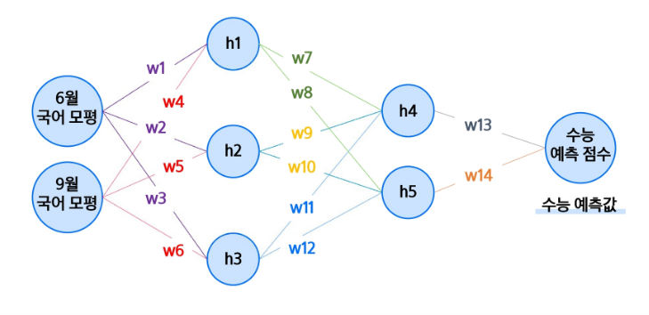

# 데이터 분석을 위한 딥러닝 기초
## 딥러닝 개념 및 흐름
### 딥러닝(Deep Learning)
데이터를 반복 학습하며 패턴을 찾는 인공지능 기술

-> 영상, 음성, 텍스트 등 다양한 데이터에 활용됨

- 딥러닝과 머신러닝 차이
    - 머신러닝은 **사람이 특징을 설계**해야 함
    - 딥러닝은 특징 추출까지 **모델이 자동으로 수행**함
    - 모두 학습 기반이지만 처리 방식에 차이가 있음

        

### 딥러닝 모델 구조
- 수능점수 예측 모델

    

    

    

### 모델 학습 방법
1. 순전파
2. Loss 계산
3. 역전파

- 순전파

    
    
    - `w1, w2, ...` : 가중치(weight)
    - 모두 덧셈, 곱셈으로만 이루어져 있음

- Loss 계산
    - 대표적인 활성화 함수
        - `sigmoid` : 출력값을 0과 1 사이로 압축하는 S자 곡선 형태 함수
        - `Hyperbolic tangent` : Sigmoid를 변형한 함수로, 출력 범위가 -1 ~ 1
        - `Rectified Linear Unit(ReLU)` : 음수 입력은 0, 양수 입력은 그대로 출력

        

    - 예시

        
        
        . . .
        - 학생 7명 넣었을 때의 결과

            
        - 모델이 얼마나 예측을 틀렸는지 판단해주는 근거 = `Loss`

    - 대표적인 Loss 함수
        - MSE (Mean Squared Error)

            
        - RMSE (Root Mean Squared Error)

            

- 역전파(Back propagation)
    - 각 노드의 가중치(w)가 최종 예측값에 얼마나 영향을 끼치는지 파악하여, 오차(손실)을 줄이는 방향으로 가중치를 업데이트 하는 것

    - 예시: `(a + b) * c` 식에서 a,b,c가 각각 최종 결과에 끼치는 영향은 얼마일까?
        - ex. `a = 6`, `b = 11`, `c = -3`

            
        
        - f,g 계산하면 `f = 17`, `g = -51`
        - a, b를 계산해서 만들어진 f를 a, b로 편미분하면 수식 f에 a, b가 끼치는 영향이 어느정도인지 알 수 있음

            
            - `f = a + b` 를 a로 편미분
            - `f = a + b` 를 b로 편미분

        - 전체 식에서 a가 끼치는 영향

            
            - `g = f * c`를 f로 편미분하면 f가 g에 미치는 영향은 -3만큼임
            - (g를 f로 편미분) * (f를 a로 편미분) = g를 a로 편미분
            - 즉, $\left(\frac{\partial g}{\partial f}\right) \cdot \left(\frac{\partial f}{\partial a}\right) = \frac{\partial g}{\partial a}$ 성립
            - 왜? 합성함수의 미분법칙인 **연쇄법칙**에 의해 성립함
            - a가 변할 때 g가 변하는 정도는 'a가 f에 끼치는 영향과, f가 g에 끼치는 영향을 곱한 값'으로 표현할 수 있음
            - 따라서 g (전체식)에 a가 미치는 영향을 구할 수 있음 

        - 전체 식에서 b가 끼치는 영향

            
            - $f = a + b$
            - $g = f \cdot c$
            - $\frac{\partial f}{\partial b} = 1$ -> b가 1만큼 변할 때 f도 1만큼 변함
            - $\frac{\partial g}{\partial f} = c$ -> f가 1만큼 변할 때 g는 c만큼 변함
            - $\left(\frac{\partial g}{\partial f}\right) \cdot \left(\frac{\partial f}{\partial b}\right) = \frac{\partial g}{\partial b}$
            - 즉, b가 변하면 g는 상수 c의 크기만큼 영향을 받음
        
        - 전체 식에서 c가 끼치는 영향

            

### 딥러닝 흐름
1. 순전파 과정을 거쳐 예측값 계산
    - 가중치를 연산하여 예측값을 모델이 추론함

        

2. Loss(손실) 계산
    - 예측값을 실제 정답과 비교하여 오차를 확인하고,
    - 손실 함수를 통해 오차를 계산함

        

3. 역전파 기반 가중치 업데이트
    - 각 가중치가 예측값에 얼마나 영향을 끼치는지 계산한 뒤,
    - 오차를 줄이는 방향으로 가중치 업데이트

    
    
    

- 딥러닝 전체 흐름 요약

    

### Epoch, Batch, Iteration
모델은 전체 데이터를 반복적으로 학습하며, 이 과정을 작은 묶음 단위로 나누어 처리함

- `Epoch` : 전체 학습 데이터가 모델을 한 번 통과한 횟수
- `Batch` : 한 번에 처리하는 데이터 묶음 크기
- `Iteration` : 하나의 Batch를 학습하는 횟수 (한 Epoch 안에 여러 Iteration 존재)

## 이미지 데이터 처리
### 이미지 특징

-> 이미지를 확대해보면 사진이 픽셀들로 구성되어있음을 알 수 있음

-> 하나의 픽셀을 찍어보면, 해당 픽셀의 색상 코드를 확인할 수 있음

-> **이미지도 결국 숫자**

### 이미지 학습 과정

- 학습 과정
    1. 입력 단계 
        - 이미지가 수천~수만 개 픽셀로 분해되어 입력층에 전달됨
    2. 특징 추출 단계
        - 각 픽셀 값은 가중치(w)와 곱해지고, 더해지고, 활성화 함수 등을 거치며 특징(feature)을 뽑아냄
        - 단순한 색·선·모양 같은 저수준 특징부터, 층이 깊어질수록 귀 모양, 털 패턴 같은 고수준 특징까지 추출 가능
    3. 출력 단계
        - 마지막 층에서 추출된 특징들을 종합해 "사진이 강아지일 확률"을 계산함
        - 소프트맥스(Softmax) 같은 함수를 사용해 여러 클래스 중 확률로 변환함
    4. 학습(역전파)
        - 예측 확률과 실제 정답(라벨)의 차이를 **오차(loss)**로 계산
        - 이 오차를 줄이기 위해 **연쇄법칙(Chain Rule)**을 이용한 역전파로 가중치들을 조정
        - 이 과정을 반복하면서 네트워크가 점점 더 정확하게 학습

- 이미지의 특징
    - 이미지는 작은 픽셀들의 집합
    - 각 픽셀은 색(RGB)이나 밝기 같은 정보를 숫자로 표현할 수 있음

    - 픽셀 -> 입력값
        - 딥러닝 모델은 숫자를 다루기 때문에, 이미지를 그대로 모델에 넣을 수는 없음
        - 보통은 이미지를 **1차원 벡터(1열로 나열된 숫자 리스트)**로 바꿔서 입력값으로 사용함
    
    - MLP(다층 퍼셉트론)과 한계
        - 이렇게 변환된 픽셀 벡터를 **MLP(다층 퍼셉트론)**에 넣어 학습할 수 있음
        - MLP는 픽셀 간의 공간적 구조(예: 눈, 귀 위치 관계)를 고려하지 않고 **모든 픽셀을 독립적으로 처리**함
        - 따라서 단순 패턴 학습에는 괜찮지만, 이미지의 위치적/지역적 특징을 잡는 데에는 비효율적
        - 아래 그림과 같이 이미지를 해체시켜 1차원 벡터로 바꾸면 이미지의 특성이 깨짐을 볼 수 있음 -> 이미지가 조금만 바뀌어도 예측 잘 못함

            [59 - 66] 글자빼고 그림만 움짤쓰
    
    - 그래서 나온 것이 **CNN (합성곱 신경망)**
        - CNN은 이미지의 공간 구조를 고려해 **필터(커널)**로 국소 특징을 추출하고, 이를 쌓아가며 복잡한 패턴을 학습함
        - 즉, 이미지의 특징을 유지한 채로 압축하자
        

## 시퀀스 데이터 처리

