# RAG 구조와 생성형 AI
## 생성형 AI와 RAG
### LLM의 한계
- 생성형 AI의 문제점
    - 오래된 정보 (Outdated information)
        - 학습 시점 이후의 최신 데이터를 반영하기 어려움
    - 도메인 특화 능력 부족
        - 특정 전문 분야에서는 깊이 있는 지식이 부족함
    - 거짓말을 잘한다 (Hallucination)
        - 근거 없는 내용을 그럴듯하게 만들어낼 수 있음
    - 지식 매개변수화(parameterizing knowledge) 효율성이 낮음
        - 생성형 AI(특히 LLM)는 "지식"을 파라미터(모델 내부의 수많은 숫자 값)에 저장함
        - 새로운 사실이나 정보를 넣고 싶으면, 그냥 데이터베이스처럼 추가 기록하는 게 아니라 모델 전체를 다시 학습해야만 반영됨
        - 새로운 지식을 빠르고 저비용으로 업데이트하기 어렵고, 효율성이 낮다고 하는 것

- 실제 우리의 요구사항
  - 도메인별 정확한 답변
  - 빈번한 데이터 업데이트
  - 생성된 콘텐츠의 추적성 및 설명성
  - 데이터의 개인정보 보호

- LLM 한계 극복 방법
    
    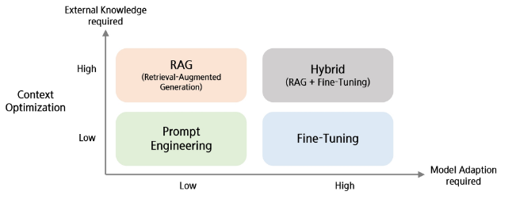
    - y축: 외부 지식(데이터, 문서, 검색 등)을 더 많이 필요로 하는 방법
    - x축: 모델 자체를 수정하거나 적응시키는 정도가 커짐


### LLM 한계 극복 방법
- Prompt Engineering
    - 특정 작업에 대해 모델이 더 잘 반응하도록 **입력 텍스트(프롬프트)를 최적화**하는 방식

        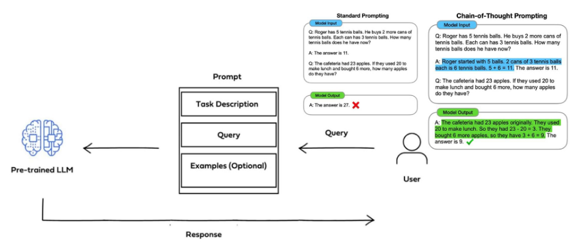
        - 일반적인 프롬프트보다 Chain-of-Thought(단계적 사고 유도) 기법을 활용한 프롬프트가 더 명확하고 일관된 답변을 얻을 수 있음
        - 동일한 모델이라도 프롬프트 설계 방식에 따라 결과가 크게 달라질 수 있음

- RAG
    - 입력 프롬프트와 검색 기반의 정보를 **결합(증강)**하여, **증강된 정보를 기반으로** 답변을 생성하도록 하는 방식

        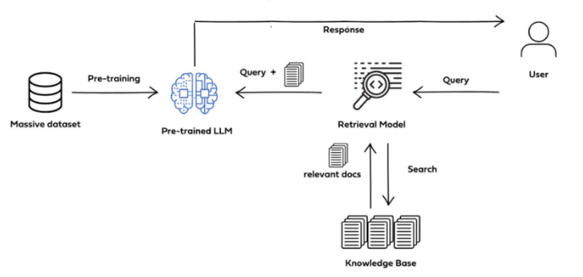
        - 사용자가 질문(Query)을 보내면, 검색을 통해 얻은 관련 문서를 함께 LLM에 입력하고, 이를 바탕으로 답변을 생성함

- Find-Tuning
    - **사전 훈련된 모델**을 특정 작업이나 데이터셋에 맞게 **추가적으로 조정**하는 방식

        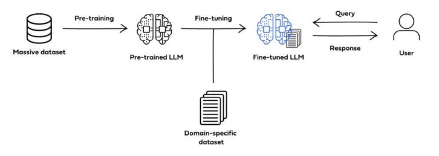
        - 도메인 특화 데이터셋을 추가로 학습시켜, 모델이 해당 분야에 더 잘 맞도록 성능을 향상시킴

※ RAG vs Fine-Tuning

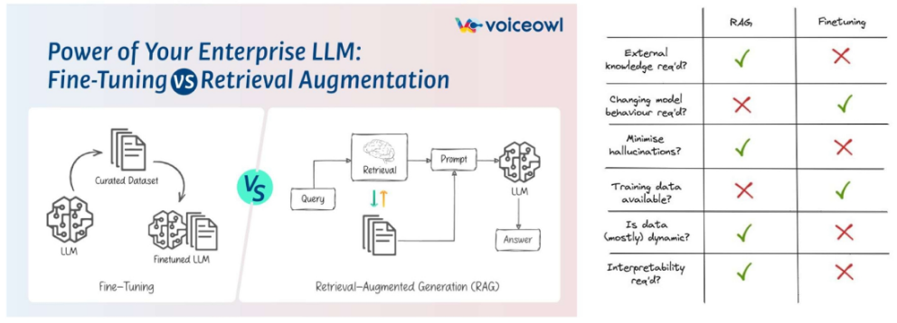

| 질문 | 의미 | RAG | Fine-Tuning |
|------|------|-----|-------------|
| 외부 지식이 필요한가? | 모델이 가진 지식 외에 문서/DB/검색 결과 등을 활용해야 하는가 | ✅ 필요함. 외부 검색 결과를 불러와 답변 생성 | ❌ 불필요. 모델 파라미터에 지식을 내재화 |
| 모델 행동 변경이 필요한가? | 모델의 파라미터나 동작 방식을 새로 조정해야 하는가 | ❌ 모델은 그대로 두고 검색만 결합 | ✅ 특정 작업에 맞게 모델을 재학습시킴 |
| 환각 현상을 줄일 수 있는가? | 근거 없는 답변을 줄일 수 있는가 | ✅ 검색 결과를 근거로 활용 가능 | ❌ 학습 데이터로 정확도는 높아지지만, 환각 자체는 줄이기 어려움 |
| 학습 데이터가 필요한가? | 새로운 학습용 데이터셋이 반드시 필요한가 | ❌ 필요 없음, 검색만 잘 되면 됨 | ✅ 반드시 필요. 추가 데이터로 학습해야 함 |
| 데이터가 자주 바뀌는 것에 적합한가? | 최신성/동적 데이터 반영에 유리한가 | ✅ 외부 검색을 통해 실시간 반영 가능 | ❌ 모델을 다시 학습해야 하므로 부적합 |
| 결과 해석이 필요한가? | 답변의 출처와 근거를 쉽게 확인할 수 있는가 | ✅ 검색된 문서가 근거로 제시됨 | ❌ 모델 내부 파라미터에 내재되어 근거 확인 어려움 |

### RAG
- RAG의 장점  
    - 환각 현상 (Hallucination) 감소  
    - 도메인 적용성 개선  
    - Open domain QA 성능 향상  
    - 참고한 Knowledge base가 적절한지 판단 가능  
    - 정보 검색에 강함 

- RAG vs Fine-Tuning

    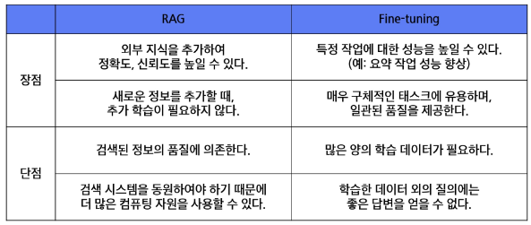

- 정보 검색(Retrieval)  
    - 필요한 정보를 검색하는 작업  
    - 데이터베이스, 인터넷, 또는 다른 정보 저장소에서 관련 정보를 찾아내는 과정  
    - 사용자의 쿼리에 가장 잘 맞는 데이터를 식별하고 추출하는 기술과 알고리즘  
    - 웹 검색 엔진, 디지털 도서관, 온라인 데이터베이스, 정보 검색 시스템 등 다양한 분야에서 중요한 역할 수행  

- 역색인(Inverted Index)  
    - 색인 
        - ex. 1 -> 1페이지 호출, 100 -> 100페이지 호출  
        - 각 데이터에 빠르게 접근할 수 있도록 도움  
    - 역색인
        - ex. "학교" -> 3, 49, 100 페이지  
        - 각 단어로 색인 정보를 연결 시켜 놓음으로 단어 기반 검색이 가능하게 함  

        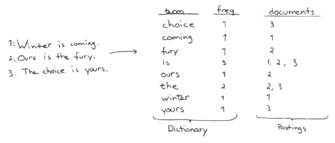

- TF-IDF
    - 어떤 단어가 특정 문서에서 얼마나 중요한지를 수치로 나타내는 방법
    - `TF-IDF(t, d, D) = TF(t, d) * IDF(t, D)` , t = 단어, d = 문서, D = 전체문서

        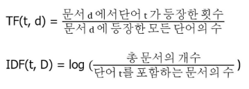
    - TF (Term Frequency, 단어 빈도)
        - 특정 단어 t가 문서 d 안에서 얼마나 자주 등장했는지 나타냄
        - 문서 안에서 많이 등장할수록 중요할 가능성이 높음
    - IDF (Inverse Document Frequency, 역문서 빈도)
        - 단어가 여러 문서에 얼마나 흔하게 등장하는지를 반영
        - 흔한 단어(ex. "the", "is")는 IDF 값이 낮아짐
        - 드물게 등장하는 단어는 IDF 값이 높아져서 중요도가 올라감
    - TF-IDF
        - 한 문서 내에서 단어의 중요도를 평가하는 지표
        - 문서 안에서 자주 등장하고(TF ↑)
        - 전체 문서에서는 드문 단어(IDF ↑)일수록
            - 해당 문서의 특징을 잘 나타내는 중요한 단어

    - 예시
        - 단어 빈도

            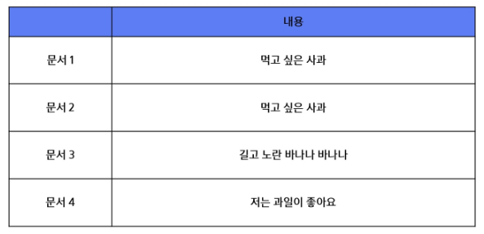
        - 빈도를 TF-IDF로 변환해 각 단어의 중요도를 수치화한 결과(벡터화된 점수)

            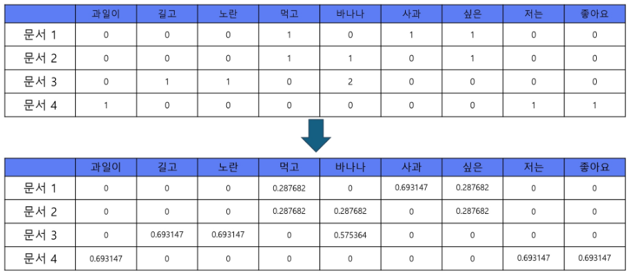
    
    - 문서를 벡터로 표현하면 **수학적으로 문서 간 유사도**를 계산할 수 있음 (벡터 간 관계 확인)
        - 보통 코사인 유사도 사용
        - 두 벡터의 각도가 작을수록(=값이 비슷할수록) 문서 주제가 비슷하다고 볼 수 있음
        - ex. 문서1: "나는 사과를 먹고 싶다" / 문서2: "사과와 바나나를 먹는다"
        - -> TF-IDF 벡터가 비슷해서 두 문서는 과일/먹는 행동 관련 내용이 유사하다고 판별 가능

- BM25  
    - TF-IDF의 정보 검색에서의 단점을 보완한 방식
        - 긴 문서에서 단어가 많이 나오는 건 당연한데, TF-IDF는 그만큼 점수가 무조건 커지는 단점이 있음
        - BM25는 문서 길이 정규화를 통해 이를 보정
    - `Q`: 사용자가 입력한 쿼리  
    - `D`: 대조해보려는 문서  
    - 같은 단어가 여러 번 등장해도, 일정 횟수 이상부터는 중요도가 더 크게 올라가지 않도록 **포화 함수(Saturation)**를 적용
    - 결과적으로, BM25는 "단어 빈도", "문서 길이", "쿼리와의 관련성"을 함께 고려하여 점수를 계산 -> 실제 검색 품질이 TF-IDF보다 뛰어남
    - 대부분의 텍스트 기반 검색을 진행할 때 가장 자주 쓰이는 방식 
        - Elasticsearch, Lucene, Solr 등 대부분의 검색 엔진에서 기본 알고리즘으로 채택

        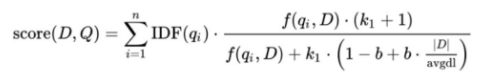
    
- BM25와 유사도 계산
    - BM25는 문서와 쿼리의 관련도를 점수로 계산
    - 이후, 여러 문서 간의 유사도 비교에는 다음과 같은 알고리즘도 활용됨:
        - 코사인 유사도: 두 벡터의 방향(각도)으로 유사도를 측정

            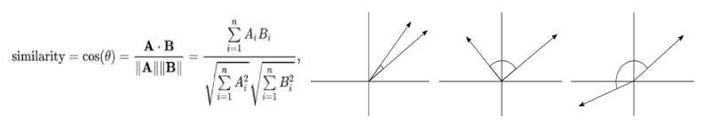
        - L2 거리(Euclidean Distance): 두 벡터 사이의 직선 거리를 계산

            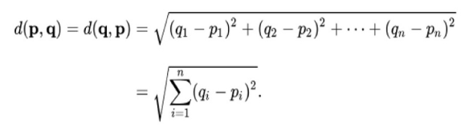

- 벡터 임베딩을 통한 문서 검색
    - 검색에 더 좋은 벡터는 없을까?

        

    - 희소 벡터 (Sparse Vector)
        - 단어 사전에 기반하여 각 문서나 단어를 벡터로 표현
        - 특징:
            - 차원이 매우 큼 (ex. 사전에 50,000개 단어가 있으면 벡터 길이도 50,000)
            - 대부분 값이 0 -> "희소(sparse)"하다고 함
            - ex. TF, TF-IDF, BM25
        - 장점: 단순하고 직관적
        - 단점: ① 단어 간 의미적 유사성을 반영하지 못함 (예: "강아지" ≠ "개") ② 차원이 커서 계산 비효율적
    
    - 밀집 벡터 (Dense Vector)
        - 신경망(Word2Vec, GloVe, BERT 등)을 통해 학습된, 상대적으로 낮은 차원의 연속적인 벡터
        - 특징:
            - 차원이 작음 (보통 100~1024 차원)
            - 대부분의 값이 0이 아님 -> "밀집(dense)"하다고 함
            - 단어/문장/문서를 **의미 공간(semantic space)**에 매핑
        - 장점: ① 단어 간 의미적 관계를 반영 (예: "강아지"와 "개"의 벡터 거리가 가까움) ② 유사도 계산 시 더 자연스러운 결과 도출
        - 단점: 해석력이 떨어짐 (벡터의 각 차원이 무슨 의미인지 직관적으로 알기 어려움)
    
    - 발전 흐름
        - TF-IDF, BM25 -> 희소 벡터 기반 검색
        - Word2Vec, BERT, Sentence Embedding -> 밀집 벡터 기반 검색
        - 최근에는 검색 정확도 향상을 위해 Dense Retrieval 방식이 주로 사용됨

    - BERT의 임베딩과 BM25의 성능 비교
        - TF-IDF와 BM25는 희소 벡터 기반 검색 기법이지만, 최근에는 단어 의미를 반영하는 밀집 벡터 기반 임베딩(Word2Vec, BERT 등)이 더 좋은 검색 품질을 보여주고 있음
        - BM25: 문서 벡터 차원이 매우 큼 (단어 사전에 의존)
        - BERT: 문서 벡터 차원이 768차원으로 고정되어 효율적

            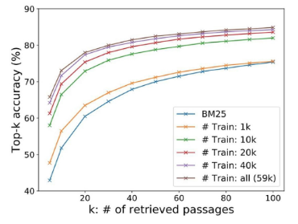

- RAG (Retrieval-Augmented Generation)
    - Retrieval (검색): 외부 데이터 및 소스를 검색하여 정보 획득
    - Augmented (증강): 사용자의 질문을 보강하여 보다 정확한 문맥 제공
    - Generation (생성): 향상된 정보를 기반으로 더 좋은 답변 생성

    - 특징
        - 답변할 때 확실한 출처를 기반으로 생성하게 됨
        - 정보 검색(retrieval)과 응답 생성(generation)을 결합한 모델
        - 사용자의 질문이 주어지면, Retriever는 관련된 정보나 문서를 데이터베이스에서 검색
        - 검색된 정보로 질문에 대한 답변 생성
        - 보다 풍부하고 정확한 정보를 제공 가능

        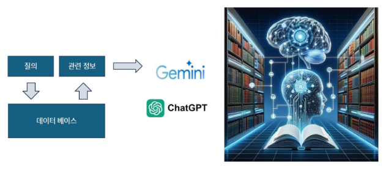

    - RAG 없는 일반 챗봇

        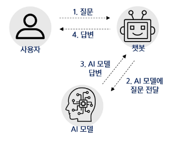
    
    - RAG 활용한 챗봇

        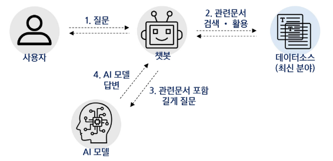
    
    - 상용 LLM
        - 텍스트생성, 이해, 번역 등 다양한 NLP 작업 수행
        - 매우 큰 텍스트 데이터 셋에서 학습
        - 높은 정확도와 자연스러운 언어 생성

            


## LangChain
### LangChain
ChatGPT 프로그램 안에서 벗어나 LLM의 기능을 나만의 코드(Javascript/Python)으로 가져와서 이를 자유자재로 사용할 수 있게 해주는 강력한 "프레임워크"

-> 즉, LLM을 활용한 애플리케이션을 쉽게 만들 수 있도록 도와주는 프레임워크

-> LLM으로 하는 모든 것을 LangChain을 통해서 할 수 있음을 의미

-> ex. 프롬프트 엔지니어링, RAG, Agent, 외부 LLM API 사용 및 Local LLM 구동, Moderation, ...


- LangChain 특징
    - LangChain을 통해 다양한 외부 및 내부 라이브러리 통합을 쉽게 할 수 있음
    - LLM과 여러 다른 소스들을 Chaining해서 복잡한 애플리케이션도 쉽게 구현

        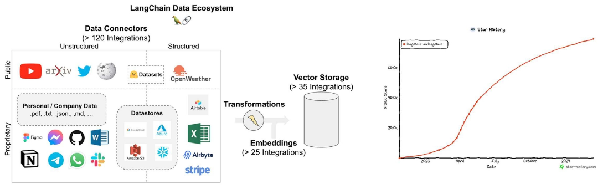

- LangChain 구성도

    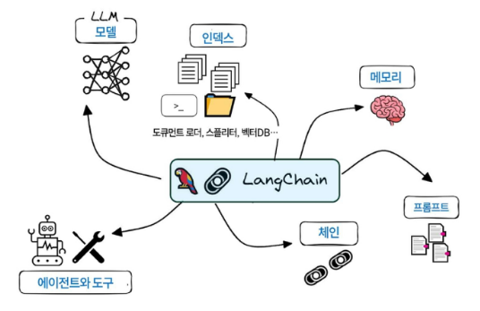
    - LLM 
        - 초거대 언어모델로, 생성 모델의 엔진과 같은 역할을 하는 핵심 구성 요소
        - ex. GPT-4, PALM, LLAMA, Deepseek ...
    - Prompts  
        - 초거대 언어모델에게 지시하는 명령문
        - ex. Prompt Templates, Chat Prompt Template, Example Selectors, Output Parsers
    - Index
        - LLM이 문서를 쉽게 탐색할 수 있도록 구조화 하는 모듈
        - ex. Document Loaders, Text Splitters, Vectostores, Retrievers
    - Memory 
        - 채팅 이력을 기억하도록 하여 이를 기반으로 대화가 가능하도록 하는 모듈
        - ex. ConversationBufferMemory, Entity Memory, Conversation Knowledge Graph Memory
    - Chain 
        - LLM 사슬을 형성하여 연속적인 LLM 호출이 가능하도록 하는 핵심 구성 요소
        - ex. LLM Chain, Question Answering, Summarization, Retrival Question/Answering
    - Agents 
        - LLM이 기존 Prompt Template으로 수행할 수 없는 작업을 가능케 하는 모듈
        - ex. Custom Agent, Custom MultiAction Agent, Conversation Agent

### LangChain의 구성
1. LLM 추상화(Abstraction) 제공
    - 추상화(Abstraction)란 사용자에게 불필요한 세부 사항을 숨겨 복잡성을 처리하는 것
    - 사용자는 숨겨진 복잡성을 모두 이해하거나 생각하지 않고 제공된 추상화에서 나만의 로직 구현 가능

        
    - 언어모델(Language Model)을 연결(Chain)하여 애플리케이션 구축 가능
    - 모든 LLM 모델을 자세히 공부하지 않고도 간단히 접속을 위한 API 키를 통해 사용 가능

2. Prompts
    - Context와 Query를 수동으로 작성할 필요 없이 **프롬프트의 구성을 구조화**함

    - 템플릿 (구조화된 스타일)
    
        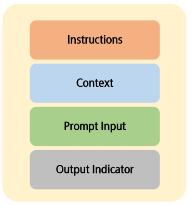
        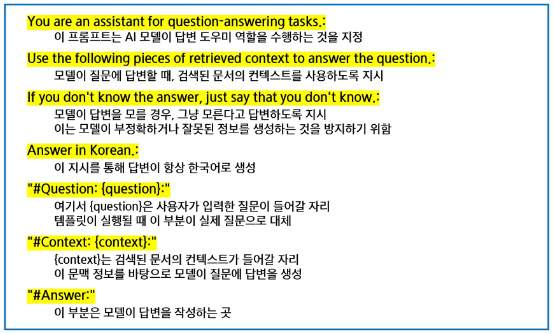

3. Chain
    - 체인을 연결하여 응답 처리를 연속적으로 실행할 수 있도록 **연결**하는 기능

        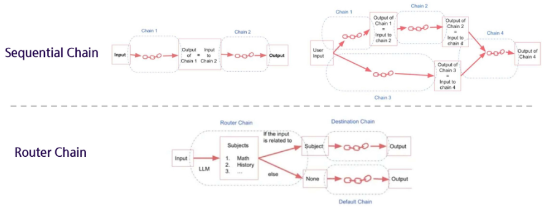
        - Sequential Chain: 여러 단계를 파이프라인 형태로 순차적으로 실행 -> 앞 단계 출력이 뒷 단계 입력으로 연결됨 (단계적·순차적 처리)
        - Router Chain: 특정 조건이나 입력에 따라 다른 체인으로 분기하여 실행 -> 상황별 맞춤 처리 가능

4. Index
    - 자체 학습 데이터셋에 포함되어 있지 않은 **특정 외부 데이터 소스** 총칭
    - `Document Loader` : 파일 저장 서비스 같은 소스에서 데이터 소스를 가져옴
    - `Vector DB` : 데이터 포인터를 벡터 임베딩으로 변환하여 표현 -> 효율적인 검색 지원
    - `Text Splitters` : 의미있는 작은 덩어리로 분할 -> 깔끔한 요약 정리 가능

        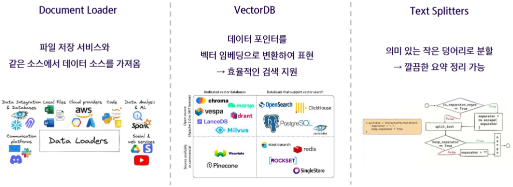

5. Memory
    - 사용자가 LLM과 대화하는 동안 사용자의 정보를 포함하여 대화에 대한 **주요 사실을 기억**하고, 향후 상호 작용에 해당 적보 적용 가능

        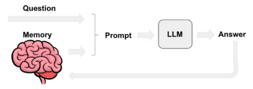

6. Agents
    - LLM과 다른 데이터 소스나 도구 **두 가지 이상 조합**하여 사용 가능
    - 선택한 LLM을 추론 엔진으로 사용하여 어떤 작업을 수행할지 결정

        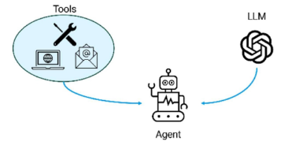

- LangChain에서의 Chat Model 활용
    - LLM은 다양한 언어 작업을 수행할 수 있는 범용 대규모 언어 모델이라면,
    - Chat Model은 대화 상호작용 및 대화에 최적화된 LLM의 특화된 버전

        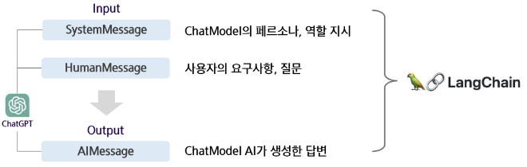
        - LangChain은 Chat Model을 그대로 가져와서, 프롬프트를 여러 메시지 단위로 관리
        - 즉, 하나의 긴 문자열 프롬프트가 아니라 system, human, ai 메시지를 구조적으로 쌓아올림

    - 일반 LLM은 입력-출력만 있는 텍스트 모델인데, Chat Model은 system/human/ai 메시지 구조를 지원해서 대화 문맥 관리에 최적화돼 있고, LangChain은 이 구조를 그대로 가져와 체인/에이전트 설계에 활용함

### LangChain의 Chaining
- LCEL (LangChain Expression Language)
    - `chain = {"question" : RunnablePassthrough()} | Prompt | llm | StrOutputParser()`
        - `|` : 서로 다른 구성 요소를 연결하고, 한 구성 요소의 출력을 다음 구성 요소의 입력으로 전달
        - `RunnablePassthrough()` : 사용자의 질문이 "question" 키의 값(value)으로 전달
        - `prompt` : 입력 받은 질문이 담긴 "question"을 포함한 프롬프트 템플릿 생성
        - `llm` : 프롬프트 템플릿 완성 후, LLM 언어 모델에게 전달하여 답변 생성
        - `StrOutputParser()` : 마지막 단계에서 생성된 답변을 문자열로 변환하여 최종 출력 생성

    - 여러 체인을 연결하여 복잡한 워크플로우를 제어하거나 여러 논리적 흐름 생성 가능

        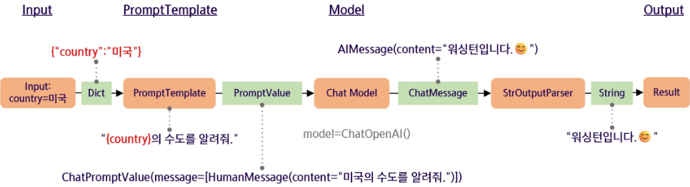

### LangChain으로 할 수 있는 것
- 데이터 분석하기 - Excel
    
    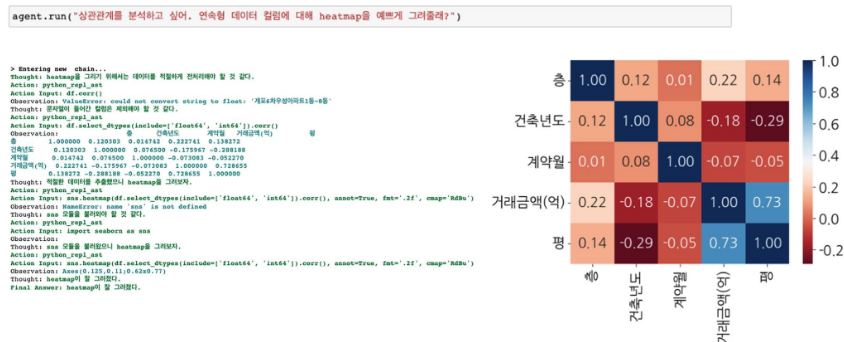

    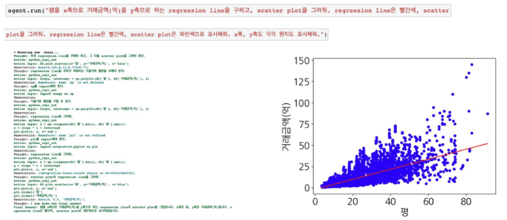

- 웹에서 정보 수집하기 - URL

    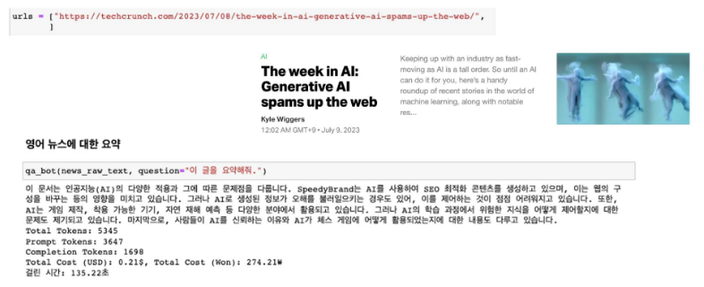

- 영상 내용 요약하기 - YouTube

    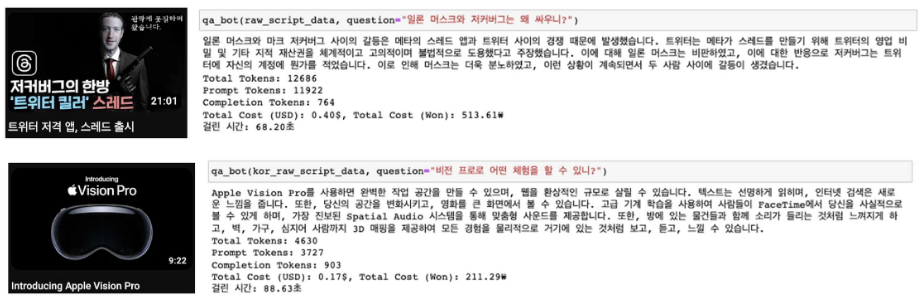

- RAG를 활용한 문서 QA 챗봇
    - RAG (검색 증강 생성) 기법을 활용해서 문서를 근거로 하는 QA 챗봇을 개발할 수 있음

        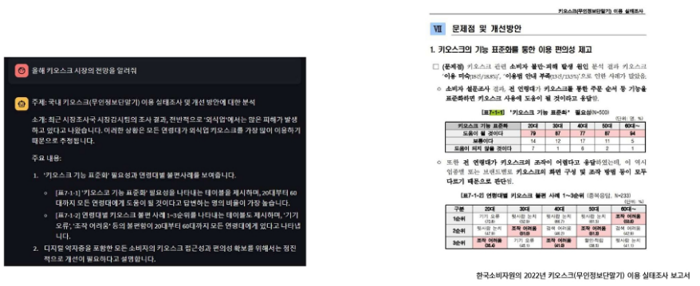
        - 보고서, 논문 등 텍스트 데이터를 벡터 DB에 저장
        - 사용자가 질문하면 -> 질문도 벡터로 변환하여 DB에서 관련성이 높은 문서 조각(청크) 검색
        - 검색된 문서 조각을 LLM의 입력 프롬프트에 추가 -> 모델이 단순히 "지어내는" 것이 아니라 실제 문서 근거를 바탕으로 답변 생성
        - 이 과정 덕분에 최신성, 근거 기반, 신뢰도 높은 답변을 제공할 수 있음

    - LangChain 챗봇 아키텍쳐
        - 비정형 데이터(pdf, txt, docs, ..)를 QA Chain으로 바꾸는 형태

            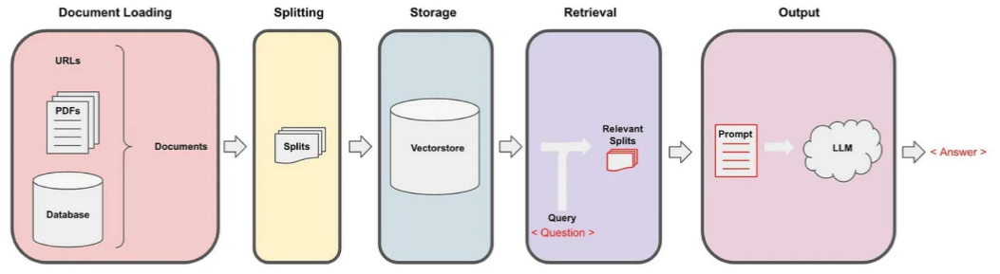
            1. Document Loading: PDF, TXT, DB 등 다양한 비정형 데이터를 불러옴
            2. Splitting: 문서를 작은 단위(청크)로 분할 -> 검색 효율성 확보
            3. Embedding & Storage: 청크를 벡터 임베딩으로 변환 후 Vectorstore(DB)에 저장
            4. Retrieval: 사용자가 질문하면 쿼리를 벡터로 변환 -> Vectorstore에서 관련 청크 검색
            5. QA Chain (LLM): 검색된 청크를 프롬프트에 넣고 LLM이 답변 생성
        - 즉, **데이터 → 임베딩 → 저장 → 검색 → LLM 응답**의 체인 형태로 동작

### LangChain의 핵심 Retrieval
- RAG
    - 외부 데이터를 참조하여 LLM이 답변할 수 있도록 도움

        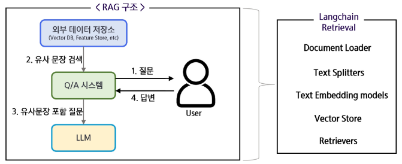

- PDF 챗봇 구축 예시
    - 문서를 기반으로 챗봇을 구축하는 경우, 아래와 같은 과정을 통해 대화가 가능하도록 함

        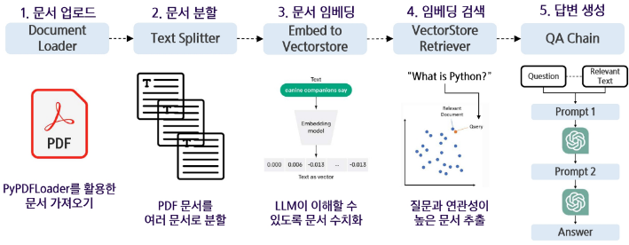

- 랭체인의 Retrieval
    - Retrieval은 RAG의 대부분의 구성 요소를 아우르며, 구성요소 하나하나가 RAG의 품질을 좌우함
        
         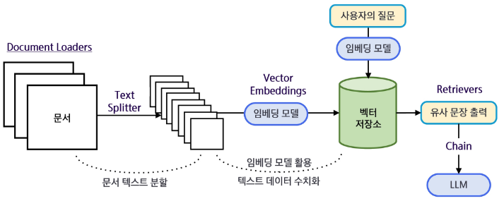

### LangChain + RAG 예시 코드 
뉴스 QA, 검색 청크 출력

- 라이브러리
    ```python
    # LangChain + RAG 예시 코드 (뉴스 QA, 검색 청크 출력)
    import os
    from typing import List
    from dotenv import load_dotenv

    # 문서 로더, 텍스트 분할기(청킹), 벡터스토어(FAISS)
    from langchain_community.document_loaders import TextLoader
    from langchain_text_splitters import RecursiveCharacterTextSplitter
    from langchain_community.vectorstores import FAISS

    # OpenAI 임베딩 및 LLM
    from langchain_openai import OpenAIEmbeddings, ChatOpenAI

    # 대화형 메시지 포맷(시스템 지시 / 사용자 메시지)
    from langchain.schema import HumanMessage, SystemMessage
    ```

- api 키 설정
    ```python
    # 0. API Key 설정 (.env에서 불러오기)
    load_dotenv()
    api_key = os.getenv("OPENAI_API_KEY")
    ```

- 텍스트 파일 로드
    ```python
    # 1. 텍스트 파일 로드
    def load_news_data(txt_file_path):
        """
        텍스트 파일을 LangChain의 Document 형태로 로드합니다.
        - TextLoader는 파일을 읽어서 Document 리스트로 반환합니다.
        - 각 Document에는 'page_content'(텍스트)와 'metadata'(부가정보)가 포함됩니다.
        """
        # 주어진 경로에 파일이 존재하는지 확인
        if not os.path.exists(txt_file_path):
            raise FileNotFoundError(f"파일을 찾을 수 없습니다: {txt_file_path}")

        loader = TextLoader(txt_file_path, encoding="utf-8")
        documents = loader.load()
        print(f"로드 완료: {len(documents)}개 문서")

        return documents
    ```
    - TextLoader
        - langchain_community.document_loaders 라이브러리
        - 텍스트 파일을 읽어서 LangChain에서 사용하는 **Document 객체 리스트**로 변환
        - 파일 경로와 인코딩(encoding="utf-8")을 지정 가능
        - 반환값:
            - `[Document(page_content="텍스트 내용", metadata={...}), ...]` 형태의 리스트
        
    - `loader.load()`
        - TextLoader 객체의 메서드
        - 지정한 파일을 읽고, Document 리스트로 반환
            ```python
            documents = loader.load()
            # [Document(page_content="뉴스 기사 내용1", metadata={...}), ...]
            ```

- 문서 분할
    ```python
    # 2. 문서 분할 (청킹)
    def split_documents(documents, chunk_size = 200, chunk_overlap = 50):
        """
        긴 문서를 작은 청크로 분할합니다.
        - chunk_size: 한 청크의 최대 길이 (문자 수 기준).
        - chunk_overlap: 청크 간 겹치는 부분의 길이. 문맥 단절을 방지합니다.
        """
        splitter = RecursiveCharacterTextSplitter(
            chunk_size=chunk_size,
            chunk_overlap=chunk_overlap
        )
        splits = splitter.split_documents(documents)
        print(f"분할 완료: {len(splits)}개 청크 생성")

        # 디버깅용: 앞의 몇 개 청크 미리보기
        preview_n = min(3, len(splits))
        for i in range(preview_n):
            print(f"\n[청크 미리보기 {i+1}]")
            print(splits[i].page_content[:200].strip(), "...")
        return splits
    ```
    - RecursiveCharacterTextSplitter
        - langchain_text_splitters 라이브러리
        - 긴 텍스트를 일정 크기 단위로 잘라 **Document 청크 리스트**로 만드는 클래스
        - 동작 방식:
            - 먼저 큰 단위(예: 문단 → 문장 → 단어) 순으로 분할 시도
            - `chunk_size`보다 길면 더 작은 단위로 재귀적으로 쪼갬 -> 문맥 단절 최소화
        - 주요 파라미터:
            - `chunk_size`: 청크 하나의 최대 길이 (문자 수 기준, 보통 200~1000 정도 설정)
            - `chunk_overlap`: 청크 사이에 겹치는 부분(문자 수) -> 이전 청크 일부를 다음 청크에 포함시켜 문맥 연결성 보장
    
    - `splitter.split_documents(documents)`
        - 입력: documents (앞 단계에서 로드한 Document 리스트)
        - 출력: 여러 개의 작은 Document 청크 리스트
        - 각 청크는 여전히 Document 객체이며, page_content(본문)과 metadata를 가짐

- 벡터 DB 구축
    ```python
    # 3. 벡터 DB 구축 (임베딩 → FAISS 인덱스)
    def store_in_vector_db(splits):
        """
        텍스트 청크를 임베딩(벡터화)한 후, FAISS를 이용해 빠른 유사도 검색이 가능한 DB를 만듭니다.
        - OpenAIEmbeddings: OpenAI의 임베딩 모델을 사용합니다.
        - FAISS: 대규모 벡터 검색에 최적화된 라이브러리입니다.
        """
        embeddings = OpenAIEmbeddings(api_key=api_key, model="text-embedding-3-small")
        vector_store = FAISS.from_documents(splits, embeddings)
        print("벡터 DB 생성 완료")
        return vector_store
    ```
    - OpenAIEmbeddings
        - langchain_openai 라이브러리
        - OpenAI의 임베딩 API를 사용하는 클래스
        - 텍스트 입력을 받아 **밀집 벡터(Dense Vector)**로 변환
        - 여기서는 "text-embedding-3-small" 모델을 사용 (차원 수 1536, 가볍고 빠름)
        - 즉, plits(청크 리스트)의 텍스트를 벡터화하는 역할
    
    - FAISS
        - langchain_community.vectorstores 라이브러리
        - Facebook AI에서 개발한 고속 벡터 검색 라이브러리
        - 수십만~수백만 개 벡터에 대해서도 빠른 최근접 이웃 검색(NN Search) 가능
        - 보통 유사도 검색이나 추천 시스템에 활용
        - LangChain에서 `FAISS.from_documents(docs, embeddings)` 형태로 쉽게 벡터 DB를 만들 수 있음
    
    - `FAISS.from_documents(splits, embeddings)`
        - 입력:
            - `splits`: 분할된 Document 리스트
            - `embeddings`: 텍스트를 벡터화할 임베딩 모델
        - 동작: 
            - 각 Document 청크 -> 임베딩 모델을 통해 벡터화
            - 모든 벡터를 FAISS 인덱스에 저장
        - 출력:
            - FAISS 기반 **VectorStore 객체**

- 문서 검색
    ```python
    # 4. 문서 검색
    def retrieve_similar_docs(query_text, vector_store, k = 2):
        """
        사용자의 질문을 벡터화하여, 의미적으로 가장 유사한 청크 k개를 검색합니다.
        """
        docs = vector_store.similarity_search(query_text, k=k)

        # 검색된 청크 출력
        print("\n[검색된 청크]")
        for i, d in enumerate(docs, 1):
            print(f"\n--- 청크 {i} ---")
            print(d.page_content.strip())
        return docs     # 검색된 청크 리스트를 반환
    ```
    - `vector_store.similarity_search(query_text, k=k)`
        - 입력된 질문(query_text)을 임베딩 벡터로 변환하고, 벡터 DB에서 가장 가까운 문서 청크들을 검색
        - 주요 파라미터:
            - `query_text`: 사용자가 입력한 질문
            - `k`: 검색해서 가져올 문서(청크) 개수 (기본 2개)
        - 출력:
            - Document 객체 리스트 → 각 객체는 .page_content(본문)와 .metadata(출처 정보)를 포함

- 답변 생성
    ```python
    # 5. 답변 생성 (검색된 청크 기반)
    def generate_answer(query_text, docs):
        """
        검색된 청크를 LLM에 제공하여 답변을 생성합니다.
        - SystemMessage: 모델의 역할과 규칙 정의 (예: 뉴스 분석 전문가).
        - HumanMessage: 실제 질문과 검색된 청크를 함께 전달.
        - LLM은 "주어진 청크"만 근거로 답변합니다.
        """
        llm = ChatOpenAI(model="gpt-4o-mini", temperature=0, api_key=api_key)

        # 검색된 청크들을 하나의 텍스트로 합칩니다.
        docs_text = "\n\n".join([doc.page_content for doc in docs])

        system_message = SystemMessage(
            content="너는 뉴스 분석 전문가야. 반드시 주어진 문서 내용만 바탕으로 답변하고, 문서에 없는 내용은 '잘 모르겠습니다'라고 말해."
        )
        human_message = HumanMessage(
            content=f"질문: {query_text}\n\n[참고 문서]\n{docs_text}"
        )

        response = llm.invoke([system_message, human_message])
        return response.content
    ```
    - ChatOpenAI
        - langchain_openai 라이브러리
        - OpenAI의 **대화형 LLM(Chat Model)**을 호출하는 클래스
        - 주요 파라미터:
            - `model="gpt-4o-mini"` -> 사용할 모델 지정
            - `temperature=0` -> 무작위성 최소화, 일관되고 근거 기반 답변 유도
            - `api_key=api_key` -> API 인증
    
    - `docs_text = "\n\n".join([...])`
        - 검색된 청크들의 본문(page_content)을 합쳐서 하나의 텍스트 블록으로 만듦
        - 이렇게 해야 LLM이 답변할 때 여러 문서를 **한꺼번에 근거**로 활용 가능
    
    - SystemMessage
        - langchain.schema 라이브러리
        - Chat Model에서 모델의 역할·규칙을 지정하는 메시지
        - 여기서는:
            - "너는 뉴스 분석 전문가야" → 모델의 역할 부여
            - "반드시 주어진 문서 내용만 바탕으로 답변" → 답변 범위 제한
            - "문서에 없는 내용은 ‘잘 모르겠습니다’라고 답변" → 환각 방지
    
    - HumanMessage
        - langchain.schema 라이브러리
        - 실제 사용자 입력을 담는 메시지
        - 여기서는:
            - 질문(query_text) + 참고 문서(docs_text) 함께 전달
            - 모델이 답변할 때, 반드시 **검색된 문서 조각을 근거로 사용**하도록 유도
    
    - `llm.invoke([system_message, human_message])`
        - ChatOpenAI 모델을 호출하여 답변 생성
        - 입력: 메시지 리스트 (system_message, human_message)
        - 출력: LLM이 생성한 답변 (response.content)

- 실행
    ```python
    # 6. 실행
    txt_file_path = "./news.txt"  # 분석할 뉴스 기사 파일

    # 사용자가 물어볼 질문 리스트
    queries = [
        "정부가 발표한 총 예산 규모는 얼마인가?",
        "농촌 지역 교통격차 해소를 위해 얼마가 투입되었나?",
        "친환경 버스 보급과 관련된 목표는 무엇인가?",
    ]

    # Step 1. 뉴스 데이터 로드
    # TextLoader로 뉴스 기사 파일을 불러와 Document 리스트로 변환
    documents = load_news_data(txt_file_path)

    # Step 2. 문서 분할 (청킹)
    # 긴 문서를 작은 청크 단위로 분할
    splits = split_documents(documents, chunk_size=200, chunk_overlap=50)

    # Step 3. 벡터 DB 구축
    # 각 청크 → OpenAI 임베딩을 통해 벡터화
    # FAISS에 저장 → 빠른 유사도 검색이 가능한 벡터 DB 생성
    vector_store = store_in_vector_db(splits)

    # Step 4. 질문별 검색 및 답변 생성
    for q in queries:
        print("\n" + "-" * 80)
        print("질문:", q)

        # 사용자의 질문(q)을 벡터로 변환 → DB에서 가장 유사한 청크 2개 검색 (k=2)
        similar_docs = retrieve_similar_docs(q, vector_store, k=2)
        # 검색된 청크들을 기반으로 generate_answer 호출 → LLM이 답변 생성
        answer = generate_answer(q, similar_docs)

        print("\n답변:", answer)
    ```

### AI Agent
사용자의 목표를 달성하기 위해 스스로 문제를 분석하고, 해결 가능한 작은 작업 단위로 분해(Planning)한 뒤, 필요 시 외부 툴이나 API를 활용하여 작업을 수행하며, 결과를 반복적으로 검토(Self-Reflection)하고 개선하는 시스템

-> LLM과 다른 데이터 소스나 도구 두 가지 이상 조합하여 사용 가능

-> 선택한 LLM을 추론 엔진으로 사용하여 어떤 작업을 수행할지 결정

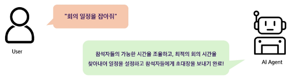

- ChatGPT
    - AI Agent의 하위 개념 또는 구성 요소로 볼 수 있으며, 단순히 텍스트를 생성하는 언어모델임

- AI Agent
    - ChatGPT 같은 LLM을 코어 엔진으로 활용되며, 추가적으로 툴 사용, 계획, 자율적 실행 기능이 결합된 시스템

- AI agent vs. ChatGPT
    - AI agent
        - 자율성과 상호작용 능력
        - 사용자가 요구한 작업의 완료를 위해 활용 가능한 여러 도구와의 상호작용을 연쇄적으로,
            자율적으로 수행할 수 있는 기술
    - ChatGPT
        - 주로 단일 플러그인을 사용하여 질문에 답변
        - 기본 ChatGPT는 툴과 직접 상호작용하지 않음

- Tool
    - 에이전트가 활용할 수 있는 기능적 요소
        
        
        - AI가 혼자 해결하기 어려운 작업을 도와주는 보조 도구
        - 특정 작업을 위해 외부 기능이나 전문가를 불러오는 개념
        - ex. PDF 읽기, 웹 검색, 코드실행 등
    - 이를 통해 '역할 기반 설정 + 배경 지식 제공 + 실질적인 작업 처리 능력'을 갖춘 자동화 에이전트 구성 가능


## 추가 개념 및 정리
