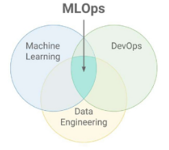
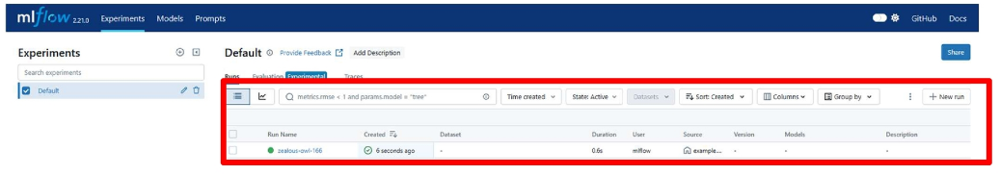

# MLFlow 기본 개념과 세팅
## MLOps 개념 및 MLFlow 역할
### MLOps (Machine Learning Operations)
머신러닝 모델의 개발과 운영을 통합하여 모델의 개발, 배포, 모니터링, 유지 보수 등의 전 과정을 자동화하여 효율적으로 하는 일련의 관행

-> MLOps를 사용하면 조직은 ML 수명 주기 전반의 프로세스를 자동화하고 표준화 가능

※ 여기서 말하는 **프로세스**는 모델 개발, 테스트, 통합, 릴리스 및 인프라 관리 포함

-> MLOps는 협업 기능이며, 주로 데이터 사이언티스트, DevOps 엔지니어, IT로 구성 



- 기존 머신러닝 프로세스의 한계점 
    - 데이터 품질과 양에 대한 의존성 문제  
        - **머신러닝 모델은 대량의 고품질 데이터를 필요**로 하는데, 대부분의 실제 데이터는 노이즈와 불완전한 데이터가 많아 모델의 성능을 저하 시킴  
    - 특징 추출의 어려움  
        - 특정 **도메인 전문가가 수동으로 특징을 추출**해야 하므로 비용과 시간이 많이 소모  
    - 새로운 상황에 대한 대응 문제  
        - 머신러닝 모델이 **학습한 데이터의 범위 내**에서만 정확한 예측이 가능  
    - 모델 해석의 어려움  
        - **복잡한 모델**일수록 **내부 동작 방식을 이해하기 어려움**  
    - 데이터 분포 변화에 대한 민감성  
        - 시간에 따라 변화하는 데이터의 분포에서 기존에 학습된 모델은 성능 저하를 일으킴  
    - 이러한 한계점을 극복하기 위해 **딥러닝**과 **MLOps** 등의 새로운 접근법이 개발됨

- MLOps의 필요성  
    - 반복 실험의 체계화  
        - 수많은 하이퍼파라미터 조합 실험  
        - 데이터 전처리 방식, 피처 선택 변화  
        - 실험 결과 비교를 위한 자동 기록  
    - 협업 효율성 향상  
        - 여러 팀원이 같은 실험을 반복하지 않음  
        - 실험 결과를 다른 사람과 쉽게 공유  
        - 버전 관리로 변경 사항 추적 용이  
    - 재현성 확보  
        - 실험이 시간이 지나도 재현 가능한 구조  
        - 동일한 코드 + 데이터 + 환경 → 동일한 결과  
    - 추적성 확보  
        - 어떤 실험에 어떤 성능이 나왔는지 확인  
        - 실험 조건, 환경, 결과가 모두 기록 

        

### MLOps 주요 단계


- MLOps 핵심 4단계  
    1. 데이터 준비  
        - 데이터 수집  
        - 데이터 전처리  
        - 특성 엔지니어링  
    2. 모델 학습 및 검증  
        - 모델 개발  
        - 모델 학습  
        - 모델 검증  
    3. 모델 배포  
        - 배포 준비 (ex. 서버환경)
        - 배포  
        - 배포 전략  
    4. 모델 모니터링 및 관리  
        - 성능 모니터링  
        - 데이터 드리프트 감지  
        - 모델 업데이트  

- 자동화 구조로서의 MLOps (CI / CT / CD)

    
    - CI(Continuous Integration)
        - **코드 변경 시 자동 테스트** -> 코드 품질 보장
        - 코드(모델 스크립트, 파이프라인) 변경 시 자동으로 통합 및 테스트
        - 데이터 전처리 코드, 모델 구조 변경 사항 포함

    - CT(Continuous Training)
        - **데이터 변화에 따른 재학습** -> 최신 모델 유지
        - 새로운 데이터가 들어오면 모델을 자동으로 재학습
        - 정기적 스케줄 또는 이벤트 기반으로 작동
        - 실험 추적 도구(MLFlow)와 함께 사용시 강력함

    - CD(Continuous Delivery)
        - **모델 자동 배포** -> 운영 자동화, 실시간 대응
        - 학습이 완료된 모델을 자동으로 서버 환경에 배포
        - REST API 형태, 클라우드 환경 등 다양하게 적용 가능

### MLFlow
MLFlow는 실험의 전체 생애주기(Lifecycle)를 관리하는 오픈소스 플랫폼

-> 머신러닝 모델을 만들고 실험하고 배포하기까지의 과정을 더 체계적으로 재현 가능하게 관리해주는 도구

- MLFlow의 등장 배경
    - 2018년도 Databricks에서 개발
    - 다양한 프레임워크에 독립적이고, 설치도 간편한 오픈소스
    - 실험 기록, 모델 저장, 버전 관리, 배포를 하나로 지원
    - MLFlow는 **"머신 러닝 실험의 Git"** and **"운영 자동화 도구"**

- MLFlow를 이해하기 위한 예시
    - 붕어빵 장사를 한다고 가정
    - `(붕어빵 장사를 위한 레시피 실험 -> 결과 비교 -> 최적 레시피 선택 -> 판매까지 전 과정을 자동화)` **= MLflow의 역할**

        

- MLflow가 필요한 이유
    - 기존 머신러닝 운영의 문제점을 **MLflow의 핵심 기능 4가지로 해결** (Tracking, Projects, Models, Model Registry)

        

- MLflow 4대 컴포넌트

    
    - Tracking
        - 머신러닝 실험에서 사용된 파라미터, 메트릭, 아티팩트 등을 **기록하고 추적**  
    - Projects
        - **재사용 가능한 형태로 머신러닝 코드를 패키징**하여 표준 형식으로 제공  
    - Models 
        - **다양한 배포 환경에 맞게 모델을 패키징 가능**  
    - Models Registry
        - 모델의 버전 관리, 상태 추적, 주석 추가 등을 통해 **중앙 집중식으로 모델을 관리**  

- MLflow 장점
    - 협업 향상
        - 중앙 집중화된 실험 관리  
        - MLflow는 **실험 데이터를 중앙에서 관리**하여, 팀원들이 실험 결과를 공유하고 협업하도록 지원  

    - 실험 추적 효율화
        - 자동 로깅  
        - 모델 학습 시 사용된 파라미터, 메트릭, 아티팩트 등 **로그를 자동으로 기록**하여 실험을 체계적으로 추적  

    - 재현성 강화
        - 환경 및 코드 패키징  
        - MLflow는 **코드와 실행 환경을 패키징**하여, 동일한 조건에서 실험을 재현 가능  


## MLFlow 주요 구성 요소
### MLflow Tracking
머신러닝 실험과 실행을 체계적으로 관리하기 위한 **API와 UI 제공**하는 컴포넌트  


-> Tracking은 실험의 각 실행(`run`)으로 구성되며, 실행은 여러 번 발생 가능

-> MLFlow Tracking 기능을 통해 머신러닝 실험의 **재현성, 투명성, 효율성** 향상  

- MLflow Tracking의 주요 기능
    - Parameter(파라미터)
        - 모델 학습에서 사용된 입력 데이터를 키-값 쌍으로 저장 및 추적  
    - Metric(지표)
        - 모델의 성능 지표(정확도, 손실 함수 값 등)를 숫자 형태로 저장 및 추적  
    - Artifact(산출물)
        - 모델 파일, 이미지, 데이터 파일 등 결과물 저장 및 추적  
    - 코드 버전(소스코드)
        - 실행에 사용된 Git 커밋 해시 등을 기록하여 코드 버전을 추적
    - Tags
        - 실행을 설명하는 커스텀 라벨  

- MLflow Tracking 환경 구성 3가지
    - 실험 기록을 **어디에 저장하고 어떻게 접근할지** 설정 가능

    1. 로컬 호스트 사용 (기본값)
        - MLFlow는 기본값으로 현재 폴더에 실험 기록을 저장
        - **메타데이터 & 모델 파일 모두 내 PC 폴더에 저장**

    2. 로컬 데이터베이스 연결
        - 기록은 로컬로 하고 **실험 정보만 SQLite와 같은 데이터베이스에 저장**
        - Tracking server 실행 시, "--backend-store-uri"로 DB 위치 지정 가능
        - mlruns 폴더는 유지되지만, 메타데이터는 DB에서 관리

    3. MLFlow 추적 서버 구성 (원격 추적)
        - "mlflow server" 명령어로 실행
        - 여러 사람이 함께 실험할 수 있도록 **서버를 하나 두고 모두가 여기에 실험 기록을 저장**
        - Artifact는 S3, GCS, 서버 디렉토리 등에 저장
        - 서버를 통해 접근 권한 관리도 가능

        

### MLflow Projects
머신러닝 코드를 재사용하고 재현성 있게 **패키징하기 위한 표준 형식 제공**  

-> 데이터 과학자들이 동일한 환경에서 코드를 실행하고 공유 가능  

-> MLFlow Projects 기능을 통해 머신러닝 실험의 **재현성 향상**  

- MLflow Projects의 주요 특징
    - 각 프로젝트는 코드, 데이터, 환경 설정 등을 포함하는 디렉토리 또는 Git 저장소로 구성  
    - MLproject 파일 내에 스크립트와 파라미터 정의 가능  
    - 다양한 실행 환경 지원  

### MLflow Models
MLflow Models는 머신러닝 모델을 **다양한 환경에서 일관되게 패키징하고 배포**하기 위한 표준 형식을 제공

-> 이를 통해 모델의 재현성과 호환성을 보장하고 다양한 라이브러리와 프레임워크 지원

- MLflow Models의 주요 특징
    - 모델 포맷
        - MLflow는 모델을 여러가지 **'Flavor'로 저장**하여, 다양한 도구와 호환성을 유지
    - 저장 구조
        - 각 모델은 디렉토리 형태로 저장되며, 루트에는 'MLmodel' 파일이 위치하며, 파일의 메타데이터가 포함
    - 저장한 모델을 명령어 한 줄로 Serving할 수 있음

        

- MLflow Models의 구조
    - 모델은 하나의 디렉토리로 저장되며, 내부는 그림처럼 구성

        
  - MLmodel 파일
    - MLmodel 파일 예시를 살펴보면, Flavors가 있음

        
    - Flavors: 모델을 어떤 형식으로 저장했는지 나타냄  
        - ex. sklearn, python_function, keras, pytorch 등

### MLflow Model Registry
머신러닝 모델의 전 생애 주기를 체계적으로 관리하기 위한 중앙 집중화된 저장소

-> 이를 통해 모델의 생성, 버전 관리, 배포 단계 전환, 주석 추가 등 다양한 작업을 수행

-> 모델을 코드처럼 버전 관리 + 승인 워크플로까지 적용할 수 있게 해주는 도구


    
- MLflow Model Registry의 주요 기능
    - 모델 계보 추적
        - 각 모델이 어떤 실험과 실행에서 생성되었는지 추적 가능
    - 버전 관리
        - 모델의 각 버전을 체계적으로 관리하여, 특정 버전의 모델을 재현하거나 비교 가능
    - 단계 전환
        - 모델의 상태를 'Staging'에서 'Production'으로 전환하는 등 배포 단계 관리를 지원
    - 주석 및 태그 추가
        - 각 모델의 버전에 설명이나 태그를 추가 가능

### MLflow 아키텍처
실험 기록, 모델 저장, 프로젝트 실행, 모델 배포 등 MLOps 전 과정을 지원하는 아키텍처


- MLflow Tracking Server 실험 기록
    - 실험 실행 시 parameter, metric model 등 자동 저장

- 모델 등록 및 상태 관리: `Model Registry`
    - 실험에서 나온 모델을 등록
    - 테스트 모델은 Staging, 운영 모델은 Production으로 구분

- 리뷰 및 배포 연동
    - 모델 승인은 리뷰어가 승인
    - CD 툴이나 자동화 스크립트가 배포까지 연결

- Serving 및 활용
    - 배포된 모델은 REST API로 실시간 서빙
    - 다운스트림 시스템에 연동되어 사용

#### ※ MLFlow vs 다른 MLOps 도구
| 항목            | MLFlow                              | Kubeflow                          | Metaflow                         | W&B (Weights & Biases)       |
|-----------------|-------------------------------------|-----------------------------------|----------------------------------|------------------------------|
| 출시 기업       | Databricks      | Google       | Netflix      | Weights & Biases       |
| 주요 기능       | 실험 추적, 모델 관리, 배포          | 파이프라인, 서빙, 전체 워크플로우 | 파이프라인, 스토리 관리, 재생성 | 실험 추적, 시각화, 협업      |
| 설치 난이도     | 쉬움 (온프렘도 가능)     | 복잡 (Kubernetes 필요)    | 중간 (온프렘 & 클라우드 모두 지원) | 쉬움 (클라우드 기반)     |
| 실험 추적       | 가능       | 가능       | 가능        | 가능       |
| 파이프라인 관리 | 제한적 (MLflow Projects)            | 강력        | 강력       | X         |
| 모델 배포 기능  | 기본 제공 (mlflow serve, REST API 등) | 가능 (KServe, KFServing 등과 통합) | X (별도 연동 필요)              | X (서빙 없음)                |
| UI 제공         | 제공      | 제공        | 제공      | 제공       |
| 프레임워크 호환성 | 없음 (Scikit-learn, PyTorch 등 자유) | Tensorflow 중심 (현재는 확장 중)  | Python 중심                      | 없음 (다양한 언어 지원)     |
| 장점            | 가볍고 직관적                       | 강력한 전체 파이프라인 자동화     | 데이터 사이언티스트 친화적       | 깔끔한 UI와 협업 중심        |
| 단점 요약       | 파이프라인 자동화는 약함            | 설정 복잡, 진입장벽 높음          | 서빙 기능 부족                   | 서빙/파이프라인 없음         |


## MLFlow 설치
※ `mlflow_start_guide.md` 참고

### 가상환경 생성 및 MLFlow 설치
- 가상환경 생성 및 활성화
    - `python -m venv mlflow-env`
    - .\mlflow-env\Scripts\Activate`

- 패키지 설치
    - `pip install -r requirments.txt`

        

### MLFlow 버전 확인 및 UI 실행
1. 버전확인
    - `mlflow -version`

2. UI 실행
    - `mlflow ui`

3. 접속 주소: [http://127.0.0.1:5000](http://127.0.0.1:5000)
    - `Ctrl` + 클릭으로 링크 이동 가능

- 실행 화면

    

### MLflow Tracking 서버 실행
1. 가상 환경 활성화
2. 로컬 환경에서 Tracking 서버 실행
    - `mlflow server`

        
    - 실행 옵션 설명
        - `--backend-store-uri`: 실행 메타데이터를 저장할 DB 지정  
        - `--default-artifact-root`: 모델 출력물 등 Artifact를 저장할 기본 경로  
        - `--host`: 서버가 수신할 IP 주소를 지정  
        - `--port`: 서버가 수신할 포트 번호 지정 (기본값: 5000)  
3. [http://localhost:5000](http://localhost:5000) 접속  

- 실행 화면

    

※ 주의사항

-> `--host 0.0.0.0` 으로 설정하면 외부에서 서버 접속이 가능하므로, 보안에 유의해야 함

### MLFlow UI
- 실험 목록과 실행 테이블

    

    
    - `Run Name/ID`: 실행의 이름  
    - `Create`: 실행이 시작된 시각  
    - `Duration`: 실행이 완료되기까지 걸린 시간 (ex. 4.7 min)  
    - `Source`: 실행을 수행한 소스 코드나 환경 정보를 나타냄  
    - `User`: 해당 실행을 기록한 사용자의 이름  
    - `Metric`: 로그된 평가 지표들이 열로 나타남  
    - `Parameters`: 로그된 매개변수(파라미터)들이 열로 나타남 (하이퍼파라미터 값이 표시)  
    - `Models`: 해당 실행에서 모델 Artifact를 로그한 경우 그 모델의 유형이 표시  
    - 그외: Columns 버튼을 클릭하여 필터링할 수 있음  

- 개별 실행 세부 정보

    

- 실행 비교

    

- CLI를 통한 실험 생성 및 확인

    
    1. 새로운 터미널 열기 (Tracking Server 실행중)  
    2. 폴더 이동 및 가상 환경 활성화  
    3. 폴더 이동 후, 명령어를 통해 실험 생성  
    4. Localhost:5000 접속 후, 실행 확인  

    - ※ 참고 사항  
        - `Created experiment 'local_experiment' with id ~` 라고 뜬다면 성공
        - 환경변수 : `$env:MLFLOW_TRACKING_URI="http://127.0.0.1:5000"`  
    
    - 확인

        

### 실습
-> 간단한 분류 모델 로깅 실습  
- 목표  
    - 머신러닝 실험의 구조 이해  
    - MLflow를 활용한 실험 기록 및 비교

- 실험 내용  
    - 데이터셋: Iris (붓꽃 데이터, Scikit-learn 내장)  
    - 모델 종류: Logistic Regression  
    - 기록방법: MLflow로 각 실험 정보 자동 추적  

- 실험 시나리오

    

- Iris 데이터셋 학습
    ```python
    import mlflow
    from mlflow.models import infer_signature

    import pandas as pd
    from sklearn import datasets
    from sklearn.model_selection import train_test_split
    from sklearn.linear_model import LogisticRegression
    from sklearn.metrics import accuracy_score, precision_score, recall_score, f1_score

    # Iris dataset 불러오기
    X, y = datasets.load_iris(return_X_y=True)

    # Train, Test 데이터셋 분할
    X_train, X_test, y_train, y_test = train_test_split(
        X, y, test_size=0.2, random_state=42
    )

    # 모델 하이퍼파라미터 정의
    params = {
        "solver": "lbfgs",
        "max_iter": 1000,
        "multi_class": "auto",
        "random_state": 8888,
    }

    # 모델 학습
    lr = LogisticRegression(**params)
    lr.fit(X_train, y_train)

    # test 데이터셋 Predict
    y_pred = lr.predict(X_test)

    # Metrics 계산
    accuracy = accuracy_score(y_test, y_pred)
    ```

- MLFlow Tracking 연동
    ```python
    # Tracking Server 설정
    mlflow.set_tracking_uri(uri="http://127.0.0.1:5000") # 환경 변수를 설정했지만, 확실하게 설정

    # 새로운 MLFlow 실험을 생성
    # 실험을 생성하지 않으면, Default 실험에 기록 
    mlflow.set_experiment("MLflow Quickstart")

    # MLflow 실험 시작
    with mlflow.start_run():
        # 하이퍼파라미터 로그
        mlflow.log_params(params)

        # loss, metric 로그
        mlflow.log_metric("accuracy", accuracy)

        # 태그 설정 (실행에 메모 남기기)
        mlflow.set_tag("Training Info", "Basic LR model for iris data")

        # 입출력 형태 추론
        signature = infer_signature(X_train, lr.predict(X_train))

        # 모델 로그
        model_info = mlflow.sklearn.log_model(
            sk_model=lr,
            artifact_path="iris_model",
            signature=signature,
            input_example=X_train,
            registered_model_name="tracking-quickstart",
        )
    ```
    - `mlflow.log_params(params)`
        - 모델 학습에 사용된 **하이퍼파라미터 전체를 기록**
        - 입력 형식: 
            - dict 형태 (ex. `{"learning_rate": 0.01, "batch_size": 32}`)
        - 여러 실험을 비교할 때 어떤 파라미터로 학습했는지 쉽게 확인 가능
    
    - `mlflow.log_metric("accuracy", accuracy)`
        - 모델의 **평가 지표(metric)**를 기록
        - 입력 형식:
            - key-value 형태 (지표 이름, 값)
        - 같은 metric을 여러 번 기록하면 시간 순서에 따라 추적 가능 (예: epoch별 accuracy, loss 곡선)
    
    - `mlflow.set_tag("Training Info", "Basic LR model for iris data")`
        - **메모 또는 설명(tag)**을 남기기 위한 기능
        - 실험 실행(run)에 대한 간단한 설명, 버전 정보, 실행 환경 등을 남겨 가독성 및 관리 편의성 향상
    
    - `infer_signature(X_train, lr.predict(X_train))`
        - 모델의 **입출력 형태(스키마)를 추론**
        - 모델을 저장할 때 입력 데이터와 출력 데이터의 형태를 함께 기록하여, 이후 재사용/배포 시 형식 불일치 오류를 줄이고 안정성을 보장
    
    - `mlflow.sklearn.log_model(...)`
        - 학습된 **모델 객체를 MLflow에 저장 및 등록**
        - 주요 파라미터:
            - `sk_model=lr` → 저장할 모델 객체
            - `artifact_path="iris_model"` → 저장 위치(아티팩트 경로) 지정
            - `signature=signature` → 위에서 생성한 입출력 스키마 함께 기록
            - `input_example=X_train` → 입력 예시 데이터 저장 (재현 및 검증 용도)
            - `registered_model_name="tracking-quickstart"` → Model Registry에 모델 등록
        - 모델 파일이 artifact store에 저장됨
        - Model Registry에 버전 관리가 가능해져 프로덕션 배포 및 롤백 시 유용

- MLFlow에 저장된 모델 불러와서 예측 수행
    ```python
    # 예측을 위해 일반 Python 함수 모델(pyfunc)로 모델을 다시 불러옵니다.
    loaded_model = mlflow.pyfunc.load_model(model_info.model_uri)

    predictions = loaded_model.predict(X_test)

    iris_feature_names = datasets.load_iris().feature_names

    result = pd.DataFrame(X_test, columns=iris_feature_names)
    result["actual_class"] = y_test
    result["predicted_class"] = predictions

    result[:4]
    ```
    
    - `mlflow.pyfunc.load_model(model_info.model_uri)`
        - MLflow에 저장된 모델을 일반 Python 함수 모델(pyfunc) 형태로 불러옴
        - 입력:
            - `model_info.model_uri` (저장된 모델의 위치/식별자)
        - 출력:
            - 불러온 모델 객체
        - pyfunc 인터페이스를 사용하면 **어떤 프레임워크로 학습했든지** `.predict()`를 동일한 방식으로 호출할 수 있어 일관성 있는 예측이 가능
    
    - `loaded_model.predict(X_test)`
        - 불러온 모델을 이용해 입력 데이터(X_test)에 대한 예측 결과를 반환
        - 입력: 테스트 데이터
        - 출력: 예측된 레이블(분류) or 값(회귀)
        - pyfunc 모델은 내부적으로 sklearn, tensorflow 등 어떤 프레임워크든 `.predict()`를 지원

---
---
---

- MLmodel: 모델의 메타정보
- Conda.yaml: Python 패키지 버전
- Input_example.json: 모델에 들어가는 입력 예시
- model.pkl: 실제 모델 객체


## ML 프로젝트 생성 및 실행 실습

### 목표
- 기존에 작성한 iris 실험 코드를 기반으로 MLflow 프로젝트 구성
- MLproject와 conda.yaml 파일을 작성하여 reproducible 실험 환경 구축
- `mlflow run` 명령어를 통해 실험을 자동화

### 실험 내용
- 데이터셋: Iris (붓꽃 데이터, Scikit-learn 내장)
- 모델 종류: Logistic Regression
- 파라미터: C (정규화 강도)
- C값을 바꾸어 실험을 반복하고, 정확도를 추적

---

### 실습 디렉토리 구조
- MLFlow Project로 포장한 폴더 구조로 생성
- `~/mlflow_project/src` 폴더 안에 `iris_project` 폴더 생성
- `iris_project` 폴더 안에 `train.py`, `MLproject`, `conda.yaml` 생성

---

### Train.py (실험 실행 코드)
- Iris 데이터셋을 로지스틱 회귀로 학습
- Argparse로 `-C` 파라미터 입력 받음
- MLFlow로 파라미터, 정확도, 모델 자동 기록

추가 설명:
- Argparse는 커맨드 라인에서 파라미터를 받을 수 있게 함
- 파라미터, metric, model 로그

- ML 프로젝트 생성 및 실행 실습
  - MLproject
    - 프로젝트 실행 방법 정의
    - "mlflow run" 실행 시 이 파일 기준으로 실행

- ML 프로젝트 생성 및 실행 실습
  - Conda.yaml (선택)
    - 실행 환경 자동 구성
    - 프로젝트 실행 시 "--env-manager=local" 명령어 사용하면 현재 가상환경 사용 가능

- ML 프로젝트 생성 및 실행 실습
  - 프로젝트 실행
    - "--env-manager=local" 명령어를 사용하여 conda 없이 현재 pyenv 가상환경을 사용
    - -P C=0.05: 파라미터 C값 설정
    - http://localhost:5000 접속 후, 실행 결과 시각화
    - 이후에도 추가로 파라미터 C값을 변경해서 생성된 결과를 확인해보세요.

- ML 프로젝트 생성 및 실행 실습
  - Mlflow UI 및 저장 경로 확인
    - Experiment ID와 Run_id가 일치 → 로컬 파일에 성공적으로 저장되었다는 것을 알 수 있음