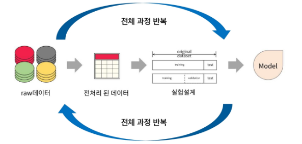
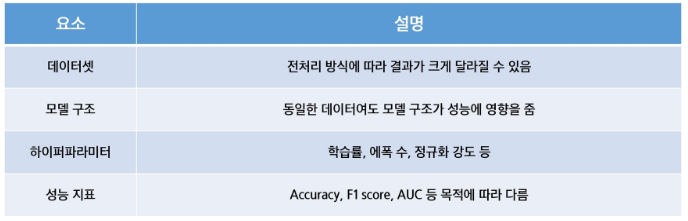
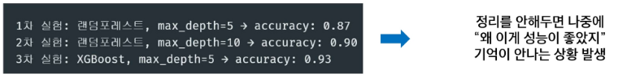
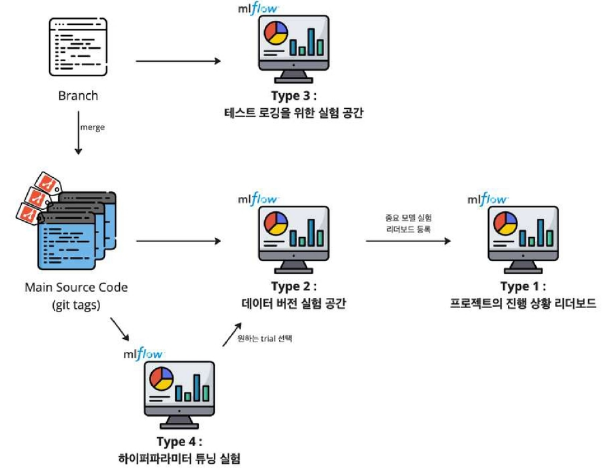
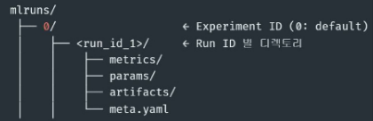
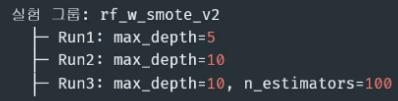

# MLFlow 데이터 실험 환경 구축
## 머신러닝 실험 환경의 필요성
### 머신러닝 실험
모델의 성능을 개선하거나 다양한 설정을 비교 분석하기 위해 반복적으로 수행하는 **과정 중심의 실험 활동**

-> 즉, "어떤 데이터를 써서", "어떤 알고리즘에", "어떤 하이퍼파라미터를 적용했더니", "어떤 결과가 나왔는지" 체계적으로 비교하는 작업



- 실험이 중요한 이유
  - 머신러닝에서는 하나의 정답이 존재하지 않고, **여러 조건에 따라 성능이 달라지기 때문**에 실험이 필수적
    
    

### 반복 실험의 문제점
- 실험이 반복되면 어떤 문제가 생길까?  
  - 엑셀에 기록하다 보면 어느 실험이 어떤 설정인지 기억하기 어려움  
  - 실수로 같은 실험을 중복 진행하거나, 더 좋은 모델을 잃어버림  
  - 여러 명이 협업할 때 "이 모델이 어디서 나온거지"라는 상황 발생  

- 예시 시나리오  
   
  
  - 그래서 필요한 것이 **실험 관리 도구**(MLFlow 등)

- **재현성(Reproducibility)** 의 문제
  - "이 모델이 왜 잘 나왔는지, 다시 만들 수 있을까?"
    - 코드와 결과는 있지만, 어떤 하이퍼파라미터로 학습했는지 기억이 안나는 경우
    - 데이터 전처리 방법이나 랜덤 시드가 기록되지 않은 경우
    - 실험 중간에 환경(python 패키지 버전 등)이 바뀌는 경우

  - 다시 똑같은 성능을 재현할 수 없음
    - 논문이나 리포트 제출 시 신뢰도 하락
    - 실무에선 QA, 테스트에서 큰 문제 발생

- **버전 관리**의 문제
  - "이 모델, 어떤 코드 버전에서 나온 거였지?""
    - 같은 `train.py` 파일인데 중간에 코드 바뀜
    - 파일명을 복사해서 `train2.py`, `train_final_final2.py` 식으로 쓰게 되는 상황
    - 데이터셋도 계속 갱신되지만 이력이 안남음

  - 실험 결과를 다시 해석하기 어려움
  - 버그가 있는 코드에서 나온 모델이 어디에 쓰였는지 추적 불가능
  - 조직 내에서 **신뢰할 수 없는 모델**로 인식

- **협업**의 문제
  - "동료가 만든 모델, 어떻게 학습된 건지 모르겠어요"
    - 실험 결과 공유가 슬랙/구두/스크린샷에 의존
    - 모델은 공유되지만, 학습 파라미터, 평가 방식, 데이터가 없음
    - 실험명이 `best_model_v3.pkl` 식으로 되어 있어 의미 없음

  - 협업자 간에 커뮤니케이션 오류 발생
    - 실험 중복, 불필요한 시간 낭비
    - 실험 결과가 조직적으로 축적되지 않음

- **비효율적인 반복 작업**
  - "똑같은 실험, 이미 했던 상황"
    - 기존 실험 기록이 없어 같은 실험을 다시 시도
    - 실험 로그는 있는데 엑셀/메모/포털에 흩어져 있어 검색 불가

  - 불필요한 리소스 낭비 (시간, 전력, 인프라)  
  - 연구 생산성 저하

- **성과 측정 및 비교의 어려움**
  - "결국 어떤 모델이 제일 좋았는지 알 수 없는 경우"
    - 다양한 모델을 실험했지만, 성능 비교 테이블이 없음
    - 지표 종류마다 따로 기록되어, 비교 자체가 어려움

  - 정확한 모델 선택이 어려움  
  - 튜닝 결과가 장기적으로 축적되지 않음

### 실험 추적 및 관리 도구
- 실험 추적 도구의 필요성
  - 반복 실험에서 발생하는 문제를 해결하기 위함
  - 실험마다 사용된 코드, 데이터, 하이퍼파라미터, 성능 지표를 **자동으로 기록** -> 관리 용이
  - 실험 결과를 비교 분석할 수 있는 인터페이스 필요

- 실험 환경 자동화의 필요성
  - 실험은 단순 로그를 넘어서, 재현 가능한 환경에서 실행되어야 함

- 실험 추적 + 모델 저장 + 서버까지 지원하는 통합 도구: `MLflow`
  - MLflow는 오픈 소스로 제공되는 머신러닝 실험 관리 플랫폼
  - 다양한 프레임워크와 호환성이 좋음
  - 실험 로그 관리뿐 아니라 모델 저장, 등록, 서버까지 한번에 가능


## MLFlow Tracking을 활용한 실험 관리 전략
### 실험 관리 전략
실험을 체계적으로 계획하고 수행하고 비교 분석하는 전 과정

- `실험 목표 수립 → 실험 단위 정의 → 비교 가능한 실험 설계 → 자동화`
  - 이를 통해 **반복 작업 효율화**
- 예시
  - 실험 목적에 따른 실험 공간을 분리해서 관리할 수 있음

    
    - 각각 독립적인 영역에서 실험을 관리, 추적 가능
    - 무작위 실험이 아닌, 맥락 있게 실험 관리 가능

### 실험 결과 저장 위치 구조
- MLflow 실험 디렉토리 구조
  - MLflow는 실험 데이터를 기본적으로 `mlruns/` 디렉토리에 저장
    - `mlruns/` 는 자동 생성됨
  - 로컬 저장 기준이며, 백엔드 저장소를 바꾸면 `DB` / `S3` 등에 저장 가능
    - 즉, 외부 저장소에 저장 가능
  - 추가로 MLflow UI에 접속하여 해당 `Run`을 클릭하면 파일 구조를 확인 가능

    

- 디렉토리별 역할
  - `Metrics/` : 실험 성능 지표 파일들
  - `Params/` : 하이퍼파라미터 저장
  - `Artifacts/` : 모델, 이미지 등 결과물
  - `Meta.yaml` : 사용한 데이터 버전

### 실험 단위 구분 전략
- 실험 그룹/Run 이름 정리법
  - 실험 그룹: `baseline_rf_exp1`, `tuned_rf_exp2`
  - Run 이름: `max_depth=5`, `max_depth=10`
  - 모델/데이터/전처리 조합에 따라 Run 그룹화
  - 파일 이름 형식도 **"모델명_전처리 방법_데이터셋 버전"** 으로 하면 명확함

- 예시

  
  - 하이퍼파라미터에 따라 run 단위에 대한 이름 정함

### 실험 정보 구조화
실험 정보를 체계적으로 기록하는 방법

- MLflow는 실험 정보를 4가지 요소로 구분해 기록
- 각각의 정보는 비교, 분석, 재현성에 중요한 역할을 가짐
  - `Params` → 실험 조건
  - `Metrics` → 성능 결과
  - `Tags` → 설명 요약
  - `artifact` → 결과물 저장소

- 항목별 정리
  - Params: 실험 설정값(하이퍼파라미터)  
    - ex. `Learning_rate=0.01`, `max_depth=5`
  - Metrics: 성능 지표  
    - ex. `Accuracy=0.89`, `auc=0.91`
  - Tags: 실험 설명, 날짜 등 메타정보  
    - ex. `Exp_purpose=baseline_tes`t, `author=kim`
  - Artifacts: 결과 파일, 시각화, 모델 등  
    - ex. 모델 파일, `confusion_matrix.png`, 로그

- 조건(Params)에 대한 결과(Metrics)
  - 실험 필터링 하거나 검색이 쉬워짐
  - 협업하는 사람과 공유 또는 구조적으로 정리된 정보 전달이 편해짐
  - 실험 로그를 찍는 것 자체가 데이터화 되는 것!

### 실험 태그 및 노트 관리 방법
MLflow는 메타 정보 태그화

- UI와 API에서 태그 기반 검색이 가능함
  - 실험 분류 / 필터링에 유용

- 예시
  | 태그 키       | 용도           |
  |--------------|----------------|
  | Author       | 작성자 이름     |
  | Description  | 실험 목적       |
  | Notes        | 참고 사항       |
  | Data_version | 사용한 데이터 버전 |

  ```python
  mlflow.set_tag("author", "kim")
  mlflow.set_tag("description", "XGBoost with SMOTE")
  mlflow.set_tag("data_version", "v2.1")
  ```
  - `mlflow.set_tag(key, value)` 형태로 작성
  - 실험할 때 수치만 기록하는 것뿐만 아니라 설명, 버전 정보 등을 메타 정보 형태로 함께 기록해놓으면
    - 특정 조건을 가진 실험을 추려낼 때 유용하게 사용 가능

### 커스텀 로깅 전략
중요한 정보를 직접 로깅하는 방법

- MLflow는 기본 로깅 외에도 **내가 원하는 정보를 자유롭게 추가 가능**
- 모델의 의미 있는 지표를 따로 로깅 가능(val_f1, recall 등)
- 태그에 설명을 담아 UI에서 실험의 목적, 주요 이벤트도 기록이 가능
- 예시
  ```python
  mlflow.log_param("boosting_type", "gbtree")
  mlflow.log_metric("val_f1", val_f1_score)
  mlflow.set_tag("description", "XGBoost with SMOTE")
  mlflow.log_artifact("roc_curve.png")
  ```

### 고급 실험 로깅
자동화된 실험 반복 + 시각화 저장하는 방법

- GridSearch나 반복 실험에서 각 결과를 자동으로 MLflow에 로깅하면 관리가 편함
- 실험별 파라미터, 지표 로깅, ROC curve, confusion matrix 이미지를 생성 후 저장
- 반복 실험이 많을수록 자동 로깅 코드 구조화는 필수
- 시각화 파일도 artifact로 저장하면 UI 상에서 바로 확인이 가능함
- 예시
  ```python
  mlflow.log_artifact("confusion_matrix.png")
  mlflow.log_artifact("roc_curve.png")
  ```

### 실험 비교 전략
실험 결과를 효율적으로 비교하는 방법

- MLflow UI에서는 다양한 실험을 필터링, 정렬, 시각화하며 비교 가능
- 파라미터 조합별 성능 비교가 쉬워짐
- 성능이 아니라, **실험 설정 자체에 주목** 가능
  - 이를 통해 "왜 실험이 잘 되었는가?"를 분석할 수 있음

  | 실험 목적  | 분리한 Experiment 예시                |
  |-----------|--------------------------------------|
  | 필터링    | 특정 조건(`max_depth=10`)으로 run 선택 |
  | 지표 정렬 | Accuracy 등 성능 기준으로 정렬        |
  | 그래프 비교 | 여러 Run의 성능 변화 시각화 (선형 그래프, 히트맵) |
  | 다운로드  | CSV로 성능 결과 저장 가능             |

### 실험 검색 / 비교 예시
- Python API를 활용한 실험 검색
  - 기본 실험은 `ID = 0` (Default experiment)
  - 사용자 지정 실험 생성 시 ID 증가
  - `mlflow.search_runs()`
    - MLflow Tracking 서버에 저장된 실험(Experiment) 내의 모든 실행(Run) 정보를 검색하고, 조건에 맞는 결과를 DataFrame 형태로 반환하는 함수

    - 사용 방법
      ```python
      import mlflow

      df = mlflow.search_runs(
          experiment_ids=["4"],               # 실험 ID (여러 개 지정 가능)
          filter_string="params.max_depth = '5'",  # 필터 조건 (하이퍼파라미터, 메트릭 등)
          order_by=["metrics.f1 DESC"],       # 정렬 기준 (내림차순 DESC / 오름차순 ASC)
          output_format="pandas"              # 결과를 pandas DataFrame으로 반환
      )
      ```
    
    - 주요 매개변수:
      - `experiment_ids` : 검색할 실험의 ID 리스트로, 여러 실험을 동시에 지정할 수 있음
      - `filter_string` : 조건 필터. `params.파라미터명`, `metrics.메트릭명`, `tags.태그명` 등을 조건으로 사용 가능
      - `order_by` : 정렬 기준
      - `output_format` : 출력 형식 지정
    
  - 예제 코드
    ```python
    import mlflow

    # 조건: max_depth = 5인 실험 중 F1 점수가 가장 높은 Run 검색
    df = mlflow.search_runs(
        experiment_ids=["4"],
        filter_string="params.max_depth = '5'",
        order_by=["metrics.f1 DESC"],
        output_format="pandas"
    )

    # 가장 좋은 성능의 run 선택
    best_run = df.iloc[0]

    # 결과 출력
    print("Best Run ID:", best_run.run_id)
    print("F1 score:", best_run["metrics.f1_score"])
    print("Used params:", best_run["params.max_depth"], best_run["params.n_estimators"])
    ```
  
  - 출력 예시
    ```yaml
    Best Run ID: 6519816dbdb1d6d5bd803b85bbecc0aa
    F1 score: 0.903258064516129
    Used params: 5 100
    ```
  
  - 활용
    - `search_runs()`는 MLflow UI에서 클릭으로 찾을 수 있는 정보를 자동화된 코드로 조회할 때 유용함
    - 특히 하이퍼파라미터 튜닝 결과 정리, 베스트 모델 선택 자동화, 모델 재현성 관리에 효과적
    - 반환된 DataFrame(df)에는 `params.*`, `metrics.*`, `tags.*`, `run_id`, `start_time`, `end_time` 등 다양한 열(column)이 포함되어 있음

### 실험 실패 / 중단 상황 관리
- `Try···finally` / `try···except` + `mlflow.end_run()`

  - 실험이 끝나면 `mlflow.end_run()` 명령어를 통해 명시적으로 종료해줘야 로그가 깔끔하게 남음

  - 하지만 에러가 나면 종료가 누락될 수 있음

  - 실패 로그를 별도 저장하는 코드
    ```python
    # 예외 발생 시 로그로 기록하기
    try:
        run_experiment(params)   # 실험 실행 함수
    except Exception as e:
        with open("failures.log", "a") as f:
            f.write(f"{params}: {e}\n")
    ```
    - `run_experiment(params)` 실행 중 오류가 발생하면 Exception으로 잡아서 `failures.log `파일에 기록함
    - 각 실패 항목에는 사용된 파라미터(params) 와 에러 메시지(e) 가 함께 저장됨
    - "a" 모드로 열기 때문에, 여러 번 실행하더라도 기존 로그가 덮어쓰이지 않고 누적 기록됨
    - 예시 로그(`failures.log`)
      ```yaml
      {'max_depth': 5, 'n_estimators': 50}: ValueError: Invalid input shape
      {'max_depth': 10, 'n_estimators': 100}: RuntimeError: CUDA out of memory
      ```
  
  - 실패한 Run 필터링 후 복구 / 재실행
    ```python
    # MLflow로 실패한 Run 검색
    import mlflow

    runs = mlflow.search_runs(filter_string="params.status = 'failed'")
    failed_run_ids = runs.run_id.tolist()
    ```
    - `mlflow.search_runs()`를 이용해 status가 "failed"인 run만 필터링
    - MLflow는 각 실험(run)에 대해 status 필드를 자동으로 저장함
      - 가능한 값: `RUNNING`, `FINISHED`, `FAILED`, `KILLED`
    - `filter_string`를 사용해 `"params.status = 'failed'"` 조건으로 검색하면 실패한 run만 조회할 수 있음
    - 검색 결과는 pandas DataFrame이며, run_id를 리스트 형태로 추출할 수 있음
      ```python
      print(failed_run_ids)
      # ['1afc8b9d7a3b4e7bb89e9a71d0a9b10e', '23cb6d83b9214de0a3f37cc0d5d84bcf']
      ```

### 실험 자동화 흐름 예시
- Config.yaml에 실험 조건 정의
  - 반복할 실험의 조건(예: 하이퍼파라미터)을 `YAML` 파일에 정의해두면, 실험을 체계적으로 구성하고 재사용 가능
  - `config.yaml` 예시
    ```yaml
    learning_rate: [0.01, 0.001]
    batch_size: [16, 32]
    optimizer: ['adam', 'sgd']
    ```

- `itertools.product` 또는 **반복문**으로 조합 생성
  - 모든 실험 조합을 만들기 위해 Python의 `itertools.product`를 사용하거나 **중첩 반복문**을 사용할 수 있음

  - 코드 예시
    ```python
    import itertools
    import yaml

    # YAML에서 실험 조건 로드
    with open("config.yaml", "r") as f:
        config = yaml.safe_load(f)

    keys, values = zip(*config.items())
    combinations = list(itertools.product(*values))  # 모든 파라미터 조합 생성

    for comb in combinations:
        params = dict(zip(keys, comb))
        run_experiment(params)  # 실험 실행 함수 호출
    ```
  - `yaml.safe_load()`
    - `config.yaml` 파일을 읽어 Python 딕셔너리(dict) 형태로 로드
    - 예시:
      ```yaml
      max_depth: [3, 5, 7]
      n_estimators: [50, 100]
      learning_rate: [0.01, 0.1]
      ```
  
  - `itertools.product()`
    - 파라미터들의 모든 가능한 조합(데카르트 곱) 을 생성
    - 위 YAML 예시 기준 `조합 수 = 3 × 2 × 2 = 12가지` 실험.

  - `zip(keys, comb)`
    - 생성된 각 조합을 파라미터 이름(keys)과 값(comb)으로 묶어 딕셔너리(params)로 변환함
    - 예시:
      ```python
      {'max_depth': 5, 'n_estimators': 100, 'learning_rate': 0.1}
      ```

  - `run_experiment(params)`
    - 조합된 파라미터를 이용해 실험을 수행하는 사용자 정의 함수
    - 내부적으로는 MLflow를 사용하여 각 조합별 run을 추적할 수 있음
  
  - 실행 예시
    - `config.yaml`
      ```yaml
      max_depth: [3, 5]
      n_estimators: [50, 100]
      ```
    - 실행 결과
      ```bash
      실험 1 → {'max_depth': 3, 'n_estimators': 50}
      실험 2 → {'max_depth': 3, 'n_estimators': 100}
      실험 3 → {'max_depth': 5, 'n_estimators': 50}
      실험 4 → {'max_depth': 5, 'n_estimators': 100}
      ```
      - 총 4번의 실험이 자동으로 수행됨

- `MLflow.start_run()` 블록 안에서 파라미터와 결과를 자동으로 로깅
  - 각 조합에 대해 하나의 실험(run)이 생성되며, 비교/시각화에 활용
  - `run_experiment()`: MLflow 기반 실험 실행 함수
    - 하이퍼파라미터(params)를 입력으로 받아 모델을 학습하고,
    - 그 결과를 MLflow Tracking 서버에 자동으로 기록하는 역할
    ```python
    import mlflow

    def run_experiment(params):
        with mlflow.start_run():
            # 1️⃣ 파라미터 로깅
            mlflow.log_params(params)

            # 2️⃣ 모델 학습 및 평가
            model, metrics = train_model(params)  # 사용자가 정의한 함수

            # 3️⃣ 결과 로깅
            mlflow.log_metrics(metrics)
            mlflow.sklearn.log_model(model, "model")
    ```
  
  - 단계 설명
    1. MLflow 실험(run) 시작 - `with mlflow.start_run():`
        - 새로운 실험(run)을 시작
        - 모든 로그(파라미터, 메트릭, 모델 등)는 이 run 컨텍스트 내부에서 기록됨
        - 이 블록이 끝나면 run이 자동으로 종료됨
    
    2. 파라미터 로깅 - `mlflow.log_params(params)`
        - 딕셔너리 형태의 파라미터(params)를 한 번에 로깅
        - 예시: `params = {"max_depth": 5, "n_estimators": 100}`
        - MLflow UI에서 "Parameters" 탭에 자동 기록됨
    
    3. 모델 학습 및 평가 - `model, metrics = train_model(params)`
        - 사용자가 정의한 함수(train_model)에서 모델 학습 및 평가를 수행
        - 반환값:
          - `model`: 학습된 모델 객체
          - `metrics`: 평가 지표
    
    4. 평가 지표 로깅 - `mlflow.log_metrics(metrics)`
        - 딕셔너리 형태의 평가 결과를 MLflow에 로깅
        - ex. `{"accuracy": 0.92, "f1": 0.89}`
        - "Metrics" 탭에 기록되어 실험 간 성능 비교가 가능해짐
    
    5. 모델 저장 (Artifact로 로깅) - `mlflow.sklearn.log_model(model, "model")`
        - 학습된 모델 객체를 MLflow에 저장
        - "model"은 저장 폴더명이며, UI 상에서 다운로드 또는 `mlflow.pyfunc.load_model()`로 복원 가능


---
---
---


### 실험 관리 전략 팁
- 실험을 전략적으로 관리
  - MLFlow는 실험 전략 실행 플랫폼
  - 실험 이름/구조 설계 → 자동화된 로깅 → 정리된 비교 → 재현성 확보
  - 단순 로그 기록이 아니라, 모델 실험을 반복 가능한 연구 활동으로 만드는 도구

- 실험 관리 시 유용한 팁 3가지
  - 실험명 관리: 실험 목적, 날짜 포함
  - Jupyter 요약 정리: mlflow.search_runs()로 테이블 생성
  - 중단 대비 로깅: try-finally로 중간 로그 남기기    
  


## MLFlow를 활용한 모델 관리 및 배포


- MLflow Tracking 구조 다시 보기
  - MLflow Tracking의 구조
    - MLflow Tracking의 구조는 다음과 같은 계층적 구조
    - Experiment: 실험의 상위 그룹 (예: "RandomForest 튜닝 실험")
    - Run: 하나의 실험 실행 단위 (예: "max_depth=10, n_estimators=100")

  - Experiment 단위로 실험을 분류
    - 실제 실험을 반복하다보면 다양한 실험 목적 발생
    - 표와 같이 실험 단위마다 별도의 Experiment 객체를 만들어 실험을 논리적으로 그룹화 가능

- MLflow Tracking 구조 다시 보기
  - 하나의 Experiment에는 여러 개의 Run이 존재
    - 각 Run은 실험 한 번 실행 시 생성되는 단위
    - 파라미터, 성능지표, 로그, 모델 등을 저장
    - 예시: rf_tuning_exp 안에 있는 Run
    - Run이 많아져도 같은 목적 안에서 모아서 비교할 수 있어 관리가 쉬움

- MLflow Tracking 구조 다시 보기
  - Run ID 기반 추적
    - MLflow는 각 Run에 대해 고유한 Run ID를 부여
    - 이 Run ID는 실험 결과의 정확한 출처를 추적하거나, 특정 모델을 재사용할 때 사용
    - 저장된 모델과 실험 로그를 연결할 수 있어 재현성과 추적성 확보
    - 예시: 모델을 저장하고 나중에 불러올 때

- MLflow 하이퍼파라미터 튜닝
  - 하이퍼파라미터 튜닝의 중요성
    - 하이퍼파라미터는 학습 알고리즘의 학습 방식에 직접적인 영향을 미침
    - 잘 튜닝된 모델 vs 기본값 모델 → 성능 차이가 상당함
    - GridSearch, RandomSearch, HyperOpt 등의 사용

- MLflow 하이퍼파라미터 튜닝
  - Grid Search vs Random Search 개념 정리
    - 하이퍼파라미터 튜닝의 대표적인 2가지 기법

    - Grid Search
      - 탐색 방식: 지정된 모든 하이퍼파라미터 조합을 완전 탐색
      - 계산 비용: 조합 수가 많을수록 기하급수적으로 증가
      - 사용 시기: 조합 수가 적거나, 중요한 파라미터가 명확할 때 적합
      - 장점: 최적 조합을 놓치지 않음, 간단하고 직관적
      - 단점: 비효율적

    - Random Search
      - 탐색 방식: 임의의 조합 일부만 무작위 탐색
      - 계산 비용: 조합 수를 지정 가능
      - 사용 시기: 조합 수가 많거나, 중요한 파라미터를 미리 알기 어려울 때 적합
      - 장점: 빠르고 효율적, 높은 차원의 탐색 공간에서 유리함
      - 단점: 최적값을 정확히 찾지 못할 가능성 있음

- MLflow 하이퍼파라미터 튜닝
  - Hyperopt란?
    - 머신러닝 모델의 하이퍼파라미터 튜닝을 자동으로 수행해주는 라이브러리
    - 핵심 목표는 최적의 파라미터 조합을 효율적으로 찾는 것

  - Hyperopt 특징
    - 목적 기반 최적화: 단순 반복이 아닌, 성능을 기반으로 검색
    - 이전 결과 학습: 과거 실험 결과를 기반으로, 다음 탐색 위치를 정교하게 조정
    - 계산량 절약: 수백 개 실험을 거치지 않아도 좋은 조합에 빠르게 수렴
    - 다양한 공간 지원: 실수형, 정수형, 범주형, 조건부 파라미터 등 복잡한 탐색 구조 지원

- MLflow 모델 관리 및 배포
  - 실험 결과로 나온 모델
    - ML 실험의 목적은 결국 좋은 모델을 찾는 것
    - 성능 좋은 모델을 저장, 버전 관리, 배포할 수 있어야 실무에 사용 가능
    - MLFlow는 이 과정을 Tracking과 연결된 모델 저장 시스템으로 처리

- MLflow 모델 관리 및 배포
  - Stage란?
    - MLFlow Model Registry에서 하나의 모델 버전이 어떤 배포 단계에 있는지를 표시하는 상태 값
    - MLFlow에서 모델은 다음과 같은 “stage” 상태를 가질 수 있음

  - 상태
    - 모델 개발 및 실험 → None
    - 성능 검증 후 테스트 환경 배포 → Staging
    - QA 통과 후 서비스 배포 → Production
    - 새 모델로 교체되면 이전 모델 → Archived

    - 상태 표
      - None: 초기 등록
      - Staging: 테스트 또는 검증 단계
      - Production: 실제 서비스에 배포된 모델
      - Archived: 더 이상 사용하지 않는 이전 버전 모델

- Mlflow 모델 관리 및 배포
  - 모델 버전 관리
    - Mlflow에서는 하나의 모델 이름 아래 여러 버전의 모델을 등록할 수 있음
    - 최근에는 Alias 방식이 도입되면서, 자유로운 문자열로 여러 버전으로 저장 가능

  - 새로운 방식: Alias
    - 여러 alias를 동일 버전에 연결할 수 있고, 하나의 alias를 쉽게 다른 버전으로 전환 가능
    - 버전 관리 + 배포 환경 + 실험 그룹을 명확하게 구분이 가능

- Mlflow models 구조 소개
  - MLflow 구성요소 및 개념
    - 모델 포맷(Flavor): 다양한 프레임워크 지원(sklearn, keras, xgboost 등)
    - 모델 경로: run ID 기반으로 저장
    - 환경 정보: conda.yaml, MLmodel, requirement.txt 자동 생성

  - 모델 저장의 필요성
    - Pickle, joblib: 간단하지만 환경 정보 없음, 코드 추적 불가
    - MLflow Models: 모델뿐 아니라 실험 환경, 입력 형태, 프레임 워크 정보까지 저장 가능
    - 핵심은 실험 결과를 재현하고 협업하려면 단순한 .pkl 파일로는 부족

- Mlflow 모델 저장 방법
  - 모델 저장 방법
    - Log_model()은 모델 객체와 함께 실행 환경 정보까지 함께 저장
    - UI에서도 해당 모델 확인 가능
    - 모델을 저장하면서 자동으로 artifact에 등록

  - 저장된 모델 불러오기
    - 모델 검증 시, 추론 테스트를 위해 저장된 모델 불러오기
    - 모델 서빙 시, API 배포에 활용
    - Mlflow.pyfunc.load_model()을 사용하면 공통 인터페이스로 불러올 수 있음

- Mlflow 모델 저장 방법
  - 모델 저장 위치 설정 (로컬 vs 원격)
    - 로컬 디스크: 기본 설정, 간단한 실험에 적합
    - S3, GCS: 팀 프로젝트, 클라우드 기반 실험에 적합
    - 데이터베이스(e.g. SQLite, MySQL): 실험 메타데이터 저장 용도로도 활용 가능

  - 모델 저장 위치 설정 코드
    mlflow server \
      --backend-store-uri sqlite:///mlflow.db \
      --default-artifact-root s3://my-bucket/mlruns

- 모델 관리 및 배포
  - 모델 경량화 및 구조 분석 팁
    - 저장된 MLmodel 파일에는 모델 flavor, 입력/출력 signature 정보가 있음
    - Signature를 정의하면 추론 시 입력 형태를 자동 검증 가능

  - 코드 예시
    from mlflow.models.signature import infer_signature
    signature = infer_signature(X_train, y_pred)
    mlflow.sklearn.log_model(model, "model", signature=signature)

- 모델 관리 및 배포
  - 모델 관리 배포의 흐름
    - 모델 저장 → 로딩 → 예측

  - 절차
    1. 실험이 끝난 후, 성능 좋은 모델 선택
    2. 모델 저장 (log_model)
    3. Run ID 기반으로 불러와서 예측 수행
    4. 예측 결과를 평가하고 다시 로깅

- 모델 배포 전략
  - 로컬 환경에서 API로 서빙하기
    - Mlflow 서빙 명령어를 통해 배포 가능
    - mlflow models serve -m runs:/<run_id>/model -p 5000

  - 기본 구성
    - RESTful API 형식
    - /invocations 엔드포인트로 JSON 데이터로 POST
    - curl -X POST http://localhost:5000/invocations \
      -H "Content-Type: application/json" \
      -d '{"columns":["feat1", "feat2"], "data":[[1, 2]]}'

- Mlflow 모델 서빙
  - Mlflow 모델 서빙
    - Mlflow 서빙은 훈련된 머신러닝 모델을 운영 환경에 쉽게 배포할 수 있도록 도와주는 도구

- Mlflow 모델 서빙
  - Mlflow 모델 서빙 엔진
    - Mlflow로 모델을 서빙할 때 선택할 수 있는 엔진

    | 항목       | FastAPI (기본)                | MLServer (고급/확장형)                 |
    | ---------- | ----------------------------- | -------------------------------------- |
    | 용도       | 로컬 테스트, 일반 서비스용     | 고성능, 대규모 서비스용                 |
    | 설치       | Mlflow 설치 시 기본 포함       | 추가 설치 필요                          |
    | 서버 프레임워크 | FastAPI (ASGI 기반, 빠름)   | MLServer (Seldon/Kserve와 연동)         |
    | 성능       | 비동기 처리 지원, 빠름         | 병렬 추론, 일괄 처리, 효율 극대화       |
    | 확장성     | 단일 서버 중심 (수평 확장 어려움) | Kubernetes 네이티브 확장 가능 (오토스케일링) |
    | 추론 API   | /invocations 엔드 포인트 사용 | 동일한 /invocations 사용                |

- Mlflow 모델 서빙 환경 및 확장성
  - 서버 환경 고려사항
    | 항목       | 설명 |
    | ---------- | ------------------------------------------------ |
    | 입출력 형식 | Signature 미지정 시 예측 요청 에러 발생 가능 → 입력 스키마 명확히 지정 필요 |
    | 동시 요청 처리 | 기본 서버는 단일 스레드 → 실무 배포 시 gunicorn, uvicorn 등 활용 권장 |
    | Docker 서빙 | Mlflow models build-docker 명령으로 모델을 컨테이너화해 이식성 향상 |

  - Mlflow Models의 확장성
    - 다양한 프레임워크 지원: scikit-learn, tensorflow, xgboost, pytorch 등과 연동 가능
    - 이식성: Databricks, AWS SageMaker 등 다양한 플랫폼에 배포 가능
    - 모델 관리 연계: 추후 Model Registry, 서빙 인프라 (API Gateway 등)와 자연스럽게 연결됨
    - 통합 구조: 모델 저장 → 로딩 → 배포까지 하나의 포맷으로 처리 가능 (MLmodel + artifact)

- 실행 비교, 모델 선택, REST API 배포 실습
  - 목표
    - 하이퍼파라미터 스윕 실행
    - MLflow UI에서 실행 결과를 비교
    - 가장 좋은 Run을 선택하여 모델 등록
    - REST API에 모델 배포

  - 실행 내용
    - 데이터셋: 와인 품질 데이터셋
    - Keras 딥러닝 모델의 RMSE를 최소화
      → learning_rate와 momentum을 여러 값으로 수정
    - 각각의 실행 결과를 MLflow에 자동으로 기록

  - 실행 포인트
    - 하이퍼파라미터 변경 후, 비교
    - 성능 비교와 모델 선택
    - REST API 모델 배포

- Wine 데이터 전처리
  1. 입력 정규화를 위한 평균과 분산 계산
  2. Dense 2층 구조의 회귀 모델
  3. 출력은 하나 (와인 품질 예측)
  - SGD 옵티마이저로 학습률과 모멘텀 적용
  - 손실 함수: MSE, Metric: RMSE
  - 파라미터, metric, 모델 로그

- 모델 실행 비교
  - http://127.0.0.1:5000/ 접속

- 모델 선택 및 등록
  - 등록을 통해,
    1. 버전 관리 가능
    2. 설명, 태그 추가 가능
    3. 어떤 실행(run)에서 이 모델이 나왔지 연결
    4. 운영 배포, A/B 테스트 등에서 사용 가능

- REST API 배포
  - 로컬에서 실행 중인 Mlflow 모델 서버(Port 5002)에 예측 요청을 보내는 HTTP POST 요청


- Curl -d: 데이터를 담아서 요청하는 curl 명령어
- "columns": 모델이 기대하는 입력 데이터의 열 이름(특성 feature)
- "data": 각각의 입력 데이터 행, 여기서는 와인 1잔에 대한 특성들
- localhost:5002/invocations 모델 서버가 실행 중인 주소로 Post 요청을 보냄

---

- REST API 배포
- REST API 배포는 간단한 명령어를 통해 모델을 배포할 수 있음

---

- REST API 배포
- 로컬에서 실행 중인 Mlflow 모델 서버(Port 5002)에 예측 요청을 보내는 HTTP POST 요청