# 데이터 파이프라인 이해와 WSL
## 데이터의 시대와 엔지니어링
### 데이터의 시대
- 정보 vs 데이터  
  - 과거에는 정리되고 유의미하게 도움이 되는 ‘정보’만이 중요했음  
  - 그러나 현재는 원시적인 자료인 ‘데이터’의 중요성이 강조됨  

- 정보
  - 1970~2000년대를 대표하는 키워드  
  - 실제 도움이 되는 데이터  
  - 유의미함 (의미나 목적을 가짐)

- **데이터**
  - 2010년대 이후를 대표하는 키워드  
  - 단순 수집된 원시 자료 -> **raw data**
  - **의미나 목적을 포함하지 않음** 

### 데이터의 중요성
- 데이터가 중요해진 이유
  1. 빅데이터
      - 데이터의 양(Volume), 다양성(Variety), 증가 속도(Velocity) 향상

        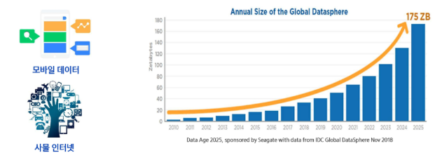
  2. 데이터를 수집, 가공, 활용할 수 있는 기술의 대두 => **데이터 파이프라인**

      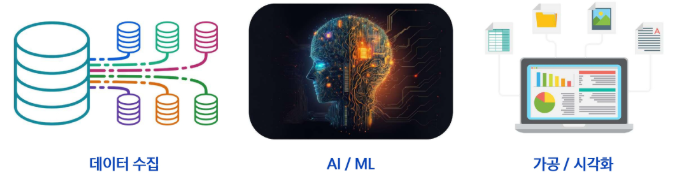

- 데이터는 어디에 쓰일까?
  - 비즈니스 리더들의 의사 결정
  - 데이터를 통한 서비스/제품 강화

### 데이터 엔지니어의 주요 활동
- 주요 역할
  - 데이터를 안정적으로 수집하고 가공하여 전달  
  - 분석과 모델링이 가능하도록 데이터 흐름을 자동화  
  - 신뢰성 있고 재사용 가능한 파이프라인 구축  

- 주요 하는 일
  - 다양한 시스템에서 데이터 수집  
  - 정제 및 변환 (ETL/ELT 설계)

- **"좋은 모델은 좋은 파이프라인에서 나온다"**
  - 데이터 엔지니어는 '모델의 품질을 받쳐주는 기반을 설계'함


## 데이터 파이프라인
데이터를 추출하고 정제하고 저장, 분석, 시각화하는 일련의 자동화 과정

-> 데이터를 쓸 수 있는 상태로 만드는 것

- **데이터 추출** -> **데이터 가공** -> **데이터 저장**

### OLAP와 OLTP
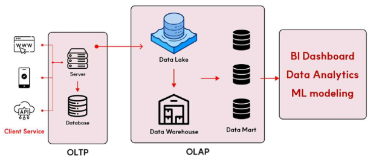

- OLTP (Online Transaction Processing)
  - **운영 데이터 처리 시스템**  
  - 실시간 트랜잭션(ex. 주문, 결제, 예약 등) 처리  
  - 행(Row) 단위 저장 구조  
  - 빠른 입력, 수정, 삭제에 최적화
  - 처리 과정
    - 서버에서 DB 접근하여 데이터를 불러오고, 서버가 클라이언트 서비스(웹, 모바일, api 등)로 반환
    - 즉, 웹 서버와 DB가 통신하는 구조

- OLAP (Online Analytical Processing)
  - **분석 데이터 처리 시스템**  
  - OLTP에서 수집된 데이터를 기반으로 통계·리포트 분석  
  - 열(Column) 단위 저장 구조  
  - 집계, 요약, 예측 분석에 최적화
  - 처리 과정
    - 서비스를 운영하고 있을 때, 지속적으로 보관해야 하는 데이터(운영 시스템에서 생성되는 데이터)들을 저장
    - 저장한 데이터를 통계 분석이나 리포트 작성에 예측 및 분석 시 사용함

### ETL / ELT
- ETL (Extract, Transform, Load)
  - 데이터를 가공한 후 저장하는 전통적인 방식
    
    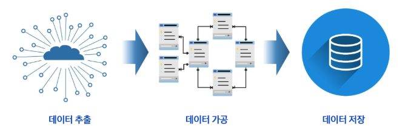
    - Extract: 데이터 추출  
    - Transform: 데이터 가공  
    - Load: 데이터 저장  

- ELT (Extract, Load, Transform)
  - 데이터를 저장한 후 가공하는 '클라우드 시대'의 방식

    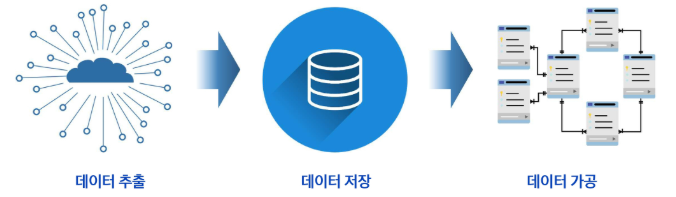
    - Extract: 데이터 수집  
    - Load: 데이터 저장  
    - Transform: 데이터 가공  
  
  - 원본 데이터를 그대로 보존하고 있다는 장점이 있음
    - 원본 재처리 가능
    - 그러나, 저장할 데이터가 많아지므로 고성능의 스토리지(저장소)가 필요할 수 있음

- ETL과 ELT의 차이
  | 항목 | ETL (전통 방식) | ELT (클라우드 중심) |
  |------|------------------|---------------------|
  | 순서 | 추출 → 가공 → 저장 | 추출 → 저장 → 가공 |
  | 환경 | 온프레미스 DW | 클라우드, 데이터 레이크 |
  | 장점 | 정제된 데이터 보장 | 연한 가공, 확장성 우수 |
  | 단점 | 느림, 유연성 부족 | 처리 비용 증가 가능성 |

- "ETL은 정제 우선, ELT는 속도와 유연성 중심"  
  - 환경에 따라 적합한 방식 선택

### 데이터 처리 방식 - 배치와 스트리밍
- 배치 처리 방식 (Batch Processing)
  - 데이터를 모아서 한 번에 처리하는 방식  
  - 주로 하루 1회, 또는 **일정 시간 단위**로 처리가 이뤄진다.
  - **정확성**과 **대량 처리**에 적합함

    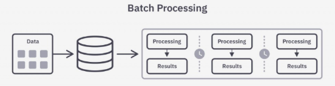

- 데이터 스트리밍 처리 방식 (Data Stream Processing)
  - 데이터가 들어오는 즉시 실시간 처리하는 방식
  - 빠르게 변화하는 데이터에 즉시 반응 가능  
  - **실시간** 분석과 대응 가능

    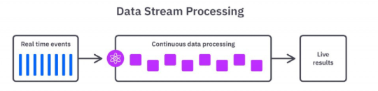

- 배치 처리 vs 스트리밍 처리
  | 항목 | 배치 처리 | 스트리밍 처리 |
  |------|-------------|----------------|
  | 처리 방식 | 일정 주기로 대량 처리 | 실시간으로 지속 처리 |
  | 예시 | 하루 1회 통계 리포트 | 실시간 사용자 클릭 분석 |
  | 장점 | 안정적, 대규모 처리 적합 | 즉시 대응, 실시간 분석 가능 |
  | 단점 | 지연 발생 가능 | 복잡한 설계 필요 |

- "배치는 정확성과 안정성 중심, 스트리밍은 실시간성과 즉시성 중심"
  - 데이터의 **속도·목표**에 따라 적절한 방식을 선택해야 함

### 데이터 파이프라인의 기본 구조
- 자동화된 데이터 흐름
  - **데이터 소스 → 수집 → 가공 → 저장 → 분석/제공**

    
    - 데이터 소스: 로그 발생
    - 데이터 수집: 로그 등 다양한 소스를 실시간이든, 배치든 '안정적'으로 모아주는 단계
    - 데이터 가공: 수집된 데이터를 분석 및 저장하기에 적합한 형태로 바꿔주는 단계 -> 정제, 변환, 필터링
    - 데이터 저장: 정형 데이터 - 데이터 웨어하우스 / 비정형 데이터 - 데이터 레이크
    - 데이터 분석/제공: BI, 대시보드, 리포드 등을 뽑아내어 이를 기반으로 AI 예측 및 추천 가능하도록 함

### 데이터 저장소
- 데이터 저장소의 중요성
  - 저장소는 분석을 위한 인프라
  - 데이터를 단순히 저장하는 것이 아니라 **분석·활용을 위한 설계가 필요**
  - 저장소에 따라 처리 방식과 유연성이 달라짐
  - 파이프라인에서 중요한 핵심 축

    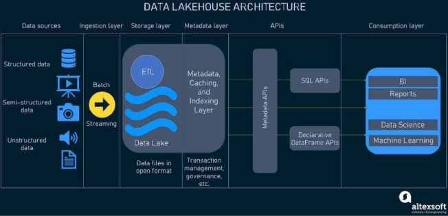

- 데이터 저장소의 종류

  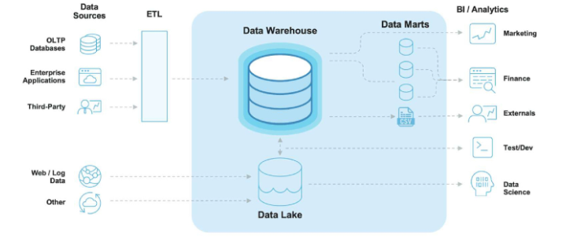
  - 데이터 웨어하우스
    - 정형 데이터를 저장하는 구조, 기본 저장구조
  - 데이터 레이크
    - 원본 데이터를 저장하는 구조, 수집 후 재가공하여 활용
  - 데이터 마트
    - **특정한 목적**을 위해 **데이터 웨어하우스**의 내용을 **다시 추출**하여 저장
    - 즉, 맞춤형 저장소

- 데이터 웨어하우스
  - 정형 데이터 중심  
  - 스키마 사전 정의  
  - ETL 기반의 처리 방식
    - '가공된' 데이터가 적재되도록!
  - OLAP(Online Analytical Processing) 중심의 구조

    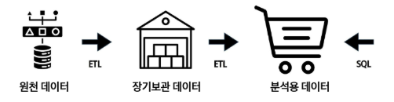

- 데이터 레이크
  - DW의 구조적 질서에 유연성을 결합 
    - 원본 데이터를 그대로 두고, 하고자 하는 분석에 맞게 '유연하게' 대응하도록! 
  - 분석, 모델링, BI 모두 대응하는 형태  
  - OLAP(Online Analytical Processing) 확장 구조  (정형 + 비정형 데이터 모두 대응)

    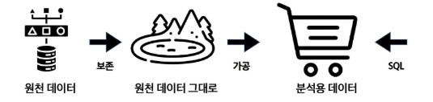

- 데이터 레이크 vs 데이터 웨어하우스
  | 항목 | 데이터 레이크 (Data Lake) | 데이터 웨어하우스 (Data Warehouse) |
  |------|----------------------------|-------------------------------------|
  | 주요 목적 | 다양한 원천 데이터를 원형 그대로 저장<br>추후 분석·활용을 위한 유연한 데이터 저장소 | 비즈니스 의사결정을 위한 정제된 데이터 저장소<br>리포팅과 분석 업무 최적화 |
  | 데이터 형태 | 정형, 반정형, 비정형 데이터 모두 수용 가능<br>(예: 로그, 이미지, 오디오, JSON 등) | 정형 데이터 위주 (관계형 테이블 기반, 스키마 존재) |
  | 사용 대상 | 데이터 사이언티스트, 분석가, **기술적 역량이 있는** 일반 사용자(비정형 데이터 가져가서 가공해야하므로) | 분석가, 관리자, 경영진 등 특정 목적 중심 사용자 |
  | 데이터 적재 시점 | 가공 없이 원본 데이터 그대로 저장<br>스키마 적용 없이 유연하게 수용 | 사전 정의된 스키마에 맞춰 가공 후 저장 |
  | 스키마 적용 시점 | Schema-on-Read: **조회 시점**에 스키마 적용<br>다양한 데이터 활용 가능 | Schema-on-Write: **적재 시점**에 스키마 적용<br>정형화된 구조 필수 |
  | 데이터 적재 방식 | **ELT**: 추출 → 적재 → 변환<br>대량 원본 수용 후 필요에 따라 처리 | **ETL**: 추출 → 변환 → 적재<br>품질 정제 후 스키마에 맞춰 적재 |
  | 데이터 품질 요구 | 품질 보장보다 유연성과 포괄성 중시<br>노이즈 포함 가능성 존재 | 정합성·신뢰성 중요<br>높은 품질 기준 충족 필요 |
  | 비용 및 확장성 | 상대적으로 저렴하고 확장성 높음<br>(HDFS, S3 등 파일 기반 저장소 사용) | 저장 비용이 상대적으로 높음<br>(고가의 RDBMS, 분석 엔진 활용) |
  | 분석 방식 | 머신러닝, AI, 통계 분석 등 고급 분석에 활용<br>탐색적 분석 중심 | 표준화된 리포트 및 대시보드 중심<br>운영 보고서, 경영 분석 등 |
  | 운영 및 거버넌스 | 데이터 거버넌스 체계 수립 필요<br>메타데이터 관리 및 품질 통제 체계 중요 | 엄격한 데이터 품질관리 체계<br>보안·접근 제어 체계 정비 |

※ 데이터 웨어하우스

-> 최종 사용자가 보고싶은 관점별 데이터 구성을 위해 원천 DB로부터 데이터를 수집  

-> DW는 데이터 구조가 이미 결정되어 엄격한 스키마 관리가 필요하고 한 번 구축 시 변경이 어려움

### 데이터 수집 도구
- Kafka
  - 분산 메시지 큐 시스템  
  - **대용량 데이터**를 빠르고 안정적으로 전달  
  - **실시간 스트리밍 수집**에 강점  

### 데이터 처리(가공) 도구
- Spark
  - 대규모 **배치** 처리 프레임워크  
  - ETL/머신러닝 통합 가능  
  - DAG 기반 처리로 안정성과 확장성 확보  

- Flink
  - **스트리밍** 처리 전문 프레임워크  
  - 이벤트 기반 실시간 분석에 최적화  
  - 상태 기반 연산 및 복잡한 처리 가능  

※ Spark - 배치 / Flink - 스트리밍 

-> 이렇게 이분법적으로 나누지는XX 

-> 둘 다 어느정도 배치와 스트리밍 처리가 가능함

### 데이터 저장 도구
- RDBMS (PostgreSQL, Oracle, 등)
  - 고급 기능을 지원하는 오픈소스 관계형 데이터베이스  
  - 정형 데이터 저장에 적합  

- Elasticsearch
  - 실시간 **검색**과 **분석**에 강력한 NoSQL DB  
  - 로그, 텍스트 분석, 모니터링 등 다양한 사용처  

- Hadoop (Data Lake)
  - 대용량 비정형 데이터 저장용 HDFS 기반 저장소  
  - 정형·비정형 데이터 통합 저장 가능  

### 데이터 모니터링 및 워크플로우 관리 도구
- Airflow
  - 워크플로우 스케줄러 (DAG 기반)  
  - 파이프라인의 각 단계를 자동화 및 모니터링  

- Grafana
  - 실시간 시각화 대시보드  
  - 다양한 데이터 소스와 연결 가능 (Prometheus, Elasticsearch 등)  

- Prometheus
  - 시계열 기반 모니터링 도구  
  - 지표 수집, 알림, 시각화 연동 기능 제공  

### 데이터 레이크 분석 도구
- BI (Business Intelligence) / OLAP (Online Analytical Processing)
  - 데이터를 시각적으로 분석하거나 리포트를 만들기 위한 도구  
  - 엑셀의 Pivot 기능 또는 시각화 기능과 같은 기능을 좀 더 전문적으로 다루는 도구  
  - 원래 데이터 웨어하우스의 등장과 함께 같이 쓰이는 도구였으나,  
    데이터 레이크도 연결 가능  
  - 라이선스 비용이 높은 편
  - ex. Power BI, Tableau  

### 데이터 레이크하우스
- 데이터 레이크하우스의 구성
  - 정형 + 비정형 데이터 모두 저장
    - 데이터 레이크의 '유연성'과 데이터 웨어하우스의 '정형 데이터 관리(스키마 있는 형태)' 장점이 결합된 저장소
  - 스키마는 나중에 적용 (schema-on-read)  
  - 대용량 로그/센서 데이터 수용 가능

    


## 데이터 파이프라인 설계
### 아키텍처 설계
- 데이터 엔지니어 관점에서 데이터 아키텍처 주 관심사는 파이프라인 설계  
- 데이터 수집부터 분석/시각화 환경까지 데이터를 견고하게 전달할 수 있는 아키텍처 설계를 목표로 함

  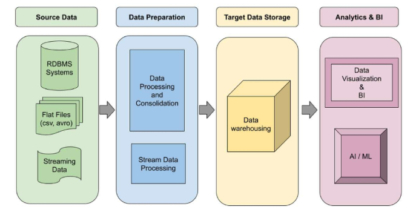

### 파이프라인 설계
- 파이프라인 설계는 환경마다 다르기에 정답은 없음 
  - 온프레미스 환경 vs 클라우드 환경  
- 요구사항에 따라 각양각색으로 구현 가능하나, 실시간 수집이 필요한지 여부에 따라 파이프라인 설계 구분 가능

  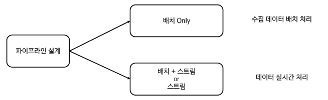

- 람다 아키텍처 & 카파 아키텍처

  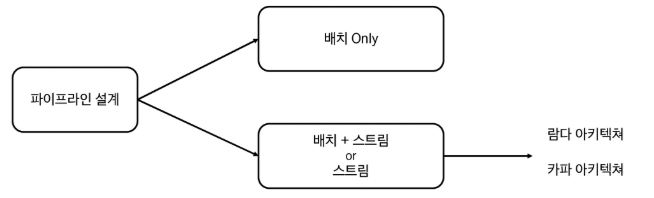
  - **실시간** 수집이 필요한 경우 참조할 수 있는 아키텍처가 존재함
  - 대표적으로 람다(Lambda) 아키텍처와 카파(Kappa) 아키텍처가 존재 

- 람다 아키텍처(Lambda Architecture)
  - 2011년에 제시된 아키텍처
  - 배치 레이어와 실시간(스트림) 레이어를 동시에 운영하는 방식

    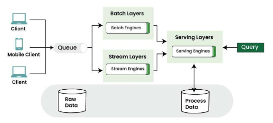

  - 실시간 수집이 필요한 경우 **배치 처리와 스트림 처리를 모두 이용** 가능
  
  - Serving Layer
    - 배치 Layer에 저장된 데이터를 빠르게 보여주기 위한 서비스 계층
    - 사용자가 직접 쿼리할 수 있도록 지원 
    - 필요에 따라 Stream Layer에 있는 데이터와 결합하기도 함
    - 배치 레이어와 스트림 레이어에서 처리된 결과는 Processed Data 저장소에 저장되며, Serving Layer는 이 데이터를 조회하여 사용자의 요청에 맞는 형태로 쿼리를 수행하고 결과를 제공해줌

  ※ 스트림 레이어랑 스피드 레이어 같은 말임!

  - 배치 Layer & 스트림 Layer
    - 배치 Layer에 저장된 데이터가 특정 기준 데이터라면
    - 스피드 Layer에는 당일 데이터를 저장 및 정제하는 공간
    - 배치 Layer의 테이블 갱신이 완료되면, 스피드 Layer는 그 **이후 데이터부터 저장 및 정제**  

  - 람다 아키텍처는 개념적 컨셉만 제공 (내 아키텍처에 맞게 구체적으로 설계 필요)

- 카파 아키텍처 (Kappa Architecture)
  - 배치 Layer를 제거하고,
  - 배치 Layer에서 수행하던 모든 작업을 **스피드 Layer에서 처리**하는 구조 (전처리 후 필요한 테이블로 재구성)
  - 데이터 소스는 주로 **메시지 큐(Message Queue)** 를 의미함
  - 메시지 큐에는 여러 솔루션이 존재하지만, Kafka를 개발한 Jay Kreps가 만든 카파 아키텍처에서는 → 데이터 소스 = **Kafka 클러스터(Cluster)** 를 의미
  - 즉, **카파 아키텍처에서는 모든 데이터가 Kafka로 수집**됨을 전제함
  - 그러나 실제 환경에서는 배치 파이프라인도 여전히 많이 활용됨

    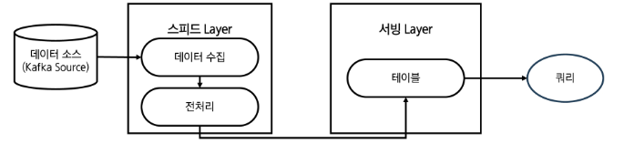

※ 구조화된 아키텍처는 **참고용 개념**일 뿐, 모든 데이터를 해당 아키텍처(람다/카파) 기반의 파이프라인으로 구성할 필요는 없음

-> 아키텍처 수용 여부는 각 파이프라인의 데이터 활용 요건에 따라 결정됨

-> 따라서, 데이터 활용 요건을 분석한 후 어떤 아키텍처를 따를지, 어떤 데이터 뷰를 사용할지 결정


### 데이터 파이프라인 전체 구조  
- 상품 전략 예시: 종합 인터넷 쇼핑몰
  
  

  - 데이터 소스
    - 데이터가 유입되는 소스 (원본 데이터)
    - ex. 고객 정보, 제품 정보, 행동 정보 로그

      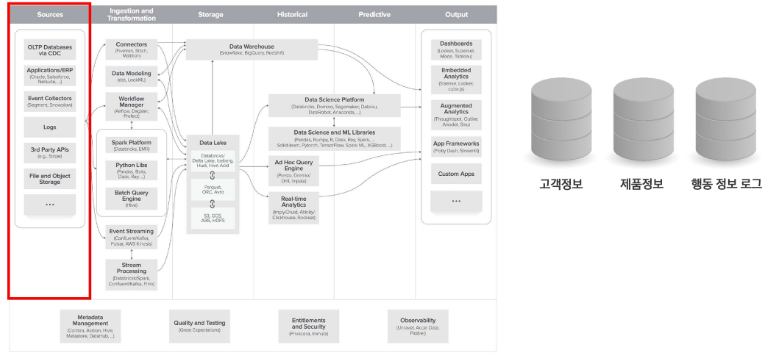

  - 데이터 수집 및 변환  
    - 데이터 소스에서 내용을 추출하고, 저장에 적절한 형태로 변환
    - ex. 고객별 제품 구매 여부

      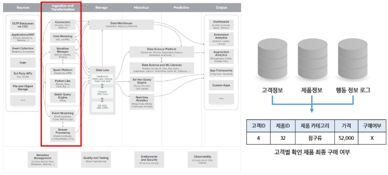

  - 데이터 저장
    - 데이터를 저장하는 시스템
    - ex. 데이터 웨어하우스, 데이터 레이크

      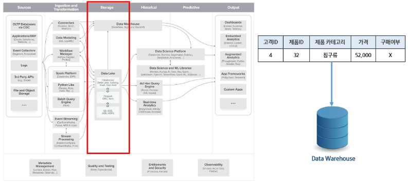
  
  - 과거 데이터 분석
    - 과거 데이터를 활용한 분석 단계
    - ex. 인기 제품 분석

      
  
  - 예측 분석  
    - 데이터를 바탕으로 머신러닝 및 예측을 하는 단계
    - ex. 유저별 추전 제품 예측

      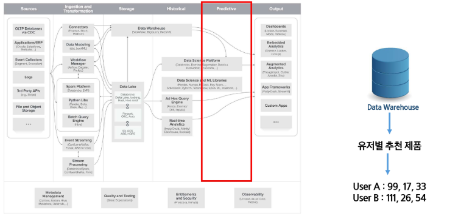  

  - 출력
    - 데이터 분석 결과를 시각적으로 표현하거나 시스템에 제공

      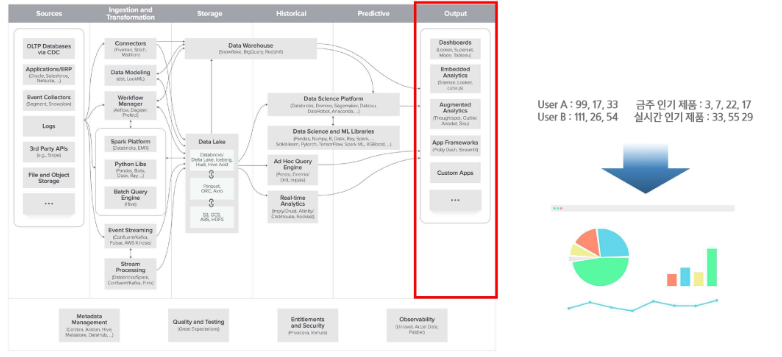
  
  - 지원 시스템
    - 데이터 파이프라인을 관리하고 보완 및 모니터링 하는 시스템

      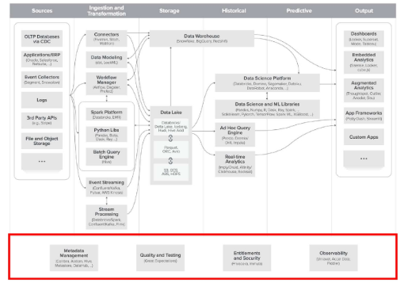


## 리눅스
### 유닉스(UNIX)
리눅스가 탄생하기 이전 운영체제(OS)

- 지금도 많이 사용되는 운영체제 중 하나이지만 높은 비용 지불 필요함
- IBM의 AIX, HP의 HP/UX, 오라클의 Solaris, DEC의 Digital Unix, SCO의 SCO Unix 등

### 리눅스(Linux)
무료(Free) 유닉스 개념으로, 유닉스와 거의 동일한 운영체제이면서 무료이고, 어떤 면에서는 유닉스보다 뛰어남

- 리눅스의 구성
  - 커널(Kernel)
    - 운영체제의 핵심 구성 요소로, **하드웨어와 응용 프로그램 사이를 중재하는 역할**을 함

      
  
  - 리눅스 커널의 역사
    - 리누스 토르발스(Linus Torvalds)가 1991년, 리눅스 커널 0.01 버전을 개발
    - 1992년, 0.02 버전 소스를 공개하며 오픈소스 운동 본격화 → 리눅스의 시작
    - 리눅스 배포판은 토르발스가 만든 커널 + 다양한 오픈소스 프로그램으로 구성

- 리눅스의 장점
  - 무료 & 오픈소스 (Free & Open Source)
    - 누구나 자유롭게 사용, 수정, 배포 가능
    - 라이선스 비용 부담 없이 교육/개발에 적합

  - 가볍고 빠른 성능
    - 구형 하드웨어에서도 작동 가능
    - 불필요한 GUI 없이 CLI 중심 운영 가능

  - 서버로서의 점유율
    - 전 세계 웹 서버의 70% 이상이 리눅스 기반
    - 클라우드, 데이터센터, 웹 호스팅에서 필수 OS

  - 개발 환경
    - Git, Docker, Python, Node.js 등 대부분 리눅스 친화적
    - 패키지 설치, 자동화, 백엔드 개발에 최적

### 우분투 리눅스(Ubuntu Linux)
데비안 기반 배포판, 다양한 플랫폼(Desktop, Server, IoT 등)

- 릴리스 주기: 일반 버전(6개월), LTS 버전(2년)

## WSL (Windows Subsystem for Linux)
Windows 환경에서 리눅스를 실행할 수 있도록 도와주는 도구


- 윈도우에서 리눅스를 가상 머신 없이 실행할 수 있음
- 명령어, 파일 시스템, 리눅스 도구 사용 가능

### WSL의 장점
- 별도 리눅스 컴퓨터가 없어도 Windows에서 바로 리눅스 사용 가능
- Docker, Python, Git 등 리눅스 친화 도구 활용이 쉬움
- VM 대비 가볍고 빠르며, 설치가 간편함 (재부팅 없이 가능)

### WSL 버전 별 차이점
| 항목 | WSL 1 | WSL 2 |
|------|-------|-------|
| 핵심 구조 | **Windows 커널 위에서 리눅스 API 구현**<br>(윈도우 커널 위에서 리눅스API 흉내내는 방식)  | **가상화된 리눅스 커널 내장** |
| 성능 | 빠른 파일 접근 | 높은 시스템 호환성 |
| Docker 사용 | 불가능 | **가능** |
| 네트워크 | 윈도우와 동일 | 분리된 IP 사용 (WSL 네트워크) |

※ Docker를 이용하려면 꼭 WSL 2여야 함!!!

### WSL 설치 방법
- 운영체제
  - Windows 10 (빌드 1903 이상) 또는 Windows 11 필요

- `data_engineering/01_WSL_Linux/01_Linux_WSL_가이드.md` 에 정리되어 있음


## 리눅스 기본 명령어
### 시작과 종료
- Ubuntu 22.04를 통해 실행 가능
  
  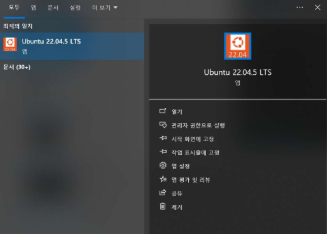
- VS code를 통해서도 가능 (권장)
  - `Ctrl + Shift + P` → `WSL` 입력
  - **WSL: Connect to WSL in New Window** 선택 → 리눅스 환경에서 코드 편집 가능

### 사용 불가 명령어
`poweroff`, `reboot`, `shutdown`  

-> WSL 특성상 자체적 부팅 구조가 아니기 때문에 해당 명령어는 무시됨

### WSL 종료
`exit`

### root 사용자
최고 권한(Superuser)을 가진 계정  

- 시스템의 모든 파일, 설정, 사용자 계정 등에 제약 없이 접근 가능  

- Windows의 Administrator(관리자)에 대응되는 개념  
  | 작업 | 일반 사용자 | root 사용자 |
  |------|--------------|--------------|
  | 시스템 파일 수정 | X | O |
  | 새로운 프로그램 설치 | X | O |
  | 다른 사용자 계정 관리 | X | O |
  | 커널 모듈 수정 | X | O |

- root 권한 이용 시 주의점
  - 실수로 중요한 시스템 파일 삭제 가능  
  - 잘못된 명령어로 OS 자체를 망가뜨릴 위험 존재함
  - 외부 공격자가 root 권한을 얻으면 시스템 전체를 장악 가능
  - 보통은 sudo 명령어로 필요한 작업만 root 권한을 임시로 위임받아 실행함

- root 사용자 권한 전환
  ```bash
  sudo -i
  ```
  - 현재 계정에서의 비밀번호 입력

- 권한 확인 후 기존 계정으로 복귀: `exit`

  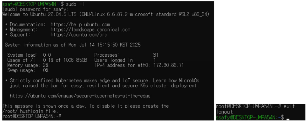

### 파일 및 디렉토리 관리
| 명령어 | 설명 | 예시 | 비고 | 약자 의미 |
|--------|------|------|------|------------|
| `pwd` | 현재 디렉토리 경로 확인 | `pwd` | 터미널 기준 작업 위치 파악 | Print Working Directory |
| `ls` | 현재 디렉토리 목록 보기 | `ls -l`, `ls -a` | -l: 자세히, -a: 숨김 포함 | List |
| `cd` | 디렉토리 이동 | `cd ~/Downloads`, `cd ..` | ..: 상위 디렉토리 | Change Directory |
| `mkdir` | 새 폴더 생성 | `mkdir my_folder` | 여러 개도 가능: mkdir a b c | Make Directory |
| `rmdir` | 빈 폴더 삭제 | `rmdir my_folder` | 폴더가 비어 있어야 함 | Remove Directory |
| `rm -r` | 폴더 포함 삭제 | `rm -r my_folder` | **실수 방지 주의** 필요 | Remove (recursive) |

### 파일 생성, 편집, 복사, 삭제
| 명령어 | 설명 | 예시 | 비고 | 약자 의미 |
|--------|------|------|------|------------|
| `touch` | 빈 파일 생성 | `touch test.txt` | 수정 시간 갱신용으로도 사용됨 | (접촉하다 - 변경 시각 "touch") |
| `echo` | 문자열 출력/파일에 저장 | `echo "Hello" >> hi.txt` | >>: 이어쓰기 | (echo - 메아리처럼 출력) |
| `cat` | 파일 내용 출력 | `cat file.txt` | 대용량 파일은 less, more 추천 | Concatenate |
| `head`, `tail` | 처음/끝 일부 출력 | `head -n 3 file.txt` | 로그 확인에 유용 | Head/Tail (머리/꼬리) |
| `cp` | 파일/폴더 복사 | `cp a.txt b.txt`, `cp -r dir1 dir2` | 디렉토리 전체 복사 | Copy |
| `mv` | 이동 또는 이름 변경 | `mv a.txt new.txt` | 파일 위치 이동에도 사용 | Move |
| `rm` | 파일 삭제 | `rm test.txt` | rm -rf: **위험!** | Remove |

### 검색과 필터링
| 명령어 | 설명 | 예시 | 비고 | 약자 의미 |
|--------|------|------|------|------------|
| `grep` | 특정 문자열 검색 | `grep "ERROR" log.txt` | 로그 분석에서 필수 | Global Regular Expression Print |
| `find` | 파일 검색 | `find . -name "*.txt"` | 위치별 조건 검색 | Find |
| `history` | 명령어 기록 확인 | `history` | 이전 명령 복기 | History |

### 시스템 정보 및 프로세스
| 명령어 | 설명 | 예시 | 비고 | 약자 의미 |
|--------|------|------|------|------------|
| `ps aux` | 전체 프로세스 확인 | `ps aux`, `ps aux grep python` | 자원 소비 확인 | PS - process status<br>A - All users<br>U - User-oriented format<br>X - No controlling terminal |
| `kill` | 프로세스 종료 | kill 1234 | -9 옵션은 강제 종료 | Kill |
| `top` | 실시간 자원 모니터링 | `top`, `q`로 종료 | htop은 GUI 버전 | Top of processes |
| `uptime` | 시스템 가동 시간 | `uptime` | 부팅 이후 시간 확인 | Up Time |
| `whoami` | 현재 사용자 확인 | `whoami` | 스크립트에서 유용 | Who am I |
| `hostname` | 호스트명 확인 | `hostname` | 네트워크 확인에 사용 | Host Name |

### 사용자 권한 및 보안
| 명령어 | 설명 | 예시 | 비고 | 약자 의미 |
|--------|------|------|------|------------|
| `sudo` | 관리자 권한 명령 | `sudo apt update` | root 권한 필요 시 | Superuser Do |
| `sudo -i` | root 전환 | `sudo -i`, `su - root` | 환경 유지하며 root 전환<br>su - root는 root pw 지정 후 이용 | Interactive shell |
| `chmod` | 파일 권한 변경 | `chmod 755 run.sh` | 실행 권한 등 설정<br>조심해서 사용 | Change Mode |
| `chown` | 파일 소유자 변경 | `sudo chown user file.txt` | 조심해서 사용 | Change Owner |

### chmod (Change Mode)
- 리눅스 권한 구조
  - 리눅스에서는 각 파일/디렉토리에 대해 아래의 3가지 주체에 대한 권한을 따로 설정할 수 있음

- 주체
  - u (user): 파일의 소유자  
  - g (group): 파일이 속한 그룹  
  - o (other): 그 외 사용자

- 권한
  - r (read): read (내용 보기 가능)  
  - w (write): write (수정, 삭제 가능)  
  - x (execute): execute (실행 가능, 디렉토리 접근 포함)

### chmod (Change Mode) 실습
- 샘플 sh 파일 만들고 간단하게 확인
  ```
  touch sample.sh
  echo 'echo "Hello, Linux!"' > sample.sh
  cat sample.sh
  ```

- chmod (Change Mode) 권한 확인
  - `ls -al`

    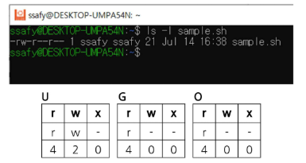
    - `sample.sh`는 **644**의 권한을 가지고 있음
      - 사용자는 읽기 + 쓰기  
      - 그룹은 읽기 전용  
      - 기타 사용자도 읽기 전용

- chmod (Change Mode) 권한 변경
  - `chmod +x sample.sh`

    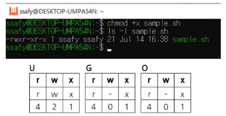
    - 사용자는 `sample.sh`에 실행 권한을 추가해서 **755**의 권한을 주게 됨

### CLI 환경 관련 유용 명령어
| 명령어 | 설명 | 예시 | 비고 | 약자 의미 |
|--------|------|------|------|------------|
| `clear` | 터미널 화면 초기화 | `clear` | 화면 정리용 | Clear |
| `man` | 매뉴얼 보기 | `man grep`, `q`로 종료 | 대부분 명령어 지원 | Manual |


### 리눅스 명령어 사용 실습
- 간이 로그 확인 실습
  - 작업 디렉토리 만들기
    ```bash
    ls                      # 현재 디렉토리 상태 확인
    pwd                     # 현재 디렉토리 위치 확인
    mkdir my_ssafy_project  # my_ssafy_project 폴더 생성
    cd my_ssafy_project     # my_ssafy_project 디렉토리로 이동
    # ※ tab키를 활용하면 디렉토리 전체 입력 안 해도 된다.
    ```

  - 더미 로그 파일 생성
    ```bash
    touch system.log                                      # 빈 파일 생성
    echo "INFO: 시스템 시작" >> system.log                 # echo 명령으로 로그 생성
    echo "ERROR: 데이터베이스 연결 실패" >> system.log
    echo "INFO: 유저 로그인" >> system.log
    echo "WARNING: 디스크 공간 부족" >> system.log
    echo "ERROR: 서비스 중단" >> system.log
    ```

  - 로그 파일 내용 확인
    ```bash
    vi system.log   # 로그 파일 정상 생성 여부 확인 -> 파일 직접 수정 가능
    Esc → :q        # vi 모드에서 나가기
    ```

  - 로그 확인 및 분석
    ```bash
    cat system.log          # 전체 보기
    head -n 3 system.log    # 처음 3줄
    tail -n 2 system.log    # 마지막 2줄
    grep ERROR system.log   # 에러만 추출
    ```

  - 백업 및 파일 복사
    ```bash
    cp system.log backup.log    # 백업 파일 생성(복사)
    mv backup.log old.log       # 이름 변경
    ls -l                       # 파일 목록 확인
    ```

  - 파일 & 디렉토리 삭제
    ```bash
    rm old.log                      # old.log 삭제
    mkdir archive                   # 새 폴더 생성
    mv system.log archive/          # 파일 이동
    rmdir archive                   # 삭제 불가 (내용 있음)
    rm archive/system.log           # 안의 파일 먼저 삭제
    rmdir archive                   # 이제 삭제 가능
    ```

  - vi를 활용한 파일 만들기
    ```bash
    i   # 입력모드

    [INFO] System initialized at 10:23:01   # LOG
    [WARNING] Disk space low                # LOG
    [ERROR] Failed to load configuration    # LOG

    :wq # 저장
    ```

  - 파일 권한 & 프로세스 확인
    ```bash
    ls -l system.log             # 현재 system.log 권한 확인
    chmod 700 system.log         # 권한 변경 (700)
    ls -l system.log             # 변경 후 권한 확인
    ```
    ```bash
    ps aux | grep bash           # bash 프로세스 확인
    kill [PID]                   # (원한다면) PID로 프로세스 종료
    # ※ 자기 셀 프로세스를 종료하면 로그아웃될 수 있음
    ```

  - 기타 유용한 명령어
    ```bash
    history             # 그동안 입력한 명령어 목록 확인

    history | grep vi   # grep을 통해 필터링 가능

    clear               # bash 터미널 창 정리

    man [명령어]         # 매뉴얼 설명서 확인
                        # 예시: man grep
    ```


