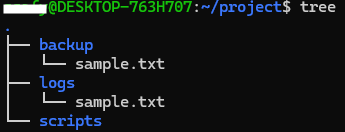
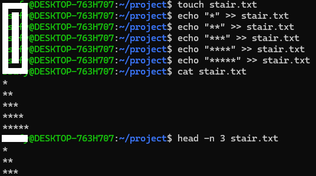
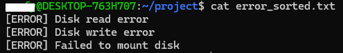
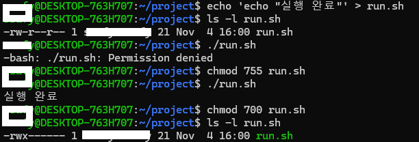

## 리눅스 명령어 실습 요약 정리
### 📁 디렉토리 및 파일 조작 관련
| 명령어 | 설명 |
|---------|------|
| `cd [경로]` | 디렉토리 이동 (Change Directory) |
| `mkdir [폴더명]` | 새 디렉토리 생성 |
| `mkdir -p [경로]` | 상위 디렉토리까지 한 번에 생성 |
| `ls -l` | 현재 디렉토리의 파일/폴더 목록을 상세히 출력 |
| `tree` | 디렉토리 구조를 트리 형태로 시각화 |
| `touch [파일명]` | 빈 파일 생성 또는 기존 파일 수정 시간 갱신 |
| `mv [파일] [경로]` | 파일 또는 폴더 이동 (Move) |
| `cp [파일] [경로]` | 파일 또는 폴더 복사 (Copy) |
| `cat [파일명]` | 파일 내용을 터미널에 출력 (Concatenate) |
| `head -n [숫자] [파일명]` | 파일의 상단 N줄만 출력 |
| `> [파일명]` | 파일 내용을 비우거나 새로 생성 (덮어쓰기) |
| `>> [파일명]` | 파일 끝에 내용 추가 (이어쓰기) |

### 🧾 텍스트 처리 / 로그 분석
| 명령어 | 설명 |
|---------|------|
| `cat <<EOF > [파일명] ... EOF` | 여러 줄의 텍스트를 파일로 저장 (Here Document) |
| `grep [패턴] [파일명]` | 특정 문자열(패턴)을 포함한 줄 검색 |
| `grep -i [패턴] [파일명]` | 대소문자 구분 없이 검색 |
| `sort [파일명]` | 텍스트 파일을 알파벳순 또는 숫자순으로 정렬 |
| `uniq` | 중복된 행 제거 (보통 `sort`와 함께 사용) |
| `grep [패턴] [파일명] > [새파일]` | 검색 결과를 새 파일로 저장 |
| `sort [파일] | uniq > [출력파일]` | 중복 제거 후 결과를 새 파일로 저장 |

### 🔐 권한 및 실행 관련
| 명령어 | 설명 |
|---------|------|
| `ls -l [파일명]` | 파일 권한, 소유자, 크기, 수정일 확인 |
| `chmod [권한] [파일명]` | 파일 접근 권한 변경 |
| `chmod 755 [파일명]` | 소유자: 읽기/쓰기/실행, 그룹/기타: 읽기/실행 |
| `chmod 700 [파일명]` | 소유자만 읽기/쓰기/실행 가능 |
| `./[파일명]` | 현재 디렉토리의 실행 파일 직접 실행 |

### ⚙️ 시스템 및 프로세스 관리
| 명령어 | 설명 |
|---------|------|
| `ps -u $(whoami)` | 현재 사용자(`whoami`)가 실행 중인 프로세스 목록 표시 |
| `top` | 시스템의 CPU, 메모리, 프로세스 상태를 실시간으로 모니터링 |
| `sleep [초] &` | 지정한 시간만큼 대기하는 백그라운드 프로세스 생성 |
| `grep sleep` | sleep 프로세스 필터링하여 확인 |
| `kill [PID]` | 지정한 PID 프로세스 종료 |
| `df -h` | 디스크 사용량을 읽기 쉬운 단위(GB/MB)로 표시 |
| `free -h` | 메모리(RAM, 스왑) 사용량을 보기 쉽게 출력 |

### 💡 리디렉션 & 파이프 기본 정리

| 기호 | 의미 |
|------|------|
| `>` | 명령의 출력을 **파일로 저장** (덮어쓰기) |
| `>>` | 명령의 출력을 **파일 끝에 추가** |
| `<` | 파일의 내용을 명령의 입력으로 사용 |
| `|` | 왼쪽 명령의 출력을 오른쪽 명령의 입력으로 전달 (파이프라인) |

---
## 실습1
### 실습 목표
디렉토리 생성, 이동, 구조 파악 명령어(cd, ls 등등) 사용법 익히기
실제처럼 구조화된 디렉토리 구성 연습

### 실습 시나리오
/home/ssafy/project 하위에 logs, backup, scripts 폴더를 생성합니다.
생성한 구조를 cd, ls -l, tree 명령어로 확인합니다.
샘플 파일을 생성한 뒤, 이를 mv로 logs로 이동하고, cp로 backup에 복사해봅니다.

### Step 1: 프로젝트 작업 디렉토리로 이동
```bash
cd /home/ssafy
```

### Step 2: 하위에 logs, backup, scripts 디렉토리 생성
```
구조: /home/project/logs
      /home/project/backup
      /home/project/scripts
```
```bash
mkdir -p project/logs
mkdir -p project/backup
mkdir -p project/scripts
```

### Step 3: 생성한 디렉토리 구조로 이동 후 구조를 ls -l, tree 명령어로 확인해보세요.
```bash
cd project
ls -l
tree
```
- tree 명령어가 설치되어 있지 않다면, `sudo apt-get install tree` 명령어로 설치 가능

### Step 4: 현재 위치에서 sample.txt 파일을 생성하고 logs 폴더로 이동한 뒤, backup 폴더로 복사해보세요.
```bash
touch sample.txt                # 샘플 파일 생성
# 파일이동
mv sample.txt logs/      # 적절한 경로로 파일 이동
cp logs/sample.txt backup/      # 파일 복사
```


## 실습2
### 실습 목표
echo 명령어와 리디렉션(>>) 사용법을 익히고, 간단한 텍스트 출력 결과를 파일에 저장하고 읽는 방법을 연습합니다.

### 실습 시나리오
echo를 활용한 ASCII 계단 만들기

### Step 1: 기존 stair.txt 파일이 있다면 초기화합니다.
```bash
> stair.txt   # '>'는 파일을 비우는 명령입니다.
```

### Step 2: echo 명령어를 사용하여 다음과 같은 모양으로 별(*)을 계단처럼 출력하고 저장합니다.
```
*
**
***
****
*****
```

각 줄마다 echo로 직접 작성하고, >> stair.txt로 파일에 추가 저장합니다.
```bash
echo "*" >> stair.txt
echo "**" >> stair.txt
echo "***" >> stair.txt
echo "****" >> stair.txt
echo "*****" >> stair.txt
```

### Step 3: 저장된 파일 내용을 확인합니다.
```bash
cat stair.txt   # 파일 전체 내용 보기
```

### Step 4: head 명령어를 사용하여 앞의 3줄만 확인해봅니다.
```bash
head -n 3 stair.txt   # 상위 3줄 출력
```



## 실습3
### 실습목표
grep, head, sort, uniq 명령어를 활용하여 로그에서 특정 키워드를 추출하고 정리하는 방법을 익힌다.

### 실습 시나리오
텍스트 파일 분석 및 필터링 실습

### Step 1: 샘플 로그 파일 생성
실습을 위해 system.log라는 파일이 필요하므로, 다음 명령어로 임의 로그 데이터를 생성합니다.

각 줄은 로그 한 줄이며, 다양한 메시지 유형이 혼합되어 있습니다.

```bash
# EOF는 양 EOF 사이의 내용을 텍스트 입력으로 이용한다 라는 의미.

cat <<EOF > system.log
[INFO] System boot complete
[ERROR] Failed to mount disk
[WARNING] CPU temperature high
[ERROR] Disk read error
[INFO] User login
[ERROR] Disk write error
[INFO] Shutdown initiated
[Disk] Disk scan complete
EOF
```

### Step 2: "ERROR" 키워드를 포함하는 로그만 추출하여 저장
grep 명령어를 이용해 "ERROR"가 포함된 줄만 찾아 error_logs.txt에 저장합니다.

```bash
grep "ERROR" system.log > error_logs.txt
```

### Step 3: "Disk" 키워드를 포함하는 로그만 추출하여 저장
대소문자를 구분하지 않기 위해 "Disk"로 검색합니다.

```bash
grep -i "Disk" system.log > disk_logs.txt
```

### Step 4: 추출된 로그의 앞 5줄만 미리 확인
head 명령어를 사용하면 전체 파일을 보지 않고 앞부분만 간략히 확인할 수 있습니다.
```bash
head -n 5 error_logs.txt
head -n 5 disk_logs.txt
```

### Step 5: 중복 제거 및 정렬
추출된 로그들 중 중복된 라인이 있을 수 있으므로, sort로 정렬한 뒤 uniq로 중복을 제거합니다.

결과는 *_sorted.txt 파일로 저장됩니다.

```bash
sort error_logs.txt | uniq > error_sorted.txt
sort disk_logs.txt | uniq > disk_sorted.txt
```

### Step 6: 최종 결과 확인
cat 명령어를 사용해 정리된 로그 파일을 확인합니다.

```bash
cat error_sorted.txt
cat disk_sorted.txt
```


## 실습4
### 실습목표
chmod 명령어를 통해 파일 권한을 변경하고, 실행 가능 여부를 확인하는 법을 익힌다.

### 실습 시나리오
파일/디렉토리 권한 변경 실습

### Step 1: 간단한 실행 파일(run.sh) 생성
echo 명령어를 이용해 "실행 완료"라는 문장을 출력하는 셸 스크립트를 만듭니다.

```bash
echo 'echo "실행 완료"' > run.sh
```

### Step 2: 파일의 권한 상태 확인
ls -l 명령어를 사용해 run.sh의 현재 권한을 확인합니다.

```bash
ls -l run.sh
```

### Step 3: 실행 권한 없이 파일 실행 시도
아직 실행 권한이 없으므로 아래 명령은 "Permission denied" 오류가 발생해야 합니다.

```bash
./run.sh
```

### Step 4: chmod 명령어로 실행 권한 추가
chmod 755는 소유자에게 읽기/쓰기/실행 권한, 그룹/기타 사용자에게 읽기/실행 권한을 부여합니다.

```bash
chmod 755 run.sh
```

### Step 5: 실행 권한 부여 후 파일 실행
이제는 정상적으로 실행되어 "실행 완료" 메시지가 출력되어야 합니다.

```bash
./run.sh
```

### Step 6: 권한을 700으로 변경해 타 사용자 접근 제한
소유자만 실행/읽기/쓰기 가능하게 변경하고, 권한을 재확인합니다.

```bash
chmod 700 run.sh
ls -l run.sh
```




## 실습5
### 실습목표
현재 실행 중인 프로세스를 조회하고, 시스템 자원을 확인하며, 프로세스를 종료하는 방법을 학습한다.

### 실습 시나리오
시스템 자원 및 프로세스 모니터링 실습


### Step 1: 현재 사용자 기준으로 실행 중인 프로세스 확인
아래 명령어를 통해 자신이 실행한 프로세스 목록만 출력해봅니다.

```bash
ps -u $(whoami)
```

### Step 2: 시스템 전체 프로세스를 실시간으로 모니터링
실시간 상태를 보기 위해 top 명령어를 실행하고, 'q' 키로 종료합니다.

```bash
top
```

### Step 3: 테스트용 프로세스 생성
sleep 명령어를 백그라운드로 실행하여 임의의 프로세스를 만듭니다.

```bash
sleep 1000 &
```

### Step 4: 실행 중인 sleep 프로세스의 PID 확인
자신이 실행한 프로세스 중 'sleep'만 필터링하여 확인합니다.

```bash
ps -u $(whoami) | grep sleep
```

### Step 5: sleep 프로세스를 종료
kill 명령어를 사용하여 위에서 확인한 PID를 종료합니다. 

예시: kill 1234

```bash
kill <PID>
```

### Step 6: 디스크 사용량 확인
-h 옵션을 사용하면 사람이 읽기 쉬운 단위로 출력됩니다.

```bash
df -h
```

### Step 7: 메모리 사용량 확인
현재 시스템의 RAM과 스왑 메모리 사용량을 확인합니다.

```bash
free -h
```
