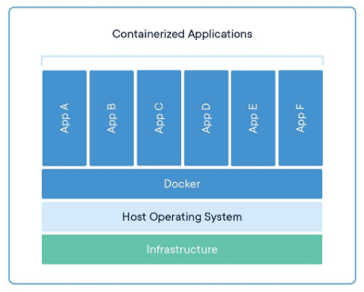
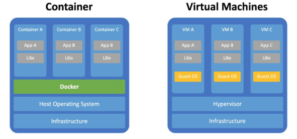
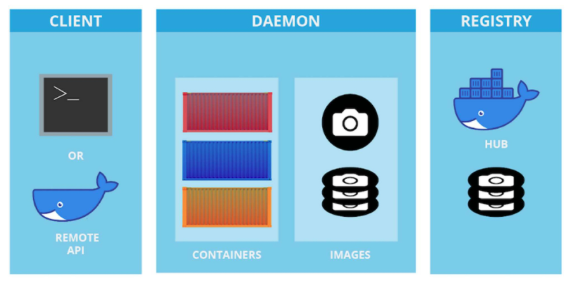
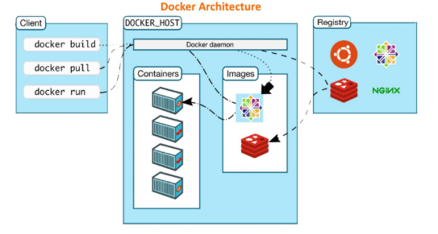
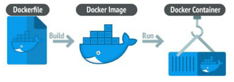
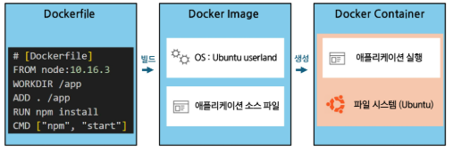
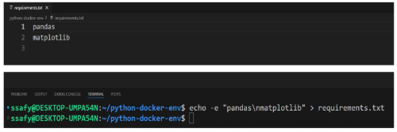
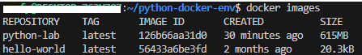
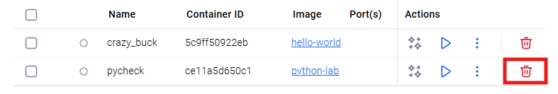
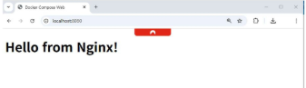

# 도커의 개념과 활용
## 컨테이너와 도커
### 도커(Docker)
애플리케이션을 '컨테이너'라는 가볍고 독립적인 환경에서 실행할 수 있도록 도와주는 오픈소스 가상화 플랫폼 


- **외부 환경과 격리된 상태**에서 애플리케이션이 **환경에 영향을 받지 않고 실행**될 수 있도록 하는 소프트웨어
  - 즉, 개발과 운영 환경을 통일 시키는 도구

- 컨테이너를 생성하고 관리하는 데 필요한 엔진과 명령줄 도구(CLI)로 구성됨  

### 컨테이너(Container)
어떤 물체나 데이터를 외부와 분리된 공간에 담아두는 것

- 물체를 격리하는 공간과 비슷한 의미

  
  - App A ~ App F가 각각 독립된 컨테이너 안에서 실행됨
  - 각 컨테이너는 서로 영향을 주지 않으므로, App A를 업데이트해도 App B에는 영향 없음

- 컨테이너의 필요성
  - 환경 차이 없이 어디서든 실행 가능
    - ex. 개발 PC, 테스트 서버, 클라우드에서도 **동일하게 동작**  
  - 설치·설정 충돌 방지
    - **여러 앱이 공존**할 수 있는 안전한 **격리 공간** 제공
    - 각 앱이 필요로 하는 라이브러리·설정 충돌 방지
  - 빠른 실행과 이식성
    - 가상머신보다 훨씬 빠르게 실행되고 리소스도 적게 사용  

- 도커와 가상머신 차이
  
  
  - 가상머신
    - 물리적인 서버 위에 하이퍼바이저가 설치되고, 그 위에 각 VM이 독립된 OS(운영체제)를 구동
    - 하이퍼바이저: 물리 서버 자원을 VM에 할당하고 관리하는 소프트웨어로, 하나의 컴퓨터에 가짜 컴퓨터 여러 개를 만드는 역할
    - VM은 **각각 독립된 OS를 구동**하므로 무겁고 느림
  
  - 도커 컨테이너
    - 물리적인 서버 위에 도커 엔진이 설치되고, 그 위에 여러 컨테이너가 구동
    - 컨테이너는 **호스트 OS의 커널을 공유**하면서 독립된 사용자 공간에서 실행되므로 가볍고 빠름
    - **동일한 OS 환경**에서만 실행 가능 (ex. 리눅스 호스트에서는 리눅스 컨테이너만 가능)
  
  - 예시
    - 가상머신: 집 한채씩 통채로 짓는 것
    - 도커 컨테이너: 아파트 한 채 안에 방 여러 개를 만드는 것

- 일반적으로 Doker Desktop + (hyper-V 또는 WSL2) 조합으로 도커를 사용함
  - 또는 WSL2 리눅스 환경에서 도커 엔진을 직접 설치해서 사용 가능
    - 이 때는 Doker Desktop 필요XX
    - 우분투 OS 자체가 도커의 호스트 OS 역할을 함

### 도커의 핵심 구성 요소
- 도커 구성 요소

  
  - **클라이언트**에서 터미널에 명령어 입력 또는 GUI(Doker Desktop)로 명령어 실행
  - **데몬(도커 핵심 엔진)**이 컨테이너를 만드는 '이미지'를 통해 컨테이너 생성 및 실행, 중지, 삭제함
    - 즉, 이미지와 컨테이너를 관리하는 역할
  - **레지스트리**는 이미지 저장소 역할
    - 도커 허브(Docker Hub)가 대표적 -> 외부
    - 사용자는 레지스트리에서 이미지를 내려받거나 자신이 만든 이미지를 업로드할 수 있음

- 도커 명령어 흐름

  
  - ex. `docker run hello-world` 명령어 실행 시
    - ① 클라이언트가 도커 엔진에 명령어 전달
    - ② 도커 엔진이 로컬에 이미지가 있는지 확인
    - ③ 이미지가 없으면 레지스트리에서 이미지 내려받음
    - ④ 이미지를 기반으로 컨테이너 생성 및 실행

- 도커 엔진 (Docker Engine)
  - Docker의 중심이 되는 실행 시스템  
  - 컨테이너를 실제로 생성하고 실행하는 역할을 맡음  
  - dockerd라는 데몬(서버)이 Docker API 요청을 받아 처리  
  - ex. "컨테이너를 하나 만들어줘", "이 이미지를 실행해줘" 같은 명령이 여기에 전달되어 실행  

- 도커 클라이언트 (Docker Client)
  - 우리가 터미널에서 입력하는 docker 명령어가 여기에 해당됨
  - 사용자가 입력한 명령은 내부적으로 Docker Engine에 전달  
  - 실제로 **작업을 수행하는 것은 엔진**이고, **클라이언트는 이를 요청**하는 창구 역할을 함  
  - ex. `docker run`, `docker ps`, `docker build` 등  

- 도커 객체 (Docker Objects)
  - Docker에서 다루는 주요 구성 단위

  - Image (이미지)
    - 컨테이너를 만들기 위한 설계도 역할  
  - Container (컨테이너)
    - 이미지를 실제로 실행한 실체  
  - Service (서비스)
    - 여러 개의 컨테이너를 묶어 하나의 서비스처럼 운영하는 단위
    - ex. Docker Swarm, k8s 등 오케스트레이션 도구에서 사용
  - 이러한 객체들을 조합해 하나의 시스템을 구성함 

- 도커 레지스트리 (Docker Registry)
  - 이미지를 저장하고 공유할 수 있는 중앙 저장소  
  - ex. Docker Hub  
  - 사용자는 `docker pull`로 이미지를 내려받고, `docker push`로 자신이 만든 이미지를 업로드할 수 있음  

### Dockerfile, Docker Image, Docker Container의 관계




- 도커 파일 (Dockerfile)
  - Dockerfile은 **이미지를 만들기 위한 설계도**  
  - 우리가 원하는 환경과 명령들을 **스크립트 형식**으로 작성  
  - ex. 어떤 OS를 쓸지, 어떤 파일을 복사할지, 어떤 명령어를 실행할지를 기록  
    ```dockerfile
    # [Dockerfile]
    FROM node:10.16.3
    WORKDIR /app
    ADD . /app
    RUN npm install
    CMD ["npm", "start"]
    ```

- 도커 이미지 (Docker Image)
  - 이미지는 하나의 **정적인 파일**로, 실행할 준비가 된 상태의 환경
  - `docker build` 명령을 통해 **Dockerfile로부터 이미지를 생성**
  - 내부에는 아래와 같은 정보가 포함됨
    - OS (기반 계층, ex: Ubuntu)
    - 소스코드, 의존성, 환경변수, 실행 명령어 등
  - 동일한 환경에서 실행할 수 있는 상태로 패키징된 것

- 도커 컨테이너 (Docker Container)
  - 컨테이너는 이미지의 복사본이 메모리에서 **실행 중인 상태**
  - 이미지를 `docker run`하면 컨테이너가 생성
  - 내부에서는 **실제 애플리케이션이 돌아감**
  - 각 컨테이너는 자신만의 파일시스템과 프로세스를 가짐 (다른 컨테이너와 격리)

### 도커 관련 주요 도구
- 도커 컴포즈 (Docker Compose)
  - **여러 개의 컨테이너를 한 번에 실행**하고 관리할 수 있는 도구
  - `docker-compose.yml` 파일에 컨테이너 구성과 관계를 정의
  - 서로 다른 종류의 서버를 하나의 시스템처럼 묶어서 실행 가능
    - ex. 웹 서버 + 데이터베이스 서버 + 캐시 서버를 한꺼번에 실행하여 하나의 시스템처럼 운영
    - 이미지가 없어도 `docker-compose.yml` 파일에 공식 이미지를 명시하면 자동으로 내려받아 실행 가능함
    
    


## Docker Desktop
Windows와 MacOS에서 도커를 쉽게 설치하고 관리할 수 있도록 도와주는 공식 애플리케이션

- GUI 환경을 제공하여 도커 컨테이너와 이미지를 시각적으로 관리 가능
- Windows에서는 WSL2(Windows Subsystem for Linux 2) 또는 Hyper-V를 백엔드로 사용하여 도커 엔진을 실행함

### Docker Desktop 설치
`data_engineering/02_Docker/01_Doker_가이드.md` 참고

## Docker 실습
### Docker 환경 설정
- 도커 정상 작동 테스트 하기 위해 명령어 실행
  - ubuntu 터미널에서 `docker run hello-world` 입력
  - vscode 에서 `ctrl + shift + p` → WSL 입력 → WSL: Connect to WSL in New Window 선택

- 실습 디렉토리 준비
  - `python-docker-env` 디렉토리를 만들어서 실습 진행 준비
    ```bash
    mkdir python-docker-env   # 디렉토리 생성
    ls                        # 생성된 디렉토리 확인
    cd python-docker-env      # 디렉토리 이동
    ```

- requirements.txt 구성
  - Python 활용 시 자주 활용하는 라이브러리를 미리 `requirements.txt`에 구성
    ```bash
    echo -e "pandas\nmatplotlib" > requirements.txt   # 라이브러리 목록 작성
    ```
    

- Dockerfile 작성
  ```python
  # python-docker-env/Dockerfile

  FROM python:3.10-slim

  WORKDIR /workspace

  COPY requirements.txt .
  RUN pip install --upgrade pip && pip install -r requirements.txt

  COPY app.py .

  CMD ["python", "app.py"]
  ```
  - Python 3.10 slim 버전을 베이스 이미지로 사용(커스터마이징)
  - 작업 디렉토리를 `/workspace`로 설정
    - 컨테이너 내부에서 작업할 디렉토리
  - `requirements.txt` 파일을 컨테이너로 복사하고, 필요한 라이브러리 설치
  - `app.py` 파일을 컨테이너로 복사
  - 컨테이너가 시작될 때 `python app.py` 명령어 실행

### 자주 쓰이는 Dockerfile 문법
| 키워드 | 용도 | 예시 |
|--------|------|------|
| FROM | 베이스 이미지 지정 (반드시 첫 줄) | `FROM python:3.10-slim` |
| RUN | 이미지 빌드 시 명령 실행 | `RUN apt-get update` |
| COPY | 로컬 파일/디렉토리 → 컨테이너 복사 | `COPY . /app` |
| WORKDIR | 작업 디렉토리 설정 | `WORKDIR /app` |
| ENV | 환경 변수 설정 | `ENV APP_ENV=prod` |
| EXPOSE | 컨테이너가 사용하는 포트 명시 | `EXPOSE 8000` |
| CMD | 컨테이너 실행 시 기본 실행 명령어 | `CMD ["python", "app.py"]` |

- 컨테이너를 띄운다는 것은 통신을 한다는 의미이므로, EXPOSE로 포트를 열어줘야 함
  - 몇번 포트를 사용하는지 명시

- Dockerfile을 작성하면 이미지를 빌드할 수 있음
  - Python 환경을 도커 안에서 독립적으로 구성
    - 분석 환경 통일
    - 한 줄 실행 가능

### Docker 이미지 빌드
```bash
docker build -t python-lab .
```
- `docker build` : 도커 이미지를 빌드하는 명령어
- `-t python-lab` : 빌드한 이미지에 'python-lab'이라는 이름(tag) 부여
- `.` : '현재 디렉토리의 Dockerfile'과 관련 파일을 기반으로 이미지를 제작

### Docker Container 실행
```bash
docker run -it --name pycheck python-lab
docker ps -a
```
- `docker run` : 도커 컨테이너를 실행하는 명령어
- `-it` : 인터렉티브 모드 + 터미널 연결 (터미널로 명령 입력 가능)
- `--name pycheck` : pycheck로 이름 설정
- `docker ps -a` : 실행 했던 컨테이너까지 다 보여주는 명령 (-a)
  - `docker ps` : 현재 실행 중인 컨테이너만 보여줌
  - 현재 테스트에서는 파이썬 실행 후 종료되었으므로 실행 중인 컨테이너는 없음

### Docker Container 삭제
```bash
docker stop pycheck
docker rm pycheck
```
- `docker stop pycheck` : pycheck 컨테이너가 실행중이라면 멈추는 명령어
- `docker rm pycheck` : pycheck 컨테이너 삭제하는 명령어

### 로컬 도커 이미지 확인
```bash
docker images
```
- `docker images` : 도커 이미지 확인
  
  

### 로컬 레포지토리 비우기
```bash
docker rmi {yourdockerid}/hello-docker:{version}
docker rmi {yourdockerid}/hello-docker:v1
docker rmi {yourdockerid}/hello-docker:latest
```
- `docker rmi {yourdockerid}/hello-docker:{version}` : 로컬 이미지 삭제
  - ex. `docker rmi {yourdockerid}/hello-docker:v1` : `v1` 태그 이미지 삭제
  - ex. `docker rmi {yourdockerid}/hello-docker:latest` : `latest` 태그 이미지 삭제
  - 도커 아이디 대신 **이미지 ID**로도 삭제 가능

- 또는 docker desktop에서 이미지 삭제 가능

  

## Docker 기본 명령어
### 이미지 관련 명령어
| 명령어 | 설명 |
|--------|------|
| `docker search [이름]` | Docker Hub에서 이미지 검색 |
| `docker pull [이미지명]` | 이미지 다운로드 (로컬로) |
| `docker images` 또는 `docker image ls` | 로컬 이미지 목록 확인 |
| `docker rmi [이미지ID/이름]` | 이미지 삭제 |
| `docker tag [기존이름] [새이름]` | 이미지에 별칭(tag) 붙이기 |

### 컨테이너 실행 & 관리 명령어
| 명령어 | 설명 |
|--------|------|
| `docker run [이미지]` | 컨테이너 실행 |
| `docker run -it [이미지]` | 대화형 실행 (bash 형태로 터미널에 접근하여 컨테이너에 들어감) |
| `docker run -d [이미지]` | 백그라운드 실행 (detached mode) |
| `docker run --name [이름] [이미지]` | 컨테이너에 이름 부여 후 실행 |
| `docker ps` | 실행 중인 컨테이너 목록 |
| `docker ps -a` | 모든 컨테이너 목록 (종료 포함) |
| `docker stop [이름/ID]` | 컨테이너 정지 |
| `docker restart [이름/ID]` | 컨테이너 재시작 |
| `docker rm [이름/ID]` | 컨테이너 삭제 |

- 실행 중인 컨테이너는 삭제 불가능하므로 `docker stop [이름/ID]`로 먼저 정지 후 삭제해야 함

### 컨테이너 내부 다루기 & 이미지 빌드 명령어
| 명령어 | 설명 |
|--------|------|
| `docker exec [이름] [명령]` | 실행 중 컨테이너에 명령 실행 (외부에서 컨테이너 내부 확인용) |
| `docker exec -it [이름] bash` | 접속 (컨테이너 내부로 직접 들어가서 터미널처럼 조작)|
| `docker cp [파일] [컨테이너]:[경로]` | 컨테이너에 파일 복사 |
| `docker container stats [이름]` | 컨테이너 리소스 사용량 확인 |

| 명령어 | 설명 |
|--------|------|
| `docker build -t [이미지이름] .` | 현재 디렉토리에서 Dockerfile로 이미지 생성 |

### Docker Compose 명령어
| 명령어 | 설명 |
|--------|------|
| `docker-compose up -d` | 여러 컨테이너 실행 |
| `docker-compose ps` | 실행 상태 확인 |
| `docker-compose stop` | 실행 중지 |
| `docker-compose down` | 컨테이너 및 네트워크 삭제 |


## Docker Compose
여러 컨테이너를 하나의 프로젝트처럼 관리할 수 있게 해주는 도구  

- `docker-compose.yml` 파일에 정의된 내용을 바탕으로 한 번에 컨테이너들을 실행할 수 있음

### docker-compose.yml 구조
```yaml
services:
  web:
    image: nginx
    ports:
      - "8080:80"
  db:
    image: mongo
```
- `services`: 컨테이너 목록
  - `image`: 사용할 도커 이미지
  - `ports`: 호스트와 컨테이너의 포트 매핑
    - `8080:80` -> 호스트 8080 포트가 컨테이너 80 포트로 연결됨
    - 즉, 호스트의 8080 포트로 접속하면 컨테이너의 80 포트로 연결되어 웹 서버에 접속 가능

### Docker Compose 명령어
- `docker compose up -d`  
  - 백그라운드 실행  
- `docker compose ps`  
  - 실행 중인 서비스 확인  
- `docker compose down`  
  - 컨테이너, 네트워크 정리

### Docker Compose 실습  
- docker-compose.yml과 index.html 파일 생성
  - `mkdir compose-lab`  
  - `cd compose-lab`  
  - `touch docker-compose.yml`
    ```yaml
    version: '3'
    services:
      web:
        image: nginx
        ports:
          - "8080:80"
        volumes:
          - ./index.html:/usr/share/nginx/html/index.html
      db:
        image: mongo
        ports:
          - "27017:27017"
    ```
    - nginx, mongo 이미지를 외부 레지스트리에서 내려받아 컨테이너 실행
    - 웹서버 + DB 서버를 하나의 프로젝트로 구성

  - `touch index.html`
    ```html
    <!DOCTYPE html>
    <html>
    <head><title>Docker Compose Web</title></head>
    <body><h1>Hello from Nginx!</h1></body>
    </html>
    ```

- Docker Compose 실습 파일 구성
  - `index.html`
    - docker container로 올릴 간단한 html 파일
  - `docker-compose.yml`
    - 여러 컨테이너를 정의하고 한번에 실행하도록 도움

- Docker Compose 컨테이너 실행
  ```bash
  docker compose up -d
  ```
  - `docker compose` : docker compose 명령어 실행
  - `up` : 정의된 모든 서비스(컨테이너)를 생성하고 실행
  - `-d` : detached 모드로 실행 (백그라운드 실행)

- Docker Compose 상태 확인
  ```bash
  docker compose ps
  ```
  - `docker compose` : docker compose 명령어 실행
  - `ps` : 현재 Compose 프로젝트에서 실행 중인 컨테이너 목록을 표시함

- Docker Compose 실행 확인
  - localhost:8080 을 통해서 정상적으로 작동하는 것을 확인할 수 있음
    
    
    - 로컬 호스트로 접근 가능한 이유?
      - host OS와 WSL2는 별도의 네트워크 인터페이스를 가지지만
      - WSL2와 Docker Desktop가 네트워크를 공유하고 있고
      - Docker Desktop이 WSL2의 도커 엔진과 통신하고 있으므로
      - Docker Desktop이 브리지 역할을 하여 localhost로 접근 가능
    
    - docker-compose.yml 파일에서 web 서비스의 포트 매핑을 "8080:80"으로 설정했기 때문
    
    - 즉, 호스트(로컬 머신)의 8080 포트가 컨테이너의 80 포트(nginx 기본 포트)로 연결되어 있음

- Docker Compose 정리
  ```bash
  docker compose down
  docker compose ps
  ```
  - `docker compose` : docker compose 명령어 실행
  - `down` : 정의된 모든 서비스(컨테이너)를 종료하고 정리
  - `docker compose ps` 명령어를 활용해서 정리된 것을 확인 가능
  - localhost:8080을 통해서도 접속이 되지 않는 것을 확인 가능

    

### docker-compose.yml 문법
| 키워드 | 용도 | 예시 |
|--------|------|------|
| services | 실행할 컨테이너(서비스)들을 정의하는 최상위 키. 각 서비스별로 이미지, 포트, 볼륨 등 설정 | `services: web: ..` |
| image | 사용할 도커 이미지를 지정 | `image: nginx:latest` |
| build | 로컬의 Dockerfile로 이미지를 직접 빌드할 때 사용 | `build: ./app` |
| container_name | 컨테이너 이름을 직접 지정 (안 하면 자동 생성됨) | `container_name: my_app` |
| ports | 호스트 ↔ 컨테이너 포트 연결. `"호스트:컨테이너"` 형식 | `ports: - "8080:80"` |
| volumes | 데이터 공유/저장. 로컬 디렉토리를 컨테이너에 마운트하거나 볼륨 이름을 지정 | `volumes: - ./data:/var/lib/mysql` |
| environment | 컨테이너 내부의 환경 변수 직접 지정 | `environment: - MYSQL_ROOT_PASSWORD=1234` |
| env_file | `.env` 파일에서 환경 변수 한꺼번에 가져오기 | `env_file: - .env` |
| command | 컨테이너 시작 시 실행할 명령어 (Dockerfile의 CMD를 덮어씀) | `command: python app.py` |

- 상위 레벨 키워드
  | 키워드 | 용도 | 예시 |
  |--------|------|------|
  | volumes | 여러 서비스가 공유하는 데이터 볼륨 정의 | `volumes: db_data:` |
  | networks | 사용자 정의 네트워크 생성 (컨테이너 간 **별도 통신망 필요 시**) | `networks: my_network:` |

### Docker Compose 명령어
| 명령어 | 용도 | 예시 |
|--------|------|------|
| `docker compose up` | docker-compose.yml에 정의된 컨테이너를 생성·시작 (`-d` 옵션: 백그라운드 실행) | `docker compose up -d` |
| `docker compose down` | 실행 중인 모든 컨테이너, 네트워크, 볼륨 중단 및 삭제 | `docker compose down` |
| `docker compose ps` | 현재 Compose로 실행 중인 컨테이너 상태 확인 | `docker compose ps` |
| `docker compose logs` | 컨테이너 로그 출력 (`-f` 옵션: 실시간 로그) | `docker compose logs -f` |
| `docker compose stop` | 컨테이너 중지 (삭제 X) | `docker compose stop` |
| `docker compose start` | 중지된 컨테이너 재시작 | `docker compose start` |
| `docker compose restart` | 컨테이너 재시작 | `docker compose restart` |
| `docker compose build` | Dockerfile 기반으로 이미지 빌드 | `docker compose build` |
| `docker compose exec` | 실행 중인 컨테이너에서 명령어 실행 | `docker compose exec <서비스명> <명령>` <br>예: docker compose exec web bash |
| `docker compose run` | 새로운 일회성 컨테이너 실행 | `docker compose run --rm web sh` |


### Docker Compose 네트워크
- 같은 Compose 파일 내 네트워크
  - `docker compose up`을 실행하면 자동으로 프로젝트 이름 기반의 네트워크가 생성됨
  - 같은 `docker-compose.yml` 내 서비스들은 동일 네트워크를 공유하므로 통신 가능
  - 서비스명으로 접근 권장
    - Docker가 자동으로 DNS를 관리하므로, db 서비스 → IP보다 `db`라는 이름으로 접근하는 것이 일반적이고 안전함 (IP는 컨테이너 재시작 시 바뀔 수 있기 때문)

- 다른 Compose 프로젝트 간 네트워크
  - 기본적으로 **프로젝트 간 네트워크는 분리**되어 서로 통신할 수 없음
  - 하지만, 명시적으로 같은 사용자 정의 네트워크를 지정하면 서로 통신 가능
  - 두 개의 서로 다른 `docker-compose.yml`에서 동일한 미리 만든 외부 브리지 네트워크에  
    `external: true` 옵션을 사용하면 IP/서비스명 공유 가능


