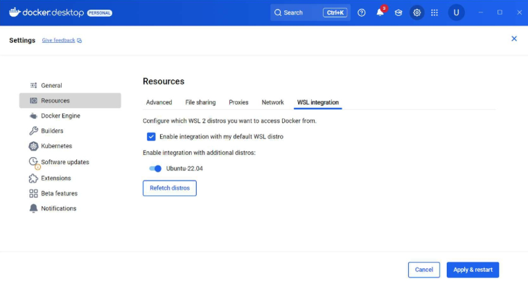

# Docker Desktop & Docker 설정 및 실습 가이드

## 1. Docker Desktop 설치

### 1-1. 사이트 접속 및 다운로드
- 공식 사이트: [https://www.docker.com/products/docker-desktop/](https://www.docker.com/products/docker-desktop/)
- **(Windows 사용자의 경우)** 설치파일 다운로드:  
  [https://desktop.docker.com/win/main/amd64/Docker%20Desktop%20Installer.exe](https://desktop.docker.com/win/main/amd64/Docker%20Desktop%20Installer.exe)

### 1-2. 설치 시 체크 옵션 설명
- **Use WSL 2 instead of Hyper-V (recommended)**  
  → 필수. Hyper-V보다 WSL2가 유연하고 안정적 (Windows Home에서도 사용 가능)  
- **Allow Windows Containers to be used with this installation**  
  → Windows 컨테이너가 필요한 경우에만 선택. (현재 Ubuntu 환경 예정이므로 불필요)  
- **Add shortcut to desktop**  
  → 바탕화면 아이콘 생성 여부는 선택사항  

### 1-3. Docker Subscription Service Agreement
- 회사 단위 사용 여부를 묻는 동의. **Accept** 진행.


## 2. Docker Hub 로그인 (선택)

1. **구글 계정** 또는 **GitHub 계정**으로 로그인 가능  
2. **플랜**: Free 선택


## 3. Docker Repository 생성 (선택)

### 3-1. 위치
**My Hub > Repositories > Create a Repository**

### 3-2. 설정
- **Repository 이름**: `hello-docker`  
- **공개 범위**: Public


## 4. Docker Desktop과 Ubuntu 연동

### 4-1. 연동 설정
**Docker Desktop > Setting > Resources > WSL Integration**  
→ 이전에 설치한 **Ubuntu** 체크 후 restart



### 4-2. 정상 작동 테스트
```bash
docker run hello-world
```


## 5. VS Code와 WSL Ubuntu 개발 연결

1. `Ctrl + Shift + P` → **WSL** 입력  
2. **WSL: Connect to WSL in New Window** 선택


## 6. Docker Container 환경 설정 실습

### 6-1. 실습 디렉토리 만들기
```bash
mkdir python-docker-env
ls
cd python-docker-env
```

### 6-2. Python 라이브러리 목록 구성
```bash
echo -e "pandas\nmatplotlib" > requirements.txt
```

### 6-3. Dockerfile 작성
**`python-docker-env/Dockerfile`**
```dockerfile
# Python 3.10 slim 버전 사용
FROM python:3.10-slim

# 작업 디렉토리 설정
WORKDIR /workspace

# 라이브러리 설치
COPY requirements.txt .
RUN pip install --upgrade pip && pip install -r requirements.txt

# Python 앱 복사 및 실행 설정
COPY app.py .
CMD ["python", "app.py"]
```

### 6-4. Docker 이미지 빌드
```bash
docker build -t python-lab .
```

### 6-5. Docker Container 실행
```bash
docker run -it --name pycheck python-lab
docker ps -a
```

### 6-6. Docker Container 삭제
```bash
docker stop pycheck
docker rm pycheck
```

### 6-7. Docker Hub에 Push (선택)
```bash
docker login
docker tag python-lab {your_docker_id}/hello-docker:v1
docker push {your_docker_id}/hello-docker:v1
docker images
```

### 6-8. Local Repository 비우기 (선택)
```bash
docker rmi {your_docker_id}/hello-docker:v1
docker rmi {your_docker_id}/hello-docker:latest
```

### 6-9. Docker Hub에서 Pull 후 실행 (선택)
```bash
docker pull {your_docker_id}/hello-docker:v1
docker run --rm {your_docker_id}/hello-docker:v1
```


## 7. Docker Compose 환경 설정 실습

### 7-1. 디렉토리 구성
```bash
mkdir compose-lab
cd compose-lab
touch docker-compose.yml
touch index.html
```

### 7-2. index.html 작성
**`index.html`**
```html
<!DOCTYPE html>
<html>
<head><title>Docker Compose Web</title></head>
<body><h1>Hello from Nginx!</h1></body>
</html>
```

### 7-3. docker-compose.yml 작성
**`docker-compose.yml`**
```yaml
version: '3'
services:
  web:
    image: nginx
    ports:
      - "8080:80"
    volumes:
      - ./index.html:/usr/share/nginx/html/index.html
  db:
    image: mongo
    ports:
      - "27017:27017"
```

### 7-4. Docker Compose 실행
```bash
docker compose up -d
```

### 7-5. 상태 확인
```bash
docker compose ps
```
→ `localhost:8080` 접속 시 정상 작동 확인

### 7-6. Docker Compose 종료 및 정리
```bash
docker compose down
docker compose ps
```
→ 종료 후 `localhost:8080` 접속 불가 확인

