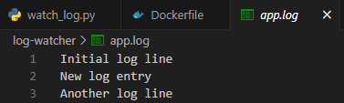

## 실습1
### Step 1: 도커가 정상적으로 작동하는지 확인
- hello-world 이미지는 Docker의 기본 테스트 이미지입니다.
- 이 명령을 실행하면 도커 엔진이 잘 작동하는지 확인할 수 있습니다.

```bash
docker run hello-world
```

### Step 2: 실행했던 컨테이너 목록 확인
- docker ps는 현재 실행 중인 컨테이너만 보여줍니다.
- -a 옵션을 붙이면 중지된 컨테이너도 포함해 모든 컨테이너를 보여줍니다.
```bash
docker ps -a
```

### Step 3: 컨테이너 중지 (예시로 컨테이너 이름 또는 ID가 'abc123'인 경우)
- 실행 중인 컨테이너를 중지합니다.
```bash
docker stop abc123
```

### Step 4: 컨테이너 삭제
- 중지된 컨테이너를 삭제합니다.
```bash
docker rm abc123
```

## 실습2
### 학습 목표
Dockerfile을 작성하여 Python 환경이 포함된 Docker 이미지를 생성

### Step 1: 실습용 디렉토리 생성 및 이동
- Dockerfile, requirements.txt, app.py 파일을 저장할 디렉토리를 새로 만듭니다.
- 이 디렉토리 내에서 모든 작업을 수행합니다.
```bash
mkdir python-docker-env
cd python-docker-env
```

### Step 2: requirements.txt 파일 생성
- Python 환경에서 사용할 패키지 목록을 정의합니다.
- 이 파일은 Dockerfile에서 패키지 설치를 위해 참조됩니다.

(필요한 Python 패키지를 여기에 작성하세요.)
```bash
echo -e "pandas\nnumpy" > requirements.txt
```

### Step 3: app.py 파일 생성
- 도커 컨테이너 실행 시 동작할 Python 스크립트를 작성합니다.
- 단순히 메시지를 출력하여 정상 동작을 확인할 수 있게 합니다.

(컨테이너 실행 시 출력될 간단한 메시지 코드를 작성하세요.)

```bash
echo 'print("Hello from Docker Python environment")' > app.py
```

### Step 4: Dockerfile 작성
- Python 3.10이 설치된 슬림 이미지를 기반으로 합니다.
- 작업 디렉토리를 지정하고, 필요한 파일을 컨테이너에 복사합니다.
- pip 업그레이드 및 패키지 설치를 진행하며, 최종적으로 app.py를 실행하도록 설정합니다.
- python-docker-env에 위치시켜주세요.

```dockerfile
# Dockerfile

FROM python:3.10-slim

WORKDIR /app

COPY requirements.txt .
RUN pip install --upgrade pip && pip install -r requirements.txt

COPY app.py .

CMD ["python", "app.py"]
```

### Step 5: Docker 이미지 빌드
- 현재 디렉토리에 있는 Dockerfile을 기반으로 이미지를 생성합니다.
- 이미지 이름은 'python-lab'으로 지정합니다.

(Dockerfile을 기반으로 이미지를 빌드합니다. 태그는 직접 지정하세요.)

```bash
docker build -t python-lab .
```

### Step 6: 컨테이너 실행
- 생성한 이미지를 기반으로 컨테이너를 실행합니다.
- 이름은 'pycheck'으로 지정하고, 터미널과 상호작용 가능한 모드로 실행합니다.

(이미지를 기반으로 컨테이너를 실행하세요. 이름은 자유롭게 지정)

```bash
docker run -it --name pycheck python-lab
```

## 실습3
### 학습 목표
Docker 컨테이너를 직접 실행하고, 내부에서 파일 생성하거나 명령

### Step 1: 컨테이너 실행
(컨테이너 이름은 'devtest', 이미지 이름은 'python-lab'로 지정하세요.)

```bash
docker run -it --name devtest python-lab
```

### Step 2: 컨테이너 내부에서 작업
- 2-1: 현재 디렉토리 위치 확인
    ```bash
    pwd    
    ```
- 2-2: 테스트 파일 생성
    ```bash
    echo "Docker container 내부 테스트 파일입니다." > docker_note.txt
    ```

- 2-3: 생성한 파일 내용 확인
    ```bash
    cat docker_note.txt
    ```

- 2-4: Python 실행 후 출력
    ```bash
    python
    >>> print(3 * 7)
    >>> exit()
    ```

### Step 3: 컨테이너 종료
(exit 또는 Ctrl+D를 사용하세요.)
```bash
exit
```

### Step 4: 컨테이너 목록 확인
```bash
docker ps -a
```

### Step 5: 컨테이너 재접속 (선택 사항)
```bash
docker start -ai devtest
```


## 실습4
### 학습 목표
Docker Compose를 통해 여러 컨테이너를 동시에 실행하여 컨테이너 간의 기본 네트워크 구조 이해

### Step 1: docker compose 명령어로 컨테이너 실행 (up)
- `-d` 옵션은 백그라운드에서 실행함을 의미합니다.
- `docker-compose.yml`에 정의된 web, api 두 컨테이너가 실행됩니다.

    ```yml
    version: "3"  # 도커 컴포즈 버전 설정

    services:
    # 첫 번째 서비스: nginx 웹 서버
    web:
        image: nginx  # nginx 이미지를 사용하여 컨테이너 생성
        container_name: web  # 컨테이너 이름을 'web'으로 지정
        ports:
        - "8080:80"  # 호스트의 8080 포트를 컨테이너의 80 포트에 연결 (웹 확인 가능)

    # 두 번째 서비스: alpine 기반 테스트용 컨테이너
    api:
        image: alpine  # 가벼운 리눅스 배포판
        container_name: api  # 컨테이너 이름을 'api'로 지정
        command: ["sleep", "infinity"]  # 무한 대기 상태로 유지 (컨테이너가 꺼지지 않도록 함)
    ```
- `docker-compose.yml`가 있는 폴더로 이동 후 실행!
```bash
docker compose up -d
```

### Step 2: 네트워크 통신 확인 - ping
- 'api' 컨테이너 안에서 'web' 컨테이너에 ping을 보내 네트워크 연결 확인
- Docker Compose에서는 서비스명이 곧 컨테이너 내부 DNS 이름으로 사용됩니다.
```bash
docker compose exec api ping web
```

### Step 3: curl 설치 - 외부 HTTP 요청 시뮬레이션
- 'api' 컨테이너는 Alpine 기반이기 때문에 패키지 설치가 필요합니다.
- apk는 Alpine의 패키지 관리자입니다.
```bash
# curl 설치
docker compose exec api apk add curl
```

### Step 4: web 컨테이너로 curl 요청
- 'web' 컨테이너는 nginx 서버이므로, HTTP 요청에 대해 기본 Welcome 페이지를 응답합니다.
- 응답으로 HTML 코드가 출력되면 통신이 정상적으로 이루어진 것입니다.
```bash
docker compose exec api curl http://web
```

### Step 5: 실행 상태 확인
- 현재 실행 중인 컨테이너 목록 확인
```bash
docker ps
```

### 참고 사항
- Docker Compose는 기본적으로 모든 서비스에 대해 하나의 bridge 네트워크를 생성하여 각 컨테이너를 연결합니다.
- Compose 내부의 컨테이너는 서비스 이름으로 서로를 인식하며, DNS처럼 동작합니다.
- ping web 또는 curl http://web과 같이 web을 호스트명처럼 사용 가능합니다.


## 실습5
### 학습 목표
Docker Compose를 사용하여 HTML 웹 서버를 구성

### Step 1: 실습용 디렉토리 생성 및 이동
- 실습 파일을 관리할 디렉토리를 생성하고 이동합니다.
```bash
mkdir compose-lab
cd compose-lab
```

### Step 2: index.html 파일 생성
- 웹 브라우저에서 확인할 HTML 파일을 작성합니다.
```bash
echo "<h1>Hello Docker Compose</h1>" > index.html
```

### Step 3: docker-compose.yml 파일 작성
- HTML을 띄워줄 웹 서버(Nginx)를 정의한 Compose 설정 파일을 생성합니다.
- compose-lab에 docker-compose.yml 파일을 위치시켜주세요.
    ```yml
    # docker-compose.yml
    version: '3'
    services:
    web:
        image: nginx:alpine
        volumes:
        - ./index.html:/usr/share/nginx/html/index.html
        ports:
        - "8080:80"
    ```

### Step 4: Docker Compose 실행
- 웹 서버 컨테이너를 백그라운드에서 실행합니다.
```bash
docker compose up -d
```

### Step 5: 상태 확인
- 현재 실행 중인 Compose 서비스 확인
```bash
docker compose ps
```

### Step 6: 접속 확인
- 웹 브라우저 또는 curl로 접속
```bash
curl http://localhost:8080
```

### Step 7: Compose 종료 및 정리
- 컨테이너와 네트워크를 정리합니다.
```bash
docker compose down
```

## 과제
### 학습 목표
실제 Python 기반의 Flask 웹 애플리케이션을 Docker 컨테이너로 배포

### Step 1: 실습 디렉토리 생성 및 이동
- Flask 앱과 관련 파일들을 저장할 작업 폴더를 생성하고 이동합니다.
```bash
mkdir flask-app
cd flask-app
```

### Step 2: Flask 앱 파일(app.py) 생성
- Python으로 Flask 웹 서버를 구성합니다.
- 디렉토리에 파일을 잘 위치시켜 주세요.
```python
# app.py

from flask import Flask
app = Flask(__name__)

@app.route("/")
def home():
    return "Hello, Dockerized Flask!"

if __name__ == "__main__":
    app.run(host="0.0.0.0", port=5000)
```

### Step 3: requirements.txt 작성
- Flask 실행에 필요한 패키지를 나열합니다.
- 최소한 'flask' 한 줄만 포함되면 됩니다.
```bash
echo "flask" > requirements.txt
```

### Step 4: Dockerfile 작성
- Flask 앱을 실행하기 위한 컨테이너 환경을 정의합니다.
- 디렉토리에 파일을 잘 위치시켜주세요.
```dockerfile
FROM python:3.10-slim
WORKDIR /app
COPY requirements.txt .
RUN pip install --no-cache-dir -r requirements.txt
COPY app.py .
CMD ["python", "app.py"]
```

### Step 5: Docker 이미지 빌드
- 현재 디렉토리에 있는 Dockerfile을 기반으로 도커 이미지를 생성합니다.
- 이미지 이름은 자유롭게 지정 가능합니다 (예: flask-docker-app)
```bash
docker build -t flask-docker-app .
```

### Step 6: 컨테이너 실행
- 빌드한 이미지를 사용해 컨테이너를 실행하고,
- 외부의 5000번 포트를 컨테이너의 5000번 포트와 연결합니다.
- 컨테이너 이름도 지정해야 합니다 (예: flask-container)
```bash
docker run -d -p 5000:5000 --name flask-container flask-docker-app
```

## 과제 - 2
### 학습 목표
Python으로 작성한 로그 모니터링 스크립트를 도커 컨테이너에서 실행하고, 볼륨 마운트를 통해 실시간 로그 파일을 읽는 구조를 구성

### Step 1: 실습 디렉토리 생성 및 이동
```bash
mkdir log-watcher
cd log-watcher
```

### Step 2: 로그 파일 생성 (호스트에서 실시간으로 쓰일 파일)
```bash
echo "Initial log line" > app.log
```

### Step 3: 로그 모니터링 스크립트 작성
- watch_log.py 파일을 적절한 위치에 위치시켜주세요.
```python
import time

log_path = "/log/app.log"

with open(log_path, "r") as f:
    f.seek(0, 2)  # EOF로 이동
    while True:
        line = f.readline()
        if line:
            print("[LOG] " + line.strip())
        else:
            time.sleep(1)
```

### Step 4: Dockerfile 작성
- Dockerfile을 적절한 위치에 위치시켜주세요.
```dockerfile
FROM python:3.10-slim
COPY watch_log.py /app/
WORKDIR /app
CMD ["python", "watch_log.py"]
```

### Step 5: Docker 이미지 빌드
```bash
docker build -t log-watcher-image .
```

### Step 6: 도커 컨테이너 실행 (볼륨 마운트로 호스트의 로그 파일 연결)
```bash
docker run -v $(pwd)/app.log:/log/app.log log-watcher-image
```
- `$(pwd)/app.log:/log/app.log`
    - 호스트의 `app.log` 파일을 컨테이너의 `/log/app.log` 로 연결 마운트

### Step 7: 테스트용 로그 추가
- (다른 터미널에서 실행) → 컨테이너 콘솔에 출력되는지 확인
```bash
echo "New log entry" >> app.log
```



