# Kafka 구조
## Kafka
### 메세징 시스템
어플리케이션 간 데이터를 교환하는 비동기적 방식의 데이터 전송 시스템

-> 비동기적이므로 데이터를 보내고 받는 쪽이 동시에 동작하지 않아도 됨

- 구성 요소
  - 생산자(Producer): 메시지를 생성하여 브로커에 전송하는 역할
  - 브로커(Broker): 메시지를 저장하고 관리하는 서버
  - 소비자(Consumer): 브로커에서 메시지를 읽어가는 역할

    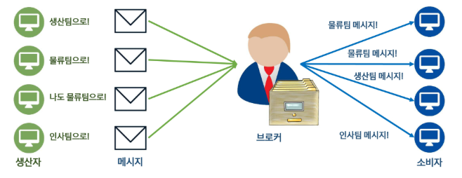
    - 즉, 메시지를 생산하는 생산자(Producer), 관리하는 브로커(Broker), 소비하는 소비자(Consumer)로 구성됨
  
  - 일반적으로 메시징 시스템에서는 메시지를 queue 형태로 관리
    - 카프카에서는 파티션(Partition) 단위로 메시지를 관리하여 분산 처리 가능
  - 간혹 브로커가 없는 경우도 있음 (Redis Pub/Sub, ZeroMQ 등)

- 메시징 시스템의 특징
  - 안정적인 구조
    - 비동기적 방식이라 시스템 간 결합이 느슨함

      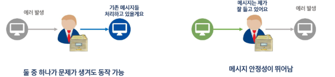
      - 만약 결합이 강하면, 항상 메시지를 보내고 받는 쪽이 동시에 동작해야 하기 때문에 시스템 장애가 발생할 수 있음
      - 왜? 메시지를 받는 쪽이 다운되면 메시지를 보내는 쪽도 영향을 받기 때문
      - 또, 메시지를 보내는 쪽이 너무 빨라서 받는 쪽이 감당을 못하면 메시지 유실 문제도 생길 수 있음
      

  - 뛰어난 확장성
    - 브로커만 추가하면 성능이 선형적으로 증가

      
      - 브로커가 늘어나면 각 브로커가 처리해야 하는 메시지 양이 줄어들기 때문

### 카프카
**대규모 데이터 처리**에 적합한 분산형 메시징 시스템

-> 특히, **스트리밍 처리**에 적합함

- 카프카의 주요 구성 요소
  - 카프카 브로커(Broker): 카프카의 메시지를 관리하는 서버(브로커)
  - 토픽(Topic): 카프카의 메시지를 관리하는 논리적 단위 -> 카테고리라고 보면 됨
  - 파티션(Partition): 토픽을 이루는 저장 단위. **파티션 기반으로 병렬 처리**가 이루어짐

    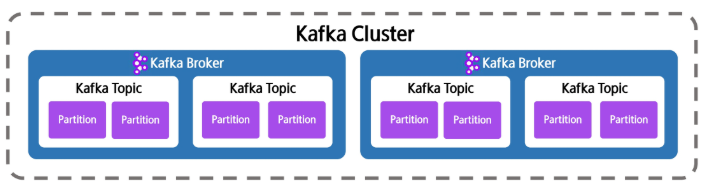
    - 브로커들을 묶어서 클러스터(Cluster)를 형성

### 카프카의 역할
- 데이터 파이프라인에서 카프카의 역할
  
  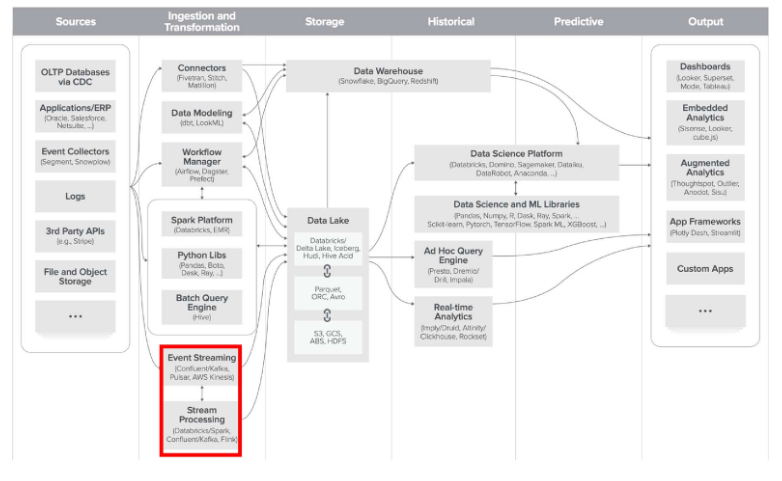
  - 변환 및 적재 도구와 함께 사용되어 대규모 데이터 이동 및 처리에 활용
  - 카프카는 **스트리밍형 데이터 수집**에 뛰어난 도구
    - 스트리밍 데이터 수집: 지속적으로 발생하는 데이터를 즉각 수집 및 처리
    - ex. 금융 데이터, 센서 값, 실시간 로그
    - event streaming, stream processing과 같이 실시간으로 데이터를 처리하는 시스템에서 주로 사용됨
  - 카프카는 데이터를 '빠르게', '실시간'으로 처리하는 허브 역할을 함

### 카프카의 장점
- 카프카를 쓰는 이유
  - 고성능
    - 초당 수백만 개의 메시지 처리 가능  
  - 확장성
    - 브로커 추가만으로 성능 선형 확장  
  - 내결함성
    - 백업본 관리와 모니터링을 통한 장애 복구  
  - 메시지 유지
    - 메시지를 **장기간 저장 가능** → 과거 데이터 재처리 가능
    - 카프카는 브로커 안의 토픽 안의 파티션 단위로 데이터를 '저장'하고 있음
    - 처리 로직 재테스트 또는 데이터를 놓쳤을 때 컨슈머가 파티션에 저장된 데이터를 다시 읽어올 수 있음
  - 이벤트 기반 구조
    - 여러 소비자가 동일한 데이터 읽기 가능  


## Kafka의 기본 구조 및 동작 원리
### Kafka의 기본 구조
- 생산자(Producer)
  - 메시지를 브로커에 전송  
- 소비자(Consumer)
  - 브로커에서 메시지를 소비
- 브로커(Broker)
  - 메시지를 관리하는 Kafka의 **서버**

    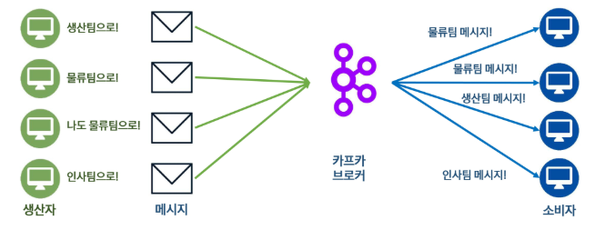

- 클러스터(Cluster)
  - 함께 동작하는 Kafka **서버 집단**
- 토픽(Topic)
  - 메시지를 저장하는 **논리적 단위**
  - 택배를 찾을 때 주소 같은 느낌 -> 메시지가 들어가는 '카테고리'
    - ex. '주문' 토픽, '결제' 토픽, '배송' 토픽 등
- 파티션(Partition)
  - 메시지를 **병렬로 처리하기 위한 단위**
  - 큐와 유사함, 택배 창고 같은 느낌
  - 같은 토픽 내에서도 파티션이 다르면 별도로 관리됨
    - 여러 개의 파티션으로 관리되는 형태이므로, 파티션 내에서는 순서가 보장되지만 토픽 전체에서는 순서가 보장되지 않음
- Zookeeper
  - Kafka의 클러스터를 관리해주는 분산 관리 시스템

    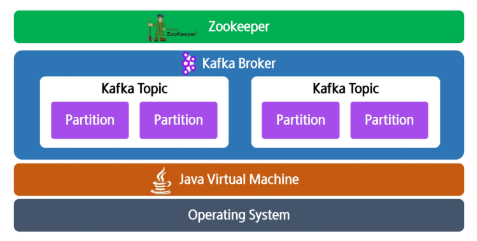
    - 카프카는 운영체제 위에서 띄우는 프로세스이며, JVM 위에서 동작함
    - 주키퍼는 카프카 클러스터의 메타데이터를 관리(상태 체크)하고, 브로커 간의 조율을 담당(관리, 감독)

### Kafka의 동작 원리
- 주요 구성 요소
  - `Producer`: 메시지를 생성해서 Kafka로 전송하는 주체 (예: 애플리케이션, 서비스)
  - `Kafka Cluster`: 여러 Broker로 구성된 클러스터
    - `Broker`: 메시지를 저장하고 관리하는 서버 단위
    - `Topic`: 메시지를 논리적으로 구분하는 단위 (예: “로그”, “주문정보”)
    - `Partition`: Topic을 여러 조각으로 나눈 단위 (병렬 처리와 확장성을 위해)
  - `Leader` / `Replica`
    - Leader는 실제 쓰기/읽기를 담당하는 파티션의 주 노드
    - Replica는 다른 Broker에 복제되어 있는 백업용 파티션
  - `Consumer`: 메시지를 구독하고 읽는 주체

- 메시지 흐름

  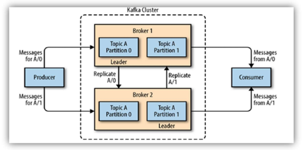
  - 메시지 생산(Producer → Broker)
    1. Producer는 특정 토픽(Topic A)에 메시지를 보냄
    2. Kafka는 토픽을 여러 파티션(Partition 0, Partition 1)으로 나누어 저장
    3. 메시지는 파티션의 Leader에게 먼저 기록됨
        - ex. Topic A Partition 0의 Leader는 Broker 1에 있고, Topic A Partition 1의 Leader는 Broker 2에 있음
    4. 메시지가 Leader에 기록되면, 동일한 데이터가 다른 Broker의 Replica로 복제됨
        - ex. Partition 0의 Replica는 Broker 2에, Partition 1의 Replica는 Broker 1에 저장됨
  
  - 데이터 복제 (Replication)
    - Kafka는 데이터 내구성과 장애 복구를 위해 각 파티션의 데이터를 다른 브로커로 복제함
    - 즉, 하나의 브로커가 다운되더라도 다른 브로커의 Replica가 Leader로 승격되어 데이터 손실 없이 동작할 수 있음
  
  - 메시지 소비 (Consumer ← Broker)
    1. Consumer는 Topic의 특정 파티션으로부터 메시지를 읽음
        - Consumer는 일반적으로 Leader 파티션으로부터 메시지를 읽음
    
- Kafka의 토픽과 파티션
  - 토픽(Topic): 메시지를 저장하는 논리적 단위
  - 파티션(Partition): 메시지를 병렬로 처리하기 위한 단위
  - **오프셋(Offset)**: 파티션의 데이터를 가리키는 숫자 -> 메시지의 순번

    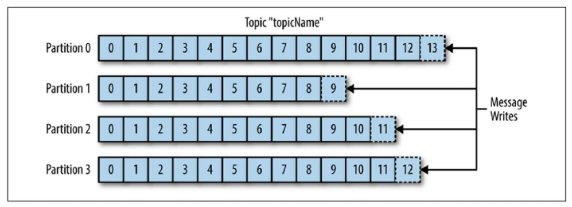
    - 카프카의 오프셋은 **파티션 내에서만** 유효(즉, 파티션이 다르면 오프셋도 별개)

      

      
    - 카프카는 파티션 단위로만 순서 유지되므로 순서가 중요한 시스템에는 적합하지 않음


## Kafka의 저장방식
- 토픽 / 파티션의 물리적인 위치는?
  - 메모리 -> 대용량 데이터를 다루기 어려움
  - 스토리지 -> 빠른 입출력 불가능
    - 그래서 디스크 기반의 저장 방식을 쓰되, append-only(순차쓰기) 로그 구조를 사용하여 빠른 쓰기 성능을 구현

- 그래서 디스크에 파일 형태로 저장함

### 세그먼트(Segment)
파티션이 실제로 저장되는 물리적 단위로, 파일 형태임

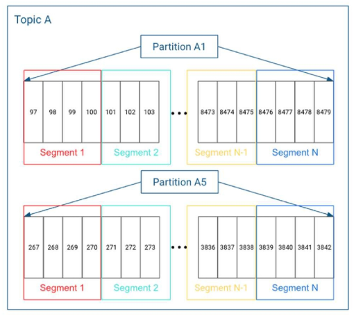

-> 하나의 파티션에 여러 개의 세그먼트 파일로 나누어 저장됨

- 세그먼트 파일의 장점
  1. 오래된 데이터 관리  

      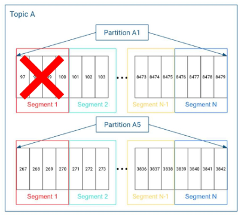
  2. 파일 수정 속도 최적화  
  3. 메시지 탐색 속도 향상

### Kafka의 실제 데이터  
`kafka/config/server.properties` 파일에 가면 저장 경로를 확인할 수 있음 

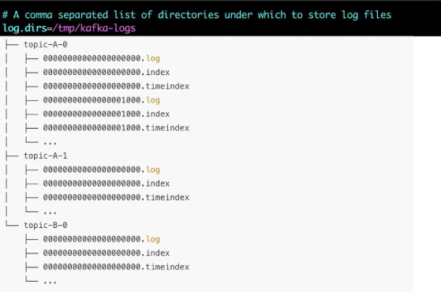

### Kafka의 파일 타입 (참고)
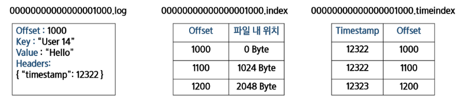

- 모두 `[시작 인덱스].[확장자]`의 형식  
- 모두 Binary 파일 → **빠른 읽기 속도**  
- 실제 데이터
  - 실제로 데이터가 들어있는 파일
  - `XXX.log`의 형식  
- 인덱스 파일
  - 오프셋을 빠르게 찾기 위한 색인용 파일
  - `XXX.index`의 형식  
- 타임스탬프
  - 시간 기준 검색을 위한 파일
  - `XXX.timeindex`의 형식  


## Kafka의 클러스터 구조 및 데이터 분산
### Kafka 클러스터
- 클러스터를 구성하는 이유  
  - 동시에 더 많은 데이터를 처리할 수 있음 (High Throughput)

    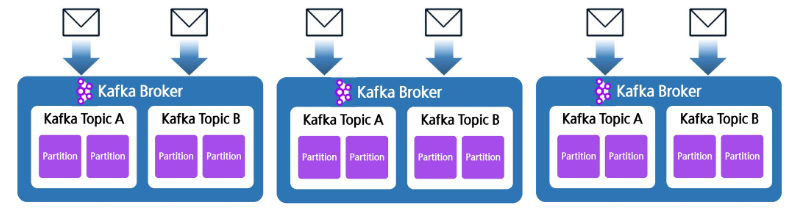
    - Scale Out : 시스템의 처리 성능을 높이기 위해 노드(서버) 수를 늘리는 것
    - Scale Up : 기존 노드(서버)의 성능을 높이는 것 (ex. CPU, RAM 증설)

  - 데이터 안정성
    - 복제를 통해 데이터 유실률을 낮춤

      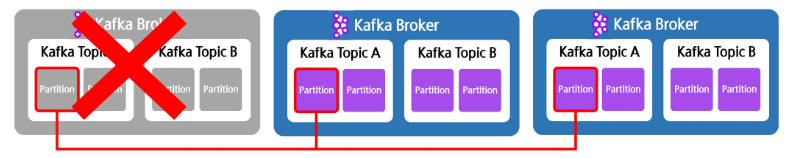

  - 고가용성
    - 하나의 브로커가 문제가 생기더라도 전체 시스템은 멈추지 않음 

      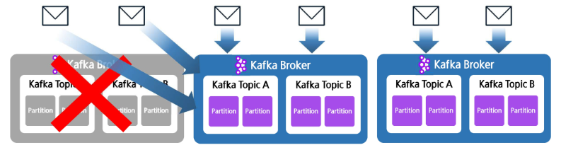

- 클러스터 관리의 필요성
  - 공통 메타데이터 및 자원 관리를 중앙에서 해줘야 함
    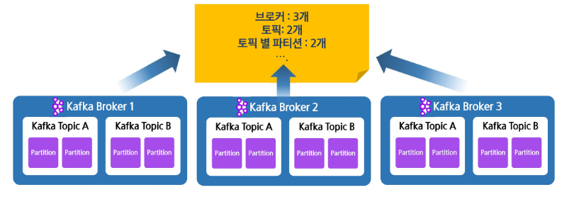
    - 브로커 몇갠지, 파티션 몇갠지, 리더가 누구인지 등

  - 관리의 복잡성 증가
    - 장애 대처 알고리즘, 파티션 할당 등

      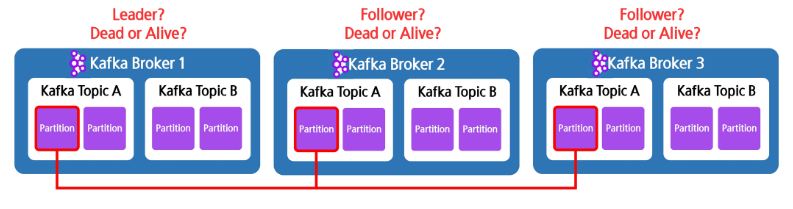
      - Leader와 Follower를 어떻게 정할지, Leader가 죽으면 어떤 Follower가 Leader가 될지 등 정해야 함
      - 모든 브로커들의 상태를 클러스터가 알고 있어야 함
      - 이런 정보들을 관리해주는 시스템이 필요

  - 분산 시스템 아키텍처
    - **네트워크 트래픽, 디스크 용량, 다중 모니터링 시스템** 등 고려하여 설계 필요 
      - 디스크 용량을 어떻게 한쪽으로 치우치지 않게 할지
      - 트래픽 증가를 어떻게 최소화 할지
      - 여러 시스템을 어떻게 모니터링 할지

- Kafka와 Zookeeper  
  - Zookeeper
    - Kafka의 클러스터를 관리해주는 분산 관리 시스템  
  - 코디네이션 서비스 시스템
    - Zookeeper 처럼 분산 시스템 관리를 도와주는 시스템
    - 내부 브로커들의 상태와 누가 리더이고, 누가 팔로워인지 등의 메타데이터를 관리

- Zookeeper의 역할  
  - 공용 리소스 관리
    - 브로커들이 공동으로 사용하는 리소스/데이터 관리

      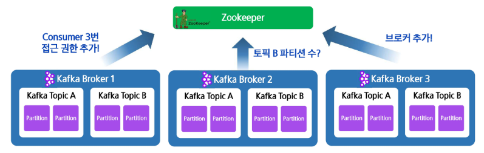
  - 노드 Healthcheck
    - 브로커(노드/서버)가 정상 동작 중인지 확인

      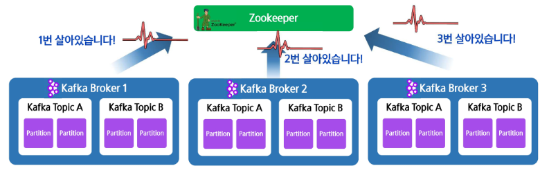
      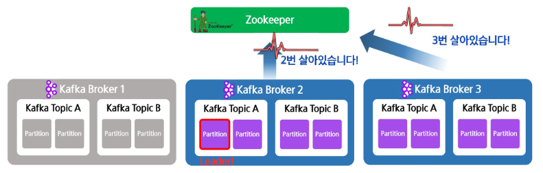
    - 어떤 노드가 정상 작동중인지 상태 확인(감시)
  - 브로커 및 파티션 관리
    - 메인 파티션의 Leader 선출 및 메인 브로커인 Controller 선출을 도움

      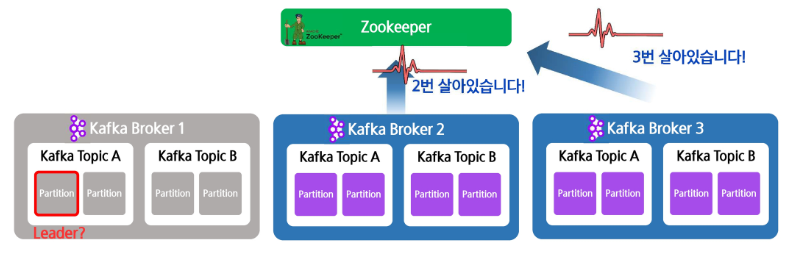
    - 만약 브로커1이 토픽A의 특정 파티션의 리더였다가 죽으면, 주키퍼와 카프가가 협력하여 해당 파티션의 새로운 리더를 선출함
    - replica 중에서 in-sync replica (ISR, 현재 동기화된 상태)에 속한 것들 중에서 가장 최신 데이터를 가진 replica가 리더가 됨

### Kafka 클러스터 구조
- Kafka의 컨트롤러
  - 컨트롤러(Controller)
    - 클러스터 관리 및 장애 처리 역할 수행(메타데이터 관리 책임자 역할)

      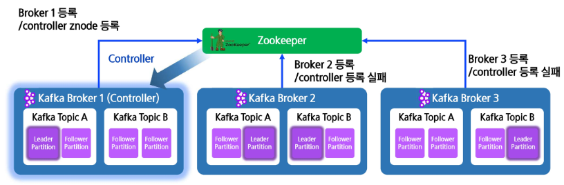
  
  - **컨트롤러**는 '클러스터 내부에서 동작'
    - 브로커들 중 하나가 컨트롤러 역할을 맡음
    - 주키퍼가 브로커들 중에서 컨트롤러를 선출함
  
  - **주키퍼**는 클러스터를 감시하고 상태를 '외부에서 관리'
    - 주키퍼는 브로커들의 상태를 감시하고, 장애 발생 시 컨트롤러에게 알림
    - 컨트롤러는 주키퍼로부터 받은 정보를 바탕으로 클러스터 상태를 업데이트하고, 장애 복구 작업 수행
    
### Kafka 데이터 분산 구조
- Kafka의 리더와 팔로워
  - 레플리카(Replica)
    - 파티션 데이터를 보존하기 위해 복사본을 두는 것  
  - 리더(Leader)
    - Producer, Consumer와 통신하는 메인 파티션

      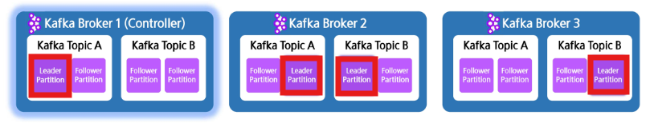
  - 팔로워(Follower)
    - 리더의 데이터를 실시간으로 복사해 가지는 파티션(레플리카)

- Kafka의 리더 선출  
  - 주키퍼와 컨트롤러 브로커가 협력하여 리더 선출 수행함

    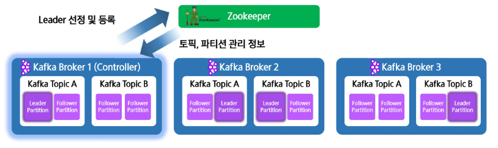

- 선호 리더(Prefered Leader)
  - 파티션별로 가장 선호하는 리더
  - 기본적으로 각 파티션의 리더를 Round Robin 방식으로 분배함

  - **처음에는 선호 리더에 맞추어 리더가 결정됨**

    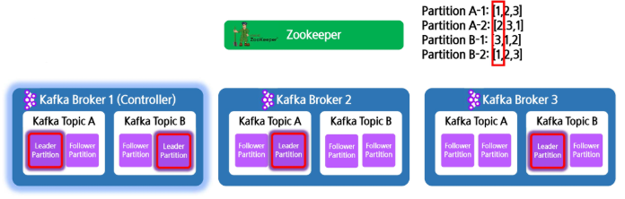
    ```
    Partition A-1: [1,2,3]  
    Partition A-2: [2,3,1]
    Partition B-1: [3,1,2]
    Partition B-2: [1,2,3]
    ```
    - 각 파티션의 replica Assignment (복제 배치 순서)
    - 여기서 리스트의 첫 번째 값이 "선호 리더"가 됨
    - 즉, Partition A-1의 선호 리더는 브로커 1, Partition A-2의 선호 리더는 브로커 2 ...
    - 이렇게 리더 역할을 브로커들 간에 라운드 로빈 방식으로 고르게 분배하여, 특정 브로커만 리더가 몰리지 않도록 함
  
- **리더 선출(Leader Election)**
  - 기존 리더 브로커가 사망했을 때 다음 리더를 뽑는 것

    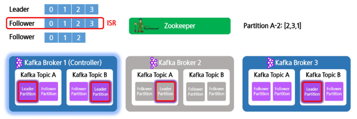
  - **ISR(In-Sync Replica)**
    - 리더와 완전히 같은 값(데이터)을 가진 팔로워

  - 리더 선출 시 ISR에 속한 팔로워들 중에서 가장 최신 데이터를 가진 팔로워가 리더가 됨

    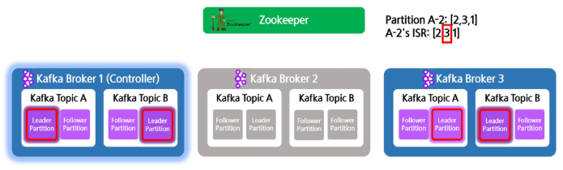
    - 즉, 팔로워 중 ISR에 속한 것이 있는 경우 "가장 빠른 순서"가 리더가 됨
  
  - 예시
    - `A-2’s ISR: [2,3,1]` -> 현재까지 리더와 동기화(in-sync)된 팔로워 리스트
    - broker 2가 다운되면, Broker 2의 heartbeat을 받지 못함을 감지하고
    - Controller(Broker 1)가 리더 선출 절차를 시작하여, Partition A-2의 ISR 리스트 `[3, 1]`를 확인함
    - ISR 내에서 가장 앞 순거의 Replica인 Broker 3이 새로운 리더가 됨
    - 원래 선호 리더: broker 2 -> 장애 후 리더: broker 3

- 팔로워 중 ISR이 없는 경우
  - ISR이 나타날 때까지 기다림 (혹은 리더가 복구되기를 기다림)

    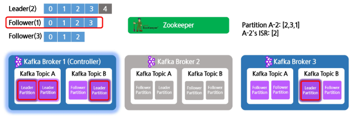
    - 이런 경우에는 해당 파티션에 리더가 없는 상태이므로, 데이터 처리 자체가 중단될 수 있음
    - 데이터 유실을 방지하기 위해 아래의 옵션 사용
  
  - `unclean.leader.election.enable = true` 옵션 사용 시 그나마 가장 최신 데이터를 가진 팔로워가 리더가 됨

    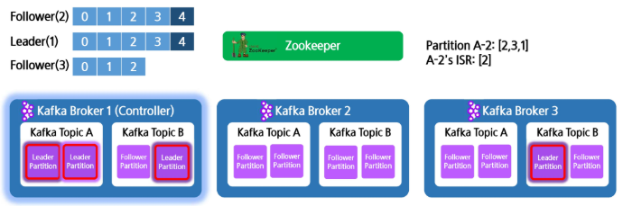
    - 옵션 사용 시 원래 브로커가 복구된다해도 팔로워로 참여(굳이 리더로 다시 변경하지 않음!!)
    - Why? 카프카는 리더의 데이터를 절대적으로 신뢰함


## Kafka 설치
`data_engineering/03_Kafka/01_kafka_setup.md` 참고

### Kafka 환경 설정  
- 설치 전 필수 요소
  - 운영체제, Java, Zookeeper  

- Kafka는 여러 개의 브로커(서버)와 토픽-파티션으로 이루어지고 Zookeeper가 이를 관리해줌

  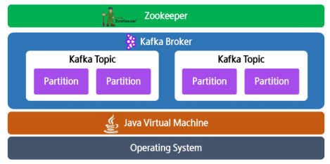

### 운영체제 선택  
- Kafka를 실행할 운영체제  
  - JVM 기반이라 다양한 운영체제에서 실행 가능  
  - Linux 환경이 가장 안정적이며 추천됨  
  - Windows는 WSL 환경 추천

### Java 설치
- Java 설치 -1 (공식 홈페이지를 통한 설치)  
  - Kafka 실행을 위한 Java 환경  
    - Java 8 이상이 필요하며, 과정에서는 통일성을 위해 **Java 17** 사용  
    - JRE(Java Runtime Environment)보다는 **JDK 설치** 추천  
    - 아래 페이지에서 최신 버전 Java 다운로드 가능  
    - https://www.oracle.com/java/technologies/downloads/?er=221886

      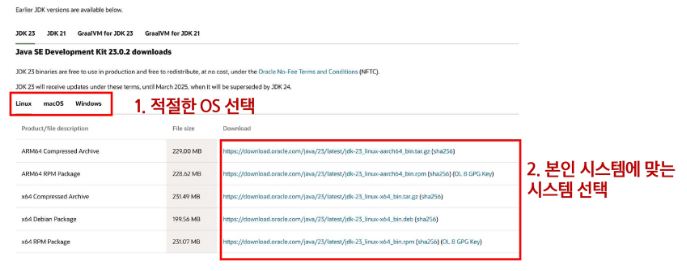

- Java 설치 -2 (Linux 패키지를 통한 설치)  
  - Kafka 실행을 위한 Java 환경  
    - Linux 환경에서 실행 필요  
    - Windows의 경우 WSL을 이용해서 실행 가능  

  1. 패키지 업데이트:  
    `sudo apt update`  
  2. 자바 JDK 설치 (8 이상):  
    `sudo apt install openjdk-17-jdk`  
    - 중간에 물어보면 **Y 입력 후 엔터**  
  3. 아래와 유사하게 출력되면 설치 완료

      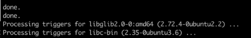

- Java 설치 확인  
  - Kafka 실행을 위한 Java 환경  
  - Java 설치 후 `java -version`을 입력하였을 때 정상적으로 출력되면 설치 성공  
  - 다음과 같이 출력되면 정상: `java -version`

    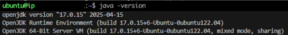

### Kafka 브로커 설치
- Kafka 브로커
  - 브로커(Broker): 메시지를 저장하고 제공하는 Kafka 서버  
  - **단일 Kafka 인스턴스**를 브로커라고 부름  
  - **다수의 브로커가 모이면 Kafka 클러스터** 형성

### Kafka 설치 방법  
- Kafka 다운로드 (홈페이지 다운)
  1. 아래 홈페이지에 접속하여 다운로드 후 압축 해제  
     - https://kafka.apache.org/downloads

      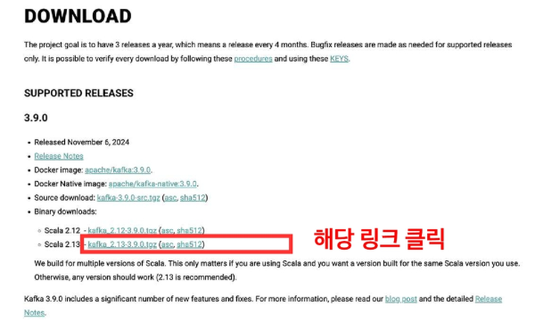

- Kafka 다운로드 (명령어로 다운)
  1. 터미널에 아래 명령어를 입력하여 다운로드  
     `wget https://dlcdn.apache.org/kafka/3.9.0/kafka_2.12-3.9.0.tgz`  
  2. 아래와 같은 내용이 출력되면 다운로드 성공  

      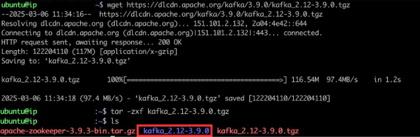
  3. `ls` 명령어를 실행했을 때 압축이 풀린 폴더가 생성되면 성공

- 관리의 편의를 위해 다운로드한 Kafka 폴더를 `/home/ssafy` 로 이동시키기
  - `sudo mv kafka_2.12-3.9.0 /home/ssafy/kafka`  
  - `/usr/local` 에 kafka 폴더가 생성되면 성공

      

## Zookeeper 실행
### Zookeeper의 역할  
- Kafka 클러스터의 메타데이터 관리 
  - 카프카를 실행하기 위해서는 주키퍼를 같이 띄워야 함!!
- 브로커 간 리더 선출 및 상태 유지  
- 소비자(Consumer) 그룹 정보 저장
  
  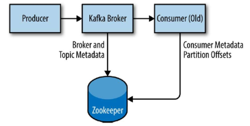

### Zookeeper 실행하기  
- Zookeeper 실행하기
  1. Kafka 폴더로 이동하기
      - `cd /home/ssafy/kafka`  
  2. Zookeeper 실행
      - `./bin/zookeeper-server-start.sh config/zookeeper.properties`  
  - 아래와 같은 내용이 출력되면 성공

    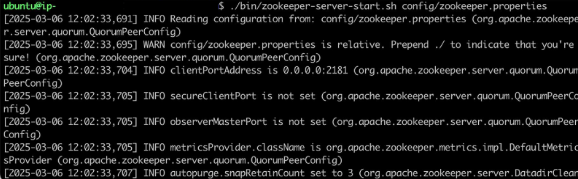

- Kafka 브로커 실행하기  
  1. 별도의 터미널 띄우기  
  2. Kafka 폴더로 이동하기  
     `cd /home/ssafy/kafka`  
  3. Kafka 브로커 실행하기  
     `./bin/kafka-server-start.sh config/server.properties`  
  - 아래와 같은 내용이 출력되면 성공

    

## Kafka 테스트 
### 토픽 생성 및 메시지 전송 실습
1. Kafka 폴더로 이동하기  
    - `cd /home/my/kafka`  

2. Kafka 브로커 실행
    - `./bin/kafka-server-start.sh config/server.properties`

2. 토픽 생성  
    ```bash
    cd /home/my/kafka

    ./bin/kafka-topics.sh --create \    # kafka-topics.sh 스크립트를 사용하여 새로운 토픽 생성 명령 실행
      --topic lecture-test-topic \  # 생성할 토픽 이름을 'lecture-test-topic'으로 지정
      --bootstrap-server localhost:9092 \   # 카프카 브로커가 실행 중인 서버 주소 지정
      --partitions 3 \   # 해당 토픽에 대해 3개의 파티션을 생성
      --replication-factor 1  # 복제 개수를 1로 설정(즉, 복제본 없음)
    ```

3. 메시지 전송  
   `./bin/kafka-console-producer.sh --topic lecture-test-topic --bootstrap-server localhost:9092`  
   `ssafy@6PC120:~/kafka$ ./bin/kafka-console-producer.sh --topic lecture-test-topic --bootstrap-server localhost:9092`  

4. 메시지 수신  
   `./bin/kafka-console-consumer.sh --topic lecture-test-topic --from-beginning --bootstrap-server localhost:9092`
