# Kafka 프로듀서와 컨슈머  
## Kafka Producer 
### Kafka 구조 복습  
- 생산자(Producer)
  - 메시지를 생산하여 브로커에 전송
- 소비자(Consumer)
  - 브로커에서 메시지를 소비

    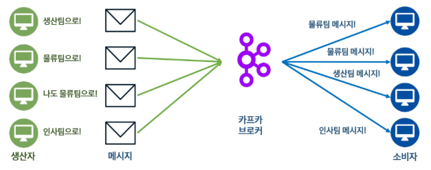
    - 컨슈머가 메시지를 '가져가는' 형태이므로 **비동기** 형태로 전달됨
    - -> 안정성, 확장성에 유리

- 토픽(Topic)
  - 메시지를 저장하는 **논리적** 단위, 택배를 찾을 때 주소 같은 느낌
- 파티션(Partition)
  - 메시지를 병렬로 처리하기 위한 **물리적** 단위, 큐와 유사함, 택배 창고 같은 느낌
  - 파티션이 토픽에 포함된 개념은 아님
  - 토픽과 파티션은 1:N 관계이지, 파티션이 토픽에 물리적으로 소속된 형태는 아님!!
- 브로커(Broker)
  - 메시지를 관리하는 Kafka의 서버  
- 클러스터(Cluster)
  - 함께 동작하는 Kafka 서버 집단
- 오프셋(Offset)
  - 파티션 내에서 메시지의 위치를 나타내는 고유 번호
  - 즉, 파티션 내의 메시지 순서
- 세그먼트(Segment)
  - 파티션 내에서 메시지를 저장하는 물리적 파일 단위
  - 즉, 파티션이 실제로 저장되는 물리적 단위 -> 파일 형태

### Kafka 클러스터 및 데이터 분산 복습  
- Kafka의 클러스터  
  - 컨트롤러(Controller)
    - 클러스터 관리 및 장애 처리 역할 수행  
  - 주키퍼(Zookeeper)
    - 클러스터 관리에 필요한 데이터 관리 및 헬스체크, 컨트롤러 선정 수행  
  - 레플리카(Replica)
    - 파티션의 복제본을 여러 브로커에 저장하는 방식, 리더와 팔로워로 나뉨

### Kafka Producer
- 프로듀서(Producer)
  - Kafka 토픽에 메시지를 전송하는 클라이언트
  - 다양한 데이터 소스(로그, 사용자 이벤트, 센서 데이터)에서 메시지 생성함

- Kafka Producer의 메시지 전송 과정  
  - 메시지는 **직렬화 → 파티션 결정 → 압축**의 과정을 거쳐 완성됨  
  - 그 후 **파티션별 버퍼**에 저장되어 있다가 일정 조건(시간, 용량)을 만족하면 **전송 스레드에 의해 브로커로 전송**

    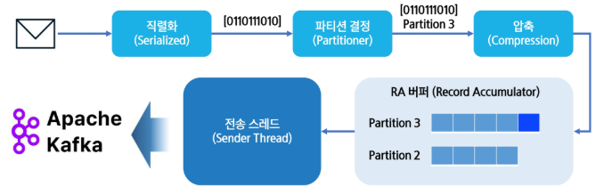
    - 직렬화(Serialization): 데이터를 바이트(Binary) 형태로 변환하는 과정(변환 전에는 데이터가 문자열, JSON 등의 형태)
    - 파티션 결정(Partitioning): 메시지를 저장할 파티션을 결정하는 과정
      - key 값에 따라 hash 함수를 적용해 파티션 결정 -> 같은 key 값은 같은 파티션에 저장하여 순서 보장 (key 파티셔닝)
    - 압축(Compression): 메시지의 크기를 줄여 전송 효율(네트워크 전송 속도 up, 저장 공간 절약)을 높이는 과정
    - 버퍼(Buffering): 전송 효율을 높이기 위해 메시지를 '일시적으로 저장'하는 메모리 공간
    - 전송 스레드(Sender Thread): 버퍼에 저장된 메시지를 브로커로 전송하는 별도의 스레드
  - 이 과정을 거치면 클러스터에서 어떤 브로커의 어떤 토픽의 리더 파티션에 메시지를 보낼지 결정되고, 팔로워는 리더로부터 복제됨

### Kafka Producer의 메시지 구조
- Kafka Producer Record
  - 레코드(Record)
    - 프로듀서가 **데이터를 전송하는 기본 단위**
  - **Topic**, **Value** 필수. 나머지는 선택사항
    | 항목 | 설명 | 예시 값 |
    |------|------|--------|
    | **Topic** | 전송될 Kafka 토픽 | `UserAction` |
    | **Value** | 전송할 값 | `"로그인 시도"` |
    | **Key** | 파티션을 지정할 키 값 | `"User 003"` |
    | **Partition** | 전송될 파티션 번호 | `3` |
    | **Headers** | 기타 포함할 정보 |  (데이터 소스 : 게임 페이지) |
    | **Timestamp** | 생성 시간 | `1728393847` |
 
### Kafka Producer의 직렬화  
- Kafka 직렬화 과정  
  - 직렬화(Serialized)
    - 문자열 같은 데이터(문자열, JSON, 객체 등)를 단순한 Byte 형태로 바꾸는 작업  
  - 역직렬화(Deserialized)
    - Byte 형태의 데이터를 다시 고수준의 원본 형태로 바꾸는 작업

    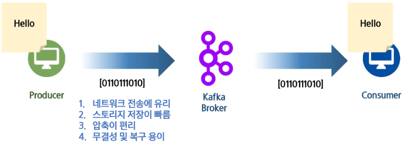
  
  - 직렬화 장점
    - 네트워크 전송 효율 향상 -> 데이터 크기가 작고, 구조 단순하기 때문에 전송 속도 빠름
    - 스토리지 저장이 빠름 -> 스토리지 저장에 최적화된 형태가 '바이트 배열'이기 때문
    - 압축이 편리 -> 바이트 배열은 압축 알고리즘이 최적화되어 있어 압축률이 높음
    - 무결성 및 복구 용이 -> 직렬화된 데이터는 오류 검출 및 복구 메커니즘이 포함될 수 있음

### Kafka Producer의 파티션 선택  
- Kafka 파티션 선정 알고리즘  
  - RR(Round Robin)
    - 기본 파티셔너'였'음
    - 파티션 지정이 없을 경우 **파티션별로 돌아가면서 저장**

      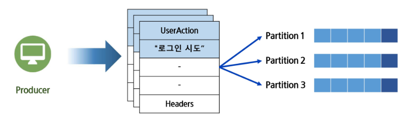
  - Key Base
    - 키가 결정되어 있으면 **같은 키의 데이터끼리 묶어서 처리**
    - 순서 보장이 특징임(hash 함수 사용)

      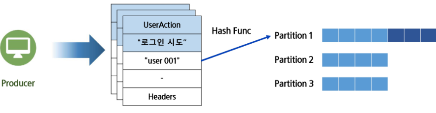
    - 사용 시 **파티션 수 변경 금지**

      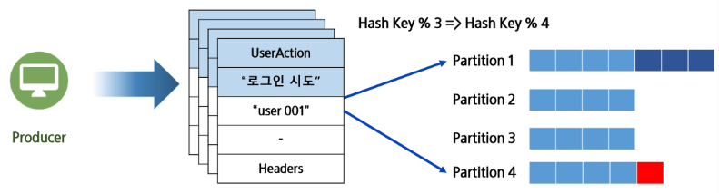
    - 파티션 수 변경 시, 기존에 같은 키로 묶여 있던 데이터들이 다른 파티션으로 흩어져서 '순서 보장이 깨짐'
    
  - 파티션 지정
    - **저장될 파티션을 직접 지정**하는 방식

      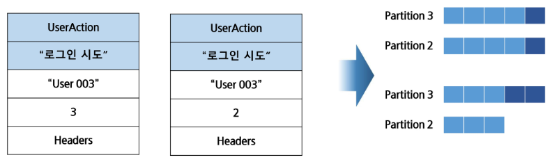
    - 파티션 지정 시, 키 값은 무시됨
    - 따라서, 키 값이 동일하더라도 파티션 번호가 다르다면 서로 다른 파티션에 저장됨(파티션 번호가 명시되어 있으면 해싱 무시)

  - Sticky
    - 정식 명칭: Uniform sticky (균등 끈적)
    - 기본 파티셔너
    - 하나의 **목표 파티션을 빠르게 채우고**, 목표 파티션을 바꿈

      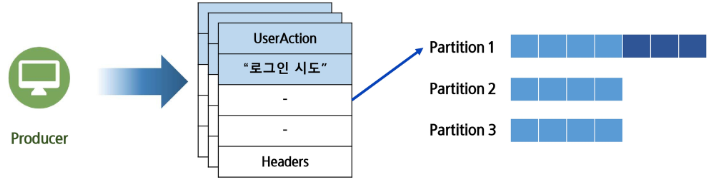

      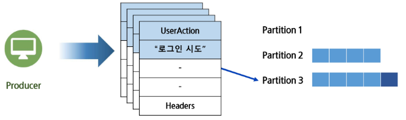
    - buffer에 일정량 이상의 데이터가 쌓이거나, 일정 시간이 지나면 목표 파티션을 변경
    - 즉, 버퍼에 데이터를 쌓아놓고 한 번에 전송하여 전송 효율을 높임
    - 버퍼가 flush(비워지는) 되는 시점에 목표 파티션을 변경

### Kafka Producer의 압축  
- Kafka 압축  
  - **효율적인 데이터 전송** 가능  
  - 브로커에서 **데이터 복사가 쉬움**

- Producer 설정에서 압축 옵션을 켜놓으면
  - 메시지가 파티션 버퍼에 저장되기 '전에' 압축 과정을 거침

    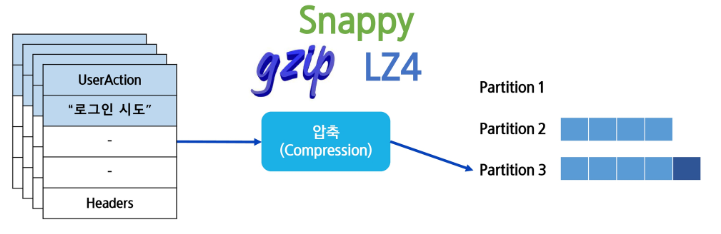

  - 압축 알고리즘 종류
    - none: 압축하지 않음
    - `gzip`: 높은 압축률, 느린 속도 (cpu 부하가 큼)
    - `snappy`: 빠르고 가벼운 압축률 (카프카 기본값)
    - `lz4`: 빠르고 압축률도 괜찮은 편 (중간 포지션)

### Kafka Producer의 버퍼  
- Kafka RA와 버퍼  
  - RA(Record Accumulator)
    - 전송될 레코드를 모아두는 메모리 공간, 전송 효율을 높이는 버퍼의 역할  
  - 배치(Batch)
    - 한 번에 전송되는 레코드의 단위
  
  - 파티션마다 버퍼가 큐 형태로 공간을 가지고 있고, 메시지 write 시 해당 파티션의 버퍼에 저장됨
  - 이때, 전송 스레드가 주기적으로 버퍼를 확인하여, 일정 조건(배치 크기, 대기 시간 등)을 만족하면 브로커로 전송 -> 이 과정을 Drain 이라고 함
    - `batch.size`: 배치 크기 설정 (기본값 16KB)

      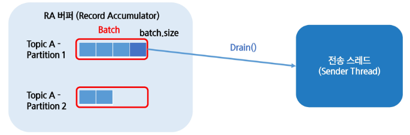
    - `linger.ms`: 대기 시간 설정 (기본값 0ms)

      
    - `buffer.memory`: 버퍼 전체 크기 설정 (기본값 32MB)

      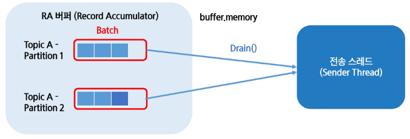

- PlggyBack
  - Kafka Producer의 버퍼 최적화 기법으로,
  - 조건을 만족하지 않은 배치가 만족한 배치와 같은 브로커를 향할 때 함께 보내는 최적화 기법

    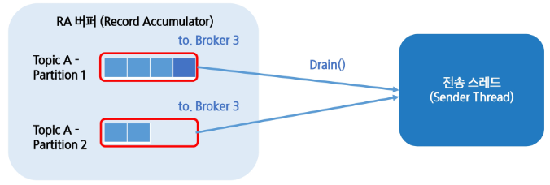
    - 파티션1이 배치크기를 만족하여 브로커로 전송될 때, 파티션2도 같은 브로커를 향하고 있으므로 하나의 네트워크 호출로 함께 전송

### Kafka Producer의 전송 스레드  
- Kafka Sender Thread  
  - 동기(Sync) 전송
    - 메시지(레코드)가 확실히 브로커에 전송될 때까지 메인 스레드가 대기  

      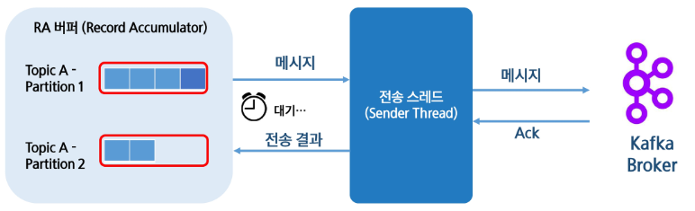
    - 즉, 메시지를 브로커에 보내고, 브로커가 정상적으로 받았다는 응답을 받을 때까지 기다림

  - 비동기(Async) 전송
    - 메시지(레코드)가 전송될 때까지 기다리지 않고 작업을 넘어감

      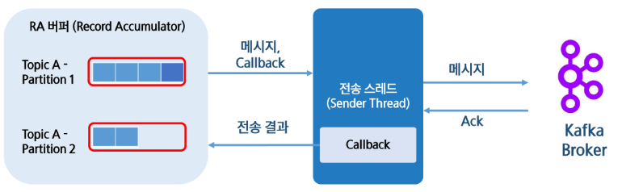
    - 즉, 메시지를 브로커에 보내고, 응답을 기다리지 않고 바로 다음 일을 처리함
    - 전송이 끝난 뒤 성공/실패 여부를 콜백 함수로 확인
  
  - 주로 **비동기 전송을 사용**하여 전송 효율을 높임
  
- Kafka Sender의 Acknowledge 옵션
  - 메시지 전송은 비동기로 진행되지만, 메시지가 어느정도까지 저장되었는지 프로듀서가 '어느정도 확인할 것인가'를 설정하는 옵션
  - `Acks == 0`: 브로커가 정상적으로 받았는지 확인하지 않음

    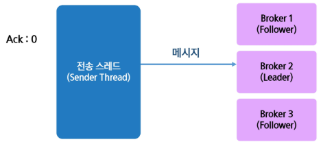
    - 가장 빠름, 그러나 데이터 유실 가능성 큼
  - `Acks == 1`: '리더'가 받았으면 다음 메시지로 넘어감, 못 받았으면 재전송
    
    
    - 팔로워 복제 여부는 확인하지 않음
  - `Acks == -1` or `Acks == all`: 리더가 받은 후 팔로워까지 모두 복제 완료되면 넘어감

    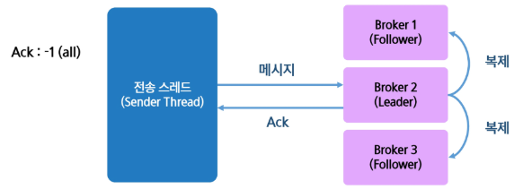
    - 가장 안전함, 그러나 속도 느림
    - 주로 이 옵션을 사용하여 데이터 유실을 방지
 
  - `min.insync.replicas`
    - 최소 몇 개의 파티션이 ISR이 됐는지를 보장하는 옵션  
    - `Ack == -1`인 상태로 위 옵션을 적용하면 원하는 ISR을 정확히 설정할 수 있음
      - ISR(In-Sync Replica): 리더와 동기화된 상태인 복제본 파티션
      - 즉, 리더 + 리더의 데이터를 일정 시간 내에 잘 따라오고 있는 팔로워 목록

      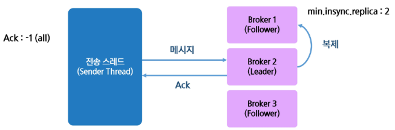
    - ex. ISR이 3개인 파티션에서 min.insync.replicas를 2로 설정하면,
      - 리더와 최소 1개의 팔로워가 복제 완료돼야 메시지가 성공적으로 전송된 것으로 간주하여 Acks가 리턴됨
    
    - 만약 ISR이 리더 1개만 남아있다면, `Ack == -1` 설정 시 리더만 확인하면 됨
      - 단, `min.insync.replicas` 조건에 따라 전송이 실패할 수 있음
      - ex. 팔로워 없이 리더 1개 뿐인데, min.insync.replicas가 2로 설정되어 있으면 복제본이 부족하므로 메시지 전송이 실패하게 됨

### Kafka Producer의 멱등성  
- 멱등성 프로듀서(Idempotence Producer)  
  - 데이터가 **중복해서 전송되지 않게** 하는 프로듀서 설정
  - 현재는 기본값으로 활성화되어 있음

    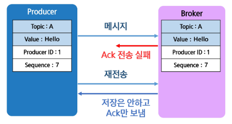
    - 기존 프로듀서는 **At-Least-Once** 규칙에 따라 전달되어, 브로커에 데이터가 중복 저장될 수 있음
    - ex. 메시지 전송은 완료되었는데, 프로듀서가 응답을 받지 못해 재전송하는 경우 중복 전송이 발생할 수 있음
  
  - 멱등성 프로듀서는 각 메시지에 고유한 ID를 부여하여, 브로커가 이미 처리한 메시지인지 확인하고 중복된 메시지를 무시함
    - `Producer ID` (PID): 프로듀서 인스턴스를 식별하는 고유 ID
    - `Sequence Number`: 각 메시지에 부여되는 고유한 번호로, 메시지의 순서를 나타냄
  
  - 즉, 프로듀서가 동일한 메시지를 여러번 전송하는 것은 피할 수 없으니, 브로커 측에서 '한번만' 저장하도록 처리하자
    - `enable.idempotence = true`로 설정하여 멱등성 프로듀서를 활성화

  
## Kafka Consumer
### Kafka Consumer
- 컨슈머(Consumer)
  - Kafka Topic의 데이터를 읽는 역할을 수행하며, 이를 **구독(Subscribe)** 이라고도 함  
  - 배치하게 ETL 과정을 통해 적재하거나, 실시간으로 데이터를 가져와 처리

    
 
- Kafka Consumer 기본 용어  
  - 컨슈머 랙(Consumer Lag)
    - 프로듀서가 넣은 최신 메시지의 Offset과 컨슈머가 읽고 있는 Offset의 차이
    - 즉, 아직 못읽은 메시지가 얼마나 쌓여있는지를 나타냄 -> 병목이 발생했는지 확인하는 지표가 됨
    - 메시지가 너무 빨리 쌓여서 컨슈머가 읽는 속도를 따라가지 못할 때 발생함
  - record-lag-max
    - 가장 높은 파티션의 랙

  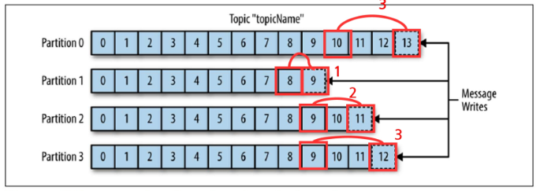

### Kafka Consumer 특징
- Polling
  - 데이터를 브로커가 보내는 것이 아닌 **컨슈머가 먼저 요청** 하는 구조

    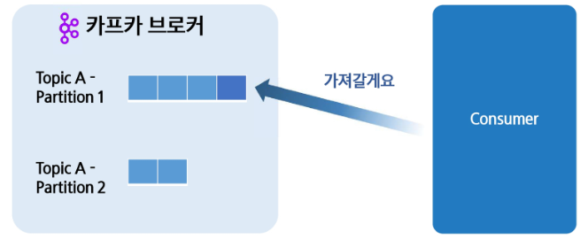
    - 그래서 push 방식이 아닌 pull 방식
  - 장점
    - 컨슈머가 처리할 수 있는 속도에 맞춰 데이터를 가져올 수 있음
    - 브로커의 부하를 줄일 수 있음
      - 브로커가 push하는 방식은 컨슈머가 부하가 있든 말든 데이터를 보내는데,
      - pull 방식은 컨슈머가 준비되었을 때만 데이터를 요청(컨슈머 본인이 처리 지연, 시스템 부하 등을 고려하여 조절 가능)
    

- 멀티 컨슈밍
  - 하나의 토픽을 여러 컨슈머가 같이 소비할 수 있음

    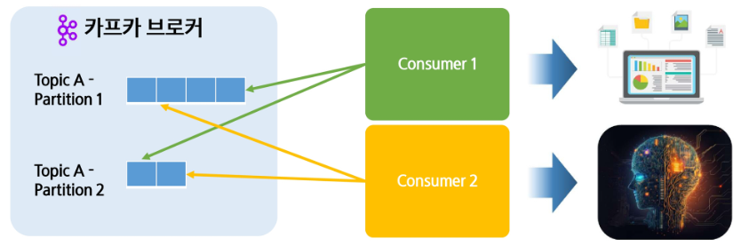
    - 여러 컨슈머가 동일한 데이터를 병렬로 가져가, 목적에 따라 독립적으로 데이터를 처리할 수 있음

- 컨슈머 그룹(Consumer Group)
  - 특정 토픽에 대해 접근 권한을 가진 컨슈머의 집단

    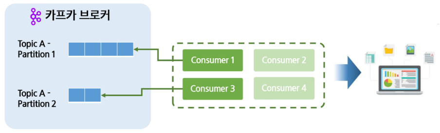
    - 토픽과 마찬가지로 '논리적'으로 묶인 단위
    - 컨슈머 그룹 내의 각 컨슈머는 토픽의 파티션을 나누어 가져감
    - 할당된 파티션이 없는 컨슈머의 상태를 '유휴(Idle)' 상태라고 함 ex. 그림의 Consumer 2, 4
  - 이러한 구조로 컨슈머가 늘어나거나 줄어들 때, 동적으로 대응할 수 있음
    - 컨슈머가 늘어나면 파티션을 재할당하여 부하를 분산시키고(리밸런싱)
    - 컨슈머가 줄어들면 남은 컨슈머가 기존 파티션을 담당함

### Kafka Consumer의 용어 (추가) 
- 페치(Fetch)
  - 컨슈머가 브로커로부터 레코드를 읽어오는 행위

    
    - 100 ~ 109번 데이터를 요청하는 행위가 '페치(Fetch)'

- 커밋(Commit)
  - 특정 Offset까지 처리했다고 선언하는 행위

    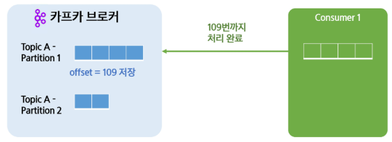
    - 109번 Offset까지 처리했다고 선언하는 행위가 '커밋(Commit)'

### Kafka Consumer의 Group Coordinator  
- 코디네이터(Coordinator)
  - Consumer 그룹을 관리하는 '브로커'
  - 컨슈머 그룹별로 지정됨 

    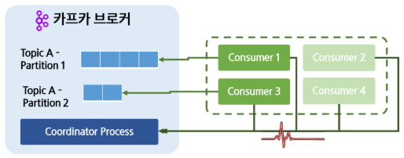
    - 백그라운드에서 Coordinator process가 동작하여 그룹을 관리

- Heartbeat
  - 컨슈머 그룹들이 정상적으로 동작 중인지 확인 (Polling, Commit 때마다)  

- 리밸런싱(Rebalancing)
  - 컨슈머 그룹의 변경이 있을 때 파티션을 다시 배정하는 것

    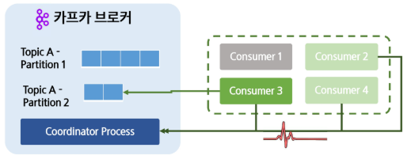

### Consumer Rebalance
- Consumer Rebalance 종류

  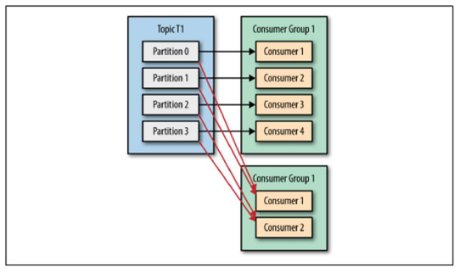
  1. 새로운 Consumer 추가 → 기존 파티션을 일부 재할당  
  2. Consumer 제거 → 남은 Consumer가 기존 Consumer의 파티션을 담당  
  3. 파티션 개수 변경 → 전체 Consumer에 대한 Rebalance 발생

- Consumer Rebalance의 과정  
  1. 그룹 코디네이터가 모든 컨슈머들의 소유권을 박탈하고 일시정지시킴

      
   
  2. JoinGroup 요청을 기다리고, 가장 빠르게 응답한 컨슈머를 리더로 선정  
  3. 리더는 재조정한 결과를 코디네이터에게 알리고 컨슈머들에게 전달

      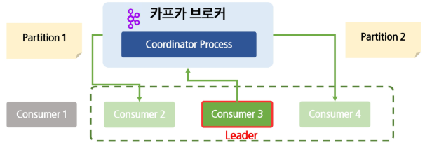

- Consumer Partitioning
  - 컨슈머 입장에서의 파티션 할당 방법

    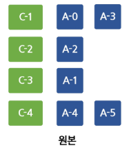
    - consumer 4가 사라진다고 가정

  - RangeAssignor
    - 토픽별로 순서대로 나누어줌 (과거 기본값)  
  - RoundRobinAssignor
    - 모든 파티션을 보고 하나씩 고르게 나누어줌  
  - StickyAssignor
    - 이전 할당 정보를 활용하여 최대한 비슷하게 (현재 기본값)

    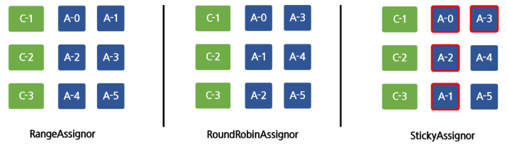

### Kafka Transaction  
- 트랜잭션 프로듀서(Transaction Producer)  
  - 프로듀서와 컨슈머가 연계해서 **EOS(Exactly Once Semantics)** 를 지키는 방법  
  - 일정 단위의 메시지를 ‘커밋’으로 묶어 하나의 트랜잭션으로 설정  
  - 일정 시간 안에 트랜잭션 커밋이 오지 않으면 실패로 간주하고 처음부터 다시 메시지를 받음

  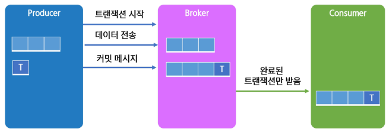
  - 일반적으로 Kafka Producer는 여러 파티션에 데이터를 보낼 수 있음
    - 그러나 여러 파티션에 메시지를 보내다가 중간에 실패하면, 일부 파티션만 메시지가 남아서 데이터 불일치가 발생할 수 있음
  - Kafka 트랜잭션을 사용하면:
    - 여러 파티션에 메시지를 보내더라도, 모든 파티션에 메시지가 성공적으로 저장되었을 때만 커밋됨
    - 만약 중간에 실패하면, 모든 파티션에 보낸 메시지를 롤백하여 데이터 불일치를 방지함
  
  - 즉, 여러 파티션 간에 일관성을 보장할 수 있음

## Kafka 프로듀서 & 컨슈머 실습
- setting
  - 실습 코드 실행 전, `data_engineering/03_Kafka/producer&consumer/wsl_python_environment_setting.md` 문서를 참고하여 WSL2에 Python 환경을 세팅
  - 이후 requirements.txt에 명시된 패키지들을 설치

### Kafka에 메시지 전송하기
- kafka-python
  - 간단하게 Kafka를 조작할 수 있는 Python 프레임워크  
  - `pip install kafka-python` -> kafka-python 설치

- Kafka에 메시지 전송하기 (Producer)
  ```python
  from kafka import KafkaProducer   # Kafka로 메시지를 전송(생산)하는 클래스

  # KafkaProducer 생성
  producer = KafkaProducer(
      bootstrap_servers='localhost:9092',          # Kafka 브로커 주소 (기본 포트: 9092)
      value_serializer=lambda v: v.encode('utf-8') # 메시지를 UTF-8로 직렬화(바이트 변환)
  )

  # 5개의 메시지를 순차적으로 전송
  for i in range(5):
      message = f"hello kafka {i}"                 # 전송할 메시지
      producer.send('test-topic1', message)        # 'test-topic1' 토픽으로 메시지 전송
      print(f"Sent: {message}")                    # 전송 로그 출력

  # 전송되지 않은 메시지를 모두 전송 후 리소스 정리
  producer.flush()                                 # 버퍼에 남은 메시지를 즉시 전송
  producer.close()                                 # Producer 종료
  ```  
  - `bootstrap_servers='localhost:9092'`
    - Kafka 브로커가 실행 중인 주소와 포트
    - localhost는 현재 컴퓨터, 포트 9092는 Kafka 기본 포트

  - `value_serializer=lambda v: v.encode('utf-8')`
    - 인코딩 방식 설정
    - Kafka는 메시지를 바이트(Byte) 형식으로만 전송하므로
    - 문자열을 UTF-8 바이트로 변환하는 함수 지정

  - `producer.send('test-topic1', message)`
    - 실제 메시지 전송 부분

  - `producer.flush()`
    - 버퍼에 쌓인 메시지를 Kafka로 즉시 전송
    - Kafka는 기본적으로 비동기 전송이라, send() 후 실제로 바로 전송되지 않을 수 있음
    - 따라서 flush()를 호출하여 버퍼에 남아 있는 메시지를 강제로 전송

  - `producer.close()`
    - KafkaProducer를 안전하게 종료

### Kafka의 메시지 받기 
- Kafka에서 메시지 받기 (Consumer)
  ```python
  from kafka import KafkaConsumer

  # KafkaConsumer 생성
  consumer = KafkaConsumer(
      'test-topic1',                                 # 구독할 토픽 이름
      bootstrap_servers='localhost:9092',           # Kafka 브로커 주소
      auto_offset_reset='earliest',                 # 처음부터 메시지를 읽음(earliest) / 최신부터는 latest
      enable_auto_commit=True,                      # 자동 오프셋 커밋 (소비한 위치 자동 저장)
      value_deserializer=lambda v: v.decode('utf-8')# 메시지를 UTF-8로 역직렬화(문자열 변환)
  )

  print("Listening for messages...")

  # 메시지 수신 루프
  for message in consumer:
      print(f"Received: {message.value}")           # 수신한 메시지 출력
  ```
  - `'test-topic1'`
    - 소비할 Kafka 토픽 이름 (Producer가 메시지를 보낸 토픽과 같아야 함)
  
  - `bootstrap_servers='localhost:9092'`
    - Kafka 브로커가 실행 중인 주소와 포트

  - `auto_offset_reset='earliest'`
    - 컨슈머가 처음 시작할 때, 가장 처음부터 메시지를 읽도록 설정
    - 'latest'로 설정하면 최신 메시지부터 읽음
  
  - `enable_auto_commit=True`
    - 컨슈머가 메시지를 읽은 후 자동으로 오프셋(읽은 위치)을 커밋하도록 설정
    - False로 설정하면 수동으로 커밋해야 함
  
  - `value_deserializer=lambda v: v.decode('utf-8')`
    - Kafka는 메시지를 바이트로 저장하므로, 이를 다시 문자열로 변환하는 함수 지정 (디코딩 방식 설정)
 
- 결과

  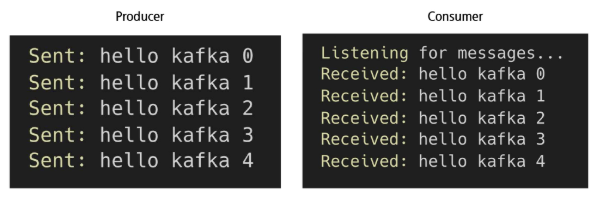

### 추가 라이브러리: confluent-kafka
- confluent-kafka
  - Kafka를 조작할 수 있는 또 다른 Python 프레임워크  
  - `pip install confluent-kafka` -> confluent-kafka 설치

- Kafka 메시지 보내기 (Producer)
  ```python
  from confluent_kafka import Producer

  # 1. Kafka 클러스터 설정
  conf = {
      'bootstrap.servers': 'localhost:9092'  
      # Kafka 브로커 주소 (여러 개일 경우 쉼표로 구분)
  }

  # 2. Producer 인스턴스 생성
  producer = Producer(conf)

  # 3. 메시지 전송 완료 콜백 함수
  def delivery_report(err, msg):
      """
      메시지 전송 후 Kafka 브로커가 응답하면 자동 호출되는 콜백 함수
      - err: 전송 실패 시 오류 정보
      - msg: 성공 시 메시지의 토픽, 파티션 등의 메타정보
      """
      if err is not None:
          print(f"Message delivery failed: {err}")
      else:
          print(f"Message delivered to {msg.topic()} [partition: {msg.partition()}]")

  # 4. 메시지 전송
  for i in range(5):
      message = f"hello kafka {i}"  # 전송할 메시지 생성
      
      producer.produce(
          topic='test-topic2',               # 전송할 토픽
          value=message.encode('utf-8'),     # 메시지를 UTF-8로 인코딩
          callback=delivery_report           # 전송 완료 후 콜백 함수 호출
      )
      
      # 내부 전송 큐 처리 (콜백 함수가 실행되도록 이벤트 루프를 돌림)
      producer.poll(0)

  # 5. 모든 메시지 전송 완료 대기
  producer.flush()  # 전송 큐에 남은 메시지를 모두 보낸 후 종료
  ```
  - `Producer(conf)`
    - confluent-kafka의 Producer 인스턴스를 생성하는 부분
    - 즉, Kafka Producer 객체 생성
    - conf 딕셔너리에 설정된 옵션들
      - `bootstrap.servers`: Kafka 브로커 주소 (여러 개일 경우 쉼표로 구분)
  
  - `delivery_report(err, msg)`
    - 메시지 전송 후 Kafka 브로커가 응답하면 자동으로 호출되는 콜백 함수
    - 전송 성공/실패 여부를 확인하는 용도로 사용됨
  
  - `producer.produce(...)`
    - 실제 메시지를 Kafka 토픽으로 전송하는 부분
  
  - `producer.poll(0)`
    - 콜백 함수가 실행되도록 이벤트 루프를 돌리는 역할
  
  - `producer.flush()`
    - 전송 큐에 남은 메시지를 모두 보낸 후 종료

- Kafka의 메시지 받기 (Consumer)
  ```python
  from confluent_kafka import Consumer

  # 1. Kafka Consumer 설정
  conf = {
      'bootstrap.servers': 'localhost:9092',  # Kafka 브로커 주소
      'group.id': 'my-group',                 # Consumer Group ID (같은 그룹은 파티션 분담 소비)
      'auto.offset.reset': 'earliest',        # 처음부터 읽기(earliest) / 최신부터는 latest
      'enable.auto.commit': True              # 자동 오프셋 커밋 여부 (True: 자동 저장)
  }

  # 2. Consumer 인스턴스 생성
  consumer = Consumer(conf)

  # 3. 구독할 토픽 지정
  consumer.subscribe(['test-topic2'])

  try:
      while True:
          # poll()은 브로커로부터 메시지를 가져오는 함수
          # (1.0초 동안 기다린 후 메시지가 없으면 None 반환)
          msg = consumer.poll(1.0)

          if msg is None:
              continue  # 메시지가 없으면 루프 계속

          if msg.error():
              print("Consumer error:", msg.error())  # 에러 발생 시 출력
              continue

          # 수신한 메시지 출력 (바이트 → 문자열 디코딩 필요)
          print(f"Received: {msg.value().decode('utf-8')}")

  except KeyboardInterrupt:
      print("Stopping consumer...")

  finally:
      # 종료 시 커넥션 정리
      consumer.close()
  ```
  - `Consumer(conf)`
    - confluent-kafka의 Consumer 인스턴스를 생성하는 부분
    - 즉, Kafka Consumer 객체 생성
    - conf 딕셔너리에 설정된 옵션들
      - `bootstrap.servers`: Kafka 브로커 주소
      - `group.id`: Consumer Group ID (**★필수★**)
      - `auto.offset.reset`: 처음부터 읽기(earliest) / 최신부터는 latest
      - `enable.auto.commit`: 자동 오프셋 커밋 여부 (True: 자동 저장)
  
  - `consumer.subscribe(['test-topic2'])`
    - 구독할 토픽을 지정하는 부분
  
  - `msg = consumer.poll(1.0)`
    - 브로커로부터 메시지를 가져오는 함수
    - 1.0초 동안 기다린 후 메시지가 없으면 None 반환
  
  - `consumer.close()`
    - 종료 시 커넥션을 정리하는 부분

  - 주의사항
    - `group.id`가 필수 없으면 오류 발생
    - Group을 없이 하는 방법도 있으나, Consumer가 하나뿐이어도 `group.id`를 지정해서 Consumer Group으로 구성

- 결과

  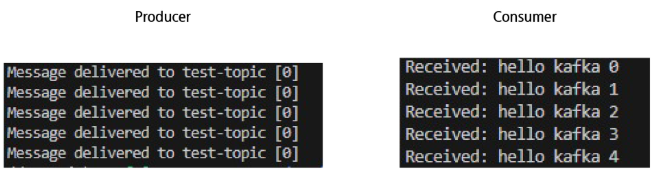
