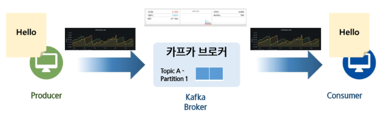
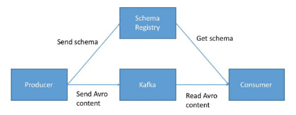
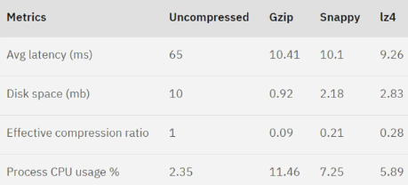
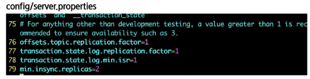
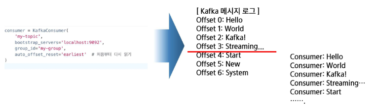
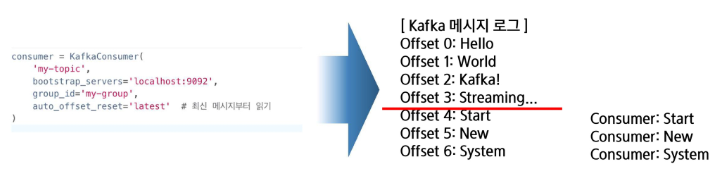
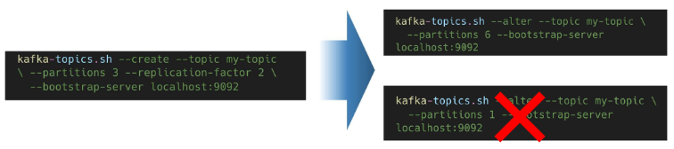
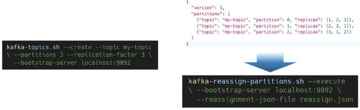
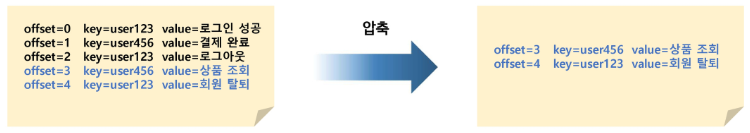

# Kafka 최적화
## Kafka 성능 최적화 개론
### Kafka의 성능 최적화가 필요한 이유
- 대규모 트래픽 처리
    - 데이터의 처리량(Throughput) 및 지연(Latency) 최적화
        - ex. 파티션 확충, 데이터 압축
- 안정성 개선
    - 데이터 손실에 대한 안정성(Durability)를 높임
        - ex. 리더-팔로워 구조(브로커 간 파티션 복제) -> 주키퍼 사용
- 리소스의 효율적 사용
    - 제한된 리소스를 최대한 활용하며 자원 부하를 낮춤
        - ex. 일정기간이 지난 Segment 삭제

### 성능 최적화 주요 지표
- 프로듀서 컨슈머의 처리 속도
    - ex. 데이터 양이 크면 처리 속도 느려지므로, 처리량과 지연시간으로 성능 최적화 확인
- 브로커 및 주키퍼 설정
    - ex. CPU, 메모리 등 인프라적 요소
- 스토리지, 네트워크 등 자원 최적화
    - ex. 디스크 I/O, 네트워크 전송 속도

    

- 이것들을 모니터링 하여 튜닝함!

## 프로듀서 및 컨슈머 성능 튜닝 - Producer 성능 최적화
### 직렬화 방식 선정
1. **StringSerializer**
    - 단순한 문자열 직렬화, 문자열을 UTF-8로 인코딩, 압축 효율 낮음
        ```python
        from confluent_kafka import Producer

        producer = Producer({'bootstrap.servers': 'localhost:9092'})
        # 메시지 전송
        producer.produce(
            topic='test-topic',
            key='my_key'.encode('utf-8'),
            value='Hello Kafka!'.encode('utf-8')
        )

        # 내부 전송 큐 처리
        producer.poll(0)
        # 메시지 전송 완료 대기
        producer.flush()
        ```
        ```python
        from kafka import KafkaProducer

        producer = KafkaProducer(
            bootstrap_servers='localhost:9092',
            key_serializer=str.encode,      # 문자열 UTF-8 인코딩
            value_serializer=str.encode     # 문자열 UTF-8 인코딩
        )

        producer.send('test-topic', key='my_key', value='Hello Kafka!')
        producer.flush()
        ```
        - key, value의 직렬화 방식을 서로 다른 직렬화 방식으로 적용 가능함
        - 만약 다른 직렬화 방식을 설정했다면, 컨슈머가 역직렬화(deserializer)할 때 인코딩 방식을 알아야 함
        - 따라서, 통신 규약 잘 정의해야 함

2. **ByteArraySerializer**
    - 데이터를 그대로 바이트 배열로 직렬화, 다양한 형식 처리 가능, 빠른 변환 / 부족한 사용성 
        ```python
        from confluent_kafka import Producer

        producer = Producer({'bootstrap.servers': 'localhost:9092'})

        producer.produce(
            topic='test-topic',
            key='my_key'.encode('utf-8') if 'my_key' else None,
            value=b'BinaryData' if isinstance(b'BinaryData', bytes) else b'BinaryData'.encode()
            # 'b' : byte 형태롤 보내겠다는 의미
        )

        producer.poll(0)
        producer.flush()
        ```
        ```python
        from kafka import KafkaProducer

        producer = KafkaProducer(
        bootstrap_servers='localhost:9092',
        key_serializer=lambda k: k.encode() if k else None,
        value_serializer=lambda v: v if isinstance(v, bytes) else v. encode()
        )

        producer.send('test-topic', key='my_key', value=b'BinaryData')
        ```
        - 메시지 보낼 때 `b`만 앞에 붙여주면 됨

3. **JsonSerializer**
    - JSON 형식으로 직렬화, 가독성 높지만 압축 효율 낮음  
        ```python
        import json
        from confluent_kafka import Producer

        producer = Producer({'bootstrap.servers': 'localhost:9092'})

        producer.produce(
            topic='test-topic',
            value=json.dumps({"name": "Alice", "age": 25}).encode('utf-8')
        )

        producer.poll(0)
        producer.flush()
        ```
        ```python
        import json
        from kafka import KafkaProducer

        producer = KafkaProducer(
            bootstrap_servers='localhost:9092',
            value_serializer=lambda v: json.dumps(v).encode('utf-8')  # JSON 직렬화 후 UTF-8 인코딩
        )

        producer.send('test-topic', value={"name": "Alice", "age": 25})
        producer.flush()
        ```
        - `json.dumps`를 통해 JSON 형태로 변환하여 전송
        - 디버깅에 유용한 포맷!!

4. **AvroSerializer**
    - Avro 포맷을 사용한 직렬화, 스키마 기반, 압축 효율이 좋고 빠름 (Kafka 권장 방식)

        
    - 데이터가 어떤 구조인지에 대한 스키마 정보를 함께 정의하여 관리함
        - ① JSON 형태로 Avro 스키마 작성(name, age .. 등의 필드 이름과 이 필드들의 type 등을 명시) 
        - ② 스키마를 Registry에 등록
            - Schema Registry: 카프카 환경에서 별도의 서비스로 운영되며, 프로듀서와 컨슈머가 동일한 스키마를 공유할 수 있게 도와줌
        - ③ 프로듀서는 데이터를 Avro 포맷으로 직렬화하고, 해당 스키마의 ID를 메시지에 포함된 메타데이터로 Kafka에 전송
            - Kafka에는 실제 데이터(바이너리 형태) + 스키마 ID 정보가 같이 들어감
        - ④ 컨슈머가 Kafka에서 메시지를 읽으면, 메시지에 포함된 스키마 ID를 이용해 Schema Registry로부터 스키마를 조회한 뒤, 해당 스키마에 맞추어 데이터를 Avro 객체(또는 JSON 등)으로 역직렬화함
        - 즉, 컨슈머는 데이터 구조를 모르더라도 스키마를 Registry에서 가져와 자동으로 해석할 수 있음
        ```python
        from kafka import KafkaProducer
        from fastavro import parse_schema, schemaless_writer
        import io

        # 1️. Avro 스키마 정의
        avro_schema = {
            "type": "record",
            "name": "User",
            "fields": [
                {"name": "name", "type": "string"},
                {"name": "age", "type": "int"}
            ]
        }
        parsed_schema = parse_schema(avro_schema)

        # 2️. 메시지 직렬화
        record = {"name": "Alice", "age": 25}
        bytes_writer = io.BytesIO()
        schemaless_writer(bytes_writer, parsed_schema, record)
        avro_bytes = bytes_writer.getvalue()

        # 3️. Kafka Producer 생성 및 전송
        producer = KafkaProducer(
            bootstrap_servers='localhost:9092',
            key_serializer=str.encode,
            value_serializer=lambda v: avro_bytes   # 이미 직렬화됨
        )

        producer.send('avro-topic', key='user1', value=avro_bytes)
        producer.flush()
        ```
        ```python
        from confluent_kafka import SerializingProducer
        from confluent_kafka.schema_registry import SchemaRegistryClient
        from confluent_kafka.schema_registry.avro import AvroSerializer

        schema_registry_conf = {'url': 'http://localhost:8081'}
        schema_registry_client = SchemaRegistryClient(schema_registry_conf)

        avro_schema = """
        {
        "type": "record",
        "name": "User",
        "fields": [
            {"name": "name", "type": "string"},
            {"name": "age", "type": "int"}
        ]
        }
        """

        avro_serializer = AvroSerializer(schema_registry_client, avro_schema)

        producer = SerializingProducer({
            'bootstrap.servers': 'localhost:9092',
            'key.serializer': str.encode,
            'value.serializer': avro_serializer
        })

        producer.produce(topic='test-topic', key='user1', value={"name": "Alice", "age": 25})
        producer.flush()
        ```

### 파티셔닝 방식 선정 
파티션을 어떤 기준으로 나눌 것인가

1. **key 기반 파티셔닝**
    -  해시 기반, 같은 key를 가진 값들끼리 같은 파티션 배치
        ```python
        from confluent_kafka import SerializingProducer

        # 1. Kafka Producer 설정
        producer = SerializingProducer({
            'bootstrap.servers': 'localhost:9092',
            'key.serializer': StringSerializer('utf_8'),
            'value.serializer': StringSerializer('utf_8')
        })

        # 2. 전송할 key 리스트
        keys = ["user1", "user2", "user3", "user1", "user2"]

        # 3. 메시지 전송
        for i, key in enumerate(keys):
            value = f"Data {i}"
            producer.produce(topic="test-topic", key=key, value=value)
            print(f"Sent: Key={key}, Value={value}")

        # 4. 전송 완료 보장
        producer.flush()
        ```
        ```python
        from kafka import KafkaProducer

        producer = KafkaProducer(
            bootstrap_servers='localhost:9092',
            key_serializer=str.encode,   # Key를 UTF-8로 변환
            value_serializer=str.encode  # Value를 UTF-8로 변환
        )

        for i in range(5):
            producer.send('test-topic', value=f"Fixed Partition Data {i}", partition=0)
            print(f"Sent to Partition 0: Message {i}")

        producer.flush()
        ```

2. **특정 파티션 지정**
    - 바이트 배열 그대로 전송
        ```python
        from confluent_kafka import SerializingProducer

        # 1. Kafka Producer 설정
        producer = SerializingProducer({
            'bootstrap.servers': 'localhost:9092',
            'key.serializer': StringSerializer('utf_8'),
            'value.serializer': StringSerializer('utf_8')
        })

        # 2. 고정 파티션 0으로 메시지 전송
        for i in range(5):
            value = f"Fixed Partition Data {i}"
            producer.produce(
                topic="test-topic",
                value=value,
                partition=0
            )
            print(f"Sent to Partition 0: Message {i}")

        # 3. 전송 완료 보장
        producer.flush()
        ```
        ```python
        from kafka import KafkaProducer

        producer = KafkaProducer(
            bootstrap_servers='localhost:9092',
            value_serializer=str.encode
        )

        for i in range(5):
            producer.send('test-topic', value=f"Fixed Partition Data {i}", partition=0)
            print(f"Sent to Partition 0: Message {i}")

        producer.flush()
        ```
3. **StickyPartitioner**
    - 정수 값을 바이너리 데이터로 변환, Batch를 최대한 활용하여 RoundRobin보다 효율적 (같은 파티션에 여러 메시지를 모아서 보내고, 일정 조건이 되면 다른 파티션으로 바꾸는 전략)
        | 메시지 번호 | 파티션 예시 |
        |-------------|-------------|
        | message-0 | 1 |
        | message-1 | 1 |
        | message-2 | 1 |
        | message-3 | 1 |
        | message-4 | 1 |
        | message-5 | 2 |
        | message-6 | 2 |
        | message-7 | 2 |
        | message-8 | 0 |
        | message-9 | 0 |
        ```python
        from confluent_kafka import SerializingProducer

        # 1. Kafka Producer 설정
        producer = SerializingProducer({
            'bootstrap.servers': 'localhost:9092',
            'value.serializer': StringSerializer('utf_8')  # Key 없이 Value만 설정
        })

        # 2. Key 없이 메시지 전송 (Sticky 파티셔너 적용됨)
        for i in range(10):
            value = f"Sticky Message {i}"
            producer.produce(topic="test-topic", value=value)
            print(f"Sent Message {i}")

        # 3. 전송 완료 보장
        producer.flush()
        ```
        ```python
        from kafka import KafkaProducer
        from kafka.partitioner.default import DefaultPartitioner

        producer = KafkaProducer(
            bootstrap_servers='localhost:9092',
            value_serializer=str.encode,     # UTF-8 인코딩
            # partitioner=DefaultPartitioner() # 기본 해싱 파티셔너 -> 굳이 안써도 됨
        )

        # Key 없이 메시지를 전송하면 Sticky Partitioner가 자동 적용됨
        for i in range(10):
            producer.send('test-topic', value=f"Sticky Message {i}")
            print(f"Sent Message {i}")

        producer.flush()
        ```        

4. **커스텀 파티셔너**
    - 본인만의 로직을 만든 파티셔너 (kafka-python 라이브러리 사용)  
        ```python
        from kafka import KafkaProducer, partitioner

        class CustomPartitioner:
            def __call__(self, key, all_partitions, available_partitions):
                key_int = int(key.decode())  # Key를 정수로 변환
                return key_int % len(all_partitions)  # 해시 계산: 짝수는 0번, 홀수는 1번 파티션

        producer = KafkaProducer(
            bootstrap_servers='localhost:9092',
            key_serializer=str.encode,
            value_serializer=str.encode,
            partitioner=CustomPartitioner()  # 사용자 지정 파티셔너 적용
        )

        for i in range(10):
            producer.send('test-topic', key=str(i), value=f"Message {i}")
            print(f"Sent Key={i}, Value=Message {i}")

        producer.flush()
        ```
        - confluent-kafka-python은 내부적으로 C 라이브러리인 `librdkafka`를 감싸서 구현되어 있기 때문에 불가능

- Kafka 파티셔닝 방식 비교
    | 방식                                                | 사용 목적 / 언제 쓰는가?                                   | 특징 및 장점                                                                   | 단점                                          |
    | ------------------------------------------------- | ------------------------------------------------- | ------------------------------------------------------------------------- | ------------------------------------------- |
    | **1. Key 기반 파티셔닝 (Hash-based)**                   | 특정 기준(예: user id)으로 **순서 보장**이 필요할 때              | - 동일 key → 동일 파티션 → 메시지 순서 보존<br>- 특정 고객/아이디 기반으로 분석할 때 적합                | - 특정 key에 쏠림(skew) 가능성이 있음                  |
    | **2. 특정 파티션 지정 (partition 번호 명시)**                | **정확하게 특정 파티션으로 보내고 싶을 때** (테스트, 컨트롤 등)           | - 메시지가 어느 파티션으로 가는지 100% 확정<br>- 운영 시 디버깅/테스트 용으로 유용                      | - 특정 파티션만 과부하될 수 있음                         |
    | **3. Sticky Partitioner (Kafka 기본 파티셔너, key 없음)** | key 없이 **빠르고 효율적**으로 보내고 싶을 때 (Throughput 우선)     | - 여러 메시지를 한 파티션에 모았다가 batch로 보냄 → **성능 최적화**<br>- Round Robin보다 네트워크 효율 ↑ | - key가 없으므로 메시지 순서를 보장하지 않음                 |
    | **4. 커스텀 파티셔너 (사용자 정의)**                          | 고유한 비즈니스 규칙이 있을 때<br>ex. 짝수/홀수 묶기, 특정 범위별 파티션 라우팅 | - 파티션 배치 전략을 자유롭게 커스터마이징 가능                                               | - 유지보수 비용 ↑<br>- Kafka scalability를 해칠 수 있음 |

### Batching 설정 최적화
```python
from kafka import KafkaProducer

producer = KafkaProducer(
    bootstrap_servers='localhost:9092',
    value_serializer=str.encode,
    buffer_memory=33554432,  # 32MB (기본값)
    batch_size=32768,        # 32KB (기본값: 16KB보다 크게 설정해 배칭 효율 증가)
    linger_ms=5              # 5ms 동안 배치를 기다렸다가 전송 (기본값: 0)
)

for i in range(100):
    producer.send('test-topic', value=f"Batching Message {i}")

producer.flush()
```
1. **buffer.memory**: 프로듀서 내부에서 저장할 수 있는 RA 버퍼의 최대 크기, 기본값 32MB
(confluent-kafka에는 해당 옵션 없음)  
2. **batch.size**: 한 batch의 크기, 해당 크기가 다 차면 전송 준비. 기본값 16KB  
3. **linger.ms**: Batch가 만들어지는 최대 대기 시간. 해당 시간이 지나면 다 안 차도 전송 준비. 기본값 없음 

- 전송량(Throughput)을 늘리고 싶을 때
    | 조정 방향                | 설정값 예시                                         |
    | -------------------- | ---------------------------------------------- |
    | Batch 크기를 크게 한다      | `batch.size ↑` (e.g., 16KB → 32KB or 64KB)     |
    | Batch에 메시지를 더 오래 모은다 | `linger.ms ↑` (e.g., 0 → 5~50ms)               |
    | Buffer 메모리를 넉넉하게 한다  | `buffer.memory ↑` (e.g., 32MB → 64MB or 128MB) |
    - 메시지를 초당 많이 보내는 서비스, 대용량 데이터, Consumer가 약간의 delay를 허용하는 시스템에서 사용
    - 단, 전송 지연(latency)이 증가할 수 있음 (linger.ms 동안 쌓였다가 보내기 때문)

- 전송량(Throughput)을 줄여야 할 때 (지연 시간을 최소화하고 싶을 때)
    | 조정 방향           | 설정값 예시                            |
    | --------------- | --------------------------------- |
    | Batch를 작게 한다    | `batch.size ↓` (e.g., 16KB → 8KB) |
    | 기다리지 않도록 한다     | `linger.ms = 0` (즉시 전송)           |
    | 메모리를 줄여서 버퍼링 제한 | `buffer.memory ↓`                 |
    - 결제 시스템, 실시간 시스템, 모니터링/alert 데이터에서 사용
    - 메시지가 거의 즉시 전송 → 낮은 latency
    - 단, 배치가 쪼개짐 → 네트워크 및 CPU 사용량 증가

### 압축(Compression) 방식 결정
1. `Gzip`: 높은 압축률, 느린 처리속도, 높은 CPU 사용량 → **확실한 압축**
    - 디스크 공간과 네트워크 트래픽을 줄일 수 있지만, 속도 느림
2. `LZ4`: 적당한 압축률, 준수한 처리속도, 중간 정도의 CPU 사용량 → **균형잡힌 압축과 CPU 사용**  
3. `Snappy`: 낮은 압축률, 빠른 처리속도, 낮은 CPU 사용량 → **빠른 압축과 CPU 절약** 
    ```python
    from kafka import KafkaProducer

    producer = KafkaProducer(
        bootstrap_servers='localhost:9092',
        compression_type='gzip',  # Gzip 압축 적용, 'snappy', 'lz4' 가능
        value_serializer=str.encode
    )

    for i in range(10):
        producer.send('test-topic', value=f"Gzip Message {i}")
        print(f"Sent Gzip Message {i}")

    producer.flush()
    ```

- 압축 성능 테스트 결과

    


### Acknowledge 방식 결정 
프로듀서가 어느 수준까지 응답을 기다릴 것인지

1. `acks=0`: 프로듀서가 메시지를 보내고 확인하지 않음  
2. `acks=1`: 리더 브로커만 받으면 성공  
3. **`acks=all(-1)`**: 모든 복제본이 메시지를 수신할 때까지 대기 (기본값) 
    ```python
    from kafka import KafkaProducer

    producer = KafkaProducer(
        bootstrap_servers='localhost:9092',
        value_serializer=str.encode,
        acks='all'  # 또는 0, 1
    )

    producer.send('test-topic', value='Critical Message')
    producer.flush()
    ```
4. `min.insync.replicas`: 복제본 중 실제로 응답해야 하는 최소 개수, 기본값 1 (2 이상 권장)

    

### Transaction
1. `kafka-python`은 transaction 관리 기능이 없고, `confluent_kafka`는 존재  
2. Transaction이 너무 길지 않도록 관리 필요  
    ```python
    from confluent_kafka import Producer

    producer = Producer({
        'bootstrap.servers': 'localhost:9092',
        'transactional.id': 'my-transactional-producer',  # 트랜잭션 ID
        'enable.idempotence': True,
        'acks': 'all',
        'retries': 5,
        'max.in.flight.requests.per.connection': 5
    })

    # 트랜잭션 초기화 (최초 1회)
    producer.init_transactions()

    # 트랜잭션 시작
    producer.begin_transaction()

    try:
        for i in range(5):
            producer.produce('tx-topic', key=f'key-{i}', value=f'value-{i}')

        # 커밋
        producer.commit_transaction()
        print("Committed successfully")
    except Exception as e:
        # 롤백
        print(f"Transaction failed: {e}")
        producer.abort_transaction()
    ```
    - `transactional.id`
        - 트랜잭션을 사용하는 Producer를 식별하는 고유 ID
        - 같은 ID를 여러 Producer가 사용하면 충돌(Producer fencing) 발생
    - `enable.idempotence=True`
        - 중복 전송되어도 Kafka가 **한 번만 저장**하도록 보장
        - Exactly-once semantics(EOS)의 필수 요소
    - `acks='all'`
        - 모든 복제본(Replica)이 데이터를 저장해야 성공 처리
        - 데이터 유실 방지
    - `producer.init_transactions()`
        - 트랜잭션을 사용하기 전 Producer를 초기화하는 과정
        - Producer 생성 직후 최초 1회만 호출
    - `producer.begin_transaction()`
        - 트랜잭션 시작
        - 이후 produce된 메시지는 commit 전까지 미반영 상태
    - `producer.commit_transaction()`
        - 트랜잭션 내부의 메시지를 한 번에 원자적으로 반영
    - `producer.abort_transaction()`
        - 트랜잭션 중 문제가 발생하면 모든 메시지 전부 롤백

### Retry 관련 옵션 결정
1. `retries`: 몇 번까지 재시도할지 설정, 기본값 `INT_MAX`  
2. `max.in.flight.requests.per.connection`: Ack를 받지 않고 보낼 수 있는 동시 요청 개수 (기본값 5)  
3. `enable.idempotence`: 멱등성 프로듀서 설정 (중복 전송 방지), 기본값 `true`
    ```python
    from kafka import KafkaProducer

    producer = KafkaProducer(
        bootstrap_servers='localhost:9092',
        value_serializer=str.encode,
        retries=5,
        max_in_flight_requests_per_connection=1,
        enable_idempotence=True
    )

    for i in range(10):
        producer.send('reliable-topic', value=f"Message {i}")
        print(f"Sent message {i}")

    producer.flush()
    ```


## 프로듀서 및 컨슈머 성능 튜닝 - Consumer 성능 최적화
### Coordinator 설정 최적화
1. `heartbeat.interval.ms`
    - heartbeat 간격
    - `session.timeout.ms`의 1/3 수준이 적당함
    - 기본값 3초  
2. `session.timeout.ms`
    - heartbeat를 기다리는 시간
    - 이 이상이면 해당 컨슈머 제거 후 rebalance
    - 기본값 10초  
3. `max.poll.records`
    - 컨슈머가 한 번에 가져올 수 있는 최대 데이터 수, 기본값 500  
4. `max.poll.interval.ms`
    - polling 호출 간격
    - 이 이상이면 컨슈머 제거 후 rebalance
    - 기본값 5분  

    ```python
    from kafka import KafkaConsumer

    consumer = KafkaConsumer(
        'coordinator-test',
        bootstrap_servers='localhost:9092',
        group_id='group-1',
        auto_offset_reset='earliest',
        enable_auto_commit=False,
        max_poll_records=100,
        session_timeout_ms=15000,
        heartbeat_interval_ms=5000,
        max_poll_interval_ms=60000,
        value_deserializer=lambda v: v.decode('utf-8')
    )

    for msg in consumer:
        print(f"[{msg.partition}] {msg.offset} -> {msg.value}")
        # time.sleep(10)  # simulate slow processing
    ```

### Fetching 방식 선정
1. `fetch.min.byte`
    - 가져올 최소 데이터 크기, 기본값 1KB
    - Throughput과 비례, Latency 반비례
2. `fetch.max.byte`
    - 한 번에 받을 수 있는 최대 데이터 크기, 기본값 50MB
    - 클수록 대량 처리 가능  
3. `fetch.max.wait.ms`
    - 데이터가 모일 때까지 기다리는 최대 시간, 기본값 500ms  
4. `max.partition.fetch.bytes`
    - 파티션 하나당 가져올 수 있는 최대 데이터, 기본값 1MB  

    ```python
    from kafka import KafkaConsumer

    consumer = KafkaConsumer(
        'fetch-test',
        bootstrap_servers='localhost:9092',
        group_id='fetch-group',
        auto_offset_reset='earliest',
        value_deserializer=lambda x: x.decode('utf-8'),
        fetch_min_bytes=1024,                         # 최소 1KB 이상 받아야 응답
        fetch_max_bytes=10 * 1024 * 1024,             # 최대 10MB 응답 허용
        fetch_max_wait_ms=1000,                       # 최대 1초 대기
        max_partition_fetch_bytes=2 * 1024 * 1024     # 파티션당 2MB
    )

    for msg in consumer:
        print(f"[{msg.partition}] {msg.offset} -> {msg.value}")
    ```

### Partitioning 관련 설정
1. RangeAssignor
    - 토픽당 N개씩 연속된 파티션 분배 (기본값)  
2. RoundRobinAssignor
    - 컨슈머 수에 맞게 순차 배분 → 균등 분배  
3. StickyPartitionAssignor
    - 기존 할당을 유지하면서 변경 최소화
    - 리밸런싱 시 파티션 유지 우선  
4. CooperativeStickyAssignor
    - Sticky를 기반으로 하지만 일부 컨슈머 변경
    - Zero-Downtime 리밸런싱

    ```python
    from kafka import KafkaConsumer

    consumer = KafkaConsumer(
        'my-topic',
        bootstrap_servers='localhost:9092',
        group_id='group-A',
        auto_offset_reset='earliest',
        partition_assignment_strategy=[
            "org.apache.kafka.clients.consumer.RoundRobinAssignor"
        ]
    )
    ```
    ```text
    [
    "org.apache.kafka.clients.consumer.RangeAssignor",
    "org.apache.kafka.clients.consumer.RoundRobinAssignor",
    "org.apache.kafka.clients.consumer.StickyPartitionAssignor",
    "org.apache.kafka.clients.consumer.CooperativeStickyAssignor"
    ]
    ```

### Commit 관련 설정
- 자동 커밋
    1. `enable.auto.commit`
        - 주기적으로 offset을 커밋, 기본값 `true`
    2. `auto.commit.interval.ms`
        - 주기적으로 offset을 커밋하는 간격, 기본값 5초

        ```python
        from kafka import KafkaConsumer

        consumer = KafkaConsumer(
            'auto-commit-topic',
            bootstrap_servers='localhost:9092',
            group_id='test-group',
            enable_auto_commit=True,             # 자동 커밋 활성화 (기본값)
            auto_commit_interval_ms=5000,        # 5초마다 오프셋 커밋
            auto_offset_reset='earliest',
            value_deserializer=lambda v: v.decode('utf-8')
        )

        for msg in consumer:
            print(f"Received: {msg.value} (Offset: {msg.offset})")
        ```
        - 메시지를 가져오면 5초마다 커밋 → 실패해도 커밋 → **데이터 유실 가능**

- 수동 커밋
    ```python
    from kafka import KafkaConsumer

    consumer = KafkaConsumer(
        'manual-commit-topic',
        bootstrap_servers='localhost:9092',
        group_id='test-group',
        enable_auto_commit=False,            # 수동 커밋 사용
        auto_offset_reset='earliest',
        value_deserializer=lambda v: v.decode('utf-8')
    )

    for msg in consumer:
        print(f"Processing: {msg.value} (Offset: {msg.offset})")

        # 정상적으로 처리 완료 후 오프셋 커밋
        consumer.commit()
        print(f"Committed offset {msg.offset}")
    ```
    - 수동으로 커밋 호출 → 정상처리 확인 후 커밋 (데이터 유실 방지)

- 수동 Commit 전략
    1. Batch 단위 처리
        - 프로듀서의 Batch처럼 일정 데이터 모이면 처리 → **대용량 데이터 적합**  
    2. 주기 처리
        - 일정 시간마다 처리 → **시간 기반 데이터 적합 (예: 실시간 로그)**  
    3. 정상처리 후 커밋
        - 메시지 단위로 처리 확인 후 커밋 → **안전하지만 높은 부하 (예: 금융 시스템)**
        - 즉, 메시지 '한 건' 단위로 커밋
    4. 1+N Hybrid
        - N개 처리 후 마지막 메시지만 커밋 → **안정성과 효율성의 중간, Kafka 권장**

    ```python
    BATCH_SIZE = 100
    messages = []
    last_offset = None

    for msg in consumer:
        process(msg)
        messages.append(msg)
        last_offset = msg.offset

        if len(messages) >= BATCH_SIZE:
            consumer.commit()
            print(f"Committed offset at {last_offset}")
            messages = []
    ```

### auto.offset.reset 설정값
```python
consumer = KafkaConsumer(
    'my-topic',
    bootstrap_servers='localhost:9092',
    group_id='my-group',
    auto_offset_reset='latest'  # 처음부터 다시 읽기
)
```

- `earliest`
    - 가장 초기의 offset 값으로 설정
    - 처음부터 다시 시작해야 할 때 사용

        
- `latest`
    - 가장 마지막의 offset 값으로 설정
    - 실시간 데이터 소비에 사용

        
- `none`
    - 이전 offset 값을 찾지 못하면 error 발생  


## Kafka 주요 파라미터의 이해 (참고)
### Topic 및 Replica 관련 설정
- `num.partitions`
    - 파티션 수 조정 (기본값 1, 거의 안 씀)
    - 한 번 설정 후 줄일 수는 없음

        
- `replication.factor`
    - 파티션별 replica 수

        
- `min.sync.replicas`
    - 정상 동작해야 하는 최소 replica 수 

### 네트워크 및 메모리 설정 최적화
- 네트워크 및 메모리 관련 주요 설정값
    - `socket.send/receive.buffer.bytes`
        - 네트워크 버퍼 크기, 기본값 100KB
        - 0 설정 시 자동 조정(추천)  
    - `log.flush.interval.messages/ms`
        - 로그 플러시 주기 조절, 기본값 `Long.MAX_VALUE`  
    - `message.max.byte`
        - 브로커가 수용 가능한 메시지 최대 크기, 기본값 1MB
        - 10MB 이상 넘기지 않는것 추천 
    - `num.network.threads`
        - 네트워크 요청 처리 스레드 수, 기본값 3
        - CPU 코어 수와 비슷하게 설정

    ```properties
    # config/server.properties

    # 1. 네트워크 최적화
    socket.send.buffer.bytes=512000
    socket.receive.buffer.bytes=512000
    num.network.threads=8

    # 2. 메시지 크기 최적화 (최대 5MB 허용)
    message.max.bytes=5242880

    # 3. 로그 플러시 주기 최적화
    log.flush.interval.messages=10000
    log.flush.interval.ms=1000
    ```

### 브로커 리소스 최적화
- 기타 브로커 리소스 설정값
    - `KAFKA_HEAP_OPTS`
        - 카프카가 사용할 JVM 힙 메모리 크기, 기본값 1GB
        - 4~8GB 추천
        ```bash
        # terminal

        export KAFKA_HEAP_OPTS="-Xmx8G -Xms8G"  # 8GB 메모리 사용
        ```
        - 너무 커지면 (16GB 이상) JAVA GC를 고려해야 함
    - `num.io.threads`
        - Disk I/O 스레드 수, 기본값 8
        - CPU 코어에 맞춰 높이기  
    - `replica.fetch.min.bytes`
        - 팔로워가 리더로부터 받는 데이터 크기, 기본값 1 Byte
        - 1MB 정도 추천
        ```properties
        # config/server.properties
        num.io.threads=16                      # I/O 스레드 개수 증가
        replica.fetch.min.bytes=1048576        # 1MB 이상 모아서 복제
        ```
        - HDD일때는 CPU 코어보다 적게, NVMe 같은 고성능 장치는 그 이상
        - 클수록 네트워크 효율이 오르지만 지연 시간이 길어짐

### Zookeeper 관련 설정
- Zookeeper 관련 최적화 값
    - `maxClientCnxns`
        - 주키퍼 최대 연결 수, 기본값 60
        - 브로커 1개당 20 정도 필요  
    - syncLimit
        - 리더-팔로워 최대 지연 시간, 기본값 10초  
    - `autopurge.snapRetainCount`
        - 저장 중인 스냅샷 수, 기본값 3  
    - `autopurge.purgeInterval`
        - 저장된 로그 삭제 주기, 기본값 24시간  

- 단독 설치 시: `zookeeper/conf/zoo.cfg`  
- 카프카 내장 주키퍼 사용 시: `config/zookeeper.properties`  
    ```properties
    syncLimit=5
    maxClientCnxns=200
    autopurge.snapRetainCount=3
    autopurge.purgeInterval=24
    ```

## Kafka 데이터의 저장
### Log 저장 방식 최적화
- Segment 저장 관련 설정값
    - `log.retention.ms`
        - 로그 보관 시간 (기본 7일), 장기 보관 시 별도의 저장장치로 백업 추천
    - `log.segment.bytes`
        - 세그먼트 크기 설정, 기본값 1GB  
    - `log.cleanup.policy`
        - 오래된 데이터 삭제(`delete`)할지 또는 압축(`compact`)할지 결정, 기본값은 'delete', 동시에 설정도 가능  
    - `log.cleaner.enable`
        - 데이터 정리 시 키별 최신 로그만 남길지 여부, 기본값 false

    ```properties
    # config/server.properties

    # 1. 로그 보관 최적화 (7일 유지)
    log.retention.ms=604800000

    # 2. 세그먼트 크기 최적화 (1GB)
    log.segment.bytes=1073741824

    # 3. 불필요한 로그 정리 활성화
    log.cleaner.enable=true

    # 4. 로그 정리 정책 (삭제 또는 압축)
    log.cleanup.policy=delete,compact
    ```

- Segment 압축하기
    - 앞서 나왔던 메시지의 압축과는 다름  
    - 동일한 key 값의 최신 데이터만 남게 하는 것이 목표  

        
