# Kafka 모니터링
## Kafka 모니터링의 필요성 및 주요 지표
### Kafka 모니터링
시스템의 상태, 성능, 이상징후를 감시 분석하는 시스템으로, '데이터 수집 -> 시각화 및 분석 -> 알림 및 대응' 단계로 이루어짐

- Kafka 모니터링이 필요한 이유
    - 장애 발생 예방
        - 데이터의 흐름 및 자원 과부화 상황을 파악하여 문제가 될 부분을 사전에 감지

            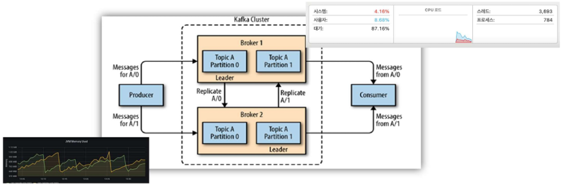
        - ex. 데이터 흐름에 병목 등이 생기면 디스크가 꽉 차거나 처리가 지연됨 -> 모니터링을 통해 사전 감지
        - ex. "consumer lag이 늘어나고 있다 -> 속도가 점점 느려진다"를 사전 감지
    - 장애 발생 감지
        - 시스템 이상 징후를 빠르게 파악하고 알림

            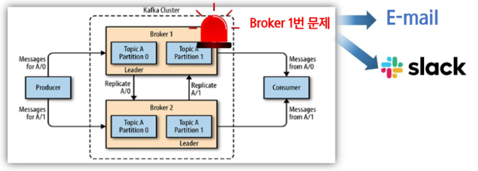
    - 성능 최적화
        - 메시지 지연시간, 메시지 처리율 등 직접적인 성능 문제 파악

            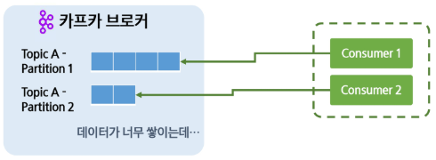
    - 문제 해결
        - 데이터들을 축적하고 분석하여 문제 해결책 도출

            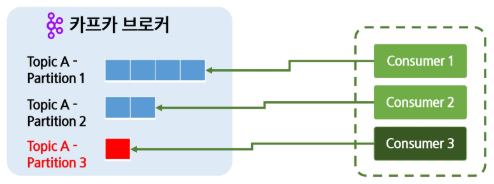

### Kafka 모니터링 주요 지표
- 프로듀서(Producer) 성능 지표
    - 초당 메시지 전송량 (Records send rate)  
        - 프로듀서가 초당 전송하는 메시지 개수 (=처리량)

            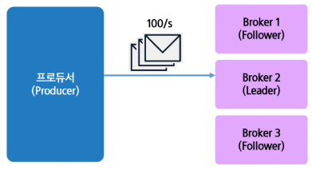
    - 요청 지연 시간 (Request Latency)  
        - 프로듀서가 브로커로 메시지를 전송할 때 걸리는 응답 시간

            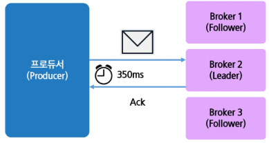
        - ex. 평균 지연 시간, 최대 지연 시간, 최소 지연 시간
        - 네트워크 이슈, 브로커가 과부화되어 다운됨, 병목현상 등의 문제가 생겼을 때 응답 시간을 통해 이상현상이 생겼음을 알 수 있음
    - 재전송 횟수 (Retries)  
        - 프로듀서가 메시지를 재전송하는 횟수

            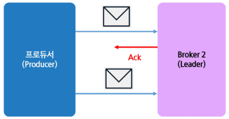
        - 재전송 횟수가 너무 많아지면(ex. 네트워크, 브로커 측 문제) 문제가 있다는 의미

    - 이상 징후 발생 원인과 대응 방향
        | 지표                                  | 이상 징후                                     | 의심할 수 있는 문제 / 원인                                                                  | 대응 방향                                                                      |
        | ----------------------------------- | ----------------------------------------- | --------------------------------------------------------------------------------- | -------------------------------------------------------------------------- |
        | **Records send rate (초당 전송 메시지 수)** | 갑자기 급감                                    | ‣ 브로커 장애 <br> ‣ 네트워크 단절 <br> ‣ 배압(Backpressure: 브로커가 처리를 거부/지연)                   | ‣ 브로커 상태 확인 (CPU/디스크/Network) <br> ‣ 네트워크 지연 확인 <br> ‣ 메시지 사이즈 및 배치 사이즈 조정 |
        | **Request Latency (전송 요청 지연 시간)**   | **평균(latency avg)이 증가** + **최대(max)가 급등** | ‣ 브로커 과부하 (특히 Disk I/O) <br> ‣ 네트워크 RTT 증가 <br> ‣ acks=all 설정으로 인한 지연 (ISR 확인 필요) | ‣ 브로커 리소스 모니터링 <br> ‣ 네트워크 체크 <br> ‣ acks / batch.size / linger.ms 튜닝      |
        | **Retries (재전송 횟수)**                | Retries 지속 증가                             | ‣ 브로커 응답 timeout <br> ‣ 메시지 사이즈가 너무 큼 <br> ‣ 브로커가 메시지를 받아줄 준비가 안됨                 | ‣ send.buffer.bytes, request.timeout.ms 조정 <br> ‣ 메시지 압축/분할 고려             |


- 컨슈머(Consumer) 성능 지표
    - 컨슈머 랙(Consumer Lag)
        - 브로커와 컨슈머의 offset 차이 (아직 못읽은 밀린 메시지 수)
        - 즉, 브로커에서 가져와야 할 메시지의 개수
        - Lag이 크다 -> Consumer가 브로커에 메시지가 쌓이는 수를 따라가지 못한다 -> Consumer 수가 부족한가? 파티션이 적은가? 한번에 가져오는 메시지 수가 부족한가? (fatch size) 등을 생각해볼 수 있음 

            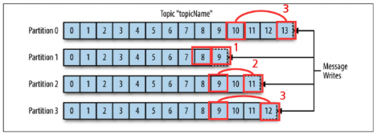
    - 메시지 처리량(Consumed Messages per second/Throughput)
        - 컨슈머가 초당 처리하는 메시지 개수

            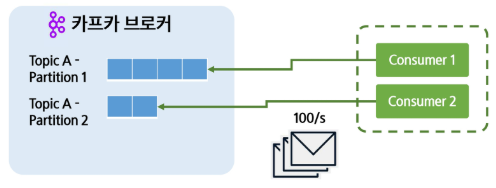
        - 즉, 얼마나 빠르게 처리하고 있는지를 나타내는 지표가 됨
        - ex. 네트워크 이슈, 리벨런싱으로 인한 일시 중단 등으로 메시지 처리량에 영향이 있을 수 있음
        - ex. 만약 컨슈머 랙은 늘고, 메시지 처리량이 줄었다면 컨슈머에 문제가 있는게 맞음!! but, 컨슈머 랙은 그대론데 메시지 처리량만 줄었다면 '네트워크 이슈 또는 데이터가 적게 들어오는' 이유일 수 있음
    - 메시지 지연 시간 (Fetch Latency)
        - 컨슈머가 메시지를 가져오는 데 걸리는 시간

            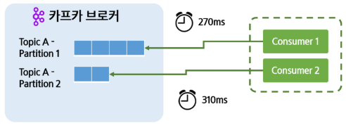
        - 즉, 메시지 1건 가져오는 데 걸리는 시간
        - ex. 만약 평소 가져오던 시간보다 크게 늘어나면 '네트워크 이슈, 브로커 부하 큼, 디스크I/O 이슈?, Fetch size 또는 Fetch max byte가 너무 큼'의 원인이 있을 수 있음
    - 커밋 빈도 (Commit Rate)
        - 컨슈머가 오프셋을 얼마나 자주 커밋하는지 
        - 커밋을 너무 자주하면, 안전하지만 오버헤드 발생 & 성능 떨어짐
        - 커밋 너무 안하면, 중복처리 및 데이터 손실 가능성 있음

    - 이상 징후 발생 원인과 대응 방향
        | 지표                                    | 이상 징후                  | 의심할 수 있는 문제 / 원인                                                                                    | 대응 방향                                                                             |
        | ------------------------------------- | ---------------------- | --------------------------------------------------------------------------------------------------- | --------------------------------------------------------------------------------- |
        | **Consumer Lag (오프셋 차이)**             | **Lag 지속 증가 + 처리량 감소** | ‣ Consumer 처리 성능 부족 (CPU, 메모리, I/O) <br> ‣ 파티션 수에 비해 컨슈머 수 부족 <br> ‣ 메시지 처리 자체가 오래 걸림 (DB insert 등) | ‣ 컨슈머 스케일 아웃 <br> ‣ 파티션 개수 증가 <br> ‣ 비동기 처리/Batch 처리                              |
        |                                       | **Lag는 그대로인데 처리량 감소**  | ✅ **데이터가 실제로 적게 들어오는 상황** <br> (Producer 측 이슈)                                                      | ‣ Producer throughput 확인                                                          |
        | **Consumed msgs per second (처리량)**    | 처리량이 튐 / 불안정           | ‣ Consumer group rebalance 발생 중 <br> ‣ Poll 간격이 너무 길어 Session timeout 발생                            | ‣ max.poll.records / max.poll.interval.ms 조정 <br> ‣ Rebalancing 원인 파악 (파티션 불균형 등) |
        | **Fetch Latency (메시지 가져오는 데 걸리는 시간)** | Fetch latency 급증       | ‣ 브로커 부하 (디스크 읽기 느림) <br> ‣ batch / fetch size 너무 큼 <br> ‣ 네트워크 패킷 손실                               | ‣ 브로커 I/O 확인 <br> ‣ fetch.max.bytes, max.partition.fetch.bytes 조정                 |
        | **Commit Rate (오프셋 커밋 비율)**           | Commit Rate 비정상적으로 높음  | ✅ commit 을 너무 자주함 → 성능 저하                                                                           | ‣ commit interval 증가                                                              |
        |                                       | Commit Rate 비정상적으로 낮음  | ✅ commit 을 너무 안함 → 중복처리 risk                                                                        | ‣ auto commit 조정 or offset manual commit 로직 개선                                    |

- 브로커(Broker) 성능 지표
    - 초당 처리량 (Throughput, MB/s)
        - Kafka 브로커가 초당 처리하는 데이터의 양

            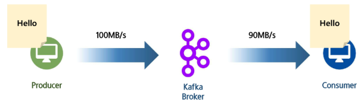
        - ex. 프로듀서가 100MB/s로 데이터 전송하고, 브로커가 90MB/s로 데이터를 전송한다면 카프카에서 100% 성능으로 처리하지 못하고 있는 것
        - 즉, 카프카의 전체적인 성능을 볼 수 있는 지표가 됨
    - 리소스 사용량 (CPU, Memory, Disk, Network Usage)
        - 브로커 노드의 CPU, 메모리, 디스크, 네트워크 사용률

            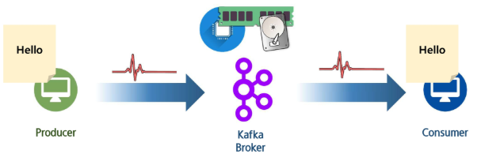
        - 브로커는 파티션 저장, 복제, 커밋 등을 동시에 수행하므로 프로듀서/컨슈머보다 더 많은 리소스를 사용함
        - 때문에 모니터링도 리소스적으로 확인할 부분이 多
    - 요청 처리 시간 (Request Time)
        - Request가 브로커에서 처리되는 시간  

            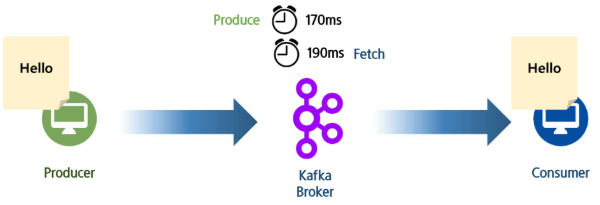

    - 이상 징후 발생 원인과 대응 방향
        | 지표                                    | 이상 징후                                          | 의심할 수 있는 문제 / 원인                                 | 대응 방향                                    |
        | ------------------------------------- | ---------------------------------------------- | ------------------------------------------------ | ---------------------------------------- |
        | **Throughput (MB/s)**                 | Producer throughput은 높은데 Broker throughput은 낮음 | ‣ Kafka 성능 Low 수준 <br> ‣ Disk write 병목 (HDD 사용?) | ‣ SSD/NVMe 적용 <br> ‣ 브로커 늘리기 (Scale-out) |
        | **리소스 사용량 (CPU/Memory/Disk/Network)** | Memory 사용률 비정상 ↑                               | ✅ Page cache 부족 → 디스크 I/O 증가                     | ‣ Heap tuning, retention 관리              |
        |                                       | Network usage 100% 근접                          | ✅ NIC 대역폭 포화                                     | ‣ NIC 업그레이드 또는 브로커 수 증가                  |
        | **Request Time (요청 처리 시간)**           | Request Time 증가                                | ‣ Zookeeper 또는 Controller 리더 장애로 인한 메타데이터 지연     | ‣ Controller 선출 로그 확인 / ZK health 체크     |


- 파티션(Partition) 성능 지표
    - 레플리케이션 간 랙 (Partition Replication Lag)
        - 팔로워와 리더 간 동기화 정도, ISR 관리 척도

            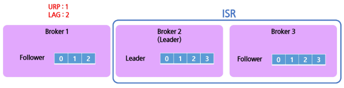
        - ISR에 포함되지 않는 Replica를 URP (Under replicated partition)라고 함
        - URP가 있다는 것은 정상적으로 복제가 되고 있지 않다는 의미 -> 안정성에 위협이 될 수 있는 상태
    - 파티션 균등분포 (Topic Partition Distribution)
        - 특정 토픽의 브로커 간 파티션 분포 상태

            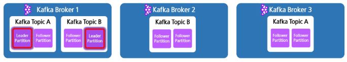
        - ex. 브로커1에만 리더 파티션이 몰리면, 이 브로커는 과부하 상태가 됨 -> 전체적으로 처리 속도나 안정성에 영향이 감
    - 리더 수 (Leader Count)
        - 브로커가 담당하는 리더의 수

            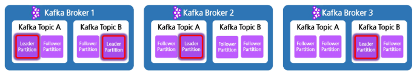
    
    - 이상 징후 발생 원인과 대응 방향
        | 지표                                      | 이상 징후                       | 의심할 수 있는 문제 / 원인                                                  | 대응 방향                                   |
        | --------------------------------------- | --------------------------- | ----------------------------------------------------------------- | --------------------------------------- |
        | **Partition Replication Lag**           | Replication lag 증가 + URP 발생 | ‣ Follower replica 디스크 I/O 느림 <br> ‣ 네트워크 대역폭 부족 <br> ‣ ISR 축소 발생 | ‣ ISR 모니터링 <br> ‣ follower 성능 체크        |
        | **Topic Partition Distribution (균등분포)** | 특정 브로커에 리더 몰림               | ✅ 리더 부하 집중 → 브로커 과부하                                              | ‣ `kafka-preferred-replica-election` 수행 |
        | **Leader Count**                        | 리더 수 편차 심함                  | ✅ 특정 브로커만 리더 역할 수행하는 구조로 배치됨                                      | ‣ 리더 재분배 수행                             |


## Kafka 모니터링 툴
### Kafka의 모니터링 방법
- 기본 스크립트
    - `--describe`, `--list` 같은 옵션을 통해 기본적인 정보를 얻을 수 있음  
- JMX(Java Management eXtention)
    - 자바에서 제공하는 모니터링 표준 인터페이스, Kafka도 있음  
- 외부 모니터링 툴
    - 다양한 기능과 편리한 시각화, JMX의 데이터를 활용하는 경우도 있음  

### Kafka Burrow
LinkedIn에서 제작한 모니터링 도구  
- 컨슈머 랙의 정보를 집중적으로 제공하는 전문 모니터링 도구  

    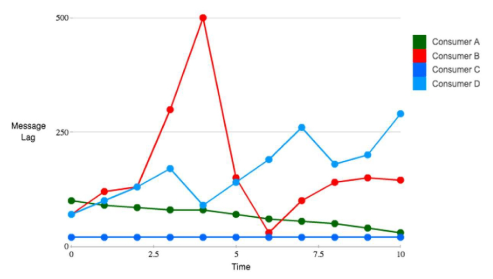

### Confluent Control Center
Kafka를 관리하는 Confluent에서 직접 제공한 모니터링 도구  
- Kafka를 직접 관리 조작도 가능하며 JMX와 연동해서 작동됨  
- 유료 버전을 써야 온전히 기능을 사용할 수 있음 
    
    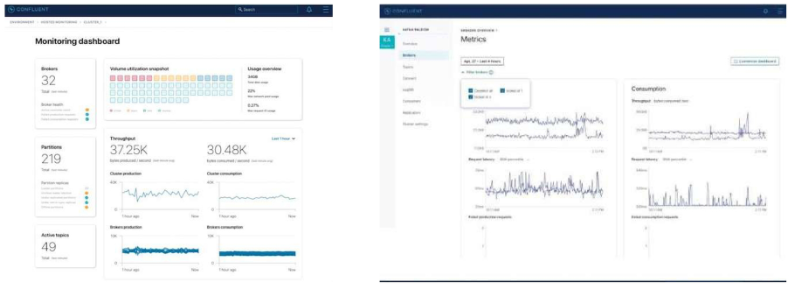

### Datadog
클라우드 기반 환경에 최적화된 모니터링 도구  
- 시각화와 모니터링 범위가 넓고 장애 감지 및 알림 기능이 잘 되어 있음  
- 유료이며 SaaS 플랫폼에서 분석하기 때문에 데이터 반출 문제가 있음 

    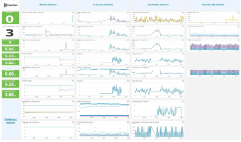

### Prometheus + Grafana
- Prometheus
    - 시계열(Time-series) 데이터를 수집하고 저장하는 모니터링용 데이터베이스
    - Kafka, JMX Exporter, Kafka Exporter 등으로부터 Pull 방식(주기적으로 스크랩) 으로 메트릭 데이터를 가져옴
    - 설정된 시간 간격으로 **데이터를 자동 갱신**하여 최신 상태의 모니터링이 가능함

        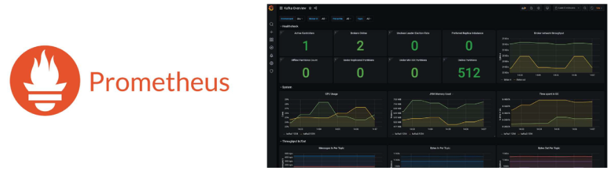
- Grafana
    - Prometheus에 저장된 시계열 데이터를 시각화(차트, 대시보드)하는 도구

        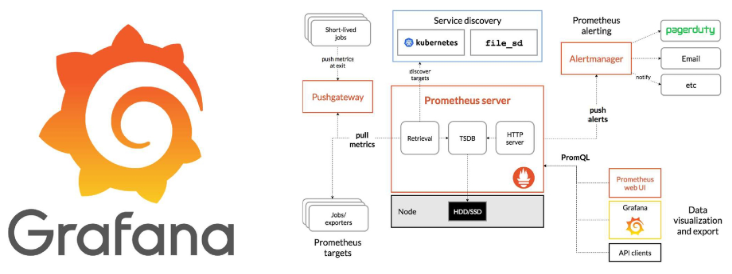

- Kafka -> JMX Exporter -> **Prometheus -> Grafana**

    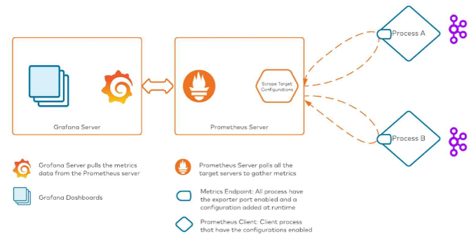
    - 무료지만 유연하게 기능 추가가 가능함, JMX나 Kafka Exporter 같은 데이터 소스가 필요함

- Prometheus 동작 흐름
    
    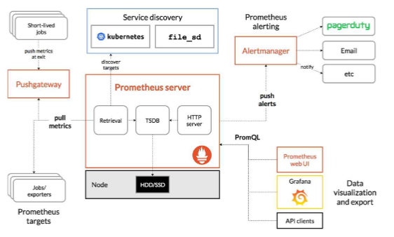
    1. Prometheus targets (Exporter / Application / Kafka / JMX 등)
        - Prometheus가 메트릭을 수집할 대상들
        - Prometheus는 일반적으로 Pull 방식으로 대상에게 HTTP 요청하여 데이터를 가져옴
    
    2. Pushgateway (예외적으로 Push 방식 사용)
        - 일시적으로 실행되는 작업(Short-lived batch job) 은 Prometheus가 pull 하기 어려움 (ex. 배치 실행 후 바로 종료되는 스크립트)
        - 이런 경우 Pushgateway가 대신 데이터를 받아 저장, Prometheus는 Pushgateway에서 pull
        - 즉, "예외적인 push 데이터 수집을 위한 중간 저장소"

    3. Service Discovery
        - Kubernetes, file_sd, Consul 등을 활용해서 Prometheus가 자동으로 대상(target)을 검색하도록 함
        - 운영 환경(특히 Kubernetes)에서 Pod이 동적으로 생성/삭제되는 상황에서 필요
        - Kafka처럼 스케일링이 발생하는 환경에서 매우 중요함

    4. Prometheus Server (핵심)
        - 구성 요소:
            | 컴포넌트                  | 역할                     |
            | --------------------- | ---------------------- |
            | Retrieval             | Target에서 메트릭 수집 (pull) |
            | TSDB (Time Series DB) | 시계열 데이터 저장             |
            | HTTP server           | 메트릭을 조회할 수 있도록 API 제공  |
        - PromQL을 통해 저장된 시계열 데이터를 조회할 수 있음

    5. Alertmanager
        - Prometheus에서 정의한 Alert rule(예: Lag > 10,000) 조건이 만족되면 Alertmanager로 이벤트 전달
        - Alertmanager가 Slack, Email, PagerDuty 등으로 알림 전송
        - “Prometheus는 감지, Alertmanager는 통보”

    6. Grafana / Prometheus Web UI
        - PromQL로 데이터를 시각화하는 역할
        - Prometheus의 웹 UI도 차트를 볼 수 있지만 Grafana는 훨씬 강력하고 대시보드 구성에 적합
        - “Prometheus는 데이터 수집과 저장, Grafana는 보여주는 역할”


## Kafka 모니터링 환경 구성
### Kafka 기본 스크립트
- 카프카의 스크립트들은 `--list`, `--describe` 옵션을 통해 기본적인 정보들을 제공함  
- `.../kafka/logs/...`처럼 카프카가 설치된 폴더 안에 로그들이 저장되어 있음

```bash
$ ./kafka-topics.sh --list --bootstrap-server localhost:9092
$ ./kafka-topics.sh --describe --topic test-topic --bootstrap-server localhost:9092
```
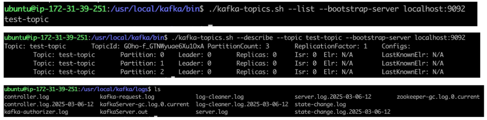

### Kafka JMX 사용하기
`data_engineering\03_Kafka\monitoring\kafka_monitoring_setup.md` 참고

- Kafka JMX 설치하기
    - JMX는 추가적인 설치가 필요 없이 바로 사용 가능  
    - 하지만 비활성화되어 있는 포트를 활성화해야 함  
        ```bash
        export KAFKA_OPTS="-Dcom.sun.management.jmxremote \
        -Dcom.sun.management.jmxremote.authenticate=false \
        -Dcom.sun.management.jmxremote.ssl=false \
        -Dcom.sun.management.jmxremote.port=9999 \
        -Dcom.sun.management.jmxremote.rmi.port=9999 \
        -Djava.rmi.server.hostname=localhost"
        ```

- Kafka JMXTerm 설치하기
    - **JMXTerm**: JMX의 데이터를 CLI를 통해 접근하게 해주는 모니터링 툴  
    - 별도의 설치 및 실행이 필요
        ```bash
        wget https://github.com/jiaqi/jmxterm/releases/download/v1.0.2/jmxterm-1.0.2-uber.jar -O jmxterm.jar
        ```
        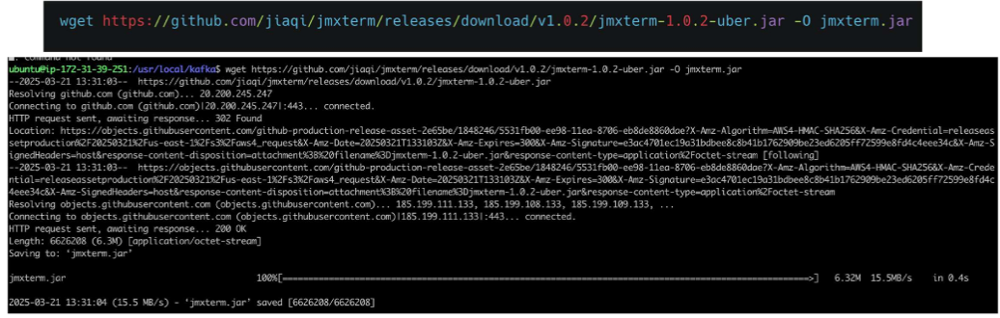

        ```bash
        java -jar jmxterm.jar -l localhost:9999
        ```
        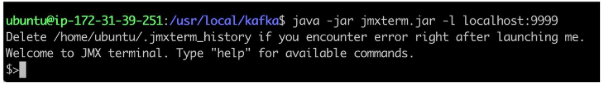

- Kafka JMXTerm 사용해보기
    - **bean** : 확인하고 싶은 MBean(로직)을 등록, 예시에서는 JVM 메모리 확인  
    - **get** : MBean에서 원하는 값을 출력 (예: Heap 메모리 사용량)

        ```bash
        $> bean java.lang:type=Memory
        $> get HeapMemoryUsage
        HeapMemoryUsage = {
        committed = 268435456;
        init = 268435456;
        max = 268435456;
        used = 160432144;
        };
        ```
        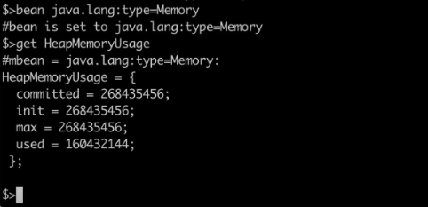

### Kafka Grafana + Prometheus
- Kafka Prometheus 설치하기
    - Prometheus 설치 후 압축 풀고 실행하기  

        ```bash
        wget https://github.com/prometheus/prometheus/releases/download/v2.47.2/prometheus-2.47.2.linux-amd64.tar.gz    # 다운
        tar -xvzf prometheus-2.47.2.linux-amd64.tar.gz  # 압축 해제
        cd prometheus-2.47.2.linux-amd64    # 위치 이동
        ./prometheus --config.file=prometheus.yml   # 프로메테우스 실행
        ```
        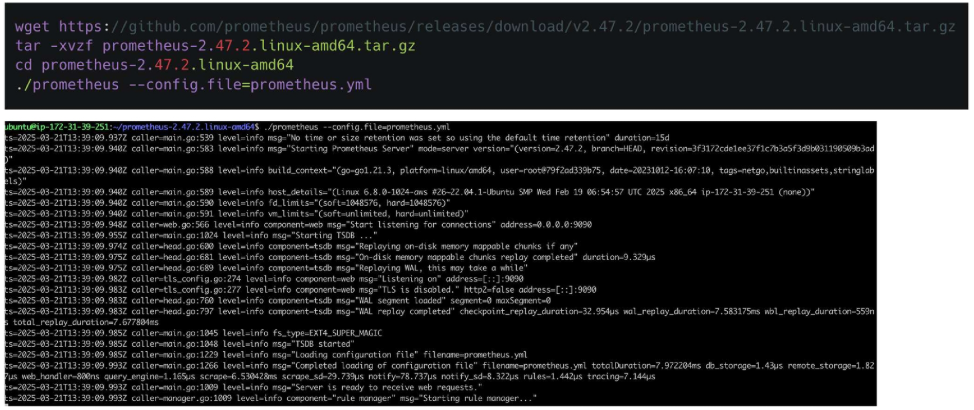

- Kafka JMX Prometheus 연동하기
    - **JMX Exporter**: JMX 데이터를 Prometheus가 읽기 쉽게 변환  
    - HTTP 형태로 읽을 수 있게 변환해줌

        ```bash
        wget https://repo1.maven.org/maven2/io/prometheus/jmx/jmx_prometheus_javaagent/0.17.2/jmx_prometheus_javaagent-0.17.2.jar
        ```
        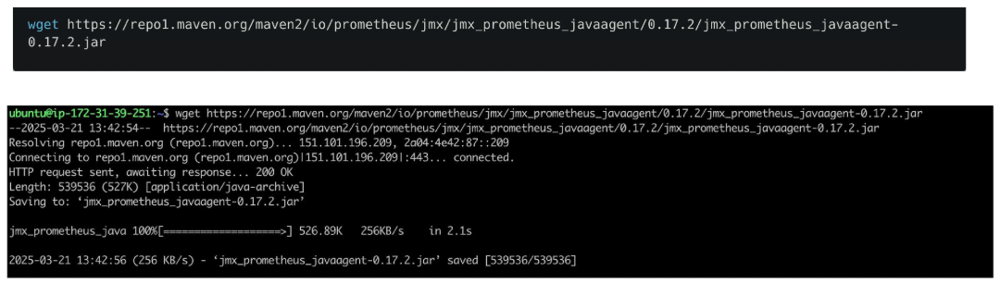

        ```bash
        vi config.yaml
        cat config.yaml
        lowercaseOutputName: true
        rules:
            - pattern: ".*"
        ```

    - 아래 내용은 꼭 처음 JMX Exporter를 다운로드 받은 폴더에서 실행
        ```bash
        export KAFKA_OPTS="-javaagent:$(pwd)/jmx_prometheus_javaagent-0.17.2.jar=9094:$(pwd)/config.yaml"
        ```
        - 이후 카프카 재시작

    - 프로메테우스 폴더 안에 `prometheus.yml`을 아래처럼 수정하고 프로메테우스 재시작
        - Local 설치 환경
            ```yaml
            scrape_configs:
            
            # Prometheus 자체 모니터링 (Prometheus 서버 메트릭 수집)
            - job_name: "prometheus"
                static_configs:
                - targets: ["localhost:9090"]   # Prometheus 서버가 실행되는 주소
            
            # Kafka 브로커 모니터링
            - job_name: "kafka"
                static_configs:
                - targets: ["localhost:9094"]   # Kafka 브로커의 JMX 포트 (JMX Exporter 연결)
            
            # Kafka Exporter 모니터링 (Kafka 라그, 컨슈머 상태 등 Kafka 메트릭 수집)
            - job_name: "kafka-exporter"
                static_configs:
                - targets: ["localhost:9308"]   # Kafka Exporter 컨테이너 또는 서비스 포트
            ```
        
        - Docker 기반으로 돌리는 경우 설정 (Docker 환경)
            ```yaml
            scrape_configs:

              # Prometheus 자체 모니터링
            - job_name: "prometheus"
                static_configs:
                - targets: ["prometheus:9090"]  # docker-compose 이름(prometheus) 기준으로 접근

            # Kafka 브로커 모니터링
            - job_name: "kafka"
                static_configs:
                - targets: ["kafka:9094"]   # Kafka 컨테이너 이름 및 JMX 포트
            - job_name: "kafka-exporter"
                static_configs:
                - targets: ["kafka-exporter:9308"]  # Kafka Exporter 컨테이너 이름 및 포트
            ```

- Kafka Grafana 설치하기
    - Grafana 파일 다운로드 후 압축 풀고 실행  

        ```bash
        wget https://dl.grafana.com/oss/release/grafana-10.2.2.linux-amd64.tar.gz  
        tar -xvzf grafana-10.2.2.linux-amd64.tar.gz  
        cd grafana-10.2.2  
        ./bin/grafana-server  
        ```
        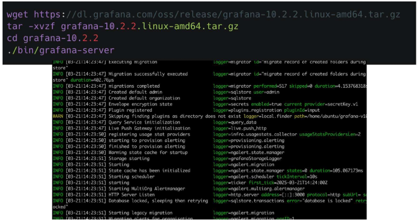

### Kafka 모니터링 환경 Docker compose로 구축도 가능
설치 및 실행 과정 전반을 도커 컴포즈로 가능  

```yaml
services:
  # Zookeeper (Kafka 클러스터 관리용)
  zookeeper:
    container_name: zookeeper
    image: confluentinc/cp-zookeeper:7.5.0
    environment:
      ZOOKEEPER_CLIENT_PORT: 2181   # Zookeeper 서비스 포트
      ZOOKEEPER_TICK_TIME: 2000
    ports:
      - "2181:2181"                 # 외부에서 접속 가능하도록 포트 매핑

  # Kafka Broker
  kafka:
    container_name: kafka
    image: confluentinc/cp-kafka:7.5.0
    ports:
      - "9092:9092"     # Kafka 접속 포트 (Producer/Consumer 사용)
      - "9094:9094"     # JMX Exporter를 통한 메트릭 수집 포트
    environment:
      KAFKA_BROKER_ID: 1    # 브로커 번호 (클러스터 구성 시 고유 ID)
      KAFKA_ZOOKEEPER_CONNECT: zookeeper:2181
      KAFKA_LISTENER_SECURITY_PROTOCOL_MAP: PLAINTEXT:PLAINTEXT
      KAFKA_ADVERTISED_LISTENERS: PLAINTEXT://localhost:9092
      KAFKA_LISTENERS: PLAINTEXT://0.0.0.0:9092
      KAFKA_OFFSETS_TOPIC_REPLICATION_FACTOR: 1
      # Kafka 내부에 JMX Exporter 를 Java agent로 장착하여 메트릭을 노출
      KAFKA_OPTS: >
        -javaagent:/jmx_exporter/jmx_prometheus_javaagent-0.17.2.jar=9094:/jmx_exporter/config.yaml
    volumes:
      - ./jmx_exporter:/jmx_exporter    # 로컬 jmx exporter 설정 경로
    depends_on:
      - zookeeper   # Zookeeper 실행 후 Kafka 실행

# Kafka Exporter (Consumer Lag 등 Kafka-specific 메트릭 수집)
kafka-exporter:
  container_name: kafka-exporter
  image: danielqsj/kafka-exporter
  ports:
    - "9308:9308"   # Prometheus에서 수집할 exporter port
  entrypoint: /bin/sh
  command: ["-c", "sleep 20 && /bin/kafka_exporter --kafka.server=kafka:9092"]
  # Kafka가 완전히 시작된 뒤에 exporter 실행하도록 delayed start
  depends_on:
    - kafka
  restart: always

# Prometheus (메트릭 수집 및 시계열 저장 DB)
prometheus:
  container_name: prometheus
  image: prom/prometheus
  ports:
    - "9090:9090"    # Prometheus Dashboard 포트
  volumes:
    - ./prometheus.yml:/etc/prometheus/prometheus.yml   # 스크랩 설정 매핑

# Grafana (Prometheus 데이터를 시각화)
grafana:
  container_name: grafana
  image: grafana/grafana
  ports:
    - "3000:3000"   # Grafana 접속 포트 (웹 UI)
```
| 서비스                | 역할                                     |
| ------------------ | -------------------------------------- |
| **Zookeeper**      | Kafka 클러스터 메타데이터 관리 (브로커 등록 / 파티션 관리)  |
| **Kafka**          | 메시지 브로커 시스템 (프로듀서 → 토픽 → 컨슈머)          |
| **Kafka Exporter** | Consumer lag, 파티션 상태 등 Kafka metric 제공 |
| **Prometheus**     | Exporter에서 메트릭을 Pull하여 저장 & 알림 트리거     |
| **Grafana**        | Prometheus 데이터를 대시보드로 시각화              |


### Kafka JMX 및 kafka의 Prometheus 접속하기
- 정상적으로 설치 동작 되었다면 http://localhost:9090 접속  
- 쿼리에 up을 입력하고 보면 아래와 같은 내용이 출력  

    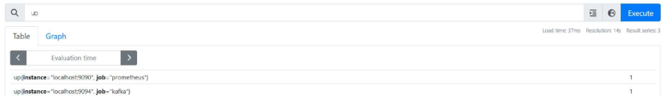
    ```
    up(instance="localhost:9090", job="prometheus")
    up(instance="localhost:9094", job="kafka")
    ```

- 세부적인 내용 파악

    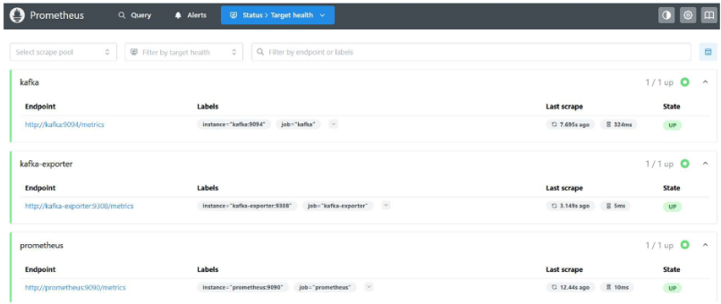

### Kafka Grafana에 Prometheus 연동하기
- 정상 세팅 시 [http://localhost:3000](http://localhost:3000) 으로 접속하면 아래와 같은 화면이 뜸  
- 기본 계정(admin/admin)

    

- Datasource 추가 선택

    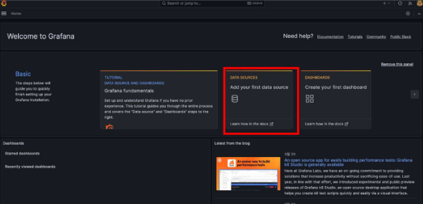

- Datasource 중 Prometheus 선택 

    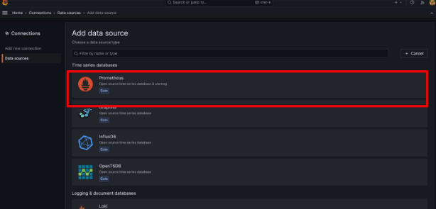

- 로컬로 활용한 경우, http://localhost:9090 을 입력하고 "Save & Test" 클릭  
- 도커 컴포즈를 활용한 경우, http://prometheus:9090 을 입력 

    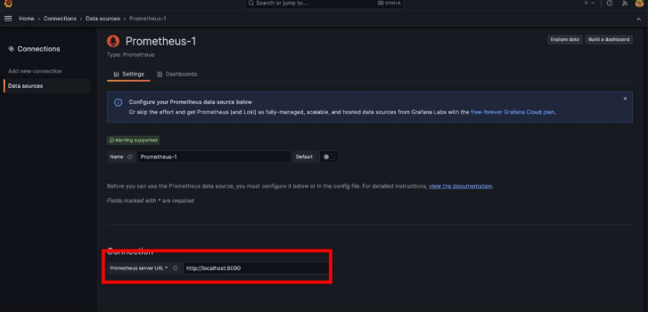

### Kafka Grafana + Prometheus 기본 사용법
- Datasource에서 Prometheus 선택 후 Metric 선택하고 run query로 확인하고 Apply  

    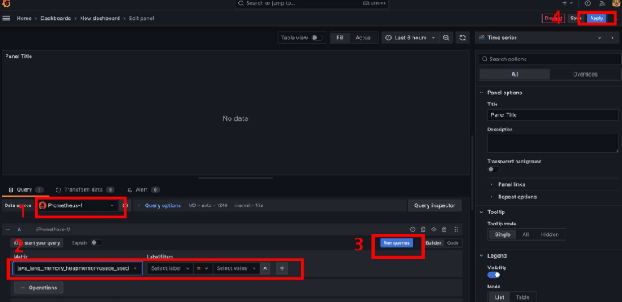

- 정상적으로 추가된 것 확인  

    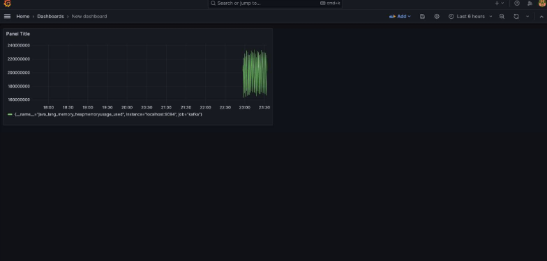

### 예시
- Grafana 사이트에서 기본적으로 모니터링할 수 있는 템플릿을 제공
    - https://grafana.com/grafana/dashboards/721-kafka/  

    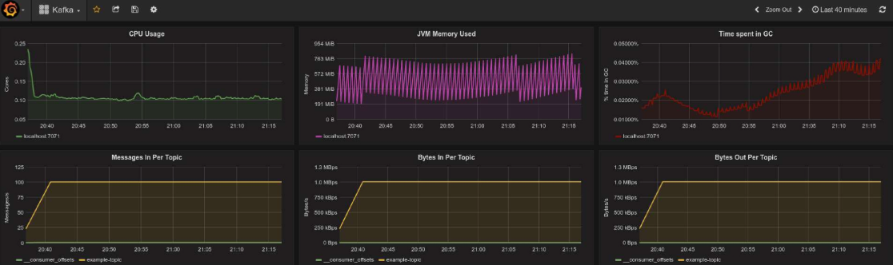

- Import

    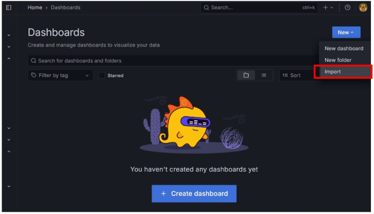
    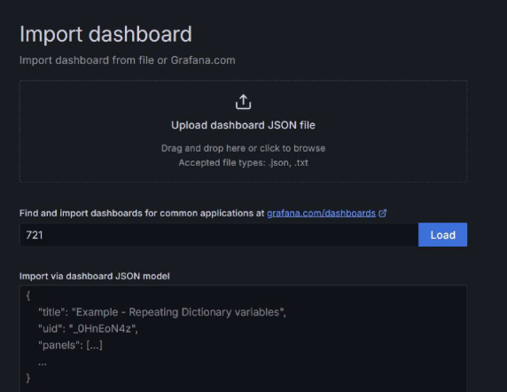
