📌 목차 (Table of Contents)
---
- [Kafka 기초 개념 및 세팅](#kafka-기초-개념-및-세팅)
  - [실습1](#basic-ex-1)
  - [실습2](#basic-ex-2)
  - [실습3](#basic-ex-3)
  - [실습4](#basic-ex-4)
  - [실습5](#basic-ex-5)
  - [과제1](#basic-hw-1)
  - [과제2](#basic-hw-2)

- [Kafka의 프로듀서와 컨슈머](#kafka의-프로듀서와-컨슈머)
  - [실습1](#producer-ex-1)
  - [실습2](#producer-ex-2)
  - [실습3](#producer-ex-3)
  - [실습4](#producer-ex-4)
  - [실습5](#producer-ex-5)
  - [과제1](#producer-hw-1)
  - [과제2](#producer-hw-2)


# Kafka 기초 개념 및 세팅
## 실습1 <a id="basic-ex-1"></a>
### 학습목표
Java를 설치하고 환경 변수를 설정한 뒤, Zookeeper를 설치·실행하고, Kafka를 다운로드·설치한 후 실행 테스트를 진행

### Step1: Java 설치 및 환경 변수 설정
- Java 17이 설치되어 있어야 합니다.
```bash
sudo apt update                     # 패키지 업데이트
sudo apt install openjdk-17-jdk     # Java 17 설치
```
- `java -version` 명령어를 실행하여 설치를 확인합니다.
```bash
java -version
# 정상 출력 예시:
# openjdk version "17.x.x"
```
- Java가 설치되지 않았다면, OpenJDK를 다운로드하고 설치합니다.

- Java 경로 설정 (환경 변수 등록)
```bash
# `JAVA_HOME`을 설정하면 Kafka 실행 시 Java 경로를 명확히 인식할 수 있습니다.
# `/bin/java`를 제외한 경로를 `JAVA_HOME`으로 설정합니다.
echo 'export JAVA_HOME=/usr/lib/jvm/java-17-openjdk-amd64' >> ~/.bashrc
echo 'export PATH=$JAVA_HOME/bin:$PATH' >> ~/.bashrc
source ~/.bashrc

# 환경 변수 설정 확인:
echo $JAVA_HOME

# 정상 출력 예시:
/usr/lib/jvm/java-17-openjdk-amd64
```

### Step2: Kafka 다운로드 및 설치
- 공식 Apache Kafka 사이트에서 Kafka를 다운로드합니다.
```bash
# 다운로드
wget https://dlcdn.apache.org/kafka/3.9.0/kafka_2.12-3.9.0.tgz 

# 압축해제
tar -xvzf kafka_2.12-3.9.0.tgz

# Kafka 폴더 이동
sudo mv kafka_2.12-3.9.0 /home/my/kafka
```
- 압축을 해제하고 `config/server.properties` 파일을 확인하여 설정을 조정합니다.

### Step3: Zookeeper 설치 및 실행
- Kafka에는 기본적으로 Zookeeper가 포함되어 있습니다.
- `config/zookeeper.properties` 파일을 수정하여 Zookeeper 설정을 확인합니다.
- 아래의 명령어로 Zookeeper를 실행합니다.
```bash
# Zookeeper 실행
cd /home/my/kafka
./bin/zookeeper-server-start.sh config/zookeeper.properties

# 정상 로그 예시:
binding to port 0.0.0.0/0.0.0.0:2181
```

### Step4: Kafka 실행 테스트
- Zookeeper가 실행 중인 상태에서 다음 명령어를 실행하여 Kafka 브로커를 실행합니다.
- 새로운 터미널을 열어 Kafka 브로커를 실행합니다.
```bash
cd /home/my/kafka
./bin/kafka-server-start.sh config/server.properties

# 정상 로그 예시:
started (kafka.server.KafkaServer)
```

## 실습2 <a id="basic-ex-2"></a>
### 학습목표
Kafka 브로커를 실행하고 상태를 확인한 뒤, 기본적인 Kafka 명령어(토픽 목록 및 브로커 정보 확인 등)를 실행하고 브로커를 종료합니다.

### Step1: Kafka 브로커 실행
- Zookeeper가 실행 중인지 확인합니다
```bash
ps -ef | grep zookeeper
```
- Kafka 브로커를 백그라운드에서 실행합니다
    - &를 사용하여 백그라운드 실행
    - 표준 출력 및 오류를 logs/kafka.log 파일에 저장
```bash
bin/kafka-server-start.sh config/server.properties > logs/kafka.log 2>&1 &
```
- 실행된 Kafka 프로세스를 확인하려면
```bash
ps -ef | grep kafka
```

### Step2: Kafka 상태 확인
- Kafka가 정상 실행 중인지 확인하기 위해 다음 명령어를 실행합니다
```bash
bin/kafka-broker-api-versions.sh --bootstrap-server localhost:9092
```
- 이 명령어는 현재 실행 중인 브로커의 API 버전을 출력합니다.

### Step3: Kafka 기본 명령어 실행
- 토픽 목록 확인
```bash
bin/kafka-topics.sh --list --bootstrap-server localhost:9092
```
- 생성된 토픽이 없으면 출력이 비어 있습니다. 이는 정상적인 동작이며, 이후 실습에서 토픽을 생성할 것입니다.

- 브로커 정보 확인
```bash
bin/kafka-topics.sh --describe --topic test-topic --bootstrap-server localhost:9092
```
- 이후 실습에서 test-topic을 직접 생성할 것이므로 현재는 오류가 발생할 수 있습니다.

### Step4: Kafka 브로커를 종료하고 로그를 확인
- Kafka 브로커를 종료하는 방법
```bash
bin/kafka-server-stop.sh
```
- `bin/kafka-server-stop.sh`를 실행하면 안전하게 브로커가 종료됩니다.
- 실행 로그를 확인하는 방법:
```bash
cat logs/kafka.log | tail -n 50
```
- `logs/kafka.log` 파일에서 마지막 50줄을 확인하여 실행 상태를 점검할 수 있습니다.

## 실습3 <a id="basic-ex-3"></a>
### 학습목표
토픽 생성, 설정, 삭제

### Step1: 새로운 토픽을 생성하세요.
- 다음 명령어를 사용하여 test-topic이라는 이름의 토픽을 생성합니다.
```bash
bin/kafka-topics.sh --create --topic test-topic --bootstrap-server localhost:9092 --partitions 3 --replication-factor 1
```
- `--partitions 3`: 해당 토픽을 3개의 파티션으로 생성
- `--replication-factor 1`: 복제본을 하나만 유지

### Step2: 생성된 토픽의 상세 정보를 확인하세요.
- 생성된 토픽의 설정 및 상태를 확인합니다.
```bash
bin/kafka-topics.sh --describe –topic test-topic --bootstrap-server localhost:9092
```
- 토픽의 파티션 개수, 복제본 정보, 로그 크기 등을 출력

    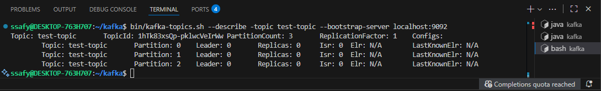

### Step3: 토픽 설정을 변경하세요.
- 특정 토픽의 설정 값을 변경할 수 있습니다. 
- 예를 들어, 메시지 보존 기간을 변경하려면:
```bash
bin/kafka-configs.sh --alter --topic test-topic --bootstrap-server localhost:9092 --add-config retention.ms=600000
```
- `retention.ms=600000`: 메시지를 10분 동안 유지 (600,000 밀리초)

### Step4: 토픽을 삭제하세요.
- 불필요한 토픽을 삭제하려면 다음 명령어를 실행합니다.
```bash
bin/kafka-topics.sh --delete --topic test-topic --bootstrap-server localhost:9092
```

**※ 주의**: 기본적으로 Kafka는 토픽 삭제가 비활성화되어 있을 수 있으므로, server.properties 파일에서 `delete.topic.enable=true` 설정을 확인해야 합니다.


## 실습4 <a id="basic-ex-4"></a>
### 학습목표
Kafka 토픽을 생성하고, 프로듀서를 실행해 메시지를 전송한 뒤, 컨슈머를 실행하여 메시지를 수신하고 메시지 송수신 테스트를 수행합니다.

### Step1: Kafka 토픽 생성
- 이전 실습에서 토픽이 삭제되었으므로 새롭게 new-topic을 생성합니다.
```bash
bin/kafka-topics.sh --create --topic new-topic --bootstrap-server localhost:9092 --partitions 1 --replication-factor 1
```
- `--partitions 1`: 1개의 파티션을 가진 토픽을 생성합니다.
- `--replication-factor 1`: 복제본을 하나만 유지합니다.

- 생성된 토픽을 확인
```bash
bin/kafka-topics.sh --list --bootstrap-server localhost:9092
```


### Step2: Kafka 프로듀서를 실행하여 메시지 전송
- Kafka 프로듀서를 실행하여 new-topic에 메시지를 보냅니다.
```bash
bin/kafka-console-producer.sh --topic new-topic --bootstrap-server localhost:9092
```
- 실행 후 메시지를 입력하면 new-topic으로 전송됩니다. 
- 예를 들어:
```bash
Hello Kafka!
This is a test message.
```
- 입력한 메시지는 Kafka 브로커를 통해 new-topic에 저장됩니다.

### Step3: Kafka 컨슈머를 실행하여 메시지 수신
- Kafka 컨슈머를 실행하여 new-topic의 메시지를 읽습니다.
```bash
bin/kafka-console-consumer.sh --topic new-topic --from-beginning --bootstrap-server localhost:9092
```
- `--from-beginning` 옵션을 사용하면 해당 토픽의 모든 메시지를 처음부터 읽을 수 있습니다.
- 컨슈머 실행 후 프로듀서에서 보낸 메시지가 출력되는지 확인합니다.

    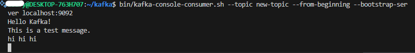

### Step4: 메시지 송수신 테스트 수행하세요.
- 프로듀서에서 추가적으로 메시지를 입력하고, 컨슈머에서 해당 메시지가 정상적으로 출력되는지 확인합니다.
- 컨슈머 실행 창에서 추가로 입력한 메시지가 출력되어야 합니다.
- 컨슈머가 메시지를 정상적으로 받지 못하면 Kafka 브로커가 실행 중인지 확인해야 합니다.


## 실습5 <a id="basic-ex-5"></a>
### 학습목표
세 개의 Kafka 브로커를 실행하고, replication-factor 3이 적용된 토픽을 생성하여 상태를 확인한 뒤, 메시지 송수신 테스트를 수행하고 한 브로커를 중단한 후 데이터 복구를 확인합니다

### Step1: 세 개의 Kafka 브로커 실행
- 브로커 설정 파일 생성 및 수정
- 기존 server.properties 파일을 복사하여 추가 브로커 설정 파일을 생성합니다.
```bash
cp config/server.properties config/server-1.properties
cp config/server.properties config/server-2.properties
```
- 각 설정 파일을 수정합니다.
```properties
# config/server-1.properties
broker.id=1
listeners=PLAINTEXT://localhost:9093
log.dirs=/tmp/kafka-logs-1
```
```properties
# config/server-2.properties○
broker.id=2
listeners=PLAINTEXT://localhost:9094
log.dirs=/tmp/kafka-logs-2
```
- 세 개의 브로커 실행 
```bash
bin/kafka-server-start.sh config/server.properties &
bin/kafka-server-start.sh config/server-1.properties &
bin/kafka-server-start.sh config/server-2.properties &
```
- 브로커가 정상적으로 동작하는지 확인
```bash
bin/kafka-topics.sh --list --bootstrap-server localhost:9092
bin/kafka-topics.sh --list --bootstrap-server localhost:9093
bin/kafka-topics.sh --list --bootstrap-server localhost:9094
```
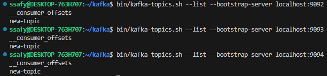

### Step2: 토픽을 생성하고 상태 확인
- 아래 명령어로 토픽 생성
```bash
bin/kafka-topics.sh --create --topic replicated-topic --bootstrap-server localhost:9092 --partitions 1 --replication-factor 3
```
- `--partitions 1`: 하나의 파티션만 생성하여 실습을 단순화함
- `--replication-factor 3`: 세 개의 브로커에서 복제본 유지
- 생성된 토픽 상태 확인
```bash
bin/kafka-topics.sh --describe --topic replicated-topic --bootstrap-server localhost:9092
```

### Step3: 메시지 송수신 테스트 수행  
- 프로듀서 실행
```bash
bin/kafka-console-producer.sh --topic replicated-topic --bootstrap-server localhost:9092
```
- 메시지를 입력
```bash
Message from replicated cluster
Another message○
```
- 컨슈머 실행
```bash
bin/kafka-console-consumer.sh --topic replicated-topic --from-beginning --bootstrap-server localhost:9092
```

### Step4: 하나의 브로커 중단 후 데이터 복구를 확인
- 실행 중인 브로커 중 하나를 종료합니다.
```bash
# 실행 중인 Kafka 프로세스 확인
ps -ef | grep kafka
kill -9 $(ps -ef | grep 'kafka.Kafka' | grep server-2.properties | awk '{print $2}') # 9094 브로커 종료
```
- 컨슈머를 실행하여 메시지가 정상적으로 소비되는지 확인합니다.
```bash
bin/kafka-console-consumer.sh --topic replicated-topic --bootstrap-server localhost:9093 --from-beginning
```

## 과제1 <a id="basic-hw-1"></a>
### 학습목표
여러 개의 Kafka 토픽을 생성하고, 각 토픽에 대해 메시지 송수신 테스트를 수행한 뒤, 컨슈머를 실행하여 특정 토픽의 메시지를 확인합니다.
- 다중 토픽 생성
- 각 토픽에 대해 메시지 송수신 테스트
- 컨슈머를 실행하여 특정 토픽의 메시지를 확인

### Step0: 주키퍼 & 카프카 실행
```bash
./bin/zookeeper-server-start.sh config/zookeeper.properties

./bin/kafka-server-start.sh config/server.properties
```

### Step1: 다중 토픽 생성
- topic-1과 topic-2라는 이름의 두 개의 토픽을 생성합니다.
```sh
bin/kafka-topics.sh --create --topic topic-1 --bootstrap-server localhost:9092 --partitions 1 --replication-factor 1

bin/kafka-topics.sh --create --topic topic-2 --bootstrap-server localhost:9092 --partitions 1 --replication-factor 1
```
- `bin/kafka-topics.sh --list --bootstrap-server localhost:9092` 명령어를 실행하여 생성된 토픽을 확인합니다.

### Step2: 각 토픽에 메시지 송수신 테스트
- Topic-1에 메시지 전송
```sh
bin/kafka-console-producer.sh --topic topic-1 --bootstrap-server localhost:9092
```
- 메시지를 입력하여 전송합니다.
```sh
Message to topic-1
Another message for topic-1
```
- Topic-2에 메시지 전송
```sh
bin/kafka-console-producer.sh --topic topic-2 --bootstrap-server localhost:9092
```
- 메시지를 입력하여 전송합니다.
```sh
Message to topic-2
Another message for topic-2
```

### Step3: 컨슈머 실행 및 특정 토픽 메시지 확인
- Topic-1의 메시지 소비
```sh
bin/kafka-console-consumer.sh --topic topic-1 --from-beginning --bootstrap-server localhost:9092
```
- Topic-1의 메시지가 정상적으로 출력되는지 확인합니다.

    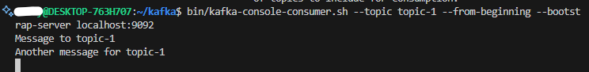

- Topic-2의 메시지 소비
```sh
bin/kafka-console-consumer.sh --topic topic-2 --from-beginning --bootstrap-server localhost:9092
```
- Topic-2의 메시지가 정상적으로 출력되는지 확인합니다.

    


## 과제2 <a id="basic-hw-2"></a>
### 학습목표
Kafka 실행 상태를 확인하고 여러 개의 파티션을 가진 토픽을 생성한 뒤, 특정 키를 사용하여 메시지를 전송하고 키 없이 전송한 경우의 동작을 비교하며, 컨슈머를 실행해 특정 파티션에 메시지가 정상적으로 저장되었는지와 다른 파티션에는 메시지가 없는지를 검증합니다.

- Kafka 실행 및 토픽 생성
    - Kafka가 실행 중인지 확인하고, 여러 개의 파티션을 가진 토픽을 생성합니다.
- 특정 키를 사용하여 메시지 전송
    - 특정 키를 사용하여 특정 파티션에 메시지를 전송하고, 키 없이 전송했을 때의 동작을 비교합니다.
- 컨슈머 실행 후 메시지 확인
    - 특정 파티션에 메시지가 정상적으로 저장되었는지 확인하고, 다른 파티션에는 메시지가 없는지 검증합니다.  

### Step1: Kafka를 실행 후 토픽을 생성
- Kafka가 실행 중인지 확인합니다.
```sh
bin/kafka-broker-api-versions.sh --bootstrap-server localhost:9092
# 출력이 잘 나왔다는 것 = localhost:9092 브로커 실행이 정상적으로 되고 있다는 것
```

- 3개의 파티션을 가진 토픽을 생성하고, 생성된 토픽의 파티션 정보를 확인합니다.
```sh
bin/kafka-topics.sh --create --topic part_test_topic --bootstrap-server localhost:9092 --partitions 3 --replication-factor 1

bin/kafka-topics.sh --describe --topic part_test_topic --bootstrap-server localhost:9092
```
    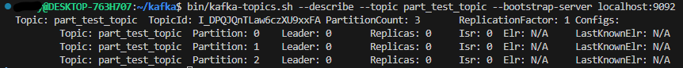

### Step2: 특정 키를 사용하여 메시지 전송
- 특정 키를 지정하여 메시지를 전송하고, 동일한 키를 가진 메시지가 항상 같은 파티션에 저장되는지 확인합니다.
    - `key.separator=:` → `:` 앞의 값이 key 로 인식됨
    - 동일한 key는 항상 같은 파티션에 저장되며, Kafka는 이를 hash(key) 를 이용하여 결정함
```sh
bin/kafka-console-producer.sh --topic part_test_topic --bootstrap-server localhost:9092 --property "parse.key=true" --property "key.separator=:"

# 입력 예시:
# key1:value1
# key2:value2
# key3:value3
# key4:value4
```

- 키 없이 메시지를 전송한 후, 메시지가 여러 파티션에 분배되는지 비교합니다.
    - 키가 없는 메시지는 라운드 로빈 방식으로 파티션에 균등하게 분배
```sh
bin/kafka-console-producer.sh --topic part_test_topic --bootstrap-server localhost:9092

# 입력 예시:
# msg-a
# msg-b
# msg-c
```

### Step3: 컨슈머 실행 후 메시지 확인
- 컨슈머를 실행하여 특정 키를 가진 메시지가 예상된 파티션에 저장되었는지 검증합니다.
```sh
bin/kafka-console-consumer.sh --topic part_test_topic --bootstrap-server localhost:9092 --partition 1 --from-beginning
```

- 다른 파티션을 조회하여 키 없이 전송한 메시지가 분산되었는지 확인합니다.

    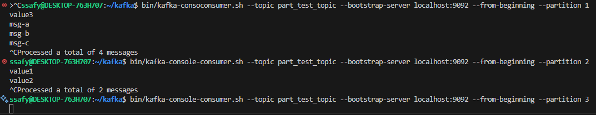


# Kafka의 프로듀서와 컨슈머 
## 실습1 <a id="producer-ex-1"></a>
### 학습목표 
kafka-python 라이브러리를 사용해 Kafka와의 기본 연결을 설정하고, Kafka 브로커의 정상 동작을 확인한 뒤, 기존에 존재하는 test-topic을 삭제하고 새로 생성하며, 브로커에 연결해 등록된 토픽 목록을 조회·출력하고 최종적으로 Kafka와 Python 간 연결이 정상적으로 이루어졌는지 검증합니다.

- kafka-python 라이브러리를 활용하여 Kafka와의 기본적인 연결을 설정합니다.
- Kafka 브로커가 정상적으로 동작하는지 확인하는 과정을 수행합니다.
- test-topic이 이미 존재하는 경우 삭제 후, 새 토픽을 생성합니다.
- Kafka 브로커에 연결하여 현재 등록된 토픽 목록을 조회하고 이를 출력합니다.
- 최종적으로 Kafka와 Python 간의 연결이 정상적으로 이루어졌는지 검증합니다.

### Step1: kafka-python 2.0.4 버전 라이브러리 설치
```sh
sudo apt update
sudo apt install python3-pip

pip3 install kafka-python
```

### Step2: Kafka 브로커가 실행 중인지 Python 코드로 확인
- `kafka_test.py` 파일 생성 후 아래 코드 작성
```sh
nano kafka_test.py
```
```python
"""
Kafka Python 라이브러리를 설치하고 Kafka 브로커와 연결을 확인하는 실습입니다.

TODO:
1. kafka-python 라이브러리를 설치합니다.
2. Kafka 클러스터와 연결할 KafkaAdminClient를 생성합니다.
3. 현재 Kafka 브로커에서 사용할 수 있는 토픽 목록을 조회합니다.
"""

from kafka.admin import KafkaAdminClient

# TODO 1: KafkaAdminClient를 생성하여 Kafka 브로커와 연결하세요.
admin_client = KafkaAdminClient(
    bootstrap_servers="localhost:9092",  # Kafka 브로커 주소
    client_id="my-admin-client"          # 클라이언트 ID
)

# TODO 2: Kafka 브로커에서 현재 사용 가능한 토픽 목록을 조회하세요.
topics = admin_client.list_topics()  # list_topics() 메서드 호출

# TODO 3: 조회된 토픽 목록을 출력하세요.
print("Kafka에 등록된 토픽 목록:", topics)
```

- 실행
```sh
python3 kafka_test.py
```

### Step3: test-topic이 존재하면 삭제한 후, 새로 생성
- `kafka-python`에서는 AdminClient로 토픽 생성/삭제 가능
```python
from kafka.admin import KafkaAdminClient, NewTopic

admin_client = KafkaAdminClient(
    bootstrap_servers="localhost:9092",
    client_id="my-admin-client"
)

topic_name = "test-topic"

# 기존 토픽 삭제
if topic_name in admin_client.list_topics():
    admin_client.delete_topics([topic_name])
    print(f"✅ 기존 토픽 삭제: {topic_name}")

# 새 토픽 생성 (파티션 3개)
new_topic = NewTopic(name=topic_name, num_partitions=3, replication_factor=1)
admin_client.create_topics([new_topic])
print(f"✅ 새 토픽 생성: {topic_name}")
```

### Step4: Python 코드에서 Kafka의 토픽 목록 조회
```python
# Kafka 브로커에서 현재 사용 가능한 토픽 목록을 조회하세요.

topics = admin_client.list_topics()  # list_topics() 메서드를 사용하여 토픽 목록을 조회하세요.
print("Kafka에 등록된 토픽 목록:", topics)
```

### Step5: 메시지 송수신은 수행하지 않고, 연결 테스트만 진행


## 실습2 <a id="producer-ex-2"></a>
### 학습목표
kafka-python을 사용해 Kafka 프로듀서를 생성하고, test-topic으로 메시지를 전송한 뒤 여러 개의 메시지를 반복적으로 전송하여 동작을 확인하며, 전송된 메시지가 Kafka에서 정상적으로 수신되는지를 검증합니다.

- kafka-python을 사용하여 Kafka 프로듀서를 생성합니다.
- test-topic으로 메시지를 전송합니다.
- 여러 개의 메시지를 반복적으로 전송하며 동작을 확인합니다.
- 전송된 메시지가 Kafka에서 정상적으로 수신되는지 확인합니다. 

### Step1: kafka-python 라이브러리를 사용하여 Kafka 프로듀서 생성
```sh
nano producer_test.py
```
```python
# producer_test.py

from kafka import KafkaProducer

producer = KafkaProducer(
    bootstrap_servers="localhost:9092",  # Kafka 브로커 주소
    key_serializer=str.encode,           # key를 byte로 직렬화
    value_serializer=str.encode          # value를 byte로 직렬화
)
```

### Step2: test-topic으로 메시지 전송
```python
# producer_test.py

# 전송할 토픽 이름
topic = "test-topic"
```

### Step3: 여러 개의 메시지를 반복적으로 전송하는 기능 구현
```python
# producer_test.py

# Step2: test-topic으로 메시지 전송
# Step3: 여러 개의 메시지를 반복적으로 전송하는 기능 구현
for i in range(5):
    producer.send(topic, key=f"key-{i}", value=f"message-{i}")

    # Step4: 메시지 전송 로그를 출력하여 확인
    print(f"✅ Sent → key: key-{i}, value: message-{i}")
```

### Step4: 메시지 전송 로그를 출력하여 확인
```sh
python3 producer_test.py
```
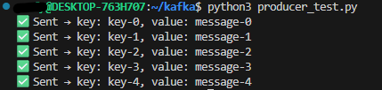


## 실습3 <a id="producer-ex-3"></a>
### 학습목표
kafka-python을 사용해 Kafka 컨슈머를 생성하고, test-topic을 구독하여 메시지를 소비하며, 수신한 메시지를 출력해 컨슈머의 동작을 확인하고 컨슈머가 지속적으로 실행되도록 설정합니다.

- kafka-python을 사용하여 Kafka 컨슈머를 생성합니다.
- test-topic을 구독하여 메시지를 소비합니다.
- 수신한 메시지를 출력하며 컨슈머의 동작을 확인합니다.
- 컨슈머가 지속적으로 실행되도록 설정합니다.

### Step1: kafka-python 라이브러리를 사용하여 Kafka 컨슈머 생성
```sh
nano consumer_test.py
```
```python
# consumer_test.py

from kafka import KafkaConsumer

consumer = KafkaConsumer(
    "test-topic",                  # 구독할 토픽
    bootstrap_servers="localhost:9092",  # Kafka 브로커 주소
    auto_offset_reset="earliest",        # 가장 처음 메시지부터 읽기
    enable_auto_commit=True,
    group_id="my-consumer-group"         # 컨슈머 그룹 ID
)
```

### Step2: test-topic에서 메시지 수신
- consumer 객체가 test-topic을 지속적으로 구독하고 메시지를 수신

### Step3: 수신한 메시지를 출력하여 정상적으로 동작하는지 확인
```python
# consumer_test.py

print("✅ Kafka Consumer is running...")
```

### Step4: 컨슈머가 지속적으로 실행되도록 구현
```python
# consumer_test.py
for message in consumer:
    print(f"📩 Received → key={message.key.decode('utf-8') if message.key else None}, "
          f"value={message.value.decode('utf-8')}")
```
 
## 실습4 <a id="producer-ex-4"></a>
### 학습목표
동일한 컨슈머 그룹을 가지는 여러 컨슈머를 생성하고, test-topic을 구독하여 메시지를 소비한 뒤, 각 컨슈머가 메시지를 분산 수신하는지 확인하며 컨슈머 그룹이 메시지를 자동으로 분배하는 동작을 관찰합니다.

- 동일한 컨슈머 그룹을 가지는 여러 컨슈머를 생성합니다.
- test-topic을 구독하여 메시지를 소비합니다.
- 각 컨슈머가 분산하여 메시지를 수신하는지 확인합니다.
- 컨슈머 그룹이 메시지를 자동으로 분배하는 동작을 관찰합니다.

### Step1: kafka-python 라이브러리를 사용하여 test-topic이 존재하면 삭제한 후, 파티션 개수가 2개인 새 토픽 생성
- 현재 브로커에 존재하는 토픽 목록 조회 (`list_topics()`)
- test-topic이 존재하면 삭제 (`delete_topics()`)
- 2초 대기 후 파티션이 2개인 새 토픽 생성 (`NewTopic(num_partitions=2)`)
```python
# python3 producer_topic_recreate.py

from kafka.admin import KafkaAdminClient, NewTopic
import time

admin_client = KafkaAdminClient(
    bootstrap_servers="localhost:9092",
    client_id="producer-admin"
)

topic_name = "test-topic"

# 기존 토픽 삭제
if topic_name in admin_client.list_topics():
    admin_client.delete_topics([topic_name])
    print(f"✅ 기존 토픽 삭제: {topic_name}")
    time.sleep(2)

# 새 토픽 생성 (파티션 2개)
new_topic = NewTopic(name=topic_name, num_partitions=2, replication_factor=1)
admin_client.create_topics([new_topic])
print(f"✅ 새 토픽 생성: {topic_name}")
```

### Step2: kafka-python을 사용하여 컨슈머 그룹을 구성
- 동일한 group_id를 가진 컨슈머 생성
- `auto_offset_reset='earliest'` 로 설정하여 처음 메시지부터 읽으도록 설정

```python
# consumer_group_test.py

from kafka import KafkaConsumer

consumer = KafkaConsumer(
    "test-topic",
    bootstrap_servers="localhost:9092",
    auto_offset_reset="earliest",
    enable_auto_commit=True,
    group_id="test-group"
)
```

### Step3: test-topic에서 여러 컨슈머가 메시지 소비
Producer에서 메시지를 여러 개 전송하고,
consumer_group.py 파일을 여러 터미널에서 실행하면 각각 메시지를 소비함

```python
# consumer_group_test.py

for message in consumer:
    print(f"Received: {message.value.decode('utf-8')}")
```

### Step4: 컨슈머들이 서로 다른 메시지를 분산하여 수신하는지 확인
- 실행
```sh
python3 producer_topic_recreate.py

# 터미널1
python3 consumer_group_test.py

# 터미널2
python3 consumer_group_test.py
```

- Kafka는 파티션 단위로 메시지를 분배
- 동일한 컨슈머 그룹에 속한 컨슈머끼리는 메시지를 나눠 가져감 (중복 X)
```sh
터미널 1 → Consumer #1: message-0, message-2, message-4, ...
터미널 2 → Consumer #2: message-1, message-3, message-5, ...
```


## 실습5 <a id="producer-ex-5"></a>
### 학습목표
기존의 test-topic이 존재하면 삭제하고, 파티션 1개짜리 새 토픽을 생성해 15개의 메시지를 미리 전송한 뒤, kafka-python으로 Kafka 컨슈머를 생성하고 자동 오프셋 커밋 기능(enable_auto_commit=False)을 비활성화합니다. 이후 5개씩 나누어 세 번 메시지를 소비하며, 세 번째 실행에서는 커밋하지 않고 종료한 뒤 다시 메시지를 소비하여 마지막으로 커밋된 위치부터 읽히는 것을 확인합니다.

- test-topic이 존재하면 삭제한 후, 파티션 개수가 1개인 새 토픽을 생성하고 미리 15개의 메시지를 전송합니다.
- kafka-python을 사용하여 Kafka 컨슈머를 생성합니다.
- 컨슈머의 자동 오프셋 커밋 기능을 비활성화(enable_auto_commit=False)합니다.
- 5개씩 끊어서 총 3번 메시지를 소비하는데, 세 번째 실행에서는 커밋하지 않고 종료합니다.
- 다시 메시지를 소비하여 마지막 커밋된 위치부터 읽는 것을 확인합니다.

### Step1: kafka-python을 사용하여 test-topic이 존재하면 삭제한 후, 파티션 개수가 1개인 새 토픽 생성하기
```python
# topic_reset.py

import time
from kafka.admin import KafkaAdminClient, NewTopic

# KafkaAdminClient를 생성
admin_client = KafkaAdminClient(
    bootstrap_servers="localhost:9092",  # Kafka 브로커 주소
    client_id="producer-admin"
)

topic_name = "test-topic"

# 기존 test-topic을 삭제한 후, 2초 대기 후 새로 생성
existing_topics = admin_client.list_topics()  # 기존 토픽 목록을 가져오는 함수
if topic_name in existing_topics:
    admin_client.delete_topics([topic_name])  # 특정 토픽을 삭제하는 함수
    print(f"기존 토픽 '{topic_name}' 삭제 완료")
    time.sleep(2)  # 삭제 후 2초 대기

new_topic = NewTopic(name=topic_name, num_partitions=1, replication_factor=1)
admin_client.create_topics([new_topic])  # 새로운 토픽을 생성하는 함수
print(f"새로운 토픽 '{topic_name}' 생성 완료")

admin_client.close()  # AdminClient 연결을 닫는 함수
```

### Step2: Kafka 프로듀서를 사용하여 test-topic에 15개의 메시지 전송하기
```python
# producer_send_15.py

from kafka import KafkaProducer

producer = KafkaProducer(
    bootstrap_servers="localhost:9092",
    value_serializer=str.encode
)

for i in range(15):
    producer.send("test-topic", value=f"message-{i}")
    print(f"Sent: message-{i}")

producer.flush()
print("✅ 15개 메시지 전송 완료")
```
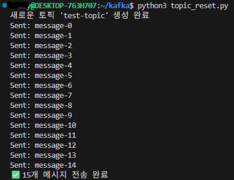

### Step3: Kafka 컨슈머를 생성하고 자동 오프셋 커밋 비활성화
```python
# manual_commit_consumer.py

from kafka import KafkaConsumer

def consume_messages(iteration, commit=True):
    """ 특정 배치만큼(5개) 메시지를 소비하고, commit 여부를 선택하는 함수 """

    consumer = KafkaConsumer(
        "test-topic",                    # 구독할 토픽
        bootstrap_servers="localhost:9092",
        auto_offset_reset="earliest",    # 가장 처음부터 읽기
        enable_auto_commit=False,        # 자동 오프셋 커밋 비활성화
        group_id="manual-commit-group"   # 동일 그룹 ID 사용
    )

    print(f"\n=== Batch {iteration} ===")
    messages = []

    for _ in range(5):
        message = next(consumer)  # 한 개씩 가져오기
        messages.append(message.value.decode("utf-8"))

    print("Received Messages:", messages)

    if commit:
        consumer.commit()  # 수동 오프셋 커밋
        print("오프셋 커밋 완료")

    consumer.close()
```

### Step4: 5개씩 끊어서 메시지를 소비하며, 세 번째 실행에서는 커밋하지 않고 종료하기
```python
# manual_commit_consumer.py

# 5개씩 3번 메시지를 소비하되, 앞의 2번은 커밋, 3번째는 커밋하지 않음
for i in range(2):
    consume_messages(i + 1, commit=True)

consume_messages(3, commit=False)  # 세 번째 실행에서는 커밋하지 않음
```
- Batch 1 → 0~4번 메시지 읽고 커밋
- Batch 2 → 5~9번 메시지 읽고 커밋
- Batch 3 → 10~14번 메시지 읽지만 커밋 안 함

### Step5: 다시 메시지를 소비하여 마지막 커밋된 위치부터 읽히는 것을 확인하기
```python
# manual_commit_consumer.py

# 마지막 커밋된 위치부터 다시 읽기
consume_messages(4, commit=True)
```
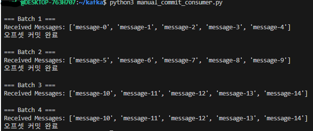
- Batch 3에서 10~14를 읽었지만 커밋을 안 했으므로
- Batch 4 실행 시 다시 10~14가 한 번 더 출력됨

### 전체 실행 순서
- 토픽 초기화 (파티션 1개로 생성): `python3 topic_reset.py`
- 메시지 15개 전송: `python3 producer_send_15.py`
    - topic_reset.py 파일과 producer_send_15.py 합쳐서 한 파일로 실행해도 됨!
- 수동 오프셋 실습 실행: `python3 manual_commit_consumer.py`


## 과제1 <a id="producer-hw-1"></a>
### 학습목표
기존의 test-topic이 존재하면 삭제하고, 파티션 3개짜리 새 토픽을 생성한 뒤, kafka-python을 사용해 Kafka 프로듀서를 구현합니다. 이후 특정 키 값을 가진 메시지를 여러 번 전송하여 동일한 파티션으로 들어가는지 확인하고, Kafka 컨슈머를 통해 해당 키로 전송된 메시지를 조회하여 동일한 파티션에 저장되었는지를 검증합니다.

- test-topic이 존재하면 삭제한 후, 파티션 개수가 3개인 새 토픽을 생성합니다.
- kafka-python을 사용하여 Kafka 프로듀서를 구현합니다.
- 특정 키 값을 가진 메시지를 여러 번 전송하여 동일한 파티션으로 들어가는지 확인합니다.
- 특정 키를 사용하여 전송된 메시지를 Kafka 컨슈머를 통해 조회하여, 동일한 파티션에 들어갔는지 검증합니다.

### Step1: kafka-python을 사용하여 test-topic이 존재하면 삭제한 후, 파티션 개수가 3개인 새 토픽 생성하기
- KafkaAdminClient 생성
- 기존 test-topic 있으면 삭제
- 2초 대기
- 파티션 3개로 새 토픽 생성
```python
# producer.py

"""
Kafka 프로듀서를 활용하여 특정 키 값을 가진 메시지가 동일한 파티션으로 전송되는지 확인하는 실습입니다.

TODO:
1. kafka-python 라이브러리를 사용하여 KafkaAdminClient를 생성합니다.
2. 기존 test-topic이 존재하면 삭제한 후, 파티션 개수가 3개인 새 토픽을 생성합니다.
3. KafkaProducer를 사용하여 특정 키 값을 가진 메시지를 여러 번 전송합니다.
4. 특정 키를 가진 메시지가 항상 같은 파티션으로 들어가는지 확인합니다.
"""

import time
from kafka import KafkaProducer
from kafka.admin import KafkaAdminClient, NewTopic

# AdminClient 생성
admin_client = KafkaAdminClient(
    bootstrap_servers="localhost:9092",
    client_id="partition-test-admin"
)

topic_name = "test-topic"

# test-topic 삭제
existing_topics = admin_client.list_topics()
if topic_name in existing_topics:
    admin_client.delete_topics([topic_name])
    print(f"기존 토픽 '{topic_name}' 삭제 완료")
    time.sleep(2)

# test-topic 생성 (파티션 3개)
new_topic = NewTopic(name=topic_name, num_partitions=3, replication_factor=1)
admin_client.create_topics([new_topic])
print(f"새로운 토픽 '{topic_name}' 생성 완료")

admin_client.close()

# Producer 생성
producer = KafkaProducer(
    bootstrap_servers="localhost:9092",
    key_serializer=str.encode,
    value_serializer=str.encode
)

# 동일한 key로 메시지 10개 전송
for i in range(10):
    key = "fixed-key"
    value = f"message-{i}"
    producer.send(topic_name, key=key, value=value)
    print(f"Sent: {value} with key={key}")

producer.flush()
print("전송 완료!")
```

### Step2: Kafka 프로듀서를 사용하여 특정 키 값을 가진 메시지를 여러 개 전송하기
- 두 소비자 모두 동일한 `group_id = "partition-test-group"` 사용하도록 작성

### Step3: 동일한 키를 가진 메시지가 항상 같은 파티션으로 들어가는지 확인하기
```python
# consumer1.py

"""
Kafka 컨슈머를 활용하여 특정 키 값을 가진 메시지가 동일한 파티션에서 소비되는지 확인하는 실습입니다.
"""

from kafka import KafkaConsumer

consumer = KafkaConsumer(
    "test-topic",
    bootstrap_servers="localhost:9092",
    auto_offset_reset="earliest",
    enable_auto_commit=True,
    group_id="partition-test-group",
)

for message in consumer:
    print(
        f"[Consumer1] Received: {message.value.decode('utf-8')}, "
        f"Key: {message.key.decode('utf-8')}, Partition: {message.partition}"
    )
```
```python
# consumer2.py

"""
Kafka 컨슈머를 활용하여 특정 키 값을 가진 메시지가 동일한 파티션에서 소비되는지 확인하는 실습입니다.
"""

from kafka import KafkaConsumer

consumer = KafkaConsumer(
    "test-topic",
    bootstrap_servers="localhost:9092",
    auto_offset_reset="earliest",
    enable_auto_commit=True,
    group_id="partition-test-group",
)

for message in consumer:
    print(
        f"[Consumer2] Received: {message.value.decode('utf-8')}, "
        f"Key: {message.key.decode('utf-8')}, Partition: {message.partition}"
    )
```

### Step4: Kafka 컨슈머를 사용하여 특정 키 값을 가진 메시지가 같은 파티션에서 소비되는지 검증하기
- 실행 순서
```sh
# 1) 토픽 삭제 + 생성 + 메시지 전송
python3 producer.py

# 2) 터미널 2개에서 각각 실행
python3 consumer1.py
python3 consumer2.py
```
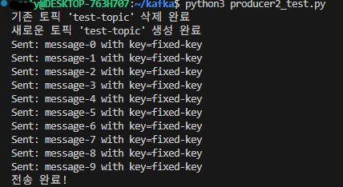

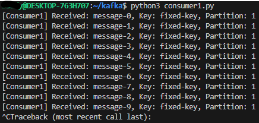
- 동일한 키 = 동일한 파티션으로 들어가는지? → 성공


- Consumer1에서 모든 메시지를 정상 소비했는지? → 성공
    - Consumer1에서 모든 메시지 소비 했으므로 Consumer2에서는 아무것도 안뜸

- 결과 정리
    | 조건                         | 소비 결과                                 |
    | -------------------------- | ------------------------------------- |
    | 같은 group_id (test-group 등) | consumer1만 메시지를 받고, consumer2는 메시지 없음 |
    | 다른 group_id                | consumer1, consumer2 모두 같은 메시지를 각각 읽음 |


## 과제2 <a id="producer-hw-2"></a>
### 학습목표
input-topic과 output-topic이 존재하면 삭제하고 새로 생성한 뒤, input-topic에 테스트 메시지를 미리 전송합니다. 이후 kafka-python을 사용해 Kafka 컨슈머를 구현하여 input-topic의 메시지를 소비하고, 해당 메시지를 변환(예: 대문자로 변환)한 후 output-topic으로 다시 전송하는 Kafka 프로듀서를 구현합니다. 마지막으로 output-topic을 구독하는 새로운 Kafka 컨슈머를 만들어 변환된 메시지가 정상적으로 소비되는지를 확인합니다.

- input-topic과 output-topic이 존재하면 삭제한 후 새로 생성하고, input-topic에 테스트 메시지를 미리 전송합니다.
- kafka-python을 사용하여 Kafka 컨슈머를 구현하고 input-topic의 메시지를 소비합니다.
- 소비한 메시지를 변환(예: 대문자로 변환)한 후 output-topic으로 다시 전송하는 Kafka 프로듀서를 구현합니다.
- output-topic을 구독하는 새로운 Kafka 컨슈머를 구현하여 변환된 메시지를 정상적으로 소비할 수 있는지 확인합니다.

### Step1: kafka-python을 사용하여 input-topic과 output-topic이 존재하면 삭제한 후 새로 생성
- AdminClient를 통해 기존 토픽이 있으면 삭제
- 2초 대기 후 input-topic / output-topic 재생성
- 실습 환경 초기화를 위한 중요한 과정
```python
# input_producer.py

"""
Kafka 프로듀서를 활용하여 `input-topic`에 테스트 메시지를 전송하는 실습입니다.
"""

import time
from kafka import KafkaProducer
from kafka.admin import KafkaAdminClient, NewTopic

# Step1: AdminClient 생성
admin_client = KafkaAdminClient(
    bootstrap_servers="localhost:9092",  
    client_id="input-admin"  
)

input_topic = "input-topic"
output_topic = "output-topic"

# 기존 토픽 삭제
existing_topics = admin_client.list_topics()
for topic in [input_topic, output_topic]:
    if topic in existing_topics:
        admin_client.delete_topics([topic])
        print(f"기존 토픽 '{topic}' 삭제 완료")
        time.sleep(2)

# 새 토픽 생성
admin_client.create_topics([
    NewTopic(name=input_topic, num_partitions=1, replication_factor=1),
    NewTopic(name=output_topic, num_partitions=1, replication_factor=1)
])
print(f"새로운 토픽 '{input_topic}' 및 '{output_topic}' 생성 완료")

admin_client.close()
```

### Step2: Kafka 프로듀서를 사용하여 input-topic에 테스트 메시지를 미리 전송
- 테스트 메시지 5개를 input-topic으로 전송
- 이후 Processor에서 이 메시지를 변환할 것
```python
# input_producer.py

# Step2: input-topic에 테스트 메시지 전송
producer = KafkaProducer(
    bootstrap_servers="localhost:9092",
    value_serializer=str.encode
)

for i in range(5):
    producer.send(input_topic, value=f"hello-kafka-{i}")
    print(f"Sent to input-topic: hello-kafka-{i}")

producer.flush()
print("초기 메시지 전송 완료!")
```

### Step3: Kafka 컨슈머를 생성하여 input-topic의 메시지를 소비한 후 특정 변환 로직(예: 대문자로 변환)을 적용
- Processor 역할 수행
- input-topic의 메시지를 읽고
- 대문자로 변환하여 output-topic으로 다시 전송
```python
# output_processor.py

"""
Kafka 컨슈머가 input-topic의 메시지를 읽고, 변환 후 output-topic으로 보내는 역할
"""

from kafka import KafkaConsumer, KafkaProducer

# Step3: input-topic 컨슈머 생성
consumer = KafkaConsumer(
    "input-topic",
    bootstrap_servers="localhost:9092",
    auto_offset_reset="earliest",
    enable_auto_commit=True,
    group_id="processor-group"
)

# output-topic 프로듀서 생성
producer = KafkaProducer(
    bootstrap_servers="localhost:9092",
    value_serializer=str.encode
)

# 메시지 변환 후 output-topic으로 전송
for message in consumer:
    transformed_message = message.value.decode("utf-8").upper()  # 대문자 변환
    producer.send("output-topic", value=transformed_message)
    print(f"Transformed and Sent: {transformed_message}")
```

### Step4: 변환된 메시지를 output-topic으로 전송하는 Kafka 프로듀서를 구현
- 최종 단계
- Processor가 보낸 변환 메시지를 확인
- 데이터가 정상 처리되었는지 검증하는 단계
```python
# output_consumer.py

"""
Kafka 컨슈머를 사용하여 output-topic의 메시지가 정상 변환되어 수신되는지 확인
"""

from kafka import KafkaConsumer

consumer = KafkaConsumer(
    "output-topic",
    bootstrap_servers="localhost:9092",
    auto_offset_reset="earliest",
    enable_auto_commit=True,
    group_id="output-group"
)

for message in consumer:
    print(f"Consumed from output-topic: {message.value.decode('utf-8')}")
```

### Step5:  output-topic을 구독하는 새로운 Kafka 컨슈머를 생성하여 변환된 메시지가 정상적으로 소비되는지 확인
- 실행 순서
1. 터미널 1 — input-topic & output-topic 초기화 & 초기 메시지 전송
```sh
python3 input_producer.py
```

2. 터미널 2 — Processor 실행 (input → transform → output)
```sh
python3 output_processor.py
```

3. 터미널 3 — 변환된 결과 소비
```sh
python3 output_consumer.py
```

