📌 목차 (Table of Contents)
---
- [Kafka 최적화](#kafka-최적화)
  - [실습1](#k-ex-1)
  - [실습2](#k-ex-2)
  - [실습3](#k-ex-3)
  - [실습4](#k-ex-4)
  - [실습5](#k-ex-5)
  - [과제1](#k-hw-1)
  - [과제2](#k-hw-2)

- [Kafka 모니터링](#kafka-모니터링)
  - [실습1](#m-ex-1)
  - [실습2](#m-ex-2)
  - [실습3](#m-ex-3)
  - [실습4](#m-ex-4)
  - [실습5](#m-ex-5)
  - [과제1](#m-hw-1)
  - [과제2](#m-hw-2)

# Kafka 최적화
## 실습1 <a id="k-ex-1"></a>
### 학습목표
Kafka 프로듀서를 생성하여 batch.size 값을 설정하고, 메시지를 전송하면서 실행 시간을 측정한 뒤, batch.size 값을 변경하며 실험을 수행하고 그 결과를 비교합니다.

- Kafka 프로듀서를 생성하고 batch.size 값을 설정합니다.
- 메시지를 전송하고 실행 시간을 측정합니다.
- batch.size 값을 변경하며 실험하고 결과를 비교합니다.  

### Step1: batch.size를 변경하며 메시지 전송하기
Kafka Producer 설정 중 `batch.size`는
Producer가 하나의 배치에 모아서 압축/전송할 수 있는 최대 바이트 크기임

- 배치 크기가 크면:
    - 더 많은 메시지를 한 번에 묶어 보낼 수 있음 → 네트워크 효율↑
    - 하지만 대기 시간이 길어질 수 있음
```python
BATCH_SIZES = [1024, 2048, 4096, 8192]

for batch_size in BATCH_SIZES:
    producer = KafkaProducer(
        bootstrap_servers=BROKER,
        batch_size=batch_size,
        acks=1,
        linger_ms=20
    )
```

### Step2: 메시지 크기 100 bytes로 설정
- 100바이트짜리 메시지를 만들어야 batch.size 효과가 명확해짐
- JSON 구조를 유지하기 위해 문자열 길이를 조절하여 100바이트 근처로 맞춤
```python
MESSAGE_SIZE = 100
MESSAGE_PAYLOAD = json.dumps({"data": "A" * (MESSAGE_SIZE - 20)}).encode('utf-8')
```

### Step3: 동일한 개수의 메시지를 전송하고 실행 시간 측정
- 각 batch.size 값별로 **동일한 메시지 개수(50,000개)**를 보내며 시간을 측정
```python
start_time = time.time()

for _ in range(NUM_MESSAGES):
    producer.send(TOPIC, MESSAGE_PAYLOAD)

producer.flush()
elapsed_time = time.time() - start_time
```

### Step4: 실험 결과를 비교하여 배치 크기의 영향을 분석하기
- 실행 방법
```sh
# 주키퍼 실행
./bin/zookeeper-server-start.sh config/zookeeper.properties
# 카프카 실행
./bin/kafka-server-start.sh config/server.properties
```
```python
# batch_test.py 생성

"""
Kafka 프로듀서의 배치 크기(`batch.size`) 변경이 메시지 전송 속도에 미치는 영향을 측정하는 실습입니다.

TODO:
1. Kafka 프로듀서를 생성하고 `batch.size`, `compression.type`, `linger.ms` 값을 변경하며 메시지를 전송합니다.
2. 서로 다른 설정에서 메시지 처리 속도를 비교합니다.
3. 메시지를 모두 보낼 때까지 걸린 시간을 출력합니다.

sudo apt-get update
sudo apt-get install -y g++ make cmake autoconf automake libtool pkg-config libsnappy-dev
pip install --no-binary :all: python-snappy==0.5.4
를 실행해야 snappy 압축이 정상동작 합니다.
"""

from kafka import KafkaProducer
import time
import json
# 설정 값
BROKER = "localhost:9092"
TOPIC = "test-topic"
BATCH_SIZES = [1024, 2048, 4096, 8192]  # 1KB, 2KB, 4KB, 8KB
NUM_MESSAGES = 50000  # 메시지 개수를 50,000개로 유지
MESSAGE_SIZE = 100  # 메시지 크기를 100바이트로 설정

# TODO 1: 100바이트 크기의 JSON 메시지를 생성
# 20정도를 빼서 보정하여 실제 메시지 크기가 100바이트에 가깝게 되도록 함
MESSAGE_PAYLOAD = json.dumps({"data": "A" * (MESSAGE_SIZE - 20)}).encode('utf-8')  # 메시지 크기 설정

# TODO 2: 서로 다른 배치 크기에서 메시지 처리 속도를 비교
for batch_size in BATCH_SIZES:
    print(f"Testing batch.size = {batch_size}...")

    # TODO 3: Kafka 프로듀서를 생성하고 설정 변경
    producer = KafkaProducer(
        bootstrap_servers=BROKER,  # Kafka 브로커 주소 설정
        batch_size=batch_size,  # 배치 크기 설정
        acks=1,  # 메시지 전송 확인 설정
        linger_ms=20  # 배치를 충분히 모으도록 설정 증가
    )

    # TODO 4: 메시지 전송 시작 시간 기록
    start_time = time.time()

    # TODO 5: NUM_MESSAGES 개수만큼 메시지 전송
    for _ in range(NUM_MESSAGES):  # 메시지 전송 반복 횟수
        producer.send(TOPIC, MESSAGE_PAYLOAD)  # 메시지 전송

    # TODO 6: 모든 메시지 전송 완료 후 시간 측정
    producer.flush()
    elapsed_time = time.time() - start_time

    # TODO 7: 결과 출력
    print(f"Batch size: {batch_size}, Time taken: {elapsed_time:.3f} sec\n")

    # TODO 8: 테스트 간 간격 추가
    time.sleep(2)  # 테스트 간 2초 대기
```
```sh
python3 batch_test.py
```
- 실행 결과
    
    
    - `batch.size`가 증가할수록 속도 개선됨
    - 이는 더 많은 메시지를 한 번에 묶어서 전송하기 때문
    - 하지만 너무 크면 메모리 사용 증가


## 실습2 <a id="k-ex-2"></a>
### 학습목표
Kafka 프로듀서를 생성하고 compression.type을 설정한 뒤, `none`, `gzip`, `snappy`, `lz4`로 변경하며 동일한 개수(`NUM_MESSAGES = 50000`)의 메시지를 전송하고 실행 시간을 측정하며, 각 압축 방식의 전송 속도와 네트워크 사용량을 비교·분석합니다.

- Kafka 프로듀서를 생성하고 `compression.type`을 설정합니다.
- `compression.type`을 none, gzip, snappy, lz4로 변경하며 메시지를 전송합니다.
- 동일한 개수(`NUM_MESSAGES = 50000`)의 메시지를 전송하고 실행 시간을 측정합니다.
- 각 압축 방식의 전송 속도 및 네트워크 사용량을 비교하여 분석합니다.  

### Step1: compression.type을 none, gzip, snappy, lz4로 변경하며 메시지 전송
- compression_type 값만 바꿔가며 KafkaProducer 설정을 반복 실행
- Kafka가 기본 제공하는 압축 방식 비교
    - None (압축 없음)
    - gzip
    - snappy
    - lz4
```python
COMPRESSION_TYPES = [None, "gzip", "snappy", "lz4"]

for compression_type in COMPRESSION_TYPES:
    producer = KafkaProducer(
        bootstrap_servers=BROKER,
        compression_type=compression_type,
        batch_size=16384,
        linger_ms=5,
        acks=1
    )
```

### Step2: 메시지 크기 100 bytes로 설정
Kafka 전송량을 일정하게 유지하기 위해 JSON 메시지를 100 bytes로 구성

```python
MESSAGE_PAYLOAD = json.dumps({"data": "A" * (MESSAGE_SIZE - 20)}).encode('utf-8')
```
### Step3: 동일한 개수의 메시지를 전송하고 실행 시간을 측정
모든 압축 방식에서 5만 개(NUM_MESSAGES) 메시지를 동일하게 전송하여 시간 비교

```python
start_time = time.time()

for _ in range(NUM_MESSAGES):
    producer.send(TOPIC, MESSAGE_PAYLOAD)

producer.flush()
elapsed_time = time.time() - start_time
```

### Step4: 각 압축 방식별 성능 차이를 비교하고 분석
- 실행 방법
```sh
# 주키퍼 실행
./bin/zookeeper-server-start.sh config/zookeeper.properties
# 카프카 실행
./bin/kafka-server-start.sh config/server.properties
```
```python
# compression_benchmark.py 생성

"""
Kafka 프로듀서에서 Gzip 및 Snappy 압축을 적용하여 메시지 전송 속도를 비교하는 실습입니다.

TODO:
1. Kafka 프로듀서를 생성하고 `batch.size`, `compression.type`, `linger.ms` 값을 변경하며 메시지를 전송합니다.
2. 서로 다른 설정에서 메시지 처리 속도를 비교합니다.
3. 메시지를 모두 보낼 때까지 걸린 시간을 출력합니다.

sudo apt-get update && sudo apt-get install -y g++ make cmake autoconf automake libtool pkg-config libsnappy-dev liblz4-dev python3-dev build-essential \
&& pip install --no-binary :all: python-snappy==0.5.4 \
&& pip install --no-cache-dir --no-binary :all: lz4==3.1.3
를 실행해야 snappy 압축이 정상동작 합니다.
"""

from kafka import KafkaProducer
import time
import json

# 설정 값
BROKER = "localhost:9092"
TOPIC = "test-topic"
COMPRESSION_TYPES = [None, "gzip", "snappy", "lz4"]  # 압축 없음, Gzip, Snappy, LZ4
NUM_MESSAGES = 50000  # 메시지 개수
MESSAGE_SIZE = 100  # 메시지 크기 100 bytes

# TODO 1: 100바이트 크기의 JSON 메시지를 생성
MESSAGE_PAYLOAD = json.dumps({"data": "A" * (MESSAGE_SIZE - 20)}).encode('utf-8')

# TODO 2: 압축 방식별 성능 측정
for compression_type in COMPRESSION_TYPES:
    print(f"Testing compression.type = {compression_type}...")

    # TODO 3: KafkaProducer 생성
    producer = KafkaProducer(
        bootstrap_servers=BROKER,
        compression_type=compression_type,
        batch_size=16384,      # 기본 배치 크기
        linger_ms=5,           # 배치를 위한 딜레이
        acks=1                 # 전송 확인
    )

    # TODO 4: 메시지 전송 시작 시간 기록
    start_time = time.time()

    # TODO 5: NUM_MESSAGES 개수만큼 메시지 전송
    for _ in range(NUM_MESSAGES):
        producer.send(TOPIC, MESSAGE_PAYLOAD)

    # TODO 6: flush() 후 시간 측정
    producer.flush()
    elapsed_time = time.time() - start_time

    # TODO 7: 결과 출력
    print(f"Compression: {compression_type}, Time taken: {elapsed_time:.3f} sec\n")

    # TODO 8: 테스트 간 간격
    time.sleep(2)
```
```sh
python3 compression_benchmark.py
```

- 실행 결과

    
    - 압축하지 않으면 CPU 부담은 적지만, 전송해야 할 데이터 양이 크기 때문에 네트워크 병목이 발생 → 가장 느림


## 실습3 <a id="k-ex-3"></a>
### 학습목표
Kafka 프로듀서를 생성해 메시지를 전송하고, `fetch.min.bytes`와 `max.poll.records` 값을 조정하며 컨슈머를 실행한 뒤, 동일한 개수의 메시지를 소비하면서 실행 시간을 측정하고 각 설정값에 따른 메시지 소비 속도를 비교·분석합니다.
- Kafka 프로듀서를 생성하여 메시지를 전송합니다.
- `fetch.min.bytes` 및 `max.poll.records` 값을 조정하며 컨슈머를 실행합니다.
- 동일한 개수의 메시지를 소비하고 실행 시간을 측정합니다.
- 각 설정값에서 메시지 소비 속도를 비교하여 분석합니다.  

### Step1: `fetch.min.bytes` 값을 1KB, 10KB, 50KB로 변경하며 메시지 소비하기
- `fetch.min.bytes` 는 컨슈머가 최소 이만큼의 데이터가 모일 때까지 기다렸다가 가져오도록 하는 옵션
- 값이 클수록 한 번에 많이 가져오지만, 첫 메시지를 받기까지의 지연(latency) 는 늘어날 수 있음
```python
FETCH_SIZES = [1024, 10240, 51200]  # 1KB, 10KB, 50KB
...
for fetch_size in FETCH_SIZES:
    ...
    consumer = KafkaConsumer(
        TOPIC,
        bootstrap_servers=BROKER,
        auto_offset_reset="earliest",
        enable_auto_commit=False,
        fetch_min_bytes=fetch_size,
        max_poll_records=poll_records
    )
```

### Step2: `max.poll.records` 값을 10, 100, 500으로 변경하며 실험하기
- `max.poll.records` 는 한 번 `poll()` 호출에서 최대 몇 개의 레코드를 가져올지를 의미함
- 값이 클수록 루프/네트워크 호출 횟수가 줄어들어 처리량이 좋아질 수 있음
```python
POLL_RECORDS = [10, 100, 500]
...
for fetch_size in FETCH_SIZES:
    for poll_records in POLL_RECORDS:
        ...
        consumer = KafkaConsumer(
            ...,
            fetch_min_bytes=fetch_size,
            max_poll_records=poll_records
        )
```

### Step3: 동일한 개수의 메시지를 소비하고 실행 시간 측정
- 모든 조합(`fetch.min.bytes` × `max.poll.records`)에 대해 같은 수(50,000개)의 메시지를 소비
- `time.time()` 으로 시작/종료 시각을 기록해서 경과 시간 비교
- 메시지 생산 부분:
    ```python
    MESSAGE_PAYLOAD = json.dumps({"data": "A" * (MESSAGE_SIZE - 20)}).encode("utf-8")

    producer = KafkaProducer(...)
    start_time = time.time()
    for _ in range(NUM_MESSAGES):
        producer.send(TOPIC, MESSAGE_PAYLOAD)
    producer.flush()
    elapsed_time = time.time() - start_time
    print(f"Produced {NUM_MESSAGES} messages in {elapsed_time:.3f} sec\n")
    ```
- 소비 측정 부분:
    ```python
    start_time = time.time()

    message_count = 0
    for message in consumer:
        message_count += 1
        if message_count >= NUM_MESSAGES:
            break

    elapsed_time = time.time() - start_time
    print(
        f"Fetch size: {fetch_size}, "
        f"Poll records: {poll_records}, "
        f"Time taken: {elapsed_time:.3f} sec\n"
    )

    ```

### Step4: 각 설정값에서 메시지 소비 속도를 비교 분석
- 실행 방법
```sh
# 주키퍼 실행
./bin/zookeeper-server-start.sh config/zookeeper.properties
# 카프카 실행
./bin/kafka-server-start.sh config/server.properties
```
```python
# consumer_fetch_experiment.py 생성

"""
Kafka 프로듀서에서 메시지를 생성하고, 컨슈머에서 `fetch.min.bytes` 및 `max.poll.records` 값을 변경하며
메시지 소비 속도를 실험하는 코드입니다.
"""

from kafka import KafkaProducer, KafkaConsumer
import time
import json

# 설정 값
BROKER = "localhost:9092"
TOPIC = "test-topic"
FETCH_SIZES = [1024, 10240, 51200]  # 1KB, 10KB, 50KB
POLL_RECORDS = [10, 100, 500]       # 10개, 100개, 500개
NUM_MESSAGES = 50000                # 총 메시지 개수
MESSAGE_SIZE = 100                  # 메시지 크기를 100바이트로 설정

# TODO 1: 100바이트 크기의 JSON 메시지를 생성
MESSAGE_PAYLOAD = json.dumps({"data": "A" * (MESSAGE_SIZE - 20)}).encode("utf-8")

# TODO 2: Kafka 프로듀서를 생성하고 메시지 발행
print("Producing messages...")

producer = KafkaProducer(
    bootstrap_servers=BROKER,  # Kafka 브로커 주소 설정
    batch_size=16384,          # 배치 크기 설정
    linger_ms=5,               # 배치를 적절히 활용하도록 설정
    acks=1                     # 메시지 전송 확인 설정
)

# TODO 3: NUM_MESSAGES 개수만큼 메시지 전송
start_time = time.time()  # 메시지 전송 시작 시간 기록
for _ in range(NUM_MESSAGES):
    producer.send(TOPIC, MESSAGE_PAYLOAD)

producer.flush()  # 모든 메시지 전송 완료
elapsed_time = time.time() - start_time  # 경과 시간 측정
print(f"Produced {NUM_MESSAGES} messages in {elapsed_time:.3f} sec\n")

# TODO 4: 서로 다른 Fetch size 및 Poll 간격 설정을 조합하여 컨슈머 테스트
for fetch_size in FETCH_SIZES:
    for poll_records in POLL_RECORDS:
        print(f"Testing fetch.min.bytes = {fetch_size}, max.poll.records = {poll_records}...")

        # TODO 5: Kafka 컨슈머를 생성하고 설정 변경
        consumer = KafkaConsumer(
            TOPIC,
            bootstrap_servers=BROKER,   # Kafka 브로커 주소 설정
            auto_offset_reset="earliest",  # 오프셋 초기화 방식 설정
            enable_auto_commit=False,      # 자동 오프셋 커밋 비활성화 (매번 처음부터 읽도록)
            fetch_min_bytes=fetch_size,    # 최소 Fetch 크기 설정
            max_poll_records=poll_records  # 최대 Poll 개수 설정
        )

        # TODO 6: 메시지 소비 시작 시간 기록
        start_time = time.time()

        # TODO 7: NUM_MESSAGES 개수만큼 메시지 소비
        message_count = 0
        for message in consumer:
            message_count += 1
            if message_count >= NUM_MESSAGES:  # 원하는 메시지 개수 도달 시 종료
                break

        # TODO 8: 모든 메시지 소비 완료 후 시간 측정
        elapsed_time = time.time() - start_time

        # TODO 9: 결과 출력
        print(
            f"Fetch size: {fetch_size}, "
            f"Poll records: {poll_records}, "
            f"Time taken: {elapsed_time:.3f} sec\n"
        )

        # TODO 10: 테스트 간 간격 추가
        time.sleep(2)  # 테스트 간 2초 대기
```
```sh
python3 consumer_fetch_experiment.py
```
- 실행 결과

    
    - `fetch.min.bytes` 증가 → 한 번에 더 많은 데이터 패치 → 네트워크 효율↑ / latency↑
    - `max.poll.records` 증가 → 애플리케이션 레벨 루프/오버헤드 감소 → 처리량↑
    - 너무 크게 잡으면 처음 읽기까지 지연이 길어질 수 있으므로, 실시간성 vs 처리량 트레이드오프 설명 가능


## 실습4 <a id="k-ex-4"></a>
### 학습목표
Kafka 프로듀서를 생성해 메시지를 전송하고, fetch.max.bytes와 max.poll.interval.ms 값을 조정하며 컨슈머를 실행한 뒤, 동일한 개수의 메시지를 소비하면서 실행 시간을 측정하고 각 설정값에 따른 메시지 소비 속도를 비교·분석합니다.

- Kafka 프로듀서를 생성하여 메시지를 전송합니다.
- `fetch.max.bytes` 및 `max.poll.interval.ms` 값을 조정하며 컨슈머를 실행합니다.
- 동일한 개수의 메시지를 소비하고 실행 시간을 측정합니다.
- 각 설정값에서 메시지 소비 속도를 비교하여 분석합니다.  

### Step1: fetch.max.bytes 값을 1KB, 10KB, 50KB로 변경하며 메시지 소비하기
- `fetch.max.bytes`
    - 컨슈머가 한 번에 가져올 수 있는 최대 데이터 크기
    - 값이 크면 한 번에 더 많은 메시지를 가져와서 효율 ↑
- 실험 값:
    | 설정    | 의미               |
    | ----- | ---------------- |
    | 1024  | 1KB만 가져옴 → 작은 페치 |
    | 10240 | 10KB             |
    | 51200 | 50KB → 대량 페치     |

```python
FETCH_SIZES = [1024, 10240, 51200]
consumer = KafkaConsumer(..., fetch_max_bytes=fetch_size)
```

### Step2: max.poll.interval.ms 값을 500ms, 1000ms, 5000ms로 변경하며 실험하기
- `max.poll.interval.ms`
    - `poll()` 호출 간 최장 허용 시간
    - 값이 길면 느리게 처리해도 세션 만료가 안됨
- 실험 값:
    | 설정     | 의미                  |
    | ------ | ------------------- |
    | 500ms  | 빠르게 poll() 해야 세션 유지 |
    | 1000ms | 1초마다 poll 가능        |
    | 5000ms | 5초까지 poll 안 해도 유지됨  |

```python
POLL_INTERVALS = [500, 1000, 5000]
consumer = KafkaConsumer(..., max_poll_interval_ms=poll_interval)
```

### Step3: 동일한 개수의 메시지를 소비하고 실행 시간 측정
- 이 실험에서는 50,000개 메시지 처리에 걸린 시간을 기록해 비교
- Throttling 설정마다 성능 차이를 로그로 출력
```python
start_time = time.time()
for message in consumer:
    message_count += 1
    if message_count >= NUM_MESSAGES:
        break
elapsed_time = time.time() - start_time
```

### Step4: 각 설정값에서 메시지 소비 속도를 비교 분석하기
```sh
# 주키퍼 실행
./bin/zookeeper-server-start.sh config/zookeeper.properties
# 카프카 실행
./bin/kafka-server-start.sh config/server.properties
```
```python
# throttling_consumer_test.py 생성

"""
Kafka 컨슈머에서 Throttling(속도 제한) 기능을 적용하여 처리량을 조절하는 실습입니다.

TODO:
1. Kafka 프로듀서를 생성하여 메시지를 발행합니다.
2. Kafka 컨슈머를 생성하고 `fetch.max.bytes` 및 `max.poll.interval.ms` 값을 변경합니다.
3. 서로 다른 설정에서 메시지 소비 속도를 비교합니다.
4. 메시지를 모두 소비할 때까지 걸린 시간을 출력합니다.
"""

from kafka import KafkaProducer, KafkaConsumer
import time
import json

# 설정 값
BROKER = "localhost:9092"
TOPIC = "test-topic"
FETCH_SIZES = [1024, 10240, 51200]  # 1KB, 10KB, 50KB
POLL_INTERVALS = [500, 1000, 5000]  # 500ms, 1초, 5초
NUM_MESSAGES = 50000
MESSAGE_SIZE = 100

# TODO 1: 100바이트 크기의 JSON 메시지를 생성
MESSAGE_PAYLOAD = json.dumps({"data": "A" * (MESSAGE_SIZE - 20)}).encode("utf-8")

# TODO 2: Kafka 프로듀서를 생성하고 메시지 발행
print("Producing messages...")

producer = KafkaProducer(
    bootstrap_servers=BROKER,
    batch_size=16384,
    linger_ms=5,
    acks=1
)

# TODO 3: NUM_MESSAGES 개수만큼 메시지 전송
start_time = time.time()
for _ in range(NUM_MESSAGES):
    producer.send(TOPIC, MESSAGE_PAYLOAD)

producer.flush()
elapsed_time = time.time() - start_time
print(f"Produced {NUM_MESSAGES} messages in {elapsed_time:.3f} sec\n")

# TODO 4: 서로 다른 Fetch size 및 Poll 간격 설정을 조합하여 컨슈머 테스트
for fetch_size in FETCH_SIZES:
    for poll_interval in POLL_INTERVALS:
        print(f"Testing fetch.max.bytes = {fetch_size}, max.poll.interval.ms = {poll_interval}...")

        # TODO 5: Kafka 컨슈머 생성
        consumer = KafkaConsumer(
            TOPIC,
            bootstrap_servers=BROKER,
            auto_offset_reset="earliest",
            enable_auto_commit=False,
            fetch_max_bytes=fetch_size,
            max_poll_interval_ms=poll_interval
        )

        # TODO 6: 메시지 소비 시작 시간 기록
        start_time = time.time()

        # TODO 7: NUM_MESSAGES 개수만큼 메시지 소비
        message_count = 0
        for message in consumer:
            message_count += 1
            if message_count >= NUM_MESSAGES:
                break

        # TODO 8: 메시지 소비 완료 후 시간 측정
        elapsed_time = time.time() - start_time

        # TODO 9: 결과 출력
        print(
            f"Fetch max bytes: {fetch_size}, "
            f"Poll interval: {poll_interval}, "
            f"Time taken: {elapsed_time:.3f} sec\n"
        )

        # TODO 10: 테스트 간 2초 대기
        time.sleep(2)
```
```sh
python3 throttling_consumer_test.py
```
- 실행 결과

    
    - fetch.max.bytes 증가
        - → 네트워크 왕복 횟수 감소 → 속도 향상
    - poll interval 크게 설정
        - → 안정적인 처리
        - → 메시지를 천천히 처리해도 세션 유지
    - 두 옵션 조합에 따라 처리량이 달라짐
        - 분산 시스템에서 처리량 vs 안정성 트레이드오프 실험 가능


## 실습5 <a id="k-ex-5"></a>
### 학습목표
Kafka 브로커의 설정을 변경하고, `socket.send.buffer.bytes`, `socket.receive.buffer.bytes`, `num.network.threads`, `num.io.threads` 값을 조정하며 실험을 진행한 뒤,동일한 개수의 메시지를 전송하여 실행 시간을 측정하고 성능 결과를 비교·분석해 최적의 설정을 도출합니다.
- Kafka 브로커의 설정을 변경합니다.
- `socket.send.buffer.bytes`, `socket.receive.buffer.bytes`, `num.network.threads`, `num.io.threads` 값을 변경하며 실험을 진행합니다.
- 동일한 개수의 메시지를 전송하고 실행 시간을 측정합니다.
- 성능 결과를 비교하여 최적의 설정을 분석합니다.  

### Step1: socket.send.buffer.bytes 값을 128KB, 512KB, 1MB로 변경하며 실험하기
- Kafka 브로커 설정 파일(`server.properties`)의
`socket.send.buffer.bytes` 값을 다음 3개로 변경하며 실험
    - 128 KB = 131072
    - 512 KB = 524288
    - 1 MB = 1048576
```python
SEND_BUFFER_SIZES = [131072, 524288, 1048576]

config_updates = [
    f"socket.send.buffer.bytes={send_buffer}",
    ...
]
```

### Step2: socket.receive.buffer.bytes 값을 128KB, 512KB, 1MB로 변경하며 실험하기
- 수신 버퍼 크기(`socket.receive.buffer.bytes`) 변경 실험도 동일한 값 3개로 진행
```python
RECEIVE_BUFFER_SIZES = [131072, 524288, 1048576]

config_updates = [
    f"socket.receive.buffer.bytes={receive_buffer}",
    ...
]
```

### Step3: num.network.threads 값을 2, 4, 8로 변경하며 실험하기
- Kafka 브로커의 네트워크 스레드 개수를 조정
```python
NETWORK_THREADS = [2, 4, 8]

config_updates = [
    f"num.network.threads={net_threads}",
    ...
]
```

### Step4: num.io.threads 값을 2, 4, 8로 변경하며 실험하기
- Kafka의 I/O 처리 스레드 개수도 다양한 값으로 실험
```python
IO_THREADS = [2, 4, 8]

config_updates = [
    f"num.io.threads={io_threads}",
    ...
]
```

### Step5: 동일한 개수의 메시지를 전송하고 소비하여 실행 시간 측정하기 
- 각 설정 조합마다 Producer → Consumer 순서로 성능 측정
- 메시지 전송 코드
    ```python
    def produce_messages():
        print("Producing messages...")

        producer = KafkaProducer(
            bootstrap_servers=BROKER,
            batch_size=16384,
            linger_ms=5,
            acks=1
        )

        start_time = time.time()
        for _ in range(NUM_MESSAGES):
            producer.send(TOPIC, MESSAGE_PAYLOAD)
        producer.flush()

        elapsed = time.time() - start_time
        print(f"Produced {NUM_MESSAGES} messages in {elapsed:.3f} sec\n")
    ```

- 메시지 소비 코드
    ```python
    def consume_messages():
        print("Consuming messages...")

        consumer = KafkaConsumer(
            TOPIC,
            bootstrap_servers=BROKER,
            auto_offset_reset="earliest",
            enable_auto_commit=False
        )

        start_time = time.time()
        message_count = 0

        for message in consumer:
            message_count += 1
            if message_count >= NUM_MESSAGES:
                break

        elapsed = time.time() - start_time
        print(f"Consumed {NUM_MESSAGES} messages in {elapsed:.3f} sec\n")
    ```

### Step6: 각 설정 조합에서 성능 결과 비교 분석
- 총 조합 수:
    - `3(send) × 3(receive) × 3(network) × 3(io) = 81` 조합
- 각 조합마다:
    - 브로커 설정 변경
    - 브로커 자동 재시작
    - 메시지 50,000개 전송
    - 메시지 50,000개 소비
    - 소요 시간 기록
    ```python
    for send_buffer in SEND_BUFFER_SIZES:
        for receive_buffer in RECEIVE_BUFFER_SIZES:
            for net_threads in NETWORK_THREADS:
                for io_threads in IO_THREADS:

                    print(f"\n=== Testing send_buffer={send_buffer}, "
                        f"receive_buffer={receive_buffer}, "
                        f"network_threads={net_threads}, io_threads={io_threads} ===")

                    update_broker_config(send_buffer, receive_buffer, net_threads, io_threads)

                    produce_messages()
                    consume_messages()

                    time.sleep(5)
    ```

- 전체 실행
```python

"""
Kafka 브로커의 메모리 및 네트워크 설정을 최적화하는 실습입니다.
"""

from kafka import KafkaProducer, KafkaConsumer
import time
import json
import subprocess

# 설정 값
BROKER = "localhost:9092"
TOPIC = "test-topic"
SEND_BUFFER_SIZES = [131072, 524288, 1048576]      # 128KB, 512KB, 1MB
RECEIVE_BUFFER_SIZES = [131072, 524288, 1048576]
NETWORK_THREADS = [2, 4, 8]
IO_THREADS = [2, 4, 8]
NUM_MESSAGES = 50000
MESSAGE_SIZE = 100

# TODO 1: 100바이트 크기의 JSON 메시지를 생성
MESSAGE_PAYLOAD = json.dumps({"data": "A" * (MESSAGE_SIZE - 20)}).encode('utf-8')

# TODO 2: Kafka 브로커 설정 변경
def update_broker_config(send_buffer, receive_buffer, net_threads, io_threads):
    config_updates = [
        f"socket.send.buffer.bytes={send_buffer}",
        f"socket.receive.buffer.bytes={receive_buffer}",
        f"num.network.threads={net_threads}",
        f"num.io.threads={io_threads}"
    ]

    config_file = "/home/my/kafka/config/server.properties"

    with open(config_file, "r") as file:
        lines = file.readlines()

    with open(config_file, "w") as file:
        for line in lines:
            if any(param.split("=")[0] in line for param in config_updates):
                continue
            file.write(line)
        for param in config_updates:
            file.write(param + "\n")

    restart_kafka_broker()

# TODO 3: Kafka 브로커 안전 재시작
def restart_kafka_broker():
    result = subprocess.run(["pgrep", "-f", "kafka.Kafka"], stdout=subprocess.PIPE, text=True)

    if result.stdout.strip():
        print("Stopping Kafka broker...")
        subprocess.run(["/home/my/kafka/bin/kafka-server-stop.sh"], check=False)
        time.sleep(5)

    print("Starting Kafka broker...")
    subprocess.Popen([
        "/home/my/kafka/bin/kafka-server-start.sh",
        "/home/my/kafka/config/server.properties"
    ], stdout=subprocess.DEVNULL, stderr=subprocess.DEVNULL, close_fds=True)

    time.sleep(5)
    confirm = subprocess.run(["pgrep", "-f", "kafka.Kafka"], stdout=subprocess.PIPE, text=True)
    if not confirm.stdout.strip():
        print("Kafka did not start properly.")
    else:
        print("Kafka successfully started!")

# TODO 4: Producer 메시지 발행
def produce_messages():
    print("Producing messages...")

    producer = KafkaProducer(
        bootstrap_servers=BROKER,
        batch_size=16384,
        linger_ms=5,
        acks=1
    )

    start_time = time.time()
    for _ in range(NUM_MESSAGES):
        producer.send(TOPIC, MESSAGE_PAYLOAD)
    producer.flush()
    elapsed = time.time() - start_time
    print(f"Produced {NUM_MESSAGES} messages in {elapsed:.3f} sec\n")

# TODO 5: 컨슈머 소비 테스트
def consume_messages():
    print("Consuming messages...")

    consumer = KafkaConsumer(
        TOPIC,
        bootstrap_servers=BROKER,
        auto_offset_reset="earliest",
        enable_auto_commit=False
    )

    start_time = time.time()
    count = 0
    for msg in consumer:
        count += 1
        if count >= NUM_MESSAGES:
            break

    elapsed = time.time() - start_time
    print(f"Consumed {NUM_MESSAGES} messages in {elapsed:.3f} sec\n")

# TODO 6: 설정 조합 테스트 실행
for send_buffer in SEND_BUFFER_SIZES:
    for receive_buffer in RECEIVE_BUFFER_SIZES:
        for net_threads in NETWORK_THREADS:
            for io_threads in IO_THREADS:

                print(
                    f"\n=== Testing send_buffer={send_buffer}, "
                    f"receive_buffer={receive_buffer}, "
                    f"network_threads={net_threads}, io_threads={io_threads} ==="
                )

                update_broker_config(send_buffer, receive_buffer, net_threads, io_threads)

                produce_messages()
                consume_messages()

                time.sleep(5)
```
- 실행 결과

    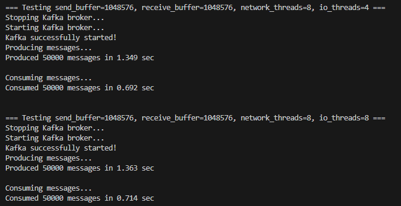


## 과제1 <a id="k-hw-1"></a>
### 학습목표
Kafka 프로듀서를 생성하고 `batch.size`, `compression.type`, `linger.ms` 등의 설정 값을 조정하며 실험을 진행한 뒤, 동일한 개수의 메시지를 전송하고 실행 시간을 측정하여 실험 결과를 비교·분석해 최적의 설정 값을 도출합니다

- Kafka 프로듀서를 생성하여 설정 값을 조정합니다.
- `batch.size`, `compression.type`, `linger.ms` 값을 변경하며 실험을 진행합니다.
- 동일한 개수의 메시지를 전송하고 실행 시간을 측정합니다.
- 실험 결과를 비교하여 최적의 설정 값을 분석합니다.  

### Step1: batch.size 값을 16KB, 32KB, 64KB로 변경하며 실험하기
- Kafka 프로듀서가 메시지를 한 번에 묶는 묶음 크기를 조정함으로써 전송 효율이 어떻게 달라지는지 측정
```python
BATCH_SIZES = [16384, 32768, 65536]

producer = KafkaProducer(
    bootstrap_servers=BROKER,
    batch_size=batch_size,
    compression_type=...,
    linger_ms=...,
    acks=1
)
```

### Step2: compression.type을 none, gzip, snappy로 변경하며 실험하기
- 압축 방식별 CPU 사용량과 네트워크 송신량이 달라 전송 속도에 영향을 미침
```py
COMPRESSION_TYPES = ["none", "gzip", "snappy"]

compression_type=compression if compression != "none" else None
```

### Step3: linger.ms 값을 0ms, 10ms, 50ms로 변경하며 실험하기
- linger.ms는 메시지를 기다렸다가 배치로 묶는 시간을 의미함
    - 값이 커질수록 배치 전송 효율 ↑, 지연시간 ↑
```py
LINGER_TIMES = [0, 10, 50]

producer = KafkaProducer(
    linger_ms=linger,
    ...
)
```

### Step4: 동일한 개수의 메시지를 전송하고 실행 시간을 측정하기
- 모든 조합(batch × compression × linger)에 대해
메시지 100,000개를 전송하여 시간 측정
```py
start_time = time.time()

for _ in range(NUM_MESSAGES):
    producer.send(TOPIC, MESSAGE_PAYLOAD)

producer.flush()
elapsed_time = time.time() - start_time
```

### Step5: 각 설정 조합에서 성능 결과를 비교, 분석
- 실행 방법
```sh
# 주키퍼 실행
./bin/zookeeper-server-start.sh config/zookeeper.properties
# 카프카 실행
./bin/kafka-server-start.sh config/server.properties

```
```py
# kafka_producer_performance_test.py 생성

"""
Kafka 프로듀서의 성능을 최적화하는 실습입니다.

TODO:
1. Kafka 프로듀서를 생성하고 `batch.size`, `compression.type`, `linger.ms` 값을 변경하며 메시지를 전송합니다.
2. 서로 다른 설정에서 메시지 처리 속도를 비교합니다.
3. 메시지를 모두 보낼 때까지 걸린 시간을 출력합니다.

sudo apt-get update && sudo apt-get install -y g++ make cmake autoconf automake libtool pkg-config libsnappy-dev liblz4-dev python3-dev build-essential \
&& pip install --no-binary :all: python-snappy==0.5.4 \
&& pip install --no-cache-dir --no-binary :all: lz4==3.1.3
"""

from kafka import KafkaProducer
import time
import json

# 설정 값
BROKER = "localhost:9092"
TOPIC = "test-topic"
BATCH_SIZES = [16384, 32768, 65536]      # 16KB, 32KB, 64KB
COMPRESSION_TYPES = ["none", "gzip", "snappy"]
LINGER_TIMES = [0, 10, 50]               # 0ms, 10ms, 50ms
NUM_MESSAGES = 100000
MESSAGE_SIZE = 100

# TODO 1: 100바이트 크기의 JSON 메시지를 생성
MESSAGE_PAYLOAD = json.dumps({"data": "A" * (MESSAGE_SIZE - 20)}).encode('utf-8')

# TODO 2: 서로 다른 설정에서 메시지 처리 속도를 비교
for batch_size in BATCH_SIZES:
    for compression in COMPRESSION_TYPES:
        for linger in LINGER_TIMES:
            print(f"Testing batch.size = {batch_size}, compression = {compression}, linger.ms = {linger}...")

            # TODO 3: Kafka 프로듀서를 생성하고 설정 변경
            producer = KafkaProducer(
                bootstrap_servers=BROKER,
                batch_size=batch_size,
                compression_type=compression if compression != "none" else None,
                linger_ms=linger,
                acks=1
            )

            # TODO 4: 메시지 전송 시작 시간 기록
            start_time = time.time()

            # TODO 5: NUM_MESSAGES 개수만큼 메시지 전송
            for _ in range(NUM_MESSAGES):
                producer.send(TOPIC, MESSAGE_PAYLOAD)

            # TODO 6: 모든 메시지 전송 완료 후 시간 측정
            producer.flush()
            elapsed_time = time.time() - start_time

            # TODO 7: 결과 출력
            print(f"Batch size: {batch_size}, Compression: {compression}, Linger.ms: {linger}, Time taken: {elapsed_time:.3f} sec\n")

            # TODO 8: 테스트 간 간격 추가
            time.sleep(2)
```
```sh
python3 kafka_producer_performance_test.py 
```
- 실행 결과

    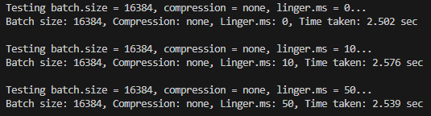
    - 이런 출력값을 비교하여
        - 가장 빠른 설정
        - Cpu 사용률과 트레이드오프
        - 압축 방식의 네트워크 절감 효과
    - 등을 분석할 수 있음


## 과제2 <a id="k-hw-2"></a>
### 학습목표
Kafka 컨슈머를 생성하고 `max.poll.records`, `fetch.min.bytes`, `fetch.max.wait.ms` 등의 설정 값을 조정하며 실험을 진행한 뒤, 동일한 개수의 메시지를 소비하고 실행 시간을 측정하여 실험 결과를 비교·분석해 최적의 설정 값을 도출합니다.
- Kafka 컨슈머를 생성하여 설정 값을 조정합니다.
- `max.poll.records`, `fetch.min.bytes`, `fetch.max.wait.ms` 값을 변경하며 실험을 진행합니다.
- 동일한 개수의 메시지를 소비하고 실행 시간을 측정합니다.
- 실험 결과를 비교하여 최적의 설정 값을 분석합니다.  

### Step1: max.poll.records 값을 10, 100, 500으로 변경하며 실험하기
- `max.poll.records` 는 한 번 `poll()` 호출에서 최대 몇 개의 레코드를 가져올지를 의미함
- 값이 클수록 루프/네트워크 호출 횟수가 줄어들어 처리량이 좋아질 수 있음
- 컨슈머 생성 시 아래 옵션을 조정하며 실행
```py
max_poll_records=poll_records
```
- 값 목록:
    - 10
    - 100
    - 500

### Step2: fetch.min.bytes 값을 1KB, 10KB, 50KB로 변경하며 실험하기
- `fetch.min.bytes` 는 컨슈머가 최소 이만큼의 데이터가 모일 때까지 기다렸다가 가져오도록 하는 옵션
- 값이 클수록 한 번에 많이 가져오지만, 첫 메시지를 받기까지의 지연(latency) 는 늘어날 수 있음
- 컨슈머 생성 시 아래 옵션을 조정하며 실행
```py
fetch_min_bytes=fetch_min
```
- 값 목록:
    - 1KB = 1024 bytes  
    - 10KB = 10240 bytes
    - 50KB = 51200 bytes

### Step3: fetch.max.wait.ms 값을 100ms, 500ms, 1000ms로 변경하며 실험하기
- `fetch.max.wait.ms` 는 컨슈머가 `fetch.min.bytes` 만큼의 데이터를 받기 위해 기다릴 최대 시간
- 값이 크면 더 오래 기다려서 한 번에 더 많은 데이터를 가져올 수 있지만, 지연 시간이 늘어날 수 있음
- 컨슈머 생성 시 아래 옵션을 조정하며 실행
```py
fetch_max_wait_ms=fetch_wait
```
- 값 목록:
    - 100ms
    - 500ms
    - 1000ms

### Step4: 동일한 개수의 메시지를 소비하고 실행 시간 측정하기
- 모든 조합(`max.poll.records` × `fetch.min.bytes` × `fetch.max.wait.ms`)에 대해 같은 수(100,000개)의 메시지를 소비
- `time.time()` 으로 시작/종료 시각을 기록해서 경과 시간 비교
```py
start_time = time.time()
...
elapsed_time = time.time() - start_time
```

### Step5: 각 설정 조합에서 성능 결과 비교, 분석하기
- 실행 방법
```sh
# 주키퍼 실행
./bin/zookeeper-server-start.sh config/zookeeper.properties
# 카프카 실행
./bin/kafka-server-start.sh config/server.properties
```
```py
# consumer_performance_test.py 생성

"""
Kafka 컨슈머의 성능을 최적화하는 실습입니다.

TODO:
1. Kafka 컨슈머를 생성하고 `max.poll.records`, `fetch.min.bytes`, `fetch.max.wait.ms` 값을 변경하며 메시지를 소비합니다.
2. 서로 다른 설정에서 메시지 소비 속도를 비교합니다.
3. 메시지를 모두 소비할 때까지 걸린 시간을 출력합니다.

sudo apt-get install libsnappy-dev을 통해 쉘에서 snappy를 설치해야 정상 작동합니다.
"""

from kafka import KafkaConsumer
import time

# 설정 값
BROKER = "localhost:9092"
TOPIC = "test-topic"
POLL_RECORDS = [10, 100, 500]  # 한 번의 폴링에서 가져올 최대 메시지 개수
FETCH_MIN_BYTES = [1024, 10240, 51200]  # 최소 Fetch 크기 (1KB, 10KB, 50KB)
FETCH_MAX_WAIT = [100, 500, 1000]  # 최대 대기 시간 (100ms, 500ms, 1000ms)
NUM_MESSAGES = 100000  # 총 메시지 개수

# TODO 1: 서로 다른 설정에서 메시지 소비 속도를 비교
for poll_records in POLL_RECORDS:
    for fetch_min in FETCH_MIN_BYTES:
        for fetch_wait in FETCH_MAX_WAIT:
            print(f"Testing max.poll.records = {poll_records}, fetch.min.bytes = {fetch_min}, fetch.max.wait.ms = {fetch_wait}...")

            # TODO 2: Kafka 컨슈머 생성
            consumer = KafkaConsumer(
                TOPIC,
                bootstrap_servers=BROKER,      # Kafka 브로커 주소 설정
                auto_offset_reset="earliest",  # 오프셋 초기화 방식 설정
                enable_auto_commit=False,      # 자동 오프셋 커밋 여부 설정
                max_poll_records=poll_records, # 최대 Poll 개수 설정
                fetch_min_bytes=fetch_min,     # 최소 Fetch 크기 설정
                fetch_max_wait_ms=fetch_wait   # 최대 Fetch 대기 시간 설정
            )

            # TODO 3: 메시지 소비 시작 시간 기록
            start_time = time.time()

            # TODO 4: NUM_MESSAGES 개수만큼 메시지 소비
            message_count = 0
            for message in consumer:
                message_count += 1
                if message_count >= NUM_MESSAGES:  # 원하는 메시지 개수 도달 시 종료
                    break

            # TODO 5: 모든 메시지 소비 완료 후 시간 측정
            elapsed_time = time.time() - start_time

            # TODO 6: 결과 출력
            print(f"Max poll records: {poll_records}, Fetch min bytes: {fetch_min}, "
                  f"Fetch max wait: {fetch_wait}, Time taken: {elapsed_time:.3f} sec\n")

            # TODO 7: 테스트 간 간격 추가
            time.sleep(2)
```
```sh
python3 consumer_performance_test.py
```
- 실행 결과

    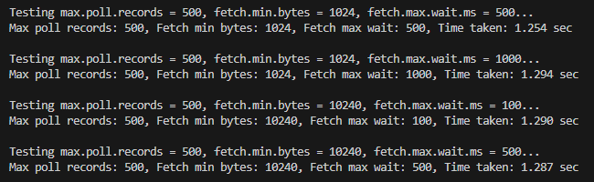
    - max.poll.records 증가
        - → 애플리케이션 레벨 루프/오버헤드 감소 → 처리량↑
    - fetch.min.bytes 증가
        - → 한 번에 더 많은 데이터 패치 → 네트워크 효율↑ / latency↑
    - fetch.max.wait.ms 증가
        - → 더 오래 기다려서 한 번에 더 많은 데이터 패치 → 네트워크 효율↑ / latency↑
    - 각 설정 조합에 따라 처리량이 달라짐
        - 분산 시스템에서 처리량 vs 실시간성 트레이드오프 실험 가능


# Kafka 모니터링
## 실습1 <a id="m-ex-1"></a>
### 학습목표
Kafka 브로커의 상태를 조회하여 클러스터의 정상 동작 여부를 확인하고, Kafka CLI 명령어를 활용해 토픽 및 컨슈머 그룹의 상태를 점검합니다. 이후 특정 컨슈머 그룹의 메시지 Lag을 분석해 메시지 소비 속도를 파악하고, 브로커의 메시지 처리량을 조회하여 성능 상태를 확인하며, 마지막으로 브로커 로그를 모니터링해 오류 및 성능 문제를 감지합니다.
- Kafka 브로커 상태를 조회하여 클러스터가 정상적으로 동작하는지 확인합니다.
- Kafka의 CLI 명령어를 활용하여 토픽 및 컨슈머 그룹의 상태를 점검합니다.
- 특정 컨슈머 그룹의 메시지 Lag을 분석하여 소비 속도를 파악합니다.
- 브로커의 메시지 처리량을 조회하여 성능 상태를 확인합니다.
- Kafka 브로커의 로그를 모니터링하여 오류 및 성능 문제를 감지합니다.  

### Step1: Kafka 브로커 상태 조회
- Kafka 설치 디렉토리의 `bin` 폴더로 이동
```sh
cd ~/kafka/bin
```
- Kafka 브로커의 상태를 확인하여 클러스터가 정상적으로 동작하는지 점검
```sh
sh kafka-broker-api-versions.sh --bootstrap-server localhost:9092
```
- 현재 실행 중인 Kafka 브로커 목록과 API 버전을 확인

    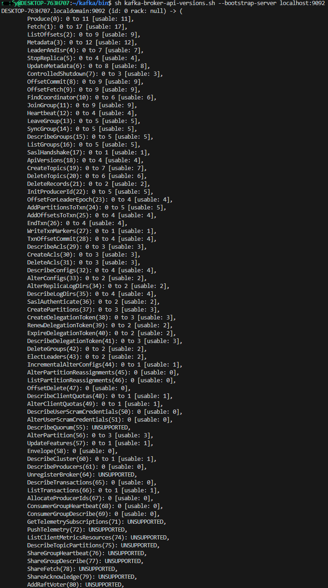

### Step2: 토픽 및 파티션 상태 확인
```sh
sh kafka-topics.sh --list --bootstrap-server localhost:9092
sh kafka-topics.sh --describe --topic test-topic --bootstrap-server localhost:9092
```
- 클러스터 내 토픽 목록을 조회하고, 특정 토픽의 상세 정보를 확인

    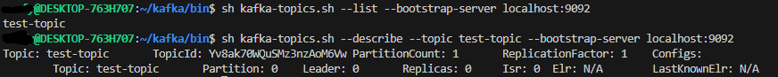

### Step3: 컨슈머 그룹 상태 확인
```sh
sh kafka-consumer-groups.sh --list --bootstrap-server localhost:9092
sh kafka-consumer-groups.sh --describe --group test-group --bootstrap-server localhost:9092
```
- 컨슈머 그룹 목록을 조회하고, 특정 컨슈머 그룹의 오프셋 및 Lag 상태 분석

    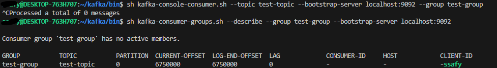
    - Processed a total of 0 messages
        - `test-topic`에 읽을 메시지가 없음
        - 그래서 소비된 메시지가 0개로 나옴
    - Consumer group 'test-group' has no active members
        - 현재 컨슈머가 실행 중이 아니라서(active 상태가 아니라서) 나오는 메시지
        - 그룹은 존재하지만 실행 중인 컨슈머가 없다는 뜻
    - OFFSET / LAG 상태
        - 파티션 0의 최신 오프셋이 6750000
        - 컨슈머가 마지막으로 읽은 오프셋도 6750000
        - 따라서 Lag = 0 → 읽을 메시지가 없음
        - 즉, 컨슈머 그룹이 토픽 내용을 전부 읽고 난 뒤 정상 상태

### Step4: Kafka 브로커 로그 확인
```sh
cd kafka/logs
tail -f server.log
```
- Kafka 브로커의 로그 파일을 모니터링하여 오류 및 성능 문제를 감지해야 함

    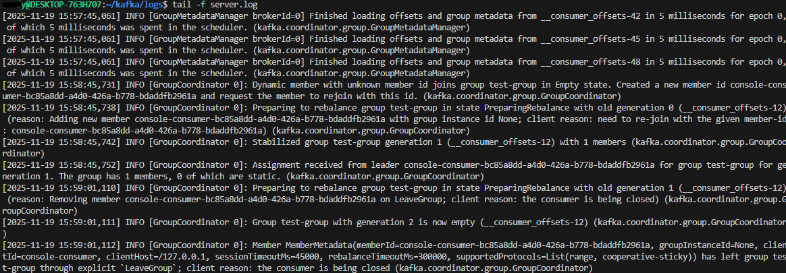
    1. 컨슈머 그룹이 처음 Empty 상태였음
        ```sql
        Dynamic member with unknown member id joins group test-group in Empty state.
        ```
    2. 새로운 member-id로 컨슈머가 그룹에 참가
        ```javascript
        Created a new member id console-consumer-...
        ```
    3. 리밸런스 시작 (PreparingRebalance)
        ```vbnet
        Preparing to rebalance group test-group...
        reason: Adding new member ...
        ```
    4. 그룹 안정화 (Stabilized)
        ```csharp
        Stabilized group test-group generation 1 with 1 members
        ```
        - 1개의 컨슈머가 정상적으로 test-group에 참여해서 파티션을 배정받음
    5. 컨슈머 종료 (Ctrl+C)
        ```csharp
        LeaveGroup; client reason: the consumer is being closed
        ```
    6. 그룹이 다시 Empty 상태가 됨
        ```sql
        Group test-group with generation 2 is now empty
        ```


## 실습2 <a id="m-ex-2"></a>
### 학습목표
Kafka 브로커에서 JMX 포트를 활성화하고, JMXTerm을 다운로드하여 JMX를 통해 Kafka 브로커의 성능 지표를 조회합니다. 이후 CLI 명령어를 사용해 메모리 사용량, 메시지 처리량 등의 특정 JMX 메트릭을 확인하고, JMX를 활용해 브로커 성능을 분석하며 실행 결과를 검증합니다.

- Kafka 브로커에서 JMX 포트를 활성화합니다.
- JMXTerm을 다운로드하고, JMX를 통해 Kafka 브로커의 성능 지표를 조회합니다.
- CLI 명령어를 사용하여 특정 JMX 메트릭(메모리 사용량, 메시지 처리량 등)을 조회합니다.
- JMX를 활용하여 브로커 성능을 분석하고, 실행 결과를 확인합니다.

### Step1: Kafka JMX 포트 활성화
- KAFKA_JMX_OPTS 환경 변수를 설정하여 JMX 포트를 활성화해야 합니다.
```sh
# kafka 브로커에게 9999번 포트로 JMX 열어서 내부상태 보여줘! 라는 명령
export KAFKA_JMX_OPTS="-Dcom.sun.management.jmxremote \
    -Dcom.sun.management.jmxremote.port=9999 \
    -Dcom.sun.management.jmxremote.rmi.port=9999 \
    -Dcom.sun.management.jmxremote.authenticate=false \
    -Dcom.sun.management.jmxremote.ssl=false \
    -Djava.rmi.server.hostname=127.0.0.1"
```
- Kafka 브로커를 JMX가 활성화된 상태로 실행해야 합니다.
```sh
# 이전에 켜져있는 Kafka 종료
/bin/kafka-server-stop.sh  
# 새로 실행하면서 JMX 활성화된 상태로 시작     
./bin/kafka-server-start.sh -daemon config/server.properties
```

### Step2: JMXTerm을 사용하여 Kafka 브로커 모니터링
- JMXTerm 1.0.2 버전을 다운로드하여 실행해야 합니다.
```sh
wget https://github.com/jiaqi/jmxterm/releases/download/v1.0.2/jmxterm-1.0.2-uber.jar -O jmxterm.jar
java -jar jmxterm.jar -l localhost:9999
```
- Kafka JMX 포트(9999) 정상 활성화
- JMXTerm으로 브로커에 성공적으로 접속
- JMX 콘솔이 정상적으로 뜸
```
Welcome to JMX terminal. Type "help" for available commands.
```

### Step3: JMX를 활용하여 Kafka 성능 지표 확인
- CLI 명령어를 사용하여 Kafka 브로커의 특정 JMX 메트릭을 확인해야 합니다.
```sh
bean java.lang:type=Memory
get HeapMemoryUsage
bean kafka.server:type=BrokerTopicMetrics,name=MessagesInPerSec
get OneMinuteRate
bean kafka.network:type=RequestMetrics,name=TotalTimeMs,request=Produce
get 99thPercentile
```
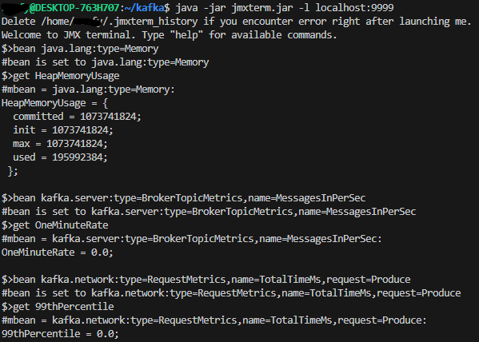

- HeapMemoryUsage
    ```ini
    committed = 1073741824 (1GB)
    max = 1073741824 (1GB)
    used = 195992384 (약 187MB)
    ```
    - Kafka가 1GB 힙을 확보했고, 그중 약 18%만 사용 중
    - 부하가 거의 없는 브로커

- MessagesInPerSec
    ```ini
    OneMinuteRate = 0.0
    ```
    - 지난 1분 동안 Kafka 브로커가 받은 메시지가 0개라는 뜻
    - 즉, Producer가 메시지를 보내지 않았거나 이미 멈춘 상태라는 의미

- Produce 99thPercentile
    ```ini
    99thPercentile = 0.0
    ```
    - 메시지 전송(Produce 요청)이 없으면 자연스럽게 0이 찍힘
    - 지금 브로커는 아무런 메시지도 받고 있지 않은 상태


## 실습3 <a id="m-ex-3"></a>
### 학습목표
WSL 환경에 Prometheus를 설치하고 실행한 뒤, Kafka 브로커에서 JMX Exporter를 설정하여 JMX 데이터를 Prometheus 형식으로 변환하고, Prometheus가 Kafka의 JMX 메트릭을 수집하도록 설정합니다.

- Prometheus를 WSL 환경에 설치하고 실행합니다.
- Kafka 브로커에서 JMX Exporter를 설정하여 JMX 데이터를 Prometheus 형식으로 변환합니다.
- Prometheus가 Kafka의 JMX 메트릭을 수집하도록 설정합니다.  

### Step1: Prometheus 설치 & 실행
- Prometheus 2.47.2 버전을 다운로드하여 실행해야 합니다.
```sh
wget https://github.com/prometheus/prometheus/releases/download/v2.47.2/prometheus-2.47.2.linux-amd64.tar.gz
tar -xvzf prometheus-2.47.2.linux-amd64.tar.gz
cd prometheus-2.47.2.linux-amd64
./prometheus --config.file=prometheus.yml
```
- http://localhost:9090 들어가면 Prometheus UI 확인 가능

### Step2: Kafka JMX Exporter 설정 및 확인
- JMX Exporter 0.17.2 버전을 다운로드하여 설정해야 합니다.
```sh 
# 다른 터미널
# cd ~/kafka 
wget https://repo1.maven.org/maven2/io/prometheus/jmx/jmx_prometheus_javaagent/0.17.2/jmx_prometheus_javaagent-0.17.2.jar
```
- config.yaml 파일을 생성해야 합니다.
```sh
cd ~/kafka
nano jmx-config.yaml
```
```yml
lowercaseOutputName: true 
rules:  
- pattern: ".*" 
```
- Kafka 실행 시 JMX Exporter를 추가해야 합니다.
```sh
export KAFKA_OPTS="-javaagent:$(pwd)/jmx_prometheus_javaagent-0.17.2.jar=9094:$(pwd)/jmx-config.yaml"
```
- Kafka를 재시작하고 JMX Exporter가 올바르게 실행되는지 확인해야 합니다.
```sh
# 종료
./bin/kafka-server-stop.sh 

# JMX 옵션 터미널에 등록
export KAFKA_OPTS="-javaagent:$(pwd)/jmx_prometheus_javaagent-0.17.2.jar=9094:$(pwd)/jmx-config.yaml"

# 재시작
./bin/kafka-server-start.sh -daemon config/server.properties

# JMX Exporter가 떠 있는지 테스트
curl http://localhost:9094/metrics
```
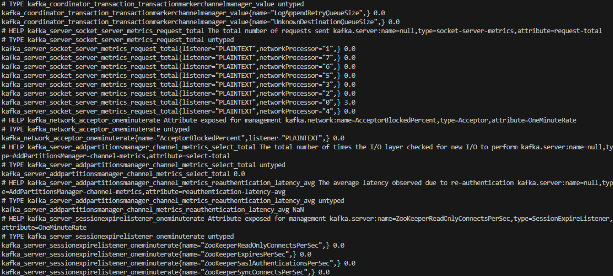

### Step3: Prometheus가 Kafka의 JMX 데이터를 수집하도록 설정 및 검증
- Prometheus 설정 파일(prometheus.yml)의 scrape_configs에 kafka를 추가합니다.
    - Prometheus가 실행 중이라면 Ctrl + C로 먼저 종료
    - Prometheus 폴더로 이동한 상태라면 그대로 실행
```sh
cd ~/prometheus-2.47.2.linux-amd64
nano prometheus.yml
```
```yml
scrape_configs:  
    - job_name: 'kafka'    
static_configs:      
    - targets: ['localhost:9094']
```
- Prometheus를 재시작하고 Kafka 데이터를 수집하는지 확인해야 합니다.
```sh
./prometheus --config.file=prometheus.yml
```
- Windows 브라우저에서 Prometheus UI에 접속합니다.
    - http://localhost:9090/targets

        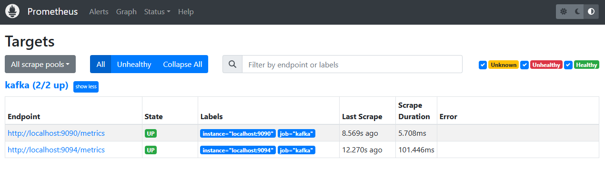
    - http://localhost:9090 -> `kafka_coordinator_group_groupmetadatamanager_value` 입력 후 Execute

        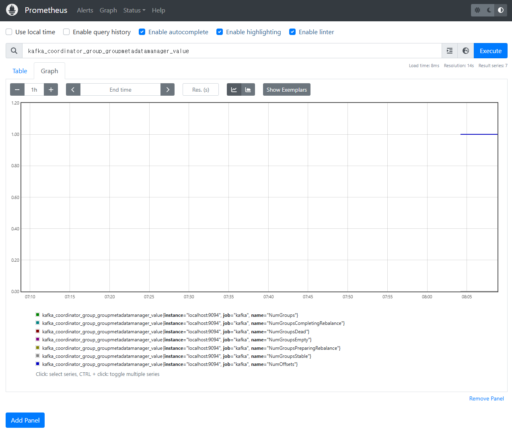

- Prometheus UI에서 Kafka 메트릭이 수집되었는지 확인합니다.
    - http://localhost:9094/metrics 에서 확인된 메트릭 중 하나를 실행

        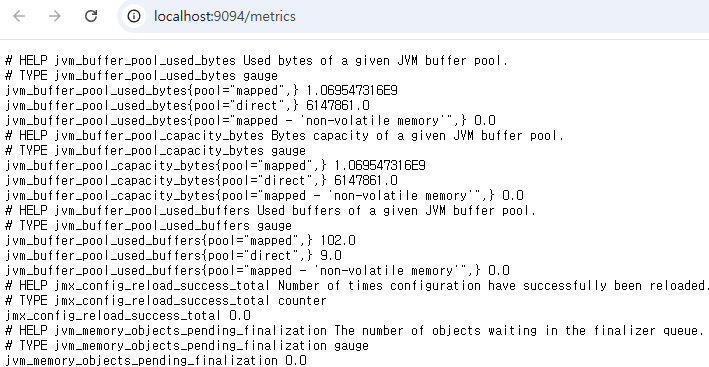
    - 예시
        - JVM 힙 메모리 사용량: `jvm_memory_bytes_used{area="heap"}`

            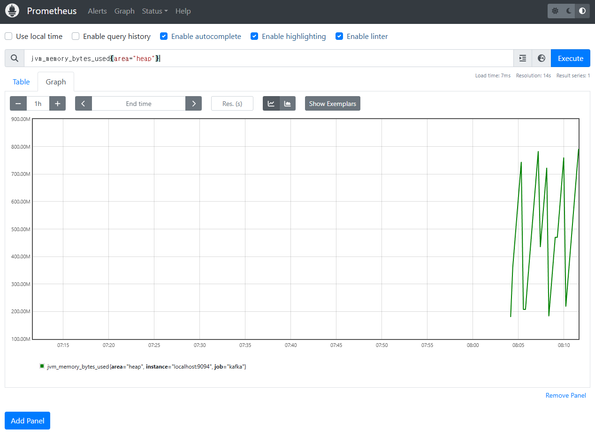
        - Direct Buffer 사용량: `jvm_buffer_pool_used_bytes{pool="direct"}`
        - 전체 buffer pool used bytes 조회: `jvm_buffer_pool_used_bytes`
        - heap committed 크기: `jvm_memory_bytes_committed{area="heap"}`
        - mapped buffer 사용량: `jvm_buffer_pool_used_bytes{pool="mapped"}`


## 실습4 <a id="m-ex-4"></a>
### 학습목표
Kafka 브로커의 메시지 처리 속도와 총 메시지 처리량을 확인하고, Prometheus API를 활용해 브로커의 성능 데이터를 수집합니다. 이후 Skeleton 코드를 작성하여 성능 데이터를 가져오는 기능을 구현하고, 수집된 데이터를 기반으로 Kafka 브로커의 성능을 분석하여 개선점을 도출합니다.
- Kafka 브로커의 메시지 처리 속도 및 총 메시지 처리량을 확인합니다.
- Prometheus API를 활용하여 Kafka 브로커 성능 데이터를 수집합니다.
- Skeleton 코드를 작성하여 성능 데이터를 가져오는 기능을 구현합니다.
- Kafka 브로커 성능을 분석하고 개선점을 도출합니다.  

### Step1: Kafka 브로커의 메시지 처리 속도 및 총 메시지 처리량 조회
- Prometheus에서 Kafka 브로커의 메시지 처리 속도를 확인합니다.
```sh
# ./prometheus --config.file=prometheus.yml -> 실행 상태 유지

# 새 터미널
# 메시지 처리 속도 조회
curl -G 'http://localhost:9090/api/v1/query' --data-urlencode 'query=kafka_server_brokertopicmetrics_meanrate{name="MessagesInPerSec"}'
```
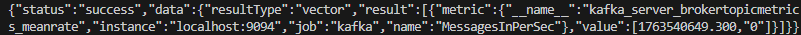

- Kafka 브로커의 총 메시지 처리량을 확인합니다.
```sh
# 누적 메시지 처리량 조회
curl -G 'http://localhost:9090/api/v1/query' --data-urlencode 'query=kafka_server_brokertopicmetrics_count{name="MessagesInPerSec"}'
```
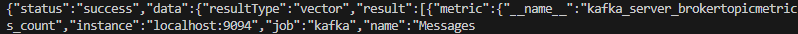

### Step2: Skeleton 코드 작성 및 실행
- 제공된 Skeleton 코드에서 `get_broker_metrics()` 함수를 완성하여 Kafka 브로커의 성능 데이터를 가져오도록 구현합니다.
- `analyze_broker_performance()` 함수를 작성하여 수집된 데이터를 기반으로 Kafka 성능을 평가합니다.
```py
# kafka_analysis.py 생성

"""
Kafka 브로커의 주요 성능 데이터를 수집하고 분석하는 스크립트입니다.

기능:
1. Prometheus API를 호출하여 Kafka 브로커 메트릭 수집
2. 수집된 데이터를 기반으로 성능 평가
"""

import requests

PROMETHEUS_URL = "http://localhost:9090/api/v1/query"  # Prometheus API 주소

# ==============================
# 메트릭 수집 함수
# ==============================
def get_broker_metrics():
    """
    Prometheus API를 호출하여 Kafka 브로커의 주요 메트릭(메시지 처리율, 누적 메시지 수)을 수집합니다.

    Returns:
        dict: {
            "message_rate": float,
            "message_count": float
        }
    """

    # 실제 Prometheus에서 Kafka JMX Exporter가 노출하는 메트릭 이름
    queries = {
        "message_rate": 'kafka_server_brokertopicmetrics_meanrate{name="MessagesInPerSec"}',
        "message_count": 'kafka_server_brokertopicmetrics_count{name="MessagesInPerSec"}'
    }

    metrics = {}

    for key, query in queries.items():
        try:
            # Prometheus API 호출
            res = requests.get(PROMETHEUS_URL, params={"query": query}, timeout=3)
            data = res.json()

            # 정상 응답 + 데이터 있음
            if len(data["data"]["result"]) > 0:
                value = float(data["data"]["result"][0]["value"][1])
                metrics[key] = value
            else:
                metrics[key] = 0.0

        except Exception as e:
            print(f"[WARN] Prometheus 쿼리 실패 ({key}): {e}")
            metrics[key] = None

    return metrics


# ==============================
# 성능 분석 함수
# ==============================
def analyze_broker_performance():
    """
    수집된 메트릭을 기반으로 Kafka 브로커의 성능을 평가합니다.
    """

    metrics = get_broker_metrics()
    rate = metrics.get("message_rate")
    total = metrics.get("message_count")

    # 수집 실패 시
    if rate is None or total is None:
        print("메트릭 수집 실패 - Prometheus 연결 상태 확인 필요.")
        return

    print("=== Kafka 브로커 성능 분석 결과 ===")

    # 성능 평가 조건
    if rate > 5000:
        print("메시지 처리 속도 매우 높음 → 클러스터 확장 고려")
    elif rate > 1000:
        print("메시지 처리 속도 양호함")
    else:
        print("메시지 처리 속도 낮음 → 트래픽 점검 필요")

    print(f"현재 메시지 처리 속도: {rate:.2f} msgs/sec")
    print(f"누적 메시지 처리량: {total:.0f} msgs")


# ==============================
# 실행 구간
# ==============================
if __name__ == "__main__":
    analyze_broker_performance()
```

### Step3: Kafka 브로커 성능 분석
- 메시지 처리 속도가 5000 msgs/sec 이상이면 "Kafka 브로커의 처리 속도가 매우 높습니다. 클러스터 확장을 고려하세요." 메시지를 출력합니다.
- 메시지 처리 속도가 1000~5000 msgs/sec이면 "Kafka 브로커의 처리 속도가 안정적입니다." 메시지를 출력합니다.
- 메시지 처리 속도가 1000 msgs/sec 미만이면 "Kafka 메시지 처리 속도가 낮습니다. 트래픽 증가 가능성을 점검하세요." 메시지를 출력합니다.
```sh
python3 kafka_analysis.py
```
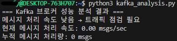

 
## 실습5 <a id="m-ex-5"></a>
### 학습목표
- Kafka Exporter를 설정하고 Prometheus에 연동합니다.
- Kafka 토픽 생성 후 메시지를 전송하고, 컨슈머를 실행한 뒤 종료하여 Lag 상황을 유도합니다.
- Grafana에서 공식 대시보드(Dashboard ID: 7589)를 Import하고 지표를 확인합니다.
- 컨슈머 Lag이 어떻게 증가하고, 메시지가 어떻게 소비되는지 대시보드를 통해 실시간으로 분석합니다.  

### Step1: Kafka Exporter 설치 및 실행
- 터미널 구성
    | 터미널 번호    | 역할                    | 실행할 것                 |
    | --------- | --------------------- | --------------------- |
    | **터미널 1** | Prometheus 실행         | `./prometheus`        |
    | **터미널 2** | Kafka Exporter 실행     | `./kafka_exporter`    |
    | **터미널 3** | Kafka / curl 테스트 / 확인 | `curl`, `grep`, 기타 명령 |

- Kafka Exporter 1.4.2 버전을 다운로드하고 실행하세요. 
```sh
# 터미널 2에서 실행 (Kafka Exporter 전용)
# cd ~
wget https://github.com/danielqsj/kafka_exporter/releases/download/v1.4.2/kafka_exporter-1.4.2.linux-amd64.tar.gz
tar -xvzf kafka_exporter-1.4.2.linux-amd64.tar.gz
cd kafka_exporter-1.4.2.linux-amd64
./kafka_exporter --kafka.server=localhost:9092 

# 이 터미널은 계속 켜둬야 함
```
- Prometheus를 시작합니다.
```sh
# 터미널 1에서 실행 (Prometheus 전용)
# 이미 Prometheus가 실행 중이면:
pkill prometheus

# 다시 실행:
./prometheus --config.file=prometheus.yml 
```
- Kafka Exporter가 컨슈머 Lag을 정상적으로 수집하는지 확인합니다.
```sh
curl http://localhost:9308/metrics | grep kafka_consumergroup_lag 
```
- prometheus.yml 안에 아래 설정이 반드시 있어야 함
```yaml
scrape_configs:
  - job_name: 'kafka_exporter'
    static_configs:
      - targets: ['localhost:9308']
```

- 메트릭 확인
```sh
curl http://localhost:9308/metrics | grep kafka_consumergroup_lag
```

### Step2: Kafka Exporter 기반 Grafana 대시보드 구성
- musl 설치
```sh
sudo apt-get update
sudo apt-get install -y musl
```
- Grafana 설치
```sh
sudo apt-get install -y adduser libfontconfig1
wget https://dl.grafana.com/enterprise/release/grafana-enterprise_11.2.0_amd64.deb
sudo dpkg -i grafana-enterprise_11.2.0_amd64.deb
```

- Grafana 실행
```sh
sudo service grafana-server start
```
- 상태 확인
```sh
sudo service grafana-server status

# Active: active (running) -> 정상 실행
```

- Grafana UI에서 대시보드(Dashboard ID: 7589)를 Import합니다. 
- http://localhost:3000
- 로그인: skip
- Prometheus 데이터 소스 등록
    - Settings (Configuration) → Data Sources
    - 오른쪽 위 “Add data source” 클릭
    - 목록에서 Prometheus 선택
        | 항목         | 값                          |
        | ---------- | -------------------------- |
        | **Name**   | Prometheus                 |
        | **URL**    | `http://localhost:9090`    |
        | **Access** | Browser 또는 Server (둘 다 가능) |
    - "Save & Test" 버튼 클릭
- Dashboard → Import
- Dashboard ID 입력: 7589
- Prometheus 데이터 소스 연결
- 데이터 보내고 Grafana 확인
    ```sh
    # 터미널 1
    ./bin/kafka-console-producer.sh \
    --topic lecture-test-topic \
    --bootstrap-server localhost:9092

    # 터미널 2
    ./bin/kafka-console-consumer.sh \
    --topic lecture-test-topic \
    --from-beginning \
    --bootstrap-server localhost:9092
    ```

    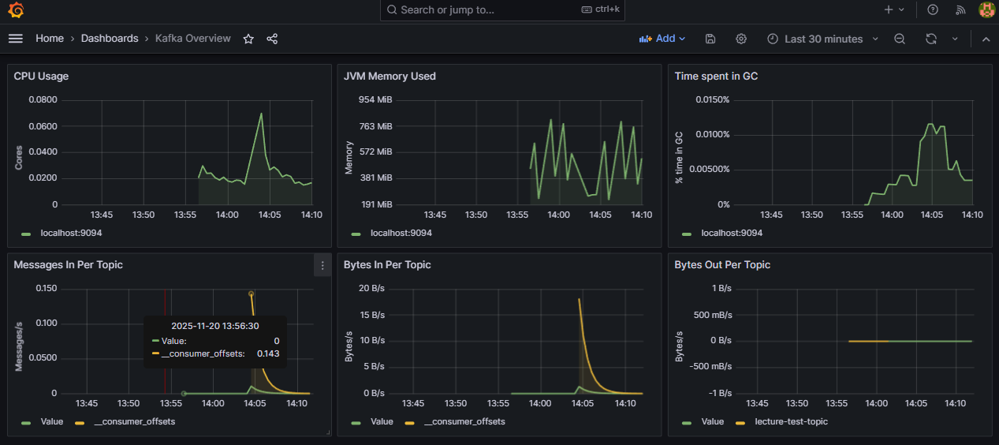


### Step3: Kafka 컨슈머 그룹 및 메시지 소비량 분석
- Grafana의 Metrics Browser를 사용하여 적절한 Kafka Exporter 메트릭을 검색
    - Grafana Metrics Browser(메트릭 탐색기) 열기
    - Grafana 왼쪽 메뉴 → Explore(돋보기 아이콘) 클릭

        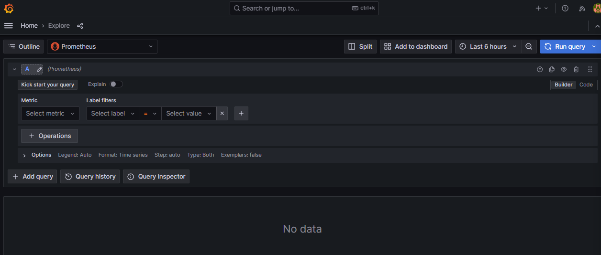
- 핵심 Kafka Exporter 메트릭 정리
    | 분석 목적                 | Prometheus Metric 이름                   |
    | --------------------- | -------------------------------------- |
    | 컨슈머 Lag               | `kafka_consumergroup_lag`              |
    | 컨슈머 그룹별 Lag 합계        | `kafka_consumergroup_lag_sum`          |
    | 컨슈머 오프셋(현재 어디까지 읽었는지) | `kafka_consumergroup_offset`           |
    | 파티션별 Producer가 보낸 오프셋 | `kafka_topic_partition_current_offset` |

- 컨슈머 그룹별 메시지 소비량, Lag 변화, 메시지 소비율 등을 시각화
    - Grafana Explore에서 다음 쿼리를 입력:
    - `kafka_consumergroup_lag{consumergroup="test-group"}`

        


## 과제1 <a id="m-hw-1"></a>
### 학습목표
Kafka Exporter를 설정해 Prometheus가 컨슈머 Lag 데이터를 수집하도록 구성하고, Prometheus API를 활용해 특정 컨슈머 그룹의 Lag을 주기적으로 조회하는 코드를 작성합니다. 이후 일정 주기(예: 5초)마다 Lag을 출력하며, 특정 임계값을 초과할 경우 경고 메시지를 표시하도록 구현합니다. 또한 CLI에서 프로듀서를 실행해 메시지를 전송하여 Lag 증가를 확인하고, 컨슈머를 실행해 메시지를 소비하면서 Lag이 감소하는 과정을 검증합니다.
- Kafka Exporter를 설정하여 Prometheus가 컨슈머 Lag을 수집하도록 구성합니다.
- Prometheus API를 사용하여 특정 컨슈머 그룹의 Lag을 주기적으로 조회하는 코드를 작성합니다.
- 일정 주기(예: 5초)마다 Lag을 출력하고, 특정 임계값을 초과하면 경고 메시지를 출력합니다.
- CLI에서 프로듀서를 실행하고 메시지를 전송하여 Lag 증가를 확인합니다.
- 컨슈머를 실행하여 메시지를 소비하고 Lag이 감소하는 것을 확인합니다.  

### Step0: Step1 실행 전 세팅
- 모든 프로세스 포트 충돌 체크 후 정리 (중복 실행 예방)
```sh
ps aux | grep kafka
ps aux | grep zookeeper

# 중복 있으면 종료
pkill -f kafka
pkill -f zookeeper

# 특정 PID만 죽이려면
kill -9 <PID>
```

- 포트 점검
    | 서비스            | 포트   |
    | -------------- | ---- |
    | Zookeeper      | 2181 |
    | Kafka          | 9092 |
    | Kafka Exporter | 9308 |
    | Prometheus     | 9090 |
    | Grafana        | 3000 |

- Zookeeper 시작
```sh
# 주키퍼 실행
./bin/zookeeper-server-start.sh config/zookeeper.properties

# 확인
ps aux | grep zookeeper
```
- Kafka 브로커 시작
```sh
# 카프카 실행
./bin/kafka-server-start.sh config/server.properties

# 확인
ps aux | grep kafka
```

- Kafka Topic 생성
```sh
# test-topic 새로 만들기
cd ~/kafka/bin
./kafka-topics.sh --create --topic test-topic --bootstrap-server localhost:9092 --partitions 1 --replication-factor 1

# 토픽 확인
./kafka-topics.sh --list --bootstrap-server localhost:9092
```

- Consumer Group 생성
```sh
# 컨슈머 그룹은 “생성”하는 명령이 없음
# 컨슈머를 실행하면 자동 생성됨

./kafka-console-consumer.sh \
  --bootstrap-server localhost:9092 \
  --topic test-topic \
  --group test-group

# 확인
./kafka-consumer-groups.sh --list --bootstrap-server localhost:9092
```

- Producer 실행
```sh
# 새 터미널

cd ~/kafka/bin
./kafka-console-producer.sh --broker-list localhost:9092 --topic test-topic

# 메시지 입력
# hello
# world
# test
```
- Lag 발생시키는 방법
    - Lag을 증가시키고 싶으면:
        1. 컨슈머 종료
        2. 프로듀서로 메시지 계속 입력


### Step1: Kafka Exporter를 활용한 컨슈머 Lag 데이터 수집
```sh
cd kafka_exporter-1.4.2.linux-amd64
./kafka_exporter --kafka.server=localhost:9092
```
- 이 터미널은 계속 열어둠
- 9308 포트에서 `/metrics` 제공

### Step2: Kafka Exporter가 실행 중인지 확인
```sh
# Kafka Exporter 정상 동작하는지 확인
curl http://localhost:9308/metrics | grep kafka_consumergroup_lag
```

### Step3: 특정 컨슈머 그룹의 Lag 데이터를 가져오는 API 호출
```sh
curl -s http://localhost:9308/metrics | grep 'kafka_consumergroup_lag{consumergroup="test-group"}'
```

### Step4: Skeleton 코드 작성 및 실행
- 제공된 Skeleton 코드에서 `get_consumer_lag()` 함수를 완성하고, 일정 주기마다 Lag을 출력하도록 구현합니다.
```py
# consumer_lag_monitor.py

"""
Kafka Exporter를 활용하여 특정 컨슈머 그룹의 Lag을 모니터링하는 스크립트입니다.

TODO:
1. Kafka Exporter(9308 포트)의 /metrics 데이터를 호출하여 특정 컨슈머 그룹의 Lag을 추출합니다.
2. 일정 주기(예: 5초)마다 Lag을 출력합니다.
3. Lag 값이 특정 임계값(예: 100 이상)을 초과하면 경고 메시지를 출력합니다.
"""

import time
import requests

# 설정 값
PROMETHEUS_URL = "http://localhost:9308/metrics"  # Kafka Exporter 주소
CONSUMER_GROUP = "test-group"  # 모니터링할 컨슈머 그룹명
LAG_THRESHOLD = 100            # Lag 임계값
CHECK_INTERVAL = 5             # 체크 주기 (초)

# -----------------------------------------
# 1. 특정 컨슈머 그룹의 Lag 합계를 가져오는 함수
# -----------------------------------------
def get_consumer_lag():
    try:
        response = requests.get(PROMETHEUS_URL)
        lines = response.text.split('\n')
        total_lag = 0

        for line in lines:
            if f'kafka_consumergroup_lag{{consumergroup="{CONSUMER_GROUP}"' in line:
                try:
                    lag_value = float(line.split()[-1])
                    total_lag += lag_value
                except:
                    continue

        return total_lag

    except Exception as e:
        print(f"ERROR: Kafka Exporter 접근 실패 → {e}")
        return None


# -----------------------------------------
# 2. 일정 주기마다 Lag 모니터링
# -----------------------------------------
print(f"▶ Monitoring Kafka Consumer Group Lag: {CONSUMER_GROUP}")

while True:
    lag = get_consumer_lag()

    if lag is None:
        print("Lag 데이터를 가져올 수 없습니다. Kafka Exporter 상태를 확인하세요.")
    else:
        print(f"Current Lag for {CONSUMER_GROUP}: {lag}")

        if lag >= LAG_THRESHOLD:
            print("⚠ WARNING: Consumer Lag is too high!")

    time.sleep(CHECK_INTERVAL)
```

### Step5: CLI를 사용하여 Lag 변화 확인
- 컨슈머 그룹이 실행되지 않은 상태에서 프로듀서를 실행하여 Lag이 증가하는 것을 확인합니다.
    - Kafka Exporter 실행은 이미 하고 있어야함(터미널 A)

- 컨슈머를 실행하여 메시지를 소비하고 Lag이 감소하는지 확인합니다.
    - Lag 모니터링 Python 스크립트 실행 (터미널 B)
```sh
python3 consumer_lag_monitor.py
```

- 컨슈머는 잠시 끄고 Lag 증가시키기 (터미널 C) 
    - Lag을 증가시키려면 컨슈머가 메시지를 읽지 않고 있어야 함
    - 컨슈머가 실행중인 터미널에서 `Ctrl + C` 로 종료

- 프로듀서 실행해서 Lag 증가시키기 (터미널 C)
```sh
cd ~/kafka/bin
./kafka-console-producer.sh --broker-list localhost:9092 --topic test-topic

# 메시지 입력
# hello
# msg1
# msg2
# msg3
# msg4
```

- Lag 증가 확인 (터미널 B, Python 모니터링)
    - Python 모니터링 터미널에서 값이 증가하는지 확인:


- 컨슈머 실행해서 Lag 감소 확인 (터미널 D)
```sh
cd ~/kafka/bin
./kafka-console-consumer.sh \
  --bootstrap-server localhost:9092 \
  --topic test-topic \
  --group test-group

# 컨슈머가 메시지를 읽으면 Lag이 줄어든다
```


## 과제2 <a id="m-hw-2"></a>
### 학습목표
Grafana를 설치하고 브라우저에서 실행한 뒤, Prometheus를 Grafana의 데이터 소스로 연결하여 메트릭 데이터를 불러옵니다. 이후 Kafka의 주요 성능 지표(CPU 사용량, JVM 메모리, GC 시간, 메시지 수신량, 바이트 입출력 등)를 시각화하는 공식 대시보드를 Import하고, 구성된 대시보드를 통해 Kafka 브로커의 성능 상태를 실시간으로 모니터링합니다.
- Grafana를 설치하고 브라우저에서 실행합니다.
- Prometheus를 Grafana의 데이터 소스로 연결하여 메트릭 데이터를 불러옵니다.
- Kafka의 성능 지표(CPU 사용량, JVM 메모리, GC 시간, 메시지 수신량, 바이트 입출력 등)를 시각화하는 공식 대시보드를 Import합니다.
- 구성된 대시보드를 통해 Kafka 브로커의 주요 성능 상태를 실시간으로 모니터링합니다.  

### Step1: Grafana 설치 및 실행
- 터미널에서 다음 명령어를 순차적으로 실행하여 Grafana 10.2.2를 설치합니다. 
```bash
wget https://dl.grafana.com/oss/release/grafana-10.2.2.linux-amd64.tar.gz
tar -xvzf grafana-10.2.2.linux-amd64.tar.gz
cd grafana-10.2.2
./bin/grafana-server
``` 
- Windows 브라우저에서 Grafana UI 접속
    - 주소: http://localhost:3000
    - 로그인 정보: admin / admin

- Prometheus 실행
```sh
cd ~/prometheus
./prometheus --config.file=prometheus.yml
```

### Step2: Prometheus 데이터 소스 추가
- Grafana UI에서 Connections → Data Sources로 이동합니다.
- "Add data source" 버튼을 클릭하고 Prometheus를 선택합니다.
- URL을 http://localhost:9090으로 설정한 후 Save & Test를 클릭하여 연결을 확인합니다. 

### Step3: Kafka 모니터링 대시보드 Import
- Grafana UI 상단 메뉴에서 + → Import로 이동합니다.
- Dashboard ID: 721을 입력하고 Load 버튼을 클릭합니다. 
    - (링크 : https://grafana.com/grafana/dashboards/721-kafka/)
- 데이터 소스로 Prometheus를 선택하고 Import를 클릭합니다.

### Step4: 주요 메트릭 확인 및 분석
- Import된 대시보드에서는 다음과 같은 Kafka 주요 메트릭이 시각화되어 있어야 합니다. 
    - CPU Usage
    - JVM Memory Used
    - Time spent in GC
    - Messages In per Topic
    - Bytes In per Topic
    - Bytes Out per Topic 

### Step5: 실습 결과 제출
- 대시보드를 구성한 후, 주요 패널의 시각화하세요

### Step6: 진행시 유의사항
- ① 메시지 전송 필수 
    - 다음 메트릭은 Kafka에 메시지가 실제로 전송되어야만 시각화 패널에 데이터가 나타납니다. 
        - Messages In per Topic
        - Bytes In per Topic
        - Bytes Out per Topic 
    - 따라서 실습 중에는 `kafka-console-producer.sh`를 활용하여 테스트 메시지를 반드시 전송해 보세요. 
- ② 쿼리 수정 필요성 
    - 공식 대시보드가 업데이트된 지 다소 시간이 지나, 일부 패널에서는 메트릭이 비정상적으로 표시되거나 사라지는 경우가 있습니다. 
    - 이럴 경우, 다음과 같은 쿼리로 수정하면 보다 안정적으로 메트릭이 표시됩니다: 
        - `sum by(topic) (kafka_server_BrokerTopicMetrics_OneMinuteRate{name="MessagesInPerSec"})`
        - `sum by(topic) (kafka_server_BrokerTopicMetrics_OneMinuteRate{name="BytesInPerSec"})` 
        - `sum by(topic) (kafka_server_BrokerTopicMetrics_OneMinuteRate{name="BytesOutPerSec"})` 
    - 수정된 쿼리는 토픽별 합계(sum by topic) 방식으로 데이터를 그룹화하여 시각화합니다.
    - 왜 이 방식이어야 진행이 되는지, 어떤 변화가 있었는지 한번 확인해보세요.
