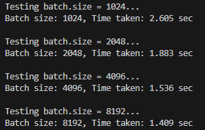
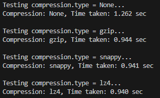
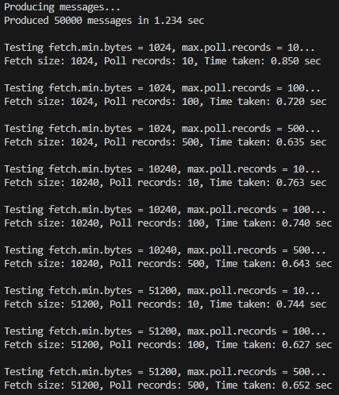
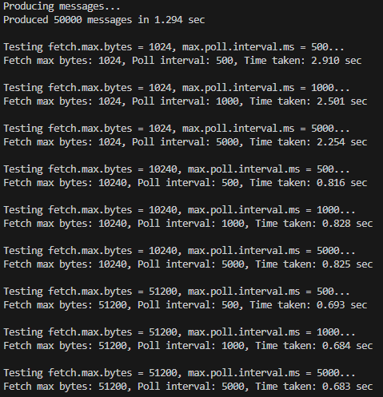

# Kafka 최적화
## 실습1
### 학습목표
Kafka 프로듀서를 생성하여 batch.size 값을 설정하고, 메시지를 전송하면서 실행 시간을 측정한 뒤, batch.size 값을 변경하며 실험을 수행하고 그 결과를 비교합니다.

- Kafka 프로듀서를 생성하고 batch.size 값을 설정합니다.
- 메시지를 전송하고 실행 시간을 측정합니다.
- batch.size 값을 변경하며 실험하고 결과를 비교합니다.  

### Step1: batch.size를 변경하며 메시지 전송하기
Kafka Producer 설정 중 `batch.size`는
Producer가 하나의 배치에 모아서 압축/전송할 수 있는 최대 바이트 크기임

- 배치 크기가 크면:
    - 더 많은 메시지를 한 번에 묶어 보낼 수 있음 → 네트워크 효율↑
    - 하지만 대기 시간이 길어질 수 있음
```python
BATCH_SIZES = [1024, 2048, 4096, 8192]

for batch_size in BATCH_SIZES:
    producer = KafkaProducer(
        bootstrap_servers=BROKER,
        batch_size=batch_size,
        acks=1,
        linger_ms=20
    )
```

### Step2: 메시지 크기 100 bytes로 설정
- 100바이트짜리 메시지를 만들어야 batch.size 효과가 명확해짐
- JSON 구조를 유지하기 위해 문자열 길이를 조절하여 100바이트 근처로 맞춤
```python
MESSAGE_SIZE = 100
MESSAGE_PAYLOAD = json.dumps({"data": "A" * (MESSAGE_SIZE - 20)}).encode('utf-8')
```

### Step3: 동일한 개수의 메시지를 전송하고 실행 시간 측정
- 각 batch.size 값별로 **동일한 메시지 개수(50,000개)**를 보내며 시간을 측정
```python
start_time = time.time()

for _ in range(NUM_MESSAGES):
    producer.send(TOPIC, MESSAGE_PAYLOAD)

producer.flush()
elapsed_time = time.time() - start_time
```

### Step4: 실험 결과를 비교하여 배치 크기의 영향을 분석하기
- 실행 방법
```sh
# 주키퍼 실행
./bin/zookeeper-server-start.sh config/zookeeper.properties
# 카프카 실행
./bin/kafka-server-start.sh config/server.properties
```
```python
# batch_test.py 생성

"""
Kafka 프로듀서의 배치 크기(`batch.size`) 변경이 메시지 전송 속도에 미치는 영향을 측정하는 실습입니다.

TODO:
1. Kafka 프로듀서를 생성하고 `batch.size`, `compression.type`, `linger.ms` 값을 변경하며 메시지를 전송합니다.
2. 서로 다른 설정에서 메시지 처리 속도를 비교합니다.
3. 메시지를 모두 보낼 때까지 걸린 시간을 출력합니다.

sudo apt-get update
sudo apt-get install -y g++ make cmake autoconf automake libtool pkg-config libsnappy-dev
pip install --no-binary :all: python-snappy==0.5.4
를 실행해야 snappy 압축이 정상동작 합니다.
"""

from kafka import KafkaProducer
import time
import json
# 설정 값
BROKER = "localhost:9092"
TOPIC = "test-topic"
BATCH_SIZES = [1024, 2048, 4096, 8192]  # 1KB, 2KB, 4KB, 8KB
NUM_MESSAGES = 50000  # 메시지 개수를 50,000개로 유지
MESSAGE_SIZE = 100  # 메시지 크기를 100바이트로 설정

# TODO 1: 100바이트 크기의 JSON 메시지를 생성
# 20정도를 빼서 보정하여 실제 메시지 크기가 100바이트에 가깝게 되도록 함
MESSAGE_PAYLOAD = json.dumps({"data": "A" * (MESSAGE_SIZE - 20)}).encode('utf-8')  # 메시지 크기 설정

# TODO 2: 서로 다른 배치 크기에서 메시지 처리 속도를 비교
for batch_size in BATCH_SIZES:
    print(f"Testing batch.size = {batch_size}...")

    # TODO 3: Kafka 프로듀서를 생성하고 설정 변경
    producer = KafkaProducer(
        bootstrap_servers=BROKER,  # Kafka 브로커 주소 설정
        batch_size=batch_size,  # 배치 크기 설정
        acks=1,  # 메시지 전송 확인 설정
        linger_ms=20  # 배치를 충분히 모으도록 설정 증가
    )

    # TODO 4: 메시지 전송 시작 시간 기록
    start_time = time.time()

    # TODO 5: NUM_MESSAGES 개수만큼 메시지 전송
    for _ in range(NUM_MESSAGES):  # 메시지 전송 반복 횟수
        producer.send(TOPIC, MESSAGE_PAYLOAD)  # 메시지 전송

    # TODO 6: 모든 메시지 전송 완료 후 시간 측정
    producer.flush()
    elapsed_time = time.time() - start_time

    # TODO 7: 결과 출력
    print(f"Batch size: {batch_size}, Time taken: {elapsed_time:.3f} sec\n")

    # TODO 8: 테스트 간 간격 추가
    time.sleep(2)  # 테스트 간 2초 대기
```
```sh
python3 batch_test.py
```
- 실행 결과
    
    
    - `batch.size`가 증가할수록 속도 개선됨
    - 이는 더 많은 메시지를 한 번에 묶어서 전송하기 때문
    - 하지만 너무 크면 메모리 사용 증가


## 실습2
### 학습목표
Kafka 프로듀서를 생성하고 compression.type을 설정한 뒤, `none`, `gzip`, `snappy`, `lz4`로 변경하며 동일한 개수(`NUM_MESSAGES = 50000`)의 메시지를 전송하고 실행 시간을 측정하며, 각 압축 방식의 전송 속도와 네트워크 사용량을 비교·분석합니다.

- Kafka 프로듀서를 생성하고 `compression.type`을 설정합니다.
- `compression.type`을 none, gzip, snappy, lz4로 변경하며 메시지를 전송합니다.
- 동일한 개수(`NUM_MESSAGES = 50000`)의 메시지를 전송하고 실행 시간을 측정합니다.
- 각 압축 방식의 전송 속도 및 네트워크 사용량을 비교하여 분석합니다.  

### Step1: compression.type을 none, gzip, snappy, lz4로 변경하며 메시지 전송
- compression_type 값만 바꿔가며 KafkaProducer 설정을 반복 실행
- Kafka가 기본 제공하는 압축 방식 비교
    - None (압축 없음)
    - gzip
    - snappy
    - lz4
```python
COMPRESSION_TYPES = [None, "gzip", "snappy", "lz4"]

for compression_type in COMPRESSION_TYPES:
    producer = KafkaProducer(
        bootstrap_servers=BROKER,
        compression_type=compression_type,
        batch_size=16384,
        linger_ms=5,
        acks=1
    )
```

### Step2: 메시지 크기 100 bytes로 설정
Kafka 전송량을 일정하게 유지하기 위해 JSON 메시지를 100 bytes로 구성

```python
MESSAGE_PAYLOAD = json.dumps({"data": "A" * (MESSAGE_SIZE - 20)}).encode('utf-8')
```
### Step3: 동일한 개수의 메시지를 전송하고 실행 시간을 측정
모든 압축 방식에서 5만 개(NUM_MESSAGES) 메시지를 동일하게 전송하여 시간 비교

```python
start_time = time.time()

for _ in range(NUM_MESSAGES):
    producer.send(TOPIC, MESSAGE_PAYLOAD)

producer.flush()
elapsed_time = time.time() - start_time
```

### Step4: 각 압축 방식별 성능 차이를 비교하고 분석
- 실행 방법
```sh
# 주키퍼 실행
./bin/zookeeper-server-start.sh config/zookeeper.properties
# 카프카 실행
./bin/kafka-server-start.sh config/server.properties
```
```python
# compression_benchmark.py 생성

"""
Kafka 프로듀서에서 Gzip 및 Snappy 압축을 적용하여 메시지 전송 속도를 비교하는 실습입니다.

TODO:
1. Kafka 프로듀서를 생성하고 `batch.size`, `compression.type`, `linger.ms` 값을 변경하며 메시지를 전송합니다.
2. 서로 다른 설정에서 메시지 처리 속도를 비교합니다.
3. 메시지를 모두 보낼 때까지 걸린 시간을 출력합니다.

sudo apt-get update && sudo apt-get install -y g++ make cmake autoconf automake libtool pkg-config libsnappy-dev liblz4-dev python3-dev build-essential \
&& pip install --no-binary :all: python-snappy==0.5.4 \
&& pip install --no-cache-dir --no-binary :all: lz4==3.1.3
를 실행해야 snappy 압축이 정상동작 합니다.
"""

from kafka import KafkaProducer
import time
import json

# 설정 값
BROKER = "localhost:9092"
TOPIC = "test-topic"
COMPRESSION_TYPES = [None, "gzip", "snappy", "lz4"]  # 압축 없음, Gzip, Snappy, LZ4
NUM_MESSAGES = 50000  # 메시지 개수
MESSAGE_SIZE = 100  # 메시지 크기 100 bytes

# TODO 1: 100바이트 크기의 JSON 메시지를 생성
MESSAGE_PAYLOAD = json.dumps({"data": "A" * (MESSAGE_SIZE - 20)}).encode('utf-8')

# TODO 2: 압축 방식별 성능 측정
for compression_type in COMPRESSION_TYPES:
    print(f"Testing compression.type = {compression_type}...")

    # TODO 3: KafkaProducer 생성
    producer = KafkaProducer(
        bootstrap_servers=BROKER,
        compression_type=compression_type,
        batch_size=16384,      # 기본 배치 크기
        linger_ms=5,           # 배치를 위한 딜레이
        acks=1                 # 전송 확인
    )

    # TODO 4: 메시지 전송 시작 시간 기록
    start_time = time.time()

    # TODO 5: NUM_MESSAGES 개수만큼 메시지 전송
    for _ in range(NUM_MESSAGES):
        producer.send(TOPIC, MESSAGE_PAYLOAD)

    # TODO 6: flush() 후 시간 측정
    producer.flush()
    elapsed_time = time.time() - start_time

    # TODO 7: 결과 출력
    print(f"Compression: {compression_type}, Time taken: {elapsed_time:.3f} sec\n")

    # TODO 8: 테스트 간 간격
    time.sleep(2)
```
```sh
python3 compression_benchmark.py
```

- 실행 결과

    
    - 압축하지 않으면 CPU 부담은 적지만, 전송해야 할 데이터 양이 크기 때문에 네트워크 병목이 발생 → 가장 느림


## 실습3
### 학습목표
Kafka 프로듀서를 생성해 메시지를 전송하고, `fetch.min.bytes`와 `max.poll.records` 값을 조정하며 컨슈머를 실행한 뒤, 동일한 개수의 메시지를 소비하면서 실행 시간을 측정하고 각 설정값에 따른 메시지 소비 속도를 비교·분석합니다.
- Kafka 프로듀서를 생성하여 메시지를 전송합니다.
- `fetch.min.bytes` 및 `max.poll.records` 값을 조정하며 컨슈머를 실행합니다.
- 동일한 개수의 메시지를 소비하고 실행 시간을 측정합니다.
- 각 설정값에서 메시지 소비 속도를 비교하여 분석합니다.  

### Step1: `fetch.min.bytes` 값을 1KB, 10KB, 50KB로 변경하며 메시지 소비하기
- `fetch.min.bytes` 는 컨슈머가 최소 이만큼의 데이터가 모일 때까지 기다렸다가 가져오도록 하는 옵션
- 값이 클수록 한 번에 많이 가져오지만, 첫 메시지를 받기까지의 지연(latency) 는 늘어날 수 있음
```python
FETCH_SIZES = [1024, 10240, 51200]  # 1KB, 10KB, 50KB
...
for fetch_size in FETCH_SIZES:
    ...
    consumer = KafkaConsumer(
        TOPIC,
        bootstrap_servers=BROKER,
        auto_offset_reset="earliest",
        enable_auto_commit=False,
        fetch_min_bytes=fetch_size,
        max_poll_records=poll_records
    )
```

### Step2: `max.poll.records` 값을 10, 100, 500으로 변경하며 실험하기
- `max.poll.records` 는 한 번 `poll()` 호출에서 최대 몇 개의 레코드를 가져올지를 의미함
- 값이 클수록 루프/네트워크 호출 횟수가 줄어들어 처리량이 좋아질 수 있음
```python
POLL_RECORDS = [10, 100, 500]
...
for fetch_size in FETCH_SIZES:
    for poll_records in POLL_RECORDS:
        ...
        consumer = KafkaConsumer(
            ...,
            fetch_min_bytes=fetch_size,
            max_poll_records=poll_records
        )
```

### Step3: 동일한 개수의 메시지를 소비하고 실행 시간 측정
- 모든 조합(`fetch.min.bytes` × `max.poll.records`)에 대해 같은 수(50,000개)의 메시지를 소비
- `time.time()` 으로 시작/종료 시각을 기록해서 경과 시간 비교
- 메시지 생산 부분:
    ```python
    MESSAGE_PAYLOAD = json.dumps({"data": "A" * (MESSAGE_SIZE - 20)}).encode("utf-8")

    producer = KafkaProducer(...)
    start_time = time.time()
    for _ in range(NUM_MESSAGES):
        producer.send(TOPIC, MESSAGE_PAYLOAD)
    producer.flush()
    elapsed_time = time.time() - start_time
    print(f"Produced {NUM_MESSAGES} messages in {elapsed_time:.3f} sec\n")
    ```
- 소비 측정 부분:
    ```python
    start_time = time.time()

    message_count = 0
    for message in consumer:
        message_count += 1
        if message_count >= NUM_MESSAGES:
            break

    elapsed_time = time.time() - start_time
    print(
        f"Fetch size: {fetch_size}, "
        f"Poll records: {poll_records}, "
        f"Time taken: {elapsed_time:.3f} sec\n"
    )

    ```

### Step4: 각 설정값에서 메시지 소비 속도를 비교 분석
- 실행 방법
```sh
# 주키퍼 실행
./bin/zookeeper-server-start.sh config/zookeeper.properties
# 카프카 실행
./bin/kafka-server-start.sh config/server.properties
```
```python
# consumer_fetch_experiment.py 생성

"""
Kafka 프로듀서에서 메시지를 생성하고, 컨슈머에서 `fetch.min.bytes` 및 `max.poll.records` 값을 변경하며
메시지 소비 속도를 실험하는 코드입니다.
"""

from kafka import KafkaProducer, KafkaConsumer
import time
import json

# 설정 값
BROKER = "localhost:9092"
TOPIC = "test-topic"
FETCH_SIZES = [1024, 10240, 51200]  # 1KB, 10KB, 50KB
POLL_RECORDS = [10, 100, 500]       # 10개, 100개, 500개
NUM_MESSAGES = 50000                # 총 메시지 개수
MESSAGE_SIZE = 100                  # 메시지 크기를 100바이트로 설정

# TODO 1: 100바이트 크기의 JSON 메시지를 생성
MESSAGE_PAYLOAD = json.dumps({"data": "A" * (MESSAGE_SIZE - 20)}).encode("utf-8")

# TODO 2: Kafka 프로듀서를 생성하고 메시지 발행
print("Producing messages...")

producer = KafkaProducer(
    bootstrap_servers=BROKER,  # Kafka 브로커 주소 설정
    batch_size=16384,          # 배치 크기 설정
    linger_ms=5,               # 배치를 적절히 활용하도록 설정
    acks=1                     # 메시지 전송 확인 설정
)

# TODO 3: NUM_MESSAGES 개수만큼 메시지 전송
start_time = time.time()  # 메시지 전송 시작 시간 기록
for _ in range(NUM_MESSAGES):
    producer.send(TOPIC, MESSAGE_PAYLOAD)

producer.flush()  # 모든 메시지 전송 완료
elapsed_time = time.time() - start_time  # 경과 시간 측정
print(f"Produced {NUM_MESSAGES} messages in {elapsed_time:.3f} sec\n")

# TODO 4: 서로 다른 Fetch size 및 Poll 간격 설정을 조합하여 컨슈머 테스트
for fetch_size in FETCH_SIZES:
    for poll_records in POLL_RECORDS:
        print(f"Testing fetch.min.bytes = {fetch_size}, max.poll.records = {poll_records}...")

        # TODO 5: Kafka 컨슈머를 생성하고 설정 변경
        consumer = KafkaConsumer(
            TOPIC,
            bootstrap_servers=BROKER,   # Kafka 브로커 주소 설정
            auto_offset_reset="earliest",  # 오프셋 초기화 방식 설정
            enable_auto_commit=False,      # 자동 오프셋 커밋 비활성화 (매번 처음부터 읽도록)
            fetch_min_bytes=fetch_size,    # 최소 Fetch 크기 설정
            max_poll_records=poll_records  # 최대 Poll 개수 설정
        )

        # TODO 6: 메시지 소비 시작 시간 기록
        start_time = time.time()

        # TODO 7: NUM_MESSAGES 개수만큼 메시지 소비
        message_count = 0
        for message in consumer:
            message_count += 1
            if message_count >= NUM_MESSAGES:  # 원하는 메시지 개수 도달 시 종료
                break

        # TODO 8: 모든 메시지 소비 완료 후 시간 측정
        elapsed_time = time.time() - start_time

        # TODO 9: 결과 출력
        print(
            f"Fetch size: {fetch_size}, "
            f"Poll records: {poll_records}, "
            f"Time taken: {elapsed_time:.3f} sec\n"
        )

        # TODO 10: 테스트 간 간격 추가
        time.sleep(2)  # 테스트 간 2초 대기
```
```sh
python3 consumer_fetch_experiment.py
```
- 실행 결과

    
    - `fetch.min.bytes` 증가 → 한 번에 더 많은 데이터 패치 → 네트워크 효율↑ / latency↑
    - `max.poll.records` 증가 → 애플리케이션 레벨 루프/오버헤드 감소 → 처리량↑
    - 너무 크게 잡으면 처음 읽기까지 지연이 길어질 수 있으므로, 실시간성 vs 처리량 트레이드오프 설명 가능


## 실습4
### 학습목표
Kafka 프로듀서를 생성해 메시지를 전송하고, fetch.max.bytes와 max.poll.interval.ms 값을 조정하며 컨슈머를 실행한 뒤, 동일한 개수의 메시지를 소비하면서 실행 시간을 측정하고 각 설정값에 따른 메시지 소비 속도를 비교·분석합니다.

- Kafka 프로듀서를 생성하여 메시지를 전송합니다.
- `fetch.max.bytes` 및 `max.poll.interval.ms` 값을 조정하며 컨슈머를 실행합니다.
- 동일한 개수의 메시지를 소비하고 실행 시간을 측정합니다.
- 각 설정값에서 메시지 소비 속도를 비교하여 분석합니다.  

### Step1: fetch.max.bytes 값을 1KB, 10KB, 50KB로 변경하며 메시지 소비하기
- `fetch.max.bytes`
    - 컨슈머가 한 번에 가져올 수 있는 최대 데이터 크기
    - 값이 크면 한 번에 더 많은 메시지를 가져와서 효율 ↑
- 실험 값:
    | 설정    | 의미               |
    | ----- | ---------------- |
    | 1024  | 1KB만 가져옴 → 작은 페치 |
    | 10240 | 10KB             |
    | 51200 | 50KB → 대량 페치     |

```python
FETCH_SIZES = [1024, 10240, 51200]
consumer = KafkaConsumer(..., fetch_max_bytes=fetch_size)
```

### Step2: max.poll.interval.ms 값을 500ms, 1000ms, 5000ms로 변경하며 실험하기
- `max.poll.interval.ms`
    - `poll()` 호출 간 최장 허용 시간
    - 값이 길면 느리게 처리해도 세션 만료가 안됨
- 실험 값:
    | 설정     | 의미                  |
    | ------ | ------------------- |
    | 500ms  | 빠르게 poll() 해야 세션 유지 |
    | 1000ms | 1초마다 poll 가능        |
    | 5000ms | 5초까지 poll 안 해도 유지됨  |

```python
POLL_INTERVALS = [500, 1000, 5000]
consumer = KafkaConsumer(..., max_poll_interval_ms=poll_interval)
```

### Step3: 동일한 개수의 메시지를 소비하고 실행 시간 측정
- 이 실험에서는 50,000개 메시지 처리에 걸린 시간을 기록해 비교
- Throttling 설정마다 성능 차이를 로그로 출력
```python
start_time = time.time()
for message in consumer:
    message_count += 1
    if message_count >= NUM_MESSAGES:
        break
elapsed_time = time.time() - start_time
```

### Step4: 각 설정값에서 메시지 소비 속도를 비교 분석하기
```sh
# 주키퍼 실행
./bin/zookeeper-server-start.sh config/zookeeper.properties
# 카프카 실행
./bin/kafka-server-start.sh config/server.properties
```
```python
# throttling_consumer_test.py 생성

"""
Kafka 컨슈머에서 Throttling(속도 제한) 기능을 적용하여 처리량을 조절하는 실습입니다.

TODO:
1. Kafka 프로듀서를 생성하여 메시지를 발행합니다.
2. Kafka 컨슈머를 생성하고 `fetch.max.bytes` 및 `max.poll.interval.ms` 값을 변경합니다.
3. 서로 다른 설정에서 메시지 소비 속도를 비교합니다.
4. 메시지를 모두 소비할 때까지 걸린 시간을 출력합니다.
"""

from kafka import KafkaProducer, KafkaConsumer
import time
import json

# 설정 값
BROKER = "localhost:9092"
TOPIC = "test-topic"
FETCH_SIZES = [1024, 10240, 51200]  # 1KB, 10KB, 50KB
POLL_INTERVALS = [500, 1000, 5000]  # 500ms, 1초, 5초
NUM_MESSAGES = 50000
MESSAGE_SIZE = 100

# TODO 1: 100바이트 크기의 JSON 메시지를 생성
MESSAGE_PAYLOAD = json.dumps({"data": "A" * (MESSAGE_SIZE - 20)}).encode("utf-8")

# TODO 2: Kafka 프로듀서를 생성하고 메시지 발행
print("Producing messages...")

producer = KafkaProducer(
    bootstrap_servers=BROKER,
    batch_size=16384,
    linger_ms=5,
    acks=1
)

# TODO 3: NUM_MESSAGES 개수만큼 메시지 전송
start_time = time.time()
for _ in range(NUM_MESSAGES):
    producer.send(TOPIC, MESSAGE_PAYLOAD)

producer.flush()
elapsed_time = time.time() - start_time
print(f"Produced {NUM_MESSAGES} messages in {elapsed_time:.3f} sec\n")

# TODO 4: 서로 다른 Fetch size 및 Poll 간격 설정을 조합하여 컨슈머 테스트
for fetch_size in FETCH_SIZES:
    for poll_interval in POLL_INTERVALS:
        print(f"Testing fetch.max.bytes = {fetch_size}, max.poll.interval.ms = {poll_interval}...")

        # TODO 5: Kafka 컨슈머 생성
        consumer = KafkaConsumer(
            TOPIC,
            bootstrap_servers=BROKER,
            auto_offset_reset="earliest",
            enable_auto_commit=False,
            fetch_max_bytes=fetch_size,
            max_poll_interval_ms=poll_interval
        )

        # TODO 6: 메시지 소비 시작 시간 기록
        start_time = time.time()

        # TODO 7: NUM_MESSAGES 개수만큼 메시지 소비
        message_count = 0
        for message in consumer:
            message_count += 1
            if message_count >= NUM_MESSAGES:
                break

        # TODO 8: 메시지 소비 완료 후 시간 측정
        elapsed_time = time.time() - start_time

        # TODO 9: 결과 출력
        print(
            f"Fetch max bytes: {fetch_size}, "
            f"Poll interval: {poll_interval}, "
            f"Time taken: {elapsed_time:.3f} sec\n"
        )

        # TODO 10: 테스트 간 2초 대기
        time.sleep(2)
```
```sh
python3 throttling_consumer_test.py
```
- 실행 결과

    
    - fetch.max.bytes 증가
        - → 네트워크 왕복 횟수 감소 → 속도 향상
    - poll interval 크게 설정
        - → 안정적인 처리
        - → 메시지를 천천히 처리해도 세션 유지
    - 두 옵션 조합에 따라 처리량이 달라짐
        - 분산 시스템에서 처리량 vs 안정성 트레이드오프 실험 가능


## 실습5
### 학습목표
Kafka 브로커의 설정을 변경하고, `socket.send.buffer.bytes`, `socket.receive.buffer.bytes`, `num.network.threads`, `num.io.threads` 값을 조정하며 실험을 진행한 뒤,동일한 개수의 메시지를 전송하여 실행 시간을 측정하고 성능 결과를 비교·분석해 최적의 설정을 도출합니다.
- Kafka 브로커의 설정을 변경합니다.
- `socket.send.buffer.bytes`, `socket.receive.buffer.bytes`, `num.network.threads`, `num.io.threads` 값을 변경하며 실험을 진행합니다.
- 동일한 개수의 메시지를 전송하고 실행 시간을 측정합니다.
- 성능 결과를 비교하여 최적의 설정을 분석합니다.  

### Step1: socket.send.buffer.bytes 값을 128KB, 512KB, 1MB로 변경하며 실험하기
- Kafka 브로커 설정 파일(`server.properties`)의
`socket.send.buffer.bytes` 값을 다음 3개로 변경하며 실험
    - 128 KB = 131072
    - 512 KB = 524288
    - 1 MB = 1048576
```python
SEND_BUFFER_SIZES = [131072, 524288, 1048576]

config_updates = [
    f"socket.send.buffer.bytes={send_buffer}",
    ...
]
```

### Step2: socket.receive.buffer.bytes 값을 128KB, 512KB, 1MB로 변경하며 실험하기
- 수신 버퍼 크기(`socket.receive.buffer.bytes`) 변경 실험도 동일한 값 3개로 진행
```python
RECEIVE_BUFFER_SIZES = [131072, 524288, 1048576]

config_updates = [
    f"socket.receive.buffer.bytes={receive_buffer}",
    ...
]
```

### Step3: num.network.threads 값을 2, 4, 8로 변경하며 실험하기
- Kafka 브로커의 네트워크 스레드 개수를 조정
```python
NETWORK_THREADS = [2, 4, 8]

config_updates = [
    f"num.network.threads={net_threads}",
    ...
]
```

### Step4: num.io.threads 값을 2, 4, 8로 변경하며 실험하기
- Kafka의 I/O 처리 스레드 개수도 다양한 값으로 실험
```python
IO_THREADS = [2, 4, 8]

config_updates = [
    f"num.io.threads={io_threads}",
    ...
]
```

### Step5: 동일한 개수의 메시지를 전송하고 소비하여 실행 시간 측정하기 
- 각 설정 조합마다 Producer → Consumer 순서로 성능 측정
- 메시지 전송 코드
    ```python
    def produce_messages():
        print("Producing messages...")

        producer = KafkaProducer(
            bootstrap_servers=BROKER,
            batch_size=16384,
            linger_ms=5,
            acks=1
        )

        start_time = time.time()
        for _ in range(NUM_MESSAGES):
            producer.send(TOPIC, MESSAGE_PAYLOAD)
        producer.flush()

        elapsed = time.time() - start_time
        print(f"Produced {NUM_MESSAGES} messages in {elapsed:.3f} sec\n")
    ```

- 메시지 소비 코드
    ```python
    def consume_messages():
        print("Consuming messages...")

        consumer = KafkaConsumer(
            TOPIC,
            bootstrap_servers=BROKER,
            auto_offset_reset="earliest",
            enable_auto_commit=False
        )

        start_time = time.time()
        message_count = 0

        for message in consumer:
            message_count += 1
            if message_count >= NUM_MESSAGES:
                break

        elapsed = time.time() - start_time
        print(f"Consumed {NUM_MESSAGES} messages in {elapsed:.3f} sec\n")
    ```

### Step6: 각 설정 조합에서 성능 결과 비교 분석
- 총 조합 수:
    - `3(send) × 3(receive) × 3(network) × 3(io) = 81` 조합
- 각 조합마다:
    - 브로커 설정 변경
    - 브로커 자동 재시작
    - 메시지 50,000개 전송
    - 메시지 50,000개 소비
    - 소요 시간 기록
    ```python
    for send_buffer in SEND_BUFFER_SIZES:
        for receive_buffer in RECEIVE_BUFFER_SIZES:
            for net_threads in NETWORK_THREADS:
                for io_threads in IO_THREADS:

                    print(f"\n=== Testing send_buffer={send_buffer}, "
                        f"receive_buffer={receive_buffer}, "
                        f"network_threads={net_threads}, io_threads={io_threads} ===")

                    update_broker_config(send_buffer, receive_buffer, net_threads, io_threads)

                    produce_messages()
                    consume_messages()

                    time.sleep(5)
    ```

- 전체 실행
```python

"""
Kafka 브로커의 메모리 및 네트워크 설정을 최적화하는 실습입니다.
"""

from kafka import KafkaProducer, KafkaConsumer
import time
import json
import subprocess

# 설정 값
BROKER = "localhost:9092"
TOPIC = "test-topic"
SEND_BUFFER_SIZES = [131072, 524288, 1048576]      # 128KB, 512KB, 1MB
RECEIVE_BUFFER_SIZES = [131072, 524288, 1048576]
NETWORK_THREADS = [2, 4, 8]
IO_THREADS = [2, 4, 8]
NUM_MESSAGES = 50000
MESSAGE_SIZE = 100

# TODO 1: 100바이트 크기의 JSON 메시지를 생성
MESSAGE_PAYLOAD = json.dumps({"data": "A" * (MESSAGE_SIZE - 20)}).encode('utf-8')

# TODO 2: Kafka 브로커 설정 변경
def update_broker_config(send_buffer, receive_buffer, net_threads, io_threads):
    config_updates = [
        f"socket.send.buffer.bytes={send_buffer}",
        f"socket.receive.buffer.bytes={receive_buffer}",
        f"num.network.threads={net_threads}",
        f"num.io.threads={io_threads}"
    ]

    config_file = "/home/ssafy/kafka/config/server.properties"

    with open(config_file, "r") as file:
        lines = file.readlines()

    with open(config_file, "w") as file:
        for line in lines:
            if any(param.split("=")[0] in line for param in config_updates):
                continue
            file.write(line)
        for param in config_updates:
            file.write(param + "\n")

    restart_kafka_broker()

# TODO 3: Kafka 브로커 안전 재시작
def restart_kafka_broker():
    result = subprocess.run(["pgrep", "-f", "kafka.Kafka"], stdout=subprocess.PIPE, text=True)

    if result.stdout.strip():
        print("Stopping Kafka broker...")
        subprocess.run(["/home/ssafy/kafka/bin/kafka-server-stop.sh"], check=False)
        time.sleep(5)

    print("Starting Kafka broker...")
    subprocess.Popen([
        "/home/ssafy/kafka/bin/kafka-server-start.sh",
        "/home/ssafy/kafka/config/server.properties"
    ], stdout=subprocess.DEVNULL, stderr=subprocess.DEVNULL, close_fds=True)

    time.sleep(5)
    confirm = subprocess.run(["pgrep", "-f", "kafka.Kafka"], stdout=subprocess.PIPE, text=True)
    if not confirm.stdout.strip():
        print("Kafka did not start properly.")
    else:
        print("Kafka successfully started!")

# TODO 4: Producer 메시지 발행
def produce_messages():
    print("Producing messages...")

    producer = KafkaProducer(
        bootstrap_servers=BROKER,
        batch_size=16384,
        linger_ms=5,
        acks=1
    )

    start_time = time.time()
    for _ in range(NUM_MESSAGES):
        producer.send(TOPIC, MESSAGE_PAYLOAD)
    producer.flush()
    elapsed = time.time() - start_time
    print(f"Produced {NUM_MESSAGES} messages in {elapsed:.3f} sec\n")

# TODO 5: 컨슈머 소비 테스트
def consume_messages():
    print("Consuming messages...")

    consumer = KafkaConsumer(
        TOPIC,
        bootstrap_servers=BROKER,
        auto_offset_reset="earliest",
        enable_auto_commit=False
    )

    start_time = time.time()
    count = 0
    for msg in consumer:
        count += 1
        if count >= NUM_MESSAGES:
            break

    elapsed = time.time() - start_time
    print(f"Consumed {NUM_MESSAGES} messages in {elapsed:.3f} sec\n")

# TODO 6: 설정 조합 테스트 실행
for send_buffer in SEND_BUFFER_SIZES:
    for receive_buffer in RECEIVE_BUFFER_SIZES:
        for net_threads in NETWORK_THREADS:
            for io_threads in IO_THREADS:

                print(
                    f"\n=== Testing send_buffer={send_buffer}, "
                    f"receive_buffer={receive_buffer}, "
                    f"network_threads={net_threads}, io_threads={io_threads} ==="
                )

                update_broker_config(send_buffer, receive_buffer, net_threads, io_threads)

                produce_messages()
                consume_messages()

                time.sleep(5)
```