# Flink 설치와 기본 구조
## Flink 개요
## Flink 등장 배경
- 데이터 파이프라인: **배치 방식 (Batch Processing)**
  - 많은 기업들이 오랫동안 주로 ETL(Extract, Transform, Load) 또는 ELT(Extract, Load, Transform) 방식의 배치 데이터 파이프라인을 사용  

- 배치 데이터 파이프라인의 장점
  - 구현 및 운영이 용이  
  - 안정적이고 일관된 데이터 처리  
  - 대규모 데이터 처리에 적합  

- 배치 데이터 파이프라인의 한계점
  - 실시간 대응 불가능  
  - 지연된 데이터 품질 확인  
  - 변경 관리의 복잡성  

- 기존 배치 처리 시스템의 한계
  - 높은 지연 시간
    - 배치 처리는 데이터를 모아서 한 번에 처리  
  - 유연성 부족
    - 배치 워크플로우를 조정하기 어려움  
  - 오류 처리의 복잡성
    - 처리 중 오류 발생 시 전체 배치에 영향을 미침
  - 리소스 관리 문제
    - 데이터 양이 증가함에 따라 배치 크기와 처리 시간도 늘어남
  - 데이터 품질 관리
    - 데이터 검증, 정제, 변환 과정이 필요하여 배치 처리 워크플로우의 복잡성 증가

- 따라서, 실시간 분석을 지원하기 위한 새로운 기술 필요함
  - 높은 지연 시간 → 실시간 스트림 처리, 이벤트 시간 기반 처리  
  - 유연성 부족 → 배치와 스트림 데이터를 동일 API로 통합 처리  
  - 오류 처리 복잡성 → 체크포인트 기반 장애 허용, 상태 기반 연산  
  - 리소스 관리 문제 → 파이프라인 병렬 처리 (= 분산 처리)
  - 데이터 품질 관리 → 윈도우 기반 검증, 스트리밍 ETL (예시: Kafka → Flink → Elasticsearch)  

※ 배치 처리 vs 스트림 처리
- 배치 처리
  - 특정 시간 범위 내에서 대량의 데이터를 일괄 처리  

    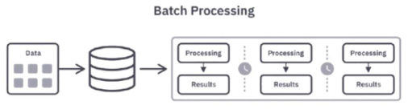

- 스트림 처리
  - 데이터가 생성되는 즉시 처리  

    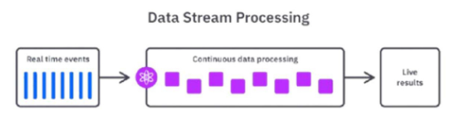
  - Flink는 스트림 처리를 기본 모델로 삼지만, 유연성이 있으므로 스트림을 배치 처리 형태로 다룰 수 있음 
  - Spark는 배치 처리를 기본 모델로 삼지만, Structured Streaming을 통해 스트림 작업을 마이크로 배치(Micro-batch) 방식으로 처리함
    - 즉, Flink는 “스트림 = 기본, 배치 = 스트림의 특수 케이스”
    - Spark는 “배치 = 기본, 스트림 = 배치를 빠르게 반복하는 형태”

- 실시간 데이터 처리 기술의 발전
  - 2010년, 실시간 데이터 처리를 위해 Complex Event Processing(CEP) 기술 개발  
  - 트위터의 Storm, Yahoo의 S4 같은 분산 스트림 병렬 처리 시스템이 개발됨 
  - Google의 MapReduce와 Hadoop 프레임워크는 대용량 데이터 배치 및 실시간 처리를 모두 지원하며 빅데이터 기술 발전을 가속화 시킴  

### Flink를 활용한 데이터 파이프라인 구조 활용
- 실제 스트리밍 데이터 파이프라인의 구조
  - 데이터 소스에서 발생하는 실시간 이벤트를 Kafka와 같은 플랫폼을 통해 Flink로 전달
  - Flink에서 데이터를 필터링하고 중복 제거, 유효성 검사, 데이터 결합 및 집계를 수행 (실시간 처리, 가공)  
  - 최종적으로 정제된 데이터는 분석 시스템(OLAP)이나 머신러닝 모델, 모니터링 시스템, OLTP로의 전송(운영 DB) 등으로 전달  

### Spark vs Flink 비교
| 항목 | Spark | Flink |
|------|--------|--------|
| 실시간성 | 완전한 실시간(real time) 처리는 아님 | 진정한 실시간 처리(True real-time processing) 가능 |
| 핵심 처리 프레임워크 | 기본적으로 배치(Batch) 처리 프레임워크 | 기본적으로 스트림(Stream) 처리 프레임워크 |
| 스트리밍 모델 | 마이크로배칭(Microbatching) 기반 | 윈도우(Windowing)와 체크포인팅(Checkpointing) 기반 |
| 메모리 관리자 | 효율적인 메모리 관리 기능이 부족 | 자체 자동 메모리 관리(Automatic Memory Manager) 기능 |
| OOM(Out of Memory) 가능성 | 비교적 OOM 발생 가능성이 높음 | OOM 발생이 거의 없음 |

- Spark vs Flink, Yahoo’s Benchmark
  - 벤치마크 설정
    - 캠페인 수: 100개
    - 캠페인당 광고(ads) 수: 10개
    - 데이터 스트림 생성: Kafka 사용
    - 데이터 전송 속도: 초당 50k ~ 170k (50k/s ~ 170k/s)
  - 결과
    - **Flink 지연 시간(약 40초)**
    - **Spark 지연 시간(백프레셔 미적용 시, 70초)**
    - Spark 지연 시간(백프레셔 적용 시, 120초)

※ 백프레셔: 데이터 소비 속도가 생산 속도보다 훨씬 빨라서 못따라갈 때 '속도 좀 줄여주세요' 하고 요청하는 것

## Flink
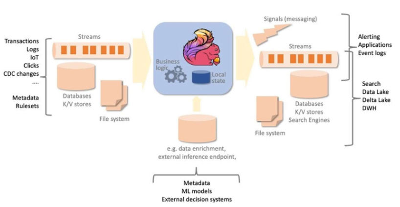

### 이벤트 기반 데이터 스트림 처리 흐름
1. 소스(Source)
    - 외부 시스템에서 발생하는 다양한 이벤트(트랜잭션, 로그, IoT 데이터, CDC 변경 등)가 데이터베이스, Key-Value Store, 파일 시스템 등에서 스트림 형태로 유입됨
2. 실시간 처리 엔진(Streaming Engine)
    - 중앙의 스트림 처리 엔진(Flink 등)은 들어오는 이벤트를 기반으로 비즈니스 로직을 실행
    - 이 엔진은 로컬 상태(State) 를 유지하므로, 단순 이벤트 처리뿐 아니라 ① 이전 상태 기억 ② 누적 계산 ③ 조건 판단 및 복잡한 패턴 탐지와 같은 **상태 기반(Stateful) 연산이 가능**
3. 외부 시스템 연동
    - 필요할 경우 메타데이터, 머신러닝 모델, 의사결정 시스템 등 외부 서비스를 호출하여 데이터 enrichment(추가 정보 보강) 또는 추론 등을 수행할 수 있음
4. 싱크(Sink)
    - 처리된 결과는 시스템 요구에 따라 다양한 형태로 전달됨
      - 메시지 브로커(Kafka 등)를 통해 다른 애플리케이션으로 전송
      - Elasticsearch, Data Lake / Delta Lake, DWH 등에 저장하여 분석 또는 검색에 활용
      - 실시간 알림 시스템이나 애플리케이션으로 직접 전달

### Flink 특징
- 분산 스트림 처리 엔진
  - Flink는 클러스터 환경에서 **분산 방식**으로 데이터를 처리
  - 데이터 흐름을 **스트림(stream)** 형태로 다루며, 각 데이터를 이벤트 단위로 지속적으로 처리
  - 병렬성과 확장성이 뛰어나기 때문에 대규모 데이터에 적합

- 무한한 스트림 데이터를 실시간으로 처리
  - 정해진 배치(batch) 처리와 달리, Flink는 **무한한 데이터 흐름**을 **실시간(real-time)**으로 처리
  - Kafka 등과 연동하여 데이터가 발생하는 즉시 처리 가능하며, 지연 시간이 매우 낮음 (low-latency)

- 무한 스트림 (Unbounded Streams)
  - 시작점은 있지만 끝이 정의되지 않은 스트림
    - ex. 실시간 로그 데이터, 센서 데이터 등
  - 데이터를 계속해서 실시간으로 처리해야 하며, 데이터를 모두 수집한 후 처리하는 것은 불가능

- 유한 스트림 (Bounded Streams)
  - 이벤트의 순서가 중요하지 않음(유한한 데이터셋은 항상 정렬할 수 있으므로)
  - 이런 유한 스트림 처리 방식은 **배치 처리(Batch Processing)**라고도 부름

    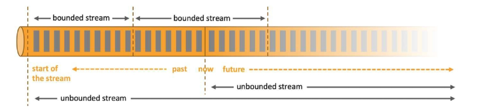

### Flink Architecture
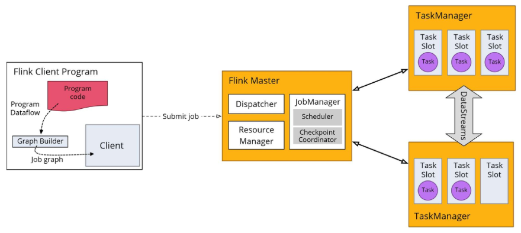

- Flink Client Program
  - 사용자가 작성한 프로그램 코드가 실행되는 영역
  - `execute()`를 호출하면 코드의 처리 흐름을 분석하여 데이터 플로우(Program Dataflow) 를 기반으로 **Job Graph(논리적 DAG)가 생성**됨
    - DAG(Directed Acyclic Graph): 방향은 있지만 순환이 없는 그래프 구조
  - 즉, 프로그램 코드를 그래프 형태의 설계도(Plan) 로 변환하여 Flink에 전달하는 역할
  - 생성된 Job Graph는 **Flink Master에게 제출(submit job)** 됨

- Flink Master
  - Flink 클러스터의 중앙 제어 노드로, 세 가지 핵심 컴포넌트로 구성됨
    | 컴포넌트                 | 역할                                                                                                                                                           |
    | -------------------- | ------------------------------------------------------------------------------------------------------------------------------------------------------------ |
    | **Dispatcher**       | 새로운 job 제출을 접수하고, JobManager로 전달하는 역할 (일종의 접수창구).                                                                                                            |
    | **Resource Manager** | 클러스터 자원(TaskManager, slot) 관리 및 할당.                                                                                                                          |
    | **Job Manager**      | Job Graph를 실제 실행 가능한 **Execution Graph(물리적 DAG)** 로 변환하고, TaskManager에 작업을 분배 및 스케줄링. 또한, **Checkpoint** 를 통해 작업 상태(State)를 주기적으로 저장하여 장애 발생 시 복구할 수 있도록 관리. |

- Test Manager
  - 실제 작업(Task)이 실행되는 워커 노드
  - TaskManager는 여러 개의 Task Slot을 가지고 있으며, 각 Slot은 하나의 병렬 Task를 실행할 수 있는 공간임
    - 슬롯 수가 많을수록 더 많은 병렬 작업 수행 가능
  - TaskManager 간에는 데이터가 Datastreams 형태로 전달되며 연산이 진행됨

- 정리
  - Client가 Job을 제출 → Master가 작업 단위로 쪼개고 스케줄링 → TaskManager가 실제 실행

### Flink 실행 흐름
- Program (프로그램 작성)
  - 클라이언트 시스템이 실행을 위해 제출하는, 사용자가 개발한 애플리케이션 프로그램
  - python으로 작성된 script 제출
    - 데이터가 어떻게 흘러갈지, 어떤 연산을 수행할지에 대한 정의가 되어있어야 함
    - 즉, 데이터 처리 논리를 구성하는 단계

- Parse and Optimize (파싱 및 최적화)
  - 이 단계에서는 코드를 파싱하여 문법 오류를 확인하고, 타입 추출(Type Extractor), 최적화 작업을 수행
    - 코드 구조 해석, 연산 간 관계 파악을 통해 순서를 어떻게 처리해야 효율화가 될지 내부적으로 구성함

- DataFlow Graph (데이터 플로우 그래프 변환)
  - 애플리케이션 작업이 데이터 플로우 그래프로 변환되어 이후 실행 단계에서 사용할 수 있도록 준비

- Job Manager (잡 매니저 처리)
  - 이 단계에서 Flink의 Job Manager 데몬이 태스크를 스케줄링, Task Manager에게 실행을 위임, 중간 처리 결과를 모니터링하는 역할까지 수행함

- Task Manager (태스크 매니저 처리)
  - Job Manager가 할당한 작업을 실제로 실행함

### Flink Architecture
- 시퀀스 흐름
  - 하나의 Task Slot에서 여러 개의 연산자(Source, map 등)를 개발자가 CLI 등을 통해 Flink 애플리케이션 제출
    - 즉, job 제출 단계
  - JobManager가 `JobGraph → Task Execution Graph` 변환 및 병렬화
    - 즉, 논리적인 그래프에서 물리적인 그래프로 변환하는 단계
  - Resource Manager가 Task Slot을 할당
  - TaskManager가 Task Slot에서 병렬로 데이터 스트림 처리 수행

    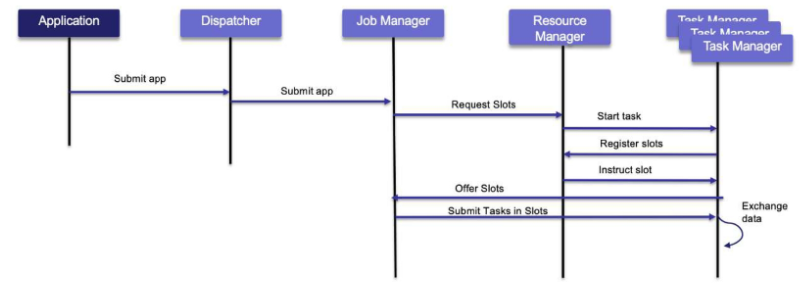

### Flink Architecture - Flink Program
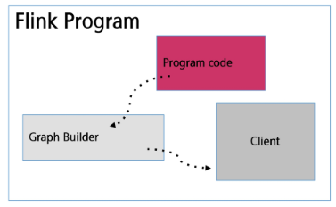
- 데이터 소스 정의 및 데이터 변환
  - 소스를 어디서 가져올지, 데이터를 어떻게 변환할지 정의
- 데이터 싱크 정의
  - 데이터를 어디로 보낼지 정의
- Dataflow Graph 생성
- 실행 계획 최적화
- JobManager에 실행 계획 전달

### Flink Architecture - Flink Master
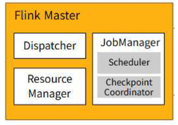
- 작업 계획 및 스케줄링
- 리소스 관리
- 장애 복구
- 통신 및 조정
- 웹 인터페이스 제공

### Flink Architecture - TaskManager
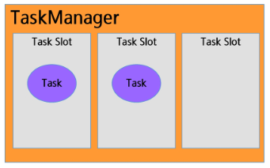
- 태스크 실행
- 리소스 할당 및 관리
  - 각 슬롯에 메모리 할당 (1/n)
    - Task는 TaskManager 내 Task Slot에서 병렬 실행
    - 하나의 Task Slot에서 여러 개의 연산자(Source, map 등)를 실행할 수 있음
    - 따라서, TaskManager를 하나의 서버로 생각해도 됨
    - TaskManager 서버 내에서 실제로 일을 하는 역할이 Task Slot이고, Task Slot은 각각의 Threads 형태로 구분되어 처리됨

      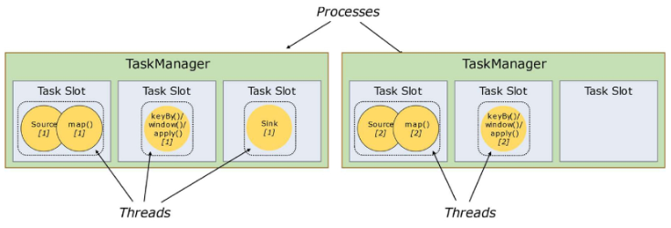
  - 하나의 슬롯 내에서 여러 연산자들이 수행됨
    - 즉, 여러 연산자들을 체인처럼 연결해서 하나의 슬롯으로 실행 (Operator chain)
    - 독립된 연산자들이 각각의 슬롯을 차지하는 것이 아님!!XX
  
  - 작업 슬롯 공유
    - 리소스를 완전히 활용가능
    - 하위 작업이 TaskManager에 공정하게 분배

      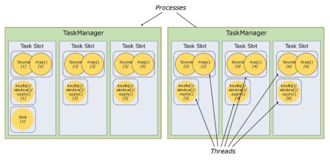
  
  - Tesk slot
    - TaskManager의 자원을 나눠갖는 단위

- 데이터 버퍼링 및 전송
- 메모리 관리
- 하트비트 및 상태 모니터링    

### Flink 장점
- 실시간 처리 능력
  - 매우 낮은 지연시간과 높은 처리량을 제공하여 초당 수백만 개의 이벤트를 처리
- 정확한 결과 보장 (Exactly-once)
  - 체크포인트와 세이브포인트 기능을 통해 데이터 중복이나 손실 없이 정확히 한 번만 처리
- 상태 관리 (Stateful Processing)
  - 복잡한 이벤트 집계, 윈도우 연산, 패턴 인식을 위해 내부 상태를 효율적으로 관리
- 확장성 및 분산 처리
  - 클러스터 내 다수의 노드와 태스크 슬롯을 통해 애플리케이션을 수평적으로 확장 가능
- 유연한 API 제공
  - SQL / Table API
    - Flink 애플리케이션 작성 시 Bounded 및 Unbounded Streams 모두에서 사용 가능한 선언적 고수준 API
  - DataStream API
    - Flink 애플리케이션 작성 시 UnBounded Streams 에서 사용되는 고수준 API
  - DataSet API
    - Flink 애플리케이션 작성시 Bounded Streams에서 사용되는 더 낮은 수준의 API

### Flink 사례 : Netflix
- 데이터를 빠르게 처리하고 분석하기 위해 Apache Flink를 사용하여 스트림 데이터를 실시간으로 처리
- 데이터 처리 과정에서 발생할 수 있는 장애 상황에 대비하여, **Flink의 체크포인팅(checkpointing) 및 백프레셔(backpressure) 관리 기능**을 적극 활용

  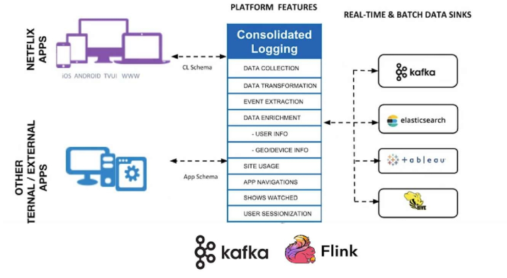

### Flink 사례 : SmartThings
- 데이터 플랫폼을 실시간으로 데이터를 처리하는 것이 중요
- Apache Spark의 마이크로 비트 처리보다 **Apache Flink의 실시간 데이터 처리 모델이 더 적합**
  - IoT 기기에서 센서 데이터를 빠르게 수집, 처리해야하기 때문
- 서버리스, 완전 관리형 솔루션 등을 제공하여 독립적 작동, 주기적 저장 지점 생성 가능
  - 클라우드 서비스 기반의 Flink 사용

  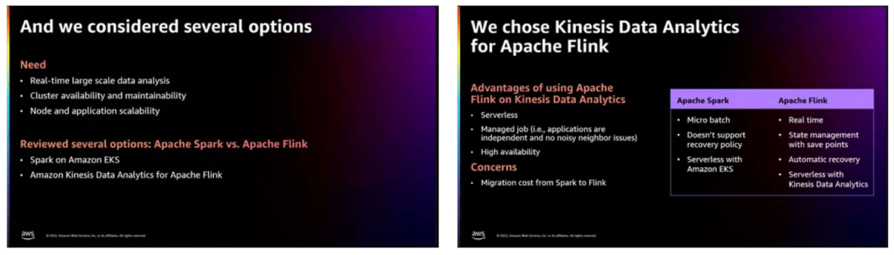

## Flink 코드 구조
- Datastream API 기준
  - 실행 환경 생성 (StreamExecutionEnvironment)
  - 데이터 소스(Source) 정의
  - 데이터 변환(Transformation) 적용
  - 데이터 싱크(Sink) 적용
  - 작업 실행 env.execute()

### 실행 환경 생성 (StreamExecutionEnvironment)
- Flink 작업을 구성하고 실행하는 중심 객체

  ```py
  from pyflink.datastream import StreamExecutionEnvironment

  # 1. 실행 환경 설정
  env = StreamExecutionEnvironment.get_execution_environment()
  ```
  - `get_execution_environment()`: 실행되는 환경(IDE, 로컬, 클러스터)에 따라 자동으로 적절한 실행 환경을 선택함(실행 환경 생성)

- 생성된 환경에서 데이터 소스, 변환, 싱크 등을 생성하는 메서드를 제공함

### 데이터 소스(Source) 정의
- 외부 데이터를 PyFlink 내부로 불러오는 역할
  - Flink에서는 다양한 Source 유형을 제공함
    - 정적 데이터(리스트, 파일 등)
    - 동적/실시간 데이터(Kafka, 소켓, DB CDC 등)

  ```py
  # 2. 데이터 소스(Source) 정의 (리스트 데이터를 스트림으로 변환)
  data_stream = env.from_collection([1, 2, 3, 4, 5])
  ```
  - `from_collection()`: python 리스트를 Flink stream 형태로 변환

- Source 예시
  | Source 종류           | 설명                                        |
  | ------------------- | ----------------------------------------- |
  | `from_collection()` | 리스트, 튜플 등 **파이썬 컬렉션을 스트림으로 변환**           |
  | `read_text_file()`  | 파일을 라인 단위로 읽어서 스트림 생성                     |
  | `add_source()`      | Kafka·Socket 등 **실시간 Source 연결** (커넥터 기반) |

### 데이터 변환(Transformation) 적용
- 입력 데이터를 원하는 형태로 가공
  - ex. map, filter, flatMap, keyBy, reduce, window 등
- Flink에서는 transformation 체이닝이 가능하며, 여러 연산을 연결해 데이터 처리 파이프라인을 구성함

  ```py
  # 3. 데이터 변환(Transformation) 적용 (각 숫자에 * 2 연산 수행)
  transformed_stream = data_stream.map(lambda x: x * 2)
  ```
  - 위 코드는 map transformation 을 사용하여 스트림의 각 요소에 연산을 적용함
  - map 연산은 stateless transformation 의 예시이며, 상태를 사용하지 않고 단순히 각 요소를 변환하는 방식임

- Transformation 예시
  | Transformation 예시       | 설명                             |
  | ----------------------- | ------------------------------ |
  | `map()`                 | 입력 → 출력 **1:1 매핑**             |
  | `filter()`              | 조건에 맞는 요소만 **선택**              |
  | `flatMap()`             | 요소를 0~N개로 **확장**               |
  | `keyBy()`               | 특정 키 기준으로 데이터 **그룹핑 (파티셔닝)**   |
  | `reduce()` / `window()` | 그룹/시간 단위로 **집계** (aggregation) |

### 데이터 싱크(Sink) 설정
- 처리된 데이터를 외부 시스템으로 출력함
  - 콘솔 출력, 파일 저장, 데이터베이스 저장, 메시지 큐(Kafka 등) 전송 등 다양한 형태가 가능함

  ```py
  # 4. 데이터 싱크(Sink) 설정 (결과를 콘솔에 출력)
  transformed_stream.print()
  ```
  - `print()`: 가장 기본적인 Sink로, 처리 결과를 표준 출력(콘솔) 에 표시함

- Sink 예시
  | Sink 유형      | 사용 예시                                   |
  | ------------ | --------------------------------------- |
  | Console Sink | `print()` — 결과 확인용                      |
  | File Sink    | `write_as_text("output.txt")`           |
  | Kafka Sink   | `add_sink(kafka_producer)` — 실시간 데이터 전달 |
  | DB Sink      | Flink Connector를 사용하여 DB로 저장            |

### 작업 실행 `env.execute()`
- 지금까지 구성한 소스, 변환, 싱크를 기반으로 실행
  - 즉, 지금까지 정의한 Source → Transformation → Sink 흐름을 실제로 실행하는 명령

  ```py
  # 5. 작업 실행
  env.execute("Simple Flink Job")
  ```
  - `execute()`: 이 함수를 호출해야만 Flink 클러스터가 job을 제출받아 작업이 진행됨
  - "job name"은 Flink UI(웹 대시보드)에서 확인할 수 있는 작업 이름

- Flink는 **지연 실행(Lazy Execution)** 을 사용함
  - 즉, 소스/변환/싱크를 코드에서 정의해도 즉시 실행되지 않고,
  - `env.execute()` 를 호출하는 순간 전체 파이프라인이 그래프로 만들어져 클러스터로 제출됨

※ 전체 흐름
> (코드 작성) Source 설정 → Transformation 적용 → Sink 설정 → execute() 호출 → Flink에서 작업 실행


## Flink 설치 및 실행 환경설정
`data_engineering\04_Flink\01_Flink_setting_guide` 참고

### Apache Flink 설치  
- Apache Flink 설치 (WSL 기준)
  ```sh
  # 홈 디렉토리로 이동
  cd ~

  # Apache Flink 설치 파일 다운로드
  wget https://archive.apache.org/dist/flink/flink-1.19.3/flink-1.19.3-bin-scala_2.12.tgz

  # 압축 해제
  tar -xvzf flink-1.19.3-bin-scala_2.12.tgz

  # 디렉토리 이름을 간단하게 변경
  mv flink-1.19.3 flink

  # 설치 파일 삭제 (선택)
  rm flink-1.19.3-bin-scala_2.12.tgz

  # Flink conf 디렉토리로 이동
  cd ~/flink/conf

  # flink-conf.yaml 수정 — JobManager 주소 설정
  vi flink-conf.yaml

  # 아래 내용이 있는지 확인하고 없다면 추가 또는 수정:
  jobmanager.rpc.address: localhost   # JobManager가 실행되는 호스트 주소 지정

  # masters 수정 — JobManager Web UI 포트 설정
  vi masters

  # 파일 내용 확인 / 수정:
  localhost:8081   # JobManager 웹 UI에서 사용할 포트 번호

  # workers 수정 — TaskManager 실행 위치 설정
  vi workers

  # 파일 내용 확인 / 수정:
  localhost   # TaskManager가 실행될 노드 명시
  ```

- Flink 클러스터 실행
  ```sh
  cd flink/bin/
  ./start-cluster.sh     # JobManager + TaskManager 실행
  ```

- 웹 UI 접속
  - 브라우저에서 `http://localhost:8081` 로 접속하면 웹 UI에서 상태 확인 가능
    - 실행 중인 Job, TaskManager 상태, 로그 등을 확인할 수 있는 Flink Dashboard

### Flink WordCount  
- WSL (터미널 1)
  ```sh
  nc -l 9000    # 포트 9000으로 소켓 오픈 (netcat)
  ``` 
  - 이 터미널에 입력하는 텍스트가 Flink로 스트림 데이터처럼 전달됨
  - 엔터를 누를 때마다 한 줄씩 Flink로 전송됨

    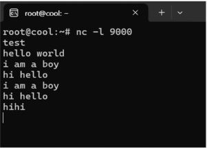

- WSL (터미널 2)  
  ```sh
  ./bin/flink run examples/streaming/SocketWindowWordCount.jar --hostname localhost --port 9000
  ```
  - Flink 기본 제공 예제 실행 (포트번호 9000으로 연결)
  - `hostname`과 `port`는 터미널 1에서 열어둔 소켓 주소와 연결

    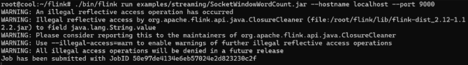

- WSI (터미널 3)
  - 데이터 처리 로그 확인
    ```sh
    cd flink tail -f log/flink-*.out
    ```
    

### PyFlink 설치
- 가상환경에서 PyFlink 설치:
```bash
pip install apache-flink==1.19.3
```
- PyFlink는 파이썬 API로 Flink DataStream / Table API를 사용할 수 있게 해주는 라이브러리
- 라이브러리만 설치하면 기본적인 Flink 스트리밍 코드 실행이 가능

- 특징
  - 로컬 MiniCluster 자동 실행  
    - PyFlink는 코드 실행 시 내부적으로 MiniCluster(내장 Flink 클러스터) 를 자동으로 띄워서 실행함
  - 클러스터 필요XX
    - 단일 노드 환경에서 테스트하는 경우, JobManager / TaskManager를 따로 실행할 필요 없이 단일 프로세스로 실행됨
  - 로컬 테스트에 최적
    - 로컬 데이터 소스 사용하기 때문에 `env.from_collection()` 처럼 로컬 컬렉션 기반의 소스는 외부 Kafka, FileSystem 등의 의존성이 없기 때문에 즉시 처리 가능

### Pyflink 로컬 사용  
- 별도의 클러스터에서 사용하기 위해서는 내, 외부에 띄운 Jobmanager와 연결해줘야 함  

  ```python
  from pyflink.datastream import StreamExecutionEnvironment
  from pyflink.common import Configuration

  env = StreamExecutionEnvironment.get_execution_environment()

  #클러스터 주소와 포트 지정 (JobManager REST 포트: 8081)
  config = Configuration()
  config.set_string("execution.target", "remote")
  config.set_string("rest.address", "localhost")  # JobManager 주소
  config.set_integer("rest.port", 8081)           # JobManager REST 포트

  env = StreamExecutionEnvironment.get_execution_environment (config)
  env.set_parallelism(1)

  data = env.from_collection ([("apple", 1), ("banana", 1), ("apple", 1)])
  data.print()

  env.execute("Submit PyFlink Job to Existing Cluster")
  ```

### Docker를 활용한 사용  
- Docker 이미지 생성  

  ```dockerfile
  FROM flink:1.19-scala_2.12-java17

  # 2. Python & pip + PyFlink 설치
  RUN apt-get update && \
      apt-get install -y python3 python3-pip && \
      pip install --no-cache-dir apache-flink==1.19.3 && \
      pip install pandas

  # 3. 기본 Python3 링크 설정
  RUN ln -s /usr/bin/python3 /usr/bin/python

  # 4. 작업 디렉토리 설정
  WORKDIR /opt/flink
  ```
 
### Docker-compose 활용 및 실행  
```bash
docker build -t pyflink .   # Docker 이미지 빌드

docker compose up -d    # docker-compose.yml 기반으로 컨테이너 실행

# 로컬에 있는 pyflink_job.py 파일을 JobManager 컨테이너 내부의 /opt/flink/ 위치에 복사
docker cp pyflink_job.py flink_jobmanager:/opt/flink/pyflink_job.py

# JobManager 컨테이너에서 PyFlink 코드 실행
docker exec -it flink_jobmanager python /opt/flink/pyflink_job.py
```
```yaml
# docker-compose.yml

services:
  jobmanager:
    image: pyflink                            # 빌드한 PyFlink 이미지 사용
    container_name: flink_jobmanager
    ports:
      - "8081:8081"                           # Flink Web UI 접근 포트 (localhost:8081)
    command: jobmanager                       # 컨테이너를 JobManager 모드로 실행
    environment:
      - JOB_MANAGER_RPC_ADDRESS=jobmanager

  taskmanager:
    image: pyflink                            # 동일한 PyFlink 이미지 사용
    container_name: flink_taskmanager
    depends_on:
      - jobmanager                            # JobManager 실행 후 시작 
    command: taskmanager                      # 컨테이너를 TaskManager 모드로 실행
    environment:
      - JOB_MANAGER_RPC_ADDRESS=jobmanager    # TaskManager가 JobManager에 연결할 때 사용
    scale: 1                                  # TaskManager 개수 (병렬 처리 증가 시 수치 늘릴 수 있음)
```

### Pyflink 예시 코드  
```python
from pyflink.datastream import StreamExecutionEnvironment  

# 1. 실행 환경 생성  
env = StreamExecutionEnvironment.get_execution_environment()  

# 2. 데이터 소스(Source) 정의 (리스트 데이터를 스트림으로 변환)  
data_stream = env.from_collection([1, 2, 3, 4, 5])  

# 3. 데이터 변환(Transformation) 적용 (각 숫자에 * 2 연산 수행)  
transformed_stream = data_stream.map(lambda x: x * 2)  

# 4. 데이터 싱크(Sink) 설정 (결과를 콘솔에 출력)  
transformed_stream.print()  

# 5. 작업 실행  
env.execute("Simple Flink Job")
```

- pyflink 예시 코드 실행 결과  
  - 예상 결과: 2 → 4 → 6 → 8 → 10  
  - 여러 개의 TaskManager와 Task Slot이 동시에 실행  
  - 데이터가 순차적으로 출력되지 않고, 병렬로 처리된 결과가 출력  

    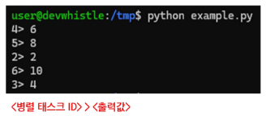

- DAG 시각화 예제  

```python
from pyflink.datastream import StreamExecutionEnvironment
from pyflink.common.typeinfo import Types

# 실행 환경 생성
# PyFlink에서는 MiniCluster(내장 플링크 클러스터)가 자동으로 실행됨
env = StreamExecutionEnvironment.get_execution_environment()

# 병렬도 설정 (선택 사항)
# 병렬도가 1이면 단일 task로 처리되며 실행 순서 확인에 용이
env.set_parallelism(1)

# 예시 데이터 소스 생성
# from_collection()은 리스트 기반의 로컬 데이터를 스트림으로 변환
data = env.from_collection(
    collection=[("apple", 1), ("banana", 1), ("apple", 1)],
    type_info=Types.TUPLE([Types.STRING(), Types.INT()])
)

# 4. Transformation: keyBy + sum
# key_by(): 특정 key 기준으로 그룹핑
# lambda x: x[0] → tuple의 첫 번째 값 기준으로 그룹화 ("apple", "banana")
# sum(1) → tuple의 두 번째 요소(index=1)에 대해 합산
result = data.key_by(lambda x: x[0]).sum(1)

# DAG 실행 계획 출력 (JSON 문자열 형식)
# Flink가 내부적으로 구성한 DAG(실행 그래프)를 JSON 형태로 출력
execution_plan = env.get_execution_plan()
print("DAG Execution Plan: \n", execution_plan)

# 출력: 콘솔에 출력
# 처리된 결과를 콘솔로 출력하는 가장 간단한 Sink
result.print()

# 실행
# 이제 Flink가 정의된 Source → Transformation → Sink 파이프라인을 실행함
env.execute("Basic PyFlink Job")
```

## PyFlink 예제  
- DAG 시각화 예제 실행 결과  
  - 총 3개의 노드로 구성 (Source, KeyBy 연산자, Reduce 연산자)  

    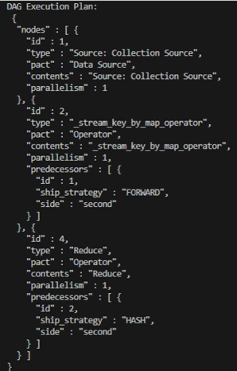
    - Job Graph
  - Node 1 - Source
    - `from_collection()`을 통해 생성된 데이터 스트림
  - Node 2 - KeyBy(파티셔닝) Operator
    - `key_by(lambda x: x[0])`  
    - 입력: Node 1에서 받아옴 (ship_strategy: "FORWARD" 로컬 전달) 
    - `ship_strategy: "FORWARD"`
      - 같은 Task(slot) 내에서 데이터가 로컬로 전달됨 (네트워크 전달 없음)
  - Node 4 - Reduce(sum) Operator
    - `.sum(1)` 연산으로 Reduce 기능 수행  
    - 입력: Node 2 (ship_strategy: "HASH" → 키 해시 기반 분산)
      - `ship_strategy: "HASH"`
      - key 값을 해싱하여 해당 key를 담당하는 TaskManager로 데이터를 전달 
      - 즉, "apple" 이면 apple이 담당되는 slot으로 라우팅되는 구조
  - 연산 결과 출력:  

    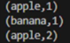

