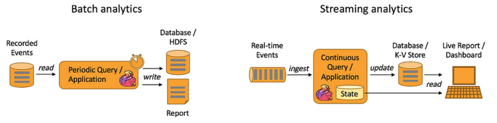
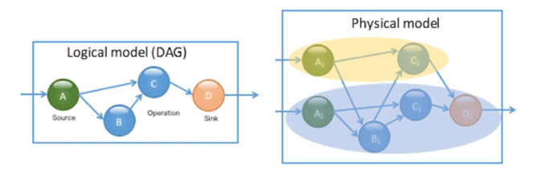
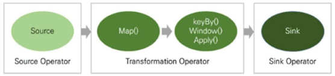
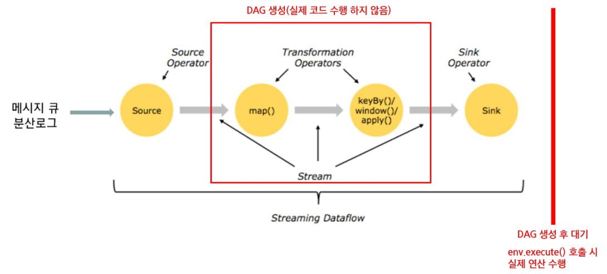
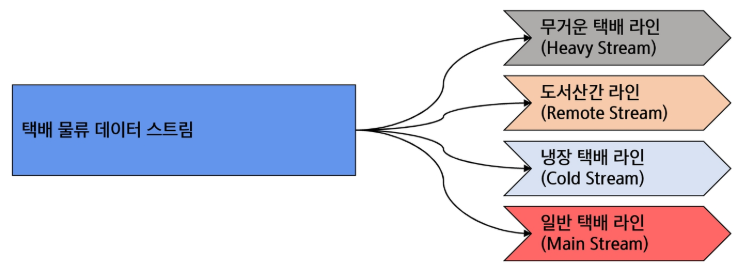
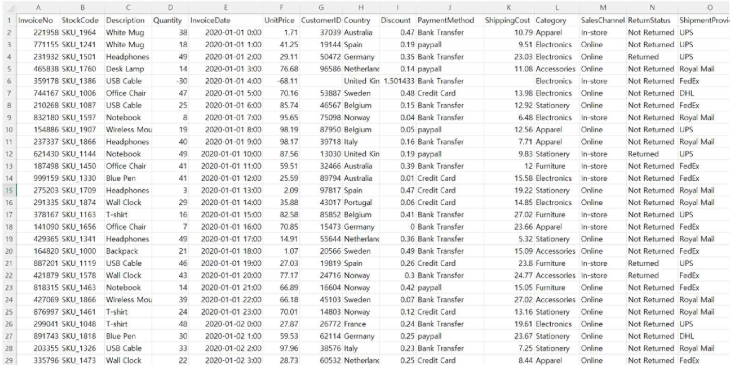
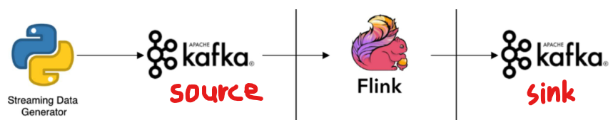
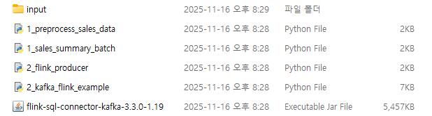

# Flink DataStream
## DataStream API
### Stream Processing
- 동전 분류기, 줄서기 예시

  
  - 모든 구성 요소는 **직렬**로 연결
  - 지속적으로 시스템에 입력되어 향후 사용을 위해 다양한 대기열로 출력(분류됨)
  - 일반적으로 스트림 처리 시스템은 무한 데이터셋 처리를 지원하기 위해 데이터 기반 처리 방법을 사용

### Batch vs Streaming 처리 방식


- Batch Analytics (배치 분석)
  - 이미 저장된 과거 데이터(Recorded Events) 를 일정 주기마다 읽어와 분석하는 방식
  - 흐름
    1. Recorded Events
        - 로그 파일이나 DB 등에 누적 저장된 과거 이벤트 데이터
    2. Periodic Query / Application
        - 일정 시간 간격(예: 매시간, 매일)으로 트리거되어 데이터를 읽고 분석함
        - 한 번 실행될 때마다 많은 양의 데이터를 처리하는 구조
    3. 결과 저장 & 리포트 생성
        - 분석된 결과는 Database/HDFS에 저장되거나
        - Report(정적 보고서) 형태로 만들어짐

- Streaming Analytics (스트리밍 분석)
  - 실시간으로 들어오는 이벤트(Real-time Events) 를 즉시 처리하고, 계속해서 상태를 유지하면서 업데이트하는 방식
  - 흐름
    1. Real-time Events
        - 센서 데이터, 사용자 활동 로그 등 실시간으로 발생하는 데이터
    2. Continuous Query / Application
        - 데이터가 들어오는 즉시 처리되는 연속 실행(continuous) 애플리케이션
        - 내부적으로 **State(상태)** 를 유지하며 이전 계산 결과를 누적하거나 갱신함
    3. Database / K-V Store 업데이트
        - 처리된 결과는 실시간으로 Key-Value Store나 데이터베이스에 업데이트됨
    4. Live Report / Dashboard 출력
        - 사용자는 거의 실시간에 가까운 최신 분석 결과를 대시보드에서 확인할 수 있음
    
- 정리
  | 항목 | Batch | Streaming |
  |------|--------|------------|
  | 처리 방식 | 일정기간 단위로 수집하여 한 번에 처리 | 연속된 데이터를 하나씩 처리 |
  | 처리량 | 대규모 데이터 단위 | 주로 소량의 레코드 단위 |
  | 속도 | 수분~시간의 지연시간 | (준)실시간 |
  | 사용환경 | 복잡한 분석이 요구되는 환경<br>데이터 처리량이 많은 환경 | 실시간 처리 및 분석 정보가 요구되는 환경 |

### DataStream API
스트림 데이터를 처리하기 위한 API  

- 데이터 스트림(DataStream)
  - 기본적으로 유한 또는 무한의 **불변(immutable)** 데이터 집합
    - Flink의 DataStream은 한 번 생성된 후 내부 데이터를 직접 변경할 수 없기 때문
    - 원본은 그대로 두고, 변환된 '새로운' 스트림을 생성하는 구조
  - 변환(transformation)을 통해 처리함 

- 특징
  - 실시간 이벤트 처리
    - 들어오는 데이터를 즉시 처리하는 저지연 스트리밍 처리에 최적화됨
  - CEP(Complex Event Processing)
    - 여러 이벤트의 패턴을 인식하여 복잡한 조건을 감지하는 기능 제공
  - 사용자 정의 로직
    - 기본 연산(map, filter 등) 외에도 UDF로 다양한 비즈니스 로직을 구현 가능
  - 복잡한 상태 관리  
    - 이전 이벤트 정보를 기억하며 연속적인 계산을 수행할 수 있고, 체크포인트 기반으로 장애 복구가 가능

- DataStream API
  - 저수준(Low-level) API로, 데이터의 흐름과 처리를 세밀하게 제어함

- Flink 프로그램 기본 구조
  1. 실행 환경 생성 (Execution Environment)
  2. Source에서 데이터 읽기
  3. Transformation 적용
  4. Sink로 외부 시스템에 결과 출력
  5. `execute()`로 실행 시작
      - 실제 데이터 처리는 execute() 호출 시점에 실행 계획(Data Flow Graph)으로 실행됨
  
  - DataStream API도 구조 동일함
    - `환경 → 소스 → 변환 → 싱크 → 실행`
      ```java
      StreamExecutionEnvironment env = StreamExecutionEnvironment.getExecutionEnvironment();

      DataStream<String> stream = env.addSource(...);

      DataStream<String> transformed = stream
          .map(...)
          .filter(...)
          .keyBy(...)
          .window(...)
          .reduce(...);

      transformed.addSink(...);

      env.execute("my job");
      ```

### Directed Acyclic Graph  
- 논리 모델 (DAG)  
  - DAG(Directed Acyclic Graph)
    - **방향성이 있는 비순환 그래프**
    - 전체 계산 로직을 노드(연산자)와 간선(데이터 흐름)으로 표현  

      
      - 즉, 전체적인 계산 과정을 추상화
  - 사용자가 작성한 스트림 처리 프로그램에서 “어떤 연산을 순서대로 수행할 것인지”를 추상적으로 표현  
  - “연산자가 어떻게 연결되는지, 어떤 **순서**로 실행되는지”만을 정의  

- 왜 DAG를 사용하는가?  
  - 스트림 처리에서 여러 연산자가 순차 혹은 병렬적으로 데이터를 처리하는 과정을 **직관적**으로 표현 -> '그래프'
  - DAG 형태로 나누어 두면, 각 노드를 여러 태스크로 확장하여 **대규모 데이터를 병렬로 처리**할 수 있음  
  - DAG 구조를 분석해 노드 간 데이터 교환, 파티셔닝, 스케줄링 등을 **최적화** 가능  
  - 엔진은 DAG에 정의된 각 노드(연산자) 상태를 주기적으로 체크포인트(checkpoint)하고, **장애 발생 시 해당 노드 상태만 복구해 재실행** 용이  

### 데이터 소스(Source) 종류  
- 파일 시스템  
  - 로컬 파일, HDFS 등에서 텍스트·CSV·로그 같은 정적 데이터 또는 지속적으로 추가되는 파일을 읽어 스트림 형태로 처리할 수 있음
- 메시지 큐 / 스트리밍 플랫폼  
  - Kafka, Pulsar 등에서 실시간으로 들어오는 이벤트를 지속적으로 소비(consume)
  - 높은 처리량과 내결함성을 가진 플랫폼과 연동하여 “실시간 스트림 처리”의 대표적인 소스로 활용됨
  - 즉, Apache Kafka 등과 연동하여 실시간 스트림 처리  
- 소켓 스트림  
  - TCP 소켓을 통해 외부 애플리케이션에서 보내는 문자열/로그 데이터를 실시간 스트림으로 수신
  - 즉, 네트워크 소켓을 통해 실시간 로그나 이벤트 데이터를 수신함

### 데이터 소스 구성 방법
- Flink의 ‘StreamExecutionEnvironment’를 사용

- 커넥터 API를 통해 다양한 외부 시스템과 쉽게 연결함
  - 커넥터 API(Connector API)
    - Flink가 외부 시스템(파일, Kafka, DB, 메시지 큐 등)과 데이터를 주고받기 위해 제공하는 표준 인터페이스(연동 모듈)
    - 즉, Flink와 외부 데이터 소스를 연결해주는 플러그인 같은 것
  - 커넥터 API가 하는 역할
    1. Source 커넥터
        - 외부 시스템 → Flink 로 데이터 읽기
        - ex. KafkaConsumer, FileSource, SocketSource
    2. Sink 커넥터
        - Flink → 외부 시스템으로 데이터 내보내기
        - ex. KafkaSink, ElasticsearchSink, JDBC Sink 등
    3. 포맷/직렬화 세부 처리 지원
        - JSON, CSV, Avro, protobuf 등 다양한 형식을 읽고 쓰도록 지원

```py
from pyflink.datastream import StreamExecutionEnvironment

# Flink 환경 생성
env = StreamExecutionEnvironment.get_execution_environment()

# 파일 데이터 소스 (파일에서 한 줄씩 읽기)
file_path = "../data/data.csv"
text_stream = env.read_text_file(file_path)

# 데이터 출력
text_stream.print()

# 실행
env.execute("File Source Example")
```
- `read_text_file()`
  - Flink의 파일 소스 커넥터(File Source Connector) 를 사용하는 API
  - 즉, 파일 시스템과 연결해서 데이터를 읽어오는 커넥터 API의 한 형태
  - Kafka·Pulsar·JDBC 등은 별도의 커넥터 객체를 직접 생성해야 하지만,
    - 파일 소스는 Flink가 기본 제공하는 간단한 커넥터라 편의 함수 형태로 바로 사용할 수 있음


### Sink
- 데이터 흐름 : `데이터 소스 -> 연산(변환) -> Sink`

  
  - 데이터 소스
    - 데이터 입력을 정의
    - 즉, 데이터 가져오는 것
  - 연산
    - 데이터를 가공하는 작업  
  - Sink
    - 처리한 스트림을 출력·저장하는 단계  

- Sink 종류
  | Sink 종류 | 설명 |
  |------------|------|
  | PrintSink | print() 메서드를 사용하여 콘솔에 출력 |
  | FileSink | 데이터를 파일로 저장 (텍스트, CSV, JSON 등) |
  | KafkaSink | 데이터를 Kafka에 저장 |
  | DatabaseSink | JDBC를 이용하여 DB(MySQL, PostgreSQL 등)에 저장 |
  | ElasticsearchSink | 데이터를 Elasticsearch에 저장 |

- Sink 예제(FileSink)
  - FileSink를 위해 Java encoder 필요함
    - `get_gateway()`를 통해 Java 가상 머신에 접근, Java의 `SimpleStringEncoder`를 생성  
    - 생성한 Java encoder를 Encoder 클래스에 전달하여 Python encoder를 생성  

  - 파이썬 DataStream에서 생성한 문자열 데이터를 FileSink를 이용해 파일로 저장하는 방법을 보여주는 코드
    ```py
    from pyflink.datastream import StreamExecutionEnvironment
    from pyflink.datastream.connectors import FileSink
    from pyflink.common.serialization import Encoder
    from pyflink.common.typeinfo import Types
    from pyflink.java_gateway import get_gateway

    # 실행 환경 생성
    env = StreamExecutionEnvironment.get_execution_environment()

    # 데이터 소스 생성
    data = ["Hello", "Flink", "World"]
    data_stream = env.from_collection(data, type_info=Types.STRING())

    # Java 엔코더 생성
    gateway = get_gateway()
    j_string_encoder = gateway.jvm.org.apache.flink.api.common.serialization.SimpleStringEncoder()

    # Python Encoder 생성
    encoder = Encoder(j_string_encoder)

    # FileSink 설정
    file_sink = FileSink.for_row_format(
        "./output/result",   # 출력 디렉터리
        encoder
    ).build()

    # Sink에 데이터 연결
    data_stream.sink_to(file_sink)

    # 출력결과 실행
    env.execute("File Sink Example")
    ```


## 데이터 변환 및 연산
### 데이터 변환  
- 데이터 변환은 원시 데이터를 유용한 정보로 변형  
  - 원시 데이터를 의미 있는 정보로 재구성  
  - 후속 처리(ex. 집계, 조인, 윈도우 연산 등)를 위한 전처리 작업을 수행  
  - 변환 함수들은 병렬 처리에 최적화  
  - 각 연산은 독립적으로 실행되어 클러스터 환경에서도 높은 확장성과 내결함성을 보장  

- 지연 평가(Lazy Evaluation) 방식  

### 지연 평가(Lazy Evaluation)  
- 연산 계획 수립
  - 데이터 스트림에 대해 여러 변환 연산(map, filter, flatMap 등)을 적용하면, 각 연산은 바로 실행되지 않고 내부적으로 실행 계획(Graph)으로 기록  

- 최적화 기회 제공
  - 실제 실행 전까지 여러 연산이 결합되어 전체 최적화가 가능해짐  
  - 불필요한 중간 결과를 줄이고, 연산 체인을 병합하는 등의 최적화가 수행  
  - 이때 사용자가 작성한 변환 연산들의 흐름은 로지컬(Logical) 계획으로 먼저 기록되며, 실행 시점에 Flink가 이를 실제 실행 방식까지 포함한 피지컬(Physical) 계획으로 변환하여 수행함

    
    - 여러 변환 연산이 즉시 실행되지 않고 DAG(실행 계획)으로만 생성되며, 
    - `execute()` 호출 시 실제 연산이 수행됨

- 실행 트리거
  - 최종 결과를 출력하는 sink가 설정되거나 `execute()` 명령이 호출되면, 기록된 연산 계획에 따라 전체 데이터 플로우가 한꺼번에 실행  

- 지연 평가(Lazy Evaluation) 장점  
  - 효율성
    - 불필요한 계산을 방지하여 리소스를 절약하고, 전체 실행 계획을 최적화 가능  
  - 성능 향상 
    - 여러 연산을 하나의 파이프라인으로 결합함으로써, 데이터 전송 및 중간 결과의 저장을 최소화  
  - 유연성
    - 실행 시점까지 연산을 미루어, 실행 계획을 재구성하거나 동적으로 변경

### 기본 변환 함수
| 함수 | 역할 | 용도/설명 |
|------|------|------------|
| `map` | 각 입력 요소를 1:1로 변환 | 데이터 포맷 변경, 특정 필드 추출, 단순 계산 적용 |
| `flatMap` | 하나의 입력 요소에서 0개 이상 출력 생성 | 복합 데이터를 분해(ex. 단어 쪼개기)하거나, 조건에 따라 다수의 결과 생성 |
| `filter` | 입력 요소를 조건에 따라 선별 | 노이즈 제거, 유효 데이터 필터링 |

- map 함수

  ```python
  from pyflink.datastream import StreamExecutionEnvironment
  from pyflink.common.typeinfo import Types

  env = StreamExecutionEnvironment.get_execution_environment()

  # 예제 입력: 정수 리스트
  input_data = [1, 2, 3, 4]

  # DataStream 생성
  ds = env.from_collection(collection=input_data, type_info=Types.INT())

  # map 함수: 각 요소에 2를 곱하기
  mapped_stream = ds.map(lambda x: x * 2, output_type=Types.INT())

  # 실행 후 결과 수집
  env.execute("Simple Map Job")
  mapped_result = list(mapped_stream.execute_and_collect())

  print("map 결과:", mapped_result)
  ```
  - map 결과: `[2, 4, 6, 8]`

- flat_map 함수

  ```python
  from pyflink.datastream import StreamExecutionEnvironment
  from pyflink.common.typeinfo import Types

  env = StreamExecutionEnvironment.get_execution_environment()

  # 예제 입력: 문자열 리스트
  input_data = ["hello", "hi"]

  # DataStream 생성
  ds = env.from_collection(collection=input_data, type_info=Types.STRING())

  # flat_map 함수: 각 문자열을 문자 단위로 분해하여 개별 문자 출력
  def split_string(s):
      for ch in s:
          yield ch

  flat_mapped_stream = ds.flat_map(split_string, output_type=Types.STRING())

  # 실행 후 결과 수집
  env.execute("FlatMap Job")
  flat_mapped_result = list(flat_mapped_stream.execute_and_collect())

  print("flat_map 결과:", flat_mapped_result)
  ```
  - flat_map 결과: `['h', 'e', 'l', 'l', 'o', 'h', 'i']`

- filter 함수

  ```python
  from pyflink.datastream import StreamExecutionEnvironment
  from pyflink.common.typeinfo import Types

  env = StreamExecutionEnvironment.get_execution_environment()

  # 예제 입력: 정수 리스트
  input_data = [1, 2, 3, 4, 5, 6]

  # DataStream 생성
  ds = env.from_collection(collection=input_data, type_info=Types.INT())

  # filter 함수: 짝수만 통과시키기
  filtered_stream = ds.filter(lambda x: x % 2 == 0)

  # 실행 후 결과 수집
  env.execute("Filter Job")

  filtered_result = list(filtered_stream.execute_and_collect())
  print("filter 결과:", filtered_result)
  ```
  - filter 결과: `[2, 4, 6]`


### 그룹화 및 집계 함수
| 함수 | 역할 | 용도/설명 |
|------|------|------------|
| `keyBy` | 스트림 요소들을 특정 키로 그룹화 | 그룹별 집계, 상태 저장, 윈도우 연산 등의 사전 준비 단계 |
| `reduce` | 그룹 내 요소들을 누적하여 단일 결과로 집계 | 합계, 최대/최소 값 계산 등 간단한 집계 연산 |
| `process` | 각 이벤트에 대한 로직 커스텀 처리 | 상태 기반 집계, 타이밍 제어 등 복잡한 로직 구현 |

- keyby 함수

  ```python
  from pyflink.datastream import StreamExecutionEnvironment
  from pyflink.common.typeinfo import Types

  env = StreamExecutionEnvironment.get_execution_environment()

  # 예제 입력: (사용자, 값) 튜플들의 리스트
  input_data = [("A", 1), ("B", 2), ("A", 3), ("B", 4)]

  # DataStream 생성 (튜플 타입: (String, Int))
  ds = env.from_collection(input_data, type_info=Types.TUPLE([Types.STRING(), Types.INT()]))

  # keyBy: 사용자(첫 번째 요소)를 기준으로 그룹화
  keyed_stream = ds.key_by(lambda x: x[0])
  ```

- reduce 함수

  ```python
  # 각 키 그룹에서 값을 합산하여 변화를 확인
  summed_stream = keyed_stream.reduce(lambda a, b: (a[0], a[1] + b[1]))

  # 결과 출력
  summed_stream.print()

  # 실행
  env.execute("KeyBy Visualization")
  ```
  - Keyby+reduce 결과
    ```
    (A, 1)  
    (B, 2)  
    (A, 4)  -> 같은 키(A)에 대해 누적 합
    (B, 6)
    ```


- process 함수

  ```python
  from pyflink.datastream import StreamExecutionEnvironment
  from pyflink.datastream.functions import ProcessFunction
  from pyflink.common.typeinfo import Types

  # ProcessFunction 예제: 짝수면 2배, 홀수면 그대로 반환
  # ProcessFunction을 상속 받아서 사용
  class MyProcessFunction(ProcessFunction):
      def process_element(self, value, ctx: 'ProcessFunction.Context'):
          if value % 2 == 0:
              yield value * 2    # 짝수이면 2배로 출력
          else:
              yield value        # 홀수는 그대로 출력

  env = StreamExecutionEnvironment.get_execution_environment()
  env.set_parallelism(1)

  # 예제 입력: 정수 리스트
  data = [1, 2, 3, 4, 5, 6]

  # DataStream 생성
  ds = env.from_collection(collection=data, type_info=Types.INT())

  # ProcessFunction 적용
  processed_stream = ds.process(MyProcessFunction(), output_type=Types.INT())

  # Flink 작업 실행
  env.execute("ProcessFunction Example")

  # 실행 후 결과 수집
  result = list(processed_stream.execute_and_collect())

  print("Process function result:", result)
  ```
  - Process 결과: `[1, 4, 3, 8, 5, 12]`

### 멀티 스트림 및 결합 함수
| 함수 | 역할 | 용도/설명 |
|------|------|------------|
| `union` | '여러 개의 스트림(같은 타입)'을 하나로 결합 | **서로 다른 데이터 소'의 스트림을 통합**하여 **일괄 처리**할 때 사용 |
| `connect` | '서로 다른 타입의 두 스트림'을 연결 | **이중 데이터 스트림을 결합**한 후, **각각에 대해 별도의 변환(연산)을 적용**할 수 있음 |

- union 함수

  ```python
  from pyflink.datastream import StreamExecutionEnvironment
  from pyflink.common.typeinfo import Types

  env = StreamExecutionEnvironment.get_execution_environment()

  # 예제 입력: 두 개의 정수 리스트 스트림
  stream1 = env.from_collection([1, 2, 3], type_info=Types.INT())
  stream2 = env.from_collection([4, 5, 6], type_info=Types.INT())

  # union: 두 스트림을 하나로 결합
  # 두 스트림이 동일 타입이어야 함!!!
  union_stream = stream1.union(stream2)

  # 결과 수집
  result_union = list(union_stream.execute_and_collect())
  print("Union 결과:", result_union)
  ```
  - Union 결과: `[1, 2, 3, 4, 5, 6]`

- connect 함수

  ```python
  from pyflink.datastream import StreamExecutionEnvironment
  from pyflink.datastream.functions import CoMapFunction
  from pyflink.common.typeinfo import Types

  env = StreamExecutionEnvironment.get_execution_environment()

  # 예제 입력: 서로 다른 타입의 두 스트림
  stream_str = env.from_collection(["A", "B"], type_info=Types.STRING())
  stream_int = env.from_collection([1, 2], type_info=Types.INT())

  # connect: 두 스트림을 '연결'
  connected_stream = stream_str.connect(stream_int)

  # 각 스트림 타입에 다른 방식 처리(하나의 객체로)
  class MyCoMapFunction(CoMapFunction):
      def map1(self, value):
          return f"String: {value}"

      def map2(self, value):
          return f"Int: {value}"

  co_mapped_stream = connected_stream.map(MyCoMapFunction(), output_type=Types.STRING())

  # 결과 수집
  result_connect = list(co_mapped_stream.execute_and_collect())
  print("Connect 결과:", result_connect)
  ```
  - Connect 결과: `['String: A', 'String: B', 'Int: 1', 'Int: 2']`

### Java에는 있지만 PyFlink에서는 지원되지 않는 주요 변환 함수
| 함수                      | 역할                       | 용도/설명                                                                                 |
| ----------------------- | ------------------------ | ------------------------------------------------------------------------------------- |
| `split()`               | 하나의 스트림을 논리적으로 분기        | 각 데이터에 라벨을 부여하여 여러 서브스트림으로 나누는 함수.<br>이후 `select()`를 통해 라벨 별로 처리.                     |
| `connect().coFlatMap()` | 서로 다른 타입의 두 스트림을 병합하여 처리 | 두 DataStream을 연결하고,<br>각 스트림에 대해 개별 flatMap 로직을 정의할 수 있음.<br>실시간 이벤트 + 설정값 처리 등에서 유용. |
| `iterate()`             | 반복 처리를 위한 루프 생성          | 특정 조건이 만족될 때까지 스트림 데이터를 반복적으로 처리.<br>예: 수렴 조건이 있는 기계 학습 루프.                           |
| `CustomPartitioner`     | 사용자 정의 파티셔닝 방식 적용        | `keyBy()` 대신 파티셔너를 지정하여<br>데이터 분배 방식을 직접 제어할 수 있음.<br>고급 분산 로직이 필요한 경우 유용.            |


## 데이터 스트림의 분할 및 반복
### 데이터 스트림 분할 (Filter)  
하나의 스트림에서 서로 다른 조건이나 처리 목적에 따라 데이터를 여러 개의 하위 스트림으로 나누는 작업  

- 서로 다른 처리 로직이나 파이프라인을 개별 하위 스트림에 적용  
- 복잡한 데이터 처리 시 유연성을 높일 수 있음  
- 초기 Flink 버전에서는 `split()`과 `select()` 연산자를 사용하여 스트림을 분할  
- 현재는 **Filter 변환 연산**을 주로 사용

  
  - 여러 개의 filter 연산을 적용하면 하나의 스트림을 조건별로 나누어 사실상 분기(split)와 동일한 효과를 낼 수 있음
    - 즉, `filter()`는 단일 조건 필터링뿐 아니라 각기 다른 조건을 가진 여러 filter를 병렬로 적용함으로써,
    - 여러 하위 스트림을 생성하는 분기 방식으로 활용 가능

- 데이터 스트림 분할 (Filter) 예시

  ```python
  from pyflink.datastream import StreamExecutionEnvironment
  from pyflink.common.typeinfo import Types

  env = StreamExecutionEnvironment.get_execution_environment()

  # 예제 입력: 정수 리스트
  data = env.from_collection([1, 2, 3, 4, 5, 6], type_info=Types.INT())

  # filter 연산을 이용하여 조건에 맞게 데이터 스트림 분할
  even_stream = data.filter(lambda x: x % 2 == 0)  # 짝수 스트림
  odd_stream = data.filter(lambda x: x % 2 != 0)   # 홀수 스트림

  # 작업 실행
  env.execute("Split Stream Example")

  # 결과 수집
  evens = list(even_stream.execute_and_collect())
  odds = list(odd_stream.execute_and_collect())

  print("Even stream:", evens)
  print("Odd stream:", odds)
  ```
  - 짝수 (메인): `[2, 4, 6]` 
  - 홀수 (Side Output): `[1, 3, 5]`

- 데이터 스트림 분할 (Filter) 예시2

  ```python
  from pyflink.datastream import StreamExecutionEnvironment
  from pyflink.common.typeinfo import Types

  env = StreamExecutionEnvironment.get_execution_environment()
  env.set_parallelism(1)

  # 예제 데이터 (무게, 주소, 냉장 여부)
  data = [
      (25, "서울 강남구", False),
      (15, "강원도 산간 지역", False),
      (10, "부산 해운대", True),
      (5, "서울 관악구", False)
  ]

  ds = env.from_collection(data, type_info=Types.TUPLE([Types.INT(), Types.STRING(), Types.BOOLEAN()]))

  # 필터 기반 분기 처리 (split/select 대체)
  heavy = ds.filter(lambda x: x[0] > 20)                         # 무거운 택배
  remote = ds.filter(lambda x: "산간" in x[1])                    # 산간 택배
  cold = ds.filter(lambda x: x[2])                                # 냉장 택배
  normal = ds.filter(lambda x: not (x[0] > 20 or "산간" in x[1] or x[2]))  # 일반 택배

  # 출력
  heavy.map(lambda x: [f"무거운 택배 {x}"]).print()
  remote.map(lambda x: [f"산간 택배 {x}"]).print()
  cold.map(lambda x: [f"냉장 택배 {x}"]).print()
  normal.map(lambda x: [f"일반 택배 {x}"]).print()

  env.execute("택배 분기 처리")
  ```
  - 결과
    - 무거운 택배: `(25, '서울 강남구', False)`  
    - 산간 택배: `(15, '강원도 산간 지역', False)`  
    - 냉장 택배: `(10, '부산 해운대', True)`  
    - 일반 택배: `(5, '서울 관악구', False)`

### 데이터 스트림 반복 (Iteration)  
- 알고리즘을 반복 수행하여 결과를 점진적으로 개선함
  - 드라이버에서 반복문을 통해 피드백 루프 구성  

  1. 초기 설정 및 함수 정의 (단일 Job 실행 함수)
      - 데이터 스트림 생성, 변환 연산 적용  
      - Job 실행 및 결과 수집  
  2. 드라이버에서 반복 로직 수행
      - 반복문(`while`) 내에서 연산 결과 수집 및 중간 결과 출력  
  3. 피드백 및 종료
      - 조건에 따라 반복 결과를 스트림으로 재투입  
      - 반복을 종료하고 최종 결과를 외부로 출력  


- 주의사항  
  1. 종료 조건
      - 드라이버에서 반복문을 통해 피드백 루프 구성  
      - 무한 루프를 방지하기 위해 명확한 종료 조건이 필요  
      - 조건이 부적절할 시 시스템 리소스가 낭비될 가능성이 큼  
  2. 상태 관리
    - 중간 상태가 반복적으로 업데이트되므로, 올바른 상태 관리와 체크포인트 설정이 필수적  
  3. 성능 최적화
    - 드라이버 반복 방식 사용 시 Job 실행 오버헤드가 발생  
    - 반복적으로 데이터를 피드백(Feedback)할 때, 데이터 흐름이 병목 현상이나 지연(latency)을 유발하지 않도록 설계해야 함  

- 데이터 스트림 반복 (Iteration) 예시

  ```python
  from pyflink.datastream import StreamExecutionEnvironment
  from pyflink.common.typeinfo import Types

  # 데이터에 map 연산(각 값을 2배) 수행 후 결과 반환 함수
  def run_flink_job(input_data):
      env = StreamExecutionEnvironment.get_execution_environment()
      ds = env.from_collection(input_data, type_info=Types.INT())

      # 간단히 각 값을 2배로 변환
      mapped_ds = ds.map(lambda x: x * 2, output_type=Types.INT())

      # Flink 잡 실행
      env.execute("Driver-based iteration job")

      # 실행 후 결과 수집
      result = list(mapped_ds.execute_and_collect())
      return result

  # 초기 데이터
  data = [10]

  # 드라이버 측에서 반복 실행
  # 즉, 드라이버 루프라는 것은
    # 실행 환경을 지속적으로 생성, 실행하는 작업
  while True:
      data = run_flink_job(data)
      print("중간 결과:", data)

      # 모든 값이 100 이상이면 반복 종료
      if all(x >= 100 for x in data):
          break

  print("최종 결과:", data)
  ```
  - Iteration 결과
    - 중간 결과: `[20]`  
    - 중간 결과: `[40]`  
    - 중간 결과: `[80]`  
    - 중간 결과: `[160]`  
    - 최종 결과: `[160]`

※ 위와 같은 “드라이버 반복 방식”은 가능은 하지만 권장되지 않는 방식임

-> Flink의 강점은 분산 스트림 처리 파이프라인 내부에서 상태(State)를 유지하면서 반복/조건 처리를 수행하는 것

-> 반복을 외부 드라이버에서 돌리는 방식은

-> 매 반복마다 Job을 새로 실행해야 하므로 오버헤드가 크고

-> 체크포인트·상태 관리 등 Flink 고유 기능을 제대로 활용할 수 없음

-> 실제 반복(Iteration)이 필요한 경우에는 Process Function을 구성하고, 내부 상태(State)를 기반으로 조건 처리를 하는 방식이 더 권장됨

-> 고급 스트림 처리 기능들은 대부분 ProcessFunction + State 기반으로 커스터마이징하여 구현하는 것이 일반적임


## Flink Table API
Flink에서 제공하는 고수준 선언형 API

- 배치 모드와 스트리밍 모드 모두 지원함

- 특징  
  - Java / Scala / Python 언어 지원  
  - **SQL과 유사**한 방식으로 데이터 스트림/배치 처리 가능  
  - Kafka, CSV, JDBC 등 다양한 입출력 커넥터 사용 가능  
  - 내부적으로 TableEnvironment로 쿼리 실행  

- Flink Table API를 이용하는 이유  
  - SQL의 선언적인 형태에 유연함을 더한 구조  
  - Flink의 거의 모든 기능과 잘 연결됨  
  - 실시간과 배치 모두 지원  

### Flink Table API vs Datastream API
| 구분 | DataStream API | Table API / SQL |
|------|----------------|----------------|
| 추상화 수준 | 낮음 (연산자 직접 구성) | 높음 (SQL/선언적 질의) |
| 주요 사용 목적 | 실시간 이벤트 처리, 복잡한 로직 | 스트림/배치 분석, 집계, SQL 쿼리 |
| 언어 스타일 | 함수형 API | SQL 및 선언적 API |
| 변환 가능성 | DataStream ↔ Table 변환 가능 | Table ↔ DataStream 변환 가능 |
| 대표 연산 | map, flatMap, keyBy, window | SELECT, GROUP BY, JOIN, WHERE |
| 사용자 대상 | 개발자 (제어 중심) | 분석가/엔지니어 (분석 중심) |

### Table API 사용법 예제
- 데이터
  - `online_sales_dataset.csv`
  - 온라인 판매량을 나타내는 지표

- 실습
  - 입력 파일 구조 확인  
  - 소스 테이블을 통해 내부 데이터 집계

- 디렉토리 구조
  ```
  # data_engineering\04_Flink\FlinkCode\02_table\table_example

  (프로젝트명)/
  ├── sales_summary_batch.py
  ├── preprocess_sales_data.py
  ├── input/
  │   ├── online_sales_dataset.csv
  │   └── online_sales_clean.csv
  └── output/
      └── sales_summary.csv
  ```

- 순서  
  - 데이터 구조 확인  
  - 데이터의 결측치 등의 특징을 파악하여 정제하는 `preprocess_sales_data.py` 실행
    - `preprocess_sales_data.py` -> 정제하는 파일
  - Flink Table API를 통해 집계를 진행하는 `sales_summary_batch.py` 실행
    - `sales_summary_batch.py` -> 배치 형태로 처리하는 예시
  - 집계 결과를 확인  

1. 데이터 구조 확인
    - Column명과 어떤 데이터를 다루는지 간단하게 파악

      

2. 데이터 정제 진행
    - CSV 파일을 읽고 전처리하는 과정을 간단히 진행
    ```python
    # 1_preprocess_sales_data.py

    import pandas as pd

    # 1. CSV 읽기
    df = pd.read_csv("input/online_sales_dataset.csv")

    # 2. 숫자형 컬럼 강제 변환 및 결측값 채우기
    numeric_cols = ["Quantity", "UnitPrice", "ShippingCost", "CustomerID", "Discount"]
    for col in numeric_cols:
        df[col] = pd.to_numeric(df[col], errors="coerce").fillna(0.0)

    # 3. 필터링 (양수 & 카테고리 존재)
    df = df[
        (df["Quantity"] > 0)
        & (df["UnitPrice"] > 0)
        & (df["ShippingCost"].notna())
        & (df["CustomerID"].notna())
        & (df["Discount"].notna())
        & (df["Category"].notna())
    ]

    # 4. 문자열 정리
    df["Category"] = df["Category"].astype(str).str.strip()
    df[numeric_cols] = df[numeric_cols].astype(float)

    # 5. 순서 고정 (Flink 스키마와 일치)
    final_cols = [
        "InvoiceNo", "StockCode", "Description", "Quantity", "InvoiceDate",
        "UnitPrice", "CustomerID", "Country", "Discount", "PaymentMethod",
        "ShippingCost", "Category", "SalesChannel", "ReturnStatus",
        "ShipmentProvider", "WarehouseLocation", "OrderPriority"
    ]
    df = df[final_cols]

    # 6. 저장
    os.makedirs("input", exist_ok=True)
    df.to_csv("input/online_sales_clean_final.csv", index=False, encoding="utf-8", float_format="%.2f")
    print("정제된 CSV 저장 완료")
    ```
    - Flink Table API는 엄격한 타입 검사 기반
    - 데이터를 정적 스키마 기반으로 읽기 때문에 정제가 매우 중요함
      - 정적 스키마(static schema): 데이터를 읽기 전에 컬럼 이름과 데이터 타입(스키마)이 고정된 형태로 정의되어 있어야 함
      - 정적 스키마 = 실행 시점에 변하지 않는 고정된 데이터 구조
    - 즉, Flink Table API는 “파일을 읽어보면서 타입을 추론한다” 같은 방식을 쓰지 않고, 사용자가 미리 정의한 스키마에 데이터가 정확히 맞아야만 실행됨

3. 데이터 집계 진행 
    - 경로에 맞춰 파일을 배치 후 반복 실행에 대비해 테이블을 제거
    ```python
    # 1_sales_summary_batch.py

    import pandas as pd
    import os
    from pyflink.table import EnvironmentSettings, TableEnvironment

    # 1. 환경 설정
    env_settings = EnvironmentSettings.in_batch_mode()
    t_env = TableEnvironment.create(environment_settings=env_settings)

    # 2. 경로 설정
    input_path = "input/online_sales_clean_final.csv"
    output_path = "output/sales_summary.csv"
    os.makedirs(os.path.dirname(output_path), exist_ok=True)

    # 기존 테이블 제거
    t_env.execute_sql("DROP TABLE IF EXISTS sales")
    t_env.execute_sql("DROP TABLE IF EXISTS sales_summary")

    # 소스 테이블 생성
    t_env.execute_sql(f"""
      CREATE TABLE sales (
          InvoiceNo STRING,
          StockCode STRING,
          Description STRING,
          Quantity DOUBLE,
          InvoiceDate STRING,
          UnitPrice DOUBLE,
          CustomerID DOUBLE,
          Country STRING,
          Discount DOUBLE,
          PaymentMethod STRING,
          ShippingCost DOUBLE,
          Category STRING,
          SalesChannel STRING,
          ReturnStatus STRING,
          ShipmentProvider STRING,
          WarehouseLocation STRING,
          OrderPriority STRING
      ) WITH (    
          'connector' = 'filesystem',
          'path' = '{input_path}',
          'format' = 'csv',
          'csv.ignore-parse-errors' = 'true'
      )
    """)
    # WITH : 테이블이 어떤 소스/싱크와 연결될지 설정하는 부분
    #   source, sink에서 어디서 읽을건지(어디서 받아올건지)
    #   → 즉, 테이블의 실제 데이터 입출력 설정(source/sink 설정)

    # 4. 집계 쿼리 실행
    result = t_env.sql_query("""
      SELECT
          Category,
          ROUND(COALESCE(SUM(Quantity * UnitPrice), 0.0), 2) AS TotalSales
      FROM sales
      GROUP BY Category;
    """)

    # 5. 결과 테이블 생성
    t_env.execute_sql(f"""
      CREATE TABLE sales_summary (
          Category STRING,
          TotalSales DOUBLE
      ) WITH (
          'connector' = 'filesystem',
          'path' = '{output_path}',
          'format' = 'csv',
          'sink.parallelism' = '1'
      )
    """)
    ```
    - DataStream API
      - 변환 연산(map, filter, keyBy 등)을 연속적으로 연결하여 연산 체인(Transformation Graph) 을 구성하는 방식
      - 스트림이 흐르는 과정에서 연산이 적용되는 파이프라인 형태
      - 별도의 “등록” 개념 없이, 스트림 객체 자체가 처리의 단위가 됨
    - **Table API**
      - SQL 엔진처럼 동작하기 위해 테이블 환경(TableEnvironment) 안에서 테이블을 **등록(Register)** 해야 함
      - 등록된 테이블을 기반으로 `INSERT`, `SELECT`, `GROUP BY` 등 SQL/테이블 연산을 수행


4. 데이터 집계 결과 확인
    - 결과 파일 경로:  
      `output/sales_summary.csv`

    - Flink는 병렬처리를 하기 때문에 파티션단위로 생성

    - 결과 예시:
      ```
      Apparel,1.185942626E7
      Accessories,1.192189366E7
      Stationery,1.182879267E7
      Furniture,1.205745941E7
      Electronics,1.183422182E7
      Category,0.0
      ```
      - 쿼리에 맞는 집계 결과를 확인


## Kafka & Flink 연계 

### 왜 실시간 처리가 필요한가?  
- 전통적인 배치 처리 방식은 시간 지연이 발생 → 사용자 행동에 즉각 대응 불가  
- 실시간 처리는 즉각적인 반응 및 자동화 조치를 가능하게 함  
  - ex. 실시간 상품 클릭 감지 후 추천 영역 갱신  
- 빠른 의사 결정과 고객 경험 향상에 필수  
  - ex. 실시간 이탈 예측 후 쿠폰 발급  

### 실습
- 실습 프로젝트 구조

  
  - source와 sink가 둘 다 kafka인 경우의 예시
    - Python Streaming Data Generator → Python 코드에서 실시간 데이터를 생성해 Kafka로 전송
    - Kafka (Source) → Flink가 데이터를 읽어가는 입력 스트림 역할
    - Flink → Kafka에서 들어온 데이터를 처리(필터링, 변환, 집계 등)
    - Kafka (Sink) → Flink가 처리한 결과 데이터를 다시 Kafka로 출력

- Topic 2개 생성
  - kafka 가 만든 Raw 소스데이터를 담을 topic : `user_behaviors`

    ```sh
    bin/kafka-topics.sh --create --topic user_behaviors --bootstrap-server localhost:9092 --partitions 1 --replication-factor 1
    ```
    - flink 기준 input
  - Flink 가 streaming 처리한 데이터를 담을 topic : `behavior_stats`

    ```sh
    bin/kafka-topics.sh --create --topic behavior_stats --bootstrap-server localhost:9092 --partitions 1 --replication-factor 1
    ```
    - flink 기준 output

- Flink-Kafka 커넥터 다운로드
  - Flink와 Kafka를 연결하기 위해서는 커넥터가 필요함
  ```sh
  wget https://repo1.maven.org/maven2/org/apache/flink/flink-sql-connector-kafka/3.3.0-1.19/flink-sql-connector-kafka-3.3.0-1.19.jar
  ```
  - 경로 설정 간편화를 위해 파이썬 스크립트( *.py 파일들)와 같은 디렉터리에서 다운로드

    

- Kafka 프로듀서 (`flink_producer.py`)
  - 당연히 주키퍼, 카프카 띄운 상태에서 실행
  - 역할
    - 실시간 스트리밍 데이터를 생성하고 Kafka 토픽에 적재하는 역할
    - Flink는 이 데이터를 source로 가져감
  - 설명
    - KafkaProducer로 Kafka에 JSON 형태의 메시지를 지속적으로 전송
    - `user_id`, `item_id`, `category`, `behavior`, `timestamp` 등 랜덤 이벤트 생성
    - 1000개의 이벤트를 생성하며, 필요하면 무한루프 형태로도 가능
    ```python
    # Kafka 프로듀서 설정
    producer = KafkaProducer(
        bootstrap_servers=['localhost:9092'],   # Kafka 브로커 위치
        value_serializer=lambda v: json.dumps(v).encode('utf-8')  # Python dict → JSON 문자열 → byte 변환
    )

    # 샘플 데이터 속성
    user_ids = [f"user_{i}" for i in range(1, 100)]
    item_ids = [f"item_{i}" for i in range(1, 200)]
    categories = ["electronics", "books", "clothing", "home", "sports"]
    behaviors = ["click", "view", "add_to_cart", "purchase"]

    # 데이터 생성 및 전송
    for _ in range(1000):  # 1000개의 이벤트 생성
        event = {
            "user_id": random.choice(user_ids),
            "item_id": random.choice(item_ids),
            "category": random.choice(categories),
            "behavior": random.choice(behaviors),
            "ts": datetime.now().strftime("%Y-%m-%d %H:%M:%S.%f")[:-3]
        }
    ```
    - "user_behaviors" 토픽으로 전송 → Flink에서 source로 읽게 됨

- Flink 스트리밍 작업 파일 (`kafka_flink_example.py`)
  - flink-kafka connector JAR 파일 경로 설정
  - 역할
    - Flink 실행 환경 생성
    - Table API를 사용하기 위해 TableEnvironment 생성
    - Kafka connector JAR 파일을 classpath에 추가
  - 왜 JAR이 필요한가?
    - PyFlink는 Kafka와 직접 통신할 수 없기 때문에 Java 기반 Kafka connector JAR을 반드시 추가해야 함
    - Flink가 Kafka를 Source/Sink로 인식하기 위해 필요

    ```python
    def main():
        logger.info("Flink 작업 시작...")

        # 스트림 실행 환경 설정
        env = StreamExecutionEnvironment.get_execution_environment()
        env_settings = EnvironmentSettings.new_instance().in_streaming_mode().build()
        table_env = StreamTableEnvironment.create(env, environment_settings=env_settings)

        # 로깅 레벨 설정
        table_env.get_config().get_configuration().set_string("pipeline.global-job-parameters.log.level", "INFO")

        # JAR 파일 추가 (전체 경로로 수정하세요)
        kafka_jar = os.path.join(os.path.abspath('.'), 'flink-sql-connector-kafka-3.3.0-1.19.jar')
        logger.info(f"사용하는 JAR 파일 경로: {kafka_jar}")
        if not os.path.exists(kafka_jar):
            logger.error(f"JAR 파일이 존재하지 않습니다: {kafka_jar}")
            return
    ```

  - kafka 프로듀서가 생성하는 소스 데이터 가져오는 코드의 일부
    ```python
    def main():
        # 소스 테이블 정의
        # Kafka Producer가 넣은 데이터를 Flink에서 읽을 수 있도록 
        # Source 테이블 등록
        try:
            logger.info("Kafka 소스 테이블 생성 시도...")
            table_env.execute_sql("""
            CREATE TABLE kafka_source (
                user_id STRING,
                item_id STRING,
                category STRING,
                behavior STRING,
                ts TIMESTAMP(3),
                proctime AS PROCTIME()
            ) WITH (
                'connector' = 'kafka',
                'topic' = 'user_behaviors',
                'properties.bootstrap.servers' = 'localhost:9092',
                'properties.group.id' = 'flink-consumer-group',
                'scan.startup.mode' = 'earliest-offset',
                'format' = 'json',
                'json.fail-on-missing-field' = 'false',
                'json.ignore-parse-errors' = 'true'
            )
            """)
    ```
    - 정적 스키마 기반
      - Kafka에서 들어오는 JSON 구조가 이 스키마와 정확히 일치해야 함
    - WITH 옵션:
      - `connector = kafka` → Kafka에서 데이터를 읽겠다는 의미
      - `earliest-offset` → 가능한 가장 오래된 데이터부터 읽기 시작
      - `json.ignore-parse-errors = true` → JSON 파싱 실패시 해당 메시지는 무시하고 계속 진행
      - `format = json` → Kafka 메시지를 JSON으로 파싱

  - Flink로 스트리밍 데이터 처리하고 ‘behavior_stats’ 토픽(Kafka)으로 보내는 코드
    ```python
    def main():
        # Kafka Sink Table 정의 (Flink → Kafka)
        try:
            logger.info("Kafka 싱크 테이블 생성 시도...")
            table_env.execute_sql("""
            CREATE TABLE kafka_sink (
                category STRING,
                behavior STRING,
                behavior_count BIGINT,
                update_time TIMESTAMP(3),
                PRIMARY KEY (category, behavior) NOT ENFORCED
            ) WITH (
                'connector' = 'upsert-kafka',
                'topic' = 'behavior_stats',
                'properties.bootstrap.servers' = 'localhost:9092',
                'key.format' = 'json',
                'value.format' = 'json',
                'properties.group.id' = 'flink-sink-group'
            )
            """)
            logger.info("Kafka 싱크 테이블 생성 성공")
    ```
    - Flink에서 처리한 결과를 다시 Kafka 토픽으로 내보내기 위해 Sink 테이블 등록
    - 왜 upsert-kafka인가?
      - 집계 결과는 동일 category/behavior 조합이 계속 업데이트되는 형태
      - 기존 레코드를 업데이트해야 하므로 upsert-kafka 커넥터 사용 (키를 기준으로 기존 데이터 업데이트 가능)
    - WITH 옵션:
      ```sql
      WITH (
          'connector' = 'upsert-kafka',
          'topic' = 'behavior_stats',
          'key.format' = 'json',
          'value.format' = 'json'
      )
      ```
      - upsert-kafka는 key/value 포맷을 별도 정의해야 함
      - Flink가 PK(category, behavior)를 key로 Kafka에 upsert 메시지를 보냄
