# Flink Checkpointing & Window
## Checkpointing
### 상태(state)와 데이터 저장
- 중간 결과나 정보를 상태(state)로 저장
  - 데이터를 스트림을 처리하면서 중간 결과나 정보를 상태(state)로 저장
  - ex. 스트림에서 숫자의 합계를 계산하는 작업에서는 '현재까지의 합계'가 상태에 해당함

    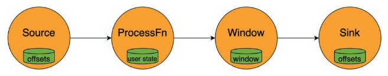
    - Source: offsets (“스트림에서 어디까지 읽어왔는지”를 기억)
    - ProcessFn: user state (사용자 로직(ProcessFunction) 내부에서 사용하는 중간 계산 결과, 카운터, 집계값 등을 저장)
    - Window: window (Window 연산이 유지해야 할 윈도우별 중간 집계 상태를 저장)
    - Sink: offsets (어디까지 데이터를 정상적으로 출력했는지를 기록)

- 상태의 유형
  - Keyed State (키 기반 상태)
    - 특정 키와 연관된 상태로, 각 키마다 별도의 상태를 유지  
    - ex. 사용자 ID별로 세션 정보를 저장하는 경우
  - Operator State (연산자 상태)
    - 특정 연산자와 연관된 상태로, 연산자 전체에 걸쳐 공유  
    - ex. 소스 연산자가 외부 시스템에서 데이터를 읽을 때 마지막으로 읽은 위치를 저장하는 경우
  - Broadcast State (브로드캐스트 상태)
    - 하나의 스트림에서 들어온 데이터를 모든 병렬 Task(하위 작업) 에 동일하게 복사해서 유지
    - “읽는 쪽”이 여러 개라도, 모든 Task가 동일한 상태를 공유해야 할 때 사용
    - 주로 Reference Data, 룰(rule), 설정(config) 등을 전체 작업에 배포할 때 활용됨
    - ex. 금지 키워드 목록이 있다고 가정 -> 금지 키워드 리스트가 업데이트되면 브로드캐스트 스트림을 통해 모든 TaskSlot으로 전파됨 -> 각 Task가 이 동일한 금지 키워드 목록을 가지고 이벤트를 필터링하거나 점검함

- 상태 관리 중요성
  - 정확성 보장
    - 상태를 통해 중간 결과를 저장하여 데이터 처리의 정확성을 유지
  - 장애 복구
    - 체크포인트와 세이브포인트를 활용하여 장애 발생 시에도 이전 상태로 복구
  - 성능 최적화
    - 효율적인 상태 관리를 통해 메모리 사용을 최적화
    - 대규모 데이터 처리에서도 안정적인 성능을 제공

- 상태 관리 예제 - KeyedSum 구현
  - 상태 관리를 위한 클래스 생성

    ```py
    # checkpointing.py

    # 상태 기반 연산 정의
    class KeyedSum(KeyedProcessFunction):

        def __init__(self):
            self.state = None

        def open(self, runtime_context):
            descriptor = ValueStateDescriptor("sum", Types.FLOAT())
            self.state = runtime_context.get_state(descriptor)
            
        # ctx는 타이머/워터마크용 컨텍스트지만 이 예제에서는 사용하지 않음
        def process_element(self, value, ctx):
            current_sum = self.state.value() or 0.0
            new_sum = current_sum + value[1]
            self.state.update(new_sum)

            print(f"[{value[0]}] 누적 금액: {new_sum}")

            yield (value[0], new_sum)
    ```
    - `KeyedProcessFunction` : Keyed Stream에서 동작하는 사용자 정의 함수 → 각 키별로 독립적인 상태(state) 유지 가능
    - `open(runtime_context)` : 상태 정의 및 초기화
      - `ValueStateDescriptor`로 상태 이름/타입 정의
      - `get_state()`로 실제 상태 객체(ValueState) 획득
    - `ValueState` : 하나의 값을 저장하는 키 기반 상태 → `.value()`로 읽고 `.update()`로 갱신
    - `process_element(value, ctx)` : 입력 이벤트 처리 함수
      - → 현재 상태 읽기 → 값 누적 → 상태 업데이트 → 결과 출력(yield)

  - Datastream에 적용(key_by 사용)

    ```py
    # 실행 환경 설정
    env = StreamExecutionEnvironment.get_execution_environment()
    env.set_parallelism(1)

    # Checkpoint 설정
    env.enable_checkpointing(10000)  # 10초 간격
    env.get_checkpoint_config().set_checkpoint_storage(
        FileSystemCheckpointStorage("file:///home/ssafy/flink_checkpointing/flink-checkpoints")
    )

    # CSV 데이터 로드
    df = pd.read_csv("data.csv")
    base_data = df[["transaction_id", "amount"]].dropna().values.tolist()

    # Job이 너무 빨리 끝나지 않게 데이터 좀 늘리기
    transactions = base_data * 100000  # 필요하면 숫자 더 줄여도 됨

    # Flink 데이터 스트림 생성
    transaction_stream = env.from_collection(
        transactions,
        type_info=Types.TUPLE([Types.STRING(), Types.FLOAT()])
    )

    # 상태 연산 적용 + output_type 명시
    result_stream = (
        transaction_stream
            .key_by(lambda x: x[0])
            .process(
                KeyedSum(),
                output_type=Types.TUPLE([Types.STRING(), Types.FLOAT()])
            )
    )

    # Sink
    result_stream.print()

    # 실행
    env.execute("Checkpointing Example")
    ```
    - 환경 및 체크포인트 설정
      - `StreamExecutionEnvironment` 생성
      - `enable_checkpointing()`으로 체크포인트 주기 설정
      - `FileSystemCheckpointStorage`로 체크포인트 저장 위치 지정
    - 입력 데이터 준비
      - CSV 파일 로드 후 (transaction_id, amount) 형태로 변환
      - Job 종료 방지를 위해 데이터 여러 번 복제
    - DataStream 생성
      - `env.from_collection()`으로 파이썬 리스트를 Flink 스트림으로 변환
      - Tuple 타입 정보 명시
    - 상태 기반 연산 적용
       - `.key_by(lambda x: x[0])` → transaction_id 기준으로 그룹핑
       - `.process(KeyedSum())` → 키별 누적 합계를 계산
       - output_type으로 출력 Tuple 타입 지정
    - Sink & 실행
      - `.print()`로 결과 출력
      - `env.execute()`로 Job 실행

- 체크포인트 파일 관련 주의사항
  - PyFlink에서 생성되는 상태 파일은 Python이 직접 저장하지 않고 JVM State Backend가 관리함
  - 상태 크기가 작으면 실제 state 파일은 생성되지 않고 `_metadata` 파일 안에 inline 형태로 저장됨
  - 그래서 체크포인트 디렉토리에 `_metadata`만 보여도 정상 동작임
  - RocksDBStateBackend를 사용하면 상태가 실제 파일로 분리되어 저장되는 것을 확인 가능

### Checkpointing
- 문서 처리에서의 "자동 저장"
  - 체크포인팅을 하면 현재까지의 처리 상태와 데이터를 안전한 곳에 저장함
  - 시스템에 장애가 발생하거나 프로그램이 중간에 멈추는 일이 생기더라도 마지막 저장한 체크포인트 지점부터 이어서 복구함
  - 데이터 유실을 방지할 수 있음

    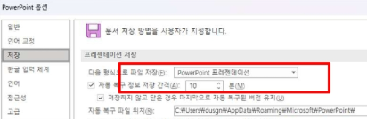

- 장애 발생 시 상태 복구 과정
  
  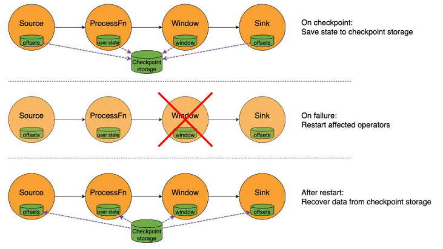
  - On checkpoint
    - 현재까지의 **상태(state)** 를 체크포인트 저장소에 안전하게 저장함
  - On failure
    - 장애가 발생하면, 장애의 영향을 받은 **오퍼레이터(operators)만 재시작**
    - 즉, 문제가 생긴 연산자만 재시작하므로, 이전에 저장해둔 상태를 불러올 수 있어야 함
  - After restart 
    - 재시작된 오퍼레이터는 체크포인트 저장소에서 저장된 상태를 불러와 복구한 뒤, 중단된 시점부터 처리를 이어감

- Checkpointing
  - 실행 중인 어플리케이션의 현재 상태를 백업해 놓은 스냅샷(snapshot)
  - 스냅샷을 주기적으로 찍어서 파일시스템(HDFS, S3 같은 곳)에 저장
  - 문제가 생기면 바로 이 체크포인트를 불러와서(recovery) 작업을 재개
    - 즉, 장애 발생 시 이 스냅샷을 이용해 중단 지점부터 복구(recovery) 가능

    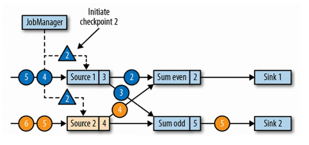
  - 그림 설명
    - 동그라미(●) : 데이터를 처리하는 연산자(Operator) / Task
      - 실제로 상태(state)를 유지하고 이벤트를 처리하는 실행 단위
    - 세모(▲) : Checkpoint Barrier
      - “이 시점까지의 상태를 저장하라”는 특별한 신호
      - JobManager가 체크포인트를 시작하면 Source에 Barrier를 삽입
      - 스트림을 따라 이벤트와 함께 흘러 downstream 연산자까지 전달됨
  
  - 그림 흐름
    1. JobManager가 “Checkpoint 2 시작”을 선언
    2. Source 1, Source 2에 세모(Barrier 2) 가 삽입됨
    3. Barrier는 동그라미들(각 연산자)을 차례대로 통과하며 전달됨
    4. 연산자는 입력 스트림의 Barrier를 모두 수신한 순간, 그 시점까지의 자신의 상태(state) 를 체크포인트에 저장
    5. 모든 연산자가 Barrier 2를 처리하면 → Checkpoint 2가 완전하게 완료ㅌ 
  
  - 따라서, 체크포인트의 목적은 단순히 저장하는게 아니라, 분산된 여러 연산자들이 동일한 시점의 상태를 갖기 위함

- Checkpointing 목적
  - 데이터 유실 방지 & 시스템 장애 대비
    - 장애가 발생해도 데이터 손실이나 중복 없이 정확히 한 번씩 처리를 이어갈 수 있는(Exactly-Once) 강력한 내구성을 갖게 됨
    - 프로그램이 정상 종료될 경우 체크포인트는 자동 제거됨(자동 생성 및 종료)

- Checkpointing 저장 방식 및 복구 과정
  - 분산 스토리지 + 로컬 스토리지에 상태 스냅샷 보관
    - 로컬 저장소는 노드 장애 시 내구성을 보장하지 않음
    - 다른 노드가 상태를 재분배할 수 있는 권한도 제공 안함
    - 따라서, 스냅샷 저장소의 기본값은 **분산 스토리지**!
  - 복구 시 Flink
    1. 로컬 저장소에서 먼저 복원 시도
    2. 실패하면 분산 스토리지 스냅샷에서 복원
        - 로컬 복구는 기본적으로 비활성화되어 있으며, 키를 사용한 Flink의 구성을 통해 활성화 가능

    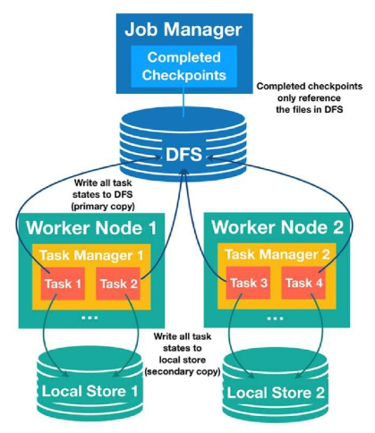
    - JobManager
      - 체크포인트를 관리하는 주체
      - 실제 상태 데이터는 저장하지 않고 DFS(분산 스토리지)에 있는 체크포인트 파일들을 참조하는 메타데이터만 유지
    - DFS (Distributed File System)
      - 체크포인트 상태의 기본(primary) 저장소
      - 모든 Worker의 Task 상태가 반드시 DFS에 저장됨
      - HDFS, S3 등 안정적인 분산 스토리지가 여기에 해당
    - Worker Node 1 / Worker Node 2
      - 각 워커 노드에는 여러 TaskManager와 Task가 실행됨
      - Task는 자신의 상태(state)를 두 곳에 저장
        1. DFS(기본 사본)
        2. 해당 노드의 Local Store(보조 사본)
    - Local Store 1 / Local Store 2
      - 각 노드의 로컬 디스크
      - 빠른 복구를 위해 “보조 사본(secondary copy)”을 저장
      - 하지만 노드 장애 시 함께 사라질 수 있어 내구성 보장 X
      
### Barrier
- 데이터 스트림 사이에 ‘장벽’을 세우는 것
  - 소스 노드들이 일정 주기마다 모든 스트림에 Checkpoint Barrier를 흘려보냄
  - Barrier가 특정 지점(연산자 등)에 도달하면, 자신의 상태를 저장
  - 즉, Barrier는 체크포인트의 시작 신호

- Barrier 동기화
  - 한 연산자가 입력 스트림을 여러 개 받고 있다면, **모든 입력으로부터 이 배리어를 하나씩 다 받을 때까지 기다렸다가 상태를 저장**
  - Barrier를 통해 모든 데이터 흐름에 동일한 시점의 일관된 스냅샷을 보장할 수 있음

- Barrier Alignment (Operator 내부에서 일어나는 3단계)

  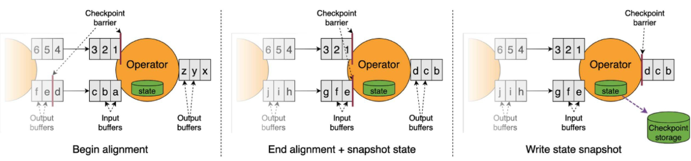
  1. Begin alignment (정렬 시작)
      - 연산자가 입력 스트림들 중 하나에서 Barrier를 먼저 받으면
      - → Barrier가 도착한 입력은 일시적으로 버퍼링(정지)
      - → 다른 입력 스트림에서 같은 Barrier가 도착할 때까지 기다리는 단계
  2. End alignment + snapshot state (정렬 완료 + 상태 스냅샷 생성)
      - 모든 입력 스트림에서 동일한 Barrier를 수신하면
      - → 연산자는 현재까지의 상태(state)를 스냅샷으로 저장
      - 이 시점에 input buffer에 잠시 쌓여 있던 데이터는 Barrier 이후 데이터이므로
      - → 정렬이 끝난 뒤 정상 처리 재개
  3. Write state snapshot (상태 스냅샷 저장)
      - 연산자가 저장한 상태(state)를 체크포인트 스토리지(DFS 등) 에 실제로 기록
      - 기록 완료 후, 연산자는 다시 이벤트 처리를 정상적으로 계속함
      - 이 과정을 모든 연산자가 수행하면 하나의 체크포인트가 완성됨

- Barrier 전체 Checkpoint 적용 순서 (Barrier가 언제 어떻게 전파되는지)
  1. Checkpoint Coordinator 가 일정 주기마다 모든 소스 노드들에게 신호를 보냄

      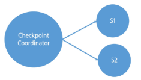

  2. 각 Source는 그 시점까지의 데이터를 기록하고, 다운스트림으로 체크포인트 배리어를 보냄

      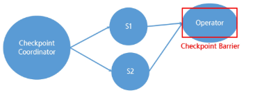

  3. operator들은 데이터를 계속 처리하다가 배리어를 받으면 일단 해당 입력에 대한 처리를 잠시 멈추고 대기. 그리고 자신의 상태를 그 순간에 저장함
      - 만약 여러 입력 중 한 곳에서만 배리어가 오고 다른 곳은 아직이라면, 
      - 받은 곳은 멈추고 나머지 입력들을 기다렸다가 모두 배리어에 도달하면 그때 스냅샷을 찍음

      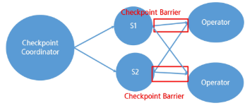

  4. 저장한 위치 정보(상태 핸들) JobManager에게 전송

      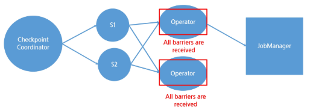

  5. 최종 싱크(Sink) 연산자들까지 모두 자신의 상태 저장을 마치고 신호를 보내면, 메타데이터 파일을 기록 및 저장

      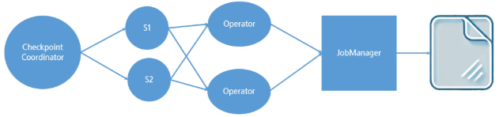

### SavePoint
- 게임에서의 ‘저장’ 기능
  - CheckPoint와 동일한 매커니즘으로 생성됨
  - 현재까지의 처리 상태와 데이터를 안전한 곳에 저장
  - 반드시 **사용자가 직접 생성 및 삭제**해야함 
    - 뭘? 스냅샷을!
  - -> 작업 종료 후나 복원 후에도 SavePoint는 유지됨

- checkpoint vs savepoint
  - checkpoint
    - 작업 재시작, 재배포에 사용
  - savepoint
    - 의도적으로 특정 시점 상태 저장
  - 장애 대응을 위해 주기적으로 저장하느냐, 내가 원해서 저장하느냐의 차이


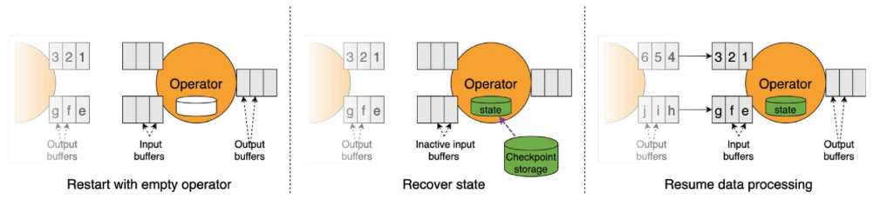
1. Restart with empty operator
    - 연산자(Task)가 상태 없이 초기화된 상태로 다시 시작됨
2. Recover state
    - Checkpoint storage에서 최근 Checkpoint의 state snapshot을 읽어
    - 가장 최근에 성공해 둔 체크포인트 데이터를 불러옴
    - → 연산자의 내부 상태 복원
3. Resume data processing
    - Checkpoint 이후의 데이터부터 다시 읽어 처리
      - 체크포인트 사이에 진행된 부분은 장애로 처리되지 못했으니 다시 처리하는 것
      - 소스 측에서 해당 체크포인트 이후의 데이터부터 다시 보내줌
    - Barrier alignment 덕분에 중복 없이 정확한 상태로 이어서 실행됨 (일관성 보장)

## Checkpointing 최적화
### Checkpointing 최적화 기술
- 비동기 체크포인팅 (Asynchronous Checkpointing)
  - 체크포인트를 찍는 동안 데이터 처리를 완전히 멈춘다면, 체크포인트에 걸리는 시간만큼 데이터 처리가 지연됨
  - 대부분의 상태 백엔드는 기본적으로 비동기 스냅샷을 지원함
  - 쓰레드나 별도의 방법으로 **상태 데이터를 백업하면서, 메인 데이터 처리는 계속 진행**하는 것
  - 체크포인팅으로 인한 지연(latency) 영향이 훨씬 줄어듬
  - 비동기 체크포인팅 = 게임 백그라운드 저장

    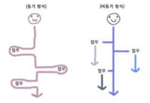

- 증분 체크포인팅 (Incremental Checkpointing)
  - GIT 저장 방식과 같이 매번 전체 상태를 다 저장하지 않고, 이전 체크포인트 이후 변경된 부분만 저장
  - Flink의 초기 버전에서는 모든 체크포인트마다 전체 상태를 통째로 저장(시간이 지날수록 상태 크기가 커짐)
  - 저장해야 하는 데이터 양이 줄어서 훨씬 빠르게 처리할 수 있음
  - 증분 체크포인팅 = 바뀐 것만 저장

    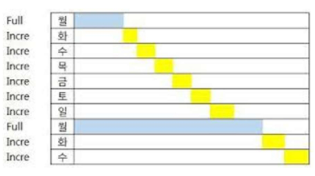

- Barrier Alignment 최적화
  - Barrier 정렬 과정은 한 입력 스트림이 매우 느려지거나 막혀버리면, 다른 빠른 스트림들도 체크포인트를 위해 그 느린 스트림을 기다려야 함
  - 따라서 정확한 스냅샷을 위해 꼭 필요하지만, 때로는 처리 지연을 유발하므로 최적화 필요
  - 최적화 기법: `Unaligned Checkpoint`
    - 느린 스트림을 굳이 기다리지 않고도 체크포인트를 수행
    - **배리어가 도착하지 않은 스트림의 데이터까지도 포함해서 그대로 체크포인트에 저장** (지금까지 온 데이터 전부를 일단 스냅샷에 넣는 것)
    - 체크포인트 진행이 특정 느린 채널에 발목 잡히지 않아서 전체적으로 빨라질 수 있음
    - 특히 네트워크 지연이나 백프레셔로 인해 일부 스트림에 정체된 데이터가 많을 때 유용
    - 단, 체크포인트 크기가 커질 수는 있음 
      - 즉, 복구할 때 복잡도가 약간 증가할 수 있다

- 체크포인트 주기 조정
  - 체크 포인트를 자주 찍을수록 장애 발생 시 잃는 데이터가 거의 없어 안전함
  - 그러나 너무 잦으면 그만큼 시스템에 부하가 걸리고 성능이 떨어질 수 있음
  - 반대로 너무 드물게 찍으면 성능은 좋지만 장애 시 더 많은 데이터를 다시 처리해야 하거나 데이터를 잃을 위험이 있음

    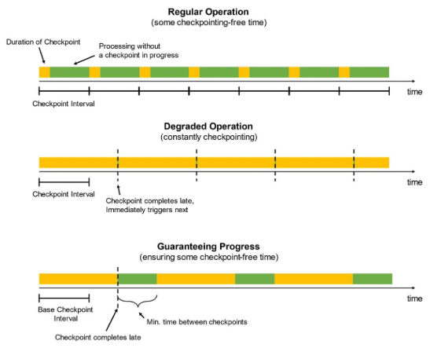
    - Regular Operation (정상 상태)
      - 체크포인트가 제때 완료되므로 → 체크포인트 사이에 자유롭게 처리하는 시간(green) 이 존재함
      - 성능 저하 없이 안정적으로 동작
    - Degraded Operation (성능 저하 상태)
      - 체크포인트 완료가 계속 늦어져 → 체크포인트가 끊임없이 이어서 실행됨(yellow)
      - 처리할 시간(green)이 거의 없어지고 시스템이 체크포인트 부담을 받음
    - Guaranteeing Progress (진행 보장)
      - 최소 처리 시간(min time between checkpoints)을 강제해 → 체크포인트 사이에 반드시 처리 구간(green) 을 확보

- 체크포인트 병렬성 조정
  - Flink는 기본적으로 모든 작업자(task)들이 동시에 자신의 상태를 체크포인트
  - 동시에 진행되는 체크포인트 개수 조절 가능(Default: 한번에 하나의 체크포인트)
  - MaxConcurrentCheckpoints 설정으로 여러 체크포인트를 중첩해서 진행할 수 있음

- 최소 간격(min pause) 설정
  - 체크포인트 끝나고 다음 체크포인트 시작까지 기다리는 최소 시간

- 체크 포인트 타임아웃 설정
  - 지정된 시간 내에 체크포인트를 완료 못 하면 실패로 간주하는 시간


## Window
연속적인 데이터를 스트림을 유한한 세그먼트로 분할하는 방법

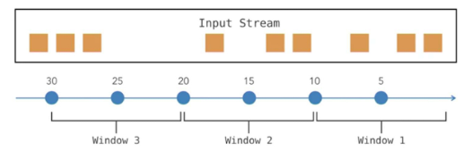
- 윈도우(Window)
  - 실시간으로 끊임없이 발생하는 스트림 데이터를 분석하기 위해서는, 데이터를 유한한 덩어리로 나누는 개념이 필요함
  - 즉, 윈도우는 연속적인 데이터 스트림을 특정 기준에 따라 유한한 세그먼트(구간)로 분할하는 방법
  - 윈도우를 사용하면 무한에 가까운 데이터 흐름을 잘게 나누어 각 조각마다 합계나 평균 같은 계산을 수행할 수 있음

- 윈도우가 필요한 이유
  - 무한 스트림의 처리 가능
    - 무한히 발생하는 이벤트 스트림을 유한한 크기로 나누어 처리할 수 있게 해줌
    - 전체 스트림에 대해 한 번에 평균을 계산하는 것은 불가능하지만, 1분 단위로 윈도우를 구분하여 각 분마다 평균을 계산하면 계속해서 업데이트되는 평균값을 얻을 수 있음
  - 변화 추적 및 시간별 통계
    - 윈도우별로 데이터를 구분하면 시간의 흐름에 따른 변화 추이를 관찰할 수 있음
  - 연속 계산 및 자원 절약
    - 모든 데이터를 모을 때까지 기다리지 않고 부분 결과를 지속 계산함으로써, 메모리나 저장공간을 효율적으로 사용할 수 있음

### 텀블링 윈도우 (Tumbling Window)
크기가 고정된 창으로, 서로 겹치지 않게 배치함

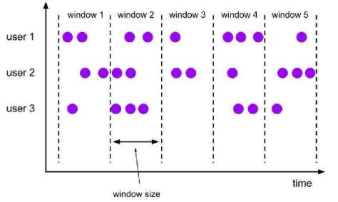

- 각 윈도우는 특정 고정 길이(ex. 1분, 100개 이벤트 등)를 가지며, 빈틈없이 배치함
- **각 데이터 요소**는 다른 윈도우에 중복되어 속하지 않으며, 모든 요소는 정확히 **하나의 텀블링 윈도우에만 속하게 됨**
- 매 분/시간/일별 집계, 배치(batch) 처리의 마이크로버전 등 일정한 시간 및 구간별 요약을 얻고자 할 때 적합함

- 텀블링 윈도우 동작 방식
  - 윈도우 길이를 미리 설정해두면, Flink가 스트림을 해당 간격으로 잘라서 독립적인 섹션으로 만듦
  - ex. 5분 텀블링 윈도우로 설정하면, 각 5분 구간에 도착한 이벤트들을 모아서, 5분이 끝나면 집계 결과를 한 번 출력하고 다음 윈도우로 넘어감

    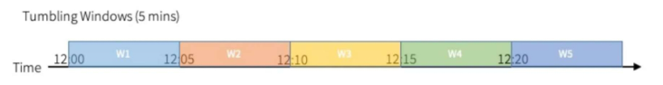

### 슬라이딩 윈도우 (Sliding Window)
텀블링 윈도우처럼 고정된 크기를 가지지만, 겹칠 수 있음

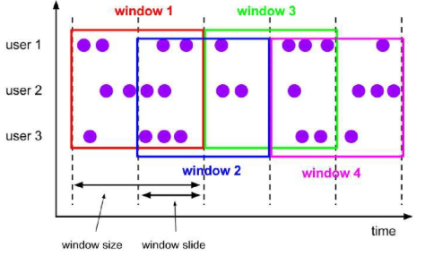

- 윈도우 크기와 슬라이드 간격 파라미터 설정 필요
- 윈도우들은 슬라이드 간격만큼씩 이동하면서 생성
- 슬라이드 간격이 윈도우 크기보다 작으면 새로운 윈도우가 시작될 때 이전 윈도우와 겹쳐지는 부분이 발생(중복 가능)

- 슬라이딩 윈도우 동작 방식
  - 윈도우 크기 10분, 슬라이드 간격 5분
  - 첫 윈도우는 0~10분 데이터를 포함하고 10분에 종료
  - 슬라이드 간격 5분이 지나면 두 번째 윈도우가 5~15분 구간으로 생성
  - 5~10분 구간의 데이터는 첫 번째와 두 번째 윈도우에 겹쳐 중복됨

    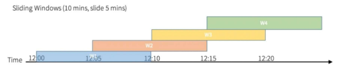

### 세션 윈도우 (Session Window)
고정된 크기가 없는 동적 윈도우

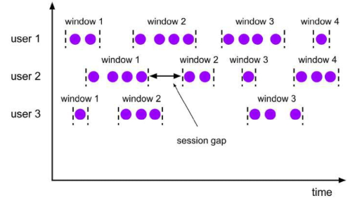

- 데이터의 발생 패턴에 따라 윈도우 구간이 결정됨
- 일반적으로 세션 간격(Session gap)이라고 불리는 비활동 기간(threshold)을 기준으로,
  - 일정 시간 이상 이벤트가 발생하지 않으면 하나의 세션 윈도우가 종료되고 다음 윈도우가 시작됨
  - 비활동시간 = 세션 간격(Session gap)

- 세션 윈도우 동작 방식
  - 세션 윈도우는 이벤트 사이의 간격을 추적
  - 연속된 이벤트들 사이의 시간이 설정한 세션 간격보다 작으면 같은 윈도우(세션)에 속함
  - 이벤트 간격이 기준보다 길게 비면 그 시점을 기준으로 이전 세션 윈도우가 닫히고 새로운 윈도우가 열림
  - 데이터 스트림에서 한동안(Event gap) 이벤트가 없으면, 그 앞까지를 하나의 세션으로 보고 그룹화

    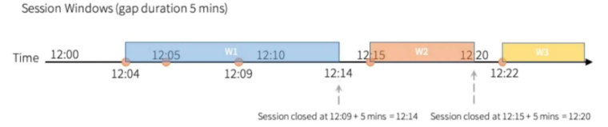

### 글로벌 윈도우 (Global Window)
스트림 전체를 하나의 윈도우로 간주

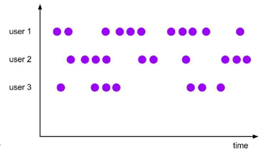

- 모든 이벤트가 한 윈도우에 속하게 되며, 윈도우의 범위에 시간적 제한이 없음
- 스트림을 하나로 묶어 버리기 때문에, 윈도우 자체로는 **절대 닫히지 않고 계속 열려있게 됨**
- 따라서 **사용자 정의 트리거**를 통해 **언제 결과를 산출할지를 반드시 정의**해주어야 함
  - 트리거 필수!!
  - 트리거가 조건을 가지고 있고, 조건을 만족할 때마다 결과를 산출하는 방식

- 글로벌 윈도우 동작 방식
  - 별도의 윈도우 분할 기준을 주지 않으면 모든 데이터가 한 창에 쌓이게 됨
  - 개발자가 원하는 시점에 출력을 발생시키는 트리거(trigger)를 설정해야 함
    - ex. Count 트리거 : 100개마다 출력

### 윈도우 구현
- 공통 환경 설정
  - 실행 환경 생성 및 데이터 소스 생성

    ```python
    import time
    from pyflink.datastream import StreamExecutionEnvironment
    from pyflink.common.time import Time
    from pyflink.datastream.window import SlidingProcessingTimeWindows
    from pyflink.common.typeinfo import Types

    # 실행 환경 생성
    env = StreamExecutionEnvironment.get_execution_environment()
    env.set_parallelism(1)

    # 데이터 소스 생성
    data_stream = env.from_collection(
        collection=[("user1", 1), ("user1", 3), ("user1", 4), ("user1", 5), ("user1", 5)],
        type_info=Types.TUPLE([Types.STRING(), Types.INT()])
    )
    ```

※ ProcessingTime vs Eventtime

-> ProcessingTime: 프로세스가 처리되는 시간

-> Eventtime: 이벤트가 발생한 시점

- 텀블링 윈도우 (Tumbling Window)
  - TumblingProcessingTimeWindows
    - 윈도우 크기: 2초 (겹치지 않는 고정 구간)
    - 각 이벤트 처리 delay: record 값별로 sleep (최대 5초)

  ```python
  import time
  from pyflink.datastream import StreamExecutionEnvironment
  from pyflink.datastream.window import TumblingProcessingTimeWindows
  from pyflink.common.time import Time
  from pyflink.common.typeinfo import Types

  # 각 이벤트별 지연 시간을 설정하는 함수
  # record: (user, value)
  def delayed_map(record):
      if record[1] == 0:
          time.sleep(5)
      elif record[1] in [1, 3]:
          time.sleep(0.5)
      elif record[1] == 4:
          time.sleep(2.8)
      elif record[1] == 5:
          time.sleep(0.5)
      return record

  # 실행 환경 생성 및 병렬성 1로 설정
  env = StreamExecutionEnvironment.get_execution_environment()
  env.set_parallelism(1)

  # 데이터 소스 생성
  data = [("user1", 1), ("user1", 3), ("user1", 4), ("user1", 5), ("user1", 0)]
  data_stream = env.from_collection(
      collection=data,
      type_info=Types.TUPLE([Types.STRING(), Types.INT()])
  )

  # 각 요소 처리 시 지연 적용: 도착 시간을 조절
  delayed_stream = data_stream.map(
      delayed_map,
      output_type=Types.TUPLE([Types.STRING(), Types.INT()])
  )

  # 텀블링 윈도우 적용: 2초 간격의 윈도우 (겹치지 않는 고정 윈도우)
  windowed_stream = (
      delayed_stream
          .key_by(lambda x: x[0])
          .window(TumblingProcessingTimeWindows.of(Time.seconds(2)))
          .reduce(lambda a, b: (a[0], a[1] + b[1]))
  )

  # 윈도우 연산 결과를 콘솔에 출력
  windowed_stream.print()

  # 애플리케이션 실행
  env.execute("Tumbling Window Example")

  # 잡 실행 후 추가 대기 (출력 flush를 위해)
  time.sleep(5)
  ```
  - 이벤트 처리 지연(sleep)으로 인해 실제 들어오는 시간
    ```
    ("user1", 1)   → 0.5초 sleep
    ("user1", 3)   → 0.5초 sleep
    ("user1", 4)   → 2.8초 sleep
    ("user1", 5)   → 0.5초 sleep
    ("user1", 0)   → 5초 sleep
    ```
  - 윈도우별 실제 포함되는 이벤트
    1. 윈도우 0~2초
        - `T=0.5초`: (1)이 map을 통과하여 [0-2초] 윈도우에 도착
        - `T=1.0초`: (3)이 map을 통과하여 [0-2초] 윈도우에 도착
        - `T=2.0초`: 윈도우가 닫히는 시점. (실제로는 map(4)의 sleep(2.8) 때문에 T=3.8초에 지연되어 실행됨)
        - 포함된 이벤트: `[("user1", 1), ("user1", 3)]`
        - reduce 실행: 1 + 3 = 4
        - 출력: `(user1, 4)`
    2. 윈도우 2~4초
        - `T=3.8초`: (4)가 map을 통과하여 [2-4초] 윈도우에 도착
        - `T=4.0초`: 윈도우가 닫히는 시점. (실제로는 map(5)의 sleep(0.5) 때문에 T=4.3초에 지연되어 실행됨)
        - 포함된 이벤트: `[("user1", 4)]`
        - reduce 실행: (요소가 하나이므로) 단일 요소 4를 그대로 반환
        - 출력: `(user1, 4)`
    3. 윈도우 4~6초
          - `T=4.3초`: (5)가 map을 통과하여 [4-6초] 윈도우에 도착
          - `T=6.0초`: 윈도우가 닫히는 시점. (실제로는 map(0)의 sleep(5.0) 때문에 T=9.3초에 지연되어 실행됨)
          - 포함된 이벤트: `[("user1", 5)]`
          - 출력: `(user1, 5)`
    4. 이후 `(user1, 0)`도 단독으로 출력
  - 예상 결과
    ```
    (user1,4)
    (user1,4)
    (user1,5)
    (user1,0)
    ```

  - 실제 결과
    ```
    (user1,4)
    (user1,9)
    ```
    - 왜 9가 나올까?
      - reduce는 “각 윈도우 내부에서만” 값을 누적하지만, ProcessingTime 윈도우에서는 time.sleep 때문에 이벤트가 예상과 다른 윈도우로 들어가게 됨
      - 즉, 이벤트가 2초 텀블링 윈도우 경계를 정확히 맞춰 들어가지 못하면서 의도한 조합이 아닌 값들이 같은 윈도우에 들어가 reduce가 예상과 다르게 계산됨
      - 이 실행에서는 (4), (5), (0)이 같은 윈도우 안으로 들어오면서 해당 윈도우의 reduce 결과가 9가 만들어짐
        - 첫 번째 윈도우: 1, 3 → 4 출력
        - 두 번째 윈도우: 4, 5 → 9 출력 (0은 처리 타이밍에 따라 다른 윈도우로 들어가거나 무시될 수 있음)
      - 결국 ProcessingTime 지연 때문에 이벤트의 실제 처리 시각이 달라지고, 그로 인해 어떤 이벤트들이 같은 윈도우에 묶이느냐가 달라져 결과가 달라지는 전형적인 케이스

  - `data_engineering\04_Flink\FlinkCode\03_checkpointing_window\tumbling_window.py` 참고

- 슬라이딩 윈도우 (Sliding Window)
  - SlidingProcessingTimeWindows
    - 1.2초 지연(각 이벤트 처리 delay), 윈도우 크기 2초, 슬라이드 간격 1초
    - 현재 시스템 시각(처리 시간) 기준으로 2초 동안 들어온 값의 합을 계산하고 1초마다 결과를 출력함

  ```python
  # map 연산 내에서 1.2초 지연 추가(time.sleep)
  delayed_stream = data_stream.map(
      lambda x: (x[0], x[1]) if time.sleep(1.2) is None else (x[0], x[1]),
      output_type=Types.TUPLE([Types.STRING(), Types.INT()])
  )

  # 슬라이딩 윈도우 적용: 윈도우 크기 2초, 슬라이드 간격 1초
  windowed_stream = (
      delayed_stream
      .key_by(lambda x: x[0])
      .window(SlidingProcessingTimeWindows.of(Time.seconds(2), Time.seconds(1)))
      .reduce(lambda a, b: (a[0], a[1] + b[1]))
  )

  windowed_stream.print()
  env.execute("ProcessingTime Window Example")
  ```
  - 데이터: `[("user1", 1), ("user1", 3), ("user1", 4), ("user1", 5), ("user1", 0)]`
  - 윈도우: 2초 크기, 1초 슬라이드 -> `.of(Time.seconds(2), Time.seconds(1))`
  - 지연: `time.sleep(1.2)` (모든 이벤트에 공통 적용)
  - 윈도우 계산 타임라인
    1. 윈도우 0~2초 (T=2.0초에 닫힐 예정)
        - `T=1.2초`: (1)이 map을 통과하여 **[0-2초]**와 [1-3초] 윈도우에 도착
        - `T=2.4초`: map(3)의 sleep이 끝난 후, 지연되었던 [0-2초] 윈도우가 실행됨
        - 포함된 이벤트: `[("user1", 1)]`
        - 출력: `(user1, 1)`
    2. 윈도우 1~3초 (T=3.0초에 닫힐 예정)
        - `T=2.4초`: (3)이 map을 통과하여 [1-3초]와 [2-4초] 윈도우에 도착
        - T=3.6초`: map(4)의 sleep이 끝난 후, 지연되었던 [1-3초] 윈도우가 실행됨
        - 포함된 이벤트: `[("user1", 1), ("user1", 3)]` (1.2초에 온 1과 2.4초에 온 3이 모두 포함됨)
        - reduce 실행: 1 + 3 = 4
        - 출력: `(user1, 4)`
    3. 윈도우 2~4초 (T=4.0초에 닫힐 예정)
        - `T=3.6초`: (4)가 map을 통과하여 [2-4초]와 [3-5초] 윈도우에 도착
        - `T=4.8초`: map(5)의 sleep이 끝난 후, 지연되었던 [2-4초] 윈도우가 실행됨
        - 포함된 이벤트: `[("user1", 3), ("user1", 4)]` (2.4초에 온 3과 3.6초에 온 4가 포함됨)
        - reduce 실행: 3 + 4 = 7
        - 출력: `(user1, 7)`
    4. 윈도우 3~5초 (T=5.0초에 닫힐 예정)
        - `T=4.8초`: (5)가 map을 통과하여 [3-5초]와 [4-6초] 윈도우에 도착
        - `T=6.0초`: map(0)의 sleep이 끝난 후, 지연되었던 [3-5초] 윈도우가 실행됨
        - 포함된 이벤트: `[("user1", 4), ("user1", 5)]` (3.6초에 온 4와 4.8초에 온 5가 포함됨)
        - reduce 실행: 4 + 5 = 9
        - 출력: `(user1, 9)`
    5. 윈도우 4~6초 (T=6.0초에 닫힐 예정)
        - `T=6.0초`: map(0)의 sleep이 끝난 시점. 이 윈도우는 지연되지 않고 정시에 실행됨
        - 포함된 이벤트: `[("user1", 5)]` (4.8초에 온 5만 포함됨)
        - 출력: `(user1, 5)`
    6. 이후 윈도우 (5~7초, 6~8초)
        - `T=6.0초`: (0)이 map을 통과하여 [5-7초]와 [6-8초] 윈도우에 도착
        - `T=7.0초`: [5-7초] 윈도우가 닫힘. (포함: [0]) → (user1, 0) 출력
        - `T=8.0초`: [6-8초] 윈도우가 닫힘. (포함: [0]) → (user1, 0) 출력

  - 예상 결과
    ```
    (user1,1)  → 0~2초 윈도우  
    (user1,4)  → 1~3초 윈도우  
    (user1,7)  → 2~4초 윈도우  
    (user1,9)  → 3~5초 윈도우  
    (user1,5)
    (user1,0)
    (user1,0)
    ```
  
  - 실제 결과
    ```
    (user1,1)
    (user1,1)
    (user1,3)
    (user1,3)
    (user1,9)
    ```

  - `data_engineering\04_Flink\FlinkCode\03_checkpointing_window\sliding_window.py` 참고
    - ProcessingTime 윈도우는 “실제 처리된 시간” 기준이라서, `time.sleep` 때문에 이벤트 처리 시간이 밀리면 데이터가 다른 윈도우에 들어가 버려서 결과가 달라질 수 있음
    - 즉, sleep 때문에 처리 타이밍이 흔들리고
    - 윈도우는 실제 시간 기준으로 계속 열리고 닫히기 때문에
    - 기대한 합계가 아니라 뒤죽뒤죽 다른 윈도우에 들어가서 다른 결과가 나옴

※ ProcessingTime 윈도우는 "실제 처리된 시간" 기준 -> time.sleep 같은 **처리 지연(delay)**에 매우 취약함

> 텀블링 윈도우 예제처럼 지연이 불규칙하면(0.5초, 2.8초 등), 이벤트가 "뒤죽박죽" 섞여 (9)처럼 예측 불가능한 결과가 나옴

> 슬라이딩 윈도우 예제처럼 지연이 일정해도(1.2초), 모든 윈도우 계산이 "밀려서" 실행되며, 만약 이 지연이 윈도우 크기(2초)보다 길어지면 이벤트가 계산에서 **"누락"** 되는 치명적인 문제가 발생
 (이벤트가 도착하기도 전에 윈도우가 닫혀버리기 떄문 (정확히는, 윈도우 시간 범위 밖으로 밀려남))

- 세션 윈도우 (Session Window)
  - ProcessingTimeSessionWindows
    - 세션 간격 2초: 2초 동안 새로운 이벤트가 없으면 세션 종료, 윈도우 닫힘

  ```python
  import time
  from pyflink.datastream import StreamExecutionEnvironment
  from pyflink.datastream.window import ProcessingTimeSessionWindows
  from pyflink.common.time import Time
  from pyflink.common.typeinfo import Types

  # 각 이벤트별 지연 시간을 설정하는 함수
  # record: (user, value)
  def delayed_map(record):
      # Session 테스트를 위해 데이터별 딜레이 설정.
      if record[1] == 0:
          time.sleep(5)
      elif record[1] in [1, 3]:
          time.sleep(0.5)
      elif record[1] == 4:
          time.sleep(2)
      elif record[1] == 5:
          time.sleep(0.2)
      return record

  # 실행 환경 설정
  env = StreamExecutionEnvironment.get_execution_environment()
  env.set_parallelism(1)

  # dummy 이벤트를 포함하여 데이터를 준비
  data = [("user1", 1), ("user1", 3), ("user1", 4), ("user1", 5), ("user1", 0)]
  data_stream = env.from_collection(
      collection=data,
      type_info=Types.TUPLE([Types.STRING(), Types.INT()])
  )

  # map 연산에서 지연 적용
  delayed_stream = data_stream.map(
      delayed_map,
      output_type=Types.TUPLE([Types.STRING(), Types.INT()])
  )

  # Processing Time Session Window: gap 2초
  windowed_stream = (
      delayed_stream
          .key_by(lambda x: x[0])
          .window(ProcessingTimeSessionWindows.with_gap(Time.seconds(2)))
          .reduce(lambda a, b: (a[0], a[1] + b[1]))
  )

  windowed_stream.print()
  env.execute("Session Window Split Example")

  # 잡 실행 후 추가 대기 (출력 flush를 위해)
  time.sleep(5)
  ```
  - 데이터: `[("user1", 1), ("user1", 3), ("user1", 4), ("user1", 5), ("user1", 0)]`
  - Sleep 값: 
    - (1): 0.5초
    - (3): 0.5초
    - (4): 2.0초
    - (5): 0.2초
    - (0): 5.0초
  - 세션 Gap: 2초

  - 세션이 어떻게 나뉘나?
    - 이벤트 A 처리 완료 → 이벤트 B 처리까지 2초 이내 → 같은 세션
    - 2초 넘게 간격이 벌어지면 → 새로운 세션 생성
  
  - 실제 처리 흐름
    1. 세션 1: (1)과 (3)이 묶임
        - `T=0.5초`: map(1)이 끝나고 (1)이 윈도우에 도착
          - **[세션 1]** 이 생성됨
          - Flink가 T=0.5초 + 2초 = 2.5초에 세션 종료 타이머를 설정함
        - `T=1.0초`: map(3)이 끝나고 (3)이 윈도우에 도착
          - (1)이 도착한 T=0.5초와의 간격은 0.5초
          - 0.5초 < 2초 (Gap)이므로, (3)은 **[세션 1]** 에 병합됨
          - Flink가 세션 종료 타이머를 `T=1.0초 + 2초 = 3.0초`로 연장(update)
    2. 세션 1 종료 / 세션 2 시작: (4)에서 분리됨
        - `T=3.0초`: map(4)가 끝나고 (4)가 윈도우에 도착
          - (3)이 도착한 T=1.0초와의 간격은 2.0초
          - 이 간격(2.0초)은 설정된 Gap(2.0초)보다 작지 않음
          - 따라서 Flink는 (4)가 도착하기 직전(T=3.0초)에 **[세션 1]** 의 타이머가 만료되었다고 판단
          - **[세션 1]** 이 닫히고, `reduce(1, 3)`가 실행됨
          - 출력: `(user1, 4)`
          - (4)는 T=3.0초에 **[세션 2]** 를 새로 시작함
          - Flink가 `T=3.0초 + 2초 = 5`.0초에 세션 종료 타이머를 설정함
    3. 세션 2: (5)가 묶임
        - `T=3.2초`: map(5)가 끝나고 (5)가 윈도우에 도착
          - (4)가 도착한 T=3.0초와의 간격은 0.2초
          - 0.2초 < 2초 (Gap)이므로, (5)는 **[세션 2]** 에 병합됨
          - Flink가 세션 종료 타이머를 `T=3.2초 + 2초 = 5.2초`로 연장함
    4. 세션 2 종료 / 세션 3 시작: (0)에서 분리됨
        - `T=8.2초`: map(0)이 끝나고 (0)이 윈도우에 도착
        - (5)가 도착한 T=3.2초와의 간격은 5.0초
        - 5.0초 > 2초 (Gap)이므로, 세션이 분리됨
        - Flink는 map(0)의 sleep(5.0) 동안(T=3.2초 ~ T=8.2초) 이미 T=5.2초에 **[세션 2]** 의 타이머가 만료되었다고 판단
        - T=8.2초에 sleep이 끝나자마자, 밀렸던 **[세션 2]** 의 종료 처리를 실행함
        - `reduce(4, 5)`가 실행됨
        - 출력: `(user1, 9)`
        - (0)은 T=8.2초에 **[세션 3]** 을 새로 시작함
        - Flink가 `T=8.2초 + 2초 = 10.2초`에 세션 종료 타이머를 설정함
    5. 세션 3 종료
        - 더 이상 데이터가 없으므로, `T=10.2초` (혹은 잡 종료 시) **[세션 3]** 의 타이머가 실행됨
        - 출력: `(user1, 0)`

  - 예상 결과
    ```
    (user1,4)   <-- 세션 1: [1, 3]
    (user1,9)   <-- 세션 2: [4, 5]
    (user1, 0)  <-- 세션 3: [0]
    ```
  - `data_engineering\04_Flink\FlinkCode\03_checkpointing_window\session_window.py` 참고
    - 얘도 ProcessingTime Session Window(처리 시간 기반 세션 윈도우)이기 때문에,
    - `time.sleep()`으로 인해 이벤트 처리 시점이 매번 달라져 윈도우 결과가 일정하지 않게 변할 수 있음
      > ProcessingTimeSessionWindow는 **이벤트가 언제 처리되었는지(실제 시스템 시간)** 을 기준으로 세션을 나눔

      > 그런데 map 연산에서 time.sleep으로 처리 시간이 매번 달라짐(어떤 이벤트는 1.5초 지연, 어떤 이벤트는 2.8초 지연) -> 이 지연 때문에 각 이벤트가 Flink에 “도착한 시각”이 매번 달라짐

      > 따라서 같은 입력 데이터를 사용하더라도 이벤트 간격이 2초를 넘기도 하고, 안 넘기도 함 → 세션이 의도보다 더 많아지거나, 합계가 다른 조합으로 계산되는 결과가 나올 수 있음

- 글로벌 윈도우 (Global Window)
  - GlobalWindows

  ```python
  from pyflink.datastream import StreamExecutionEnvironment
  from pyflink.datastream.window import GlobalWindows, Trigger, TriggerResult
  from pyflink.datastream.state import ValueStateDescriptor
  from pyflink.common.typeinfo import Types

  # 사용자 정의 CountTrigger: 요소 3개 오면 FIRE_AND_PURGE
  class CustomCountTrigger(Trigger):
      def __init__(self, count):
          super(CustomCountTrigger, self).__init__()
          self.count = count

      @staticmethod
      def of(count):
          return CustomCountTrigger(count)

      def on_element(self, element, timestamp, window, ctx):
          state_desc = ValueStateDescriptor("state", Types.INT())
          state = ctx.get_partitioned_state(state_desc)
          current = state.value() or 0
          current += 1
          state.update(current)
          if current >= self.count:
              state.clear()
              return TriggerResult.FIRE_AND_PURGE
          return TriggerResult.CONTINUE

      def on_processing_time(self, time, window, ctx):
          return TriggerResult.CONTINUE

      def on_event_time(self, time, window, ctx):
          return TriggerResult.CONTINUE

      def clear(self, window, ctx):
          state_desc = ValueStateDescriptor("state", Types.INT())
          ctx.get_partitioned_state(state_desc).clear()

      def on_merge(self, window, ctx):
          return TriggerResult.CONTINUE
  ```
  - `GlobalWindows.create()`
    - 모든 데이터를 key 구분 없이 (`.window_all`을 사용했으므로) 단 하나의 무한한 윈도우에 할당함
  - `CustomCountTrigger.of(3)`
    - 요소(element) 3개가 들어올 때마다 결과를 출력(FIRE)하고, 윈도우를 비움(PURGE)
    - 작동 플로우:
      1. 요소 1개 들어오면 count=1 → CONTINUE
      2. 요소 2개 들어오면 count=2 → CONTINUE
      3. 요소 3개 들어오면 count=3 → FIRE_AND_PURGE (계산 + 초기화)
  - `TriggerResult.FIRE_AND_PURGE`
    - `FIRE`: 카운트가 3이 되면 reduce 연산(a + b)을 실행하라고 Flink에 신호를 보냄
    - `PURGE`: reduce가 실행된 후, 윈도우에 쌓여있던 데이터([1, 2, 3])와 집계 상태(6)를 모두 비움

  ```python
  # 실행 환경 생성
  env = StreamExecutionEnvironment.get_execution_environment()
  env.set_parallelism(1)

  # 입력 데이터: 정수 리스트
  data = [1, 2, 3, 4, 5, 6]
  ds = env.from_collection(collection=data, type_info=Types.INT())

  # Global Windows 적용: 전체 스트림을 하나의 윈도우로 묶고,
  # CustomCountTrigger.of(3)을 통해 요소 3개마다 트리거
  windowed = ds.window_all(GlobalWindows.create()) \
      .trigger(CustomCountTrigger.of(3)) \
      .reduce(lambda a, b: a + b)

  # 결과 출력
  windowed.print()

  # 애플리케이션 실행
  env.execute("GlobalWindows Example")
  ```
  - 결과
    - 첫 번째 3개: `1 + 2 + 3 = 6` -> FIRE(출력) -> PURGE(윈도우 비워짐)
    - 두 번째 3개: `4 + 5 + 6 = 15` -> FIRE(출력) -> PURGE(윈도우 비워짐)


## Triggers 및 Evictors
### Trigger
윈도우가 언제 결과를 내보낼지를 결정하는 조건/규칙

-> 각 윈도우에는 디폴트 트리거가 정의되어 있어서, 특별히 지정하지 않아도 작동함

- 기본 트리거 종류
  - 이벤트 시간 기반 윈도우
    - **이벤트에 기록된 원본 발생 시간을 기준**으로, 윈도우의 종료 시간에 도달하면 (정확히는 워터마크가 도달하면) 트리거가 동작함
  - 처리 시간 기반 윈도우
    - Flink가 이벤트를 처리하는 **장비의 현재 시스템 시계를 기준**으로, 윈도우의 종료 시간에 도달하면 트리거가 동작함
  - 세션 윈도우
    - 마지막 이벤트를 받은 후 설정된 비활성 간격(gap) 동안 새 이벤트가 없으면 윈도우를 닫고 트리거가 동작함

- 트리거 로직 종류
  - 시간 기반 트리거
    - 일정 시간 간격으로 윈도우를 강제로 출력
    - ex. Processing-Time 트리거: 5초마다 강제 출력
  - 카운트 기반 트리거
    - 윈도우에 누적된 이벤트 개수가 특정 숫자에 도달할 때 출력
    - ex. 100개의 이벤트가 모일 때마다 출력
  - 복합 조건 트리거
    - 시간 OR 카운트 등 여러 조건 중 하나 만족 시 출력하거나, AND 조건 등 조합
    - ex. 1분이 지났거나 50개가 모이면 출력
  - 사용자 정의 트리거
    - 특정 값 이상이 되면 출력 등, Trigger 인터페이스를 구현하여 onElement에서 임의의 조건으로 FIRE 시킴

### TriggerResult
트리거 발생했을 때 실제로 어떤 동작을 하게 만들 것인지

| TriggerResult | 설명 | 사용 |
| --- | --- | --- |
| `TriggerResult.FIRE` | 현재까지 수집된 데이터를 출력하지만 윈도우는 유지 | 부분 출력을 원할 때 |
| `TriggerResult.FIRE_AND_PURGE` | 현재까지 수집된 데이터를 출력하고 윈도우를 초기화 | 새로운 윈도우 시작할 때 |
| `TriggerResult.CONTINUE` | 현재 윈도우를 유지하고 아무 작업도 수행하지 않음 | 기준이 충족되지 않았을 때 |
| `TriggerResult.PURGE` | 출력 없이 윈도우만 초기화 | 이벤트 삭제할 때 |

### 기본 Trigger 유형
- ProcessingTimeTrigger
  - 처리 시간 기준 특정 시점에 FIRE
- EventTimeTrigger
  - 이벤트 시간 워터마크 기준 FIRE (모든 이벤트-타임 윈도우의 default 트리거)
- CountTrigger
  - 누적 이벤트 개수가 기준에 도달하면 FIRE

### CustomTrigger
- Trigger 클래스 상속, 필수 메서드 구현
  - Trigger 구현을 위해 반드시 추상 메서드 5개를 구현해야 함
  - 미사용 메서드는 `return TriggerResult.CONTINUE` 로 처리할 수 있음

    | 메서드 | 설명 | 사용 여부 |
    | --- | --- | --- |
    | `on_element(self, element, timestamp, window, ctx)` | 새 데이터가 들어올 때 실행됨 | **필수** |
    | `on_processing_time(self, time, window, ctx)` | 특정 처리 시간이 도래하면 실행됨 | 선택 |
    | `on_event_time(self, time, window, ctx)` | 특정 이벤트 시간이 도래하면 실행됨 | 선택 |
    | `on_merge(self, window, ctx)` | 여러 윈도우가 병합될 때 실행됨 | 선택 |
    | `clear(self, window, ctx)` | 윈도우가 닫힐 때 상태 초기화 | **필수** |

### CustomTrigger 예제 : CountTrigger
Trigger 클래스 상속, 필수 메서드 구현 예제

```py
# Trigger를 상속받고 CountTrigger 형태로 커스텀 트리거 구현
class CustomCountTrigger(Trigger):
    def __init__(self, count_threshold):
        super().__init__()
        self.count_threshold = count_threshold  # 몇 개의 요소마다 트리거를 실행할지 설정

    @staticmethod
    def of(count_threshold):
        return CustomCountTrigger(count_threshold)

    # 핵심 메서드(CustomTrigger 필수 메서드): 새 요소가 들어올 때마다 호출됨
    def on_element(self, element, timestamp, window, ctx):
        """ 새 요소가 들어올 때마다 호출됨 """
        count_state_desc = ValueStateDescriptor("count", Types.INT())  # 상태 저장을 위한 ValueStateDescriptor
        count_state = ctx.get_partitioned_state(count_state_desc)

        current_count = count_state.value() or 0  # 현재 상태 값 가져오기 (없으면 0)
        current_count += 1
        count_state.update(current_count)  # 상태 값 업데이트

        if current_count >= self.count_threshold:
            count_state.clear()  # 카운트 리셋
            return TriggerResult.FIRE_AND_PURGE  # 트리거 실행 + 윈도우 초기화
        return TriggerResult.CONTINUE  # 계속 대기
```
- `CustomCountTrigger`
  - 이 클래스는 Flink의 Trigger를 상속받아, "데이터 개수(Count)" 를 기준으로 윈도우를 닫고 결과를 배출(Fire)할지 결정함
  - `ValueStateDescriptor` & `ctx.get_partitioned_state`
    - Flink는 분산 환경에서 동작하므로, 단순히 클래스 멤버 변수(self.count)로 카운트를 세면 안됨 (장애 발생 시 데이터가 유실될 수 있음)
    - 반드시 Flink가 관리하는 **State(상태 저장소)** 를 사용해야 하며, 여기서는 정수형(Types.INT) 데이터를 저장하는 ValueState를 사용하여 현재까지 들어온 데이터 개수를 기록함
  - `TriggerResult` 반환 값
    - `CONTINUE`: 아무 일도 하지 않음 (다음 데이터 대기)
    - `FIRE_AND_PURGE`: 현재 윈도우의 계산 결과(Reduce)를 내보내고(FIRE), 윈도우 내부의 데이터를 비움(PURGE)
      - 이로 인해 다음 계산은 0부터 다시 시작됨
```py
# 필수 메서드 이외에 나머지 메서드들도 구현 (사용하지 않음) -> return TriggerResult.CONTINUE로 처리
def on_processing_time(self, self, time, window, ctx):
    """ 처리 시간 기반 트리거 (사용하지 않음) """
    return TriggerResult.CONTINUE

def on_event_time(self, self, time, window, ctx):
    """ 이벤트 시간 기반 트리거 (사용하지 않음) """
    return TriggerResult.CONTINUE

def on_merge(self, window, ctx):
    """ 여러 윈도우가 병합될 때 호출됨 (사용하지 않음) """
    return TriggerResult.CONTINUE

def clear(self, window, ctx):
    """ 윈도우가 닫힐 때 상태 초기화 """
    count_state_desc = ValueStateDescriptor("count", Types.INT())
    ctx.get_partitioned_state(count_state_desc).clear()
```
```py
# 실행 환경 설정
env = StreamExecutionEnvironment.get_execution_environment()
env.set_parallelism(1)

# 입력 데이터: 1부터 15까지의 숫자
data = [(i,) for i in range(1, 16)]
ds = env.from_collection(collection=data, type_info=Types.TUPLE([Types.INT()]))

# GlobalWindow + 사용자 정의 CountTrigger(5개마다 실행)
windowed = (
    ds.window_all(GlobalWindows.create())
      .trigger(CustomCountTrigger.of(5))
      .reduce(lambda a, b: (a[0] + b[0],))  # 집계: 합계 구하기
)

# 결과 출력
windowed.print()

# 실행
env.execute("Custom CountTrigger Example")
```
- `GlobalWindows`
  - 기본적으로 윈도우가 닫히지 않는 단 하나의 거대한 윈도우를 생성
  - 시간이나 세션 같은 기준이 없으므로, CustomTrigger가 없으면 데이터는 영원히 쌓이기만 하고 절대 결과를 출력하지 않음
  - 우리가 만든 CustomCountTrigger가 "5개가 찰 때마다" 강제로 문을 열어주는 역할을 함
- `reduce(lambda ...)`
  - 트리거가 발동(FIRE)될 때 실행되는 집계 함수
  - 들어온 튜플들의 첫 번째 요소(a[0] + b[0])를 계속해서 더해나감

- 결과

  | 윈도우 배치 | 포함된 데이터 | 계산 과정 (Reduce) | 결과 출력 | 트리거 동작 |
  | :--- | :--- | :--- | :--- | :--- |
  | **1차** | 1, 2, 3, 4, 5 | 1+2+3+4+5 | **(15)** | `FIRE_AND_PURGE` (초기화) |
  | **2차** | 6, 7, 8, 9, 10 | 6+7+8+9+10 | **(40)** | `FIRE_AND_PURGE` (초기화) |
  | **3차** | 11, 12, 13, 14, 15 | 11+12+13+14+15 | **(65)** | `FIRE_AND_PURGE` (초기화) |


## Evictor
윈도우에서 일부 요소를 제거(evict)하는 역할

- 윈도우 연산이 수행되기 전후에 적용되어, 남겨둘 요소와 버릴 요소를 결정할 수 있음
  - 특정 기준에 따라 오래된 데이터나 조건에 맞지 않는 데이터를 윈도우에서 빼냄으로써 실제 연산에 사용되는 데이터 범위를 조절함

- 사용이유 (ex. 길이가 1시간인 윈도우에서 최대값 구하기)
  - 데이터를 오래 유지하면 메모리 사용량이 증가하고, 최근 데이터만 남기면 분석 효율이 증가함
    - 이빅터를 사용해 최근 10분치 데이터만 남겨두고 이전 50분치 데이터는 버릴 수 있음
  - 메모리 사용 최적화
    - 오래된 데이터(50분 이전)는 제거됨
  - 최신 데이터 기반 분석 가능
    - 최근 10분 데이터만 반영되므로 실시간성 유지됨
  - 윈도우 크기는 1시간으로 유지
    - 여전히 1시간 내에서 트리거가 실행되지만, 계산은 최근 10분 데이터만 사용하는 효과 발생
    - 즉, 50분치 데이터가 윈도우 연산 흐름에서 완전히 제거되어 없어진 것처럼 취급되어 동작함

### Evictor 유형
- `CountEvictor(N)`
  - 각 윈도우마다 N개의 요소만 유지하고 나머지는 제거됨
  - ex. 윈도우에 100개가 쌓였는데 CountEvictor(50)을 쓰면 50개만 남기고 50개 evict
- `TimeEvictor(t)`
  - 현재 윈도우의 가장 늦은 타임스탬프
  - t 보다 이전의 모든 요소를 제거함
  - ex. TimeEvictor(10초) → 윈도우 내에서 최신 이벤트 시간으로부터 10초보다 더 오래된 이벤트들은 제외하고 연산
- `DeltaEvictor(Δ)`
  - 델타 함수를 이용한 사용자 정의 기준
  - 요소들 간의 차이나 특정 속성 변화량이 설정한 Δ 기준보다 크면 제거하는 방식 등 사용자가 DeltaFunction을 정의해야 함

### TimeEvictor 예제
- 오래된 데이터 제거
  - 윈도우 자체는 60분치 데이터를 모으지만, 실제 계산에는 가장 최근 10분 이내의 데이터만 사용

```py
# 데이터 생성 (타임스탬프 포함)
data = [(i, time.time() - (i * 60)) for i in range(1, 61)]  # 1시간 데이터 (분 단위)

# Evictor: 최근 10분 데이터 유지
class TimeEvictor:
    def __init__(self, max_time_seconds):
        self.max_time_seconds = max_time_seconds

    # 동작 시점 (evict_before)
    # 윈도우에 데이터가 모인 후, 실제 계산(educe/Process)이 수행되기 직전에 호출
    # 여기서 통과 못한 데이터는 계산에서 제외됨
    def evict_before(self, elements):
        current_time = time.time()

        filtered = [e for e in elements if current_time - e[1] <= self.max_time_seconds]  # 600초 = 10분
        removed = [e for e in elements if e not in filtered]
        # Filtered: 조건을 만족하여 살아남은 데이터 (최근 데이터)
        # Removed: 조건을 만족하지 못해 삭제된 데이터 (오래된 데이터)

        print("**Evictor 적용 결과**")
        print(f"* 총 입력 데이터 개수: {len(elements)}")
        print(f"* 유지된 데이터 개수 (최근 10분): {len(filtered)}")
        print(f"* 제거된 데이터 개수: {len(removed)}")

        print("\n* 유지된 데이터 (Evictor 적용 후):")
        print(filtered)

        print("\n* 제거된 데이터: ")
        print(removed)

        return filtered
```
```py
# 윈도우 설정 (1시간) + Evictor 적용 (최근 10분 유지)
def time_evictor_example():
    print("**Evictor 적용 전 전체 데이터:**")
    print(data) # 원본 데이터 출력

    evictor = TimeEvictor(max_time_seconds=600)  # 최근 10분 데이터 유지
    result = evictor.evict_before(data)

time_evictor_example()
```
- Evictor 적용 결과
  - 총 입력 데이터 개수: 60  
  - 유지된 데이터 개수 (최근 10분): 9  
  - 제거된 데이터 개수: 51

- 결과 데이터 해석

  | 데이터 ($i$) | 생성 시점 (이론상) | 실제 경과 시간 (실행 지연 포함) | 조건 (`<= 600s`) | 처리 결과 |
  | :---: | :--- | :--- | :---: | :--- |
  | **1** | 1분 전 (60초) | 약 60.00초 | True | **유지 (Kept)** |
  | ... | ... | ... | ... | **유지 (Kept)** |
  | **9** | 9분 전 (540초) | 약 540.00초 | True | **유지 (Kept)** |
  | **10** | 10분 전 (600초) | **600.01초** (미세한 실행 지연) | **False** | **제거 (Evicted)** |
  | **11** | 11분 전 (660초) | 약 660.01초 | False | **제거 (Evicted)** |
  - $i=10$인 데이터는 생성 시점에는 정확히 600초 전이었으나,
  - evict_before에 도달하는 아주 짧은 순간 동안 시간이 흘러 600초를 초과하게 됨
  - 따라서 엄격한 조건(`<= 600`)에 의해 10번째 데이터부터 삭제되어, 총 9개의 데이터만 남게 됨


## Watermarks와 Late Elements 처리
### Watermarks
- 필요성
  - 실시간 스트림 처리에서 이벤트의 시간(timestamp)을 기준으로 윈도우를 사용하는 경우
    - 이벤트가 발생한 실제 시각(Event Time)과 시스템이 이벤트를 처리하는 시각(Processing Time) 사이에 차이가 있을 수 있음
  - 네트워크 지연이나 시스템 부하 때문에 이벤트들이 생성 순서와 다르게 도착하기도 함
  - 이런 경우 아무 대책 없이 이벤트 시간 윈도우를 사용하면, 윈도우가 이미 닫힌 후에 늦게 도착한 이벤트가 발생하여 데이터 손실이나 잘못된 결과가 나올 수 있음

- 워터마크란?
  - 특수한 타임스탬프 메타데이터로서, 현재까지 도착한 이벤트 중 가장 큰 이벤트 시간에 대한 정보를 표현
  - “현재 시각(t)까지의 이벤트는 모두 도착했다고 간주하겠다”라는 마커를 주기적으로 생성하여 스트림과 함께 흘려보냄
  - 윈도우 연산자는 워터마크를 참고하여, 특정 윈도우를 언제 확정 짓고 닫을지 결정함

    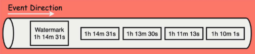
    - 워터마크를 1h 14m로 잡으면 이전 데이터(1h10m, 1h11m ..)들은 더이상 도착할 가능성이 없다고 판단함
    - 지금까지 안온거면 안올거다 하는거

  - Window Operator 에 Watermark 가 유입되고 나면 Window Operator 는 더 이상 1h 13m 보다 과거의 Event 는 유입되지 않는다고 판단
  - Watermark 가 명시한 시간보다 과거의 Event 들은 모두 Purge(제거) 됨

    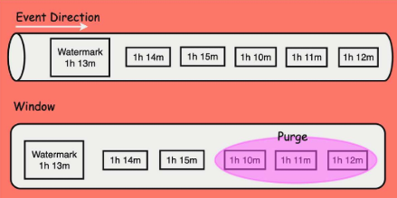

### 이벤트 시간 vs 처리 시간
- 이벤트 시간(Event Time)
  - 데이터가 실제 현실에서 발생한 시각
  - 이벤트 시간 기반으로 윈도우를 처리하면, 결과가 데이터 발생 시각을 정확히 반영하므로
    - 지연이나 순서 뒤바뀜에도 논리적으로 일관된 결과를 얻을 수 있음
  - 이벤트 시간이 올바르게 동작하려면 워터마크를 통해 Flink가 시간 진행을 파악해야함
- 처리 시간(Processing Time)
  - Flink 태스크가 실제로 이벤트를 처리하는 현재 시스템 시간
  - 구현이 간단하고 지연 처리도 필요없지만, 외부요인에 따라 순서가 어긋나거나 지연된 이벤트를 고려할 수 없음
  - 따라서 실시간성은 높지만 정확도는 떨어질 수 있음

### Watermarks 작동 원리
- 워터마크는 보통 '현재 이벤트 타임 - (허용 지연 시간)'의 값으로 주기적으로 생성
- 워터마크를 받은 윈도우 오퍼레이터는 해당 워터마크 시각보다 이전에 끝나는 윈도우들은 이제 모두 이벤트가 다 왔다고 판단하고, 그 윈도우들을 마감함

  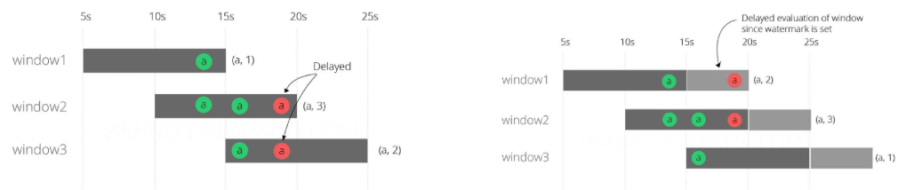
  - Late Event(지연 이벤트) 때문에 윈도우가 늦게 평가되는 상황 -> 왼쪽 그림
    - 녹색 a = 정상적으로 제시간에 도착
    - 빨간 a = 지연(dropped late) 이벤트
    - 15초에 끝나는 window1은 원래라면 녹색 a를 받고 (a, 1)로 바로 마감 가능
    - but, event time 기준으로 20초쯤에 late event(빨간 a)가 뒤늦게 도착함
    - window1은 "혹시 더 올 수도 있는가?" 하고 기다린 뒤
    - 늦게 온 이벤트까지 계산해서 (a, 2) 또는 (a, 3) 같이 값이 바뀜
    - 즉, 지연 이벤트 때문에 평가가 딜레이됨
  - Watermark가 있어 적절한 시점에 윈도우가 마감됨 -> 오른쪽 그림
    - 워터마크 = 현재 이벤트 타임 - 허용 지연 5초
    - 워터마크가 20초에 도착했다면 → "15초 이전 윈도우는 이제 마감해도 된다" 판단
    - window1(5~15s)은 실제로 늦은 빨간 이벤트가 20초쯤 왔지만
    - 워터마크가 이미 20초로 평가됐기 때문에 → 15초 윈도우는 더 기다리지 않고 (a,2) 시점에서 바로 마감
    - window2, window3도 마찬가지로 워터마크 기반으로 정해진 시점에서 close됨
  
### Late Elements와 Allowed Lateness
- 지연 도착 데이터 처리

  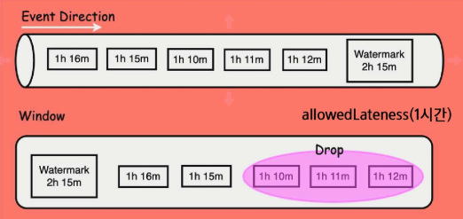
  - 늦게 도착한 데이터는 앞에서 Drop 하기로 했고, Drop 가능함
  - 그러나 flink에서 Allowed Lateness(허용 지연) 설정을 통해 윈도우가 닫힌 후에도 일정 기간 동안 늦은 데이터를 수용하는 기능을 제공함
  - `Allowed Lateness(Duration)`
    - 얘를 설정하면, 해당 기간 내에 도착한 늦은 이벤트는 다시 그 윈도우를 열어서 계산에 반영함
    - 다만, 허용 지연 설정 시간 너무 길게 잡으면 실시간성에 부정적인 영향을 줄 수 있으므로 적절한 조절이 필요함
  - Allowed Lateness는 watermark delay 이후 적용

    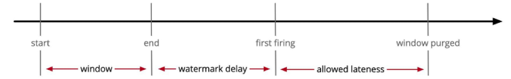
    1. Window Start (윈도우 시작)
    2. Window End (윈도우 종료 시점)
        - 지연 이벤트가 올 수 있으므로 윈도우 끝났다고 바로 계산하지XX
    3. First Firing (워터마크 도착으로 윈도우 최초 계산)
    4. Window Purged (Allowed Lateness 종료 → 메모리 완전 제거)
        - 워터마크 이후도 지연 이벤트는 여전히 들어올 수 있음
        - 하지만 너무 늦은 이벤트를 모두 기다리면 실시간성이 망가짐
        - → 그래서 Flink는 “허용 지연 시간(Allowed Lateness)”을 설정해 둠
        - ex. First firing 이후 10초 동안 늦게 오는 이벤트만 수용
        - 해당 늦은 이벤트가 오면 윈도우를 잠깐 다시 열어서 재계산

### Watermarks + allowedLateness 예제
- 1초까지 out-of-order를 허용하는 워터마크
- 2초의 이벤트 시간 텀블링 윈도우에 대해 최대 2초의 허용 지연 설정

  ```python
  # 사용자 정의 TimestampAssigner: 두 번째 필드를 타임스탬프로 사용 (밀리초)
    # 스트림 이벤트에서 이벤트 타임(event time) 으로 사용할 필드를 추출해주는 클래스
    # 데이터 (id, timestamp) 중 timestamp 컬럼이 event time이 됨
    # Flink는 이 값(event time)을 기준으로 윈도우를 열고 닫고, 워터마크를 계산함
  class CustomTimestampAssigner(TimestampAssigner):
      def extract_timestamp(self, self, element, record_timestamp):
          return element[1]

  # ProcessFunction: 각 이벤트와 현재 워터마크 출력
  class PrintWatermarkProcessFunction(ProcessFunction):
      def process_element(self, value, ctx):
          watermark = ctx.timer_service().current_watermark()
          print(f"Event: {value}, Current Watermark: {watermark}")
          yield value

  env = StreamExecutionEnvironment.get_execution_environment()
  env.set_parallelism(1)
  ```

  ```python
  # 현재 시간 기준 샘플 데이터 생성
  now = datetime.now()
  data = [
      (1, int(now.timestamp())),
      (2, int((now + timedelta(milliseconds=1000)).timestamp())),
      (3, int((now + timedelta(milliseconds=2000)).timestamp())),
      (4, int((now + timedelta(milliseconds=3000)).timestamp())),
      (5, int((now + timedelta(milliseconds=4000)).timestamp())),
  ]

  source = env.from_collection(data, type_info=Types.TUPLE([Types.INT(), Types.LONG()]))

  # 워터마크 전략 설정: 1초의 out-of-orderness 허용
  # 워터마크 생성 규칙을 설정하는 객체
  watermark_strategy = (
      WatermarkStrategy.for_bounded_out_of_orderness(Duration.of_seconds(1))
      .with_timestamp_assigner(CustomTimestampAssigner())
  )
  # for_bounded_out_of_orderness: out-of-order 이벤트를 얼마나 허용할지 지정
  # Duration.of_seconds(1): 최대 1초 늦게 도착한 이벤트까지 정상 처리
  # with_timestamp_assigner: 특정 이벤트 필드를 event time으로 설정

  # 타임스탬프와 워터마크 할당
  # 스트림에 타임스탬프와 워터마크를 실제로 지정해줌
  # 반드시 window 연산보다 먼저 해야 함
  watermarked_stream = source.assign_timestamps_and_watermarks(watermark_strategy)
  ```

- Late Elements 처리
  - side output으로 모은 너무 늦은 이벤트들을 처리

  ```python
  # 이벤트 타임 기반의 고정 길이 윈도우를 정의
  # 텀블링 이벤트 시간 윈도우: 2초의 allowed lateness 적용
  windowed_stream = watermarked_stream.key_by(lambda x: x[0]) \
      .window(TumblingEventTimeWindows.of(Time.seconds(2))) \
      .allowed_lateness(Duration.of_seconds(2))

  # 각 이벤트와 워터마크 출력
  processed_stream = watermarked_stream.process(PrintWatermarkProcessFunction())
  processed_stream.print()

  env.execute("Watermark with Allowed Lateness Example")
  ```

  - 결과
    ```
    Event: (1, 1683512335), Current Watermark: 1683512335  
    Event: (2, 1683512336), Current Watermark: 1683512336  
    Event: (3, 1683512337), Current Watermark: 1683512337  
    Event: (4, 1683512338), Current Watermark: 1683512338  
    Event: (5, 1683512339), Current Watermark: 1683512339
    ```
  - `data_engineering\04_Flink\FlinkCode\03_checkpointing_window\watermark_late_elements.py` 참고

