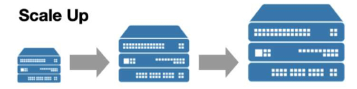
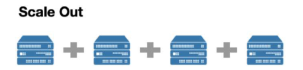
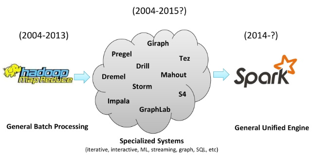
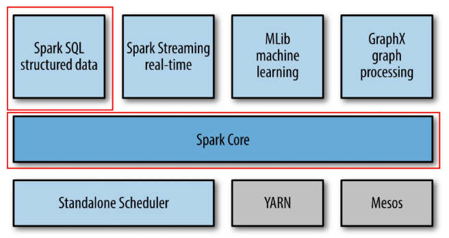
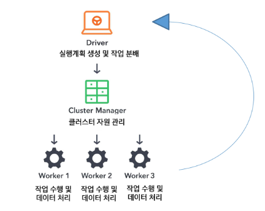
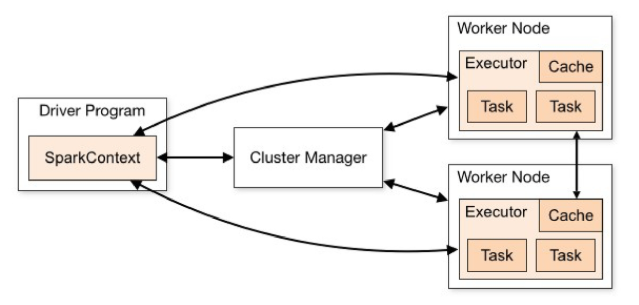

# Spark 설치와 기본 구조
## Spark 개요 및 실행 구조
### Spark의 필요성
- 실시간 데이터 처리의 필요성 증가
  - 배치 처리
    - 일정량의 데이터를 모아서 한꺼번에 처리
    - Spark, Hadoop MapReduce
  - 스트림 처리
    - 실시간으로 들어오는 데이터를 즉시 처리
    - Kafka, Flink
  - 유한한 데이터인지, 무한한 데이터인지에 따라 처리 방식을 결정함

- 단일 서버의 확장성 부족
  - 기존 데이터 처리는 주로 단일 서버로 이루어짐
  - 데이터가 증가하면 서버 성능을 높이는 방식(수직 확장, Scale-Up)을 사용
    - CPU, RAM 성능을 끌어다 쓰는 방식
  - 그러나 단일 서버는 하드웨어의 물리적 한계로 인해 무한정 성능을 높일 수 없음 (비용 문제도 존재)

- ex. 온라인 쇼핑몰에서 할인 행사 진행
  - 나이키에서 70% 할인 행사를 진행한다고 가정
  - 평소보다 접속자가 급증하여 서버가 감당하지 못하게 됨
  - 즉, 단일 서버에 모든 트래픽이 몰리면서 서버가 다운되는 상황 발생할 수 있음

- Scale up vs Scale out
  - Scale up (수직 확장)
    - 단일 서버의 성능을 높이는 방식
    - CPU, RAM, 저장장치 성능 향상
    - 한계: 물리적 한계 존재, 비용 증가

      
  - Scale out (수평 확장)
    - 여러 대의 서버를 연결하여 클러스터 형성 (분산 처리)
    - 데이터와 트래픽을 분산 처리
    - 장점: 무한 확장 가능, 비용 효율적

      

### 기존 데이터 처리 방식의 한계점
- 디스크 기반 처리로 인한 속도 문제
  - Spark 이전의 기술은 데이터를 처리할 때 디스크 기반의 저장장치를 사용
  - 디스크는 메모리(RAM)보다 데이터 읽기/쓰기 속도가 현저히 느리기 때문에 데이터 처리 과정에서 속도 저하 현상이 발생함

### Apache Spark
- Apache Spark는 오픈소스 클러스터 컴퓨팅 프레임워크
  - 즉, 대규모 데이터 처리를 위한 오픈소스 분산 컴퓨팅 프레임워크
- 대규모 데이터를 빠르게 처리할 수 있도록 설계되었으며, 배치 처리와 실시간 처리를 모두 지원
- Spark는 in-memory (메모리 내) 연산을 통해 디스크 기반 처리보다 훨씬 빠른 성능을 제공힘
  - 즉, 메모리 기반의 데이터 처리 방식을 채택하여 빠른 속도 제공함
- 다양한 언어(Java, Scala, Python, R)를 지원하며, 데이터 과학, 머신러닝, 스트리밍 분석 등 다양한 분야에서 활용됨

- 왜 Spark가 필요할까?

  
  1. Hadoop MapReduce (2004–2013)
      - 기능: 대규모 데이터를 배치(Batch) 방식으로 처리
      - 장점: 분산 환경에서 안정적이고 확장성 있는 데이터 처리
      - 한계: 
        - 처리 속도가 느림 (디스크 기반 I/O)
        - 반복적 작업(iterative jobs)이나 스트리밍 처리에 비효율적
        - 다양한 유형의 분석 작업에 적합하지 않음 (SQL, ML, 그래프 등)
  2. Specialized Systems (2004–2015?)
      - 등장 배경: MapReduce의 한계를 보완하고 특정 목적에 맞춘 시스템들이 등장
      - 예시 시스템:
        - SQL: Dremel, Impala
        - 스트리밍: Storm, S4
        - 그래프 처리: Pregel, Giraph, GraphLab
        - 기계 학습: Mahout
        - 기타: Drill, Tez 등
      - 문제점:
        - 각각의 시스템이 독립적으로 운영되어 통합이 어려움
        - 학습 비용 및 운영 복잡도 증가
        - 하나의 분석 워크플로우에 여러 시스템을 연결해야 함
  3. Apache Spark (2014–현재)
      - 특징: 다양한 분석 요구를 하나의 통합 엔진으로 해결
      - 지원 영역:
        - Batch Processing
        - Real-time Stream Processing
        - SQL 쿼리 처리
        - 머신러닝 (MLlib)
        - 그래프 처리 (GraphX)
      - 장점:
        - In-memory 연산으로 빠른 성능
        - 다양한 분석 작업을 하나의 API로 처리 가능
        - 다양한 언어(Java, Scala, Python, R) 지원
        - 유연한 확장성과 활발한 커뮤니티

- Spark의 탄생 배경과 설계 목적
  - 기존 Hadoop MapReduce는 느린 속도와 반복 작업의 비효율성이라는 구조적 한계 존재
  - 특히 머신러닝, 스트리밍 분석처럼 반복적이고 실시간성이 요구되는 작업에 부적합
  - Spark는 UC Berkeley AMP Lab에서 이러한 문제를 해결하고자 개발됨
  - Matei Zaharia가 2009년 개발 시작 → 2010년 오픈소스 공개 → 2014년 Apache 프로젝트로 채택

- Spark가 기존 기술의 한계를 어떻게 극복했는가?
  - Spark는 기존 시스템의 단점들을 보완해, 빠르고 통합적인 분석 환경을 제공
    |  |문제점 | Spark의 접근 방식
    |------|------|-----------------------
    Hadoop | 느린 처리 속도, 반복작업 비효율 | 메모리 기반 연산(In-memory)
    RDBMS | 확장성 부족, 비정형 데이터 처리 어려움  | 분산 클러스터 기반, 유연한 스키마
    특화 시스템 | 기능 분산, 통합 어려움 | 하나의 플랫폼에서 배치 + 실시간 + ML
    디스크 기반 처리 | 입출력 병목 | DAG 기반 최적화 실행, Lazy 평가

- Spark 사용 이유
  - 반복 연산에서 Hadoop MapReduce보다 **빠른 처리 성능**
  - 메모리 기반의 데이터 처리로 **빠른 속도**
  - Hadoop과의 유연한 연동성
    - HDFS에 저장된 데이터를 읽어서 바로 처리 가능
  - RDD의 계보(lineage)를 기반으로 장애 발생 시 연산을 자동으로 재실행하여 복구

- Spark의 설계 철학
  - 속도
    - 메모리 기반 연산(In-Memory Computation)으로 디스크 I/O 최소화
    - DAG 기반 스케줄링으로 병렬 처리 최적화
      - Dag(Directed Acyclic Graph): 방향성이 있는 비순환 그래프
    - Tungsten 엔진을 통한 코드 생성 최적화
      - Tungsten 엔진: Spark SQL의 물리적 실행 엔진으로, 메모리 관리와 CPU 효율성을 극대화하여 성능 향상

  - 사용 편리성
    - 단일 PC와 클러스터 간 코드 차이가 최소화된 추상화 구조
    - RDD → DataFrame → Dataset의 계층적 API 제공
    - Scala, Python, Java, R 등 다중 언어 지원

  - 모듈성
    - SparkSQL, Streaming, MLlib, GraphX 등 다양한 워크로드를 하나의 엔진에서 처리
    - 별도의 시스템(Hive, Storm, Mahout 등) 통합 불필요

  - 확장성
    - 다양한 데이터 소스(HDFS, Cassandra, MongoDB, RDBMS, S3 등) 연동
    - 여러 파일 포맷(csv, parquet 등) 지원
    - 수많은 서드파티 패키지와 통합 가능
      - 서드파티 패키지: 공식적으로 제공되지 않는 외부 개발자나 회사가 만든 추가 기능이나 라이브러리

### Spark 모듈 구성
- 스파크는 다양한 컴포넌트 형태로 구현되어 있는 데이터 처리 플랫폼

  
  - Spark Core
    - 스파크의 핵심 엔진으로, 기본적인 분산 처리 기능 제공
    - 전체 연산 실행 및 자원 관리 담당
    - 여러 모듈을 연결하는 엔진
  - Spark SQL
    - 구조적 데이터 처리 및 SQL 쿼리 지원
  - Spark Streaming
    - 실시간 데이터 스트리밍 처리
  - MLlib
    - 머신러닝 라이브러리
  - GraphX
    - 그래프 처리 및 분석 라이브러리
  - Srandalone Scheduler
    - 스파크 전용 클러스터 매니저
  - YARN, Mesos
    - 자원관리 시스템이라고 할 수 있음

- Spark Core 위에서 Spark SQL, Spark Streaming, MLlib, GraphX 등이 실행되고, 공통된 실행 엔진과 스케줄러를 공유함
  
### Spark의 주요 컴포넌트
모든 컴포넌트는 Spark Core 위에서 실행되며, 공통된 실행 엔진과 스케줄러를 공유함

컴포넌트 | 설명
---------|------------------------------
Spark Core | 핵심 실행 플랫폼
Spark SQL | 구조적 데이터 처리 및 SQL 기반 쿼리 실행
Spark Streaming | 실시간 데이터 분석을 위한 스트리밍 처리 (마이크로 배치 방식)
MLlib | 머신러닝 알고리즘 라이브러리 (분류, 회귀, 군집 등)
GraphX | 그래프 기반 데이터 처리와 분석 지원 (PageRank 등)

### Spark 특징
- 높은 처리 성능 (메모리 기반 처리)
- Lazy Evaluation을 통한 최적화
- 다양한 데이터 처리 방식 지원 (배치 처리, 스트리밍 처리)
- 폭넓은 언어 지원
  - Scala, Java, Python, R

### Spark 활용 시 주의점
- 엄밀한 실시간 처리 불가 (Micro-batch 기반)
  - Micro-batch : 실시간 데이터 스트리밍을 작은 배치 단위로 나누어 처리하는 방식
  - 즉, 들어오자마자 바로 처리하는 것이 아니라, 짧은 주기로 데이터를 모았다가 한꺼번에 처리
- 작은 데이터 파일 처리의 비효율성
  - 대규모 데이터 처리에 최적화되어 있어, 작은 파일을 다수 처리할 때 오버헤드 발생
- 자체 파일 관리 시스템 부재 (HDFS, S3 등 사용)
  - 저장소 역할을 해주는 파일 시스템이 없으므로, 별도의 분산 파일 시스템과 연동 필요
- 높은 메모리 비용
  - 메모리 기반 처리로 인해 대규모 메모리 자원 필요

### Spark의 실행구조
Spark는 Driver, Cluster Manager, Worker Nodes로 구성된 분산 데이터 처리 시스템


- 사용자가 Spark 애플리케이션을 실행하면,
  - 가장 먼저 SparkSession이 생성되어 드라이버 프로그램이 시작됨
- Driver는 사용자 코드를 분석하여 **실행 계획(Logical Plan → Physical Plan)**을 생성
- 생성된 실행 계획은 여러 개의 Job으로 분할됨
  - Job은 Stage 단위로 나뉘며 각각은 Task들로 구성됨
- Driver는 Cluster Manager에게 자원 할당을 요청함
  - → Cluster Manager는 전체 클러스터 자원을 고려해 Worker 노드에 Executor를 할당함
- 각 Executor는 할당받은 Task들을 병렬로 수행하며 데이터를 처리함
- 처리된 결과는 Executor에서 Driver로 전달되고, 최종 결과는 사용자에게 반환됨

### 애플리케이션 구성 요소


1) 클러스터 매니저(Cluster Manager)  
2) 드라이버(Driver)  
3) 실행기 (Executor)  
4) 스파크 세션 (Session)  
5) 잡 (Job)  
6) 스테이지 (Stage)  
7) 태스크 (task)

- 클러스터 매니저
  - Spark 애플리케이션이 실행되는 클러스터의 **리소스를 관리**하는 컴포넌트 (**자원 관리자**)
    - 드라이버가 요청한 실행기 프로세스 시작
    - 실행 중인 프로세스를 중지하거나 재시작
    - 실행자 프로세스가 사용할 수 있는 최대 CPU 코어 개수 제한 등
  - 종류
    - `Standalone` : Spark 전용 클러스터 매니저(자체 내장된 매니저)
    - `Hadoop Yarn` : Hadoop 클러스터 운영에 쓰이는 대표적인 리소스 매니저
    - `Kubernetes` : 클라우드 환경이나 데브옵스 환경에서 배포를 고려할 때 주로 사용
  - driver가 클러스터 매니저에게 리소스를 요청하면, 클러스터 매니저는 클러스터의 상태를 고려해 적절한 워커 노드에 Executor를 할당

- 드라이버(Driver)
  - **스파크 애플리케이션의 실행을 관장하고 모니터링**
    - 클러스터 매니저에 메모리 및 CPU 리소스를 요청 (**자원 요청**)
    - 애플리케이션 로직을 스테이지와 태스크로 분할 (**작업 분할**)
    - 여러 실행자에 태스크를 전달 (어떤 실행기에 어떤 태스크를 할당할지 결정 = **작업 분배**)
    - 태스크 실행 결과 수집 (**결과 수집**)

  - 특징
    - 1개의 스파크 애플리케이션에는 1개의 드라이버만 존재  
    - 드라이버 프로세스가 어디에 있는지에 따라, 스파크에는 크게 두 가지 모드가 존재함
      1. 클러스터 모드 – 드라이버가 클러스터 내의 특정 노드에 존재  
      2. 클라이언트 모드 – 드라이버가 클러스터 외부에 존재  

---
---
- 실행기 (Executor)
  - 드라이버로부터 전달받은 태스크를 실행하는 프로세스
    - 스파크 드라이버가 요청한 태스크들을 받아서 실행하고, 그 결과를 드라이버로 반환
    - 각 프로세스는 드라이버가 요청한 태스크들을 여러 태스크 슬롯(스레드)에서 병렬로 실행
    - JVM 프로세스

# Spark의 실행구조

## 스파크 세션(Spark Session)

### 스파크 기능(DataFrame, SQL 등)을 사용하기 위한 진입점
- Spark Core 기능들과 상호 작용할 수 있는 진입점 제공
- API로 프로그래밍을 할 수 있게 해주는 객체
- spark-shell에서 기본적으로 제공
- 스파크 애플리케이션에서는 사용자가 SparkSession 객체를 생성해 사용해야 함

# Spark의 실행구조

## 잡 (Job)

### 사용자가 실행한 액션(collect(), count() 등)에 의해 생성되는 작업 단위
- 스파크 액션(save(), collect() 등)에 대한 응답으로 생성되는 여러 태스크로 이루어진 병렬 연산

# Spark의 실행구조

## 스테이지(stage)

### 잡(Job)을 셔플(데이터 이동) 기준으로 나눈 실행 단위
- 스파크 각 잡은 스테이지라 불리는 서로 의존성을 가지는 다수의 태스크 모음으로 나뉨

# Spark의 실행구조

## 태스크(task)

### 스테이지를 구성하는 실제 실행 단위
- 스파크 각 잡별 실행기로 보내지는 작업 할당의 가장 기본적인 단위  
- 개별 task slot에 할당되고, 데이터의 개별 파티션을 가지고 작업

# Spark의 실행구조

## 스파크 연산의 종류
- 스파크 연산은 크게 트랜스포메이션(Transformation), 액션(Action)으로 구별

# Spark의 실행구조

## Transformation
- immutable(불변)인 원본 데이터를 수정하지 않고, 하나의 RDD나 Dataframe을 새로운 RDD나 Dataframe으로 변형  

- (input, output) 타입 : (RDD, RDD), (DataFrame, DataFrame)인 연산  
  - map(), filter(), flatMap(), select(), groupby(), orderby() 등  

- Narrow, Wide Transformation 존재

# Spark의 실행구조

## Narrow transformation
- Narrow transformation  
  - input : 1개의 파티션  
  - output : 1개의 파티션  
  - 파티션 간의 데이터 교환이 발생하지 않음  
  - ex) filter(), map(), coalesce()

## Wide transformation
- Wide transformation  
  - 연산 시 파티션끼리 데이터 교환 발생  
  - ex) groupby(), orderby(), sortByKey(), reduceByKey()  
  - 단, join의 경우 두 부모 RDD/Dataframe이 어떻게 파티셔닝 되어 있나에 따라 narrow일 수도 wide일 수도 있음

## Action
- immutable(불변)인 인풋에 대해, Side effect(부수 효과)를 포함하고, 아웃풋이 RDD 혹은 Dataframe이 아닌 연산  

- count() -> 아웃풋 : int  
- collect() -> 아웃풋 : array  
- save() -> 아웃풋 : void

## Lazy evaluation
- 모든 transformation은 즉시 계산되지 않음  
- 계보(lineage)라 불리는 형태로 기록  
- transformation이 실제 계산되는 시점은 action이 실행되는 시점  
- action이 실행될 때, 그 전까지 기록된 모든 transformation들의 지연 연산이 수행됨  

### 장점
- 스파크가 연산 쿼리를 분석하고, 어디를 최적화할지 파악하여, 실행 계획 최적화가 가능  
  - (eager evaluation이라면, 즉시 연산이 수행되기 때문에 최적화 여지가 없음)
- 장애에 대한 데이터 내구성을 제공  
- 장애 발생 시, 스파크는 기록된 lineage를 재실행 하는 것만으로 원래 상태를 재생성 할 수 있음

# Spark 설치 및 실행 환경설정

## Spark 설치

### WSL
- wget https://archive.apache.org/dist/spark/spark-3.5.4/spark-3.5.4-bin-hadoop3.tgz
- tar -xvzf spark-3.5.4-bin-hadoop3.tgz
- sudo mv spark-3.5.4-bin-hadoop3 spark

### WSL
- Spark 환경변수 등록  
- vi ~/.bashrc  
  - export SPARK_HOME=/home/ssafy/spark  
  - export PATH=$SPARK_HOME/bin:$SPARK_HOME/sbin:$PATH  
- source ~/.bashrc  
- echo $SPARK_HOME 잘 설정 됐는지 확인

### WSL
- Spark 실행 확인  
- spark-shell 후 나가기

## PySpark 설치

### WSL
- pip install pyspark==3.5.4
- pyspark 설치 확인

# Spark 설치 및 실행 환경 설정

## pyspark 에서 간단한 예제
a값이 5이고, b의 값이 10일때 각 a+b, a*b의 값을 출력
```
(Spark ASCII 로고)  
version 3.5.4

Using Python version 3.12.3  
Spark context Web UI available at http://172.28.224.58:4040  
Spark context available as 'sc'  
SparkSession available as 'spark'

>>> a = 5  
>>> b = 10  
>>> print("a+b=", a+b)  
a+b= 15  
>>> print("a*b=", a*b)  
a*b= 50
```

# Spark 설치 및 실행 환경 설정

## Pyspark 실행
Pyspark 코드가 실제로 내부에서 어떻게 작동할까

Python 코드 (PySpark API)  
↓ Py4J  
JVM: SparkSession / SparkContext (Driver)  
↓  
Cluster Manager → Executors  
↓  
분산 데이터 처리

# Spark 설치 및 실행 환경 설정

## Pyspark 실행
Pyspark 코드가 실제로 내부에서 어떻게 동작하는가
```
from pyspark.sql import SparkSession  
spark = SparkSession.builder.appName("App").getOrCreate()  
print(spark.version)  
spark.stop()
```
```
>>> from pyspark.sql import SparkSession  
>>> spark = SparkSession.builder.appName("App").getOrCreate()  
>>> print(spark.version)  
3.5.4  
>>> spark.stop()
```

# Spark 설치 및 실행 환경 설정

## sc.textFile()을 활용한 파일 읽기
- 텍스트 파일을 읽어 RDD로 변환하는 기본적인 함수

### 1. 터미널에서 테스트 파일 생성
>> Hello Spark Apache Spark is powerful Big Data Processing
```
$ echo -e "Hello Spark\nApache Spark is powerful\nBig Data Processing" > test.txt
```
### 2. Spark shell에서
>> sc.textFile() 실행
```
>>> rdd = sc.textFile("test.txt")  
>>> rdd.foreach(print)

Hello Spark  
Apache Spark is powerful  
Big Data Processing
```

# Spark 설치 및 실행 환경 설정

## sc.textFile()을 활용한 파일 읽기

### 3. 현재 파티션의 개수
>> .getNumPartitions()
```
>>> rdd.getNumPartitions()  
2  
>>> print("현재 파티션 개수:", rdd.getNumPartitions())  
현재 파티션 개수: 2
```

# Spark 설치 및 실행 환경 설정

## sc.textFile()을 활용한 파일 읽기

### 4. Spark에서 데이터를 하나의 파티션에서 처리
>> repartition(1) : 파티션 수를 1개로 줄여서 병렬성을 제한하고 데이터를 한곳으로 모은다.
```
>>> rdd_repartitioned = rdd.repartition(1)  
>>> print("변경된 파티션 수:", rdd_repartitioned.getNumPartitions())  
변경된 파티션 수: 1
```

# Spark 설치 및 실행 환경 설정

## sc.textFile()을 활용한 예제

### 1. 데이터 변환 후 결과 확인(collect() 함수)
>> RDD의 모든 데이터를 배열 형태로 변환하는 연산  
>> collect()는 Action 연산, 데이터를 변환 후 결과를 확인할 때 사용  
>> 큰 데이터셋에서는 사용 지양
```
>>> rdd = sc.textFile("file:///usr/local/spark/data/test.txt")  
>>> result = rdd.collect()  
>>> print(result)

['Hello Spark', 'Apache Spark is powerful', 'Big Data Processing']
```

# Spark 설치 및 실행 환경 설정

## sc.textFile()을 활용한 예제

### 2. 줄 개수 세기 (count 연산)
>> RDD의 전체 줄 개수를 세는 기본적인 Action 연산  
>> count()는 모든 요소의 개수를 반환하며, RDD 연산의 결과를 즉시 평가함
```
>>> line_count = rdd.count()  
>>> print("줄 개수:", line_count)  
줄 개수: 3
```

# Spark 설치 및 실행 환경 설정

## sc.textFile() 활용 예제

### 3. 특정 단어가 포함된 줄 필터링(filter 연산)
>> 특정 키워드를 포함한 줄만 필터링할 수 있음  
>> filter()는 Transformation 연산으로, 조건을 만족하는 요소만 포함하는 새로운 RDD를 생성
```
>>> filtered_rdd = rdd.filter(lambda line: "Spark" in line)  
>>> filtered_rdd.foreach(print)

Hello Spark  
Apache Spark is powerful
```

# Spark 설치 및 실행 환경 설정

## sc.textFile() 활용 예제

### 4. 모든 단어를 소문자로 변환하기(map 연산)
>> RDD의 모든 요소에 변환 함수를 적용 가능  
>> map()은 Transformation 연산으로, RDD의 각 요소를 변환하여 새로운 RDD를 생성
```
>>> lower_rdd = rdd.map(lambda line: line.lower())  
>>> lower_rdd.foreach(print)

hello spark  
apache spark is powerful  
big data processing
```