# Spark RDD
## RDD의 개념과 특징 이해
### RDD
대용량 데이터를 분산 처리하고 분석하기 위한 Spark의 기본 데이터 처리 단위

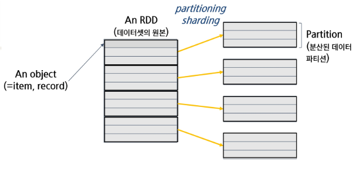
- **R**esilient (탄력적인)
  - 장애 복구 가능
- **D**istributed (분산된)
- **D**ataset (데이터셋)

### RDD의 특징
1. 데이터의 추상화 (Data Abstraction)
    - 데이터 저장 방식이나 물리적 위치를 몰라도 데이터를 거대한 집합처럼 다룰 수 있게 해줌

      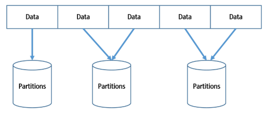
    - 여러 데이터 조각들이 여러 파티션에 나누어져 분산 저장됨
      - 파티션은 데이터를 나누는 기준이 되고, 하나의 Task로 매핑되어 Executor에서 병렬 처리됨
    - 데이터가 1번 파티션에 속하는지 2번 파티션에 속하는지 신경 쓸 필요 없이, RDD API를 통해 데이터를 다룰 수 있음 (내부적으로 알아서 처리됨)
    - 즉, **분산된 추상화 계층을 제공**하여 개발자가 분산 처리의 복잡성을 신경 쓰지 않고도 대규모 데이터를 효율적으로 처리할 수 있게 함

2. 탄력성(Resilient) & 불변성(Immutable)
    - RDD는 한 번 생성되면 변경할 수 없음
    - 어떤 노드(서버)가 장애로 인해 중단되더라도, 데이터 복구 가능

      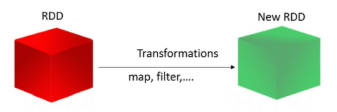
      - 기존 RDD가 transformation 연산을 거치면 새로운 RDD가 생성됨
      - 즉, 원본 데이터가 유지되므로 장애 발생 시에도 원본 RDD를 기반으로 다시 계산하여 복구 가능

3. 타입의 안정성 보장
    - 어떠한 하나의 타입의 객체를 가질 수 있음
      - RDD의 모든 요소가 동일한 데이터 타입이어야 함
    - 데이터 타입을 컴파일 시점에 검사
      - 데이터 타입이 고정되어 있으면, 실행 전 데이터 타입을 알 수 있으므로 최적화된 상태의 실행 계획을 세울 수 있음
      - 타입이 고정되어 있다 = 스키마가 있다
    - 성능 최적화
    - 코드의 가독성과 유지보수성 향상
    - Pyspark를 쓸 때는 Python이 동적 타입 언어이기 때문에 타입 안정성이 적용되지는 않음

4. 정형(Structured) & 비정형(Unstructured) 데이터 처리 가능
    - 비정형 데이터
      - 고정된 포맷이 없는 텍스트 데이터  
      - → `sc.textFile()`을 이용해 RDD로 로딩 후 map, filter, flatMap 등으로 가공
      - 비정형 데이터는 구조가 없으므로(스키마가 없으므로) 변환 연산을 통해 직접 구조화
    - 정형 데이터
      - 컬럼이 있는 테이블 형태 데이터 (스키마 존재)
      - → `DataFrame` 또는 `RDD.map()`으로 가공 (컬럼 구조에 맞게 변환 가능)
      - 정형 데이터는 스키마가 있으므로 Datafrome API 또는 RDD.map() 형태로 변환하여 처리

5. 지연 평가(Lazy Evaluation)
    - 중간 연산을 줄여 성능 최적화
    - 실행 계획을 최적화하여 성능 향상
    - 불필요한 연산 방지로 리소스 절약

      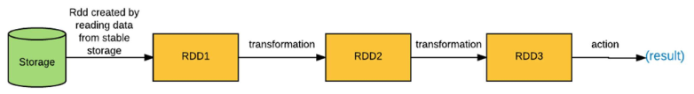
      - Storage에서 데이터를 읽어옴
        - Spark는 기본적으로 배치 처리를 다루기 떄문에 Storage을 대표적으로 씀
      - 읽어온 데이터를 RDD 형태로 변환
      - Transformation 연산을 통해 새로운 RDD를 생성
        - 이 과정에서는 실제로 데이터가 처리되지 않음
      - Action 연산이 호출될 때 비로소 모든 Transformation 연산이 실행되어 최종 결과가 생성됨

### 주요 구성 요소 정리 코드
```py
from pyspark import SparkContext

# SparkContext 객체 생성
sc = SparkContext("local", "LazyEvalExample")

# 1. 텍스트 데이터 로딩 → Transformation
rdd = sc.parallelize(["apple", "banana", "spark", "data"])

# 2. 대문자로 바꾸기 → Transformation
upper_rdd = rdd.map(lambda x: x.upper())

# 3. SPARK가 포함된 문자열만 필터링 → Transformation
filtered_rdd = upper_rdd.filter(lambda x: "SPARK" in x)

# 지금까지는 아무것도 실행되지 않음!

# 4. 결과 확인 (Action)
result = filtered_rdd.collect()
```

## RDD 생성 및 변환 학습
### RDD 생성
1. 기존의 메모리 데이터를 RDD로 변환하는 방법
    - Python의 리스트(List)나 Scala의 컬렉션(Collection)을 RDD로 변환 가능
      - 기존 메모리에 올린 데이터를 RDD로 변환하는 것
    - 이 방법은 주로 테스트나 작은 데이터 셋을 다룰 때 사용

2. 외부파일(텍스트, CSV, JSON 등)에서 RDD를 생성하는 방법
    - 실무에서는 보통 파일이나 데이터베이스에서 데이터를 불러와야 함
    - `sc.textFile(“파일 경로”)`, `spark.read.format("jdbc").option(…)` 형태를 사용하여 외부 데이터를 RDD로 변환할 수 있음

### RDD 생성 : 메모리 데이터 활용 `parallelize()`
- 기존 메모리 데이터를 Spark의 RDD로 변환하는 역할
- RDD parallelize() 생성 코드 예제 (Python / Scala / Java 비교)

  ```
  # Parallelize in Python
  wordsRDD = sc.parallelize([“fish”, “cats”, “dogs”])

  // Parallelize in Scala
  val wordsRDD = sc.parallelize(List(“fish”, “cats”, “dogs”))

  // Parallelize in Java
  JavaRDD<String> wordsRDD = sc.parallelize(Arrays.asList(“fish”, “cats”, “dogs”))
  ```

2. `parallelize()`는 메모리에 있는 데이터를 Spark 클러스터로 보낼 때 사용
    - 데이터가 클 경우 비효율적일 수 있어 소규모 데이터분석에 주로 이용

### RDD 생성 : 외부 파일에서 데이터 읽기  `sc.textFile()`
- 외부 파일에서 데이터를 직접 읽어와 RDD로 변환하는 역할
- 일반적인 텍스트 파일 (CSV, 로그 파일 등), S3 → 저장소에서 데이터 로드
- HBase, Cassandra (C)* → NoSQL 데이터베이스에서 읽기 등
- RDD `sc.textFile()` 생성 코드 예제 (Python / Scala / Java 비교)

  ```
  # Read a local text file in Python
  linesRDD = sc.textFile(“/path/to/README.md”)

  // Read a local text file in Scala
  val linesRDD = sc.textFile(“/path/to/README.md”)

  // Read a local text file in Java
  JavaRDD<String> linesRDD = sc.textFile(“/path/to/README.md”)
  ```


### RDD 변환 : `MAP`
RDD의 각 요소에 함수 f 를 적용하여 새로운 RDD를 반환

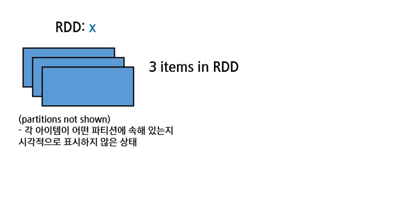
```python
x = sc.parallelize(["b", "a", "c"])   # parallelize -> RDD로 만들어 놓은 상태 
y = x.map(lambda z: (z,1))

# action 메서드 -> RDD의 데이터를 드라이버 프로그램으로 가져옴
# 파티션에서 데이터 가져올 때 순서를 보장하지 않음
print (x.collect()) 
print (y.collect())
```
```python
x: ['b', 'a', 'c']
y: [('b',1), ('a',1), ('c',1)]
```
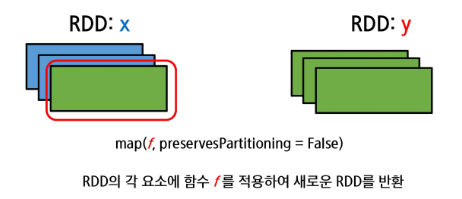

- 네트워크 간 연결이 필요 없으므로 narrow transformation에 속함


### RDD 변환 : `FLATMAP`
RDD의 모든 요소에 먼저 함수 f 를 적용한 뒤, 그 결과를 평탄화(flatten)하여 새로운 RDD를 반환

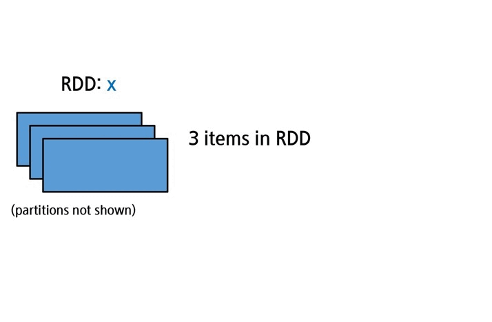
```python
x = sc.parallelize([1, 2, 3])
y = x.flatMap(lambda x: (1*x, 2*x, 3*x, 100))
print(x.collect())
print(y.collect())
print(y.mean())
```
```python
x : [1, 2, 3]
y : [1, 2, 3, 100, 2, 4, 6, 100, 3, 6, 9, 100]
y.mean() : 28.0
```
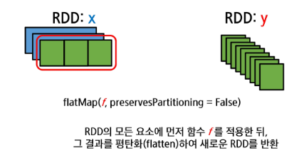
- 1:1 매핑이 아닌 1:N 매핑이므로, wide transformation에 속함
- 하나씩 펼쳐서 flat(납작하게) 만들어 줌
  - 하나의 item이 여러 개의 item으로 변환될 수 있음
  - 즉, 전체 아이템 수가 늘어날 수 있음

### RDD 변환 : `FILTER`
filter의 조건을 만족하는 요소들만 포함하는 새로운 RDD를 반환

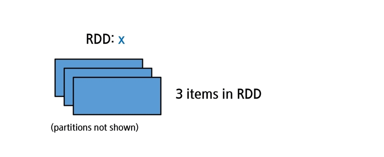
```python
x = sc.parallelize([1,2,3])
y = x.filter(lambda x: x%2 == 1) #keep odd value
print (x.collect())
print (y.collect())
```
```python
x: [1, 2, 3]
y: [1, 3]
```
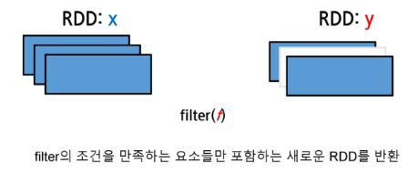

### RDD 변환 : `MAPPARTITIONS`
RDD의 각 파티션에 함수 f 를 적용하여 새로운 RDD를 반환

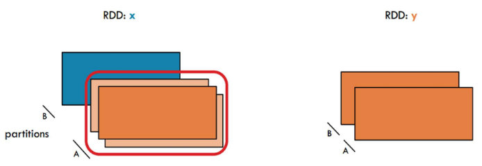
```python
x = sc.parallelize([1,2,3],2) # 2 : 파티션 몇개로 나눌지 지정
def f(iterator):
        yield sum(iterator); yield 42

y = x.mapPartitions(f)
print(x.glom().collect())
print(y.glom().collect())
# glom().collect() : 각 파티션을 리스트로 묶어서 출력
```
```python
x: [[1], [2, 3]]
y: [[1,42], [5,42]]
```
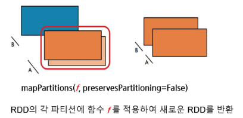
- 각 '파티션' 단위로 연산 수행
  - map이 각 item 단위로 연산 수행하는 것과 대비
- 파티션 크기가 너무 크면 out of memory 발생 가능
- 같은 파티션 내의 데이터끼리만 연산하므로 셔플이 발생하지 않음
  - 따라서, 파티션 단위로 데이터 처리 시 유용하게 사용 가능

### RDD 변환 : `MAPPARTITIONS WITH INDEX`
원래 파티션의 인덱스를 추적하면서, RDD의 각 파티션에 함수를 적용하여 새로운 RDD를 반환

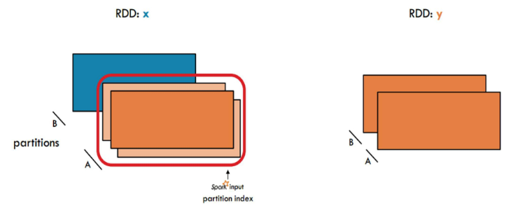
```python
x = sc.parallelize([1,2,3],2)
def f(partitionIndex, iterator):
        yield (partitionIndex, sum(iterator))

y = x.mapPartitionsWithIndex(f)
print(x.glom().collect())
print(y.glom().collect())
```
```python
x: [[1], [2, 3]]
y: [[0,1], [1,5]]
```
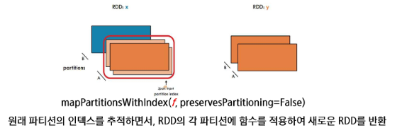

### RDD 변환 : `KEYBY`
원래 RDD의 각 항목에 대해 하나의 쌍(pair)을 생성하여 Pair RDD를 만들고, 쌍의 key는 사용자 정의 함수에 의해 값으로부터 계산

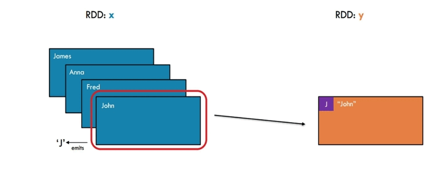
```python
x = sc.parallelize(['John', 'Fred', 'Anna', 'James'])
y = x.keyBy(lambda w: w[0])
print(y.collect())
```
```python
x: [['John', 'Fred', 'Anna', 'James']]
y: [('J', 'John'), ('F', 'Fred'), ('A', 'Anna'), ('J', 'James')]
```
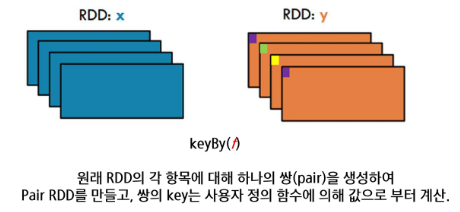
- 각 항목에 대해 key-value 쌍 생성
- `collect()` : RDD의 모든 항목을 드라이버 프로그램으로 반환
- 데이터 재분배 필요
- 그러나 셔플은 발생하지 않음
- 'J' 키를 가진 항목들이 같은 파티션에 모이게 하고싶다면 groupby 사용

### RDD 변환 : `GROUPBY`
원래 RDD의 데이터를 그룹화하기 위해,  
사용자 정의 함수의 출력값을 key로 하고  
이 key에 해당하는 모든 항목들을 value로 가지는 쌍(pair)을 생성

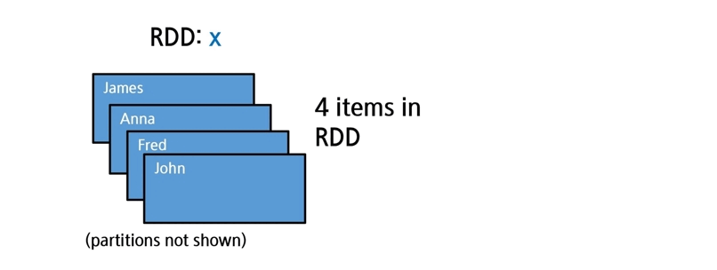
```python
x = sc.parallelize(['John', 'Fred', 'Anna', 'James'])
y = x.groupBy(lambda w: w[0])  # A function to generate keys
print({(t[0], [i for i in t[1]]) for t in y.collect()})
```
```python
x: ['John', 'Fred', 'Anna', 'James']
y: [('A', ['Anna']), ('J', ['John', 'James']), ('F', ['Fred'])]
```

- 데이터 셔플 발생
- 'J' 키를 가진 항목들이 같은 파티션에 모이게 함

- key-value RDD 사용할 때 groupby보다 groupbykey 주로 사용함
```python
x = x.map(lambda w: (w[0], w))
y = x.groupByKey()
```

### RDD 변환 : `GROUPBYKEY`
원래 RDD에서 각 key에 해당하는 value들을 그룹화하고 그룹화된 value들을 모아, 원래의 key와 함께 새로운 쌍(pair)을 생성

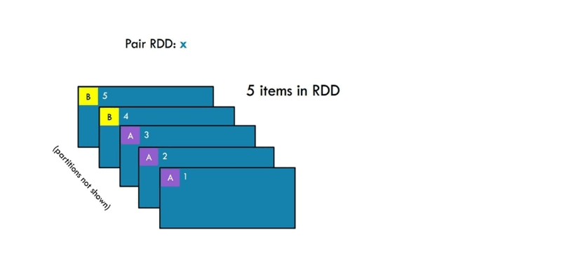
```python
x = sc.parallelize([('B',5),('B',4),('A',3),('A',2),('A',1)])
y = x.groupByKey()
print(x.collect())
print([(t[0],[i for i in t[1]]) for t in y.collect()])
```
```python
x: [('B',5),('B',4),('A',3),('A',2),('A',1)]
y: [('B', [5,4]), ('A', [3,2,1])]
```
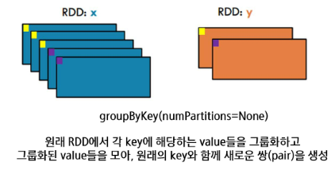
- 기존에 key가 있는 상태일 시
  - key는 유지되고 value들만 그룹화됨
- value가 많아지면 한 파티션에 데이터가 몰릴 수 있음
  - 이 경우 out of memory 발생 가능
- 데이터 재분배 필요
- 셔플 발생

### Word Counting 예시 (`GROUPBYKEY`)
- 단어 출현 횟수 세기
  - 단어는 RDD 안에 들어있음
  - map 연산을 통해 (단어, 1) 쌍 생성
  - groupByKey 연산을 통해 단어별로 그룹화
```python
words = sc.parallelize(['one','two','two','three','three','three'])
wordPairsRdd = words.map(lambda w : (w,1))
wordCounts = wordPairsRdd.groupByKey().map(lambda pair: (pair[0], sum(pair[1])))

print(words.collect())
print(wordPairsRdd.collect())
print(wordCounts.collect())
```
- 결과

  ```python
  words: ['one', 'two', 'two', 'three', 'three', 'three']
  wordPairsRDD: [('one', 1), ('two', 1), ('two', 1), ('three', 1), ('three', 1), ('three', 1)]
  wordCounts: [('one', 1), ('two', 2), ('three', 3)]
  ```
- 순서
  - words RDD에서 각 단어에 대해 (단어, 1) 쌍 생성
  - map 연산을 통해 key-value RDD 생성
  - groupByKey 연산을 통해 단어별로 그룹화
  - 다시 map 연산을 통해 각 단어의 출현 횟수 계산(최종 합산)

### Word Counting 예시 (`REDUCEBYKEY`)
- reduceByKey를 사용하면 groupByKey + map을 나눠서 처리했던 것을 하나의 연산으로 처리 가능
- key 기준으로 값을 모으는 동시에 합산까지 수행
```python
words = sc.parallelize(['one','two','two','three','three','three'])
wordPairsRdd = words.map(lambda w : (w,1))
wordCounts = wordPairsRdd.reduceByKey(lambda cnt1, cnt2 : cnt1 + cnt2)

print(words.collect())
print(wordPairsRdd.collect())
print(wordCounts.collect())
```
- 결과

  ```python
  words: ['one', 'two', 'two', 'three', 'three', 'three']
  wordPairsRDD: [('one', 1), ('two', 1), ('two', 1), ('three', 1), ('three', 1), ('three', 1)]
  wordCounts: [('one', 1), ('two', 2), ('three', 3)]
  ```
- 순서
  - map 연산을 통해 (단어, 1) 쌍 생성
  - reduceByKey 연산을 통해 단어별로 값을 모으면서 동시에 합산 수행
    - 같은 key를 가진 값들끼리 계산
    - 즉, 각 파티션 내에서 로컬 집계(local aggregation) 수행 후, 셔플을 통해 파티션 간 데이터 이동
- `reduceByKey`
  - 로컬 파티션에서 먼저 부분합을 계산한 후 셔플을 수행
  - 연산이 수행된 후에 셔플이 발생하므로 데이터 간 이동량(네트워크 전송)이 적음
  - 따라서, `groupByKey`보다 성능이 더 우수함

### REDUCEBYKEY vs GROUPBYKEY
- 두 함수가 모두 사용 가능하다면, `ReduceByKey`를 사용
- ReduceByKey는 **셔플 전에 행을 결합**하여 셔플해야 할 행의 수를 줄일 수 있음  
  - 로컬 집계 
  - 중간 결과의 크기를 줄일 수 있음

- REDUCEBYKEY

  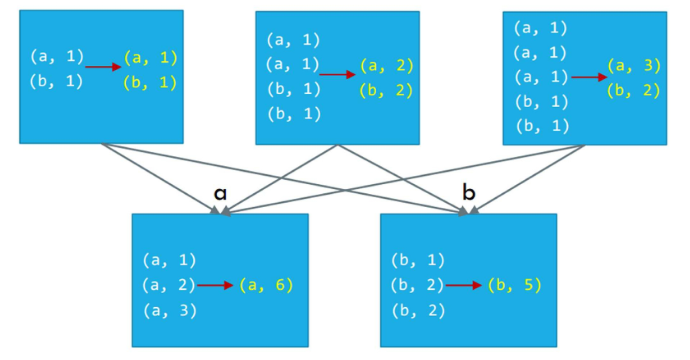
  - "합하고 모은다"
- GROUPBYKEY
  
  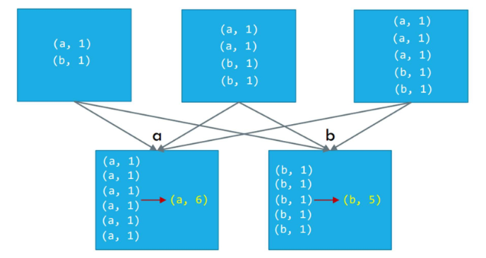
  - "모으고 합한다"

-> 네트워크 전송량, 메모리 사용량 측면에서 `ReduceByKey`가 더 효율적

### RDD 변환 : `JOIN`
원래 RDD들에서 **같은 키를 가진 모든 요소 쌍(pair)을 포함**하는 새로운 RDD를 반환

- `join(otherRDD, numPartitions=None)` 

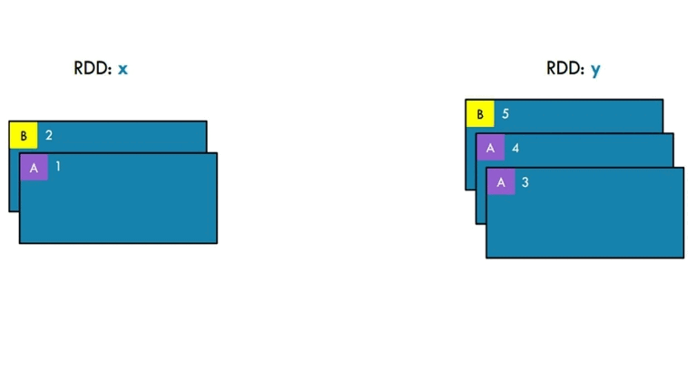
```python
x = sc.parallelize([("a",1), ("b", 2)])
y = sc.parallelize([("a",3), ("a", 4), ("b", 5)])
z = x.join(y)
print(z.collect())
```
```python
# 결과
x: [("a",1), ("b", 2)]
y: [("a",3), ("a", 4), ("b", 5)]
z: [("a",(1,3)), ("a", (1,4)), ("b", (2,5))]
```
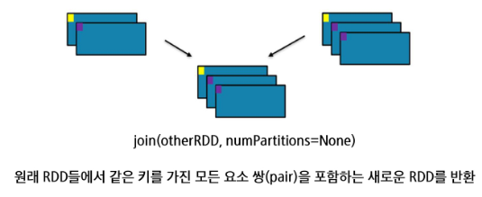
- 동일한 키가 있다면 가능한 모든 조합을 만듦
- key 기준으로 데이터 셔플 발생 -> 느릴 수 있음

### RDD 변환 : `UNION` 
두 개의 원래 RDD에서 모든 항목을 포함하는 새로운 RDD를 반환함

- 중복된 항목은 제거하지XX
- `union(otherRDD)`

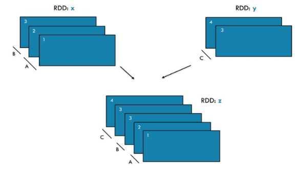
```python
x = sc.parallelize([1,2,3], 2)
y = sc.parallelize([3,4], 1)
z = x.union(y)
print(z.glom().collect())
```
```python
# 결과
x: [1, 2, 3]
y: [3, 4]
z: [[1], [2,3], [3,4]]
```
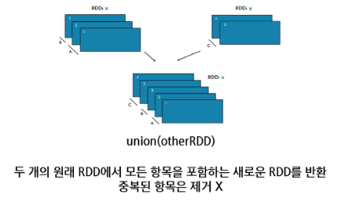
- 파티션 수는 원래 RDD들의 파티션 수 합과 같음
- 만약 `glom()`을 쓰지 않고 `collect()`만 쓴다면, 파티션 구분 없이 하나의 리스트로 반환됨
  - 즉, `[1, 2, 3, 3, 4]` 형태로 반환됨

### RDD 변환 : `DISTINCT`
원래 RDD에서 중복을 제거한 고유한 항목들만 포함하는 새로운 RDD를 반환

- `distinct(numPartitions=None)`

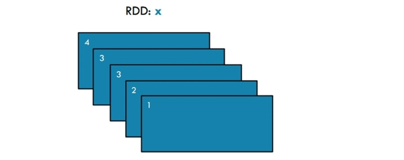
```python
x = sc.parallelize([1, 2, 3, 3, 4])
y = x.distinct()
print(y.collect())
```
```python
# 결과
x: [1, 2, 3, 3, 4]
y: [1, 2, 3, 4]
```
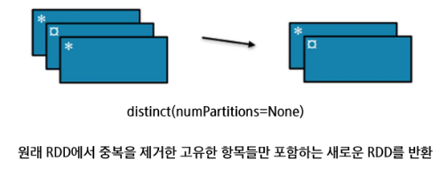
- 데이터 셔플 발생
  - RDD가 기본적으로 immutable이고, 분산된 상태로 저장되어 있음
  - 각 파티션들은 서로 다른 파티션이 어떤 데이터를 가지고 있는지 모름
  - 따라서, 중복된 항목을 제거하려면 모든 파티션의 데이터를 비교해야 함
  - 이 과정에서 파티션 간 데이터 이동(셔플)이 발생함
  - 즉, 중복된 항목 비교를 위해 데이터를 한 곳으로 모으는 작업이 필요함

### RDD Fundamentals : `SAMPLE`
- Big data
  - 머신 수가 많아질수록 처리 효율이 높아짐
    - 즉, 노드 수가 많아질수록 병렬 처리로 인해 처리 속도가 빨라짐
  - Small data 추출을 통해 일부 샘플만으로도 통계적으로 의미 있는 근사치 확보

- `sample(withReplacement, fraction, seed=None)`

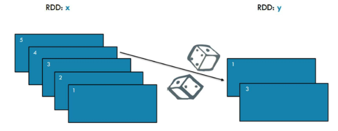
```python
x = sc.parallelize([1,2,3,4,5])
y = x.sample(False, 0.4, 42)
print(x.collect())
print(y.collect())
```
```python
x: [1, 2, 3, 4, 5]
y: [1, 3]
```
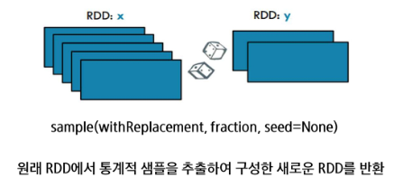
- withReplacement
  - True: 복원 추출 (같은 항목이 여러 번 선택될 수 있음)
  - False: 비복원 추출 (한 번 선택된 항목은 다시 선택되지 않음)
- fraction
  - 샘플링 비율 (0.0 ~ 1.0)

### RDD 변환 : 파티셔닝 재분배 (Repartition VS Coalesce)
- RDD의 파티션 수를 변경하는 방법

- repartition
  - 전체 데이터를 다시 섞어서(shuffle) 지정한 파티션 수로 균등하게, 랜덤하게 재분배
  - 파티션 수를 늘리거나 줄일 때 모두 사용 가능
  - 전체 셔플로 인해 비용이 많이 듦 + 리소스 소모 큼 + 시간 오래 걸림
  - 즉, 파티션을 균등하게 나눌 수 있지만 성능 부담이 있음

- coalesce
  - 셔플 없이 기존 파티션들을 병합하여 새로운 파티션을 생성
  - 파티션 수를 줄일 때 사용
  - 성능 부담이 적음
  - 단, 파티션 수를 늘릴 때는 적합하지 않음 (불균형 발생 가능)
  - 파티션을 하나로 줄여서 단일 파일로 저장할 때 주로 사용

- 코드 예시

  ```python
  df.rdd.getNumPartitions() # 현재 파티션 수 확인 -> 8

  # repartition: 파티션 수 늘리기 or 균등 재분배
  df2 = df.repartition(10)
  df2.rdd.getNumPartitions()  # 10

  # coalesce: 파티션 수 줄이기 (shuffling 없음)
  df3 = df.coalesce(2)
  df3.rdd.getNumPartitions()  # 2
  ```

### RDD 변환 : `COALESCE`  
파티션 수를 줄여서 구성한 새로운 RDD를 반환

- `coalesce(numPartitions, shuffle=False)`

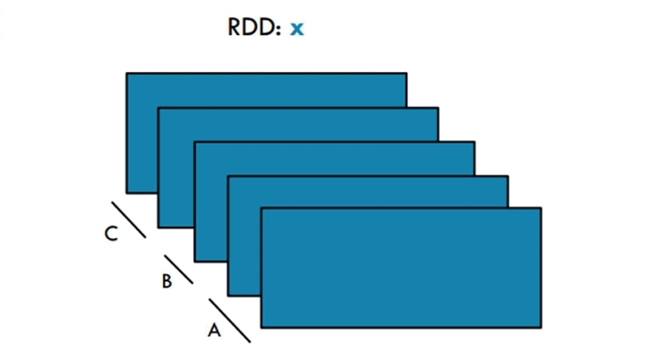
```python
x = sc.parallelize([1, 2, 3, 4, 5], 3)
y = x.coalesce(2)
print(x.glom().collect())
print(y.glom().collect())
```
```python
# 결과
x: [[1], [2, 3], [4, 5]]
y: [[1], [2, 3, 4, 5]]
```
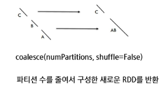
- 파티션이 합쳐질 땐 랜덤하게 합쳐짐
  - 데이터 개수를 반영하지 않음
  - 파티션끼리는 각자 데이터를 얼마나 가지고 있는지 모르기 때문에, 균등하게 나누지 못함

### RDD 변환 : `PARTITIONBY`
사용자 정의 함수가 반환하는 파티션에 따라 원래 항목들을 배치하여, 지정한 개수의 파티션을 갖는 새로운 RDD를 반환

- `partitionBy(numPartitions, partitioner=portable_hash)`

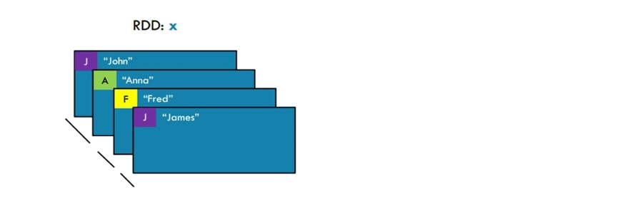
```python
x = sc.parallelize([('J’, ‘James’), (‘F’, ‘Fred’), (‘A’, ‘Anna’),(‘J’, ‘James’)], 3)
y = x.partitionBy(2, lambda w: 0 if w[0] < 'H' else 1)
print(x.glom().collect())
print(y.glom().collect())
```
```py
# 결과
x: [[('J', 'James')], [('F', 'Fred'), ('A', 'Anna')], [('J', 'James')]]
y: [[('A', 'Anna'), ('F', 'Fred')], [('J', 'James'), ('J', 'James')]]
```
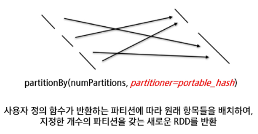
- `partitionBy(2, lambda w: 0 if w[0] < 'H' else 1)`
  - key의 첫 글자가 'H' 이전이면 파티션 0, 이후면 파티션 1로 배치
- 데이터 셔플 발생


## RDD Action
### ACTIONS  
변환된 RDD 데이터를 메모리로 가져오거나, 저장하거나, 집계하는 연산

- 실제 연산을 실행, 결과를 확인(수집)하는 역할

  | 연산 | 설명 | 예제 | 결과 |
  |------|------|------|------|
  | `collect()` | 모든 데이터를 리스트로 반환 | `rdd.collect()` | [1, 2, 3, 4] |
  | `count()` | 전체 요소를 하나로 결합 | `rdd.count()` | 4 |
  | `reduce()` | 전체 요소를 하나로 결합 | `rdd.reduce(lambda a, b: a + b)` | 10 |
  | `sum()` | 요소의 합 반환 | `rdd.sum()` | 10 |
  | `mean()` | 평균 값 반환 | `rdd.mean()` | 2.5 |

### RDD Action : `COLLECT`
RDD의 모든 항목을 하나의 리스트로 드라이버 프로그램으로 반환

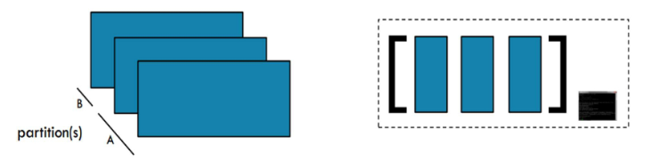
- 그림 오른쪽: 드라이버 프로그램
  - 로컬 메모리로 데이터를 가져옴
```python
x = sc.parallelize([1, 2, 3], 2)
y = x.collect()

print(x.glom().collect())
print(y)
```
```py
# 결과
x: [[1], [2, 3]]
y: [1, 2, 3]
```
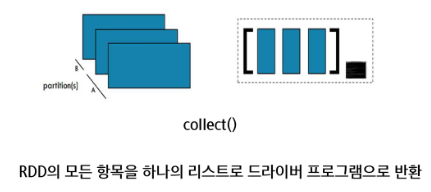

### RDD Action : `COUNTBYKEY`
RDD에 있는 각 키의 등장 횟수를 세어 키와 그 개수로 이루어진 맵(map)을 반환
- 즉, key별로 value의 개수를 세는 역할
- 딕셔너리 형태로 반환됨

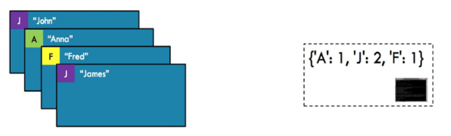
```python
x = sc.parallelize([('J', 'James'), ('F', 'Fred'), ('A','Anna'), ('J','John')])
y = x.countByKey()
print(y)
```
```py
# 결과
x: [('J', 'James'), ('F', 'Fred'), ('A','Anna'), ('J','John')]
y: {'J' : 2, 'F' : 1, 'A' : 1}
```

- 파티션이 어떻게 나눠져 있던지 상관없이, 마지막에 Action 연산을 통해 드라이버로 직접 수집하여 처리됨

### RDD Action : `REDUCE`
전체 RDD를 대상으로 축소(reduce) 연산을 수행

- RDD의 모든 요소를 사용자 정의 함수를 이용해 요소와 중간 결과를 쌍(pairwise)으로 연속적으로 집계하여, 최종 결과를 드라이버 프로그램으로 반환

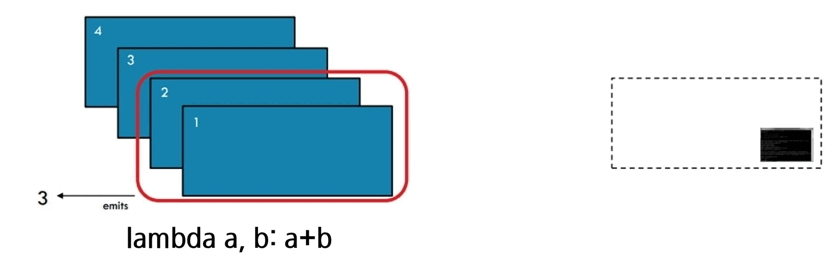
- 첫 번째 파티션 내에서 연산 수행
- 그 다음 파티션과 중간 결과를 이용해 다시 연산 수행
- 이러한 과정을 반복하여 최종 결과 도출

```python
x = sc.parallelize([1, 2, 3, 4])
y = x.reduce(lambda a, b: a+b)

print(x.collect())
print(y)
```
```py
# 결과
x: [1, 2, 3, 4]
y: 10
```
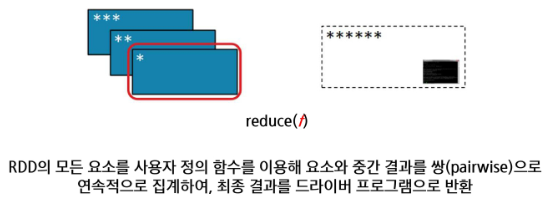
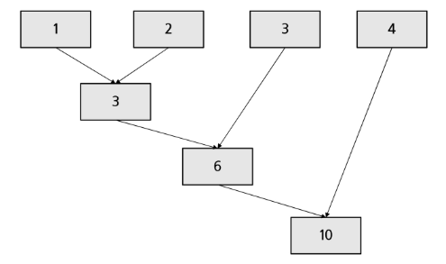
- 지금 방식대로 평균 연산을 수행하면 안됨
  - Why? 묶어서 평균 구하고 묶어서 평균 구하고 ... 하면 전체 평균이 안 나옴
  - 합계를 구한 후, count로 나눠야 함
- 따라서, 어떤 연산을 수행할지 잘 설계해야 함
  
### RDD Action : `SUM`
RDD에 있는 모든 항목의 합(sum)을 반환

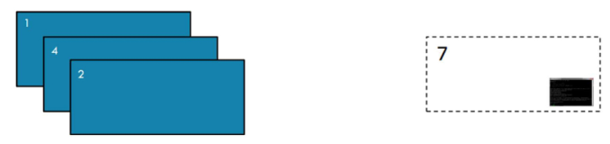
```python
x = sc.parallelize([2,4,1])
y = x.sum()

print(x.collect())
print(y)
```
```py
# 결과
x: [2, 4, 1]
y: 7
```
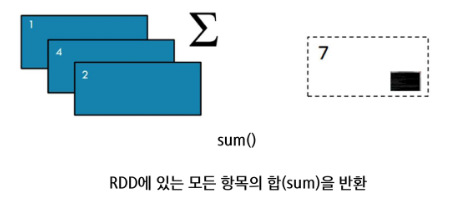
- collect() 사용하지 않았으므로 단일 값으로 반환됨

### RDD Action : `MEAN`
RDD에 있는 모든 항목의 평균(mean)을 반환

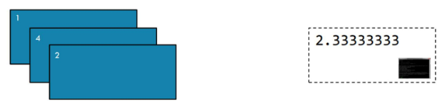
```python
x = sc.parallelize([2,4,1])
y = x.mean()

print(x.collect())
print(y)
```
```py
# 결과
x: [2, 4, 1]
y: 2.3333333
```
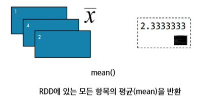

※ ReduceBykey, GroupByKey 사용 시

-> ReduceBykey의 경우 평균 연산을 할 때 연산 후 합치므로, 평균 계산에 유의해야 함

-> GroupByKey의 경우 그룹화된 값들을 모아서 평균을 계산하면 됨

