# Spark DataFrame과 Spark SQL
## RDD와 Spark SQL · DataFrame
### RDD 복습
- Resilient Distributed Dataset
  - 탄력적이고 분산된 데이터
  - 스파크에서 가장 기본적인 데이터 처리 단위

- 장점
  - 데이터를 병렬 처리하는 핵심적인 역할을 수행하여 빠르고 안정적으로 동작하는 프로그램을 작성 가능
- 단점
  - 데이터 값 자체는 표현이 가능하지만,  
  - 데이터에 대한 메타 데이터, **‘스키마’** 에 대해 명시적 표현 방법이 없음

### RDD API의 문제점
- 스파크가 RDD API 기반의 연산, 표현식을 검사하지 못해 **최적화할 방법이 없음**
  - RDD API 기반 코드에서 어떤 일이 일어나는지 스파크는 알 수 없음
  - Join, filter, group by 등 여러 연산을 하더라도 스파크에서는 람다 표현식으로만 보임
    - 표현식의 목적을 알 수 없음
  - 특히 PySpark의 경우, 연산 함수 Iterator 데이터 타입을 제대로 인식하지 못함  
    - 스파크에서는 단지 파이썬 기본 객체로만 인식

- 스파크는 어떠한 **데이터 압축 테크닉도 적용하지 못함**
  - 객체 안에서 어떤 타입의 컬럼에 접근하더라도 스파크는 알 수 없음
  - 결국 바이트 뭉치로 직렬화해 사용할 수밖에 없음

- → 스파크가 연산 순서를 재정렬하여 효율적인 질의 계획으로 바꿀 수 없음
  - 즉, RDD API 기반 코드는 성능 최적화가 어려움!!

## Spark SQL과 DataFrame 소개
### DataFrame
- **스키마(schema)를 가진** 분산 데이터 컬렉션
  - 열 이름, 데이터 타입 등의 메타데이터를 가짐
- 데이터를 행(row)과 열(column)로 구성된 표 형태로 관리
- 각 열은 명확한 데이터 타입과 메타 데이터(schema)를 가지고 있음
  - 쿼리 최적화, 컬럼 단위 연산, 데이터 압축 등 다양한 최적화 기법 적용 가능
- Spark SQL이 제공하는 구조화된 데이터 모델로서 RDD의 한계를 보완

### DataFrame API
- 구조, 포맷 등 몇몇 특정 연산 등에 있어 Pandas의 DataFrame에 영향을 많이 받음
- **이름 있는 컬럼과 스키마를 가진 분산 인메모리 테이블처럼 동작**
- Spark DataFrame은 하나의 표 형태로 보임

  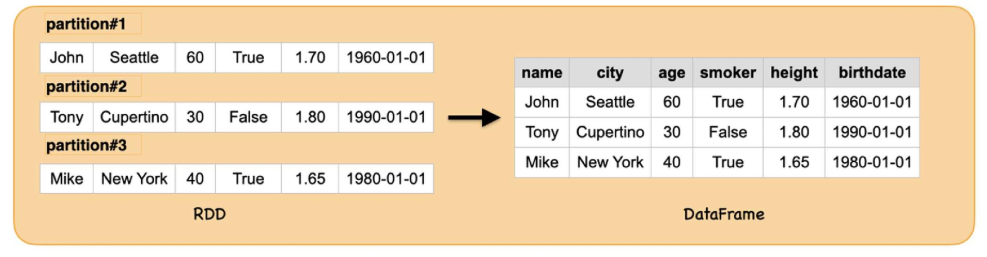
- 고수준 API 이므로 사용이 편리

### DataFrame API - 데이터 타입
- 기본 타입
  - `Byte`, `Short`, `Integer`, `Long`, `Float`, `Double`, `String`, `Boolean`, `Decimal`

- 정형화 타입
  - `Binary`, `Timestamp`, `Date`, `Array`, `Map`, `Struct`, `StructField`

- 실제 데이터를 위한 스키마를 정의할 때 이런 타입이 어떻게 연계되는지 이해하는 것이 중요함

```py
from pyspark.sql.types import StructType, StructField, StringType, ArrayType, IntegerType

# PySpark에서 스키마 정의할 때
# StructType 선언 -> 각각 Field에 대해 타입 정의
schema = StructType([
    StructField("name", StringType(), True),
    StructField("scores", ArrayType(IntegerType()), True)
    # 점수는 여러 개가 있을 수 있으므로 Array 형태로 묶고
    # 각 요소는 Integer 타입으로 정의
])
```
- 위 코드처럼 스키마 정의 해놓고
  - 스키마 기반으로 처리되게 만들어 놓으면
  - SparkSQL 엔진이 데이터를 최적화하여 처리함

### DataFrame API - 스키마(Schema)
- 스파크에서의 스키마는 Dataframe을 위해 **컬럼 이름과 연관된 데이터 타입을 정의**한 것
- 외부 데이터 소스에서 구조화된 데이터를 읽어 들일 때 사용

- 읽을 때 스키마를 가져오는 방식과 달리, **미리 스키마를 정의**하는 것은 여러 장점 존재
  - 스파크가 데이터 타입을 추측해야 되는 책임을 덜어줌
  - 스파크가 스키마를 확정하기 위해 파일의 많은 부분을 읽어 들이려 별도의 Job을 만드는 것을 방지
  - 데이터가 스키마와 맞지 않는 경우, 조기에 문제 발견 가능
    - 안정성 측면에서 유리

### DataFrame 구조
- DataFrame = RDD + schema + DSL
  - DataFrame은 단순한 테이블 형태의 데이터가 아니라, RDD 위에 스키마 정보와 고수준 연산 언어(DSL)를 결합한 구조적 API

- RDD(Resilient Distributed Dataset)
  - DataFrame의 핵심 데이터 저장·처리 기반은 여전히 RDD
  - 클러스터 전반에 분산 저장되는 데이터 블록
  - 불변(Immutable)
  - 장애 복구를 위한 lineage 기반 구조
  - 저수준 API: 함수형 변환(map, filter, flatMap 등)을 직접 다룸

- Schema (Named columns with types)
  - DataFrame은 RDD와 달리 컬럼 이름과 타입이 명확히 정의된 구조화된 데이터 모델
  - 각 컬럼은 이름(name)과 데이터 타입(type)을 가짐
    - `StructField("age", IntegerType, nullable=true)`
  - 전체 스키마는 StructType 객체로 표현됨
    - `StructType([StructField(...) ...])`

- Domain-Specific Language(DSL)
  - DataFrame은 단순한 데이터 구조가 아니라 **스파크가 SQL-like 연산을 수행할 수 있도록 설계된 고수준 언어(DSL)** 를 제공
  - 선언적(Declarative) 연산
    - 사용자는 “무엇을 하고 싶은지”만 선언
    - ex. `.select()`, `.filter()`, `.groupBy()` 등
    - 실제 실행 계획(physical plan)은 Catalyst 옵티마이저가 자동적으로 최적화함
    - 사용자 입장에서 병렬 처리나 클러스터 분산은 신경 쓸 필요 없음
  - Lazy Execution
    - 변환(transformations)은 DAG으로 쌓이고, 액션(action)이 호출될 때만 실제 계산이 수행됨
  - SQL과 완전 호환
    - DataFrame을 SQL 테이블처럼 등록 가능
    - SQL 문장을 DataFrame으로 표현 가능
    - 내부적으로 동일한 실행 엔진(Catalyst & Tungsten)을 사용

### DataFrame 쿼리 방식
- DataFrame은 DSL 방식과 SQL 방식 모두 지원함

  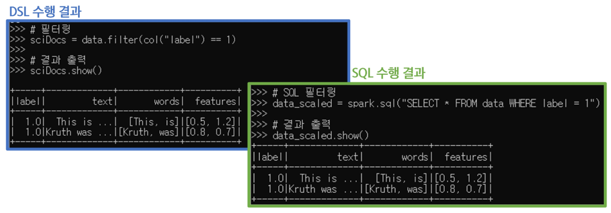

- DSL 수행 예시
  ```python
  # 필터링
  sciDocs = data.filter(col("label") == 1)

  # 결과 출력
  sciDocs.show()
  ```

- SQL 수행 예시 (코드블록)
  ```python
  # SQL 필터링
  data_scaled = spark.sql("SELECT * FROM data WHERE label = 1")

  # 결과 출력
  data_scaled.show()
  ```
  - 단, SQL은 View 형태로 만들어서 질의를 날려야함

- 두 방식 모두 Dataframe API를 기반으로 동작함
- 내부적으로 SparkSQL 엔진(모듈)에서 실행되므로, 엔진이 쿼리를 자동으로 분석·최적화하여 가장 효율적인 실행 계획을 생성한 뒤 처리

### RDD와 DataFrame의 차이점
| 구분 | RDD | DataFrame |
|------|------|------------|
| 데이터 표현 방식 | 값만 표현 가능, 스키마 표현 불가능 | 명확한 스키마(컬럼, 데이터 타입)를 가진 구조적 데이터 |
| 최적화 및 성능 | 최적화 어려움, 직접적 연산 필요 | Catalyst Optimizer(최적화 엔진) 통한 자동 최적화 및 빠른 처리 |
| 사용 편의성 | 낮음(저수준 API) | 높음(고수준 API, SQL 활용 가능) |

- 결론  
  - DataFrame을 사용하면 데이터를 더 효율적이고 편리하게 처리 가능  
  - 메타 정보를 활용하여 더 빠르고 최적화된 분석 수행 가능

### RDD를 사용하는 경우
1. 저수준의 Transformation과 Action을 **직접 제어**해야 할 때  
    - 파티션 단위로 다뤄야할 때 
2. 스트림 데이터(미디어나 텍스트 스트림)가 구조화되지 않은 경우 
    - 비정형 데이터 다룰 때
    - 즉, 스키마가 없는 데이터를 다룰 때
3. 특정 도메인 표현을 위해 함수형 프로그래밍이 필요할 때  
4. 스키마 변환이 필요 없을 때  
    - ex. 열 기반 저장소를 사용하지 않는 경우  
5. DataFrame이나 Dataset에서 처리할 수 없는 성능 최적화가 필요할 때
    - 사용자 정의로 처리해야할 때

※ DataFrame을 기본적으로 사용하되, 특수한 것들에 대해서는 RDD로 전환하여 유연하게 처리하는 방식을 주로 사용함

### DataFrame를 사용하는 경우
1. 고수준의 추상화와 도메인 기반 API가 필요할 때  
2. 고수준의 표현(filter, map, agg, avg, sum SQL, columnar access) 등 복잡한 연산이 필요하거나 반구조적 데이터에 대한 lambda 식이 필요할 때  
3. 타입 안정성과 최적화를 위해 컴파일 시 타입 안전성을 보장하고,  
4. Catalyst 최적화 및 Tungsten의 효율적인 코드 제너레이션이 필요할 때  
    - `Catalyst`: 최적화 엔진
    - `Tungsten`: 코드 실행을 빠르게 해줌(실행 엔진)
5. Spark API의 일관성과 간결함을 원할 때  

### SparkSQL
Spark SQL은 구조화된 데이터를 SQL처럼 처리할 수 있도록 해주는 스파크 모듈  

- 내부적으로는 DataFrame/Dataset API와 동일한 엔진(Catalyst)을 사용하여 처리  
  - SQL 문법, DataFrame 문법 상관없이 사용 가능
- DataFrame과 Dataset을 SQL처럼 다룰 수 있게 해주는 분산 SQL 쿼리 엔진  
- Spark SQL은 RDD보다 더 높은 수준의 추상화와 자동 최적화를 제공  

  

※ DataFrame이 중심이고, Spark SQL은 그것을 SQL 방식으로 접근하게 해주는 방법 중 하나

- SparkSQL의 역할
  - SQL 같은 질의 수행  
    - ex. SELECT, WHERE ..
  - 스파크 컴포넌트들을 통합하고, Dataframe, Dataset가 java, scala, python, R 등 여러 프로그래밍 언어로  **정형화 데이터 관련 작업을 단순화할 수 있도록 추상화**  
  - 정형화된 파일 포맷(JSON, CSV, txt, avro, parquet, orc 등)에서 스키마와 정형화 데이터를 읽고 쓰며, 데이터를 임시 테이블로 변환( -> `View`)
  - 빠른 데이터 탐색을 할 수 있도록 대화형 스파크 SQL 셸을 제공  
  - 표준 데이터베이스 JDBC/ODBC 커넥터를 통해, 외부의 도구들과 연결할 수 있는 중간 역할 제공
    - DB에 접근해서 바로 가져와 직접처리 가능하도록
  - 최종 실행을 위해 최적화된 질의 계획과 JVM을 위한 최적화된 코드를 생성 

- Spark SQL 아키텍처 구조

  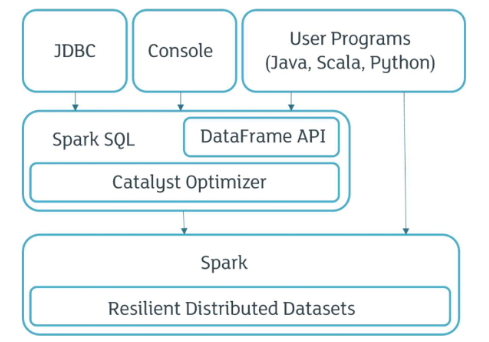
  - 유저 프로그램에서 RDD를 직접 사용한다면, Spark Core의 RDD API를 바로 호출해 저수준 연산을 수행하게 됨
    - 즉, 최적화 계층을 거치지 않고 RDD 기반 분산 연산을 직접 작성하는 방식
  - DataFrame 형태로 사용한다면, 
    - Spark SQL 엔진 내부의 DataFrame API와 Catalyst Optimizer를 거쳐 최적화된 실행 계획이 생성되고, 
    - 실제 실행 단계에서는 이 계획이 RDD 연산으로 변환되어 Spark Core에서 처리됨
  - JDBC나 콘솔 등 외부에서 SQL로 접근할 경우
    - 입력된 SQL 쿼리가 Spark SQL 엔진으로 전달되고, 엔진이 이를 파싱 → 최적화 → RDD 실행의 흐름으로 처리해줌

### Spark SQL의 내부 동작
- Spark SQL은 사용자가 입력한 SQL 쿼리나 DataFrame 연산을 해석하고 실행하는 역할
- 또, 이 명령들을 가장 빠르고 효율적인 방식으로 처리하도록 변환힘
- 이러한 최적화된 실행 방식의 중심에는 Catalyst Optimizer가 있으며, 
  - Spark SQL 내부에서 쿼리를 분석, 최적화하여 최적의 실행 계획을 생성하는 핵심 엔진임

### Catalyst Optimizer
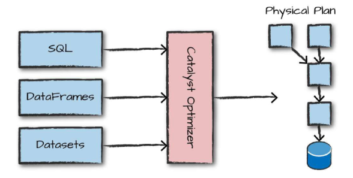
- RDD API를 직접 사용하는 경우를 제외하면, 모든 연산은 Catalyst Optimizer를 거치며 자동 최적화 과정을 수행하게 됨
- 입력된 SQL 쿼리나 DataFrame 연산은 먼저 **logical plan(논리적 실행 계획)** 으로 변환됨
- 이후 이 논리 계획을 기반으로 **physical plan(물리적 실행 계획)** 을 생성하여, 스파크 엔진에서 실제로 실행되는 형태로 바뀜
- 즉, 추상화된 표현으로 바뀌기 때문에 어떤 방식으로 작성되었는지(DataFrame, SQL 등)는 상관없이 동일하게 처리 가능
- 최종적으로 어떤 연산을 어떤 방식으로 수행할지에 대한 구체적인 실행 로직이 만들어져 효율적으로 실행됨

### Catalyst Optimizer의 최적화 과정
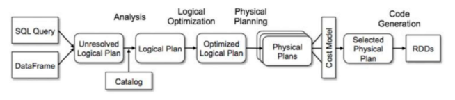
1. SQL Parser & DataFrame API 해석 단계
    - 사용자가 작성한 SQL 문자열 또는 DataFrame의 DSL 표현을 내부 표현으로 변환하는 단계
    - 이 단계에서 만들어지는 것은 **Unresolved Logical Plan(미해결 논리 계획)**
      - 컬럼 이름, 테이블 정보 등 아직 해결되지 않은 요소들 포함
      - 분석 전의 “초안” 같은 계획
2. Logical Plan (논리적 계획) 생성 - Analysis 단계
    - Catalog(메타데이터 저장소)를 참고하여 컬럼, 테이블 등 Unresolved 요소들을 검증 및 해결
    - 스키마 확인, 컬럼 존재 여부 체크, 함수 타입 체크 등 수행
    - 결과적으로 **Resolved Logical Plan(해결된 논리 계획)** 이 만들어짐
      - 논리적으로 무엇을 해야 하는지만 표현한 고수준 계획 
3. Optimized Logical Plan (최적화된 논리 계획) 생성 - Logical Optimization 단계
    - Catalyst의 규칙 기반(rule-based) 최적화가 적용되는 단계
    - 이 단계는 **“같은 결과를 만들되 더 빠르게 실행할 수 있는 논리 계획으로 변환”** 하는 과정
4. Physical Plan (물리적 실행 계획) 생성 - Physical Planning 단계
    - 최적화된 논리 계획을 바탕으로 실제 실행 가능한 여러 개의 물리 계획 후보를 생성
    - 각 Physical Plan은 **Spark 엔진이 실제로 클러스터에서 작업을 실행할 수 있도록** 변환된 형태
5. 비용 기반(Cost Model)에 의한 최적의 실행 계획 선택
    - Catalyst가 여러 물리적 실행 계획 후보들 중 데이터 크기, 클러스터 상태, join 전략 등을 고려하여 가장 비용(cost)이 낮은 실행 계획을 선택
6. Code Generation 단계 (Whole-Stage CodeGen)
    - 선택된 Physical Plan을 기반으로 JVM 바이트코드로 변환하여 실제로 RDD 연산이 실행됨
    - DataFrame이 최종적으로 RDD 액션으로 실행되는 순간

-> Catalyst Optimizer가 내부적으로 복잡한 최적화 과정을 자동으로 처리

### Spark SQL과 DataFrame API의 관계
- Spark SQL과 DataFrame API는 서로 완전히 독립된 별개의 것이 아님  
- 동일한 최적화 엔진(Catalyst Optimizer)을 공유하고, 내부적으로 통합된 구조를 가짐  

※ Spark에서는 DataFrame API를 이용해 작성된 데이터 처리 명령을 내부적으로 **Spark SQL의 엔진으로 최적화**해 실행

### Dataset API
- 스파크 2.0에서, 개발자들이 한 종류의 API만 알면 되도록, Dataframe, Dataset API를 하나로 합침
- Dataset은 정적 타입(typed) API와 동적 타입(untyped) API의 두 특성을 모두 가짐
- Java, Scala(타입 안전을 보장하는 언어)에서만 사용이 가능하고, 
  - Python, R(타입 안전을 보장하지 않는 언어)에서는 사용이 불가능
  - DataFrame API만 사용 가능

    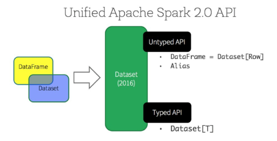

### DataFrame vs Dataset
- 가장 큰 차이점은 오류가 발견되는 시점

  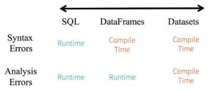
  - SQL은 모든 오류가 실행해봐야 드러남
  - DataFrame은 문법 오류는 미리 잡지만 스키마 관련 오류는 여전히 런타임
  - Dataset은 모든 오류를 실행 전(Compile Time)에 잡을 수 있는 타입 안전 모델

### View 등록 및 SQL 실행

```python
# DataFrame을 뷰로 등록하기

# 세션(Session) 단위의 임시 뷰 생성  
  # 현재 SparkSession에서만 사용 가능 (세션 종료 시 사라짐)
  # 같은 이름의 뷰가 이미 있으면 에러 발생
df.createTempView("viewName")

# 글로벌 임시 뷰 생성  
  # 모든 SparkSession에서 접근 가능 (global_temp DB 하위에 저장됨)
  # "global_temp.viewName" 형태로 접근해야 함
  # 스파크 애플리케이션이 종료될 때까지 유지
df.createGlobalTempView("viewName")

# 세션 단위 임시 뷰 생성 + 동일 이름 뷰가 있으면 자동 덮어쓰기(replace)
  # createTempView와 달리 중복 이름 오류 없음
df.createOrReplaceTempView("viewName")

# 뷰에 SQL 쿼리 실행하기
# 일반 임시 뷰 조회 (createTempView / createOrReplaceTempView로 생성된 뷰)
spark.sql("SELECT * FROM viewName ").show()
# 글로벌 임시 뷰 조회 (createGlobalTempView로 생성된 뷰)
spark.sql("SELECT * FROM global_temp.viewName").show()
```
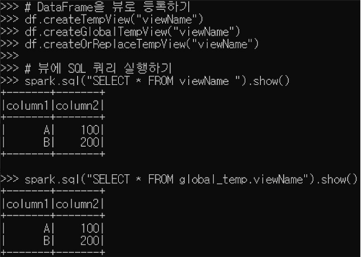

### DataFrame 구조 변환
```python
# DataFrame → RDD (분산 처리용 RDD로 변환)
rdd1 = df.rdd

# DataFrame → JSON 문자열 → 첫 번째 항목 확인
df.toJSON().first()

# DataFrame → Pandas DataFrame
pandas_df = df.toPandas()
print(pandas_df)
```
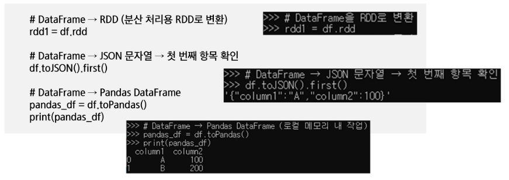


## DSL과 SQL을 활용한 데이터 처리
### SQL쿼리 기본 문법
- 데이터 조회 : `SELECT`, `WHERE`  
- 정렬 : `ORDER BY`  
- 중복 제거 : `DISTINCT`  
- 데이터 집계 : `GROUP BY`, `HAVING`, 집계 함수(`COUNT`, `AVG`, `SUM`)  
- 데이터 결합 : `JOIN`  

### Creating DataFrames(DSL 코드)
```python
# SparkSession 생성
# getOrCreate: 있으면 가져오고, 없으면 생성
spark = SparkSession.builder.appName("ExampleApp").getOrCreate()

# 스키마 정의
schema = StructType([
    StructField("name", StringType(), True),
    StructField("age", IntegerType(), True)
])

# 데이터 전처리 및 DataFrame 생성
parts = spark.sparkContext.parallelize([("Mine", "28"), ("Filip", "29"), ("Jonathan", "30")])
people = parts.map(lambda p: Row(name=p[0], age=int(p[1].strip())))
df = spark.createDataFrame(people, schema)

# 결과 출력
df.show()
```
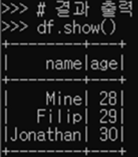

### Creating DataFrames(SQL 코드)
```python
# DataFrame을 SQL에서 사용할 수 있도록 TempView 등록
# createOrReplaceTempView: 만들거나 대체하거나 
df.createOrReplaceTempView("people")

# Spark SQL을 이용한 동일 조회
result = spark.sql("""
    SELECT name, age
    FROM people  
""")  # 임시 뷰를 테이블처럼 사용

result.show()
```
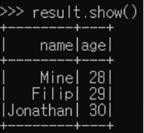

### Creating DataFrames From File(DSL 코드)
- 외부 파일을 읽어 처리
```python
# DataFrame을 직접 생성
people_df = spark.read.option("header", "false")  # 헤더(컬럼이름) 날리기
            .option("inferSchema", "true")  # 스키마 선언 안하면 추론
            .csv("people.txt")
            .toDF("name", "age")  # 컬럼명 명시

# 결과 출력
peopledf.show()
```
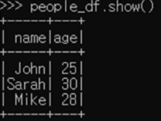

### Creating DataFrames From File(SQL 코드)

```python
# DataFrame을 직접 생성
people_df = spark.read.option("header", "false")  # 헤더(컬럼이름) 날리기
            .option("inferSchema", "true")  # 스키마 선언 안하면 추론
            .csv("people.txt")
            .toDF("name", "age")  # 컬럼명 명시

# TempView 등록
people_df.createOrReplaceTempView("people")

# SQL 쿼리로 조회
result = spark.sql("""SELECT name, age FROM people""")

# 출력 확인
result.show()
```
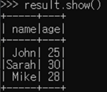

### From Spark Data Sources
```python
# JSON
df = spark.read.json(filename.json)
df = spark.read.load("filename.json", format="json")

# Parquet files
df = spark.read.load("filename.parquet")

# TXT files
df = spark.read.txt("filename.txt")

# 열 이름과 데이터 유형 반환
df.dtypes

# 내용 표시(테이블 형태로 반환)
df.show()

# 처음 n개의 행 반환(n개의 row 리스트)
df.head()

# 첫 번째 행 반환(단일 row 객체)
df.first()
```

### Inspect Data (데이터 탐색 시 사용)
```python
# 처음 n개의 행 반환(python 리스트 형태로 반환)
df.take(n)

# DataFrame의 스키마 반환
df.schema

# 요약 통계 계산
df.describe().show()

# 열 이름 반환
df.columns

# 행 개수 계산
df.count()

# 고유 행 개수 계산
df.distinct().count()

# 스키마 출력
df.printSchema()

# (논리 및 물리적) 실행 계획 출력
df.explain()
```

### Duplicate Values
```python
# 중복 행 제거
df = df.dropDuplicates()
```

### Queries (SELECT)
```python
# DataFrame 생성
df = spark.createDataFrame(data)

# DSL 방식: column1, column2 선택
df.select("column1", "column2").show()
```
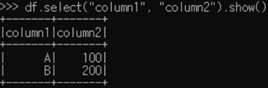

```python
# SQL 사용을 위해 TempView 등록
df.createOrReplaceTempView("my_table")

# SQL 방식: 동일한 SELECT 쿼리
spark.sql("""
    SELECT column1, column2
    FROM my_table
""").show()
```
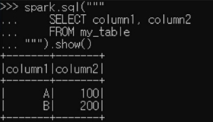

### Queries (SELECT with Expressions & Filters) DSL 코드
```python
# column1과 column2 값에 +1 결과 출력
df.select(
    col("column1"),
    (col("column2") + 1).alias("column2_plus1")
).show()

# column1이 "A"보다 큰 값만 필터링
df.filter(col("column1") > "A").show()
```


### Queries (SELECT with Expressions & Filters) SQL 코드
```python
# SELECT with expression
spark.sql("""
    SELECT column1, column2 + 1 AS column2_plus1
    FROM my_table
""").show()

# WHERE 조건 필터
spark.sql("""
    SELECT *
    FROM my_table
    WHERE column1 > 'A'
""").show()
```
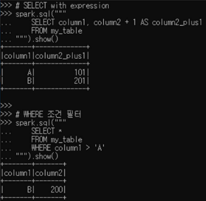

### Queries (`When`, `ISIN`) DSL 코드
- 조건부로 컬럼 생성, 다중 조건 필터링

```python
from pyspark.sql.functions import when

# column2가 100보다 크면 1, 아니면 0으로 표시해 새로운 컬럼 'flag' 추가
df.select(
        "column1",
        when(df.column2 > 100, 1)
        .otherwise(0)
        .alias("flag")
).show()

# column1 값이 'A' 또는 'B'인 행만 필터링
df.filter(
        df.column1.isin("A", "B")
).show()
```
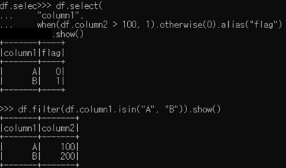

### Queries (`CASE WHEN`, `IN`) SQL 코드
```py
# column2가 100보다 크면 1, 아니면 0으로 표시해 새로운 컬럼 'flag' 추가
spark.sql("""
    SELECT column1,
        CASE WHEN column2 > 100 THEN 1 ELSE 0 END AS flag
    FROM my_table
""").show()

# column1 값이 'A' 또는 'B'인 행만 필터링
spark.sql("""
    SELECT *
    FROM my_table
    WHERE column1 IN ('A', 'B')
""").show()
```
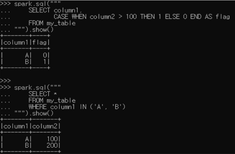

### 문자열 조건 처리(`Like`, `STARTSWITH`, `ENDSWITH`) DSL 코드
```py
# col1 값이 ‘A’로 시작하면 True, 아니면 False - 특정 문자열로 시작하는지
df.select(
    col("column1"), 
    col("column1").startswith("A").alias("starts_with_A")
).show()

# col2이 “00”으로 끝나는 경우 - 특정 문자열로 끝나는지
# cast: 타입 변환
df.select(
    col("column2"),
    col("column2").cast("string").endswith("00").alias("ends_with_00")
).show()

# col1이 ‘A’와 정확히 일치하는 경우
# SQL의 '='와 동일
df.select(
    col("column1"), 
    col("column1").like("A").alias("is_A")
).show()
```
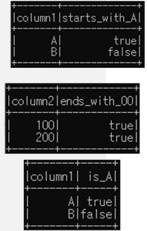

### 문자열 조건 처리 (`Like`, `STARTSWITH`, `ENDSWITH`) — SQL 코드
```py
# col1 값이 ‘A’로 시작하면 True, 아니면 False - 특정 문자열로 시작하는지
spark.sql("""
    SELECT column1, column1 LIKE 'A%' AS starts_with_A
    FROM my_table """
).show()

# col2이 “00”으로 끝나는 경우 - 특정 문자열로 끝나는지
spark.sql("""
    SELECT column2,
        CAST(column2 AS STRING) LIKE '%00' AS ends_with_00
    FROM my_table"""
).show()

# col1이 ‘A’와 정확히 일치하는 경우
spark.sql("""
    SELECT column1, column1 = 'A' AS is_A
    FROM my_table"""
).show()
```
- 모든 조건은 문자열 비교로 True/False 결과를 반환함  
- 숫자 컬럼에는 문자열 변환이 필요할 수 있음

### 문자열 추출 및 범위 조건 처리 (`Substring`, `Between`) — DSL 코드
```py
# column1에서 2번째 문자부터 3개의 문자를 추출하여 컬럼이름을 “name”으로 지정
df.select(df.column1.substr(2, 3).alias("name")).show()
```
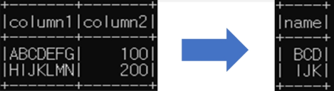

```py
# column2의 값이 50~150 사이에 있으면 TRUE를 표시
df.select(
    col("column1"), 
    col("column2"),
    col("column2").between(50, 150).alias("is_between_50_150")
).show()
```
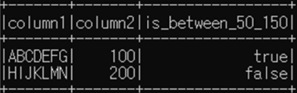

### 문자열 추출 및 범위 조건 처리 (`Substring`, `Between`) — SQL 코드
```py
# column1에서 2번째 문자부터 3개의 문자를 추출하여 컬럼이름을 “name”으로 지정
spark.sql("""
    SELECT SUBSTRING(column1, 2, 3) AS name 
    FROM my_table""").show()
```
```py
# column2의 값이 50~150 사이에 있으면 TRUE를 표시
spark.sql("""
    SELECT column1, 
           column2,
           column2 BETWEEN 50 AND 150 AS is_between_50_150
    FROM my_table
""").show()
```

### 컬럼 이름 변경 및 삭제 (`Update` & `Remove` Columns) — DSL 코드
```py
# column1 -> alphabet, column2 -> number로 컬럼명 변경
df.withColumnRenamed("column1", "alphabet")
  .withColumnRenamed("column2", "number")
  .show()
```
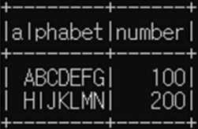

```py
# column1 컬럼 삭제
df.drop("column1").show()
```
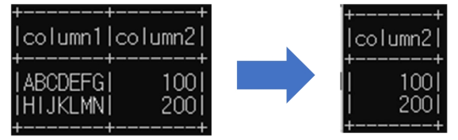

### 컬럼 이름 변경 및 삭제 (`Update` & `Remove` Columns) — SQL 코드
```py
# column1 -> alphabet, column2 -> number로 컬럼명 변경
spark.sql("""
    SELECT column1 AS alphabet, column2 AS number
    FROM my_table
""").show()
```
```py
# column1 컬럼 삭제
# drop 없음. 필요한 것만 불러오기
spark.sql("SELECT column2 FROM my_table").show()
```

### 그룹별 집계 (`Group By`, `Count`) — DSL 코드
```py
# column1을 기준으로 그룹화하고 각 그룹의 개수를 계산하여 출력
# 그룹별 Count 계산
df.groupBy("column1").count().show()
```
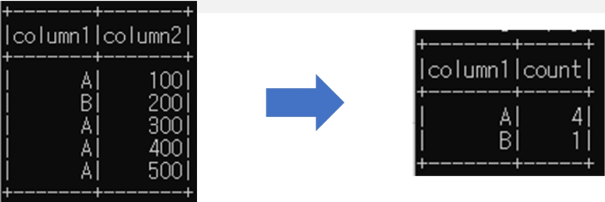

### 그룹별 집계(`Group By`, `Count`) — SQL 코드
```py
# column1을 기준으로 그룹화하고 각 그룹의 개수를 계산하여 출력
spark.sql("""
    SELECT column1, COUNT(*) as count
    FROM my_table
    GROUP BY column1
""").show()
```

### 조건 필터링(`Filter`) — DSL 코드
```py
# column2의 값이 200보다 큰 항목만 필터링하여 기록을 유지
# column2 > 200 조건 필터링 (DSL)
df.filter(df["column2"] > 200).show()
```
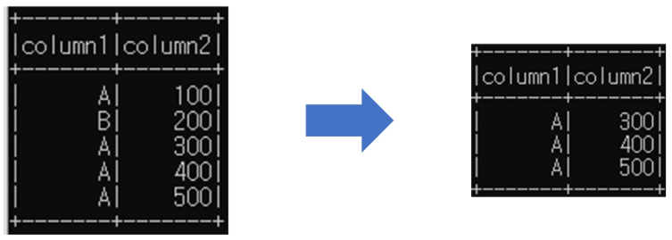

### 조건 필터링(`Filter`) — SQL 코드
```py
# column2의 값이 200 보다 큰 항목만 필터링하여 기록을 유지
# column2 > 200 조건 필터링 (SQL)
spark.sql("""
    SELECT *
    FROM my_table
    WHERE column2 > 200
""").show()
```

### 정렬(`Sort`, `OrderBY`) — DSL 코드
```py
# 단일 컬럼 내림차순
df.sort(df["column1"].desc()).show()

# 다중 컬럼 정렬: column1 오름차순, column2 내림차순
df.orderBy(["column1", "column2"], ascending=[True, False]).show()
```
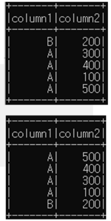

### 정렬(`Sort`, `OrderBY`) — SQL 코드
```py
# 단일 컬럼 내림차순
spark.sql("""
    SELECT *
    FROM my_table
    ORDER BY column1 DESC
""").show()

# 다중 컬럼 정렬: column1 오름차순, column2 내림차순
spark.sql("""
    SELECT *
    FROM my_table
    ORDER BY column1 ASC, column2 DESC
""").show()
```

### 결측값 처리 및 값 치환(Missing & Replacing Values) — DSL 코드
```py
# column1의 NULL → "Unknown", column2의 NULL → 0
df.na.fill({"column1": "Unknown", "column2": 0}).show()

#두 컬럼 중 하나라도 NULL이 있으면 삭제
df.na.drop().show()

# 문자열 값 치환: "A" → "Alpha", "B" → "Beta"
df.na.replace({"A": "Alpha", "B": "Beta"}).show()
```
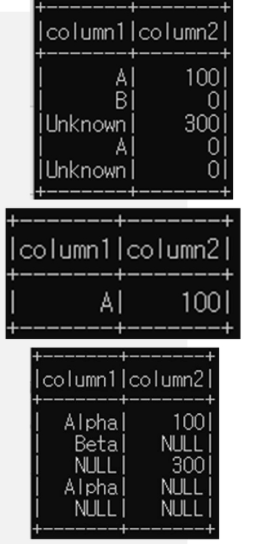

### 결측값 처리 및 값 치환(Missing & Replacing Values) — SQL 코드
```py
# column1 NULL → "Unknown", column2 NULL → 0
spark.sql("""
    SELECT
        COALESCE(column1, 'Unknown') AS column1,
        COALESCE(column2, 0) AS column2
    FROM my_table
""").show()

# 두 컬럼 중 하나라도 NULL이면 삭제
spark.sql("""
    SELECT * 
    FROM my_table
    WHERE column1 IS NOT NULL AND column2 IS NOT NULL
""").show()

# 문자열 값 치환: "A" → "Alpha", "B" → "Beta"
spark.sql("""
    SELECT CASE
        WHEN column1 = 'A' THEN 'Alpha'
        WHEN column1 = 'B' THEN 'Beta'
        ELSE column1
    END AS column1, column2
    FROM my_table
""").show()
```


## Spark Streaming
### Spark Streaming
- `Batch Processing`은 큰 데이터 셋에 대해 한 번의 연산을 수행하는 형태  
- `Streaming Processing`은 끊임없이 들어오는 데이터의 흐름을 연속적으로 처리  
- Batch Processing과 함께 사용하여 서로의 약점을 보완하는 형태로 많이 사용 (Ex. Lambda Architecture)

  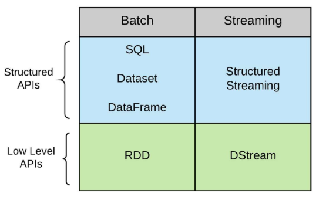

- Spark Streaming
  - DStream API (Low Level APIs) 를 기반으로 하며, 
  - Spark Structured Streaming 은 Structured API (High Level APIs) 를 기반으로 함
- Spark RDD를 기반으로 처리함
  - Input 도 RDD이고 처리하는 데이터도 RDD가 됨
- Micro Batch 모드로 동작함 
- 일정시간동안 새롭게 들어온 데이터를 모아서 한번에 처리하게 됨

  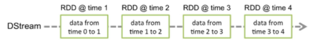

### Spark Structured Streaming
- RDD를 직접 다루지 않고 DataFrame, Dataset API를 사용하는 만큼 더 많은 종류의 스트리밍 최적화 기술을 사용할 수 있음
- 데이터의 Stream을 **무한하게 연속적으로 추가되는 데이터의 테이블** 개념으로 간주
  - row가 무한히 추가됨
  
  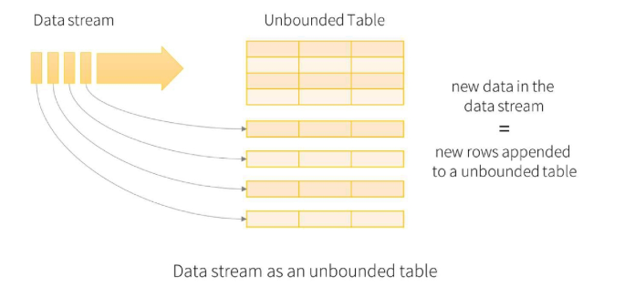
- 기본은 마이크로 배치로 처리하지만, Continuous 모드도 지원(기능 제약이 있어 대부분 마이크로 배치 모드 사용)

- 동작 방식
  - 새로운 단어 데이터가 입력될 때마다 Input Table에 새로운 단어 배열이 append(추가)
  - 실시간으로 들어오는 새로운 데이터가 기존 상태(state)에 누적되어 결과 테이블이 갱신되는 구조

  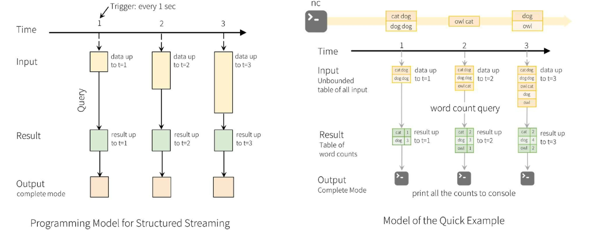


## 실습
### 목표
Kafka 메시지를 Spark로 읽어와 타임스탬프별 메시지 개수 집계

### 실습 전 체크 리스트
- Kafka 실행 중인지 확인 (test-topic 존재)

  ```sh
  kafka/bin/kafka-topics.sh --bootstrap-server localhost:9092 --list
  ```

- Spark 3.5.4 설치
- PySpark 환경 설정 완료
  ```sh
  pip install pyspark==3.5.4
  pip install findspark==2.0.1
  ```

- 필요한 패키지 자동 다운로드됨 (실습 코드에서 `spark.jars.packages` 옵션 사용)

### `spark_producer.py`
Kafka 프로듀서로 다양한 시간대의 타임스탬프를 포함한 메시지들을 생성해서 보내기

```python
from kafka import KafkaProducer
import json
import time
from datetime import datetime, timedelta
import random

# Kafka Producer 생성
producer = KafkaProducer(
    bootstrap_servers=['localhost:9092'],
    value_serializer=lambda v: json.dumps(v).encode('utf-8')
)

# 기준 시간 (현재 시각 기준 -5분)
base_time = datetime.now() - timedelta(minutes=5)

# 메시지 전송
for i in range(30):
    # 0~4분 사이의 임의 시점 생성 (1분 단위 집계를 위해)
    offset_minutes = random.randint(0, 4)
    offset_seconds = random.randint(0, 59)

    msg_time = base_time + timedelta(minutes=offset_minutes, seconds=offset_seconds)
    
    message = {
        'id': i,
        'message': f'테스트 메시지 {i}',
        'timestamp': msg_time.strftime('%Y-%m-%d %H:%M:%S')
    }
    
    # Kafka로 메시지 전송
    producer.send('test-topic', message)
    print(f'전송된 메시지: {message}')
    
    time.sleep(0.5)  # 너무 빠르게 보내지 않도록 살짝 텀 주기

producer.flush()
```

### `spark_kafka_process.py`
Spark 로 타임스탬프 별 집계 처리

```python
from pyspark.sql import SparkSession
from pyspark.sql.functions import col, from_json, window
from pyspark.sql.types import StructType, StructField, TimestampType, StringType
import findspark

findspark.init()

# SparkSession 생성
def create_spark_session():
    return (SparkSession.builder
        .appName("KafkaSparkStreaming")
        .config("spark.jars.packages",
                "org.apache.spark:spark-sql-kafka-0-10_2.12:3.5.0")
        .getOrCreate())

def process_kafka_stream():

    spark = create_spark_session()

    # Kafka 스트림 읽기
    df = (spark
        .readStream
        .format("kafka")
        .option("kafka.bootstrap.servers", "localhost:9092")
        .option("subscribe", "test-topic")
        .option("startingOffsets", "latest")
        .load()
    )

    # Kafka value → 문자열
    value_df = df.selectExpr("CAST(value AS STRING)")

    # JSON 스키마
    schema = StructType([
        StructField("timestamp", TimestampType(), True),
        StructField("message", StringType(), True)
    ])

    # JSON 파싱
    parsed_df = (value_df
        .select(from_json(col("value"), schema).alias("data"))
        .select("data.*")
    )

    # 1분 윈도우 + watermark + count
    result_df = (parsed_df
        .withWatermark("timestamp", "1 minute")
        .groupBy(window("timestamp", "1 minute"))
        .count()
    )

    # 콘솔 출력
    query = (result_df
        .writeStream
        .outputMode("complete")
        .format("console")
        .start()
    )

    query.awaitTermination()

if __name__ == "__main__":
    process_kafka_stream()
```

### 실습 순서
- `spark_producer.py` 실행
- `spark_kafka_process.py` 실행
  - 프린트 되는 집계 결과 확인
- test-topic 에 타임스탬프 잘 생성되어 들어오는지 확인
```sh
bin/kafka-console-consumer.sh --topic test-topic --bootstrap-server localhost:9092 --from-beginning
```

- 결과 예시

  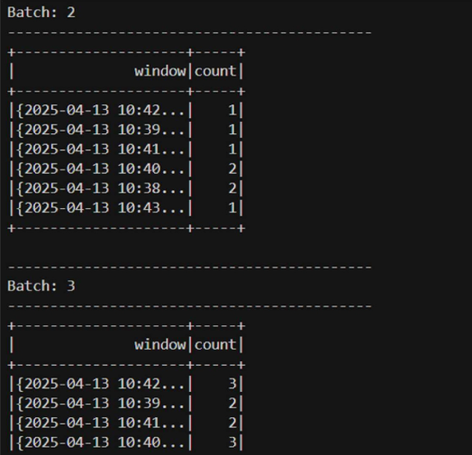

  - test-topic 에 타임스탬프 잘 생성되어 들어오는지 확인

    