# Airflow 기본 구조와 세팅
## 워크플로우 오케스트레이션
### Apache Airflow 개요
- 워크플로우 오케스트레이션
  - 작업(Task)을 정해진 순서에 따라 실행하고 자동화하는 기술
  - 데이터 파이프라인, 머신러닝, CI/CD 등 다양한 분야에서 활용

  - 특징
    - 작업 자동화 → 반복적인 수작업 제거
    - 의존성 관리 → 특정 작업이 완료된 후 다른 작업 실행 가능 (순서 제어 가능)
    - 실패 처리 및 모니터링 → 장애 발생 시 재시도 및 알림 제공
    - 스케줄링 기능 → 특정 시간 또는 이벤트 기반 실행 가능

### Apache Airflow
Python 기반의 데이터 파이프라인 자동화 및 스케줄링 도구

- 배치 프로세스를 효율적으로 관리하는 워크플로우 오케스트레이션 도구
- 다양한 시스템 및 데이터베이스와 통합 가능 (ETL, MLOps, 클라우드 등)

- Apache Airflow 역할
  - 데이터 파이프라인 자동화

    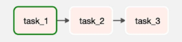
  - DAG(Directed Acyclic Graph)로 작업 정의
    - 모든 작업을 DAG 형태로 정의 가능
    - DAG: 방향성이 있고, 순환하지 않는 그래프
  - 실행 및 장애 관리, 모니터링 기능 제공

- Apache Airflow의 주요 활용 사례
  - Business Operations – 기업의 핵심 비즈니스 데이터 애플리케이션 자동화
  - ETL/ELT – 데이터 파이프라인 구축 및 관리
    - 순서, 의존성 관리 가능
  - Infrastructure Management – 인프라 자동 배포 및 관리
  - MLOps – 머신러닝 모델 개발 및 운영 자동화

### Business Operations
- Airflow를 활용한 기업 비즈니스 운영 자동화
  - 데이터 중심 애플리케이션 및 업무 자동화
  - 정기적인 리포트 생성 및 배포
  - 고객 데이터 파이프라인 및 CRM 연동

### ETL / ELT
- Airflow를 활용한 데이터 파이프라인 구축 및 관리
  - 데이터 수집(Extract), 변환(Transform), 적재(Load) 자동화
  - 여러 데이터 소스를 통합하여 분석 가능
  - Data Warehouse(BigQuery, Snowflake 등)와 연계하여 최적화

    

### Infrastructure Management
- Airflow를 활용한 인프라 배포 및 운영 자동화
  - 클라우드 리소스 자동 프로비저닝 (AWS, GCP, Azure 등)
    - ex. 특정 시간에 컴퓨팅 리소스 자동 생성 
  - CI/CD 파이프라인 자동 실행
    - ex. 빌드 -> 테스트 -> 배포 자동화 (소프트웨어 자체의 배포 자동화)
  - Kubernetes 및 서버 배포 자동화

### MLOps
- Airflow를 활용한 머신러닝 파이프라인 자동화
  - 데이터 수집 → 모델 학습 → 평가 → 배포 과정 자동화
  - 머신러닝 워크플로우 오케스트레이션
  - 모델 재학습 및 모니터링 자동화

### Why Airflow?
- 기존 방식의 한계 (Cron Job, Bash Script)
  - 작업 간 의존성 관리 어려움
  - 장애 발생 시 원인 추적 및 복구 어려움
  - 로그 관리 및 모니터링 부족

- Airflow 도입 시 장점
  - DAG 기반 의존성 관리 → Task 실행 순서 설정 가능
  - Web UI 제공 → 직관적인 모니터링 가능
  - 재시도 및 알림 기능 → 장애 발생 시 자동 대응
  - 확장성 및 유연성 → 다양한 실행 환경 지원

## Apache Airflow 개요 및 아키텍처
### Apache Airflow 특징
- Airflow의 장점
  - Python 기반 → 개발자가 쉽게 접근 가능
  - 강력한 UI 제공 → 직관적인 모니터링 가능
  - 태스크 간 의존성 관리 용이 → DAG 구조 활용
  - 확장성 높음 → 다양한 Executor 지원
  - 장애 복구 기능 제공 → 재시도 및 알림 설정 가능

- Airflow의 단점
  - 초기 설정 및 학습 곡선이 가파름
  - 실시간 데이터 처리에는 적합하지 않음
    - 배치 작업 중심
  - 복잡한 DAG의 경우 성능 튜닝 필요

### Airflow 설치 및 환경세팅
`data_engineering\06_Airflow\01_Airflow_setting.md` 참고


## Airflow 주요 컴포넌트
### DAG
Airflow에서 **작업(Task)들의 실행 순서를 정의**하는 그래프

- **방향성(Directed)** -> 작업이 정해진 순서로 실행됨
- **비순환(Acyclic)** -> 순환(Loop) 구조가 없어 무한 실행 방지

  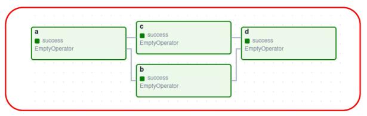

### Task
워크플로우를 구성하는 개별 작업 단위

- ETL, 데이터 변환, 머신러닝 모델 실행, 파일 이동 등의 작업을 수행할 수 있음
- 워크플로우를 구성하는 기본 요소

  

### Airflow 주요 컴포넌트
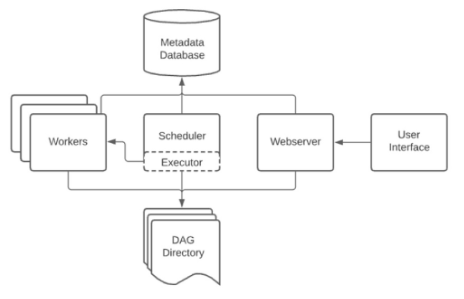
- Scheduler
  - DAG 실행 스케줄 관리
  - DAG 파일 주기적으로 스캔하여 어떤 Task를 실행할지 판단하여 Executor에게 실행 지시
- Executor
  - 태스크 실행 방식(Local, Celery, Kubernetes 등)
    - local: 한 서버에서 병렬로 실행(단일 서버로, CPU 코어 수에 따라 병렬 처리)
    - Celery: 여러 워커 노드에 분산 실행
    - Kubernetes: 각 태스크를 독립적인 Pod로 실행
  - 작업 실행 전략 담당
- Worker
  - 실제 태스크 실행하는 프로세스 (태스크 실행 주체)
- Metadata Database
  - DAG 실행 정보 저장
- Web UI
  - DAG 및 태스크 상태 모니터링

### Dag Directory
- 파이썬으로 작성된 DAG 파일을 저장하는 공간
- dag_folder, dags_folder라고 불림
- 기본적으로 `$AIRFLOW/dags/`로 설정되어 있음
- DAG를 작성한 후 DAG Directory에 저장하면, Airflow Seheduler가 주기적으로 DAG Directory를 스캔한 후 DAG를 파싱함

### Scheduler
DAG 파일을 파싱하고, Task 및 DAG를 모니터링하며 실행을 스케줄링하는 핵심 컴포넌트

- **DAG Run과 Task Instance 상태를 관리**하고 **Executor에게 실행을 요청**하는 역할 수행

  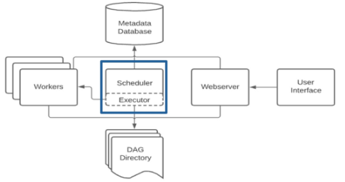

- DAG 파일 처리 과정
  1. DAG 파일 검색 및 로드
  2. DAG 파일 파싱 및 해석
  3. DAG 등록 및 실행 준비

### Executor
Scheduler에서 생성하는 서브 프로세스

- Queue에 들어온 **Task Instance를 실제로 실행**하는 역할

  - 단일 프로세스형 (Single-Process)
    - `Sequential Executor` : 한 번에 하나의 Task만 순차적으로 실행하며, 개발·테스트용으로 사용됨
  - 로컬 병렬형 (Local Multi-Process)
    - `Local Executor` : Scheduler 내부에서 여러 Task를 병렬로 실행할 수 있음 (멀티프로세싱 기반)
  - 분산형 (Distributed)
    - `Celery Executor` : 여러 워커 노드에 Task를 분산 실행하며, 대규모 분산 환경에 적합함
    - `Kubernetes Executor` : 각 Task를 독립적인 Pod로 실행하여 완전한 격리와 자동 확장을 지원

### Meta Database
Airflow의 DAG, DAG Run, Task Instance, Variables, Connections 등 여러 컴포넌트에서 사용해야하는 데이터를 저장함

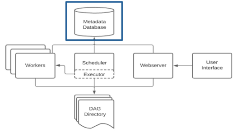
- 상태 추적에 필요한 모든 메타데이터 저장
- 웹 UI를 열었을 때 대부분의 정보가 이 DB에서 조회됨

### Webserver
Meta Database와 통신하며 DAG, DAG Run, Task Instance, Variables, Connections 등의 데이터를 가져와 웹에서 보여주고 유저와 상호작용할 수 있게 함

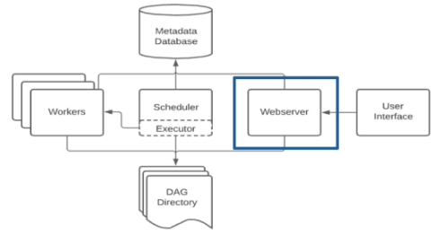

### Basic Deployment
- Airflow가 가장 기본적으로 배포되는 구조

  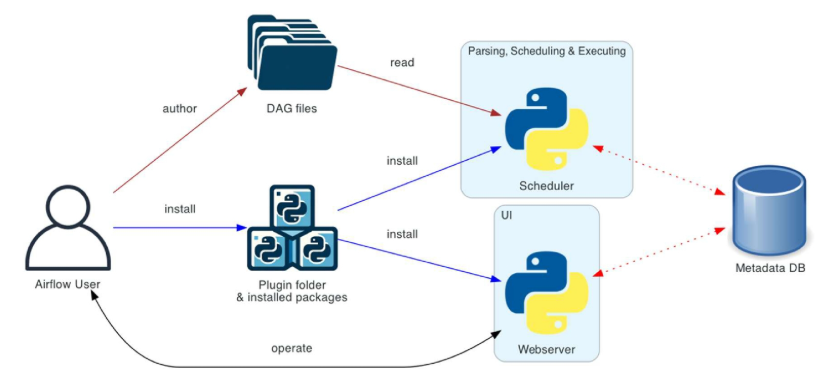
  - 사용자는 python 스크립트로 DAG을 정의(DAG Directory에 저장)
  - Scheduler가 DAG 파일을 주기적으로 스캔하여 실행할 Task를 결정
  - Executor가 Task 실행 요청을 받아 실제로 Task를 실행
  - Metadata Database에 실행 결과 저장
    - ex. 성공/실패/로그 등
    - Scheduler와 Webserver 모두 이 DB와 주고받으며 시스템 상태를 유지함
  - Webserver는 Metadata DB를 조회해 사용자가 볼 수 있는 UI 제공
  - 이때, Airflow 환경에 플러그인이나 Python 패키지를 설치하면 Scheduler와 Webserver 모두 같은 실행 환경을 공유하기 때문에 플러그인 기능이 두 컴포넌트에 동일하게 반영됨

### Distributed Airflow architecture
- 분산형 Executor 구조
  - 워커를 여러 대 운영하여 대규모 작업 처리 가능


  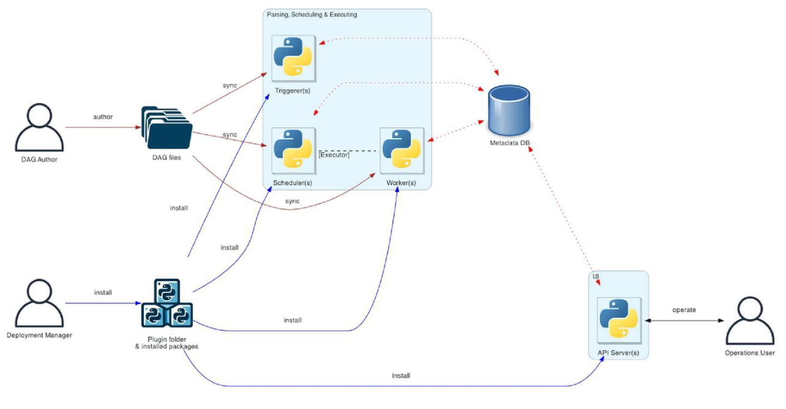
  - Scheduler가 Task를 직접 실행하지 않음 → 실행은 모두 Worker 노드로 분산됨
  - Scheduler는 DAG 파싱 및 Task 스케줄링만 담당하고, 실제 실행은 Worker가 처리
  - Executor(CeleryExecutor, KubernetesExecutor 등)가 스케줄러와 워커 간 작업 전달을 중개
  - Worker가 여러 대 운영되며, 병렬성과 확장성이 대폭 증가
  - Triggerer 프로세스가 도입되어 deferrable operator(대기 기반 작업)를 비동기로 처리
  - Scheduler, Worker, Triggerer는 DAG 파일을 각각 sync하여 동일한 DAG 정의를 공유함
  - API Server를 활용한 운영 기능이 확장되며, 분산 환경에서의 운영과 제어가 더 유연해짐


## DAG 실행
### Airflow Web UI
Airflow Web UI는 DAG 및 Task의 실행 상태를 시각적으로 모니터링하고, DAG 실행을 제어할 수 있는 웹 기반 인터페이스

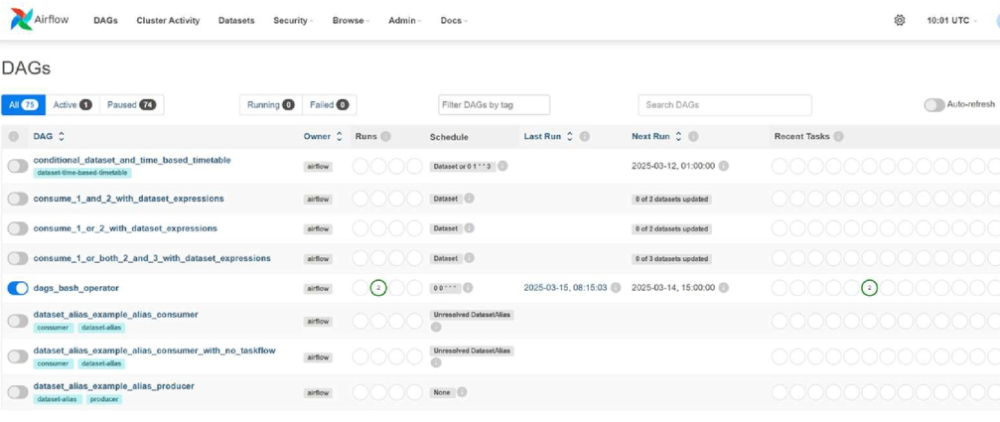
- DAG 및 Task의 실행 상태 확인
- DAG의 수동 실행 및 중지
- Task의 재시도 및 강제 실행
- 실행 로그 확인 및 실패 원인 분석
- DAG 및 Task의 의존성 시각화

### Airflow Web UI 주요 메뉴 구성
- DAGs View
  - 등록된 모든 DAG을 조회할 수 있는 기본 화면
  - DAG 실행 상태(활성, 비활성, 일시정지) 확인 가능
  - 특정 DAG을 클릭하여 세부 정보 확인 가능
  - `Trigger DAG` 버튼을 눌러 DAG을 수동 실행 가능

    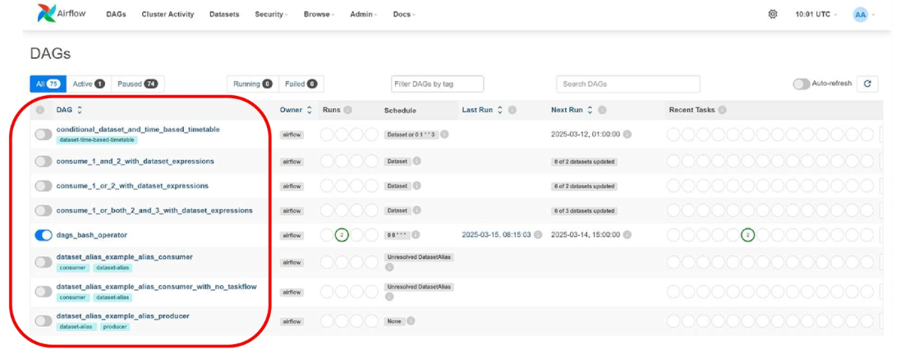

- Graph View(그래프 뷰)
  - DAG 내부의 Task 간 관계를 시각적 그래프로 표현
  - Task들의 의존성(Upstream/Downstream) 구조 확인 가능
  - 각 Task의 실행 상태를 색상으로 구분 (성공, 실패, 진행 중 등)

    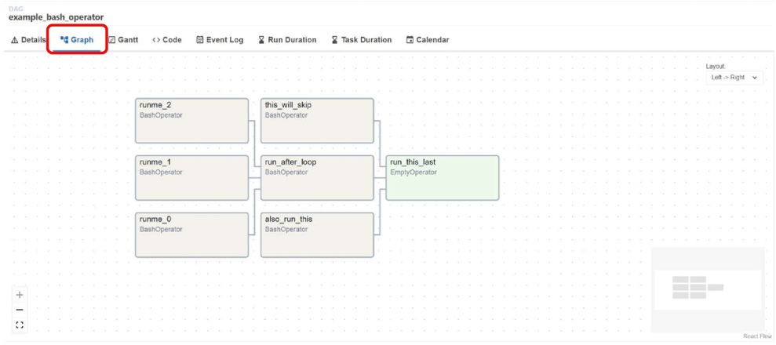

- Tree View(트리 뷰)
  - DAG의 실행 이력을 날짜별 트리 구조로 제공
  - DAG 실행 시 Task가 어떤 상태였는지 기록 확인 가능
  - 특정 실행 날짜의 DAG 상태를 쉽게 추적 가능

    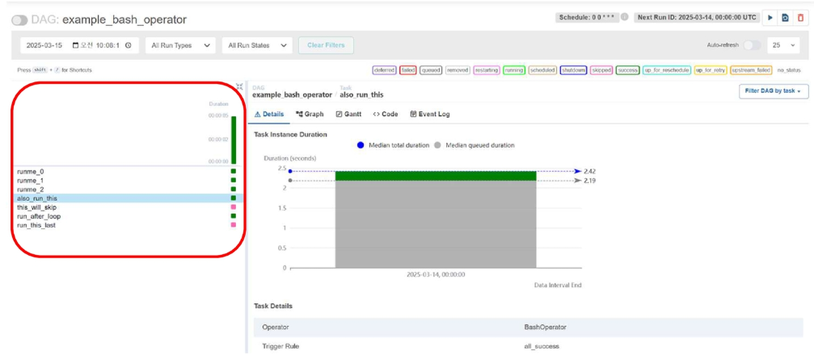

- Task Instance Details(태스크 실행 상세 정보)
  - 특정 Task를 클릭하면 실행 정보와 로그를 확인 가능
    - DAG 실행 시 Task가 어떤 상태였는지 기록 확인 가능
  - 실패한 Task를 다시 실행하거나, 강제로 종료할 수 있음

    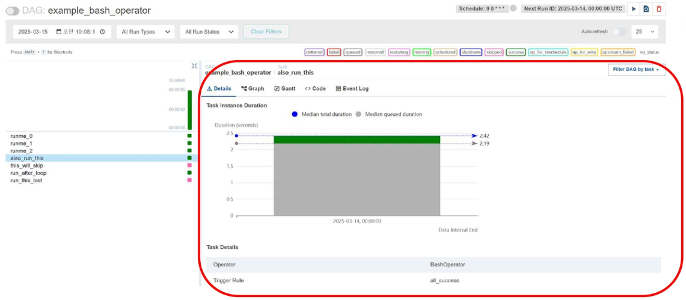

- Gantt Chart (간트 차트)
  - DAG 실행 시 각 Task의 실행 시간을 시각화
  - Task 실행 시간 비교 및 병렬 실행 분석 가능
  - 실행 시간이 오래 걸리는 Task를 찾아 최적화할 수 있음

    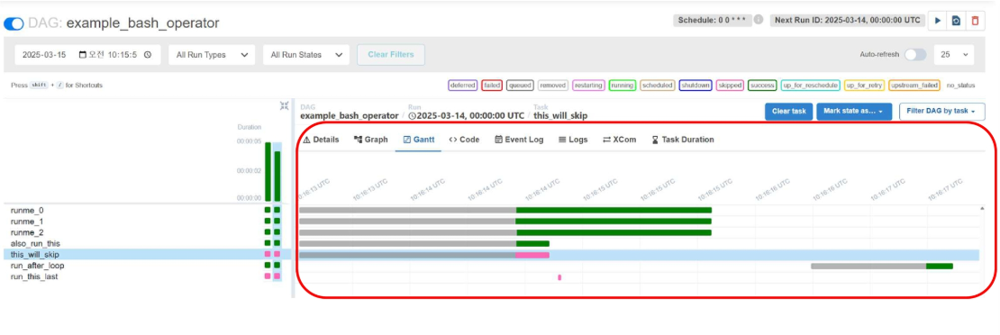

- Code View(코드 뷰)
  - DAG의 소스 코드를 UI에서 직접 확인 가능
  - DAG를 수정하려면 별도의 파일 편집이 필요하지만, UI에서 DAG 정의를 쉽게 검토 가능

    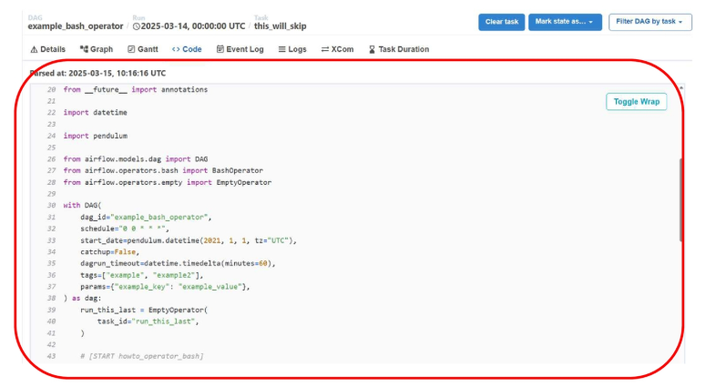

- Log View(로그 뷰)
  - 실행된 Task의 로그를 확인하여 오류 분석 및 디버깅 가능
  - 실패한 Task의 원인을 파악하고, 재시도를 결정하는 데 활용

    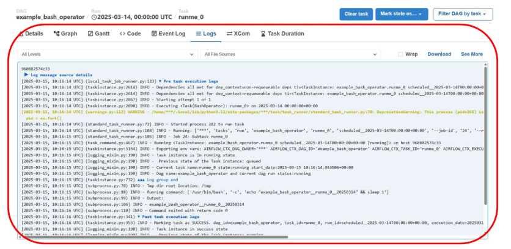

### DAG 실행
- DAG 실행 방법
  - 자동 실행 
    - DAG에 설정된 스케줄(Interval, crom 등)에 따라 실행
  - 수동 실행
    - Web UI 또는 CLI(Command Line Interface)를 통해 즉시 실행
  - 이벤트 기반 실행
    - 특정 트리커(예: API 요청, 파일 업로드 등)로 실행
    
    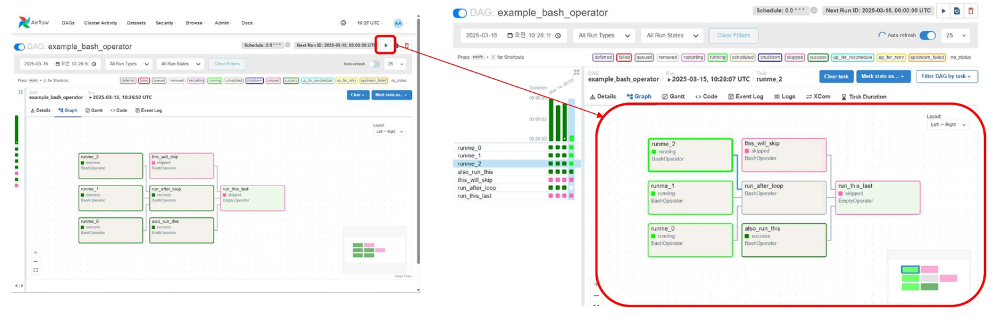


### DAG 및 Task 실행 상태 종류
- Airflow에서는 Task의 실행 상태를 다양한 값으로 나타냄

  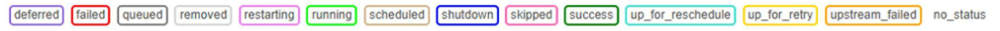

  | Task 상태 | 설명 |
  |----------|------|
  | `deferred` | Task 실행이 특정 이벤트 대기 중 상태 (ex: Sensor 대기) |
  | `failed` | Task 실행이 실패한 상태 (exit 1 또는 예외 발생) |
  | `queued` | Task가 실행을 기다리는 대기열(Queue)에 있는 상태 |
  | `removed` | Task가 DAG에서 삭제된 상태 (일반적으로 UI에서 볼 수 없음) |
  | `restarting` | Task가 재시작 중인 상태 |
  | `running` | Task가 현재 실행 중인 상태 |
  | `scheduled` | Task 실행이 스케줄링되었지만 아직 실행되지 않은 상태 |
  | `shutdown` | Task 실행 중지됨 (Airflow 시스템 종료 또는 강제 중지) |
  | `skipped` | Task가 실행되지 않고 건너뛰어진 상태 (ex: Branching 조건) |
  | `success` | Task가 정상적으로 완료된 상태 |
  | `up_for_reschedule` | Sensor가 일정 시간마다 재실행 대기 중인 상태 |
  | `up_for_retry` | Task가 실패했지만, 재시도(Retry) 대기 중인 상태 |
  | `upstream_failed` | 이전(Upstream) Task가 실패하여 실행되지 않은 상태 |
  | `no_status` | Task에 대한 실행 정보가 없는 상태 (아직 실행된 적 없음) |

### Airflow 스케줄링
- Schedule
  - DAG를 실행하는 주기를 설정하는 방식  
- Schedule interval
  - DAG이 실행되는 시간 간격을 결정하는 속성

- 스케줄 설정 예시

  ```py
  dag = DAG(
      dag_id="example_schedule",
      start_date=datetime(2025, 3, 1),
      schedule_interval="0 6 * * *",  # 매일 오전 6시 실행
      catchup=False
  )
  ```
  | 설정 방식 | 설명 | 예제 |
  |-----------|------|------|
  | None | DAG이 자동 실행되지 않음 (수동 실행만 가능) | `schedule_interval=None` |
  | 예약어 사용 | 실행 주기를 간단히 지정 | `@daily` (매일), `@hourly` (매시간) |
  | Cron 표현식 사용 | 세부적인 실행 주기 설정 가능 | `"0 9 * * *"` (매일 오전 9시 실행) |
  | Timedelta 사용 | 특정 시간 간격마다 실행 | `schedule_interval=timedelta(hours=6)` |

### DAG 디렉토리 설정
- DAG 파일 생성 및 경로 수정
  - dags 폴더를 생성하고, 하위에 `dags_bash_operator.py` 파일 생성

    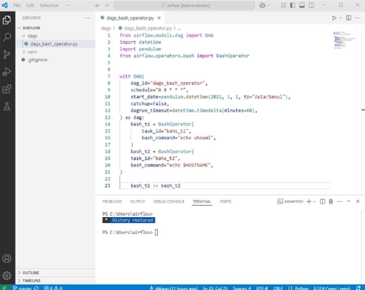
  - Airflow 컨테이너에서 로컬 디렉토리를 활용하기 위한 볼륨 마운팅 작업  
  - `docker-compose.yaml` 수정

    ```yaml
    volumes:
      - ${AIRFLOW_PROJ_DIR:-.}/airflow/dags:/opt/airflow/dags
      - ${AIRFLOW_PROJ_DIR:-.}/logs:/opt/airflow/logs
      - ${AIRFLOW_PROJ_DIR:-.}/config:/opt/airflow/config
      - ${AIRFLOW_PROJ_DIR:-.}/plugins:/opt/airflow/plugins
    user: "${AIRFLOW_UID:-50000}:0"
    ```
    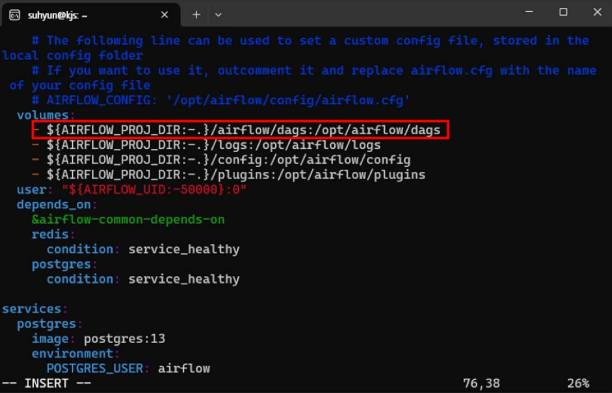

- 선행 단계를 완료한 후 Airflow 웹 UI에서 `dags_bash_operator` 파일이 업로드 되었는지 확인

  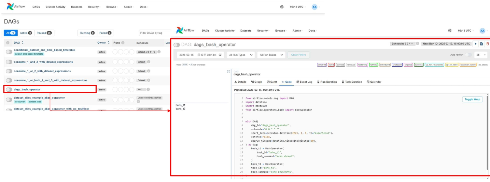


