# Airflow DAG 기초 및 Task 연결
## Airflow DAG 기본 구조
### Task LifeCycle
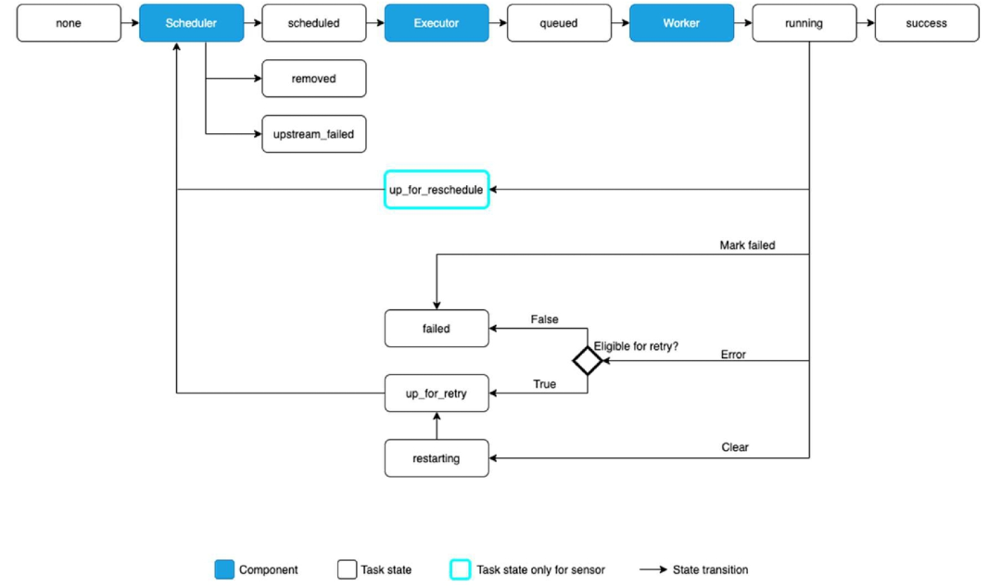
- Task는 여러 상태(State)를 가짐
    - `None` : 초기 상태
        - DAG에만 존재할 뿐 실행되지 않은 상태
    - `Scheduled` : 실행 대기 상태
        - 스케줄러가 DAG를 감지하고, Task 실행 대기 중인 상태
    - `Queued` : 실행 준비 상태
        - Executor가 Task를 받아서 실행 queue에 넣은 상태
    - `Running` : 현재 실행 중인 상태
        - worker가 Task를 실제로 실행하는 상태
        - log가 생성되기 시작함
    - `Success` : 정상 완료 상태
    - `Failed` : 실패 상태
        - 재시도 횟수에 따라 재실행될 수 있음
    - `Up_for_retry` : 재시도 대기 상태
        - Task가 실패했지만, 재시도 설정이 되어 있어 재실행 대기 중인 상태
    - `Up_for_reschedule` : 재스케줄 대기 상태
        - Sensor Task가 조건을 만족하지 못해 재스케줄 대기 중인 상태
    - `Removed` : 삭제 상태
        - Task가 DAG에서 제거된 상태
        - 스케줄링 대기하던 Task가 삭제됐을 때 나타남
    - `Upstream_failed` : 상위 Task 실패 상태
        - 이전 Task가 실패하여 실행되지 않은 상태(선행 Task 실패로 인해 실행되지 않음)

### DAG(Directed Acyclic Graph)
Airflow에서 Task 간 실행 순서를 정의하는 핵심 구조

- DAG는 방향성(Directed)과 비순환(Acyclic) 특성을 가짐
- `Directed` : Task들의 정해진 순서대로 실행됨
- `Acyclic` : Task간 순환(Loop)이 없어 무한 실행 방지

    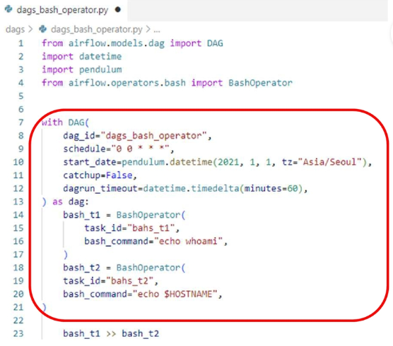
    - DAG 선언 예시
        - DAG 객체 생성
        - 내부에 Task 정의 및 의존성 설정(순서 정의)

### Task
Task는 DAG 내에서 실행되는 개별 작업 단위

- 특정 연산을 수행하는 Operator를 사용하여 정의(`BashOperator`, `PythonOperator`, `SQLExecuteOperator`, ..)
    - Operator: Task가 수행할 작업의 유형을 정의하는 클래스
    - `BashOperator` : Bash 명령어 실행
    - `PythonOperator` : Python 함수 실행
    - `SQLExecuteOperator` : SQL 쿼리 실행
    - `EmailOperator` : 이메일 전송

- DAG 내에서 하나의 노드(Node)로 존재하며, 특정한 작업(데이터 처리, API 호출, SQL 실행 등)을 수행
- Task는 **서로 의존성을 설정**하여, 순차적 실행(Sequential) 또는 병렬 실행(Parellel)이 가능함
- **재시도(Retry) 및 실행 시간 제한** 설정 가능

### Airflow Workflow
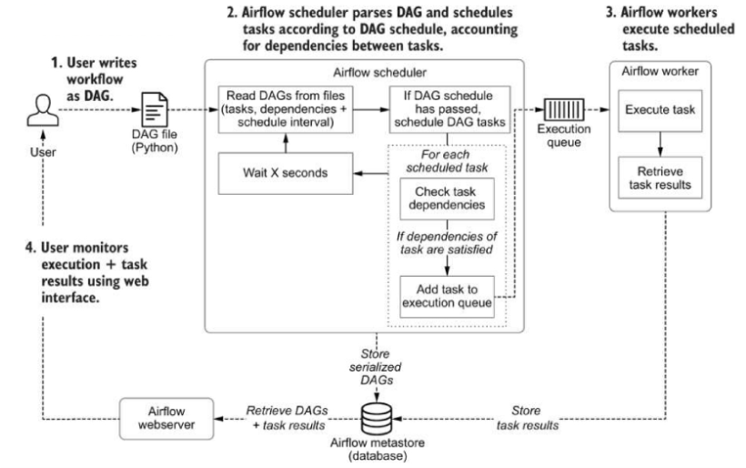

### Task 주요 속성
| 속성 | 설명 |
|------|------|
| `task_id` | Task의 고유 식별자 (DAG 내에서 유일해야 함) |
| `operator` | Task가 수행할 작업을 정의 (BashOperator, PythonOperator 등) |
| `depends_on_past` | 이전 실행 결과에 따라 Task 실행 여부 결정 |
| retries | Task 실패 시 재시도 횟수 설정 (기본값: 0) |
| `execution_timeout` | Task 실행 시간 제한 설정 (지정된 시간 내 미완료 시 실패 처리) |
| `start_date` | DAG 실행 시작 날짜 및 시간 설정 |
| `end_date` | DAG 실행 종료 날짜 및 시간 설정 |
| `schedule_interval` | Task 실행 주기 설정 (예: `@daily`, `@hourly`, `0 12 * * *`) |
| `priority_weight` | Task의 실행 우선순위 설정 (높을수록 우선 실행) |
| `task_concurrency` | 특정 Task의 병렬 실행 가능 개수 제한 |


## Operator
### 오퍼레이터(Operator)
Airflow에서 Task를 실행하는 역할을 수행하는 객체
- 즉, `Task = Operator의 구체적인 실행 인스턴스`
- DAG 내에서 개별 Task로 사용되며, 다양한 실행 방식을 제공
- Python 기반으로 확장 가능하며, 기본 제공(내장) 오퍼레이터와 사용자 정의 오퍼레이터가 있음

### 오퍼레이터(Operator) 종류
| 오퍼레이터 종류 | 설명 | 예제 |
|----------------|------|------|
| Action Operators <br>(기본 실행 오퍼레이터) | 특정 동작을 수행하는 오퍼레이터 | `PythonOperator`, `BashOperator`, `EmailOperator` |
| Sensor Operators <br>(센서 오퍼레이터) | 특정 이벤트를 감지할 때까지 대기 | `FileSensor`, `HttpSensor`, `S3KeySensor` |
| Transfer Operators <br>(데이터 전송 오퍼레이터) | 한 위치에서 다른 위치로 데이터를 이동 | `S3ToGCSOperator`, `MySQLToGCSOperator` |
| Database Operators <br>(데이터베이스 관련 오퍼레이터) | DB에서 SQL을 실행하는 오퍼레이터 | `PostgresOperator`, `MysqlOperator`, `SnowflakeOperator` |
| Big Data & ML Operators <br>(빅데이터 & 머신러닝 오퍼레이터) | Spark, Hive, Dataproc, ML 관련 오퍼레이터 | `SparkSubmitOperator`, `DataflowOperator` |
| Docker & Kubernetes Operators | 컨테이너 환경에서 실행 | `DockerOperator`, `KubernetesPodOperator` |
| Empty Operators | Task 흐름을 설정하는 데 사용 | `DummyOperator`(Empty Operator) |

### Action Operators
Task는 특정 오퍼레이터를 기반으로 정의됨
- `BashOperator` → Bash 명령어 실행
- `PythonOperator` → Python 함수 실행
- `EmailOperator` → 이메일 전송

-> 각 오퍼레이터를 조합하여 다양한 워크플로우를 구성할 수 있음

- BashOperator
    - Bash 명령어를 실행하는 Task를 정의할 때 사용됨

        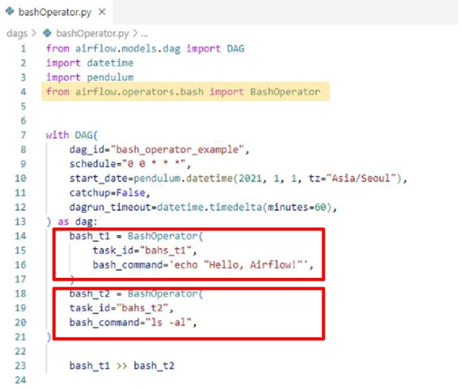
        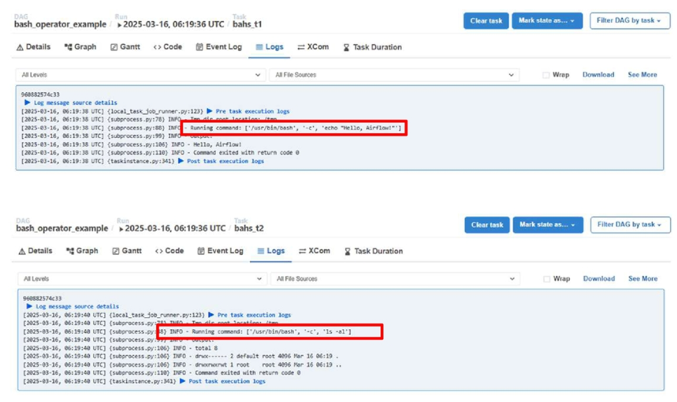
        - task_id 속성에 Task 고유 식별자 지정
        - bash_command 속성에 실행할 쉘 명령어 지정
    
    - BashOperator로 컨테이너 외부의 셸 스크립트 수행
        - shell script 만들고, 해당 파일 권한 설정 변경 

            
            - `chmod +x select_fruit.sh` 명령어로 실행 권한 부여
            - 실행 파일은 반드시 권한이 있어야 Airflow에서 실행 가능

        - `docker-compose.yaml` 파일에서 volumes의 plugins 경로를 실제 파일 경로로 수정

            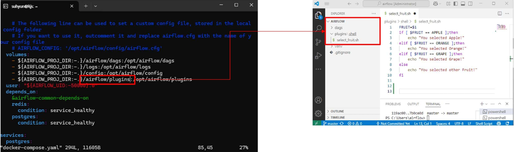

        - 쉘 스크립트 수행 dag 생성 

            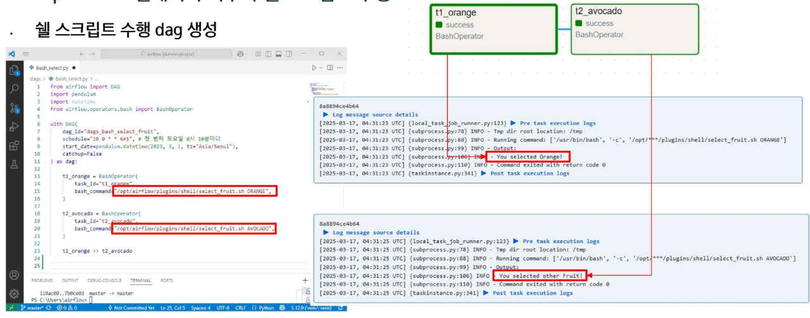

- EmailOperator
    - 이메일 전송해주는 오퍼레이터
        ```py
        Email_t1 = emailOperator(
            task_id='email_t1',
            to='email.gmail.com',
            subject='Airflow 처리결과',
            html_contents='정상 처리되었습니다.<br/>'
        )
        ```
        - emailOperator 속성
            - `to` : 수신자 이메일 주소
            - `subject` : 이메일 제목
            - `html_contents` : 이메일 본문 (HTML 형식 가능)
        - 이메일 전송을 위해 사전 셋팅 작업 필요
    
    - 사전 설정 작업(Google)
        - 구글 메일 서버 사용
        - G-mail → 설정 → 모든 설정보기 → 전달 및 POP/IMAP → IMAP 사용

            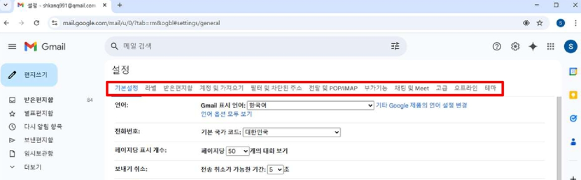
        - 구글 계정관리 → 보안 → 2단계 인증 → 앱비밀번호 셋팅

            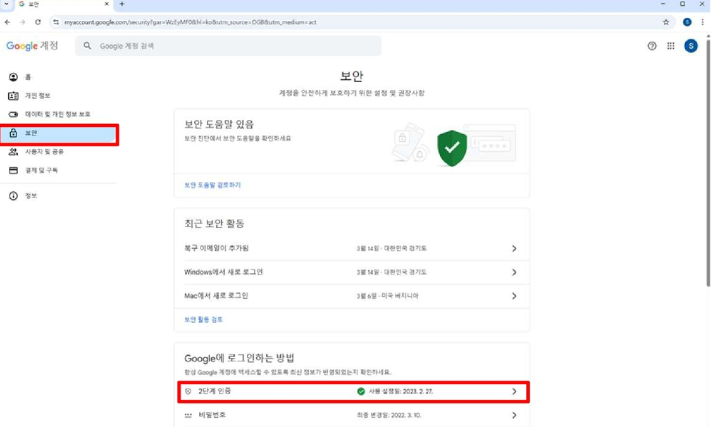
            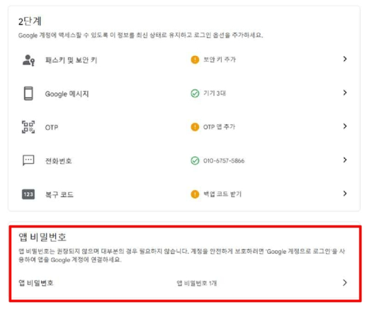
            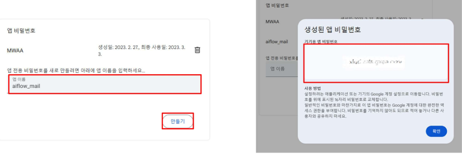

    - `Docker-compose.yaml` 편집(environment 항목에 추가)

        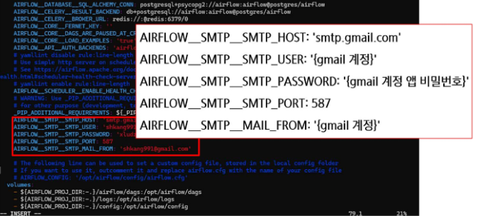
        - `AIRFLOW__SMTP__SMTP_HOST: 'smtp.gmail.com'`
        - `AIRFLOW__SMTP__SMTP_USER: '{gmail 계정}'`
        - `AIRFLOW__SMTP__SMTP_PASSWORD: '{gmail 계정 앱 비밀번호}'`
        - `AIRFLOW__SMTP__SMTP_PORT: 587`
        - `AIRFLOW__SMTP__MAIL_FROM: '{gmail 계정}'`

    - EmailOperator - 이메일 전송 결과

        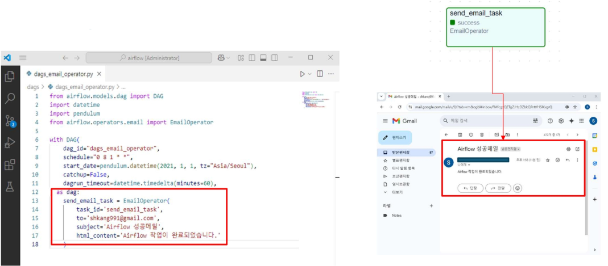

- PythonOperator
    - Python 함수를 실행하는 기능

        ```py
        #함수 정의
        def my_function():
            print("Hello, Airflow")

        python_t1 = pythonOperator(
            task_id='python_t1',
            python_callable=my_function
        )
        ```
        - pythonOperator 속성
            - `python_callable` : 실행할 Python 함수 지정

        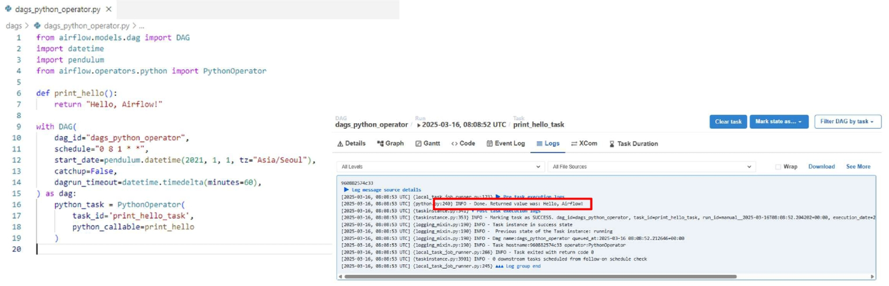

- EmptyOperator
    - Task 실행 없이 DAG 구조를 설정하는데 사용됨
    - DAG의 논리적 흐름을 구성하는 용도로 활용 (아무 작업도 수행하지 않음)

        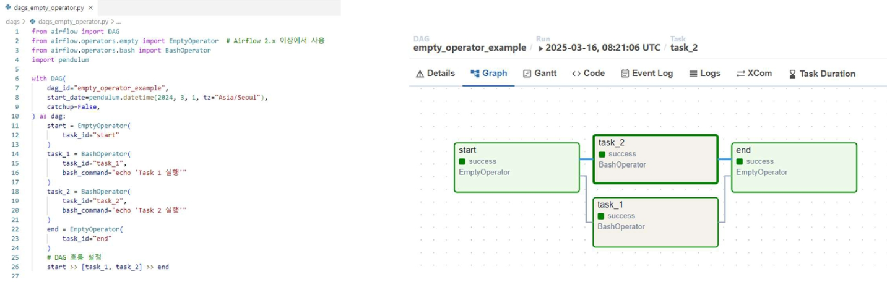
        - start와 end Task를 DummyOperator로 정의하여 DAG의 시작과 끝을 명확히 표시
        - 병렬로 실행되는 Task들을 그룹화하여 가독성 향상


## DAG Scheduling 및 Trigger
### DAG 내 Task 간 의존성(Dependency)
- Airflow에서는 DAG 내에서 Task 간 실행 순서(의존성)를 정의해야 함
- Task 간 의존성을 설정하면 특정 Task가 완료된 후 다음 Task가 실행됨
- 연산자(`>>`) 또는 (`<<`)를 활용하여 Task 간 의존성을 설정

### Task 연결 원리
- DAG 내에서 Task 의존성(Dependency)을 설정하여 실행 순서를 설정함
- Task 간의 실행 관계를 명확하게 지정해야 DAG 올바르게 동작함
- Task 연결 방식은 순차 실행(Sequential Execution), 병렬 실행(Parallel Execution)으로 나뉨

    | 종류 | 설명 |
    |------|------|
    | Upstream Task | 현재 Task 이전에 실행되는 Task |
    | Downstream Task | 현재 Task 이후에 실행되는 Task |
    | Linear Dependency | 순차적으로 Task를 실행 (Task A → Task B → Task C) |
    | Branching | 특정 조건에 따라 Task 실행 흐름을 분기 |
    | Parallel Execution | 여러 Task를 병렬로 실행 |

### 기본 연결(순차 실행)
- `task_1 >> task_2`
    - task_1이 완료된 후 task_2 실행  

    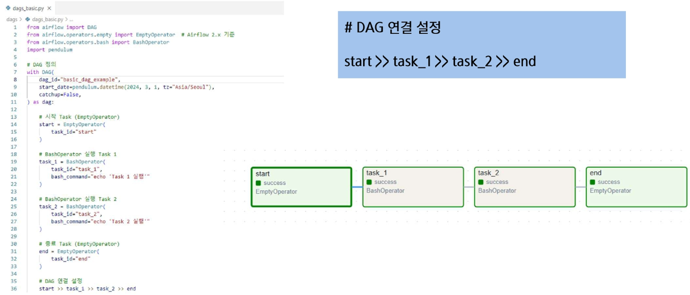

### 다중 Task 연결(병렬 실행)
```
start >> [task_1, task_2]
[task_1, task_2] >> task_3
task_3 >> [task_4, task_5]
[task_4, task_5] >> end
```
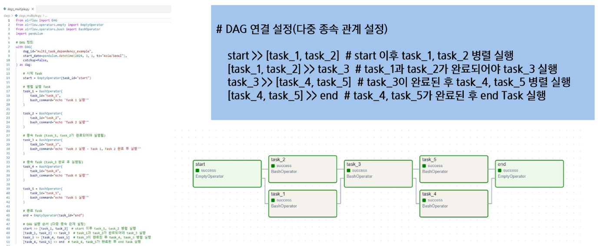

### 다중 Task 조속 단계
- 병렬적으로 분기 및 JOIN 단계 설정 가능

    ```
    # DAG 연결 설정(start → 병렬 실행 → end):

    start >> [task_1, task_2, task_3] >> end
    ```
    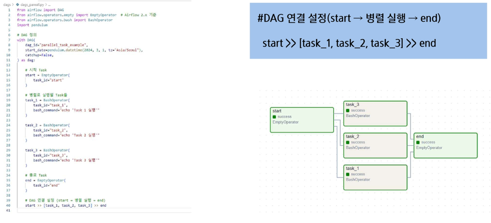

### Trigger Rule(트리거 규칙)
Task가 실행되기 위한 조건을 설정하는 기능

- 어떤 조건에서 Task가 실행될지를 정의
- 기본적으로 모든 Upstream Task가 성공해야 실행됨(all_success)
- 특정 Task의 실행 결과에 따라 실행 조건을 다르게 설정할 수 있음

    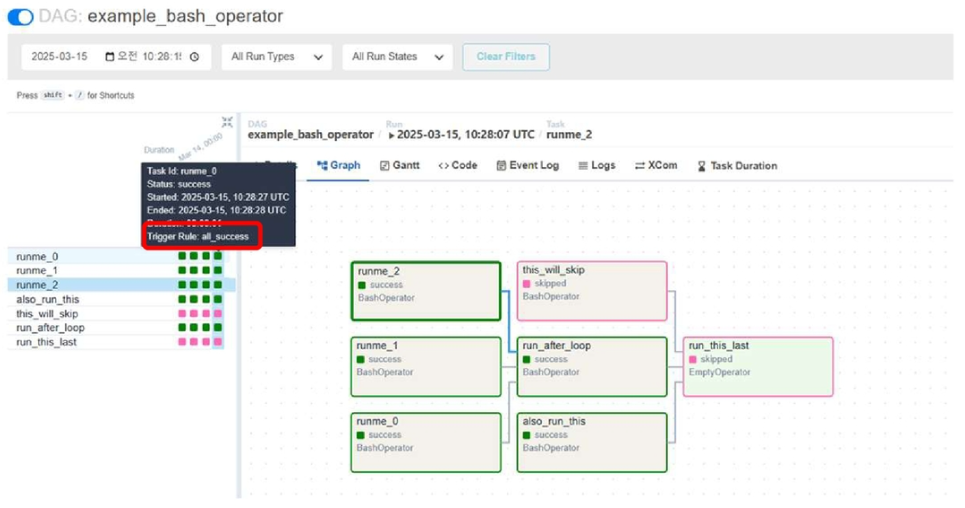

- Trigger Rule(트리거 규칙)

    | Trigger Rule | 설명 |
    |--------------|------|
    | all_success (기본값) | 모든 Upstream Task가 성공(Success) 시 실행 |
    | all_failed | 모든 Upstream Task가 실패(Fail) 시 실행 |
    | all_done | 모든 Upstream Task가 성공, 실패, 스킵 여부와 관계없이 실행 |
    | one_failed | 최소 1개의 Upstream Task가 실패하면 실행 |
    | one_success | 최소 1개의 Upstream Task가 성공하면 실행 |
    | none_failed | Upstream Task 중 실패가 없는 경우 실행 (성공 또는 스킵) |
    | none_failed_or_skipped | Upstream Task 중 실패와 스킵이 없는 경우 실행 (모두 성공) |
    | none_skipped | Upstream Task가 스킵되지 않았다면 실행 |

- Trigger Rule(트리거 규칙) 예시

    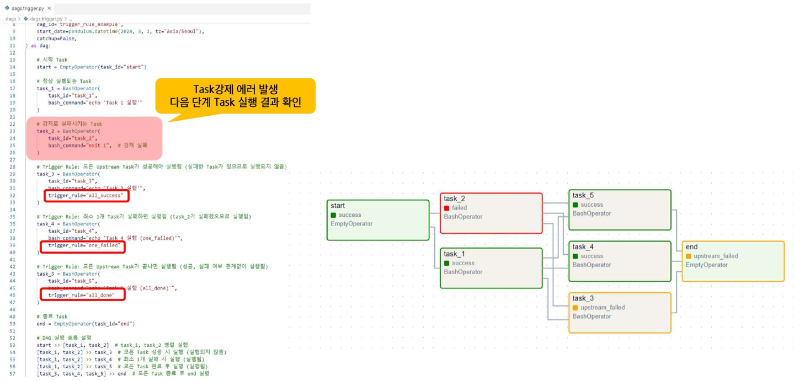
    - Task3은 Task1과 Task2가 모두 성공해야 실행(all_success)
        - 그러나, Task2가 실패했으므로 Task3은 실행되지 않음
    - Task4는 Task1 또는 Task2 중 하나가 실패하면 실행(one_failed)
        - Task2가 실패했으므로 Task4는 실행됨
    - Task5는 Task1과 Task2가 모두 완료되면 실행(all_done)
        - Task1은 성공, Task2는 실패했지만 둘 다 완료되었으므로 Task5는 실행됨


## Cron 스케줄링 및 Task 연결
### DAG 스케줄
DAG 실행을 이해하려면 Airflow의 `start_date`, `logical_date`, `schedule_interval`, `data_interval` 등의 시간 개념을 정확히 이해해야 함

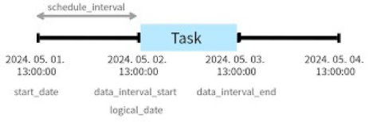

### start_date
**DAG이 처리하기 시작할 데이터의 기준 시점**
- 첫 번째 data_interval의 시작점을 정의함  
- DAG은 start_date 직후에 실행되지 않고, 해당 구간이 끝난 후에 처음 실행됨  
- ex. `start_date = 2025-01-01` → 첫 실행은 `2025-01-02 00:00`에 발생  
- 주의
    - start_date는 **미래 시점으로 설정하지 말아야** 하며, 미래 시점으로 설정하면 DAG이 예상대로 실행되지 않을 수 있음  

### logical date
- **각 DAG run을 식별하는 논리적 날짜**
    - 어떤 날짜에 데이터를 처리하는지를 나타냄  
- data_interval_start와 동일하며, 어떤 데이터를 처리하는 run인지 나타냄  
- 실제 실행 시간과는 다름
- ex. `logical_date=1월1일` → 실행은 `1월2일 00:00 이후`
- logical date 예시
    - DAG가 매일 실행되는 경우 : `Schedule_interval = “@daily”`

        | Logical Date | DAG이 실행되는 실제 시간(run_at) |
        |--------------|----------------------------------|
        | 2025-03-01   | 2025-03-02 00:00:00              |
        | 2025-03-02   | 2025-03-03 00:00:00              |
        | 2025-03-03   | 2025-03-04 00:00:00              |

    - Logical Date가 2025-03-01이면, DAG는 2025-03-02에 실행됨  
    - 항상 Logical Date보다 늦게 실행되므로 데이터 정합성을 유지하는데 중요함  
    - 즉, 데이터가 모두 적재된 이후에 실행되므로 데이터 정합성을 보장  

### schedule_interval(스케줄 간격)
- **DAG이 실행되는 주기를 결정하는 설정값**  
    - DAG이 얼마나 자주 실행될지를 정의하는 간격  
    - Cron 표현식 또는 예약어를 사용하여 주기를 정의  
    - DAG 실행 주기가 DAG의 Execution Date를 결정함  

- Schedule_interval 설정 방법

    | 설정 값      | 설명 |
    |--------------|------|
    | `None`         | 수동 실행 (자동 실행 없음) |
    | `@once`        | DAG을 한 번만 실행 |
    | `@hourly`      | 매시간 실행 |
    | `@daily`       | 매일 자정(00:00)에 실행 |
    | `@weekly`      | 매주 일요일 00:00 실행 |
    | `@monthly`     | 매월 1일 00:00 실행 |
    | `@yearly`      | 매년 1월 1일 00:00 실행 |
    | `"0 12 * * *"` | 매일 12시 정각 실행 (cron 표현식 사용 가능) |

    - Cron 표현식을 사용하여 맞춤형 실행 주기 설정 가능  
    - `Schedule_interval=None` 설정 시 DAG는 자동 실행되지 않음  

### Cron Schedule 표현
```
{분}{시}{일}{월}{요일*}
```
- `30 5 * * *` : 매일 05시 30분  
- `0 * * * *` : 매시 정각  
- `1 * * * *` : 매시 1분  
- `0 0 10 * *` : 매월 10일 0시 0분  
- `30 9 * * 0` : 매주 일요일 09시 30분  
- `*/5 * * * *` : 5분마다  
- `5 9 * * 1-5` : 월요일부터 금요일까지 09시 5분에 배치  
- `0 9-15/1 * * *` : 09시부터 15시까지 1시간마다  
- `30 23 L * *` : 매월 마지막 날 23시 30분에 배치  
- `0 9 * * 3#4` : 매월 4번째 수요일 9시 0분에 배치  

※ Cron 표현은 logical date 기준으로 해석됨에 유의하기

### 빈도 설정
- cron 식은 특정 빈도로 스케줄을 정의할 수 없음(3일에 한 번 실행 등)  
- **timedelta 인스턴스를 사용해 빈도 기반 스케줄을 정의**  

    ```py
    dag = DAG(
        dag_id="run_every_3_days_timedelta",
        start_date=datetime(2025, 3, 1),
        schedule_interval=timedelta(days=3),  # 정확히 3일 간격으로 실행
        catchup=False
    )
    ```

### Backfill
특정 과거 Execution Date에 대해 DAG을 수동 실행하여 데이터를 복구하는 작업  
- 과거 실행이 누락되었거나, 데이터 오류가 발생했을 때 필요  
- `airflow dags backfill` 명령어를 사용하여 특정 날짜 범위의 DAG 실행 가능  

```sh
airflow dags backfill -s 2025-08-11 -e 2025-08-14 example_dag

# -s : 시작 날짜
# -e : 종료 날짜
# example_dag : 대상 DAG ID
```

### Catchup
DAG 시작 날짜(start_date) 이후 누락된 실행을 보완하기 위해 과거의 Execution Date를 채우는 기능  
- `Catchup=True` 설정 시, 과거 미실행 DAG를 자동으로 실행하여 누락된 데이터를 처리  
- `catchup=False` 설정 시, DAG 가장 최신 실행 시간부터만 실행됨 
    
    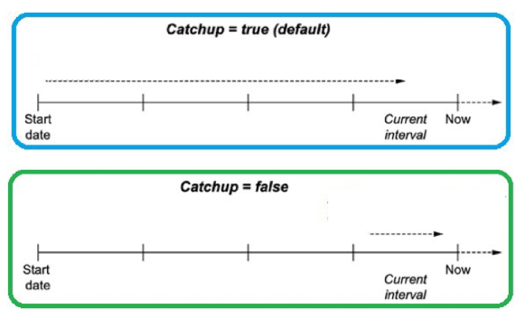
    - ex. `start_date=2025-01-01`, `schedule_interval='@daily'`인 DAG가 있다고 가정
        - 1월5일에 DAG를 처음 실행할 경우
        - catchup=True : 1월1일부터 1월5일까지 누락된 실행 모두 수행
        - catchup=False : 1월5일 실행만 수행

### 수동 실행 vs 자동 실행
DAG이 얼마나 자주 실행될지를 정의하는 간격  

- 자동 실행
    - 스케줄러가 주기적으로 워크플로우를 관리 → 안정적 운영 중심  
- 수동 실행
    - 운영자나 개발자가 직접 트리거 → 테스트, 장애 복구, 백필 등에 활용  
- 수동 실행 시에도 logical_date는 존재하나, 스케줄 기반 계산이 아니므로 데이터 기준 구간과 어긋날 수 있음  

    | 구분 | 자동 실행(Scheduler 기반) | 수동 실행(Manual Trigger) |
    |------|---------------------------|---------------------------|
    | 실행 시점 | data_interval이 끝난 후 자동 실행 | 사용자가 즉시 실행 |
    | Logical Date | 스케줄에 따라 자동 계산 | 트리거 시각 |
    | Data Interval | 스케줄에 따라 자동 생성 | 현재 시각 중심 |
    | 데이터 정합성 | 보장됨 | 깨질 수 있음 |
    | 활용 목적 | 정기 워크플로우 운영 | 테스트, 백필 등 |
    | 명령 방식 | Airflow Scheduler 자동 실행 | airflow dags trigger 또는 web UI |

