# Airflow DAG 작성 및 데이터 공유
## XCom과 Variable
### XCom (Cross-Communication)
Airflow에서 **Task 간 데이터를 주고 받기** 위한 기능  

- 각 **Task가 독립적으로 실행**되기 때문에, Task 간 데이터 공유를 위해 XCom을 활용  
    - 즉, 한 Task에서의 결과를 다른 Task가 직접 참조할 수 없는 구조이므로, XCom을 통해 데이터를 전달

- XCom 주요 특징
    - DAG Run 내에서만 존재하며, 다른 DAG Run과는 공유되지 않음  
    - DataFrame과 같은 대용량 데이터는 지원하지 않으며, 주로 **문자열, 숫자 등 작은 크기의 데이터**를 공유함  
    - PythonOperator를 사용할 경우, 해당 함수의 return 값이 자동으로 XCom에 등록됨  

### XCom을 활용한 데이터 전달 원리
- XCom 데이터 저장(xcom_push)  
    - Task 실행 중 데이터를 저장할 때 사용  
    - `task_instance.xcom_push(key, value)`를 사용하여 특정 키로 값 저장

        ```py
        def push_xcom_value(**kwargs):
            kwargs['ti'].xcom_push(key='message', value='Hello from push_task')
        ```
        - Key-Value 형식으로 저장됨  
        - 해당 DAG의 실행 내에서만 사용 가능 (DAG Run 단위)
        - kwargs['ti']는 TaskInstance 객체를 의미하며, 이를 통해 XCom에 접근 가능

- XCom 데이터 조회(xcom_pull)  
    - Task 실행 시 이전 Task에서 저장한 데이터를 가져올 때 사용  
    - `task_instance.xcom_pull(task_ids, key)`를 사용하여 특정 Task의 데이터를 가져옴  

        ```py
        def pull_xcom_value(**kwargs):
            message = kwargs['ti'].xcom_pull(task_ids='push_task', key='message')
            print("XCom에서 받은 값:", message)
        ```
        - Task 실행 시, 특정 task_id에서 저장한 데이터를 가져옴 
        - task_ids는 데이터를 가져올 Task의 ID를 지정
        - key는 저장할 때 사용한 키와 동일해야 함
    
### XCom 사용 방법
- PythonOperator `Return` 값을 이용한 XCom
- Push-pull을 이용한 XCom  
    - `xcom_push()`와 `xcom_pull()` 메서드 사용
- Jinja template을 이용한 XCom  
    - 템플릿 엔진을 통해 Task 내의 파라미터 중 `{{ ti.xcom_pull(...) }}` 형태로 사용하여 동적으로 값을 생성하는 
- `@task` 데코레이터 사용 시 반환값으로 자동 XCom 저장  

### PythonOperator with XCom
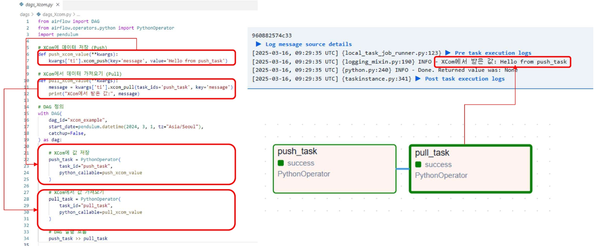
- 명시적으로 push, pull 메서드를 사용하여 XCom 데이터 전달

    ```py
    # Push Task
    kwargs['ti'].xcom_push(key='message', value='Hello from push_task')

    # Pull Task
    message = kwargs['ti'].xcom_pull(task_ids='push_task', key='message')
    ```

### BashOperator with XCom
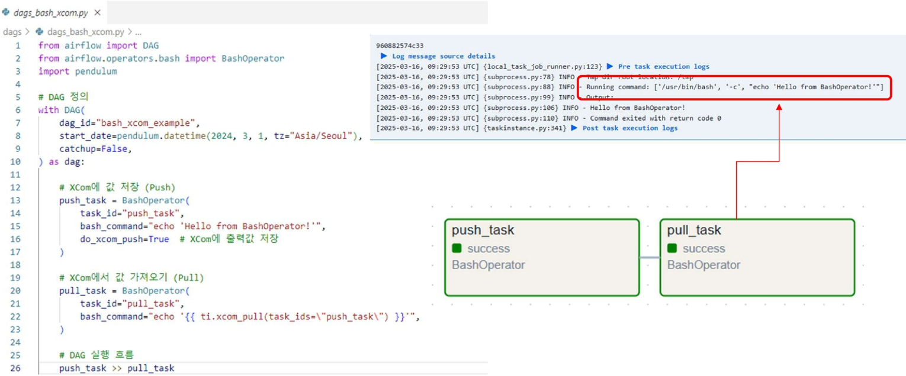
- jinja 템플릿을 활용하여 XCom 데이터 전달

    ```py
    # Push Task
    echo "Hello from bash push_task"

    # Pull Task
    echo "{{ ti.xcom_pull(task_ids='bash_push_task') }}"
    ```
    - `{{ ti.xcom_pull(...) }}` 형태로 XCom 값을 동적으로 참조

### Python & BashOperator with XCom
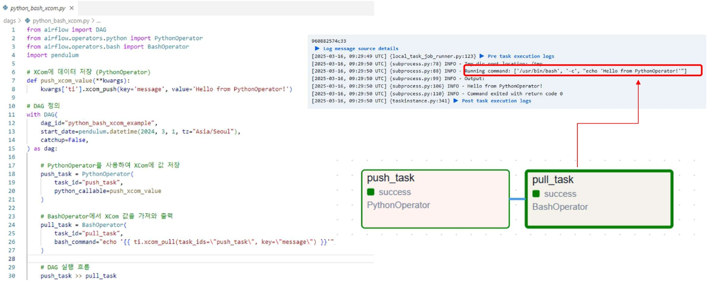

- PythonOperator에서 XCom을 Push하고, BashOperator에서 Pull하여 사용

    ```py
    # Python Push Task
    return 'Hello from python push_task'

    # Bash Pull Task
    echo "{{ ti.xcom_pull(task_ids='python_push_task') }}"
    ```

### 전역 공유 변수(Variable)
Airflow에서 여러 DAG 및 Task간에 데이터를 공유하기 위한 변수  

- 모든 DAG가 공유할 수 있음  
    - 협업 환경에서 표준화된 dag를 만들기 위해 사용되며, **상수**로 지정해서 사용할 변수를 세팅  
- Variable에 등록한 key, value는 메타 데이터베이스에 저장  
- 변수 값은 Airflow UI, CLI, API를 통해 관리 가능  
    
    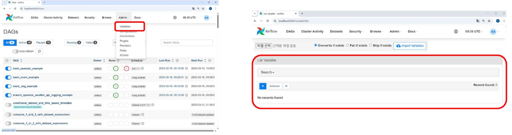

### 전역 공유 변수(Variable) 등록하기
- Webserver에 접속하고, `[Admin] → [Variables]` 클릭  
- `[+]` 클릭해서 새로운 Variable 생성  

    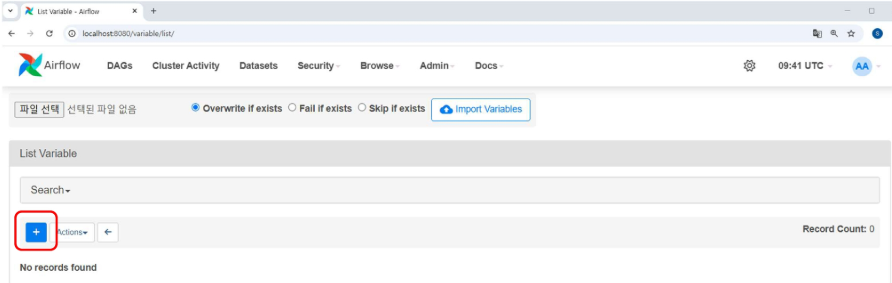

- 아래와 같이 Key, value 값 입력하고 `[save]` 클릭  

    

### 전역 공유 변수(Variable) 사용하기
- Variable 라이브러리의 get 함수를 사용하여 값 사용  
- var.value에 꺼내고 싶은 key 값을 입력 

    ```py
    from airflow.models import Variable

    my_var = Variable.get("my_variable_key", default_var="default_value")
    print(f"Variable에서 가져온 값: {my_var}")
    ``` 
    - default_var 파라미터는 key가 존재하지 않을 때 반환할 기본값 설정
    - Variable.set() 메서드를 사용하여 key, value 쌍으로 변수 저장 가능

        ```py
        Variable.set("my_variable_key", "my_variable_value")
        ```

### 전역 공유 변수(Variable) vs XCom
XCom은 Task 간 데이터 전달용

Variable은 DAG 실행 간 설정값 저장용으로 사용됨  

- DAG 실행 단위로 데이터를 유지하고 싶으면 XCom, 여러 DAG에서 공통으로 사용할 데이터는 Variable 사용  

    | 비교 항목 | XCom | Variable |
    |----------|------|----------|
    | 데이터 유지 기간 | DAG **실행 단위**로 유지됨 | Airflow **전체**에서 지속적으로 유지됨 |
    | 데이터 저장 위치 | Airflow 메타데이터 DB | Airflow 메타데이터 DB |
    | 사용 목적 | Task 간 데이터 전달 | DAG 실행 간 설정값 저장 |
    | 데이터 호출 방식 | `xcom_push()`, `xcom_pull()` 사용 | `Variable.get()`, `Variable.set()` 사용 |
    | 저장 가능한 데이터 유형 | JSON 직렬화 가능한 작은 데이터 (문자열, 숫자, 리스트, 딕셔너리) | 문자열 및 JSON 직렬화 가능한 데이터 |
    | 범위 | DAG 실행 내에서만 사용 가능 | 모든 DAG에서 전역적으로 사용 가능 |
    | 자동 저장 여부 | PythonOperator의 return 값 자동 저장됨 | 자동 저장되지 않음, 명시적 설정 필요 |
    | 보안 고려 사항 | Task 간 민감한 데이터 전달 시 사용하지 않음 | API 키, 비밀번호 등은 Connection을 활용하는 것이 더 안전함 |
    
    - XCom은 JSON 직렬화가 가능한 형식만 저장할 수 있음


## Branching과 Trigger Rule
### BranchOperator
Airflow에서 DAG 실행 흐름을 **조건에 따라 분기할 수 있도록** 하는 오퍼레이터  

- 특정 조건을 평가하여 어떤 Task를 실행할지 동적으로 결정 
- **선택되지 않은 Task는 자동으로 Skipped** 상태가 됨 (실패XX)
- DAG 실행을 최적화하고 불필요한 작업을 줄이는데 유용  

- BranchOperator 종류
    - BranchPythonOperator
        - Python 함수를 사용하여 실행 Task 결정  
        - 함수가 반환하는 task_id에 해당하는 Task로 분기
    - BranchDagRunOperator
        - 다른 DAG 실행을 분기 처리하는 오퍼레이터  
        - 특정 Task에서 다른 DAG의 실행 여부를 확인하여 분기 처리(성공했으면 다음 Task 실행 등)
        - 주로 DAG 간 의존성 관리에 사용

- 조건 기반 실행 흐름
    
    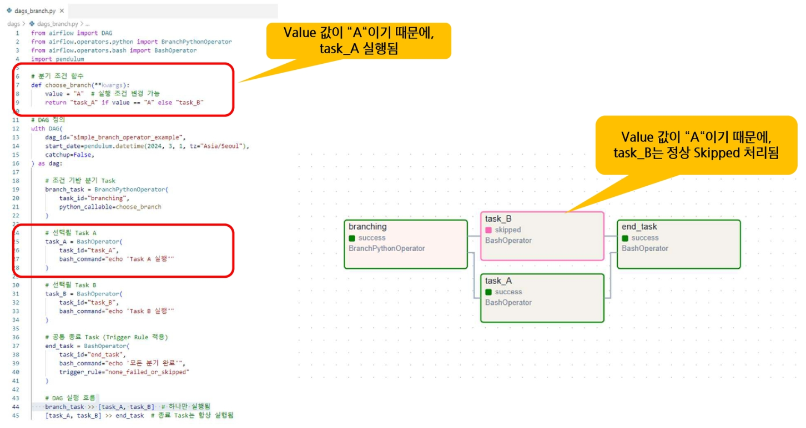
    - `data_engineering\06_Airflow\dagsXcom\5_dags_branch.py` 참고

- API 응답값 기반 분기 처리 방식

    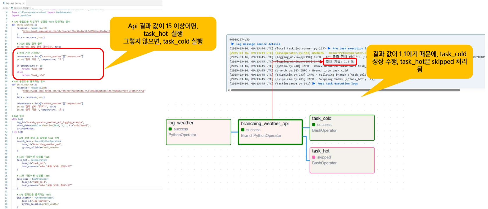
    - `data_engineering\06_Airflow\dagsXcom\6_dags_api_test.py` 참고

### Trigger Rule(트리거 규칙)
Task가 실행되기 위한 조건을 설정하는 기능  

- 기본적으로 모든 Upstream Task가 성공해야 실행됨(all_success)  
- 특정 Task의 실행 결과에 따라 실행 조건을 다르게 설정할 수 있음  

    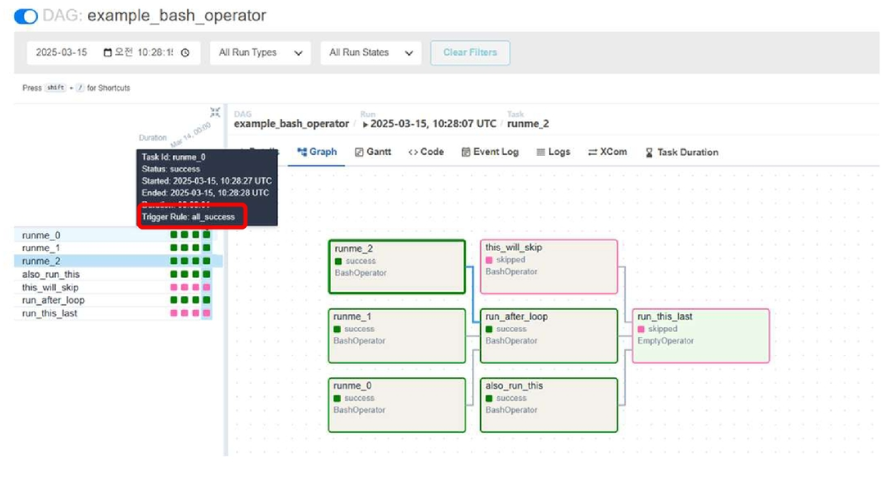
  
- Trigger Rule은 DAG이 스케줄러에 의해 실행될 때 적용되는 것  

    | Trigger Rule | 설명 |
    |--------------|------|
    | `all_success` (기본값) | 모든 Upstream Task가 성공(Success) 시 실행 |
    | `all_failed` | 모든 Upstream Task가 실패(Fail) 시 실행 |
    | `all_done` | 모든 Upstream Task가 성공, 실패, 스킵 여부와 관계없이 실행 |
    | `one_failed` | 최소 1개의 Upstream Task가 실패하면 실행 |
    | `one_success` | 최소 1개의 Upstream Task가 성공하면 실행 |
    | `none_failed` | Upstream Task 중 실패가 없는 경우 실행 (성공 또는 스킵) |
    | `none_failed_or_skipped` | Upstream Task 중 실패와 스킵이 없는 경우 실행 (모두 성공) |
    | `none_skipped` | Upstream Task가 스킵되지 않았다면 실행 |

## External Task Sensor
### TaskGroup
DAG 내에서 **여러 Task를 그룹화하여 논리적으로 관리**하는 기능

- DAG의 복잡성을 줄이고, 비슷한 작업을 하나의 그룹으로 묶어 가독성 및 유지보수성 향상
- UI에서 그룹별로 Task를 시각적으로 확인 가능
    - start >> **Group1** >> end

    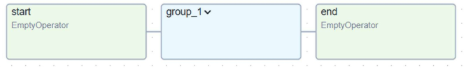

    - start >> **task1 >> inner_group >> [task2, task3] >> task4** >> end

    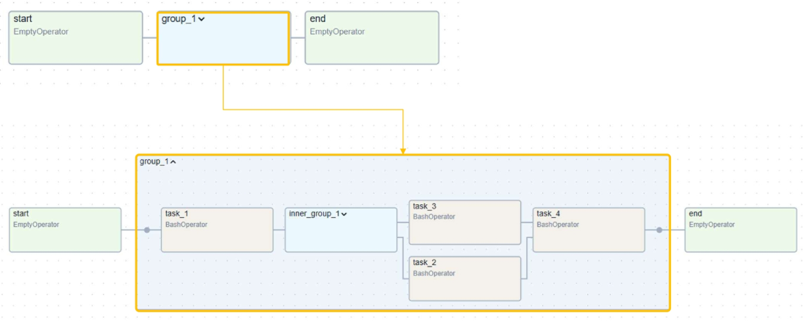

    - start >> task1 >> **inner_task** >> [task2, task3] >> task4 >> end

    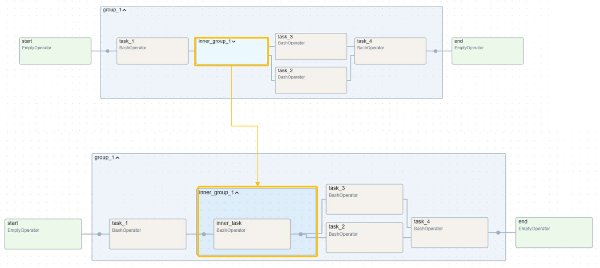

※ 즉, TaskGroup은 계층적으로 구성되는 논리적 형태의 Task 묶음

- TaskGroup 활용법
    
    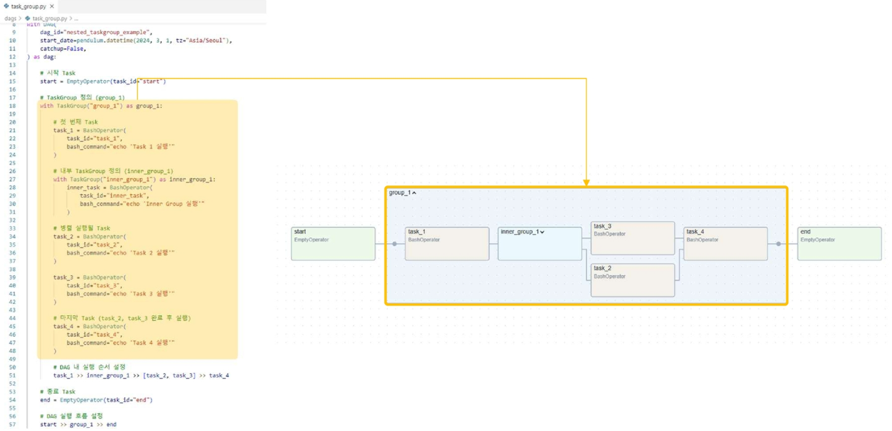

    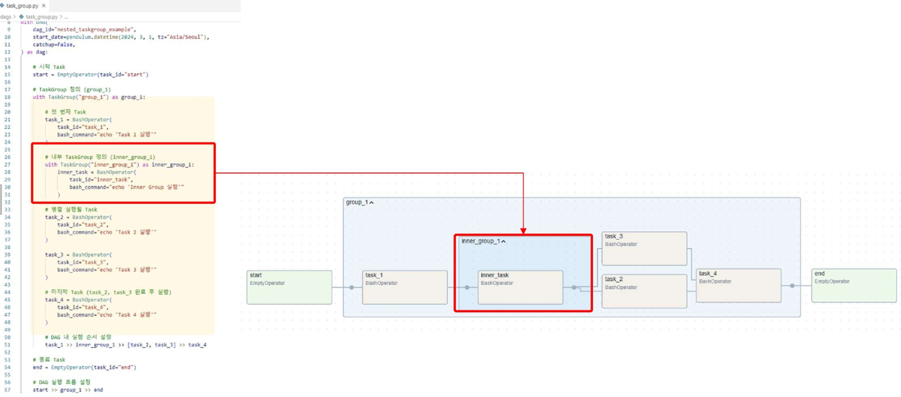
    - `data_engineering\06_Airflow\dagsXcom\7_task_group.py` 참고
    - with문을 사용하여 TaskGroup 생성 및 중첩 가능

        ```py
        from airflow.utils.task_group import TaskGroup
        with TaskGroup("group1") as group1:
            task1 = EmptyOperator(task_id="task1")
            
            with TaskGroup("inner_group") as inner_group:
                task2 = EmptyOperator(task_id="task2")
                task3 = EmptyOperator(task_id="task3")
            
            task4 = EmptyOperator(task_id="task4")
        ```

- TaskGroup 정리

    | 항목 | TaskGroup |
    |------|-----------|
    | 목적 | Task를 논리적으로 그룹화하여 DAG 가독성 개선 |
    | 성능 | DAG 내에서 실행되므로 성능 저하 없음 |
    | 병렬 실행 | 병렬 실행 가능 |
    | UI 표현 방식 | UI에서 그룹을 접거나 펼칠 수 있음 |
    | 의존성 관리 | DAG 내에서 Task 간 의존성을 쉽게 설정 가능 |
    | 실행 방식 | 단순한 Task 묶음으로 실행 관리 |

    - TaskGroup은 DAG 내 Task 그룹화를 위한 단순한 논리적 구조로 경량 실행이 가능

### 고급 오퍼레이터: `ExternalTaskSensor`
다른 DAG의 특정 Task가 완료될 때까지 기다리는 센서 오퍼레이터  

- DAG 간 의존성을 설정하여 한 DAG가 실행되기 전에 외부 DAG(Task)의 실행 완료를 감지
    - DAG 간 의존성이 없기 때문에, 센서 오퍼레이터를 통해 명시적으로 연결 필요
- 데이터 의존성이 있는 DAG를 연결할 때 사용  
    - ex. DAG A(데이터 적재) → DAG B(데이터 분석)

- 데이터 누락, 중복 방지를 위함
- 조건
    - 특정 DAG의 id가 필요(external_dag_id)
    - 특정 Task의 id가 필요(external_task_id)
    - 실행 날짜(시간, 시점)
    - 위 세가지를 모두 만족하면 센서가 success 상태로 변경되어 다음 Task 실행

### ExternalTaskSensor 활용법
- DAG B는 DAG A의 task_a가 완료될 때까지 기다렸다가 수행
    - DAG A 코드
        ```python
        # dags_external_producer.py
        from airflow import DAG
        from airflow.operators.empty import EmptyOperator
        from datetime import datetime, timedelta

        dag_a = DAG(
            dag_id='dag_a',
            start_date=datetime(2025, 3, 1)
        )

        task_a = EmptyOperator(
            task_id='task_a',
            dag=dag_a
        )
        ```

    - DAG B 코드
        ```python
        # dags_external_consumer.py
        from airflow import DAG
        from airflow.sensors.external_task import ExternalTaskSensor
        from datetime import datetime, timedelta

        dag_b = DAG(
            dag_id='dag_b',
            start_date=datetime(2025, 3, 1)
        )

        wait_for_task_a = ExternalTaskSensor(
            task_id='wait_for_task_a',
            external_dag_id='dag_a',
            external_task_id='task_a',  # DAG A의 task_a 완료 여부 확인
            timeout=600,                # 600초 동안 기다림
            poke_interval=30,           # 30초마다 상태 체크
            mode='poke',                # 실행 방식
            dag=dag_b
        )
        ```
    
    - 실행 흐름
        - DAG A의 task_a가 완료될 때까지 DAG B의 wait_for_task_a가 대기
        - task_a가 완료되면 wait_for_task_a가 성공 상태로 변경되어 이후 Task 실행 가능
    
- DAG B는 DAG A의 task_a가 완료될 때까지 기다렸다가 수행(스케줄로만 가능/수동 x)

    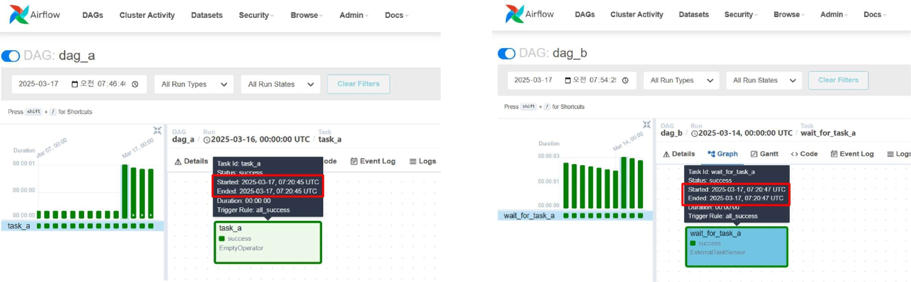

### Dynamic DAG
DAG를 정적으로 정의하는 것이 아니라, **실행 시점에 동적으로 생성**하는 방식  

- 데이터 소스, 환경 변수, 설정 파일 등에 따라 DAG를 동적으로 구성 가능  
- 여러 개의 비슷한 DAG를 하나의 Python 스크립트에서 생성하여 관리할 수 있음  
- DAG 코드 중복을 줄이고 유지보수성을 높이는데 유용

### Dynamic DAG 활용법
- Task 목록을 리스트로 받아 반복문으로 Task 생성

    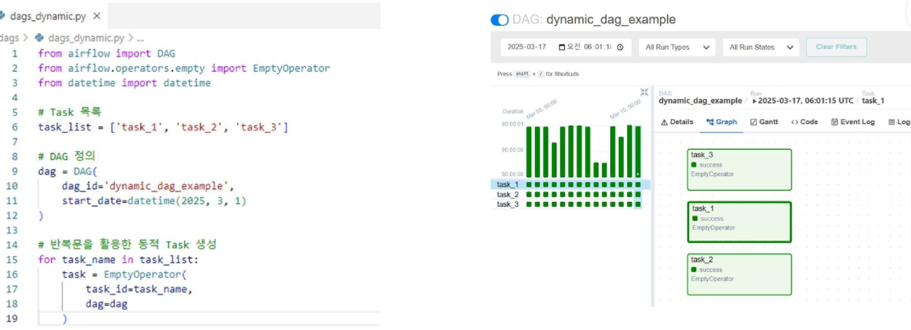
    - `data_engineering\06_Airflow\dagsXcom\10_dags_dynamic.py` 참고

        ```python
        from airflow import DAG
        from airflow.operators.empty import EmptyOperator
        from datetime import datetime

        dag = DAG(
            dag_id='dynamic_dag_example',
            start_date=datetime(2025, 3, 1),
            schedule_interval='@daily'
        )

        task_ids = ['task_1', 'task_2', 'task_3']

        for task_id in task_ids:
            task = EmptyOperator(
                task_id=task_id,
                dag=dag
            )
        ```
        - task_ids 리스트가 외부에서 호출되면, 해당 리스트에 따라 Task가 동적으로 생성됨
        - 일일이 작성하는 것은 비효율적이고, 언제 몇개의 Task가 필요할지 모르는 상황에서 유용함

※ 순서를 명확하게 지정하기 어렵다는 단점이 있음


## Airflow Connections 및 Hooks 소개
### Airflow Connection & Hook
- Connection
    - Airflow가 **외부 시스템(DB, API, 클라우드 서비스 등)과 연결**할 수 있도록 설정  
    - Web UI 또는 환경 변수를 통해 관리 가능
- Hook
    - Connection을 사용하여 실제 데이터를 전송하거나, 외부 시스템과 상호작용하는 역할
    - Operator에서 Hook을 활용하여 작업 수행

        | 연결 대상 | Connection Type | 사용 Hook    |
        |----------|------------------|--------------|
        | MySQL    | MySQL            | MySqlHook    |
        | PostgreSQL | Postgres       | PostgresHook |
        | REST API | HTTP             | HttpHook     |
        | AWS S3   | AWS              | S3Hook       |

- Web UI connection 설정

    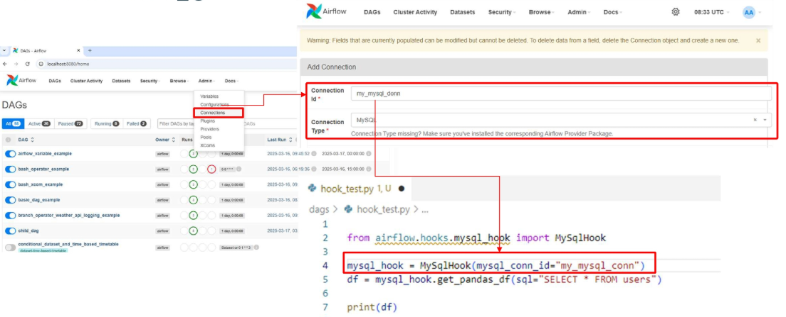

- PostgreSQL Web UI connection 설정 및 테스트 예시
    - `data_engineering\06_Airflow\dagsXcom\11_dags_hook_test.py`

    ```python
    # Postgres 연결 체크 함수
    def fetch_postgres_data():
        hook = PostgresHook(postgres_conn_id="my_postgres_conn")
        conn = hook.get_connection("my_postgres_conn")
        print(f"Connecting to host={conn.host}, port={conn.port}, db={conn.schema}, user={conn.login}")

        with hook.get_conn() as raw_conn:
            with raw_conn.cursor() as cur:
                cur.execute("SELECT 1;")
                one = cur.fetchone()[0]
                cur.execute("SELECT version();")
                version = cur.fetchone()[0]

        if one == 1:
            print("Postgres 연결 OK")
            print(f"Postgres version: {version}")
        else:
            raise Exception("Postgres 연결 실패")

    # DAG 정의
    with DAG(
        dag_id="postgres_hook_python_operator",
        start_date=pendulum.datetime(2025, 8, 18, tz="Asia/Seoul"),
        schedule_interval="@daily",
        catchup=False,
        tags=["postgres", "hook"]
    ) as dag:

        fetch_data_task = PythonOperator(
            task_id="fetch_postgres_data",
            python_callable=fetch_postgres_data
        )

        fetch_data_task
    ```
    - PostgresHook을 사용하여 PostgreSQL 데이터베이스에 연결하고, 간단한 쿼리를 실행하여 연결 상태를 확인


