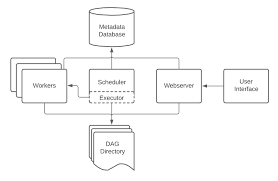

# Apache Airflow 2.10.5 Docker Compose 설치

Docker Compose를 사용하여 Airflow 2.10.5를 설치하고 해당 학습을 위한 구성을 위한 전체 과정을 설명합니다.  
바로 다운로드 받을 수 있도록 제공하지만, 추가적으로 기본 파일에서 변경해야 할 사항을 설정했습니다.

해당 gitlab repository에 올라가 있는 파일은 해당 아래의 작업이 이미 진행되어있는 파일입니다.

---

## 0. Airflow docker-compose 파일 다운로드

Apache Airflow는 아래 주소에서 [공식 Docker Compose 파일](https://github.com/apache/airflow/blob/main/docker-compose.yaml)을 제공합니다.  

---

## 1. 디렉토리 및 초기 환경 구성

```bash
cd /home/ssafy

# Airflow 프로젝트 디렉토리 생성
mkdir ssafy_airflow
cd ssafy_airflow

# airflow docker-compose 다운로드
curl -LfO 'https://airflow.apache.org/docs/apache-airflow/2.10.5/docker-compose.yaml' 

# 서브 디렉토리 생성
mkdir -p ./dags ./logs ./plugins ./config

# 환경 변수 파일 생성 (AIRFLOW_UID 지정)
# Docker 컨테이너에서 Airflow를 실행할 때 파일 시스템 권한을 관리하기 위함
# 사용자 id 1000번일 것
echo -e "AIRFLOW_UID=$(id -u)" > .env

```

---

## 2. Docker Compose 설정 및 실행

```bash
# 'shared-net' 네트워크라는 이름의 Docker Compose 환경에서 여러 컨테이너가 서로 통신할 수 있도록 만드는 가상 네트워크 생성
docker network create shared-net

# 초기화 실행 (metadata DB 초기화 등)
sudo docker compose up airflow-init

# 서비스 시작 (백그라운드 실행 가능)
sudo docker compose up -d
```

---
# 기존 파일에서 변경된 사항 (학습용 docker-compose.yml 제공)

## 3. docker-compose.yml: PostgreSQL 포트 설정

PostgreSQL 컨테이너 설정(로컬에서 사용 중인 DB가 있는 경우 충돌 방지를 위해 5433 사용)

```yaml
postgres:
  image: postgres:13
  ports:
    - "5433:5432"  # 반드시 명시해야 외부에서 접근 가능
```

> **이유**  
> Docker는 기본적으로 컨테이너 내부의 포트를 외부에 노출하지 않습니다.  
> `ports:` 설정이 없으면 WSL, Windows, DBeaver 등 외부에서는 PostgreSQL 접근이 불가합니다.
> 우리가 5433으로 접속하면서 Docker 컨테이너 상에서 5432 port로 띄워놓는 형태
> 내부 Postgres를 5432, 호스트를 5433으로 매핑했다면, 로컬 툴은 항상 localhost:5433으로 접속해야 합니다.

---

## 4. 타임존 설정 (Asia/Seoul)

Airflow 실행 및 스케줄 계산은 타임존에 의존합니다.  
**한국 시간 기준 스케줄을 맞추려면 아래 설정을 적용하세요.**

`docker-compose.yml`의 환경변수에 아래 추가:

```yaml
# yamllint disable rule:line-length 위에 추가하세요.
AIRFLOW__CORE__DEFAULT_TIMEZONE: Asia/Seoul
```

> UI는 여전히 UTC로 표시되지만, DAG 실제 실행 시점은 `Asia/Seoul` 기준으로 동작합니다.  
> 예) `"0시마다 실행"` → `UTC` 기준이면 오전 9시에 실행됨.  
> `Asia/Seoul` 설정 시 정확히 자정에 실행됨.

---

## 5. 예제 DAG 제거 (선택적 설정)

Airflow는 기본적으로 70개 이상의 예제 DAG를 자동 로드합니다.  
실제 운영에서는 비활성화하는 것이 좋고 실습을 위해서도 제거하는 것이 좋습니다.

```yaml
# AIRFLOW__CORE__LOAD_EXAMPLES가 true로 있는데 false로 변경
AIRFLOW__CORE__LOAD_EXAMPLES: 'false'
```

---

## 6. DAG 수정 및 재배포

1. Airflow가 자동 reload 하거나, 필요 시 명시적으로 재시작

```bash
sudo docker compose down
sudo docker compose up -d
```

3. 최초 한 번 웹 UI에서 DAG 활성화 필요 (스위치 ON)

---

## 7. Airflow Web UI 접속

- 접속 주소: [http://localhost:8080](http://localhost:8080)
- 기본 계정: (초기 설정 시 생성됨)
- username : airflow
- password : airflow

---

## 8. DAG 실행 절차

1. **dags/** 디렉토리에 `test.py` DAG 파일 추가 (dags 디렉토리 하위에 있습니다.)
2. **웹 UI에서 DAG 목록에 표시**되는지 확인
3. DAG 옆의 **스위치 토글 ON**
4. ▶️ 버튼 클릭 후 **Trigger** → DAG 실행됨
5. 이렇게 사용하면 사실 스케쥴링이 무의미해지나, 실습을 위해서는 해당 방식을 사용합니다.

> 스위치가 OFF 상태면 수동으로 트리거하거나 스케줄이 있어도 실행되지 않습니다.

```yaml
# 자동으로 실행이 되게하고 싶다면(dag를 unpause 상태로 만들고 싶다면)
# 해당 코드는 현재 docker-compose에 존재하지 않음
AIRFLOW__CORE__DAGS_ARE_PAUSED_AT_CREATION: 'false'
```

---

## 9. 개발 환경용 Airflow 설치 (로컬 설치 시)

- 가상환경 상에서

```bash
pip install "apache-airflow[celery]==2.10.5" \
  --constraint "https://raw.githubusercontent.com/apache/airflow/constraints-2.10.5/constraints-3.10.txt"
```

> **주의사항**: 반드시 constraints 파일과 함께 설치해야 버전 충돌을 방지할 수 있습니다.

---

## Architecture



### airflow-webserver
- **역할**: 웹 기반 사용자 인터페이스(UI)를 제공
- **포트**: 8080
- **기능**:
  - DAG 상태 확인, 실행, 중단
  - Task 로그 확인
  - DAG Gantt 차트 및 Graph 보기

---

### airflow-scheduler
- **역할**: DAG 정의를 분석하고 스케줄에 따라 Task 실행 요청을 생성
- **작동 방식**:
  - DAG 파일(DAG Directory) 읽기
  - 실행 조건 충족 시 TaskInstance 생성 및 실행 요청
  - 요청은 Redis를 통해 Celery Worker에게 전달됨

---

### airflow-worker
- **역할**: 실질적인 Task 실행 담당
- **특징**:
  - Celery 기반 Worker
  - Redis에서 Task를 수신하여 실행
  - 실행 결과는 Metadata Database(PostgreSQL)에 저장

---

### airflow-triggerer
- **역할**: Deferrable Operator와 같이 비동기 작업을 처리하는 경량 이벤트 루프
- **도입 배경**:
  - Airflow 2.2부터 도입됨
  - 비동기 처리를 통해 리소스 효율성 향상

---

### airflow-init
- **역할**: 최초 실행 시 필요한 초기 설정 및 디렉토리 생성
- **기능**:
  - DB 마이그레이션 수행
  - 관리자 계정 생성
  - 로그/플러그인 디렉토리 권한 설정

---

### airflow-cli
- **역할**: CLI 환경에서 Airflow 명령어를 실행할 수 있는 도구 컨테이너
- **활용 예**:
  - `airflow dags list`
  - `airflow tasks test <dag_id> <task_id>`

---

### postgres
- **역할**: Airflow Metadata Database 역할
- **용도**:
  - DAG 정의, 실행 상태, Task 로그 등 저장

---

### redis
- **역할**: Celery Executor용 메시지 브로커
- **기능**:
  - Scheduler가 전달하는 Task 메시지를 큐에 저장
  - Worker가 이를 구독하여 실행

---

# 실습을 위한 안내

- Airflow의 기본 설정에서는 dags/ 디렉토리 하위의 1단계 하위 폴더까지는 .py 파일을 인식 

<pre><code>ssafy_airflow/
├── dags/
│   └── skeleton.py
├── logs/
├── plugins/
├── config/
├── docker-compose.yml
└── .env
</code></pre>

<pre><code>ssafy_airflow/
├── dags/
│   └── data_engineering1_hw_4_4/
│       └── skeleton.py
├── logs/
├── plugins/
├── config/
├── docker-compose.yml
└── .env
</code></pre>

- 해당 형태와 같이 skeleton.py를 dags 하위에 놓아야 dag 파일을 인식합니다.

---

# Chapter 2

## 10. EmailOperator 사용을 위한 SMTP 설정

> 설정 -> 모든 설정

> 계정 클릭 -> Google 계정관리 -> 보안 -> 2단계 인증 -> 앱 비밀번호 (검색창에 쳐서 생성)

Airflow에서 `EmailOperator`를 통해 Gmail SMTP로 메일을 보내기 위해서는 다음과 같은 환경변수를 설정해야 합니다.

| 환경 변수 키 | 설명 |
|---------------|------|
| `AIRFLOW__SMTP__SMTP_HOST` | 사용할 SMTP 서버의 호스트 주소입니다. Gmail을 사용할 경우 `smtp.gmail.com`을 입력합니다. |
| `AIRFLOW__SMTP__SMTP_USER` | 이메일을 보낼 Gmail 계정입니다. |
| `AIRFLOW__SMTP__SMTP_PASSWORD` | Gmail 계정의 **앱 비밀번호**입니다. 일반 비밀번호가 아닌, [2단계 인증](https://myaccount.google.com/security) 설정 후 발급된 16자리 앱 비밀번호를 사용해야 합니다. |
| `AIRFLOW__SMTP__SMTP_PORT` | SMTP 포트 번호입니다. TLS의 경우 보통 `587`번 포트를 사용합니다. |
| `AIRFLOW__SMTP__SMTP_MAIL_FROM` | 이메일 발송 시 표시될 '보낸 사람' 주소입니다. 보통 `SMTP_USER`와 동일하게 설정합니다. |

```yaml
    # docker-compose.yaml 파일의 AIRFLOW_CONFIG: '/opt/airflow/config/airflow.cfg' 아래에
    AIRFLOW__SMTP__SMTP_HOST: 'smtp.gmail.com'
    AIRFLOW__SMTP__SMTP_USER: '{내 Gmail 주소}' 
    AIRFLOW__SMTP__SMTP_PASSWORD: '{발급받은 앱 비밀번호}'
    AIRFLOW__SMTP__SMTP_PORT: 587
    AIRFLOW__SMTP__SMTP_MAIL_FROM: '{내 Gmail 주소}' 
```

## 11. shell script

- Airflow에서 Shell Script를 실행하려면 먼저 **실행 권한 (+x)** 부여 필요.
- 이는 어떤 스크립트 형태를 실행시키던 쓰던 마찬가지

```bash
cd /home/ssafy/ssafy_airflow

# plugins 하위에 shell 디렉토리 생성 후 select_fruit.sh 이동 필요
chmod +x ./plugins/shell/select_fruit.sh
```

-  줄바꿈 형태 Linux 포맷으로 변환하여 파일 변환 실패 방지
```bash
sudo apt install dos2unix
sudo dos2unix plugins/shell/select_fruit.sh
```

---

# chapter 3

## 12. Postgres Hook 테스트

Airflow에서 PostgresHook를 통해 별도 Postgres DB와 연결을 확인하는 실습을 진행합니다.

### 12-1) Postgres 컨테이너 실행

- `docker-compose.yml`에 `postgres-db` 서비스를 추가합니다.  
- 기본 설정: `user=ssafyuser`, `password=ssafy`, `db=ssafydb`, 포트 `5432`  
- 로컬 PC에서 이미 `5432` 포트를 사용 중이면 `5442:5432` 등으로 바꿔야 합니다.  
- Airflow 컨테이너에서 접근할 때는 항상 **호스트명 `postgres-db`, 포트 `5432`** 로 접속해야 합니다.

### 12-2) Airflow Connection 등록

`PostgresHook(postgres_conn_id="my_postgres_conn")`가 실행되려면, **Connection ID = `my_postgres_conn`** 이 Airflow에 미리 등록되어야 합니다.

1. **Airflow Web UI → Admin → Connections → + 버튼** (Airflow가 같은 shared_net을 공유하므로 내부 포트를 활용)
   - Conn Id: `my_postgres_conn`  
   - Conn Type: `Postgres`  
   - Host: `postgres-db`  
   - Database: `ssafydb`  
   - Login: `ssafyuser`  
   - Password: `ssafy`  
   - Port: `5432`

2. 프로젝트 진행하면서 만들며 구성해놓은 로컬 PostgreSQL로 테스트 하고 싶은 경우
   - Conn Id: `my_postgres_conn2`  
   - Conn Type: `Postgres`  
   - Host: `host.docker.internal`  
   - Database: `news`  
   - Login: `ssafyuser`  
   - Password: `ssafy`  
   - Port: `5442`

---

# chapter 4

## 13. Spark 연계를 위한 docker-compose 변경사항 정리

`docker-compose.yml` 파일을, 스파크와 연계해서 활용하기 위해서 추가된 코드와 변경 이유를 정리한 문서입니다.
해당되는 새로운 docker-compose 파일은 디렉토리에 업로드되어 있으니 spark와 연계 사용을 위해서는 이 파일을 사용하기를 권장합니다.

---

### 13-1) Airflow Image → Dockerfile Build 변경
- 해당 파일은 chapter4의 docker-compose-spark.yaml로 제공되어 있습니다.
- 파일명에 맞게 docker compose -f docker-compose-spark.yaml up을 통해서 컨테이너들을 띄울 수 있습니다.

**변경 전:**
```yaml
image: ${AIRFLOW_IMAGE_NAME:-apache/airflow:2.10.5}
# build: .
```

**변경 후:**
```yaml
# image: ${AIRFLOW_IMAGE_NAME:-apache/airflow:2.10.5}
build:
  context: .
  dockerfile: Dockerfile.airflow
```

**변경 이유:**
- spark와의 연결을 위해 직접 Dockerfile을 관리하며 커스터마이징 필요해짐에 따라 새로 구축
- 필요 패키지 설치 (ex: pyspark, matplotlib 등) 및 Java 환경 구축을 위해 빌드 방식 변경.
- 해당 이미지는 project 등에서 활용할 수 있도록 패키지를 이미지 상에서 조정하여 컨테이너를 띄울 수 있도록 설정.

---

### 13-2) JAVA_HOME 환경변수 추가

**추가된 코드:**
```yaml
JAVA_HOME: /usr/lib/jvm/java-17-openjdk-amd64
```

**추가 이유:**
- Spark 작업 실행을 위해 Java 환경변수 명시.
- 기본적으로 해당 bitnami/spark:3.5.4에서는 java 17을 지원하여 17 사용

---

### 13-3) 볼륨 추가 (scripts, data, output)

**추가된 코드:**
```yaml
- ${AIRFLOW_PROJ_DIR:-.}/dags/scripts:/opt/airflow/dags/scripts
- ${AIRFLOW_PROJ_DIR:-.}/data:/opt/airflow/data
- ${AIRFLOW_PROJ_DIR:-.}/output:/opt/shared/output
```

**추가 이유:**
- Spark 작업 스크립트(`scripts`) 관리, 데이터(`data`) 저장, 결과물(`output`) 저장을 위한 경로 추가.
- Airflow와 Spark 내부, 그리고 로컬에서의 공유를 원활히 하기 위함.

---

### 13-4) 폴더 권한 설정

컨테이너가 결과물을 `output` 폴더에 기록하고 `data` 폴더에서 읽을 수 있도록 소유권/퍼미션 설정이 필요합니다.

#### 개념
- **소유자(owner)**: 해당 파일/폴더의 주인. 수정, 실행 권한을 결정.
- **그룹(group)**: 같은 그룹에 속한 사용자들이 공유하는 권한.
- **권한(permission)**: 읽기(r), 쓰기(w), 실행(x) 권한을 소유자/그룹/기타 사용자에게 부여.

#### 설정
```bash
# 개발용으로 전체 권한 열기 (실제 운영 환경에서는 권장 X)
sudo chmod -R 777 output data
```

---

### 13-5) 네트워크 설정 추가

**추가된 코드:**
```yaml
networks:
  shared-net:
    driver: bridge
```

**서비스별 추가:**
```yaml
networks:
  - shared-net
```

**추가 이유:**
- 모든 서비스 간 안정적 통신을 위해 별도 `shared-net` 네트워크 생성 및 연결하여 컨테이너간 통신 이슈를 없애기 위함.
- 컨테이너 DNS 이름(`spark-master` 등)으로 쉽게 통신 가능.

---

### 13-6) Spark Master/Worker 서비스 추가

**추가된 서비스:**

**spark-master:**
```yaml
  spark-master:
    build:
      context: .
      dockerfile: Dockerfile.spark
    container_name: spark-master
    environment:
      - SPARK_MODE=master
      - SPARK_MASTER_HOST=spark-master 
      - SPARK_RPC_AUTHENTICATION_ENABLED=no
      - SPARK_RPC_ENCRYPTION_ENABLED=no
      - SPARK_LOCAL_STORAGE_ENCRYPTION_ENABLED=no
      - SPARK_SSL_ENABLED=no
    ports:
      - "8083:8080"
      - "7077:7077"
    networks:
      - airflow
    command: /bin/bash -c "/opt/spark/sbin/start-master.sh && tail -f /dev/null"

    volumes:  
      - ${AIRFLOW_PROJ_DIR:-.}/dags/scripts:/opt/airflow/dags/scripts
      - ${AIRFLOW_PROJ_DIR:-.}/data:/opt/airflow/data
      - ${AIRFLOW_PROJ_DIR:-.}/output:/opt/shared/output
```

**spark-worker:**
```yaml
  spark-worker:
    build:
      context: .
      dockerfile: Dockerfile.spark
    container_name: spark-worker
    environment:
      - SPARK_MODE=worker
      - SPARK_MASTER_URL=spark://spark-master:7077
    depends_on:
      - spark-master
    ports:
      - "8084:8081"
    networks:
      - airflow
    command: /bin/bash -c "sleep 5; /opt/spark/sbin/start-worker.sh $${SPARK_MASTER_URL} && tail -f /dev/null"
    volumes:  
      - ${AIRFLOW_PROJ_DIR:-.}/dags/scripts:/opt/airflow/dags/scripts
      - ${AIRFLOW_PROJ_DIR:-.}/data:/opt/airflow/data
      - ${AIRFLOW_PROJ_DIR:-.}/output:/opt/shared/output
```

**추가 이유:**
- Airflow DAG 내에서 SparkSubmitOperator를 통해 Spark 잡 실행 가능하게 하기 위해 Master/Worker 클러스터 추가.
- 데이터 처리 파이프라인을 Airflow와 Spark로 연동하는 구조.

---

### 13-7) 기타 환경변수 정리

- `_PIP_ADDITIONAL_REQUIREMENTS` 환경변수 주석처리.

**변경 이유:**
- 필요한 라이브러리는 Dockerfile에서 설치하도록 변경했기 때문에 컨테이너 실행 시 추가 설치 불필요.
- docker image 자체에서 추가해놓으면 한 번 빌드하면 실행할 때마다 설치하지 않음.

---


