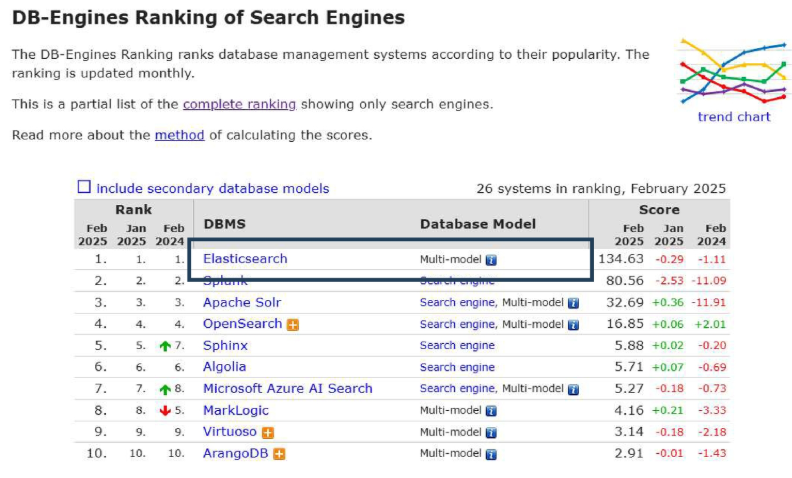
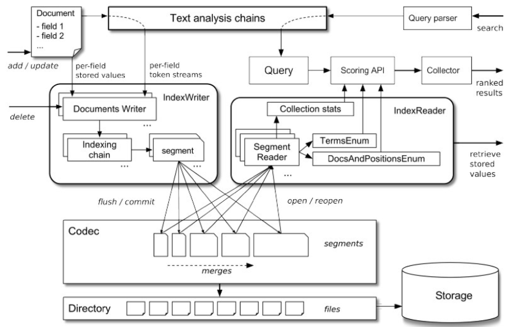
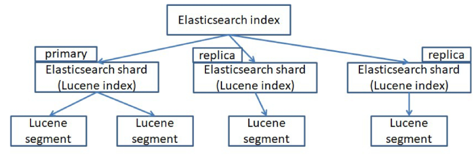
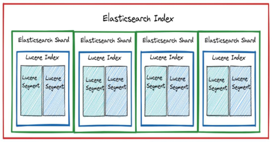
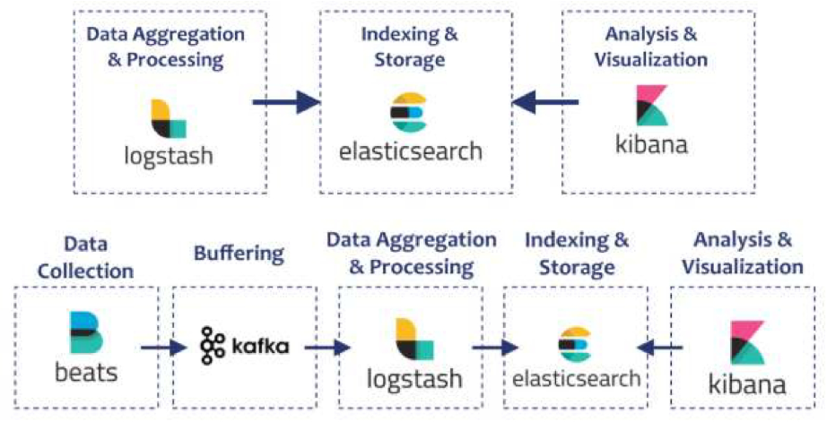

# Elasticsearch 설치 및 기본 개념
## Elasticsearch 개요
### 정보 검색
대규모 데이터 속에서 사용자가 원하는 정보를 찾아 제공하는 기술
- 웹 문서, 이미지, 동영상, 연구 논문 등 다양한 데이터 유형을 대상으로 함
- Google, Microsoft 등 글로벌 기업에서 핵심적으로 활용

- 검색 시스템에서의 요구사항
  - 빠르고 정확한 검색 결과
  - 사용자 경험
  - 보안 및 개인 정보
  - 확장성 및 유지보수

### 정보 검색의 핵심 기술
- 데이터 수집(Data Collection)
  - 웹 크롤링(Crawling)
    - 웹 문서를 자동으로 수집하여 색인하는 방식
  - 스크래핑(Scraping)
    - 특정 웹사이트에서 데이터를 추출하여 가공하는 방식

- 데이터 저장(Data Storage) - 역색인(Inverted Index)
  - 키워드와 해당 키워드가 포함된 문서 정보를 저장하는 구조
  - 문서 검색 시 키워드를 기반으로 관련 문서를 빠르게 찾아줌

- 검색 알고리즘(Search Algorithm)
  - TF-IDF(Term Frequency-Inverse Document Frequency)
    - 특정 키워드가 문서 내에서 가지는 상대적 중요도를 평가하는 기법
  - BM25
    - TF-IDF를 개선한 가중치 기반 검색 알고리즘으로, 검색 정확도를 높임

### 기존 RDB 검색
- “삼성 블루투스 이어폰”이라는 타이틀을 가진 상품 검색한다는 가정
  ```sql
  SELECT title FROM product WHERE title LIKE  '%삼성 블루투스 이어폰%'
  ```

- 문제점
  - 쿼리가 복잡해짐
    - 단어는 같지만 순서가 달라 못찾는 경우가 생김
  - 성능(Performance)에 문제 발생 (대량 데이터에서 LIKE 연산 비효율)
    - LIKE 연산은 전체 테이블 스캔하기 때문
  - 스펠링 오류, 유사 검색 불가

### 검색 엔진의 순위와 종류
  

- DB-Engines Ranking of Search Engines (Feb 2025 기준)
  1. Elasticsearch – Multi-model
  2. Splunk – Search engine
  3. Apache Solr – Search engine, Multi-model
  4. OpenSearch – Search engine, Multi-model
  5. Sphinx – Search engine

### Elasticsearch
Elasticsearch는 강력한 오픈소스 검색 및 분석 엔진
- 수평적 확장성, 안정성, 쉬운 관리를 위한 설계
- Apache Lucene 기반이며, Elastic Stack의 일부로 Logstash, Beats, Kibana를 포함
  - Lucene
    - 고성능 검색을 위해 사용됨
    - 내부 엔진처럼 다룸 (Rest API)
  - Logstash
    - 로그 수집에 사용
  - Beats
    - 데이터 수집(전송)에 사용
  - Kibana
    - 분석 시각화에 사용

### Elasticsearch와 Lucene의 관계
- Elasticsearch
  - 분산 검색 엔진, 데이터를 저장하고 빠르게 검색
  - Lucene을 내부 엔진으로 사용

- Lucene
  - 검색 라이브러리, Elasticsearch의 핵심 검색 기능 담당
  - Java로 작성된 고성능 텍스트 검색 엔진 라이브러리
  - 검색, 색인(indexing) 기능을 제공
  - 단독 사용 시 애플리케이션 직접 개발 필요

- Elasticsearch vs Lucene
  - Elasticsearch는 Lucene을 기반으로 동작하며 **REST API 및 분산 환경 지원**

### Lucene

- 전체 흐름 요약 (Lucene의 내부 구조)
  1. 정보를 담은 문서(Document)가 들어옴
      - 일반적으로 하나의 문서 = 하나의 데이터 단위 (RDB로 치면 row 단위)
      - 여러 필드(field1, field2, ...)로 구성됨
  2. Text analysis chains (텍스트 분석 체인)
      - 문서가 들어오면 텍스트 분석을 먼저 진행
      - 형태소 분석, 불용어 제거, 소문자 변환 등 검색을 더 잘되게 하기 위한 전처리 과정
      - 이 분석 과정은 적재(add/update) 시에도, 검색(search) 시에도 거침
  3. IndexWriter
      - 분석된 데이터를 세그먼트(segment) 단위로 나눠서 저장 (색인된 문서 묶음)
      - 내부적으로는 Indexing chain을 거쳐 세그먼트 생성
      - 일정 시점이 되면 `flush` / `commit` 하면서 디스크에 실제로 저장됨
  4. Codec
      - IndexWriter에서 만들어진 세그먼트를 실제 파일(segments)로 저장하는 역할
      - 나중에 이 파일들이 merge되어 효율성 높임
  5. Directory & Storage
      - 세그먼트들이 물리적으로 저장되는 디렉터리와 저장소 (파일 시스템 등)

- 검색 흐름
  1. 검색 요청 (search)
      - 사용자가 검색어 입력 → 쿼리로 변환
      - 이때도 텍스트 분석 체인을 거침 (입력값 전처리)
  2. Query Parser
      - 쿼리 문자열을 실제 검색 가능한 Query 객체로 변환
  3. IndexReader
      - 저장된 세그먼트들을 읽어오는 역할
      - SegmentReader가 각 세그먼트를 읽고, TermsEnum, DocsAndPositionsEnum 등을 통해 세부 정보 접근
  4. Scoring API
      - Query에 대한 각 문서의 점수 계산 (검색 순위 결정)
      - Collection stats 등 통계 정보도 반영
  5. Collector
      - 점수 기준으로 정렬된 검색 결과 수집 후 사용자에게 반환

- 검색용 서비스의 핵심 '루씬'
  - Elasticsearch에서의 검색 관련 API 대부분은 루씬 기반의 검색 API에서 출발
  - 분산 처리, 캐싱, 샤드 기반 검색 기능 제공 → 대규모 데이터 검색 최적화

    
    1. Elasticsearch index
        - 논리적인 단위로, RDB의 테이블처럼 특정 주제에 대한 문서들이 담겨있는 구조
        - 동시에 Kafka 토픽처럼 분산처리가 가능한 구조이기도 함
        - 즉, 논리적으로는 하나의 인덱스지만, 물리적으로는 분산되어 저장됨
    2. Shard (샤드)
        - Elasticsearch index는 여러 shard로 나눠짐
        - 하나의 shard는 Lucene index (즉, Lucene 기반의 검색 단위)로 동작
        - 각 shard는 물리적인 저장 단위이자 검색 처리 단위
    3. Primary / Replica
        - 각 shard는 기본적으로 Primary가 있고, 고가용성 확보를 위해 Replica가 존재
        - Primary shard에서 데이터가 먼저 저장되고, Replica shard에 복제됨
        - 이 구조 덕분에 분산 저장 & 장애 복구가 가능
    4. Lucene segment
        - 하나의 shard 내부에는 여러 개의 Lucene segment가 존재
        - 실제 데이터는 segment 단위로 저장되고, Lucene에서 검색할 때도 segment 단위로 검색 진행
    5. 결론
        - 결국 Elasticsearch는 내부적으로 Lucene을 활용해 데이터 저장 및 검색을 처리함
        - 사용자 입장에서는 Elasticsearch index로 문서를 넣고 검색하지만, 백그라운드에서는 Lucene segment까지 세분화되어 작동하는 구조

### Lucene의 segment
- 세그먼트(Segment)
  - Lucene에서 색인된 문서를 저장하는 최소 단위
  - 하나의 샤드(Shard)는 여러 개의 세그먼트로 구성
  - 세그먼트는 한 번 생성되면 **수정되지 않음 (Immutable)**
    - 문서가 업데이트되면 새로운 세그먼트가 생성
    - 삭제된 문서는 "삭제 플래그"로 관리

      

- 세그먼트의 장점
  - 동시성 확보
    - 여러 세그먼트에서 동시에 검색 가능
  - 빠른 색인 처리
    - 기존 세그먼트를 수정하지 않고 새로 추가
  - 안정적인 검색
    - 기존 세그먼트는 그대로 유지되므로 검색 중단 없이 색인 가능

## Elasticsearch

1. Beats – 데이터 수집기 (경량)
    - 서버나 애플리케이션에서 로그, 메트릭, 시스템 정보 등을 수집하는 에이전트
    - 대표적으로 Filebeat, Metricbeat 등
    - 수집한 데이터를 바로 Logstash로 넘기거나, Kafka로 먼저 보낼 수도 있음
2. Kafka – 버퍼 역할
    - 데이터가 갑자기 몰릴 때를 대비한 중간 완충지 역할
    - Beats에서 보내온 데이터를 일시 저장 → Logstash가 처리 가능한 속도로 가져가게 함
    - 데이터 유실 방지 및 처리 안정성을 높임
3. Logstash – 수집 & 처리
    - 다양한 소스에서 들어온 데이터를 파싱, 필터링, 정제, 변환
    - 구조화되지 않은 로그를 구조화하거나, 특정 필드 추출 등 가능
    - 처리한 데이터를 Elasticsearch로 넘김
4. Elasticsearch – 색인 및 저장
    - Logstash로부터 받은 데이터를 저장
    - 내부적으로 Lucene 기반 인덱싱 → 빠른 검색과 집계 가능
5. Kibana – 분석 및 시각화
    - Elasticsearch에 저장된 데이터를 차트, 그래프, 대시보드 형태로 시각화
    - 로그 조회, 모니터링, 알림 설정까지 가능

### Elasticsearch 특징
- 분산 구조 (Distributed Nature)
  - Elasticsearch는 클러스터 내 사용 가능한 **모든 노드에 데이터를 자동으로 분산**하여 준실시간으로 대량의 데이터를 처리 가능하도록 함

- 전문 검색 (Full-Text Search)
  - Elasticsearch는 고급 전문 검색 기능을 지원하며, HTTP 웹 인터페이스와 스키마가 없는 JSON 문서를 사용
    - RestAPI + JSON -> 사용성 good

- 확장성 (Scalability)
  - 수백 대에서 수천 대의 서버로 확장 가능, 구조화된 데이터 및 비정형 데이터 수 페타바이트 규모까지 처리 가능

- 유연성 (Flexibility)
  - 다양한 소스로부터 이질적인 데이터 유형을 색인할 수 있으며, 복잡한 검색 기능 제공

### Elasticsearch 활용
- 기업 검색(Enterprise Search)
  - 기업에서 전체 디지털 콘텐츠를 색인하여 내부 네트워크 또는 웹사이트에서 고급 검색 기능을 제공하는 데 활용

- 로그 수집 및 분석(Logging and Log Analysis)
  - Logstash 및 Kibana와 함께 사용하여 로그 데이터를 분석하고 IT 운영, 보안, 성능 모니터링에 대한 인사이트 제공

- 보안 정보 및 이벤트 관리(SIEM)
  - 조직에서 보안 데이터를 실시간으로 분석하고 시각화하여 위협 감지 및 규정 준수 관리에 활용

- 데이터 분석(Data Analysis)
  - 빅데이터 분석을 위해 사용되며, 대량 데이터를 빠르고 다양한 방식으로 탐색할 수 있도록 지원
  - 즉, 로그 데이터 분석뿐만 아니라, 전체 데이터 분석에도 활용 가능

- 개인화 및 추천 시스템(Personalization and Recommendations)
  - 사용자 행동과 상호작용을 분석하여 맞춤형 상품 추천 및 동적 콘텐츠 제공에 활용

### Elasticsearch 기본 요소
- 문서(Document)
  - Elasticsearch에서 문서는 색인될 수 있는 기본 정보 단위
    - 문서 하나하나가 검색 대상이 됨
  - 각 문서는 JSON(JavaScript Object Notation) 형식으로 표현되며, 가벼운 데이터 교환 형식

- 필드(Field)
  - 필드는 Elasticsearch에서 가장 작은 데이터 단위이며, 키-값 쌍(key-value pair)을 의미

    | Elasticsearch | RDBMS |
    |---|---|
    | Index | Table |
    | Document | Row |
    | Field | Column |
    | Mapping | Schema |

### Elasticsearch 데이터 저장 및 관리
- 인덱싱(Indexing)
  - Elasticsearch에서는 데이터를 Index 단위로 관리
  - 각 인덱스는 Database(table에 조금 더 가까움)처럼 동작함
  - 문서는 JSON 형식으로 저장되며, 검색을 위해 최적화된 형태로 변환

- 샤딩(Sharding)
  - Index는 여러 개의 샤드로 나눌 수 있음
  - 데이터를 **여러 노드에 분산 저장**하여 성능을 향상시키고, 대용량 데이터와 높은 검색 요청을 효과적으로 처리

- 레플리카(Replica)
  - Replica Shard는 기본 샤드의 사본으로, 장애 발생 시 데이터 손실을 방지하고 검색 성능을 향상시키는 역할
  - 여러 복제본이 존재하면 검색 요청을 분산 처리할 수 있어 시스템의 안정성과 확장성이 높아짐
    - 검색 속도를 높이기 위함

    

### Elasticsearch 검색 동작 원리
- 질의 처리(Query Processing)
  - 사용자가 질의를 입력하면, 해당 질의는 구문 분석(Parsing) 및 변환(Transforming) 과정을 거쳐 Lucene 인덱스에서 검색이 가능하도록 최적화된 형식으로 변환
    - 즉, 텍스트 기반 겁색이 가능하도록 변환
  - 변환된 질의는 모든 관련 샤드(기본 샤드 및 복제 샤드)에 병렬로 실행되어 빠른 검색이 가능

- 연관성 점수 계산(Relevance Scoring)
  - Elasticsearch는 검색 결과의 연관성을 평가하기 위해 다양한 알고리즘을 활용
  - TF-IDF(단어 빈도-역문서 빈도) 및 BM25 등의 알고리즘을 사용하여 각 문서가 사용자의 질의와 부합하는지 계산
  - 해당 점수는 검색 결과의 순위를 결정하는 데 활용

- 준실시간 검색(Near Real-Time, NRT)
  - Elasticsearch는 데이터를 **검색하면서 동시에 색인**할 수 있는 준실시간(NRT) 검색 기능을 제공
  - 메모리 버퍼를 활용해 새로운 문서를 저장
  - 일정 주기로 버퍼를 비워 색인 세그먼트를 생성하여 빠르게 검색 가능

- 준실시간 검색이 가능한 이유
  - 메모리 기반 버퍼링으로 색인 속도 향상
  - **비동기 색인 처리**로 검색과 색인을 동시에 수행
  - Lucene 엔진 최적화를 통한 빠른 색인 적용

### 그 밖의 Elasticsearch 특징
- 유연한 JSON 데이터 관리
  - 스키마리스 방식으로 다양한 데이터 저장
  - 즉, 스키마 고정XX
- 정밀한 검색 및 필터링
  - 다양한 검색 옵션과 필터 기능 제공
- 다양한 검색 쿼리 지원
  - 복잡한 검색, 정렬, 그룹화 기능 제공
- 다양한 클라이언트 지원
  - Java, .NET, PHP, Python 등 SDK 제공
- 확장성과 안정성
  - 오토스케일링, 데이터 백업 및 복원 기능 제공
- Kibana 데이터 시각화
  - 리포팅 및 대시보드 활용 가능


## Elasticsearch 환경 구성
### Docker를 통한 설치
- OS 환경에 영향 받지 않도록 docker를 통한 설치를 권장
- `data_engineering\07_Elasticsearch\docker-compose-elastic.yml`

### Elasticsearch 환경 구성
- 문법에 맞게 작성 후 docker-compose를 활용해 환경 띄우기
- Windows는 WSL을 통한 docker desktop 이용
- docker-compose.yml 파일명이 다를 때는 이와 같이 `-f` 옵션을 통해 명령어로 띄울 수 있음

  ```sh
  docker compose -f docker-compose-elastic.yml up
  ```

### Elasticsearch 환경 구성
```yaml
services:
  es01:
    # Elasticsearch 공식 이미지
    # Elasticsearch로 컨테이너 띄우기 위한 베이스 이미지
    image: docker.elastic.co/elasticsearch/elasticsearch:8.17.1
    container_name: es01
    environment:
      - node.name=es01
      - cluster.name=elastic-docker-cluster

      ## 3개의 노드 실행 시
      # - discovery.seed_hosts=es02,es03
      # - cluster.initial_master_nodes=es01,es02,es03
      
      ## 노드 하나만 실행 시
      - discovery.seed_hosts=es01
      - cluster.initial_master_nodes=es01

      - node.roles=master,data,ingest
      - "ES_JAVA_OPTS=-Xms512m -Xmx512m"
      - xpack.security.enabled=false
      - network.host=0.0.0.0
    volumes:
      - ./config/dictionary:/usr/share/elasticsearch/config/dictionary
    ports:
      - 9200:9200
    networks:
      - elastic
    healthcheck:
      test: ["CMD-SHELL", "curl -f http://localhost:9200/_cluster/health || exit 1"]
      interval: 10s
      timeout: 5s
      retries: 5
    command: >
      sh -c "
      if [ ! -d /usr/share/elasticsearch/plugins/analysis-nori ]; then
        elasticsearch-plugin install analysis-nori --batch;
      fi &&
      exec /usr/local/bin/docker-entrypoint.sh elasticsearch"
```
- Image
  ```yaml
  image: docker.elastic.co/elasticsearch/elasticsearch:8.17.1
  ```
  - 사용할 Docker 이미지를 지정  
    - 공식 Elasticsearch 8.17.1 버전 이미지를 가져옴
- container name
  ```yaml
  container_name: es01
  ```
  - 컨테이너 이름을 설정: es01로 고정

- node.name
  ```yml
  environment:
    - node.name=es01
    - cluster.name=elastic-docker-cluster

    ## 3개의 노드 실행 시
    # - discovery.seed_hosts=es02,es03
    # - cluster.initial_master_nodes=es01,es02,es03
    
    ## 노드 하나만 실행 시
    - discovery.seed_hosts=es01
    - cluster.initial_master_nodes=es01

    - node.roles=master,data,ingest
    - "ES_JAVA_OPTS=-Xms512m -Xmx512m"
    - xpack.security.enabled=false
    - network.host=0.0.0.0
  ```
  - 이 노드의 이름을 es01로 지정  
  - 클러스터 내에서 구분할 때 사용

- cluster.name
  - 클러스터 이름을 설정  
  - 클러스터 이름이 일치하는 노드끼리 합쳐져서 클러스터를 이룸

- discovery.seed_hosts
  - 클러스터를 구성할 때 다른 노드의 "주소 목록"을 제공  
  - es02, es03을 주석 해제하면 3개 노드를 연결  
  - 하나만 실행할 땐 es01 자신만 바라보도록 설정

- cluster.initial_master_nodes
  - 초기 클러스터 마스터 노드를 지정  
  - 초기화할 때 반드시 필요한 설정

- node.roles
  - 이 노드의 역할을 설정
  - `master`: 클러스터 상태 관리
  - `data`: 데이터 저장 및 검색 처리
  - `ingest`: 데이터 전처리 파이프라인 실행  
  - 즉, es01은 모든 역할을 수행하는 종합 노드

- jvm.options
  - Elasticsearch가 사용할 Java 힙 메모리 크기를 지정
  - `-Xms`: 최소 힙 크기  
  - `-Xmx`: 최대 힙 크기
  - 웬만하면 동일하게 맞추는 것을 권장

- volumes
  ```yaml
  es01:
    volumes:
      - shared_esdata:/usr/local/elasticsearch/data
    ports:
      - 9200:9200
  ```
  - Docker 컨테이너상에 띄워진 Elasticsearch 데이터 디렉토리를 공유 저장소에 연결  
  - shared_esdata 볼륨을 `/usr/local/elasticsearch/data`에 마운트

- ports
  ```yaml
  es02:
    ports:
      - 9201:9200
  ```
  - 호스트의 9200번 포트를 컨테이너 9200번 포트에 매핑  
  - Es02와 같은 경우는 docker를 띄운 호스트의 9201로 해당 컨테이너 9200번에 매핑

- networks
  ```yaml
  networks:
    - elastic
  ```
  - elastic이라는 Docker 네트워크에 연결 
    - container name으로 소통 가능해짐
  - 이 네트워크를 통해 Kibana와 다른 Elasticsearch 노드들이 서로 통신


## Elasticsearch RESTAPI & CRUD
### Elasticsearch의 데이터 교환
- 방식
  - Elasticsearch는 분산 검색 및 분석 엔진으로, 대량의 데이터를 빠르게 검색하고 분석하는 데 사용
  - **RESTful API**를 통해 클라이언트와 통신

- REST API의 특징
  - HTTP 기반으로 동작
  - 자원을 URL로 표현 (`/users/1`, `/products/10` 등)
  - HTTP 메서드를 활용하여 CRUD 작업 수행 (GET - 조회, POST - 생성, PUT - 수정/생성, DELETE - 삭제)
  - JSON, XML 등 다양한 데이터 형식을 사용

### Elasticsearch의 RESTful API
- RESTful API
  - Elasticsearch는 HTTP 요청을 통해 데이터를 처리하며, API 설계를 통해 다양한 기능을 제공
  - 언어 독립성, 확장성, 직관적인 인터페이스 제공 등의 장점

    ```http
    POST /products/_doc/1
    Content-Type: application/json

    {
      "name": "Samsung Galaxy S25 Ultra",
      "brand": "Samsung",
      "price": 1099,
      "category": "smartphone"
    }
    ```

#$# Elasticsearch의 index 생성
1. Index를 Elasticsearch가 **자동 매핑(dynamic mapping)** 으로 필드 타입을 추론해서 설정
    ```python
    doc = {
      "name": "Samsung Galaxy S24 Ultra",
      "brand": "Samsung",
      "price": 1199.99,
      "category": "smartphone",
      "rating": 4.8
    }

    response = es.index(index="products", id=1001, document=doc)
    ```
    - 스키마 정의하지 않고 요청해도 자동 매핑되어 생성됨
2. 인덱스를 미리 정의된 설정으로 명시적으로 생성 (mapping도 가능)
    ```python
    es.indices.create(
      index="products",
      body={
        "settings": {
          "index": {
            "number_of_shards": 3,
            "number_of_replicas": 1
          }
        }
      }
    )
    ```
    - 인덱스만 따로 명시하여 생성 가능

### Document CRUD
- POST를 활용한 문서 생성
  - 파이썬으로 사용하려면 클라이언트 생성해야 함 (localhost:9200과 연결할 객체 생성)

    ```python
    # 클라이언트 생성
    es = Elasticsearch("http://localhost:9200")

    # 문서 삽입
    doc = {
      "name": "Samsung Galaxy S24 Ultra",
      "brand": "Samsung",
      "price": 1199.99,
      "category": "smartphone",
      "rating": 4.8
    }

    response = es.index(index="products", id=1001, document=doc)
    ```

- kibana에서 요청
  ```http
  POST /products/_doc/1001
  {
    "name": "Samsung Galaxy S24 Ultra",
    "brand": "Samsung",
    "price": 1199.99,
    "category": "smartphone",
    "rating": 4.8
  }
  ```

- 요청 결과
  ```json
  {
    "_index": "products",
    "_id": "1001",
    "_version": 1,
    "result": "created",
    "_shards": {
      "total": 2,
      "successful": 1,
      "failed": 0
    },
    "_seq_no": 0,
    "_primary_term": 1
  }
  ```

### Document CRUD : `GET`
- GET을 활용한 문서 조회
  ```python
  # python

  # 문서 조회 (ID: 1001, 인덱스: products)
  response = es.get(index="products", id=1001)
  ```

- kibana에서 요청
  ```http
  GET /products/_doc/1001
  ```
- 요청 결과
  ```json
  {
    "_index": "products",
    "_id": "1001",
    "_version": 1,
    "_seq_no": 0,
    "_primary_term": 1,
    "found": true,      // 해당 문서에서 성공적으로 찾았을 때 true
    "_source": {        // 실제 데이터는 _source 형태로 받음
      "name": "Samsung Galaxy S24 Ultra",
      "brand": "Samsung",
      "price": 1199.99,
      "category": "smartphone",
      "rating": 4.8
    }
  }
  ```

### Document CRUD : `POST`
- POST를 통한 업데이트
  1. 기존 내용을 변경

      ```python
      # python client 형태로 실행

      # 업데이트할 필드 정의
      update_body = {
        "doc": {
          "price": 1099
        }
      }

      # 문서 업데이트 요청 (ID: 1001)
      response = es.update(index="products", id=1001, body=update_body)
      ```
      ```http
      // kibana에서 요청
      POST /products/_update/1001
      {
        "doc": {
          "price": 1099
        }
      }
      ```
      ```json
      // 결과
      {
        "_index": "products",
        "_id": "1001",
        "_version": 2,        // 업데이트 해서 버전 올라감
        "result": "updated",  // 결과: 업데이트 상태
        "_shards": {
          "total": 2,
          "successful": 1,
          "failed": 0
        },
        "_seq_no": 1,
        "_primary_term": 1
      }
      ```

  2. 새로운 필드 추가
      ```python
      # 업데이트할 내용 정의
      update_body = {
        "doc": {
          "stock": 200
        }
      }

      # ID가 1001인 문서의 stock 필드 업데이트
      response = es.update(index="products", id=1001, body=update_body)
      ```
      ```h
      POST /products/_update/1001
      {
        "doc": {
          "stock": 200
        }
      }
      ```
      ```json
      // 필드 추가 후 반환된 응답 (버전 3)
      {
        "_index": "products",
        "_id": "1001",
        "_version": 3,
        "result": "updated",
        "_shards": {
          "total": 2,
          "successful": 1,
          "failed": 0
        },
        "_seq_no": 2,
        "_primary_term": 1
      }
      ```
      ```json
      // ID 1001 문서의 _source 데이터 확인 결과
      {
        "_index": "products",
        "_id": "1001",
        "_version": 3,
        "_seq_no": 2,
        "_primary_term": 1,
        "found": true,
        "_source": {
          "name": "Samsung Galaxy S24 Ultra",
          "brand": "Samsung",
          "price": 1099,
          "category": "smartphone",
          "rating": 4.8,
          "stock": 200
        }
      }
      ```

### Elasticsearch 문서 업데이트
- Elasticsearch의 **문서는 불변(Immutable)** 하므로 직접 수정되지 않으며, 업데이트 시 새로운 문서로 저장 등으로 사용 가능

- 업데이트 과정
  1. 기존 문서 조회 → 업데이트 요청 시 현재 색인된 문서를 가져옴  
  2. 변경 사항 적용 → 기존 문서에 수정된 내용을 반영  
  3. 새 문서 색인 → 변경된 문서를 새로운 버전으로 다시 저장  
      - 동일한 ID로 재색인
  4. 이전 문서 삭제 처리 → 기존 문서는 **논리적 삭제(Logical Deletion)** 로 표시되어 검색에서 제외됨  
  5. 세그먼트 병합 → **Segment Merging을 수행하여 삭제된 문서를 물리적으로 제거**하고 저장 공간 확보  
  
- 이를 통해 색인 무결성, 검색 일관성을 보장할 수 있게 됨

### Document CRUD : `DELETE`
- DELETE를 통한 삭제
  - 실제로 삭제되는것이 아니고 표시되기 때문에 `flush`를 해야 완전 삭제

    ```python
    # 문서 삭제 (ID: 1001, 인덱스: products)
    response = es.delete(index="products", id=1001)

    print(response)
    ```
    ```http
    // kibana
    DELETE /products/_doc/1001
    ```
    ```json
    {
      "_index": "products",
      "_id": "1001",
      "_version": 4,
      "result": "deleted",
      "_shards": {
        "total": 2,
        "successful": 1,
        "failed": 0
      },
      "_seq_no": 3,
      "_primary_term": 1
    }
    ```

- 디스크에서 쓰는 형태 (flush)
  ```python
  # 인덱스 강제 flush
  response = es.indices.flush(index="products")

  print(response)
  ```
  ```http
  POST /products/_flush
  ```
  ```json
  {
    "_shards": {
      "total": 2,
      "successful": 1,
      "failed": 0
    }
  }
  ```

### Elasticsearch에서 세그먼트와 Flush의 관계
1. upsert (update or insert) & update는 기존 문서를 수정하는 것이 아니라 **새로운 세그먼트를 생성하는 방식으로 동작**
    - Elasticsearch는 Lucene을 사용하며, 세그먼트는 수정될 수 없는(Immutable) 구조  
    - 따라서 문서가 업데이트될 때 기존 세그먼트를 수정하지 않고 새로운 세그먼트를 생성  

2. Flush는 새로운 세그먼트를 디스크에 기록하는 과정
    - 새로운 문서 추가(index), 업데이트(update), 삭제(delete)가 발생하면 **메모리(Buffer)에 먼저 저장** 
    - **Flush가 발생하면** 메모리에 있던 문서들이 새로운 세그먼트로 생성되고 **디스크에 저장됨**  

3. 세그먼트가 증가하면 자동으로 병합(Merge) 수행
    - 새로운 세그먼트가 많아지면 검색 속도가 느려질 수 있음  
    - Elasticsearch는 주기적으로 여러 개의 작은 세그먼트를 하나로 병합하여 성능을 최적화  

### Document CRUD : `Upsert`
- Upsert
  - 업데이트(Update)와 삽입(Insert)을 결합한 연산
  - 해당 ID의 문서가 존재 → 업데이트 수행
  - 해당 ID의 문서 없음 → 새 문서 생성

    ```python
    # 업데이트할 필드 정의
    update_body = {
      "doc": {
        "price": 1099,
        "stock": 150
      },
      "doc_as_upsert": True
    }

    # 문서 업데이트 (또는 없으면 삽입)
    response = es.update(index="products", id=1001, body=update_body)
    ```
    ```http
    POST /products/_update/1001
    {
      "doc": {
        "price": 1099,
        "stock": 150
      },
      "doc_as_upsert": true
    }
    ```
    ```json
    {
      "_index": "products",
      "_id": "1001",
      "_version": 1,
      "result": "created",
      "_shards": {
        "total": 2,
        "successful": 1,
        "failed": 0
      },
      "_seq_no": 4,
      "_primary_term": 1
    }
    ```
  
### 추가 내용 : `bulk`
```py
from elasticsearch import Elasticsearch, NotFoundError, helpers
import json

# Elasticsearch 클라이언트 생성
es = Elasticsearch("http://localhost:9200")

# ----------------------------------------------
# 1. 기존 'products' 인덱스 삭제 (초기화)
# ----------------------------------------------
try:
    es.indices.delete(index="products")
    print("1. 'products' 인덱스 삭제 완료")
except NotFoundError:
    print("1. 삭제할 인덱스가 없음 (이미 삭제된 상태)")

# ----------------------------------------------
# Bulk Insert 실행
# ----------------------------------------------
bulk_insert_data = [
    {"_index": "products", "_id": "1", "_source": {
        "product_name": "Samsung Galaxy S25", "brand": "Samsung", "release_date": "2025-02-07", "price": 799}},
    {"_index": "products", "_id": "2", "_source": {
        "product_name": "iPhone 15 Pro", "brand": "Apple", "release_date": "2024-10-13", "price": 1199}},
    {"_index": "products", "_id": "3", "_source": {
        "product_name": "Google Pixel 8", "brand": "Google", "release_date": "2023-10-12", "price": 260}},
]

helpers.bulk(es, bulk_insert_data)
# 강제로 색인 refresh
es.indices.refresh(index="products")

print("3Bulk 문서 삽입 완료")

# ----------------------------------------------
# 삽입된 문서 확인
# ----------------------------------------------
print("삽입된 문서:")
res = es.search(index="products", query={"match_all": {}})
for hit in res["hits"]["hits"]:
    print(hit["_source"])
```
- 클라이언트 연결 필수
  - `es = Elasticsearch("http://localhost:9200")`
- 한번에 여러 데이터를 넣고싶을 때
  - JSON 형태의 데이터 나열 후 elasticsearch의 helpers 모듈에 있는 `bulk`를 사용하면 한번에 데이터 처리 가능
- 데이터를 다룰 때 모아서 넣는 경우가 많은데, 이때 bulk를 사용하면 더 효율적임

