# Elasticsearch 아키텍처와 데이터 처리
## Elasticsearch의 아키텍처와 분산처리
### Elasticsearch의 클러스터 및 노드 개념
- 클러스터(Cluster)
  - Elasticsearch 클러스터는 하나 이상의 노드(Node)로 구성된 그룹 (논리적인 그룹)
  - 클러스터는 고유한 이름을 가지며, 데이터를 분산 저장하고 관리하는 역할을 수행함

- 노드(Node)
  - Elasticsearch의 개별 실행 인스턴스를 노드(Node)라고 함
  - 각 노드는 데이터를 저장하며, 클러스터의 색인 및 검색 기능에 참여함

    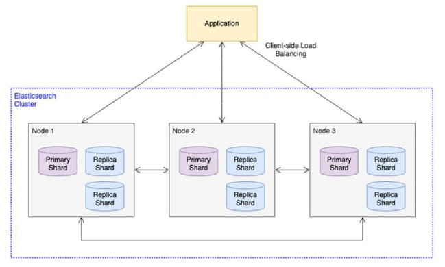

- 클러스터 특징
  - 분산된 데이터 처리
    - 여러 개의 노드(Node)로 구성되며, 데이터 저장, 검색, 분석 작업을 함께 수행
  - 노드의 역할과 관리
    - 각 노드는 고유한 이름과 IP로 클러스터에 참여하며, 특정 역할(마스터, 데이터, 인제스트 등)을 담당
  - 안정성과 가용성 확보
    - 장애 대비 및 데이터 보호를 위해 여러 지역에 노드를 분산 배치하고, 복제(replica) 기능을 활용
  - 유연한 확장성과 성능 최적화
    - 대량의 데이터도 빠르게 처리할 수 있으며, 필요에 따라 노드를 추가하여 확장 가능

- 노드 유형(Node Types)
  - 마스터 노드(Master Node)
    - 클러스터 전체의 작업을 관리함
      - 클러스터 전반 운영에 대한 역할 수행
    - 인덱스 생성/삭제 및 노드 상태 관리 수행
  - 데이터 노드(Data Node)
    - 데이터를 저장하며, CRUD, 검색 및 집계(Aggregation) 작업 처리
      - 실제 데이터를 가지고 있고, 읽고 쓰는 역할을 수행하기 때문에 리소스를 가장 많이 잡아먹음
  - 인제스트 노드(Ingest Node)
    - 색인(Indexing) 전에 필터링, 변환 및 데이터 정제 작업 수행
  - 코디네이팅 노드(Coordinating Node)
    - 클라이언트 요청을 라우팅하며, 여러 노드에 분산된 검색 로드를 균형 있게 처리

### 마스터 노드
클러스터 관리 역할. Elasticsearch 클러스터의 **핵심 관리자**로서 클러스터의 안정적인 운영을 담당함

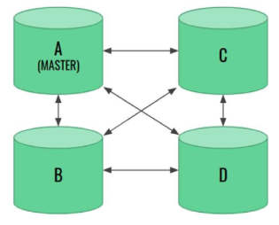
- 중요한 결정 수행
  - 클러스터 내 인덱스 생성 및 삭제, 노드 관리, 샤드 분배 등 주요 작업을 결정
- 연속적인 서비스 제공
  - 클러스터 운영이 중단되지 않도록 **최소한 하나 이상의 마스터 노드** 필요
- 고가용성을 위한 다중 마스터 노드 구성
  - 운영 환경에서는 3개 이상의 마스터 노드 배치를 권장하여 장애 발생 시 안정성을 확보
- 클러스터 상태 모니터링 및 전환 관리
  - 클러스터 상태를 지속적으로 모니터링함
  - 필요할 경우 다른 노드를 마스터 노드로 전환하여 안정적인 운영 유지

### 데이터 노드
데이터 저장 및 관리 역할. Elasticsearch 클러스터에서 **실제 데이터를 저장하고 관리하는 역할**을 수행함

- 색인 및 검색 처리
  - 색인(Indexing), 검색(Query), 집계(Aggregation) 작업을 담당
  - CPU, I/O, 메모리 등 하드웨어 리소스 많이 소모
- 안정적인 클러스터 운영
  - 클러스터 안정성을 위해 적절한 개수의 데이터 노드를 유지하며, 장애 발생 시 대비하여 적절한 샤드 운영 필요
- 유연한 구성 가능
  - 데이터 특성과 접근 패턴에 따라 다양한 데이터 노드 유형을 조정 가능
  - 즉, 계층화된 형태로 노드를 구성하여 운영함으로써 균형있게 처리 가능
- 성능 및 비용 고려
  - 데이터 노드의 구성은 클러스터 성능 최적화, 안정성 확보, 운영 비용 등에 직접적인 영향을 미침

### 인제스트 노드
데이터 수집 및 사전 처리 역할. 색인 전에 필터링, 변환, 정제 작업 수행함

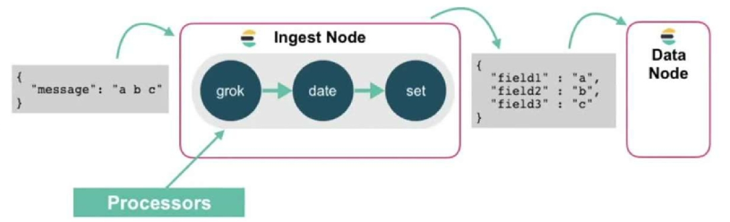
- 다양한 데이터 변환 지원
  - 필드 추가/삭제, 날짜 변환, 텍스트 정규화 가능
- 데이터 노드로 색인 최적화
  - 변환된 데이터를 색인하여 부하 감소
- 리소스 분리 운영
  - CPU·메모리 사용량이 높아 데이터 노드와 분리 권장
- 자동화 및 색인 지원
  - 데이터 변환 후 즉시 색인하여 효율적 운영

- 인제스트 노드 흐름
  - 메시지가 들어오면, Processors 단계를 거치며 grok, date, set 등의 프로세서를 통해 데이터를 변환함
  - 이러한 전처리 과정을 통해 색인에 적합한 형태로 데이터를 정제한 후, 다음 단계인 date node 등으로 전달됨
    - `grok`: 정규식을 기반으로 로그 메시지를 파싱하여 필드를 추출
    - `date`: 추출된 문자열 형태의 날짜를 표준 날짜 형식으로 변환
    - `set`: 고정된 값을 지정하거나, 새로운 필드를 추가하여 데이터에 필요한 정보를 부여함

### 코디네이팅 노드
클러스터의 요청을 라우팅하고 상태를 관리하는 역할

- 검색 및 색인 요청을 적절한 데이터 노드로 분산하여 처리
- 대규모 클러스터에서는 별도로 분리 운영하여 부하를 줄이는 것이 효과적
- 이 외에도 `ml`, `remote_cluster_client`, `transform` 노드 등도 존재

### 노드 역할 흐름
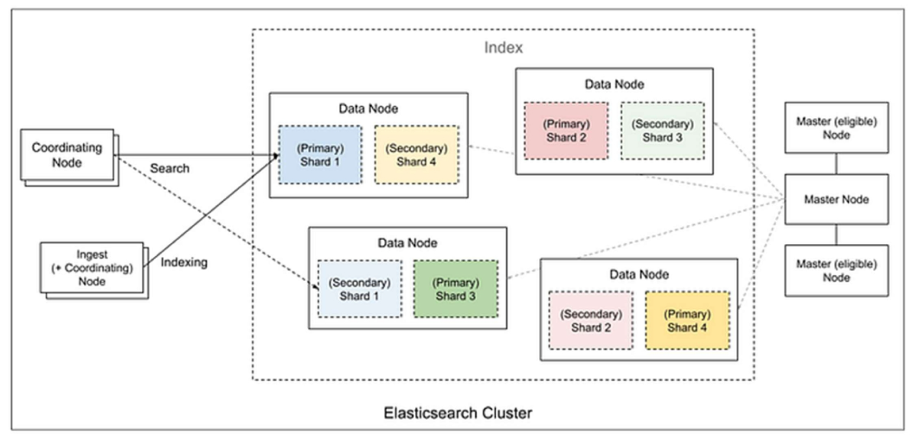
- coordinating Node
  - 클라이언트 요청을 받아 내부적으로 적절한 데이터 노드(정확히는 Shard)에 전달

- Ingest Node
  - 전처리 파이프라인을 사용하는 경우에만 등장
  - 명확하게 지정하지 않으면 coordinating Node 역할과 함께 수행됨

※ 따로 설정하지 않으면 클러스터의 노드는 어떤 노드든 요청받을 수 있고, 요청받은 노드가 Coordinating Node 역할을 수행함

- Data Node
  - 실제 데이터가 저장되고 검색되는 실행 주체

- Master Node
  - 클러스터 전체 관리
  - 검색, 인덱싱에 직접적인 관여는 하지 않지만 노드가 들어오고 나가고, 샤드를 어디에 두는지 등을 결정함

- 요청받았을 때의 노드 흐름 정리
  - 사용자가 Indexing 요청을 보냈을 때 (사용자가 새로운 데이터를 저장하는 행위 → 인덱싱 요청을 날리는 것)
    1. Coordinating Node가 요청 받음 → Ingest Node로 전달  
    2. Ingest Node에서 데이터를 색인하기 위한 전처리 진행  
        - → 어떤 샤드에 저장될 것인지까지 결정  
    3. 문서를 해당 샤드가 위치한 Data Node에 요청 전달  
    4. Data Node의 **Primary Shard**가 실제 문서를 저장, 색인  
    5. 같은 샤드 번호를 가진 **Secondary Shard**로 비동기 복제 요청  
        - Primary Shard만 성공적으로 데이터 저장하면 클라이언트에 성공 응답을 보내는 형태

  - 사용자가 검색 요청을 보냈을 때
      1. Coordinating Node가 요청 수신  
      2. Ingest Node에서 검색 쿼리 분석 (쿼리 파싱 등)  
      3. 해당 인덱스가 가진 **모든 샤드(Primary/Secondary 상관없이)** 별로 하나씩 검색 요청을 분산해서 보냄  
          - ex. Shard1의 Primary, Shard2의 Secondary 등 샤드별로 하나  
      4. 각 샤드가 쿼리에 맞는 데이터를 찾아 Coordinating Node에 반환  
      5. Coordinating Node에서 결과들을 하나로 합쳐 정렬 수행  
          - 하이라이팅, 페이징 등의 부가 작업도 마무리한 뒤 클라이언트에 반환

  - Master Node
    - 사용자가 직접 접근하는 경우는 없음
    - 샤드 위치, 노드 상태 관리

※ 인덱싱: Primary Shard 중심 → 복제 진행  

※ 검색: Coordinating Node → 샤드별 분산 요청 → 결과 종합

### 샤드(Shard)
데이터를 나누어 저장하는 작은 단위로, 노드 간 분산 저장을 통해 성능과 확장성을 보장

- Primary Shard
  - 색인 생성 및 **CRUD** 작업 수행
- Replica Shard (Secondary)
  - 기본 샤드의 복사본으로 장애 복구 및 **검색 성능 향상** 역할

  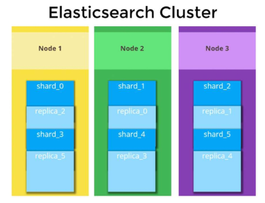
- primary shard는 기본적으로 "처음 인덱스 생성 시점"에서 설정한 이후에는 변경이 불가능
- 하지만 replica set의 개수는 언제든지 변경할 수 있음 (동적 조절 가능)

### Replication
데이터를 복제하여 중복성을 확보하고, 고가용성 및 장애 대응을 보장

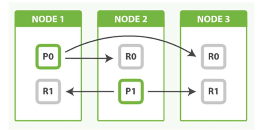

- Replication 동작 방식
  - Primary-Replica 관계
    - Primary Shard는 0개 이상의 Replica Shard를 가질 수 있음
    - 따라서, Replica Shard가 없을 수도 있다
  - 쓰기(Write) 연산
    - Primary Shard에서 발생한 변경 사항이 모든 Replica Shard에 복제됨
    - 비동기 복제이므로 Primary Shard만 변경되면 복제 여부와 상관없이 클라이언트에게 응답 보냄
  - 읽기(Read) 연산
    - Primary와 Replica Shard가 함께 검색 부하를 분산하여 성능 향상

- Replication의 장점
  - 고가용성
    - Primary Shard가 포함된 노드가 다운되면 Replica Shard가 Primary로 승격되어 데이터 접근 가능
  - 부하 분산
    - 검색 요청을 Primary 또는 Replica Shard로 분산 처리하여 성능 향상
  - 데이터 중복 저장
    - 여러 노드에 데이터를 복사하여 장애 발생 시 데이터 손실 방지

- Replication 고려 사항
  - 노드 개수
    - 동일한 샤드의 Primary와 Replica를 같은 노드에 저장할 수 없으므로 충분한 노드 필요
  - 네트워크 및 저장소 부담
    - 복제본 유지로 인해 네트워크 트래픽 증가 및 저장 공간 추가 소모
  - 트레이드오프
    - 복제본 수가 많을수록 데이터 안정성은 증가하지만, 디스크 및 네트워크 자원 소모도 커짐

- 각 인덱스별로 프라이머리 샤드와 복제본 세트 수 설정
  - books라는 인덱스를 생성
  - Primary shard 5개, replicas 1개 설정

    ```json
    // kibana
    PUT books
    {
      "settings": {
        "index": {
          "number_of_shards": 5,
          "number_of_replicas": 1
        }
      }
    }
    ```
    ```python
    # python code
    es.indices.create(
        index="book",
        body={
            "settings": {
                "index": {
                    "number_of_shards": 5,
                    "number_of_replicas": 1
                }
            }
        }
    )
    ```
    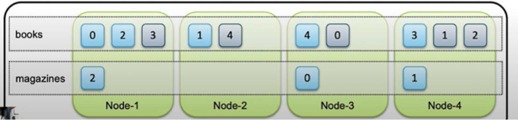
  - Primary shard 개수는 index 생성 시에만 설정 가능하고,
  - replica는 동적으로 변경 가능함을 잊지 말기

### 클러스터 내 기타 주요 요소
- Routing Table (라우팅 테이블)
  - 어떤 노드가 어떤 샤드를 가지고 있는지 관리함
  - 코디네이팅 노드에서 요청을 적절한 샤드로 전달할 때 사용
- Gateway (게이트웨이)
  - 클러스터 상태와 인덱스를 지속적으로 저장하여, 노드 장애 발생 시 복구할 수 있도록 지원
- Discovery Module (디스커버리 모듈)
  - 새로운 노드가 기존 클러스터에 원활하게 합류하도록 관리하며, 노드 상태 변경을 추적


## Elasticsearch 클러스터 운영 (정적 제어 vs 동적 제어)
### 정적 제어
- Docker Compose나 `elasticsearch.yml`에서 설정하는 항목들  
  - 노드 단위 설정  
  - Elasticsearch를 재시작해야 반영됨 
  - 보통 클러스터 구조, 노드의 역할, 네트워크, 보안 관련 설정  
- Elasticsearch가 시작될 때 읽혀서 클러스터의 기본 구조, 동작 방식을 결정함

  ```yaml
  es03:
    image: docker.elastic.co/elasticsearch/elasticsearch:8.17.1
    container_name: es03
    environment:
      - node.name=es03
      - cluster.name=elastic-docker-cluster
      - discovery.seed_hosts=es01,es02
      - cluster.initial_master_nodes=es01,es02,es03
      - node.roles=master,data,ingest
      - "ES_JAVA_OPTS=-Xms512m -Xmx512m"
      - xpack.security.enabled=false
      - network.host=0.0.0.0
    volumes:
      - shared_esdata:/usr/local/elasticsearch/data
    ports:
      - 9202:9200
    networks:
      - elastic
  ```
  - 노드 단위의 초기 구성, 네트워크, 노드 역할, 보안설정 등
  - 운영 시 신중하게 설계 후 반영

  | 설정 항목 | 설명 | 정적 제어인 이유 |
  |---------|-----|----------------|
  | `node.name` | 노드 식별자 (예: es03) | 실행 시 결정되며, 변경 시 재시작 필요 |
  | `cluster.name` | 클러스터 식별자 | 변경 시 클러스터 분리, 재시작 필요 |
  | `discovery.seed_hosts` | 다른 노드 찾기 위한 시드 목록 | 부트스트랩에 필요, 재시작 필요 |
  | `cluster.initial_master_nodes` | 초기 마스터 선출용 | 클러스터 최초 구성 시만 사용됨 |
  | `node.roles` | 노드의 역할 지정 | 실행 시 확정되며, 변경 시 재시작 필요 |
  | `ES_JAVA_OPTS` | 힙 메모리 설정 | JVM 시작 시 적용되므로 재시작 필요 |
  | `xpack.security.enabled` | 보안 기능 활성화 여부 | 보안 모듈 로딩 시점에서 결정됨 |
  | `network.host` | 바인딩할 IP/인터페이스 | Elasticsearch 시작 시 적용됨 |

- Elasticsearch 경로 설정(정적 제어)
  - 데이터 경로 설정
    - `elasticsearch.yml` 혹은 docker-compose에서 환경 변수 설정을 통해 데이터 및 로그 저장 경로 설정

      ```yaml
      path:
        data: /var/data/elasticsearch
        logs: /var/log/elasticsearch
      ```
      ```yaml
      volumes:
        - shared_esdata:/usr/local/elasticsearch/data
      ```
    - 볼륨 마운트 활용 -> 데이터를 보호
    - 직접 수정 비추천 -> 데이터 디렉터리 변경은 운영에 어려움
    - 권한 설정 -> Elasticsearch가 접근할 수 있도록 설정
    - Docker compose로 띄운 elasticsearch 상에서는 `/usr/share/elasticsearch/data`, `/usr/share/elasticsearch/logs`가 default

- Elasticsearch network 설정
  - 네트워크 호스트 설정
    - Elasticsearch의 네트워크 설정을 통해 개발 및 운영 환경을 구성

      ```yaml
      network.host: 0.0.0.0
      network.bind_host: 0.0.0.0
      network.publish_host: 192.168.1.100
      ```
    - `network.host` : 기본적으로 127.0.0.1 바인딩 → 외부 접근 시 필수
    - `network.bind_host` : 노드가 어떤 IP에서 listen 할지 설정
    - `network.publish_host` : 다른 노드가 이 노드를 찾을 수 있는 주소 (클러스터 내부 통신용)
    - Docker-compose 사용 시 bind_host, publish_host 자동 처리되는 경우 많음


- Elasticsearch Discovery 설정
  - 클러스터 내 다른 노드를 발견하고 합류하기 위해 discovery 설정을 사용
    - `discovery.seed_hosts` : 클러스터에 합류할 수 있는 초기 노드 목록 지정
    - `discovery.seed_providers` : 시드 노드 정보를 제공하는 방법 설정
  - 기본 settings 방식 사용, 필요 시 file, plugin 방식으로 확장 가능

    ```yaml
    es03:
      image: docker.elastic.co/elasticsearch/elasticsearch:8.17.1
      container_name: es03
      environment:
        - node.name=es03
        - cluster.name=elastic-docker-cluster
        - discovery.seed_hosts=es01,es02
        - cluster.initial_master_nodes=es01,es02,es03
        - node.roles=master,data,ingest
        - "ES_JAVA_OPTS=-Xms512m -Xmx512m"
        - xpack.security.enabled=false
        - network.host=0.0.0.0
      volumes:
        - shared_esdata:/usr/local/elasticsearch/data
      ports:
        - 9202:9200
      networks:
        - elastic
    ```

  - 초기 마스터 노드 지정
    - `cluster.initial_master_nodes` : 초기 마스터 노드를 지정하여 **클러스터를 부트스트랩**
    - `node.name` : 각 노드의 고유한 이름을 설정

  - 클러스터 구성 후 `cluster.initial_master_nodes` 설정을 제거해야 함
  - 클러스터 운영 중에는 추가적인 마스터 선출을 위해 `discovery.zen.minimum_master_nodes`와 같은 설정을 고려
  - 마스터 노드는 3개 이상을 유지하면 장애 대응에 유리함

- Elasticsearch Heap Size 설정
  - Heap Size
    - Heap은 Elasticsearch가 동작할 때 Elasticsearch가 사용할 작업 공간 메모리
    - 노드의 역할과 사용 가능한 총 메모리를 기반으로 적절한 Heap 메모리 크기를 설정
    
  - Xms와 Xmx 값을 동일하게 설정
    - 힙 크기는 최대 32GB를 넘지 않도록 설정
    - 힙 크기는 총 시스템 메모리의 50% 이하로 설정하는 것이 권장
    - 불필요한 GC(가비지 컬렉션) 오버헤드를 방지하기 위해 적절한 메모리 설정 유지

    ```yaml
    es03:
      image: docker.elastic.co/elasticsearch/elasticsearch:8.17.1
      container_name: es03
      environment:
        - node.name=es03
        - cluster.name=elastic-docker-cluster
        - discovery.seed_hosts=es01,es02
        - cluster.initial_master_nodes=es01,es02,es03
        - node.roles=master,data,ingest
        - "ES_JAVA_OPTS=-Xms512m -Xmx512m"   # Heap 설정(Xms=Xmx)
        - xpack.security.enabled=false
        - network.host=0.0.0.0
      volumes:
        - shared_esdata:/usr/local/elasticsearch/data
      ports:
        - 9202:9200
      networks:
        - elastic
    ```

### 동적 제어
- Elasticsearch **실행 중** REST API (또는 Python 등 클라이언트)로 **변경하는 설정**
  - 클라스터 또는 인덱스 레벨에서 실시간 변경 가능
  - 운영 중 수정 가능하므로 튜닝이나 장애 대응에 유리

- Cluster 샤드 할당 설정
  - 클러스터 내 노드에 샤드를 배분하는 과정
  - 마스터 노드는 각 샤드를 어떤 노드에 할당할지 결정

    ```yml
    cluster.routing.allocation.enable: all
    cluster.routing.allocation.enable: primaries
    cluster.routing.allocation.enable: new_primaries
    cluster.routing.allocation.enable: none
    ```
    ```json
    POST _cluster/settings
    {
      "persistent": {
        "cluster.routing.allocation.enable": "primaries"
      }
    }
    ```
    - `all` : 모든 샤드를 할당하는 기본값
    - `primaries` : 프라이머리 샤드만 할당
    - `new_primaries` : 새로 생성된 프라이머리 샤드만 허용
    - `none` : 샤드 할당을 비활성화

- 마스터 후보 노드
  - 마스터 후보 노드는 마스터 노드를 선출하는 역할
  - 자기 자신도 마스터 노드로 선출될 수 있음

    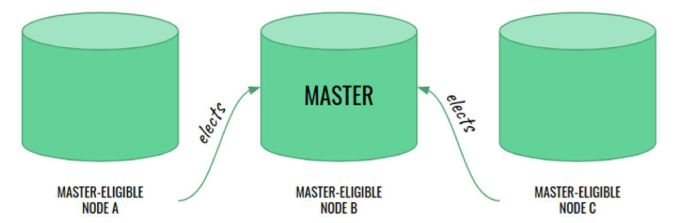

- 마스터 노드 선출
  - 마스터 노드 역할
    - 클러스터의 안정성을 유지하고, 새로운 마스터 노드 선출 과정을 관리
  - 장애 발생 시 자동 선출
    - 기존 마스터 노드가 장애가 나면 다른 마스터 후보 노드가 자동으로 새로운 마스터로 선출
  - 최소 3개 이상의 마스터 후보 노드 유지
    - 운영 환경에서는 마스터 후보 노드(master-eligible node)를 3대 이상 유지하는 것 권장
  - Voting-only 마스터 노드
    - 마스터 노드 선출 과정에만 참여하며, 실제 마스터 역할은 수행하지 않음
  - 설정 파일을 통한 구성
    - `elasticsearch.yml` 파일에서 각 노드의 마스터 역할 여부를 설정할 수도 있음

- 마스터 후보 노드
  - Quorum-based decision making
    - 클러스터 안정성을 유지하고, 마스터 노드의 선출 과정을 원활히 진행하기 위해 Quorum 개념을 적용
    - `Quorum` : 분산 시스템에서 중요한 의사 결정이 이루어지기 위해 필요한 최소한의 노드 수를 의미
    - 마스터 노드를 선출할 때, 마스터 후보 노드(Master-eligible Node) 중 과반수 이상의 동의를 받아야 함

      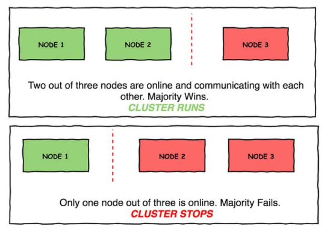
    - 클러스터의 안정성을 유지하기 위해 마스터 후보 노드는 **항상 3개 이상, 홀수 개수로** 유지하는 것을 권장함
    - -> 마스터 노드가 동시에 2개 생기는 것을 막기 위함

      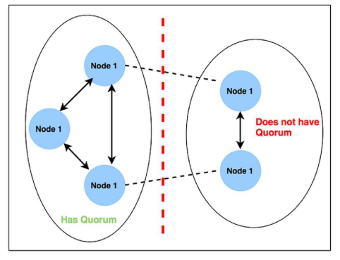
      - `Does not have Quorum` : 마스터 후보 노드는 살아있지만 서로 통신이 안되거나, 마스터 후보 노드가 1개만 남아있는 경우 Quorum을 만족하지 못함

- 마스터 후보 노드 구성 시 주의 사항
  - 한 번에 절반 이상의 노드 제거 금지
    - 클러스터에서 마스터 후보 노드를 절반 이상 제거하면 정상적인 운영이 어려움
    - 마스터 후보 노드가 짝수일 경우, 네트워크 분할(Split Brain) 발생 시 정상적인 투표 진행이 어려워짐
    - 3개의 마스터 후보 노드가 있을 때 2개를 제거하면 Quorum을 만족할 수 없어 클러스터가 중단될 수 있음

  - initial_master_nodes 와의 관계
    - initial_master_nodes 설정은 클러스터가 처음 부팅될 때 마스터 노드를 선출하는 데 사용됨
    - 클러스터가 정상 운영 중일 때는 해당 설정을 변경하지 않도록 해야 함

      ```yaml
      cluster.initial_master_nodes:
        - node-a
        - node-b
        - node-c
      ```

- Cluster 레벨 샤드 리밸런싱 설정
  - 클러스터 내 데이터 균형을 맞추기 위해 샤드를 재배치

    ```yml
    cluster.routing.rebalance.enable: all
    cluster.routing.rebalance.enable: primaries
    cluster.routing.rebalance.enable: replicas
    cluster.routing.rebalance.enable: none
    ```
    - `all` : 모든 샤드(기본 + 복제본) 에 대해 리밸런싱 허용
    - `primaries` : 기본 샤드(Primary shards)만 리밸런싱 허용
    - `replicas` : 복제본 샤드(Replica shards)만 리밸런싱 허용
    - `none` : 리밸런싱을 모두 금지. 장애 실험 등 특정 상황에 사용

  - 코드
    ```python
    es.cluster.put_settings(body={
      "persistent": {
        "cluster.routing.allocation.enable": "primaries"
      }
    })
    ```
    ```python
    es.cluster.put_settings(body={
      "persistent": {
        "cluster.routing.rebalance.enable": "always"
      }
    })
    ```
    ```yml
    cluster.routing.allocation.allow_rebalance: always
    cluster.routing.allocation.allow_rebalance: indices_primaries_active
    cluster.routing.allocation.allow_rebalance: indices_all_active
    ```
    - `always`는 항상 리밸런싱을 수행
    - `indices_primaries_active`는 프라이머리 샤드가 활성화된 경우 리밸런싱이 수행
    - `indices_all_active`는 모든 샤드가 활성화된 경우 리밸런싱이 가능하며 기본값

### 데이터 티어링
데이터를 핫(Hot), 웜(Warm), 콜드(Cold) 등의 계층(Tier)으로 나누어 저장하고 관리

- 클러스터 내 데이터 배포 전략

  
  - elasticsearch는 저장된 데이터를 성격에 따라 '티어(계층)'를 나누어 사용함
  - `hot` : 가장 자주 쓰이는 데이터를 저장하는 노드
    - 검색 속도 가장 빠름
    - 비용 비쌈
  - `warm` : 최근에는 자주 쓰지 않지만, 종종 검색이 필요한 데이터를 저장하는 노드
    - ex. 한두달 전 로그 등
  - `cold` : 거의 읽지 않는 데이터를 저장하는 노드
    - 장기 보관용 데이터를 저장
    - 속도 느리지만 비용 적게 듦

- 데이터 티어링을 활용하는 이유
  1. 비용 절감
      - 자주 사용하는 데이터는 SSD에서,
      - 오래된 데이터는 HDD 또는 원격 저장소(S3 등)에서 관리
  2. 성능 최적화
      - 핫 데이터는 고성능 노드에서 빠르게 처리
  3. 데이터 수명주기 관리
      - 오래된 데이터는 자동으로 이동
  4. 자동화 가능
      - Index Lifecycle Management (ILM) 정책을 통해 데이터가 자동으로 적절한 티어로 이동

- 노드 역할 설정
  ```yaml
  services:
    es-hot: …
    es-warm: …
    es-cold: …
  networks: …
  ```

- 데이터 할당 규칙 설정
  ```yaml
  cluster.routing.allocation.require._tier: data_hot
  cluster.routing.allocation.include._tier: data_warm
  cluster.routing.allocation.exclude._tier: data_cold
  ```

- 인덱스 레벨 티어링 설정
  ```yaml
  # 데이터가 특정 티어에 우선 할당되도록 설정
  index.routing.allocation.include._tier_preference: data_hot
  ```

- `data_engineering\07_Elasticsearch\Chapter2_아키텍처&데이터처리\docker-compose-tier.yml` 참고
  ```yaml
  es-hot:
    image: docker.elastic.co/elasticsearch/elasticsearch:8.17.1
    container_name: es-hot
    environment:
      - node.name=hot
      - cluster.name=es-cluster
      - discovery.seed_hosts=es-hot,es-warm,es-cold
      - cluster.initial_master_nodes=hot
      - node.roles=master,data_hot,data_content
      - xpack.security.enabled=false
      - ES_JAVA_OPTS=-Xms512m -Xmx512m
  ```
  - `image` : Elasticsearch 버전 8.17.1을 사용하는 도커 이미지
  - `container_name` : 컨테이너 이름을 es-hot으로 지정
  - `node.name` : 노드의 이름을 hot으로 지정
    - Elasticsearch 클러스터 내에서 이 노드를 구분하는 식별자 역할
  - `cluster.name` : 노드가 속할 Elasticsearch 클러스터의 
  - `discovery.seed_hosts` : 클러스터를 구성할 때 처음 발견할 수 있는 다른 노드들의 주소 목록
    - 클러스터 형성을 위해 es-hot, es-warm, es-cold 노드를 서로 인식하도록 설정
  - `cluster.initial_master_nodes`: 클러스터 초기 마스터 노드를 지정
    - 첫 마스터 노드 선출 시 사용되며, 클러스터를 처음 시작할 때만 필요함
  - `node.roles` : 이 노드가 수행할 역할들을 정의
    - `master` : 클러스터 관리를 위한 마스터 역할 수행
    - `data_hot` : **핫 티어용 데이터 노드 역할** (자주 접근하는 데이터 저장)
    - `data_content`: 일반 데이터 노드 역할도 함께 수행
  - `xpack.security.enabled` : Elasticsearch 보안 기능(X-Pack)을 비활성화
    - 테스트나 개발 환경에서는 보안을 꺼서 간편하게 사용
  - `ES_JAVA_OPTS` : Elasticsearch가 사용할 JVM 메모리 옵션
    - `-Xms` : 초기 힙 메모리
    - `-Xmx` : 최대 힙 메모리

### 계층 간 데이터 이동
- `_tier_preference: data_cold,data_warm,data_hot` 설정에 따른 Elasticsearch 데이터 할당 우선순위

  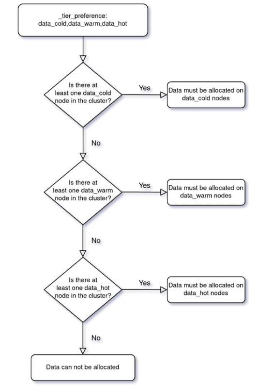
  1. 티어 우선순위는 cold → warm → hot 순서로 정해져 있으며, 클러스터에 해당 노드가 존재하는지 확인하며 차례로 내려감
  2. 클러스터에 `data_cold` 노드가 존재하면, 해당 인덱스는 cold 노드에 할당됨
  3. 만약 cold 노드가 없다면, data_warm 노드를 확인하고, 존재하면 warm 노드에 할당됨
  4. warm 노드도 없을 경우, data_hot 노드를 확인하고, 존재하면 hot 노드에 할당됨
  5. 위의 모든 티어에 해당 노드가 없다면, 데이터를 할당할 수 없으며 경고 상태가 됨

- 이러한 티어 우선순위 설정은 다음과 같은 운영적 이점을 제공함:
  - 유연한 데이터 할당
    - 클러스터 상태에 따라 적절한 티어에 데이터를 자동으로 할당하여 유연하게 대응할 수 있음
  - 명확한 자원 구분
    - 티어별 자원을 분리하여 데이터의 중요도나 접근 빈도에 따라 효율적으로 인프라를 구성할 수 있음
  - 운영 최적화
    - 티어 기반으로 스토리지 성능과 비용을 최적화하며, ILM 정책과 연계하여 자동화도 가능함

- 코드
  ```python
  from elasticsearch import Elasticsearch
  import time

  es = Elasticsearch("http://localhost:9200")
  index_name = "logs-000001"  # 인덱스

  print(es.cat.nodes(format="text", h="name,roles"))

  if es.indices.exists(index=index_name):
      es.indices.delete(index=index_name)

  es.indices.create(index=index_name, body={
      "settings": {
          "index.number_of_replicas": 0,
          "index.routing.allocation.include._tier_preference": "data_hot"   # 티어를 hot으로 배정
                       # 따라서 logs-000001 인덱스는 처음에 hot에 배치됨
      }
  })

  # .cat.shards: 어느 노드에 배치되어 있는지 확인
  print(es.cat.shards(index=index_name, format="text"))   # hot

  time.sleep(60)

  # 계층 이동: hot -> warm
  es.indices.put_settings(index=index_name, body={
      "index.routing.allocation.include._tier_preference": "data_warm"
  })
  time.sleep(10)

  print(es.cat.shards(index=index_name, format="text"))   # warm

  time.sleep(60)

  es.indices.put_settings(index=index_name, body={
      "index.routing.allocation.include._tier_preference": "data_cold"
  })
  time.sleep(10)

  print(es.cat.shards(index=index_name, format="text"))   # cold
  ```

### Index
- 인덱스 엘리어스
  - 인덱스 명을 대신하는 가상의 이름을 부여할 수 있음
  - 여러 개의 인덱스를 하나의 인덱스처럼 연결하여 사용 가능
  - 신규 인덱스에 데이터를 색인하고, 엘리어스를 이용해 다운타임 없이 인덱스를 교체 가능
    - 즉, 무중단 인덱스 교체 가능
  - `_alias API`를 사용하여 설정

  - 예시1
    - 인덱스 생성 시 alias 지정

    ```javascript
    // kibana
    PUT /products
    {
      "aliases": {
        "products_alias": {}
      }
    }
    ```
    ```python
    # python code
    es.indices.create(
      index="products",
      body={
        "aliases": {
          "products_alias": {}
        }
      }
    )
    ```

- 무중단 인덱스 변경
  - `products_alias`라는 별칭(alias)이 products 인덱스를 가리키고 있다고 가정
  - 새로운 인덱스를 생성한 후, 기존 인덱스에서 새 인덱스로 alias를 변경하여 무중단으로 전환 가능

  - 예시2
    - 새 인덱스 생성 + write 전용 alias 부여
      ```javascript
      // kibana
      PUT /products_v2
      {
        "aliases": {
          "products_write": {}
        },
        "mappings": {
          "properties": {
            "name": { "type": "text" },
            "brand": { "type": "keyword" },
            "price": { "type": "float" },
            "category": { "type": "keyword" },
            "rating": { "type": "float" }
          }
        }
      }
      ```
      ```python
      # python
      es.indices.create(
        index="products_v2",
        body={
          "aliases": {
            "products_write": {}
          },
          "mappings": {
            "properties": {
              "name": { "type": "text" },
              "brand": { "type": "keyword" },
              "price": { "type": "float" },
              "category": { "type": "keyword" },
              "rating": { "type": "float" }
            }
          }
        }
      )
      ```
  
    - 엘리어스 전환 (products → products_v2)
      ```javascript
      POST _aliases
      {
        "actions": [
          { "remove": { "index": "products", "alias": "products_alias" }},
          { "add": { "index": "products_v2", "alias": "products_alias" }}
        ]
      }
      ```
      ```python
      es.indices.update_aliases(
        body={
          "actions": [
            { "remove": { "index": "products", "alias": "products_alias" } },
            { "add": { "index": "products_v2", "alias": "products_alias" } }
          ]
        }
      )
      ```
      - products_v2 인덱스 생성 + products_alias에 write 전용 alias 지정
      - 기존 인덱스 (products)도 products_alias alias에 추가
  
  - 예시3
    - 읽기/쓰기 분리된 엘리어스 설정

      ```python
      # 두 인덱스를 모두 products_alias에 포함시키되,
      # 쓰기 전용 인덱스를 명시하여 데이터 삽입은 신규 인덱스로만 되도록 설정 가능
      es.indices.update_aliases(
        body={
          "actions": [
            {
              "add": {
                "index": "products",
                "alias": "products_alias",
                "is_write_index": False
              }
            },
            {
              "add": {
                "index": "products_v2",
                "alias": "products_alias",
                "is_write_index": True
              }
            }
          ]
        }
      )
      ```

※ `data_engineering\07_Elasticsearch\Chapter2_아키텍처&데이터처리\2_alias.py` 참고

### ILM (인덱스 생명주기 관리)
인덱스가 계속해서 쌓이는 환경(ex. 로그 등)에서 인덱스를 효율적이며 자동화로 관리할 수 있는 서비스

- ILM이 필요한 이유
  - 인덱스의 생성, 보관, 삭제 등을 자동화하여 시간과 노력 절약
  - 오래된 데이터를 저렴한 저장소로 이동하거나 자동 삭제하여 비용 절감
  - 최신 데이터와 오래된 데이터를 적절히 분리 저장하여 시스템 성능 개선
  - 데이터 보관 기간 자동 관리로 법적/규제 요구 충족
  - 중요도에 따라 가용성 조정
    - 최신 데이터 → 빠른 검색 & 높은 가용성
    - 오래된 데이터 → 저렴한 비용 & 낮은 가용성

- ILM (인덱스 생명주기 관리) 단계
  - 단계별 티어 맞게 정책에 따라 이동할 수 있게 함

    ```json
    {
      "phases": {
        "hot": {    // 핫 단계: 데이터가 생성되고 활발하게 읽고 쓰는 시기
          "actions": {
            "rollover": {    // 일정 조건에 따라 새로운 인덱스로 롤오버(전환)
              "max_age": "30d",    // 인덱스 생성 후 30일이 지나면 롤오버
              "max_size": "50gb"   // 인덱스 크기가 50GB를 넘으면 롤오버
            }
          }
        },
        "warm": {    // 웜 단계: 자주 쓰이지 않지만 여전히 조회되는 시기
          "min_age": "45d",   // 인덱스가 생성된 지 45일 이상일 때 진입 가능
          "actions": {
            "allocate": {
              "include": {
                "node_type": "warm"   // warm 노드로 데이터 이동
              }
            },
            "forcemerge": {
              "max_num_segments": 1
            }
          }
        },
        "cold": {
          "min_age": "60d",   // 인덱스 생성 후 60일이 지나야 cold 단계 진입
          "actions": {
            "allocate": {
              "include": {
                "node_type": "cold"   // cold 노드로 데이터 이동
              }
            }
          }
        }
      }
    }
    ```

- Alias (엘리아스)
  - 다수의 인덱스를 논리적으로 하나로 묶어서 사용하기 위한 논리적 이름
  - 하나의 alias가 여러 인덱스를 대표할 수 있음
  - 인덱스 이름이 계속 바뀌더라도, alias는 항상 고정 → 애플리케이션은 항상 alias만 사용하면 됨
  - ILM이나 Rollover에서 alias가 핵심 역할

- Rollover (롤오버)
  - 문서 수가 너무 많아지거나, 인덱스가 너무 오래되면 (일정 조건) → 새로운 인덱스를 자동 생성하고, alias를 새 인덱스로 옮김
  - rollover를 사용하려면 반드시 alias 설정이 필요
  - rollover 대상 alias에는 `"is_write_index": true` 설정이 반드시 있어야 함

- ILM 적용하여 index 자동 관리
  - Index Template 생성
    - `logs-*`처럼 특정 패턴으로 생성되는 인덱스에 대해, **자동으로 설정, 매핑, alias, ILM 정책을 지정**
    - 템플릿을 통해 자동화된 인덱스 관리의 시작점을 만들 수 있음

    ```js
    es.indices.put_index_template(name="demo-ilm-template", body={
      "index_patterns": ["demo-ilm-*"],   // 'demo-ilm-'로 시작하는 인덱스에 자동 적용
      "priority": 10,   // 템플릿 우선순위 (숫자가 클수록 우선)
      "template": {
        "settings": {
          "index.lifecycle.name": "simple-ilm-policy",    // 적용할 ILM 정책 이름
          "index.lifecycle.rollover_alias": "demo-ilm-write"  // 롤오버 시 참조할 alias 이름
        }
      }
    })
    ```
    - 즉, `demo-ilm-*` 패턴으로 만들어지는 인덱스는 자동으로 ILM 정책과 롤오버 alias 설정을 적용받음
  
  - 최초 인덱스 생성 + alias 설정

    ```js
    es.indices.create(index="demo-ilm-000001", body={
      "aliases": {
        "demo-ilm-write": {"is_write_index": True}  // 이 인덱스를 쓰기 전용 인덱스로 지정
      }
    })
    ```
    - 롤오버가 작동하려면 최초 인덱스(`demo-ilm-000001`)를 수동으로 한 번 만들어주고, 쓰기 alias를 설정해야 함
    - 이후 `demo-ilm-write` alias를 통해 데이터를 색인하면, ILM 정책에 따라 자동으로 롤오버됨
  
  - ILM 정책 생성
    
    ```js
    es.ilm.put_lifecycle(name="simple-ilm-policy", body={
      "policy": {
        "phases": {
          "hot": {   // 핫 단계: 색인이 활발한 시기
            "actions": {
              "rollover": {
                "max_docs": 5   // 문서가 5개 이상이면 새 인덱스로 자동 전환
              }
            }
          },
          "delete": {   // 삭제 단계: 일정 기간 이후 인덱스 삭제
            "min_age": "2m",    // 인덱스 생성 후 2분이 지나면
            "actions": {
              "delete": {}    // 인덱스를 자동 삭제
            }
          }
        }
      }
    })
    ```
  
  - 결과 출력

    ```text
    ILM 상태 요약:
    인덱스: demo-ilm-000001
    정책: simple-ilm-policy
    경과 시간: 10.52s
    현재 단계: hot
    rollover 조건 (max_docs): 5

    rollover 발생 여부 확인 (12초 대기 중)...

    demo-ilm-write alias가 가리키는 인덱스들:
    - demo-ilm-000001 (읽기 전용)
    - demo-ilm-000002 (쓰기 대상)
    ```

※ `data_engineering\07_Elasticsearch\Chapter2_아키텍처&데이터처리\3_ilm.py` 참고
