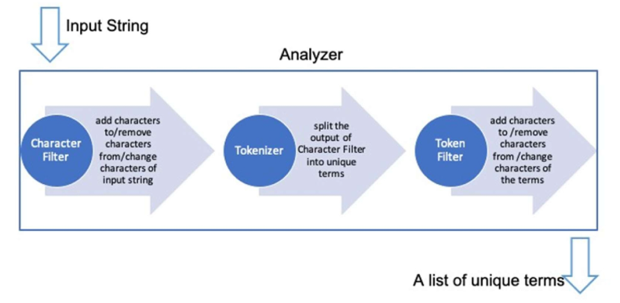
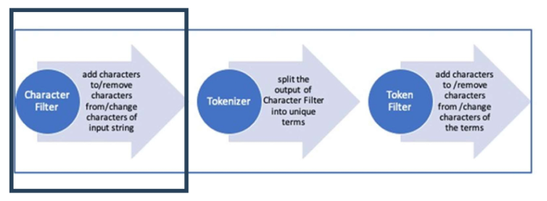
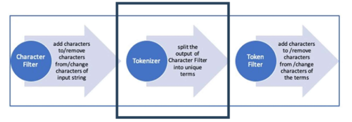
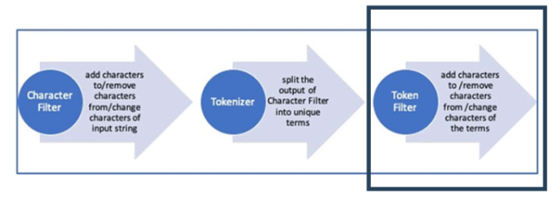

# Elasticsearch Analyzer & Mapping
## Mapping
### Elasticsearch Mapping
- Mapping
  - 관계형 데이터베이스의 스키마(Schema) 와 유사한 개념
  - Elasticsearch에서 **문서(Document)의 필드 유형과 속성을 정의**
- 동적 매핑(Dynamic Mapping)
  - 매핑을 명시적으로 설정하지 않아도 Elasticsearch가 자동으로 생성
    - Elasticsearch가 데이터를 색인하는 시점에 자동으로 데이터 타입 추론하여 매핑해줌
    - 따라서 매핑(스키마)를 따로 정의하지 않아도 됨
    - 그러나 자동 지정이라서 사용자의 의도와 다른 타입이 지정될 수 있음
  - 편리하지만, 잘못된 데이터 타입 할당 가능성이 있음
- 정적 매핑(Explicit Mapping)
  - 사전에 명확하게 매핑을 정의하여 정확한 데이터 타입을 설정
  - 검색 성능 최적화 및 불필요한 리소스 낭비 방지 가능

### Dynamic Mapping
Elasticsearch에서 문서를 색인할 때 필드 이름과 데이터 유형을 **자동으로 결정**하는 기능 (추론함)

-> 관계형 데이터베이스의 스키마(Schema)와 유사한 개념이지만, **사전 정의 없이도 데이터 유형이 결정됨**

- 동적 매핑 특징
  - 자동 매핑
    - 필드를 사전에 정의하지 않아도 문서를 색인하면 자동으로 매핑
  - 규칙 설정 가능
    - 동적 필드 매핑 규칙을 사용하여 원하는 방식으로 동작하도록 설정 가능
  - 데이터 유형 결정
    - 새로운 필드가 감지되면 해당 필드의 데이터 유형을 자동으로 판단하여 매핑
  - 오류 가능성
    - 자동으로 할당된 데이터 유형이 잘못될 경우 검색 오류 발생 가능
  - 파라미터 설정 가능
    - 동적 매핑을 활성화하거나 비활성화하는 설정을 조정 가능

- Dynamic parameter

  ```python
  # 클라이언트 연결 필수
  es = Elasticsearch("http://localhost:9200")

  # products 인덱스 생성
  es.indices.create(index="products", body={"mappings": {"dynamic": "runtime"}})
  ```
  | 설정값 | 동작 |
  |--------|------|
  | true | 새로운 필드가 자동 추가됨 (기본값) |
  | runtime | 새로운 필드는 색인되지 않고 쿼리 시 로드 |
  | false | 새로운 필드는 무시됨 |
  | strict | 새로운 필드 추가 시 오류 발생 |

### Explicit Mapping
정적 매핑은 문서에 저장될 데이터의 필드와 타입을 사전에 정의하는 방식

- 인덱스 생성 시점에 필드 타입을 미리 지정해야 함
- 한 번 설정된 매핑은 일부 변경이 제한됨

- Explicit parameter
  ```python
  # 클라이언트 연결
  es = Elasticsearch("http://localhost:9200")

  # 인덱스 생성
  es.indices.create(
      index="products",
      body={
          "mappings": {
              "properties": {
                  "name": {"type": "text"},
                  "brand": {"type": "keyword"},
                  "price": {"type": "float"},
                  "category": {"type": "keyword"},
                  "rating": {"type": "float"}
              }
          }
      }
  )
  ```
  ```json
  // kibana
  PUT products
  {
    "mappings": {
      "properties": {
        "name": { "type": "text" },
        "brand": { "type": "keyword" },
        "price": { "type": "float" },
        "category": { "type": "keyword" },
        "rating": { "type": "float" }
      }
    }
  }
  ```
  - 인덱스 성공 시 결과 반환

    ```json
    {
      "acknowledged": true,
      "shards_acknowledged": true,
      "index": "products"
    }
    ```

### Elasticsearch 필드 데이터 타입
- 지형 데이터 타입 (Geo Data Types)
  - 위치 정보(지도 데이터) 검색 및 분석 시 사용
  - `geo_point`, `geo_shape`

- 계층 구조 데이터 타입 (Hierarchical Data Types)
  - JSON 구조 -> 중첩되어 있음
    - 이러한 구조를 Elasticsearch에서 활용할 수 있게 해주는 타입
  - `Object`, `Nested`
    - Object: 일반적인 중첩 구조
    - Nested: 배열형태로, 객체 내부에서 각각의 객체를 독립적으로 다뤄야할 때 사용

- 일반 데이터 타입
  - 문자열 데이터 타입: `keyword`, `text`
    - keyword: 문구 자체 검색
    - text: 전문 검색 (fall text search)
  - `date`
  - `long`, `double`, `integer`
  - `boolean`

### 문자열 데이터 타입
text, keyword는 가진 특징뿐만 아니라 검색 처리 방식도 다름

- Text
  - 전문(full-text) 검색을 위한 분석(토큰화)이 적용된 문자열
  - 과정
    - 입력한 문장 -> analyzer (분석기)를 통해 토큰화하여 단어 단위로 분해하여 저장 -> 인덱싱(색인)
- keyword
  - 정렬 및 필터링에 최적화된 문자열
  - 분석기를 통과하지 않음
    - 즉, 분석기를 거쳐 토큰화 또는 연산(소문자화)을 하지 않기 때문에 명확하게 일치하는 경우만 다룸
    - ex. Elasticsearch ≠ elasticsearch
- 공간을 절약하고 쓰기 속도를 높이기 위해 색인 전 매핑을 설정하는 것이 유리함

### Keyword 필드 타입
- 데이터 변형 없이 저장 → 분석기(analyzer)를 적용하지 않음
- 공백과 대소문자를 구분하지 않음 → **정확한 검색 수행**
- 집계, 정렬, 필터링 등에 적합
- keyword, constant_keyword, wildcard 등의 타입으로 설정 가능

- Keyword 타입을 사용하는 경우
  - 정확한 값으로 검색해야 하는 항목
    - 태그(tags), 카테고리(category)
  - 정렬이 필요한 데이터
    - 브랜드명(brand), 사용자 ID(user_id)
  - 집계(Aggregation)이 필요한 데이터
    - 로그 수준(log_level), 국가 코드(country_code)

- Keyword 설정 코드

  ```json
  // kibana
  "mappings": {
    "properties": {
      "name": {
        "type": "keyword"
      }
    }
  }
  ```
  ```python
  es.indices.create(
      index="your_index_name",
      body={
          "mappings": {
              "properties": {
                  "name": {
                      "type": "keyword"
                  }
              }
          }
      }
  )
  ```

  - 결과 반환
    ```json
    {
      "acknowledged": true,
      "shards_acknowledged": true,
      "index": "your_index_name"
    }
    ```

### Keyword 필드 타입 : `constant_keyword`
문서마다 동일한 값이 들어가는 필드에 사용 (상수처럼 쓰겠다는 뜻)
- 색인 크기를 줄이고 검색 속도를 높임
- 필터링(Querying) 성능 최적화에 적합
- 수정 불가능

  ```json
  {
    "mappings": {
      "properties": {
        "brand": {
          "type": "constant_keyword",
          "value": "Samsung"
        }
      }
    }
  }
  ```
  ```python
  # products 인덱스 안에 
  # brand라는 고정된 필드에 대해
  # 값(value)을 "Samsung"으로 고정시키자
  es.indices.create(
      index="products",
      body={
          "mappings": {
              "properties": {
                  "brand": {
                      "type": "constant_keyword",
                      "value": "Samsung"
                  }
              }
          }
      }
  )
  ```
  - 결과 반환
    ```json
    {
      "acknowledged": true,
      "shards_acknowledged": true,
      "index": "products"
    }
    ```

### Keyword 필드 타입 : `wildcard`
Wildcard 필드 타입은 부분 일치 검색(패턴 검색)을 위해 사용되는 필드 타입임

- 전체 필드 값을 저장하며, 내부적으로 n-gram을 사용하여 인덱싱
- 정확한 값 일치가 아닌 패턴 검색이 가능 ( `*`, `?` 와 같은 와일드카드 문자 사용 가능)
- wildcard, regexp 쿼리에서 활용
- 검색 속도가 느림 → 일반적으로 대량의 데이터에서 사용 시 성능 저하
- 구조화되지 않은 콘텐츠(로그, 텍스트 등)를 저장하는 필드에 적합

  ```json
  // kibana
  "mappings": {
    "properties": {
      "name": {
        "type": "wildcard"
      }
    }
  }
  ```
  ```python
  # python
  es.indices.create(
      index="products",
      body={
          "mappings": {
              "properties": {
                  "name": {
                      "type": "wildcard"
                  }
              }
          }
      }
  )
  ```

### Text 필드 타입
입력된 텍스트를 분석기(Analyzer)를 사용해 토큰으로 분리함

- 부분 검색 가능 → 입력된 단어의 일부만 일치해도 검색 결과에 포함됨
- 공백, 대소문자, 형태소 분석 등 다양한 처리가 가능
- 정확한 검색보다는 문서 검색과 연관성 기반 검색에 적합
  - 명확한 일치 검색을 원하면 keyword 필드 타입이 적합

  ```json
  // kibana
  {
    "mappings": {
      "properties": {
        "name": {
          "type": "text"
        }
      }
    }
  }
  ```
  ```python
  # python
  es.indices.create(
      index="products",
      body={
          "mappings": {
              "properties": {
                  "name": {
                      "type": "text"
                  }
              }
          }
      }
  )
  ```

### Text 필드 타입 : `match_only_text`
전체 텍스트에 대해 쿼리 수행이 가능하지만, 점수를 매기지 않음(스코어링XX)

- 로그 분석 시 주로 사용
- keyword 필드와 text 필드의 중간 단계
- 전체 텍스트 쿼리를 실행하며 점수를 매기지 않음
- 정렬이나 집계가 필요 없을 경우 적합
  - 매칭만 되면 데이터 가져오고 싶을 때 주로 사용

  ```json
  // kibana
  {
    "mappings": {
      "properties": {
        "name": {
          "type": "match_only_text"
        }
      }
    }
  }
  ```
  ```python
  # python
  es.indices.create(
      index="products",
      body={
          "mappings": {
              "properties": {
                  "name": {
                      "type": "match_only_text"
                  }
              }
          }
      }
  )
  ```

### Text 필드 타입 : `search_as_you_type`
자동 완성(Autocomplete) 검색을 지원하는 데이터 타입

- n-gram 분석기를 사용하여 전방 일치(prefix match) 또는 중간 일치(substring match) 검색 가능
- 검색 시 입력이 점진적으로 확장되는 형태의 검색을 지원
- 매핑에 지정된 분석기 사용 / 별도 분석기가 없으면 기본(Standard) 분석기 사용

  ```json
  // kibana
  {
    "mappings": {
      "properties": {
        "name": {
          "type": "search_as_you_type"
        }
      }
    }
  }
  ```
  ```python
  # python
  es.indices.create(
      index="products",
      body={
          "mappings": {
              "properties": {
                  "name": {
                      "type": "search_as_you_type"
                  }
              }
          }
      }
  )
  ```


## Index
indexing을 통해 검색 성능이 결정됨

### Forward Index vs Inverted Index
- Forward Index (정방향 인덱스)
  - **문서 중심**으로 인덱스를 구축
  - 각 문서가 포함하는 단어 목록을 저장
  - 인덱스 구축이 단순하지만, 검색 속도가 느림 (모든 문서를 순회해야 함)
  - 특정 문서의 내용을 확인할 때 유용
  ```text
  문서 1 → ["Elasticsearch", "검색", "엔진"]
  문서 2 → ["Kibana", "시각화", "도구"]
  ```

- Inverted Index (역방향 인덱스 = 역색인)
  - **단어 중심**으로 인덱스를 구축
  - 각 단어가 포함된 문서 목록을 저장
  - **Elasticsearch에서 기본적으로 사용하는 방식**
  - 검색 시 특정 단어를 빠르게 찾을 수 있음
  ```text
  "검색" → [문서 1]
  "엔진" → [문서 1]
  "Kibana" → [문서 2]
  ```

- Inverted Index(역방향 인덱스)에서 forward index 활용
  - `fielddata`
    - 특정 텍스트 필드에 대한 정렬, 집계(aggregation) 시 사용
    - 메모리 사용량이 증가하는 단점이 있음 (text 데이터 자체를 메모리에 올려서 사용하기 때문)

    ```json
    // kibana
    PUT my_index/_mapping
    {
      "properties": {
        "my_field": {
          "type": "text",      // text 필드 지정 후
          "fielddata": true    // fielddata -> true 설정
        }
      }
    }
    ```
    ```python
    # python
    es.indices.put_mapping(
        index="my_index",
        body={
            "properties": {
                "my_field": {
                    "type": "text",   # text 필드 지정 후
                    "fielddata": True   # fielddata -> true 설정
                }
            }
        }
    )
    ```

  - `doc_values`
    - 메모리 사용량을 줄이기 위해 **디스크 기반 컬럼 저장 방식** 사용
      - 즉, 메모리가 아닌, 디스크에 정렬 가능한 형태로 저장함
    - 기본적으로 **비 텍스트 필드에서 활성화됨**
    - keyword 필드 활용 가능

    ```json
    // kibana
    PUT my_index/_mapping
    {
      "properties": {
        "user_name": {
          "type": "text",
          "fields": {
            "keyword": {
              "type": "keyword",
              "ignore_above": 256   // 256자 초과하면 색인하지XX
            }
          }
        }
      }
    }
    ```
    ```python
    # python
    es.indices.put_mapping(
        index="my_index",
        body={
            "properties": {
                "user_name": {
                    "type": "text",
                    "fields": {
                        "keyword": {
                            "type": "keyword",
                            "ignore_above": 256
                        }
                    }
                }
            }
        }
    )
    ```
    - 위와 같이 하위 필드를 keyword 타입으로 지정하여 효율적인 성능 및 리소스 사용이 가능해짐 (하위 타입 keyword 필드로 지정) 


## Analyzer
### Analyzer (분석기)
Analyzer는 문서를 색인하고 검색할 때 텍스트를 처리하는 방식

※ text 타입에 대한 것임을 기억할 것 !!

- 문서의 내용을 토큰(token)으로 변환하여 색인 및 검색
  - Analyzer를 거친 단어들만 검색 가능
  - 즉, Analyzer는 전처리기 역할
- 어떤 Analyzer 사용하고 실행 순서를 정하는 것이 중요함
  - Analyzer의 설정 방식에 따라 검색 결과가 달라질 수 있음
- 너무 많은 분석을 하면 색인 성능 저하
  - Analyzer가 복잡할수록 색인 속도가 느려질 수 있음
  - 또는 검색 정확도가 떨어질 수 있으니 주의

### 색인과 검색에서의 Analyzer의 차이
- 색인할 때 분석기와 검색할 때 분석기가 다를 수도 있음
- 일반적으로 색인과 검색 시 같은 tokenizer를 사용하는 것이 좋음

- 색인과 검색에 다른 분석기를 적용하는 경우
  - 검색어 필터링이 필요한 경우
    - 검색어에서 의미 없는 단어(불용어)를 제거해야 하는 경우
    - 특정 단어를 제외하고 검색해야 하는 경우
  - 동의어나 맞춤법 교정을 적용하는 경우
    - "car"를 검색하면 "automobile"도 검색되도록 설정
    - "color"와 "colour"를 동일하게 처리

### Analyzer 구성요소
분석기(Analyzer)는 검색 성능을 향상시키기 위해 문서를 토큰화(tokenization)하고, 텍스트를 변환하는 기능을 수행함

- Character Filter → Tokenizer → Token Filter 순서로 진행

  
  - Input String
    - 검색어, 문장 등 문자열
  - 문자 전처리 -> 토큰 분리 -> 토큰 정제 순서
  - A list of unique terms
    - 검색이 가능한 고유한 단어 리스트 형태

- Character Filters (문자 필터)
  - 원본 텍스트를 전처리하는 단계
  - **특정 문자나 패턴을 변환하거나 제거함**
  - `html_strip` : HTML 태그 제거
  - `mapping` : 특정 문자열을 다른 문자열로 매핑
  - `pattern_replace` : 정규식을 이용한 텍스트 변경

    

- Tokenizer (토크나이저)
  - Character Filter를 거친 텍스트를 **특정 규칙에 따라 토큰(단어 단위)으로 분리**
  - 분석기 구성 시 한 개의 Tokenizer만 사용 가능
  - `whitespace` : 공백 기준으로 단어 분리
  - `standard` : 일반적인 텍스트 토큰화
  - `ngram` : 부분 문자열(서브스트링) 단위로 분리

    
    - 서비스 성격에 맞게 토큰을 나누는 과정을 커스터마이징 하는 경우가 많음

- Token Filters (토큰 필터)
  - Tokenizer를 통해 분리된 토큰을 추가, 수정, 삭제하는 필터 (후처리 단계)
  - 여러 개를 배열로 사용 가능
  - `lowercase` : 모든 단어를 소문자로 변환
  - `stop` : 불용어(ex. "the", "is") 제거
  - `synonym` : 동의어 처리 (ex. "car" ↔ "automobile")

    

### _analyze API
_analyze API 는 커스텀 분석기(Analyzer)를 *테스트할 수 있도록 제공되는 API*

- `whitespace` : 공백을 기준으로 텍스트를 분리
- `token`: 분리된 단어
- `start_offset` / `end_offset` : 원본 텍스트에서 시작/끝 위치
- `position` : 토큰의 순서

  ```json
  // kibana
  POST _analyze
  {
    "analyzer": "whitespace",
    "text": "삼성 청년 SW 아카데미"
  }
  ```
  ```python
  # python
  # .analyze(body={..})
  response = es.indices.analyze(body={
      "analyzer": "whitespace",
      "text": "삼성 청년 SW 아카데미"
  })
  ```

- 결과 반환
  ```json
  "tokens": [
    {
      "token": "삼성",
      "start_offset": 0,
      "end_offset": 2,
      "type": "word",
      "position": 0
    },
    {
      "token": "청년",
      "start_offset": 3,
      "end_offset": 5,
      "type": "word",
      "position": 1
    },
    {
      "token": "SW",
      "start_offset": 6,
      "end_offset": 8,
      "type": "word",
      "position": 2
    },
    {
      "token": "아카데미",
      "start_offset": 9,
      "end_offset": 13,
      "type": "word",
      "position": 3
    }
  ]
  ```

### Analyzer 조합 (Custom Analyzer)
- custom analyzer를 생성할 때 여러 가지 요소를 조합 가능
- tokenizer는 하나만 지정할 수 있으며, char_filter와 filter는 여러 개 적용 가능

  ```json
  // kibana

  // 순서는 항상 char_filter -> tokenizer -> filter
  GET _analyze
  {
    "char_filter": [
      "html_strip"  // html 태그 제거 (전처리)
    ],
    "tokenizer": "whitespace",
    "filter": [
      "stop",   // 불용어 제거
      "lowercase"   // 소문자화
    ],
    "text": [
      "<b>삼성 갤럭시</b> S25 Ultra"
    ]
  }
  ```
  ```python
  # python
  response = es.indices.analyze(body={
      "char_filter": ["html_strip"],
      "tokenizer": "whitespace",
      "filter": ["stop", "lowercase"],
      "text": ["<b>삼성 갤럭시</b> S25 Ultra"]
  })
  ```

  - 결과 반환

    ```json
    "tokens": [
      {
        "token": "삼성",
        "start_offset": 3,
        "end_offset": 5,
        "type": "word",
        "position": 0
      },
      {
        "token": "갤럭시",
        "start_offset": 6,
        "end_offset": 13,
        "type": "word",
        "position": 1
      },
      {
        "token": "s25",
        "start_offset": 14,
        "end_offset": 17,
        "type": "word",
        "position": 2
      },
      {
        "token": "ultra",
        "start_offset": 18,
        "end_offset": 23,
        "type": "word",
        "position": 3
      }
    ]
    ```
    - 색인 시 처리를 하는 것이지, 원문은 그대로 가지고 있음 (ex. start_offset: 3)

### 한국어 Analyzer (Nori Analyzer)
한국어 처리를 위해 nori 분석기를 제공함

- nori 분석기 특징
  - 형태소 기반 분석기로, 한국어의 복잡한 문장 구조를 효과적으로 분석
  - Elasticsearch 기본 패키지가 아니므로 설치 필요

- nori 분석기 구성요소
  - Tokenizer (토크나이저)
    - `nori_tokenizer` : 형태소 분석을 수행하여 단어를 분리
- Token Filters (토큰 필터)
  - `nori_part_of_speech` : 품사 기반 필터링 (ex. 명사만 남기기)
  - `nori_readingform` : 한자/외래어 등을 한글 발음으로 변환
  - `nori_number` : 숫자를 표준화 (예: "일" → "1")
    - 숫자 검색 일관성 확보 가능

- 한국어 Tokenizer (Nori Tokenizer)
  - 한국어 형태소 분석기
    - 단순 공백 단위 분리가 아닌, 형태소 기반 분리
  - 형태소 분석을 지원하지 않는 기본 분석기 사용 시 복합명사를 적절히 분해할 수 없음
    - Nori Tokenizer는 복합명사 분해 가능, 의미 단위로 분리 가능

  - 사용자 정의 사전(user_dictionary) 지원
    - ex. 기본 사전에는 없는 도메인 특화 용어(ex. "GPT온라인", "삼성바이오로직스")를 등록하여 분석 품질 향상
  - 복합명사 처리 방식(decompound_mode) 선택 가능
    - `none` → 복합명사를 분해하지 않고 그대로 유지
      - ex. "자동차보험" → "자동차보험"
    - `discard` → 복합명사를 분해하되, 어근은 버리고 분해된 단어만 사용
      - ex. "자동차보험" → "자동차", "보험" (원래 단어는 버림)
    - `mixed` → 원래 복합명사와 분해된 형태를 모두 보유
      - ex. "자동차보험" → "자동차보험", "자동차", "보험"
  - 기본적으로 구두점(discard_punctuation) 제거
    - ex. "안녕하세요! 만나서 반가워요." → "안녕하세요", "만나서", "반가워요" (구두점 제거)

  ```json
  // kibana
  PUT /products
  {
    "settings": {
      "index": {
        "analysis": {
          "tokenizer": {
            "nori_tokenizer": {
              "type": "nori_tokenizer",
              "decompound_mode": "mixed",
              "discard_punctuation": "false"
            }
          },
          "analyzer": {
            "custom_nori_analyzer": {
              "type": "custom",
              "tokenizer": "nori_tokenizer"
            }
          }
        }
      }
    }
  }
  ```
  ```python
  # python 
  es.indices.create(
      index="products",
      body={
          "settings": {
              "index": {
                  "analysis": {
                      "tokenizer": {
                          "nori_tokenizer": {
                              "type": "nori_tokenizer",
                              "decompound_mode": "mixed",
                              "discard_punctuation": "false"
                          }
                      },
                      "analyzer": {
                          "custom_nori_analyzer": {
                              "type": "custom",
                              "tokenizer": "nori_tokenizer"
                          }
                      }
                  }
              }
          }
      }
  )
  ```

- 품사 기반 토큰 필터 적용 : `nori_pos_filter`

  ```json
  PUT /products
  {
    "settings": {
      "index": {
        "analysis": {
          "tokenizer": {
            "nori_tokenizer": {
              "type": "nori_tokenizer",
              "decompound_mode": "mixed",
              "discard_punctuation": "false"
            },
          "filter": {
            "nori_pos_filter": {
              "type": "nori_part_of_speech",
              "stoptags": [
                "E", "IC", "J", "MAG", "MAJ", "MM",
                "SP", "SSC", "SSO", "SC", "SE",
                "XPN", "XSA", "XSN", "XSV",
                "UNA", "NA", "VSV"
              ]
            }
          },
          "analyzer": {
            "custom_nori_analyzer": {
              "type": "custom",
              "tokenizer": "nori_tokenizer",
              "filter": ["nori_pos_filter"]
            }
          }
        }
      }
    }
  }}
  ```

### 동의어 처리
색인 시 동의어 처리와 검색 시 동의어 처리 두 가지 방식 가능

- 색인 시 동의어 처리
  - 색인(indexing) 시점에서 동의어를 확장하여 저장하는 방식
    - 동의어를 처음부터 확장 저장하므로 검색 시 성능 빠름
    - but, 동의어 수정 시 수정할 단어에 색인되어 있던 애들 다 처리 후 수정해야 하므로 유지보수에 대한 리소스 비용이 큼

- 검색 시 동의어 처리
  - 검색(query) 시점에서 동의어를 확장하여 질의하는 방식
    - 색인은 그냥 함
    - 검색 시 동의어까지 같이 검색하도록 하여 동의어 형태를 실시간 수정 가능함
    - 검색 시점에 불러오기 때문
    - but, 쿼리가 매우 많다면 쿼리마다 동의어 확장하므로 검색 속도에 부담 생길 수 있음

※ 속도, 성능이 중요하다면 색인 시 동의어 처리

※ 유지보수가 중요하다면 검색 시 동의어 처리

### 색인 시 동의어 처리
색인(indexing) 시점에서 동의어를 확장하여 저장하는 방식

- 문서가 색인될 때 미리 동의어를 확장하여 저장하므로, 검색 시 추가적인 처리가 필요하지 않음
- 검색 시점에서 별도의 동의어 매핑 작업이 필요하지 않음
- 색인된 데이터의 크기가 증가할 수 있음
- 새로운 동의어를 추가하려면 전체 데이터 재색인(reindexing)이 필요

  ```json
  PUT /products
  {
    "settings": {
      "analysis": {
        "filter": {
          "synonym_filter": {       // 필터 내에 synonym_filter 선언
            "type": "synonym",
            "synonyms": [
              "notebook, laptop",   // 동의어 그룹 확장
              "smartphone, mobile"
            ]
          }
        },
        "analyzer": {
          "synonym_analyzer": {
            "type": "custom",
            "tokenizer": "standard",
            "filter": ["lowercase", "synonym_filter"]
          }
        }
      }
    },
    "mappings": {
      "properties": {
        "description": {
          "type": "text",
          "analyzer": "synonym_analyzer"
        }
      }
    }
  }
  ```

### 검색 시 동의어 처리
검색(query) 시점에서 동의어를 확장하여 질의하는 방식

- 색인된 문서를 변경할 필요가 없으며, 동의어를 추가하면 즉시 반영
- 검색 시 추가적인 처리 비용이 발생하여 성능이 저하될 수 있음
- 동의어를 잘못 등록하면 쿼리가 예상치 못한 단어를 포함해 검색 품질이 저하될 수 있음

  ```json
  PUT /products
  {
    "settings": {
      "analysis": {
        "filter": {
          "synonym_filter": {
            "type": "synonym",
            "synonyms": [
              "notebook, laptop",
              "smartphone, mobile"
            ]
          }
        },
        "analyzer": {
          "synonym_analyzer": {
            "type": "custom",
            "tokenizer": "standard",
            "filter": ["lowercase", "synonym_filter"]
          }
        }
      }
    },
    // 색인 시 동의어 처리와 방식 동일하지만 mapping 설정만 다름
    "mappings": {
      "properties": {
        "description": {
          "type": "text",
          "analyzer": "standard",
          "search_analyzer":  "synonym_analyzer"  // search_analyzer: 검색 시에만 적용하겠다는 파라미터
        }
      }
    }
  }
  ```

### 동의어 사전 구성
- 단어 동등 관계 (A, B)
  - 색인할 때 A와 B를 동일한 의미로 저장
  - 검색 시 A를 입력해도 B를 입력해도 같은 문서가 검색

  ```json
  "synonyms": [
    "notebook, laptop"  // A, B를 나열하여 동일한 의미로 저장
  ]
  ```

- 단어 치환 단계 (A → B)
  - 색인할 때 A를 B로 변환하여 저장
  - 검색할 때 A를 검색해도 검색되지 않음
  - 검색 시 A → B로 변환 후 검색하면 기존 A로 저장된 문서는 검색되지 않음
    - 대표 키워드 하나로 통일하고 싶을 때 사용

  ```json
  "synonyms": [
    "notebook => laptop"  // A를 B로 변환하여 저장
  ]
  ```

### 동의어 사전 불러오기
- 동의어 사전 저장 위치
  - Elasticsearch 노드의 config 폴더 하위에 동의어 사전을 생성
  - 일반적으로 `config/dictionary` 디렉토리에 `synonyms.txt` 같은 파일로 저장

  - 예시: `synonyms.txt`
    ```txet
    갤럭시, galaxy
    삼성, samsung
    울트라, Ultra
    ```

- 동의어 사전 리로드 API
  - 색인이 아닌 검색 시 동의어를 적용할 경우, **사전 업데이트가 즉시 반영되지 않음**
  - 새로운 동의어를 반영하려면 리로드 API를 실행해야 함
    - 적용되려면 리로드 과정 필요
  - 리로드 API 실행 후 캐시를 비워야 변경 내용이 반영됨

  ```js
  POST /products/_reload_search_analyzers
  ```
  ```js
  POST /products/_cache/clear?request=true
  ```

### 불용어 (Stopword) 처리
- 불용어 사전
  - Elasticsearch 노드의 `config/dictionary/` 폴더에 파일을 생성
  - 불용어로 지정된 단어들은 색인 및 검색에서 제외
  - 검색타임에도 사전을 리로드 가능
  - 내용을 한 줄에 하나씩 입력해 txt 파일로 저장

  - 예시: `stopwords.txt`
    ```
    the
    and
    is
    was
    a
    an
    of
    ```

### 불용어(Stopword) 필터 적용
- 분석기 (search_stop_analyzer)
  - `search_stop_filter` 적용 → stopwords.txt에 있는 단어 제거
- 불용어 필터 (search_stop_filter)
  - `stopwords_path` 옵션을 사용해 불용어를 파일에서 로드
  - 색인/검색 시 특정 단어가 제거됨

- 예시 설정
  ```json
  PUT /products
  {
    "settings": {
      "index": {
        "analysis": {
          "analyzer": {
            "search_stop_analyzer": {
              "tokenizer": "whitespace",
              "filter": ["search_stop_filter"]
            }
          },
          "filter": {
            "search_stop_filter": {
              "type": "stop",
              "stopwords_path": "dictionary/stopwords.txt"  // config/dictionary/stopwords.txt
            }
          }
        }
      }
    }
  }
  ```

### 사용자 사전 처리
단어 형태를 강제로 지정해 복합명사 단일명사로 원하는 형태로 검색하기 위한 방식  

- `decompound_mode: "mixed"` : 복합어 처리를 적절하게 수행  
- `discard_punctuation: "false"` : 구두점 유지  
- `user_dictionary: "dictionary/userdic_ko.txt"` : 사용자 사전 적용
  - txt에 들어있는 단어는 분리하지 않고 하나의 명사로 사용하라는 것을 명시
- 향후 색인 및 검색 시 적용 가능  
- 사용자 사전 예시 파일: `dictionary/userdic_ko.txt`
  ```
  아이폰
  삼성갤럭시 삼성 갤럭시
  ```
  - 아이폰을 고유명사로 쓰고 싶을 때 (아이, 폰으로 분리되지 않기를 원할 때) 사용
  - 여러 요소 동시에 사용
    - 왼쪽(ex. 삼성갤럭시)이 최종 형태
    - 오른쪽(ex. 삼성 갤럭시)은 단어가 매칭될 수 있는 패턴
    - 따라서 띄어쓰기 된 단어(ex. 삼성 갤럭시)가 입력으로 들어오면 한 단어(ex. 삼성갤럭시)로 처리

- 예시 설정
  ```json
  PUT /products
  {
    "settings": {
      "index": {
        "analysis": {
          "tokenizer": {
            "nori_custom_tokenizer": {
              "type": "nori_tokenizer",
              "decompound_mode": "mixed",
              "discard_punctuation": "false",
              "user_dictionary": "dictionary/userdic_ko.txt"
            }
          },
          "analyzer": {
            "user_dic_analyzer": {
              "type": "custom",
              "tokenizer": "nori_custom_tokenizer"
            }
          }
        }
      }
    }
  }
  ```
