# Hadoop 설치와 기본 구조
## Hadoop 개요
### Hadoop의 필요성과 역할 이해
- Spark는 빠르지만, 저장은 누가?
    - Spark는 메모리 기반 처리이기 때문에 데이터 처리가 빠름
    - Spark는 처리에 강하지만 저장에 약함

    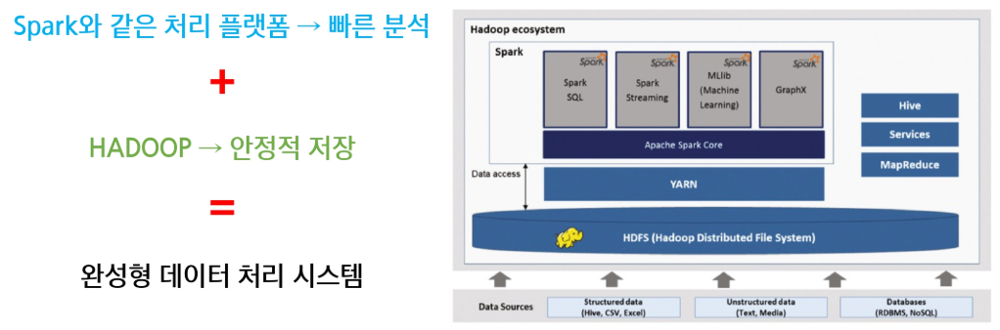

### Hadoop 등장 배경
- 기존 기술(DBMS, 단일 서버)의 용량, 속도, 확장성의 한계 도달
- 정형 데이터 중심 -> 비정형 데이터(이미지, 영상, 텍스트 등) 처리에 대한 요구 증가
- 웹 환경에서 데이터 양적 성장에 따라 신뢰성 높은 저장, 배치 처리 필요성 증대

    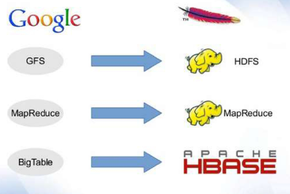
    - 구글의 GFS, MapReduce, BigTable에서 파생됨
        - GFS : 
        - MapReduce : 
        - BigTable
    - 하둡은 구글의 ㅇ..를 오픈소스화 해서 누구나 사용할 수 있게 한 것

### Hadoop의 역사
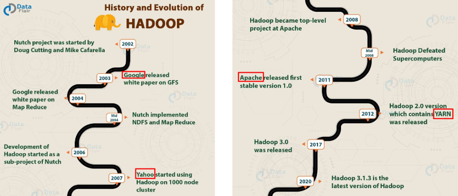

### Hadoop
대량 데이터를 안정적으로 처리하기 위해 설계된 오픈소스 기반의 분산 데이터 처리

- 여러 대의 일반적인 컴퓨터(Commodity Hardware)를 연결하여 데이터를 **분산 저장, 병렬 처리**하는 프레임워크
- 데이터가 많아지고 커질수록 더욱 강력한 성능을 발휘하는 플랫폼
- 장기간 검증된 기술로서, 신뢰성과 안정성을 확보함

- Hadoop ecosystem
    - 하둡의 코어 프로젝트는 `HDFS`, `MapReduce`, `YARN` 이지만 이들의 역할을 수행해내는 다양한 서브 프로젝트들로 구성된 환경

    *10p*
        - 자원관리 Yarn, 처리 Mapreduce 거기에 다양하게 Spark 등이 붙음??
        - 뭐가 SQL처럼 질의할 수 있게 ..
        - Spark도 MapReduce를 대체하여 사용..
        - 이러한 것 전체를 하둡 에코시스템이라고 함

- Hadoop 특징
    - 값비싼 고성능 서버 없이도 효율적인 데이터 처리 가능
    - 분산저장 + 복제 -> 데이터 손실 방지 (복제 및 Fault Tolerance)
    - 저비용 고효율 구조
        - 일반 컴퓨터 여러 대 가격 < 고성능 컴퓨터 1대 가격
        - 따라서 일반 컴퓨터를 늘려 효율을 높일 수 있음
    - 다양한 기술과 연계되는 강력한 생태계(Ecosystem)

- Hadoop 역할
    - 대규모 데이터 저장소 역할
        - HDFS가 단일 서버로 감당할 수 없는 저장소 역할을 함
    - 비용 효율적인 데이터 관리 역할
        - ???
        - 데이터 관리 비용 줄어듦
    - 효율적인 데이터 배치 처리 플랫폼
        - ex. MapReduce
    - 빅데이터 생태계 기반 제공 역할
        - ex. 에코 시스템

### Hadoop의 실제 활용 기업 사례
- 페이스북(Meta) - 대규모 로그 분석을 통한 정밀 마케팅 강화
    - 활용배경:
        - 매일 생성되는 수십억 개의 사용자 행동 로그(좋아요, 댓글, 클릭, 검색 등)가 발생
        - 기존 시스템은 속도, 저장 용량, 처리 성능 측면에서 한계에 부딪힘
        - 광고 정밀 타켓팅과 사용자 개인화 분석에 대한 데이터 기반 접근 필요성 증가
    - Hadoop 도입:
        - `HDFS` : 대규모 로그를 안정적으로 분산 저장
        - `MapReduce` : 사용자 행동 패턴에 대한 배치 분석 수행
        - 실시간 로그 분석은 Spark, 누적 로그 분석은 Hadoop으로 이원화
    - 도입 효과:
        - 저장 및 처리 비용 절감 (수천 노드에서도 안정 작동)
        - 광고 마케팅 정밀도 향상 -> 클릭률 및 전환율 증가
        - 마케팅 캠페인의 효율성 대폭 향상

- 야후(Yahoo!) - 웹로그 기반 검색 품질 향상과 Hadoop 생태계 확산의 시작점
    - 활용 배경:
        - 웹 로그 및 클릭 데이터 폭증
        - 기존 DBMS 기반 시스템의 확장 한계 도달
        - 검색 품질 개선을 위한 대규모 로그 분석 시스템 필요
    - Hadoop 도입:
        - `HDFS` : 웹 로그 및 검색 쿼리 데이터를 분산 저장
        - `MapReduce` : 사용자 클릭 패턴, 키워드 분석
        - Yahoo는 Hadoop 생태계의 초기 리더로, Apache 전환 주도
    - 도입 효과:
        - TB 단위 로드도 안정적으로 처리함 -> 검색 성능 향상
        - 사용자 맞춤 검색 결과 제공
        - 재방문률, 사용자 만족도 상승
        - Hadoop 생태계 활성화에 기여한 대표적인 기업

- Hadoop 도입 사례 비교

    

### Hadoop 강점
- 비용 절감
    - 저가의 범용 하드웨어(Commodity Hardware)를 사용하여 경제성 높음
    - 고가의 서버 장비를 사용하지 않아도 대규모 데이터 관리 가능
- 안정적인 데이터 저장
    - HDFS(분산파일 시스템)를 통해 데이터 복제 및 장애 대응 가능
    - 대규모 데이터 저장 시 데이터 손실 위험 최소화
- 대규모 데이터 장기 보관 및 처리
    - 데이터가 많아질수록 성능과 확장성의 강점 발휘
    - 방대한 데이터의 장기간 보관과 배치 분석에 최적화

### Hadoop 한계
- 실시간(Real-time) 데이터 처리 부적합
    - 데이터 처리가 디스크 기반이므로, 속도가 상대적으로 느림
    - 짧은 시간에 반복적이고 실시간 분석이 필요한 환경에는 부적합함
- 복잡하고 반복적인 데이터 분석 작업에는 한계가 있음
    - MapReduce 기반의 반복 작업은 매번 디스크에 접근해야 하므로 성능 저하
    - 복잡한 데이터 분석이나 반복 분석은 Spark 같은 메모리 기반 기술 추천

### Hadoop과 Spark 비교
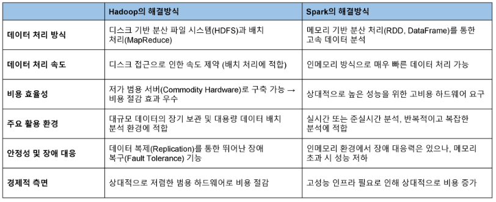

- Hadoop과 Spark가 함꼐 사용되는 이유
    - 상호 보완적인 성격
        - Hadoop은 안정적인 데이터 저장소(HDFS)를 제공하여 데이터의 장기 보관에 이상적
        - Spark는 Hadoop 생태계 위에서 빠른 속도의 처리 성능을 제공하여, 반복적이고 복잡한 작업의 성능 향상을 담당함
    - 사용 예시
        - Hadoop - 장기간 로그 데이터, 고객 정보, 거래 내역 등의 안정적 보관 및 배치 처리
        - Spark - 머신러닝, 스트리밍 데이터 처리, 반복적 데이터 분석(ex. 사용자 행동 분석, 실시간 추천 시스템)에 활용

- 결론

    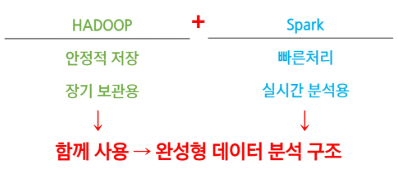


## Hadoop 구성요소
1. HDFS (분산 파일 시스템)
    - 데이터를 여러 컴퓨터에 나누어 안정적으로 저장하는 역할
2. MapReduce (분산 데이터 처리)
    - 대규모 데이터를 분산, 병렬처리 하는 역할
3. YARN (자원관리 및 작업 스케줄링)
    - Hadoop 클러스터의 자원을 효율적으로 관리하고, 작업 스케줄링을 담당함

        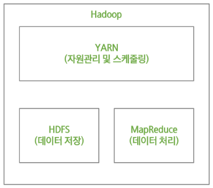

-> HDFS가 메타 데이터와 분산형 파일 시스템을 처리

-> MapReduce가 입력/출력 데이터를 처리하고 변환

-> YARN이 클러스터에 작업을 분산시킴

### HDFS (Hadoop Distributed File System)
Hadoop이 실행되는 환경에서 파일을 관리하는 가장 핵심적인 데이터 저장소

- HDFS 특징
    - 범용 하드웨어에서 동작함
    - 장애 복구성을 갖춘 분산 파일 시스템
    - 데이터를 '블록(Block)'이라는 작은 단위로 나누고, 여러 컴퓨터에 분산하여 저장함
    - 블록을 여러 번 복제하여 장애 발생 시에도 데이터 손실 방지 가능

- HDFS 아키텍처

    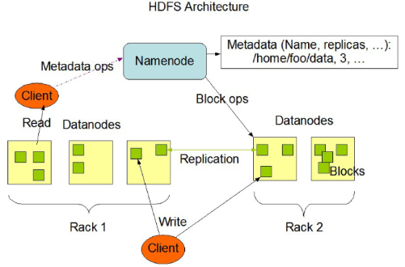
    - NameNode가 메타 데이터 관리
        - 파일 이름, 복제본 개수 및 위치
    - Datanodes에 실제 데이터 저장
        - 블록 형태로 분산 저장됨
    - *순서 설명*

- 네임노드(NameNode)의 주요 기능
    - HDFS 전체에 대한 MataData 관리
        - 파일 위치, 파일 명, 디렉토리 구조 정보 등을 유지 관리함
    - DataNode의 블록 정보 수신 및 관리
        - 블록 위치를 기록, 관리하여 클라이언트 요청 시 위치 정보 제공함
    - 데이터 복제 관리
        - DataNode의 장애 시 복제 블록 수를 유지할 수 있도록 복제 명령을 수행함

        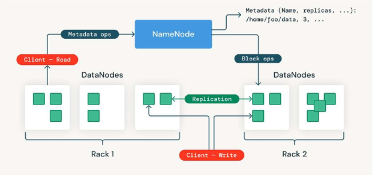

- 데이터노드(DataNode)의 주요 기능
    - 데이터 분산 저장
        - DataNode는 HDFS 데이터를 로컬 **파일 시스템에 물리적으로 저장**함
    - 정상 동작 확인(Heartbeat)
        - NameNode에 주기적으로 자신의 정상 동작 여부를 신호로 전달함
    - 블록 리포트
        - 저장된 블록 상태와 변경된 사항을 NameNode에 주기적으로 보고하여 메타데이터 최신 상태 유지함

        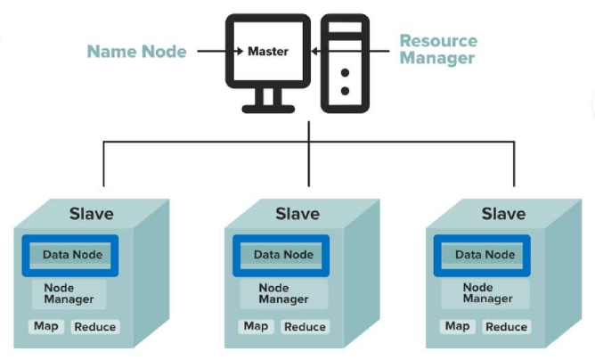

### HDFS Read 처리 메커니즘

1. 클라이언트가 네임노드에 파일 저장 위치 요청
2. 네임노드가 클라이언트에게 블록 위치 반환
3. 클라이언트는 네임노드가 알려준 위치를 기반으로, 데이터 노드에 직접 접근하여 파일 블록을 읽음
    - 장애 등으로 블록 접근에 실패할 경우 네임 노드가 다른 복제된 블록 위치를 제공함(장애 복구 가능)

### HDFS Write 처리 메커니즘
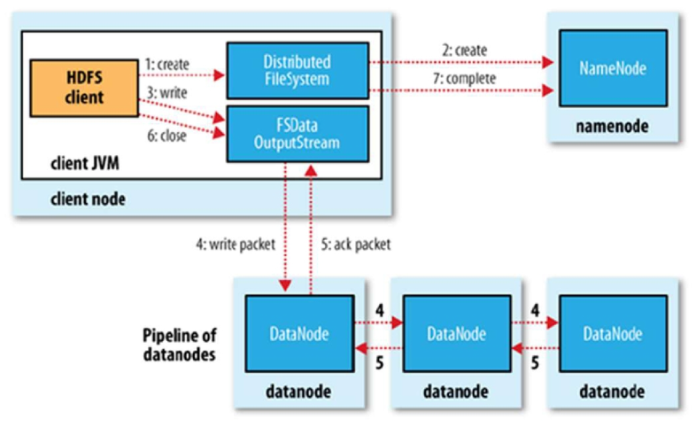
1. 클라이언트가 네임노드에 파일 저장 요청
2. 클라이언트는 네임노드가 지정한 데이터 노드에 데이터 저장
3. 모든 데이터노드에 데이터가 성공적으로 저장되면, 클라이언트에 완료 신호 반환
    - 장애 발생 시 다른 데이터 노드에 블록 저장함(Fault Tolerance)

- HDFS Write 요청 정리
    - 네임노드에 파일 정보를 전송하고, 파일의 블록을 써야할 노드 목록 요청
    - 네임노드가 파일을 저장할 목록 반환
    - 데이터 노드에 파일 쓰기 요청
        - 데이터 노드 간 복제 진행됨
        - 첫번째 데이터노드에 데이터를 쓰기 시작하고, 다른 데이터노드에 복제 데이터를 완료하면 쓰기 작업이 완료됨

### MapReduce의 데이터 처리 원리
MapReduce는 4단계(Split, Map, Shuffle, Reduce)를 거쳐 데이터를 처리함

- Split
    - 입력 데이터를 분산된 여러 개의 작은 조각으로 나누어 각 컴퓨터에 할당하는 과정
    - 데이터가 분산되면서 병렬 처리의 기초가 마련됨
    - 이후 각 조각(Split)이 독립적으로 Mapper로 전달되어 빠른 처리가 가능함

        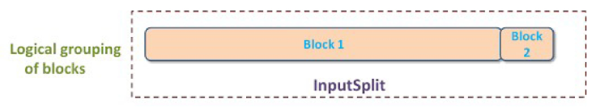

- Map
    - 각 컴퓨터는 할당된 데이터 조각을 개별적으로 처리함
    - 데이터는 중간 형태의 Key-Value (키-값) 형태로 변환
    - ex. 문장에서 각 단어 별로 빈도를 세기 위한 중간 값 생성 -> "단어, 1"

- Shuffle
    - 중간 데이터에서 동일한 키를 가진 데이터를 한 곳으로 모으고 정렬하는 과정
    - 같은 키를 가진 데이터를 같은 노드로 모아 효율적인 집계를 준비함
    - Map과 Reduce를 연결해주는 매우 중요한 과정

- Reduce
    - 모인 데이터를 키 별로 집계하여 최종 결과를 도출함
    - 최종적으로 의미있는 정보를 추출하는 단계

- 정리
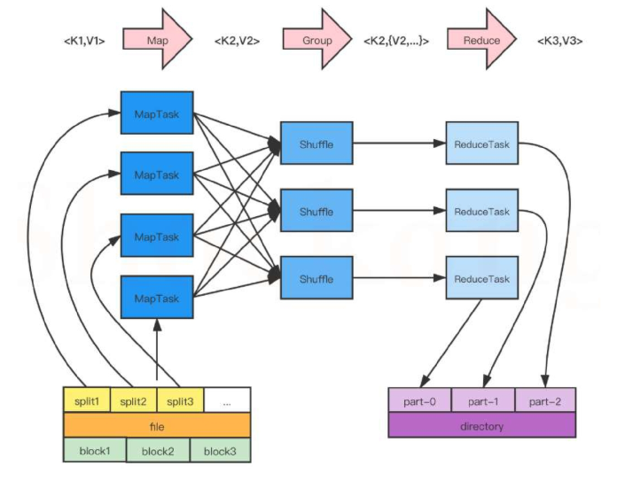

*설명*


### Hadoop 클러스터 구조
- 마스터 노드(Master Node)
    - NameNode (HDFS)
        - 파일 시스템 메타데이터 관리
    - ResourceManager (YARN)
        - 작업(Job)과 리소스를 관리
- 슬레이브 노드(Slave Node)
    - DataNode (HDFS)
        - 실제 데이터를 저장하고 관리
    - NodeManager (YARN)
        - 작업을 실행하는 노드
- 클라이언트(Client)
    - 사용자가 Hadoop Job을 제출하는 역할
    - 클러스터에 직접 참여하진 않지만, 작업 요청 및 결과 수집함

### 클러스터의 핵심 계층과 처리 방식
- 스토리지 계층(HDFS)
    - 데이터를 여러 노드에 나눠서 저장
    - 메타데이터는 NameNode, 실제 데이터는 DataNode
- 컴퓨팅 계층(MapReduce/YARN)
    - 작업(Job)을 나누어 분산 실행
    - Master(ResourceManager)가 작업 계획을 세우고, Worker(NodeManager)가 실행
- 데이터 흐름
    - 사용자 -> 클라이언트 -> Master -> Worker
    - 결과는 다시 클라이언트에게 전달됨

### YARN
- YARN 특징
    - 리소스 관리의 분리
        - 데이터 처리(애플리케이션)와 자원 관리를 분리하여 효율성 증가
    - 멀티 테넌시(Multi-tenancy) 지원
        - 하나의 클러스터에서 여러 사용자 및 여러 애플리케이션 실행 지원
    - 다양한 프레임워크 지원
        - MapReduce 외에도 Spark, Flink, Hive, TensorFlow 등 다양한 프레임워크 실행 가능
    - 유연한 스케줄링
        - 다양한 스케줄링 방식(FIFO, Capacity, Fair)을 지원하여 작업 환경에 맞게 선택 가능

- YARN의 핵심 요소
    - `ResourceManager` - "자원 총괄 관리"
        - 클러스터 전체 자원 중앙 관리
        - 작업 요청 -> ApplicationMaster 생성
        - 자원 배치 및 스케줄링 담당
    
    - `NodeManager` - "작업 실행 관리 담당"
        - 각 노드에 설치된 에이전트
        - 자원 상태 -> RM에 보고
        - 명령 수신 후 컨테이너 실행
    
    - `ApplicationMaster` - "작업 단기 관리"
        - 개별 작업 전용 마스터
        - 자원 협상 -> 작업 실행 조율
        - 실행 중 상태 모니터링
    
    - `Container` - "실행 엔진이 돌아가는 공간"
        - 실제 작업이 실행되는 공간
        - CPU, Memory 등 자원 패키지
        - Spark, MapReduce 등 다양한 엔진 실행 가능

- YARN MapReduce 동작 흐름

    
    - 클라이언트가 RM에게 어플리케이션 제출
    - NM을 통해 AM 실행
    - AM은 RM에게 자신을 등록
    - AM은 RM에게 컨테이너 할당할 공간/위치를 받음
    - AM은 NM에게 컨테이너를 실행 요청 (어플리케이션 정보를 NM에게 제공)
    - 컨테이너는 어플리케이션의 상태 정보를 AM에 알림
    - 클라이언트는 어플리케이션의 실행 정보를 얻기 위해 AM과 직접 통신
    - 어플리케이션이 종료되면 AM은 RM에게 자신의 자원을 해제하고 종료함


## Hadoop 설치 및 실행환경 구성
### 로컬 환경 설치
`data_engineering\08_Hadoop\01_local_hadoop_setting.md` 참고

### 도커 환경 설치
`data_engineering\08_Hadoop\01_docker_hadoop_setting.md` 참고

※ 로컬 환경 설치를 권장하나, 프로젝트에서 도커 사용 필요 시 도커 환경 사용 권장

### 웹 인터페이스
- NameNode (HDFS) : http://localhost:9870

- YARN ResourceManager : http://localhost:8088

    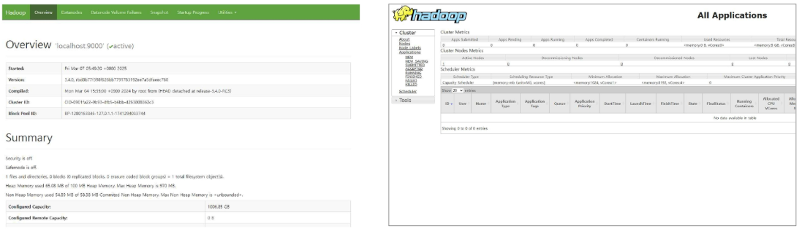

### 터미널에서 실행 상태 확인 방법
```sh
docker exec -it namenode bash
docker exec -it datanode1 bash
docker exec -it datanode2 bash
```
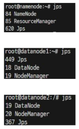
- NameNode : HDFS 메타데이터 관리
- DataNode : HDFS 실제 데이터 관리
- ResourceManager : YARN 리소스 관리
- NodeManater : YARN 작업 실행 관리

※ 4개의 데몬이 모두 실행중이면 성공

### 데이터 저장 및 관리 명령어
```sh
# Docker Namenode 컨테이너로 진입
docker exec -it namenode bash

# 로컬 파일 준비 (로컬에 파일 만들기)
echo "Hello Hadoop" > test.txt

# 디렉터리 생성
hadoop fs -mkdir -p /user/local/data

# 파일 업로드
hadoop fs -put test.txt /user/local/data

# 업로드한 파일 확인
hadoop fs -ls /user/local/data

# 파일 내용 보기
hadoop fs -cat /user/local/data/test.txt

# 파일 다시 다른 위치로 다운로드
hadoop fs -get /user/local/data/test.txt /usr/local/hadoop/hdfs/namenode

# 파일 삭제
hadoop fs -rm /user/local/data/test.txt
```
