# Hadoop MapReduce와 클러스터링
## MapReduce의 데이터 처리
- 일반적인 Big Data의 문제
  - 많은 수의 레코드를 반복 처리
  - 각 레코드에서 관심 있는 정보를 추출
  - 중간 결과를 셔플하고 정렬
  - 중간 결과를 집계
  - 최종 결과를 생성

- 복잡한 추출과 집계를 Map과 Reduce 연산으로 단순화할 수 있음
  - Map, Reduce 연산에 대해 기능적 추상화를 제공

### MapReduce
대규모 데이터를 여러 컴퓨터에서 분산처리하기 위한 프로그래밍 모델

- 데이터를 효율적으로 병렬 처리하고 쉽게 확장할 수 있도록 설계함
- Google이 대규모 데이터 분석을 위해 개발했고, Hadoop이 이를 구현하여 활용함

- MapReduce 데이터 처리 방식

  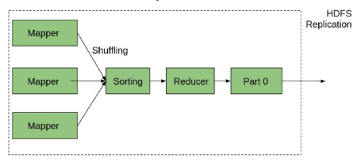
  - Key-Value 구조의 알고리즘
  - Map 
    - (key1, value1) → (key2, value2)
    - key1, value1 형태를 입력받아 key2, value2 형태로 변환 가능
    - ex. (단어, 1) -> 텍스트 단어 빈도 집계 시 사용
  - Reduce
    - (key2, List of value2) → (key3, value3)
    - key에 해당하는 여러 value들을 연산
    - ex. (단어, (1, 1, 1, 1)) -> (단어, 4)

      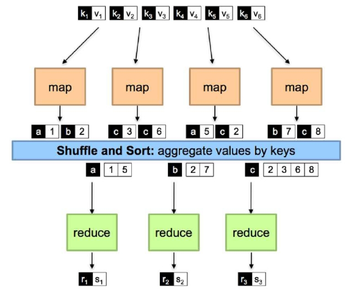

### MapReduce의 아키텍처 구성
- JobTracker (Master)
  - 클라이언트로부터 Job을 받아, TaskTracker에게 세부 작업을 분배
  - 전체 작업 진행상황을 모니터링
  - TaskTracker와의 주기적인 Heartbeat 메시지를 통해 작업 상태 확인

- TaskTracker (Slave)
  - JobTracker가 할당한 Task(Map, Reduce)를 수행하는 노드
  - Task 실행을 위해 별도의 JVM을 생성하거나 재사용하여 작업 수행

- 클라이언트(Client)
  - Hadoop API를 통해 MapReduce Job을 생성하고 JobTracker에 전달하는 실행 주  체

- HDFS
  - 입력 데이터를 제공
  - Map 단계에서 생성된 중간 데이터를 임시 저장
  - 최종 결과 데이터를 저장하는 파일 시스템

### MapReduce의 처리 단계
MapReduce는 아래 4단계(Split, Map, Shuffle, Reduce)를 거쳐 데이터를 처리함

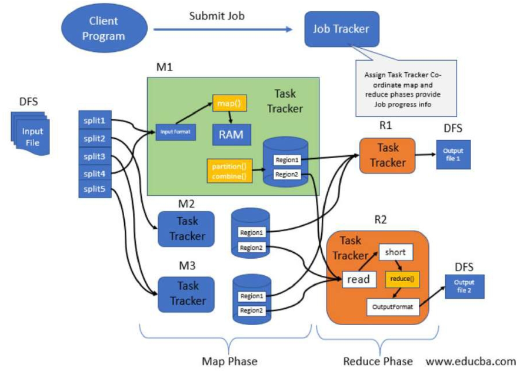
- Split
  - 입력 데이터를 분산된 여러 개의 작은 **조각으로 나누어 각 컴퓨터에 할당**하는 과정
  - 데이터가 분산되면서 병렬 처리가 가능해짐
  - 이후 각 조각(Split)이 독립적으로 Mapper로 전달되어 빠른 처리 가능

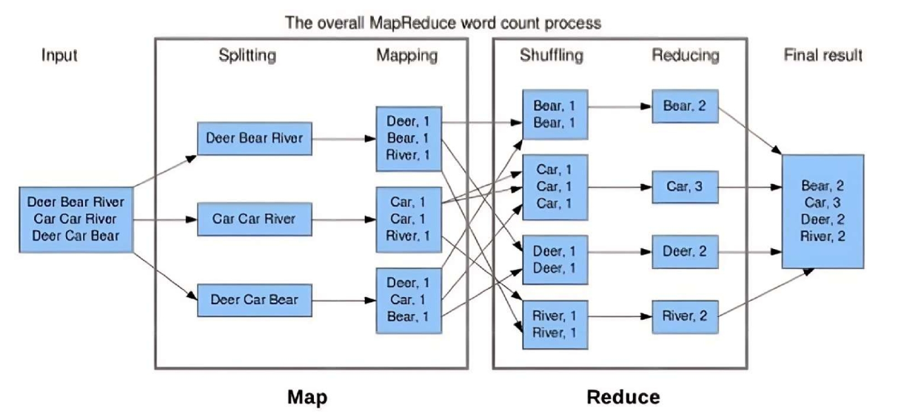
- Map
  - 각 컴퓨터는 할당된 데이터 조각을 개별적으로 처리함
  - 데이터는 중간 형태의 Key-Value(키-값) 형태로 변환됨
  - ex. 문장에서 각 단어 별로 빈도를 세기 위한 중간 값 생성(예:"단어, 1")

- Shuffle
  - 중간 데이터에서 동일한 키를 가진 데이터를 한 곳으로 모으고 정렬하는 과정
  - 같은 키를 가진 데이터를 같은 노드로 모아 효율적인 집계를 준비
  - Map과 Reduce를 연결해주는 매우 중요한 과정

- Reduce
  - 모인 데이터를 키 별로 집계하여 최종 결과를 도출
  - 최종적으로 의미 있는 정보를 추출하는 단계

- 정리

  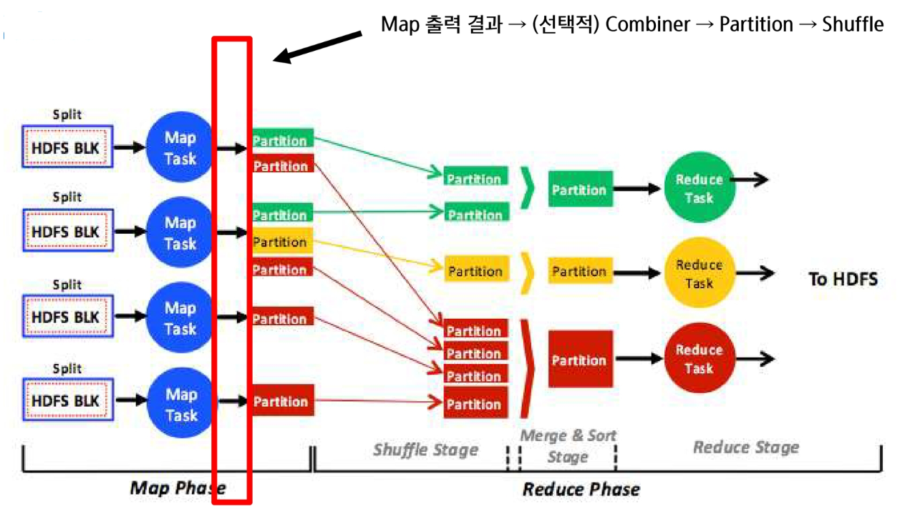
  - HDFS BLK (block) 에서 데이터가 split 단위로 쪼개짐
  - 쪼개진 데이터가 Map Task로 전달됨
  - Map Task가 입력 데이터를 읽고 key-value 형태로 중간 결과를 생성
  - 바로 셔플로 넘기지XX
    - 데이터가 너무 많다는 이슈가 있음
    - 따라서 Combiner와 Partition라는 과정을 선택적으로 함
    - Combiner -> 로컬에서 하는 미니 Reduce 느낌
    - ex. combiner 단에서 (car, 1), (car, 1), (car, 1) -> (car, 3) 으로 미리 만들어서 셔플로 전달
    - 즉, 3개 전달할 거 네트워크 넘어가기 전에 1개로 줄여서 전달하게 됨 (성능 개선)
    - Partitioner -> 어떤 key를 어떤 reduce로 보낼지 정함
  - 데이터가 네트워크를 통해 셔플 단계로 이동

### Combiner
Mapper 결과를 미리 처리하여 Reducer로 가는 데이터 크기를 줄이는 역할

- 장점
  - 네트워크 전송 비용 감소
  - 성능 최적화에 도움됨

- 주의할 점
  - 최대값, 최소값, 카운트 연산은 사용 가능
  - 평균(AVG) 같은 연산은 최종 결과가 달라질 수 있어 사용 불가
    - 데이터 정합성을 유지할 수 있는 조건에서만 사용 가능

- Combiner 활용 시 고려 사항 및 프로그래밍 권장 사례
  - Combiner의 역할
    - Mapper의 중간 출력 데이터를 미리 집계하여 Reducer로 전송되는 데이터 양 축소

  - Combiner 설계 시 유의사항
    - Combiner는 선택적으로 동작함을 주의 (반드시 실행된다는 보장 없음)
    - Combiner의 입출력 키/값 타입이 반드시 Reducer의 입력 형식과 동일해야 함
    - 연산이 **교환법칙(Commutative) 및 결합법칙(Associative)을 만족**해야만 사용 가능
  
  - sum 연산 가능

    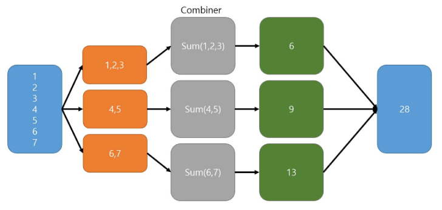
  - avg 연산 불가능

    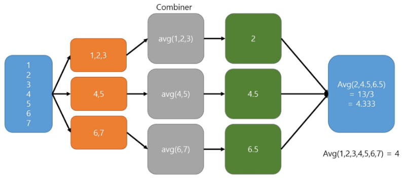

### Partitioner
Mapper 결과를 특정 Reducer로 보내기 위한 기준을 설정

-> Key 값에 따라 데이터를 적절히 분배함

- 기본적인 작동방식
  - 기본적으로 HashPartitioner 사용 (Key 값을 기반으로 파티션 나눔)
  - 같은 파티션에 속한 데이터는 같은 Reducer로 전달

- Partitioner 설계 시 유의사항
  - 데이터가 불균형하게 분배되면 **일부 Reducer만 과부하**가 걸려 전체 처리 **성능이 저하**될 수 있기 때문에,
  - 균형 잡힌 파티셔닝 전략은 대규모 데이터 처리 성능을 좌우하는 핵심 요소

### sort
Reduce 단계 전에 전달받은 키(Key) 기준으로 정렬 수행함

- 정렬된 데이터를 List 형태로 만들어 그룹핑(Grouping) 진행

- 정렬 과정
  1. Partitioning → Sorting → Grouping
  2. 키 값이 여러 개인 경우 복합키(Composite Key)를 기준으로 정렬 가능

- Sorting을 통해 Reducer가 최적화된 형태로 데이터 처리 가능

### MapReduce Job Excution Flow 정리
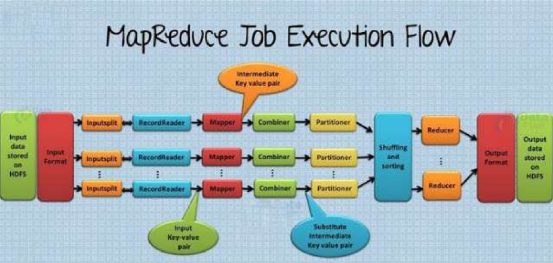
- HDFS : 저장된 파일 있음
- input format : 데이터 읽음
- input split : 데이터 쪼갬
- record Reader : 쪼개진 데이터를 한줄씩 읽으면서 key-value 형태로 변환
- Mapper : 데이터를 가공하여 중간 key value 쌍으로 만들어 냄 ex. (단어, 1)
- Combiner : key value들 합쳐서 네트워크 전송량 줄임
- Partitioner : 어떤 reduce로 보낼지 선택
- Shuffling and sorting : 실제 어느 Reducer에 보내고 정렬할지 (Grouping까지 ex. ("car", (1, 1, 1)))
- Reducer : 로직에 맞게 연산
- output format : 저장 및 활용하려는 형태로 포맷팅

### MapReduce의 한계점
- 디스크 I/O 부담
  - 중간 데이터가 디스크(HDFS)에 저장되므로 속도가 느림
  - Shuffle 과정에서 네트워크 및 디스크 부하가 발생하여 전체 작업 시간이 늘어날 수 있음

- 실시간 처리 불가
  - streaming 및 interactive 분석에 부적합

- 복잡한 프로그래밍
  - Map과 Reduce를 직접 코딩해야 하므로 개발이 어려움

## Mapreduce를 통한 데이터 처리
### 병렬 처리를 통한 대량 데이터 처리 학습
- MapReduce Execution 실제 사례 - 단어 빈도 계산(Word Count)
  - [step 1] 입력 데이터
    ```
    "Hello World Hello sarang"
    ```
    - HDFS에 저장된 원본 데이터 
    - MapReduce 작업의 목표는 각 단어의 빈도수를 세는 것

  - [step 1] 입력 파일 업로드 코드
    ```sh
    # HDFS에 파일 업로드
    hadoop fs -put test.txt /user/hadoop/input/
    ```
    ```
    root@namenode:/# hadoop fs -mkdir -p /user/hadoop/input

    root@namenode:/# hadoop fs -put test.txt /user/hadoop/input
    ```
    
    - test.txt 파일을 HDFS에 업로드  
    - 업로드 후 파일 목록 확인: `hadoop fs -ls /user/hadoop/input/`

  - [step 2] 데이터 분할(Input Split)
    ```
    Split 1 : [“Hello World”]  
    Split 2 : [“Hello my”]
    ```
    - 입력 데이터는 크기와 형식에 따라 자동으로 여러 개의 Split으로 나뉨  
    - 각 Split은 서로 다른 컴퓨터(노드)의 Mapper에 전달


  - [step 2] 데이터 분할(Input Split) 코드
    ```sh
    # 파일이 어떻게 분할되는지 확인
    hdfs fsck /user/hadoop/input/test.txt -files -blocks
    ```
    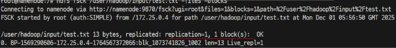
    - `hdfs` : Hadoop 분산 파일 시스템 명령어  
    - `fsck` : “file system check”의 약어
      - 파일이 몇 개의 블록으로 나누어졌는지 확인하고
      - 각 블록이 어느 노드에 분배되었는지 보여주는 명령어  
    - `-file` : 파일에 대한 추가 정보를 출력하도록 지정  
    - `-blocks` : 파일을 저장하는 블록에 대한 정보를 출력하도록 지정
    - 결과 해석

      ```
      fsck 결과:  
      - 블록 ID: blk_1073741826  
      - 크기: 13 bytes  
      - 블록 수: 1 (파일이 1개의 블록으로 나누어짐)

      ⇒ 입력 데이터가 하나의 블록으로 나누어져 처리되며, Split을 통해 병렬 처리됨
      ```

  - [step 3] Mapper 단계
    - 각 데이터 Split을 개별적으로 처리하여 Key-value 형태로 변환하는 단계
    - 여기서 Key는 단어(Word), Value는 숫자(count = 1)를 의미함

      | Mapper 입력 데이터 | Mapper 출력 결과 (중간 데이터) |
      | --- | --- |
      | "Hello World" | ("Hello", 1), ("World", 1) |
      | "Hello my" | ("Hello", 1), ("my", 1) |

    - 각 Mapper는 입력 문장을 단어 단위로 나누고 각 단어 옆에 출현 횟수 1을 부여

  - [step 4] Shuffle & Sort 단계
    - Mapper가 출력한 데이터를 키(단어) 기준으로 묶고 정렬하는 단계
    - 동일한 단어(Key)를 가지는 데이터를 같은 Reducer로 전달

      | Mapper 출력 (Shuffle 전) | Shuffle & Sort 후 (Reducer 입력) |
      | --- | --- |
      | ("Hello", 1), ("World", 1), ("Hello", 1), ("my", 1) | ("Hello", [1,1]), ("World", [1]), ("my", [1]) |

    - Shuffle 단계에서 Mapper의 중간 결과를 단어 별로 재구성하여 그룹핑  
    - Sort 단계에서는 그룹핑된 데이터를 단어(Key) 기준으로 정렬

  - [step 5] Reducer 단계
    - 단어 별로 모인 중간 데이터 값을 모두 합산하여 최종 결과를 만드는 단계

      | Reducer 입력 데이터 | Reducer 출력 데이터 (최종 결과) |
      | --- | --- |
      | ("Hello", [1,1]) | ("Hello", 2) |
      | ("World", [1]) | ("World", 1) |
      | ("my", [1]) | ("my", 1) |

    - Reducer는 키(단어)별로 합산(Count)하여 최종 빈도수를 계산

  - [step 3~5] 통합 실행 코드(wordCount 명령어)
    - Map → Shuffle/Sort → Reduce 실행 실습

    ```sh
    hadoop jar /usr/local/hadoop/share/hadoop/mapreduce/hadoop-mapreduce-examples-3.3.5.jar wordcount /user/hadoop/input/test.txt /user/hadoop/output/wordcount_out
    ```
    - Hadoop에 기본 내장된 wordCount 예제 실행하여 입력 파일의 단어 빈도를 계산 
    - 기본 내장된 wordCount 는 Hadoop에 내장되어 있어 별도 사용자 코딩 없이 바로 실행 가능
    - `hadoop jar` : Hadoop에서 JAR파일을 실행하기 위한 기본 명령어 
    - `/home/my/hadoop/share/hadoop/mapreduce/hadoop-mapreduce-examples-3.3.5.jar` : Hadoop에서 제공하는 예제 MapReduce 프로그램 JAR파일 경로  
    - `wordcount` : JAR 파일 내 wordCount 클래스 이름. 단어 수를 계산하는 MapReduce 프로그램  
    - `/user/hadoop/input/input.txt` : HDFS 입력 파일 경로  
    - `/user/hadoop/output/map_output` : 출력 결과가 저장될 HDFS 디렉터리(기존에 존재하면 안됨)

  - [step 6] 결과 저장 (Output)
    ```
    결과:
    Hello   2  
    World   1  
    my   1
    ```
    - Reducer를 통해 집계된 최종 결과는 OutputFormat을 거쳐 다시 HDFS에 저장
    ```sh
    # 저장 위치
    hadoop fs -cat /user/hadoop/output/map_output/part-r-00000
    ```
    - 위의 위치에 파티션 단위로 파일이 저장됨

  - `data_engineering\08_Hadoop\Chapter2\mapreduce.md` 참고


### 사용자 정의의 MapReduce를 위한 Hadoop Streaming 개념
- Hadoop Streaming
  - Hadoop MapReduce 작업을 Java가 아닌 외부 스크립트로 수행할 수 있게 해주는 프레임워크
  - 표준 입력/출력(stdin, stdout)을 통해 데이터를 주고받음
  - Hadoop Streaming은 내장 WordCount 예제를 사용자 정의로 확장할 수 있는 핵심 수단

    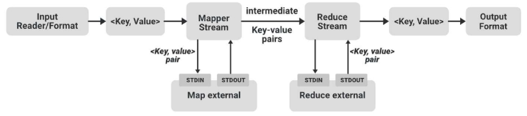

- Hadoop Streaming 구조
  - 입력 데이터 (HDFS)
    - mapper와 reducer를 python 기반으로 구현
    - → `mapper.py` (stdin → print)
    - → (Shuffle / Sort)
    - → `reducer.py` (stdin → print)
  - 출력 결과 (HDFS)

- Hadoop Streaming 실행 명령어 예시
  ```sh
  hadoop jar $HADOOP_HOME/share/hadoop/tools/lib/hadoop-streaming-3.3.5.jar \
  -input /user/hadoop/input/test.txt \
  -output /user/hadoop/output/custom_output \
  -mapper "python3 mapper.py" \
  -reducer "python3 reducer.py" \
  -file mapper.py -file reducer.py
  ```
  - `hadoop jar` : Hadoop 에서 jar 실행을 위한 명령어
  - `...hadoop-streaming-*.jar` : Hadoop Streaming 프레임워크 실행을 위한 jar 경로
  - `input` : 입력 파일 경로 (HDFS) – 분석할 데이터 파일
  - `output` : 출력 디렉토리 경로 (HDFS) – 결과가 저장될 위치 
    - ※ 이미 존재하면 오류 발생 ※
  - `mapper` : 사용할 Mapper 스크립트 지정 (Python 명령 포함)
    - "python3 mapper.py" -> mapper를 python 기반으로 사용하겠다는 명확한 선언
  - `reducer` : 사용할 Reducer 스크립트 지정
    - "python3 reducer.py" -> reducer를 python 기반으로 사용하겠다는 명시
  - `file` : Hadoop 클러스터로 함께 전송할 로컬 스크립트 파일 등록  

※ 도커 이용 시 해당 mapper와 reducer 파일이 컨테이너 상에 올라가 있어야 함!!

### 사용자 정의 WordCount - Python Mapper와 Reducer 구현 실습
- 직접 **Mapper**를 작성하며 MapReduce 개념 이해하기
  - 표준 입력으로부터 한 줄씩 입력을 받아
  - 소문자로 바꾸고
  - 알파벳 단어만 추출해서
  - 각 단어마다 `⟨단어, 1⟩` 형식으로 출력
  - 이 출력 결과는 Shuffle & Sort를 거쳐 Reducer로 전달

    ```py
    #!/usr/bin/env python
    import sys
    import re

    for line in sys.stdin:
        line = line.strip().lower() # 아래에서 소문자만 처리하게 로직 구현
                                    # 때문에 .lower() 처리
        words = re.findall(r'\b[a-z]+\b', line)

        for word in words:
            print(f"{word}\t1")
    ```
    - 표준 입력을 받으므로 `sys.stdin` 사용
    - `re` : 정규표현식
    - `r'\b[a-z]+\b'` : 알파벳 소문자만 처리

- 직접 **Reducer**를 작성하며 MapReduce 개념 이해하기
  - Mapper에서 전달된 `⟨word, 1⟩` 데이터를 같은 단어 기준으로 그룹핑
  - 단어별로 빈도를 합산하여 최종 결과를 출력
  - Hadoop Streaming에서는 입력이 정렬되어 들어옴
  - Streaming 구조에선 정렬 보장이 되므로 key 변경만 감지

    ```py
    #!/usr/bin/env python3
    import sys

    # 현재 단어와 카운트를 위한 변수 선언
    current_word = None
    current_count = 0

    for line in sys.stdin:
        try:
            word, count = line.strip().split('\t')  # 탭(tap) 형태로 받았으므로
                                                    # \t 사용하여 단어, 숫자 분리
            count = int(count)
        except ValueError:
            continue

        if current_word == word:
            current_count += count
        else:
            if current_word:
                print(f"{current_word}\t{current_count}")
            current_word = word
            current_count = count

    if current_word:
        print(f"{current_word}\t{current_count}")
    ```
    - 정렬 된 상태를 가정하고 작성된 로직


### MapReduce 정리
대규모 데이터를 병렬 처리하기 위한 프로그래밍 모델
- 처리 단계 : Split → Map → Shuffle → Reduce
  - `Split`: 입력 데이터를 분할로 병렬 처리 기반 마련
  - `Map`: 데이터를 Key-Value 쌍으로 변환
  - `Shuffle`: 동일한 Key를 그룹화하고 정렬해 Reducer로 전달
  - `Reduce`: Key 단위로 집계 후 최종 결과 생성

- Google이 개발, Hadoop이 오픈소스로 구현
- HDFS와 함께 사용되며, 데이터 저장/처리 병렬화 가능


## Hadoop 클러스터 구조
### Hadoop 클러스터 구조와 클러스터 매니저의 역할 이해
- Hadoop에서 클러스터(Cluster)의 역할
  - 여러 대의 컴퓨터(서버)가 하나의 시스템처럼 동작하는 환경
  - 단일 서버로는 빅데이터를 효율적으로 처리하기 어려움
  - 서버 하나가 처리할 수 있는 데이터 크기와 연산 속도에 한계가 있음

    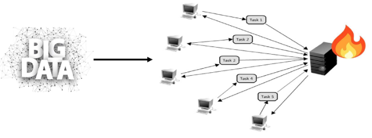

- MapReduce와 Yarn
  - 이전 버전의 MapReduce 시스템은 매우 큰 클러스터 상에서 동작 시 병목현상 이슈가 발생함 (JobTracker 에 발생)
  - 확장성 문제를 해결하기 위해 JobTracker 의 책임을 여러 컴포넌트로 분리함
    - `ResourceManager`: 클러스터의 컴퓨팅 리소스 이용 상태를 관리하고 할당하는 것을 조정함
    - `ApplicationMaster`: 클러스터에서 실행중인 Job의 LifeCycle을 관리
    - `NodeManager`: 컨테이너를 모니터링하고, Job이 할당 받은 그 이상의 리소스가 사용되지 않도록 보장
  - JobTracker와 다르게 응용 프로그램의 각 인스턴스는 ApplicationMaster 를 고정적으로 할당시켜 응용 프로그램의 지속성을 유지함

- YARN (Yet Another Resource Negotiator)
  - YARN = Yet Another Resource Negotiator, 리소스 협상자
  - Hadoop의 자원(CPU, Memory 등)을 효율적으로 관리하고 스케줄링하는 프레임워크
  - Hadoop V1에서 MapReduce(JobTracker/TaskTracker) 구조가 가진 한계를 극복하고 이를 해결하고 확장성을 확보하기 위해 YARN 도입함
  - 다양한 애플리케이션(MapReduce, Spark, Flink 등) 환경에서 사용 가능

### Hadoop V1.0
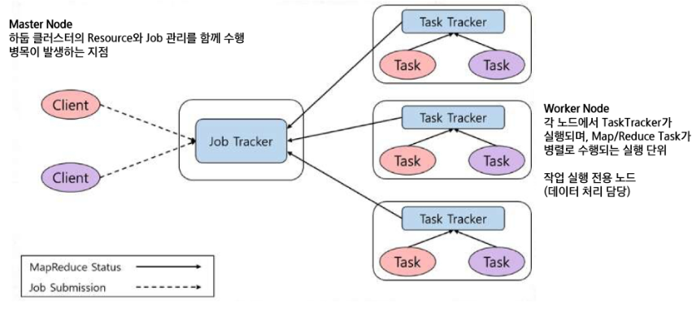
- Job Tracker
  - 클러스터의 마스터 노드에서 실행됨
  - 클라이언트에게 job을 받아 전체적인 계획 세우고, Task Tracker에게 일 분배시킴
  - 즉, 리소스 관리 및 작업 관리 담당
- Task Tracker
  - Job Tracker가 지시한 MapReduce 작업을 실행하고 보고함

- 클러스터의 기본 구조

  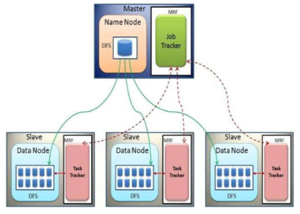

- Hadoop V1.0 한계
  1. 중앙 집중형 병목현상
      - JobTracker가 모든 작업을 중앙에서 단독으로 관리
      - 작업량 또는 클러스터 규모가 커질수록 성능 저하 및 병목 발생

  2. 단일 장애 지점(SPOF)
      - JobTracker에 장애 발생 시 클러스터 전체 서비스가 멈출 수 있음

  3. 자원 비효율 문제
      - Slot 기반의 고정 자원 할당 방식
        - 즉, 실제 작업 작업량과 상관 없이 슬롯을 정해놔서 자원이 남아돌거나 활용 못하는 경우가 생김
      - 작업 수요에 비해 자원이 유휴 상태로 남는 경우 많음 → 낮은 자원 활용률
  
- 이를 해결하기 위해 나온 것이 YARN

### Hadoop V2
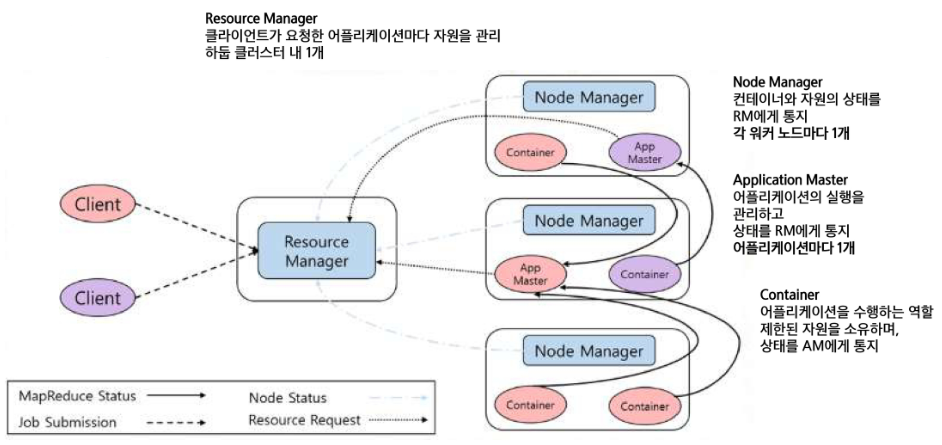
- 클라이언트가 작업 제출
- Recource Manager
  - 해당 작업을 처리할 AM (Application Master)을 만듦
  - AM은 기본적으로 존재하는 것이 아닌, 작업을 제출할 때마다 실행되는 것
- Application Master
  - 필요한 자원을 Resource Manage에게 요청
  - 그러면 Resource Manage가 Node Manager의 자원 상태를 파악 후 컨테이너 할당
- Node Manager
  - 컨테이너 실행
- Container
  - AM과 통신하며 실제 작업을 수행함

※ Job마다 필요로 하는 자원 개수에 따라 **동적으로** 처리할 수 있다는 것이 특징

- 순서 정리
  1. 클러스터 시작
  2. RM (1대), NM (노드 개수만큼) 실행
  3. 클라이언트가 Job 제출
  4. 특정 Job용 AM 생성 (1개)
  5. RM-AM 간 소통으로 필요 자원 파악 후 컨테이너 배치
  6. NM이 AM에 필요한 컨테이너를 실행
  7. 컨테이너가 실제 프로세스를 실행시킴
  8. 작업이 끝나면 컨테이너 반환 후 작업 종료

※ Q. Mapper가 10개, Reducer가 2개 필요하다면 Container는 몇개 필요한가?

-> A. AM + 12개 = 13개

-> YARN은 작업에 필요한 만큼의 컨테이너를 동적으로 할당할 수 있도록 도와주는 도구

### Hadoop V1 vs V2 비교
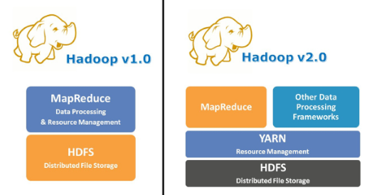

| 구분 | Hadoop V1 | Hadoop V2 |
| --- | --- | --- |
| 핵심 컴포넌트 | Job / Task Tracker | Resource / Node Manager, App Master |
| 작업 관리 방식 | Job Tracker가 리소스·작업 모두 관리 | Resource Manager가 리소스, App Master가 작업 관리로 분리 |
| 문제점 | 병목, 장애, 확장성 제한 | 병목 해소, 장애 격리, 확장성 개선 |
| 지원 프레임워크 | MapReduce 전용 | MapReduce, Spark, Flink 등 다양한 앱 지원 |

### YARN 작업 실행 과정
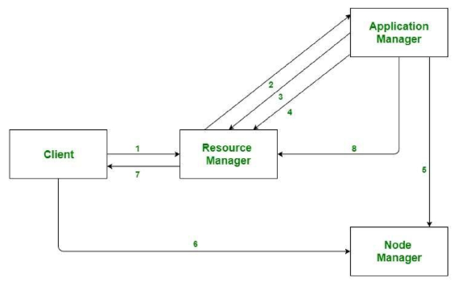

### YARN의 장단점
| 구분 | 설명 |
| --- | --- |
| 장점 | - 자원 관리와 작업 실행 분리로 병목 감소<br>- 다양한 실행 엔진 지원 (Spark, Flink 등)<br>- 멀티 테넌시 및 스케줄링 전략 유연성<br>- 확장성, 장애 격리성 향상 |
| 단점 | - 초기 설정 및 운영 복잡도 높음<br>- AM/Container 오버헤드 발생 가능<br>- 소규모 클러스터에서는 과도한 구조<br>- 대규모 클러스터에선 RM 자체가 SPOF 가능성 있음 (HA 구성 필요) |


## 분산처리 환경에서 작업 스케줄링 이해
### 작업 스케줄링
여러 개의 작업(Job)을 어떤 순서로 실행할지 결정하는 과정

- 한정된 자원을 최대한 효율적으로 분배하고 관리하는 역할
- 왜 스케줄링이 필요한가?
  - 여러 사용자와 작업이 동시에 실행될 때 자원 충돌 방지
  - 클러스터 자원의 최대 활용, 성능 극대화, 응답 속도 최적화

- 스케줄링이 없으면 생기는 문제점(필요성)
  - 긴 작업이 자원 독점 → 다른 작업 지연 발생
  - 중요 작업 처리 지연 → 성능 저하 및 비용 증가
  - 자원 활용률 저하 → 시스템 전체 효율성 감소

### YARN의 스케줄링 방식 - `FIFO`
- FIFO Scheduler(선입선출)
  - 작업이 들어온 순서대로 순차 처리하는 가장 단순한 방식

    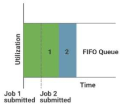
- 장점
  - 매우 단순하고 관리가 쉬움
  - 간단한 작업 환경에 적합
- 단점
  - 하나의 작업이 길면 뒤에 대기 중인 작업 지연 가능
  - 긴 작업이 클러스터 자원을 독점하는 문제

## YARN의 스케줄링 방식 - `Capacity`
- Capacity Scheduler(용량 기반 스케줄러)
  - 클러스터 리소스를 여러 개의 큐(Queue)로 나누어 각 큐 별로 미리 정해진 자원을 할당하여 운영

    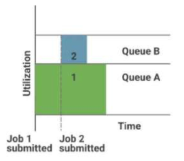
- 장점
  - 조직별, 팀별 자원 관리가 쉬움
  - 안정적이고 예측 가능한 성능 제공
- 단점
  - 큐 설정이 복잡하고 관리가 까다로울 수 있음
  - 특정 큐의 자원이 비효율적으로 방치될 수 있음

- Capacity Scheduler: 큐 용량 개념 이해

  ```js
  $HADOOP_CONF_DIR/capacity-scheduler.xml

  <property>
      <name>yarn.scheduler.capacity.root.default.maximum-capacity</name>
      <value>30</value>
  </property>
  ```
  - Configured Capacity
    - 큐 간 비율 기준 용량 (ex. 100%)
  - Maximum Capacity
    - 큐가 점유할 수 있는 최대치 제한
  - Absolute Configured Max Capacity
    - 클러스터 전체 자원 기준으로 환산된 큐의 최대 허용 비율 (ex. 30%)
  - 웹 브라우저에서 http://localhost:8088 접속
  - 상단 메뉴에서 "Scheduler" 탭 클릭
  - 하단 또는 우측에 있는 Queue Hierarchy 테이블 확인
  - 해당 큐(root, default 등)를 클릭하면 상세 항목이 표시됨

    

## YARN의 스케줄링 방식 - `Fair`
- Fair Scheduler(공정 스케줄러)
  - 모든 사용자의 작업이 공정하게 자원을 공유할 수 있도록 보장하는 방식

    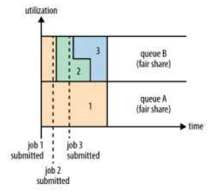
    - 사용자가 job을 제출하면 현재 사용 가능한 queue에 동등하게 나눠서 사용
- 장점
  - 특정 사용자의 작업 독점 방지
  - 자원의 효율적인 공유 및 활용
- 단점
  - 작업 개수가 많아질수록 관리 복잡성 증가
  - 빈번한 작업 전환 시 추가적인 오버헤드 발생 가능

### YARN의 스케줄링 방식 비교
| 구분 | FIFO Scheduler | Capacity Scheduler | Fair Scheduler |
|------|----------------|------------------|----------------|
| 관리 난이도 | 쉬움 | 중간~어려움 | 중간 |
| 자원 효율성 | 낮음 | 높음 | 높음 |
| 자원 독점 가능성 | 높음 | 낮음 | 매우 낮음 |
| 적합 환경 | 단순 작업환경 | 팀 또는 조직 단위 환경 | 다수의 사용자 환경 |

- 작업 스케줄러 선택 시
  - 작업 특성: 짧은 작업 위주 vs 긴 작업 위주
  - 사용자 수: 단일 사용자 vs 다중 사용자
  - 자원 관리 방식: 고정 자원 할당 vs 동적 자원 할당
  - 시스템 복잡성: 관리가 단순한 구조 vs 세부적인 관리 필요성
  - → 조직 환경과 목표에 맞게 적합한 스케줄러 선택 필요함

### 실제 환경에서 YARN을 어떻게 활용할까?
`data_engineering\08_Hadoop\Chapter2\yarn.md` 참고

- YARN 로그 위치 및 조회 방법
  - YARN 로그 파일 기본 위치 
    ```sh
    $HADOOP_HOME/logs/
    ```
  - 로그 조회 명령어 예시
    ```bash
    # 실행 중인 Application 목록 확인
    # -appStates 옵션은 필터링 할 상태를 지정할 때 사용
    yarn application -list -appStates ALL

    # 특정 Application 로그 조회
    yarn logs -applicationId <application_id>
    ```
    - ALL : 상태 확인 (성공/실패)

  - 로그 조회 명령어 예시 실행 결과

    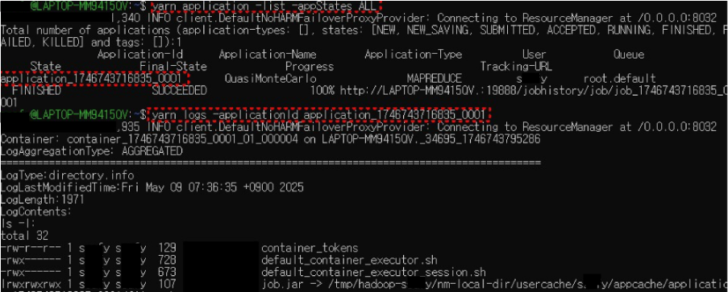
    ```bash
    my@LAPTOP-MM9415QV:~$ yarn application -list -appStates ALL
    ...
    State       Application-Id                 Application-Name  Application-Type  User   Queue
    FINISHED    application_1746743716835_0001 QuasiMonteCarlo   MAPREDUCE         my  root.default
    ...

    my@LAPTOP-MM9415QV:~$ yarn logs -applicationId application_1746743716835_0001
    ...
    LogAggregationType: AGGREGATED
    LogType: directory.info
    LogLastModifiedTime: Fri May 09 07:36:35 +0900 2025
    LogLength: 1971
    LogContents:
    ls -l:
    total 32
    -rw-r----- 1 my my 129 container_tokens
    -rwx------ 1 my my 728 default_container_executor.sh
    -rwx------ 1 my my 673 default_container_executor_session.sh
    lrwxrwxrwx 1 my my 107 job.jar -> /tmp/hadoop-my/nm-local-dir/usercache/...
    ...
    ```

- FIFO / Capacity / Fair 스케줄러 설정 변경
  - 작업 스케줄링 설정 변경(1) : FIFO로 변경하기
  - FIFO Scheduler -> `yarn-site.xml` 변경
  - 스케줄러 설정 예시

    ```xml
    <property>
      <name>yarn.resourcemanager.scheduler.class</name>
      <value>org.apache.hadoop.yarn.server.resourcemanager.scheduler.fifo.FifoScheduler</value>
    </property>
    ```
    ```bash
    docker compose down -v
    ```
    - down 후 다시 up

  - 작업 스케줄링 설정 변경(2) : Capacity로 변경하기
  - Capacity Scheduler -> `yarn-site.xml` 변경
  - 스케줄러 설정 예시

    ```xml
    <property>
      <name>yarn.resourcemanager.scheduler.class</name>
      <value>org.apache.hadoop.yarn.server.resourcemanager.scheduler.capacity.CapacityScheduler</value>
    </property>
    ```
    ```bash
    docker compose down -v
    # 새로운 상태로 다시 시작
    docker compose build --no-cache
    docker compose up -d
    ```

  - 작업 스케줄링 설정 변경 (3) : Fair로 변경하기
  - Fair Scheduler -> `yarn-site.xml` 변경
  - 스케줄러 설정 예시
    ```xml
    <property>
      <name>yarn.resourcemanager.scheduler.class</name>
      <value>org.apache.hadoop.yarn.server.resourcemanager.scheduler.fair.FairScheduler</value>
    </property>
    ```
    ```bash
    docker compose down -v
    # 새로운 상태로 다시 시작
    docker compose build --no-cache
    docker compose up -d
    ```

### 작업 스케줄링 설정 변경 및 테스트
- 변경 적용 방법

  ```bash
  # ResourceManager 재시작 명령어 (변경사항 적용)
  # 클러스터에 적용된 설정이 반영되도록 하는 핵심 단계 = 반드시 실행해야 함
  # Docker 기반으로 실행하는 경우 container 재실행
  stop-yarn.sh
  start-yarn.sh
  ```
  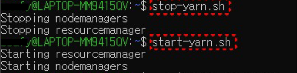


### 작업 스케줄러 적용 시 유의사항
| 항목   | 주의사항 요약                                                                 |
|--------|------------------------------------------------------------------------------|
| FIFO   | 단일 사용자 환경에서는 효율적이나, 긴 작업이 전체 흐름을 막을 수 있음        |
| Capacity | 큐 구성이 복잡할 수 있음(큐 간 자원 이동 불가 기본 설정)                     |
| Fair   | 초기 설정이 까다로우며, 사용자 간 형평성을 맞추기 위한 정책 설정 필요        |
| 공통   | 설정 변경 후에는 반드시 ResourceManager 재시작 필수, 스케줄러 변경시 conf 디렉토리 백업 권장 |


