# HDFS와 Elasticsearch 연계
## HDFS
### Hadoop Distributed File System
- 2003년 Google File System(GFS) 논문에 영감을 받아 Doug Cutting과 Mike Cafarella가 개발  
- Apache Hadoop 프로젝트의 핵심 구성 요소  
- 자바로 작성된 오픈소스 프레임워크  

### 대용량 데이터를 위한 분산 파일 시스템
- 페타바이트(PB) 규모의 데이터 저장 가능  
- 수백~수천 노드로 구성된 클러스터에서 운영
  - 클러스터 구성만으로 훨씬 큰 용량의 분산 파일 시스템을 만들 수 있음
- 스트리밍 방식의 데이터 접근 패턴에 최적화  
- 한 번 쓰고 여러 번 읽는(Write-Once-Read-Many) 사용 패턴에 최적화  
  - 로그, 센서와 같이 쌓아두고 읽는 형태의 데이터에 강함
  
    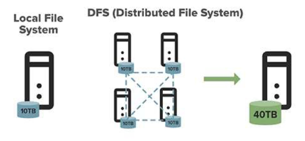

### 기존 파일 시스템과의 차이점
- 분산 저장
  - 데이터가 여러 머신에 분산되어 저장됨  
- 큰 블록 단위 저장
  - 일반 파일 시스템은 4KB 블록이지만, HDFS는 기본 128MB  
  - 블록 단위를 크게 사용하면, 대용량 파일 관리 시 탐색 비용이 줄어든다는 장점이 있음 (파일 하나만 읽으면 되므로)
    - 메타 데이터 관리도 용이해짐
    - 파일 개수가 적으므로 파일 하나에 대한 메타데이터도 전체적으로 봤을 때 파일 여러개 일 때보다 적음
- 복제
  - 기본적으로 각 블록은 서로 다른 노드와 랙에 3개의 복제본 유지  
- 메타데이터 분리
  - 파일 시스템 메타데이터와 실제 데이터가 분리되어 관리됨 
  - 메타데이터 - NameNode / 실제 데이터 - DataNode

### 마스터-슬레이브 아키텍처
- 중앙 집중식 마스터(NameNode)와 다수의 슬레이브(DataNode)로 구성  
- 명확한 역할 분담으로 관리 용이성과 확장성 확보  
- 마스터는 메타데이터 관리, 슬레이브는 실제 데이터 저장 및 처리 담당 
  
  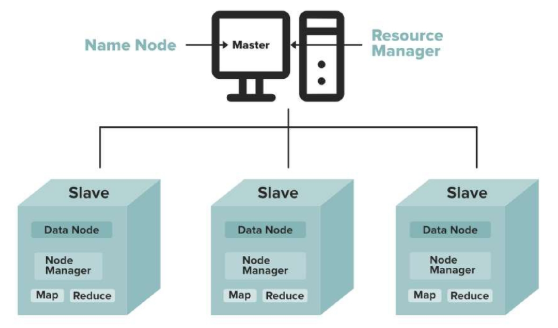

### HDFS (Hadoop Distributed File System)
크고 무거운 파일을 Block 단위로 쪼개어 여러 서버에 나눠 저장하는 분산 저장 시스템

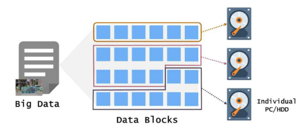

- HDFS의 특징 4가지
  1. 블록 단위 저장
      - HDFS는 대용량 파일을 그대로 저장하지 않음  
      - **기본값인 128MB 크기의 블록 단위로 나누어 여러 서버에 나눠 저장**  
      - 한 서버에 안 들어가는 큰 파일도 저장 가능하며, 분산 저장을 통해 속도와 확장성 향상  

  2. 데이터 안정성
      - 각 블록은 기본적으로 3개씩 복제되며, 서로 다른 서버에 저장됨  
      - 복제 개수는 설정 가능  
      - 장애 발생 시 다른 서버의 복제본으로 자동 복구되어 데이터 손실 위험이 매우 낮음  

  3. 데이터 무결성
      - HDFS는 저장 후 파일 수정 불가능 (중간 수정은 불가능, append는 지원함) 
      - 읽기, 삭제, 복사만 가능 → 데이터가 중간에 바뀔 일 없음  
      - 여러 사용자가 동시에 접근하더라도 데이터 변경이 발생하지 않아 병렬 작업에 적합  

  4. 배치 처리 최적화
      - 실시간 처리보다 대규모 데이터를 한 번에 처리하는 **배치 작업에 최적화**  
      - 스트리밍 방식으로 데이터를 순차적으로 읽어 처리 속도와 효율성이 높음  

### 기존 파일 시스템 VS HDFS
| 구분       | 기존 파일 시스템      | HDFS                                |
|------------|------------------------|--------------------------------------|
| 저장 방식  | 단일 서버에 전체 저장 | 여러 서버에 블록 단위로 분산 저장   |
| 장애 복구  | 별도 백업 필요, 복잡함 | 자동 복제 및 장애 복구              |
| 확장성     | 서버 성능 한계로 제한 | 노드 추가로 손쉽게 확장             |

### HDFS 아키텍처

- NameNode
  - 파일 시스템의 네임스페이스(디렉토리 트리) 관리  
    - 디렉토리 구조, 파일 경로, 파일 이름 등 관리
  - 파일-블록 매핑 정보와 블록-데이터노드 매핑 정보 관리  
  - 클라이언트의 파일 접근 요청 처리  
  - 메모리에 모든 메타데이터 유지 (빠른 응답을 위해)  
  - 주기적으로 FsImage와 EditLog 파일을 디스크에 유지  
    - 메모리는 휘발성이므로! (컴퓨터 껐다 키면 날아감)
    - `FsImage` : 전체 파일 시스템에 대한 스냅샷
    - `EditLog` : 변경 내용들만 기록한 로그

- DataNode
  - 실제 데이터 블록 저장 및 제공  
  - 주기적으로 NameNode에 하트비트와 블록 리포트 전송  
  - 클라이언트의 데이터 read/write 요청 직접 처리  
  - 블록 데이터의 무결성 검증을 위한 체크섬 관리  
    - 자신(DataNode)이 저장한 노드가 손상되었는지 확인
    - 문제 발생 시 NameNode에게 보고 -> 다른 복제본으로부터 손상 복구

### 블록 개념 (기본 128MB)
- HDFS에서 모든 파일은 블록 단위로 분할되어 저장됨
- 기본 블록 크기는 256MB (Hadoop 3.x)  
- 일반 파일 시스템(4KB)보다 훨씬 큰 블록 크기를 사용하는 이유
  - 탐색 비용 감소
    - 디스크 탐색은 비용이 높은 작업  
  - 메타데이터 오버헤드 감소
    - 큰 파일을 관리하는데 필요한 메타데이터 양 감소  
  - 네트워크 효율성
    - 블록 전송 시 설정 시간(Setup Time) 대비 전송 시간 향상  

- 예시
  - 만약 HDFS에 400MB 데이터가 들어온다면, 
  - 128MB 크기의 블록 3개와 나머지 크기의 블록 1개
  - 총 4개의 블럭으로 나눠서 전송하게 되는 구조가 됨

    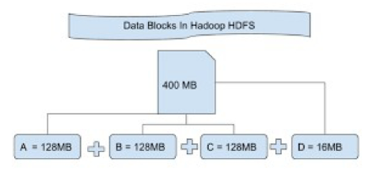

### 전체 구조 : 클라이언트, NameNode, DataNode, Secondary NameNode 
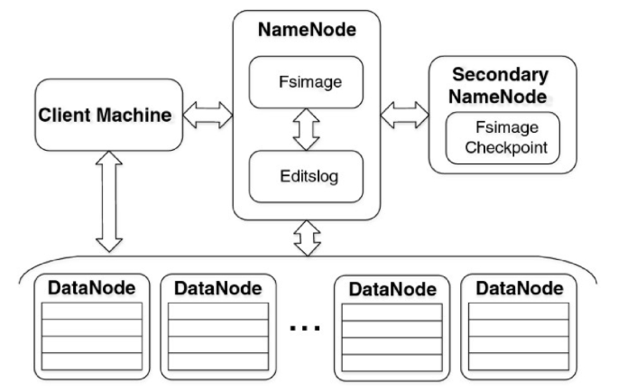
- NameNode
  - 메타데이터 관리하는 중심 노드
- DataNode
  - 실제 데이터를 나누어 저장, 처리하는 노드
- Client Machine
  - 클라이언트가 NameNode를 통해 블록 정보를 받고, 이후 DataNode와 직접 데이터를 주고받는 형태
- Secondary NameNode
  - 체크포인트 만드는 역할
  - NameNode는 메모리 상의 메타데이터(Fsimage, Editslog)를 관리하는데, 시간이 지날수록 변경 사항은 늘고 Editslog는 커짐
  - 그래서 Secondary NameNode가 Fsimage, Editslog를 합쳐서 주기적으로 체크포인트 이미지를 생성하여 NameNode가 너무 무거워지는 것을 방지할 수 있도록 함

### NameNode
메타데이터 관리, 네임스페이스 관리
- 역할과 기능
  - 파일 시스템 트리와 모든 파일과 디렉토리에 대한 메타데이터 관리  
  - 파일 시스템의 네임스페이스 유지 관리  
  - 클라이언트의 파일 열기, 닫기, 이름 변경 등의 작업 조정  
  - 데이터노드의 블록 배치 결정  
- 주요 파일
  - FsImage
    - 파일 시스템의 전체 상태를 캡처한 스냅샷 파일  
  - EditLog
    - 파일 시스템 변경 사항을 순차적으로 기록하는 트랜잭션 로그  
  - 두 파일은 영구 저장소에 저장되어 시스템 재시작 시 복구에 사용됨  
- 메모리 사용
  - 모든 메타데이터는 메인 메모리에 유지 (빠른 응답을 위해)  
  - 대규모 클러스터에서는 수십 GB의 RAM이 필요할 수 있음  

### DataNode
실제 데이터 저장 및 처리
- 주요 기능
  - 실제 파일 데이터를 블록으로 저장  
  - 저장된 블록에 대한 읽기/쓰기 연산 처리  
  - 블록 생성, 삭제 및 복제 작업 수행  
  - 주기적인 블록 검증(데이터 무결성 확인)  
- 주기적인 보고
  - 하트비트
    - 3초마다 NameNode에 전송하여 DataNode의 상태 보고  
  - 블록 리포트
    - 6시간마다 저장하고 있는 모든 블록 목록을 NameNode에 보고  
- 스토리지 관리
  - 로컬 파일 시스템에 블록 데이터 저장 (ext4, xfs 등)  
  - 각 블록은 두 개의 파일로 표현됨
    - 실제 데이터 파일과 메타데이터 파일(체크섬 등)  

### Secondary NameNode
체크포인트 생성

※ 주의 : Secondary NameNode는 NameNode의 백업이 아님 !!

- 주요 기능
  - NameNode의 FsImage와 EditLog를 주기적으로 병합  
  - NameNode 재시작 시간 단축을 위한 체크포인트 제공  
  - EditLog가 너무 커지는 것을 방지하여 시스템 성능 유지  
- 작동 방식
  - 설정된 주기(기본 1시간)마다 또는 EditLog 크기가 임계값에 도달하면 실행  
  - NameNode에서 FsImage와 EditLog 복사  
  - 메모리에서 두 파일을 병합하여 새로운 FsImage 생성  
  - 새 FsImage를 NameNode에 전송  

### HDFS Client 
파일 시스템 인터페이스 제공
- 사용자 애플리케이션이 HDFS와 상호작용하는 진입점  
- 주요 기능
  - 파일 시스템 API 제공 (파일 읽기, 쓰기, 삭제 등)  
  - NameNode 및 DataNode와의 통신 관리  
- 작동 방식
  - 파일 읽기
    - NameNode에서 블록 위치 정보를 얻고, DataNode에 직접 접근하여 데이터 읽기  
  - 파일 쓰기
    - NameNode에서 블록 할당을 받은 후 DataNode 파이프라인을 통해 데이터 쓰기  
  - 파일 시스템 작업
    - NameNode에 직접 요청을 보내 처리  


## HDFS 동작 원리
### 데이터 읽기 과정 (Read Pipeline)
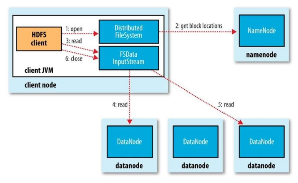
- 클라이언트 요청
  - 클라이언트가 HDFS API를 통해 파일 읽기 요청  
    ```sh
    hdfs dfs -cat /user/data/example.txt
    ```
    - 위 같은 명령어 실행

- NameNode 통신
  - 클라이언트는 NameNode에 파일 블록 위치 정보 요청  
  - NameNode는 요청된 파일의 블록 목록과 각 블록이 위치한 DataNode 목록 반환  

- DataNode 직접 액세스
  - 클라이언트는 가장 가까운 DataNode에 직접 연결하여 블록 데이터 요청  
    - 물리적인 가까움XX
  - 네트워크를 고려해 최적의 DataNode 선택  

- 데이터 스트리밍
  - DataNode는 요청된 블록 데이터를 클라이언트에게 스트리밍 형태로 전송함
  - 블록 전송 중 오류 발생 시 자동으로 다른 복제본으로 전환  

- 체크섬 검증
  - 클라이언트는 수신한 데이터의 체크섬을 검증하여 무결성 확인  
  - 오류 발생 시 다른 복제본에서 데이터 재요청  

### 데이터 쓰기 과정 (Write Pipeline)
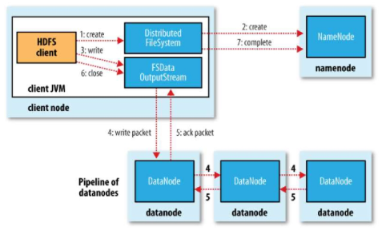
- 클라이언트 요청
  - 클라이언트가 HDFS API를 통해 파일 생성 및 쓰기 요청  
    ```sh
    hdfs dfs -put localfile.txt /user/data/
    ```
    - 위 같은 명령 실행  

- NameNode 통신
  - 클라이언트는 NameNode에 새 파일 생성 요청  
  - NameNode는 권한 확인 후 파일 생성을 허가하고 메타데이터 업데이트  

- 블록 할당
  - 클라이언트가 데이터를 쓰기 시작하면 HDFS는 데이터를 블록으로 분할  
  - 각 블록에 대해 NameNode에 블록 ID와 복제할 DataNode 목록 요청  

- 데이터 파이프라인 구성
  - 클라이언트는 첫 번째 DataNode에 연결  
  - DataNode들 간에 파이프라인 구성  
    - ex. Node1 → Node2 → Node3  

- 데이터 전송 및 복제
  - 클라이언트는 첫 번째 DataNode에 데이터 패킷 전송  
  - 첫 번째 DataNode는 데이터를 저장하고 동시에 파이프라인의 다음 DataNode로 전달  
  - 이 과정이 마지막 DataNode까지 계속되어 모든 복제본 생성  

- 확인 응답
  - 파이프라인의 마지막 DataNode부터 첫 번째 DataNode까지 역순으로 확인 응답  
  - 클라이언트는 모든 복제본이 성공적으로 생성되었다는 확인을 받음  

### HDFS Write 요청 정리
- 네임노드에 파일 정보를 전송하고, 파일의 블록을 써야할 노드 목록 요청  
- 네임노드가 파일을 저장할 목록 반환  
- 데이터 노드에 파일 쓰기 요청  
  - 데이터 노드 간 복제가 진행  
  - 첫 번째 datanode에 데이터를 쓰기 시작하고, 다른 datanode에 복제 데이터를 전송하면 쓰기 작업 완료  
    - 완료되면 응답 보냄

### 기본 명령어 체계
- 도움말 보기
  - `hdfs dfs -help`
    - 모든 명령어 목록 표시  
  - `hdfs dfs -help [command]`
    - 특정 명령어 상세 도움말  
    - ex. `hdfs dfs -help put`  
- 대부분의 명령은 Unix/Linux 명령어와 유사함
- 파일 경로는 절대 경로(`/user/hadoop/file.txt`) 또는 상대 경로 사용 가능  
- 로컬 파일 시스템과 HDFS 파일을 구별하기 위해 명시적 표기도 가능  
- HDFS
  - `hdfs://namenode:{port}/path`  
- 로컬
  - `file:///path`  

### 파일 및 디렉토리 관리 대표 명령어
- 탐색 명령어
  - `hdfs dfs -ls [path]`
    - 디렉토리 내용 나열  
  - `hdfs dfs -lsr [path]`
    - 재귀적으로 디렉토리 내용 나열 (하위 디렉토리 포함)  
  - `hdfs dfs -find [path] -name pattern`
    - 패턴과 일치하는 파일 찾기  
  - `hdfs dfs -count [-q] [path]`
    - 디렉토리 내 파일/디렉토리 수와 총 크기 계산  
- 디렉토리 관리
  - `hdfs dfs -mkdir [-p] [path]`
    - 디렉토리 생성 (`-p`: 부모 디렉토리도 필요 시 생성)  
  - `hdfs dfs -rmdir [path]`
    - 빈 디렉토리 삭제  

- 파일 관리
  - `hdfs dfs -cat [path]`
    - 파일 내용 출력  
  - `hdfs dfs -head [path]`
    - 파일의 첫 1KB 내용 출력  
  - `hdfs dfs -tail [-f] [path]`
    - 파일의 마지막 1KB 내용 출력 (`-f`: 파일 추가 감시)  
  - `hdfs dfs -touchz [path]`
    - 크기가 0인 새 파일 생성  
  - `hdfs dfs -rm [-r] [path]`
    - 파일 삭제 (`-r`: 재귀적 삭제)  
  - `hdfs dfs -cp [-f] source dest`
    - 파일 복사 (`-f`: 대상이 존재하면 덮어쓰기)  
  - `hdfs dfs -mv source dest`
    - 파일 이동 또는 이름 변경  
  - `hdfs dfs -stat [format] [path]`
    - 파일 상태 정보 확인  

### 파일 업로드/다운로드 명령어
- 로컬 → HDFS (업로드)
  - `hdfs dfs -put [-f] localpath hdfspath`
    - 로컬 파일을 HDFS로 업로드 (`-f`: 덮어쓰기)  
  - `hdfs dfs -copyFromLocal [-f] localpath hdfspath`
    - put과 동일  
  - `hdfs dfs -moveFromLocal localpath hdfspath`
    - 업로드 후 로컬 파일 삭제  
- HDFS → 로컬 (다운로드)
  - `hdfs dfs -get hdfspath localpath`
    - HDFS 파일을 로컬로 다운로드  
  - `hdfs dfs -copyToLocal hdfspath localpath`
    - get과 동일 기능  
  - `hdfs dfs -getmerge [-nl] source_dir local_file`
    - 여러 파일을 하나로 병합하여 다운로드  
  - `-n`: 각 파일 끝에 줄바꿈 추가  
  - `-l`: 각 줄바꿈 다음에 파일 이름 추가  


※ HDFS는 대규모 데이터 저장에 특화되어 있지만, 저장된 데이터를 실시간으로 빠르게 검색 및 분석하는 부분은 약함

-> Elasticsearch를 연계하여 보완 (ex. 대규모 텍스트, 로그 등)
## HDFS와 Elasticsearch 연계
### Elasticsearch & Kibana 설치 및 실행 (docker compose)
- `docker-compose-elastic.yml`  
- `sudo docker-compose up -d`

  ```yaml
  services:
    es01:
      image: docker.elastic.co/elasticsearch/elasticsearch:8.17.1
      container_name: es01
      environment:
        - node.name=es01
        - cluster.name=elastic-docker-cluster
        - discovery.seed_hosts=es01
        - cluster.initial_master_nodes=es01

        - node.roles=master,data,ingest
        - "ES_JAVA_OPTS=-Xms512m -Xmx512m"
        - xpack.security.enabled=false
      volumes:
        - ./config/dictionary:/usr/share/elasticsearch/config/dictionary
      ports:
        - 9200:9200
      networks:
        - elastic
      healthcheck:
        test: ["CMD-SHELL", "curl -f http://localhost:9200/_cluster/health || exit 1"]
        interval: 5s
        retries: 5
      command: >
        sh -c '
        if [ -d /usr/share/elasticsearch/plugins/analysis-nori ]; then
          elasticsearch-plugin install analysis-nori --batch;
        fi &&
        exec /usr/local/bin/docker-entrypoint.sh elasticsearch
        '

    kibana:
      image: docker.elastic.co/kibana/kibana:8.17.1
      container_name: kibana
      depends_on:
        es01:
          condition: service_healthy
      environment:
        - SERVER_NAME=kibana
        - ELASTICSEARCH_HOSTS=http://es01:9200

        - XPACK_ALERTING_ENABLED=false
        - XPACK_ACTIONS_ENABLED=false
        - XPACK_RULE_REGISTRY_WRITE_ENABLED=false
        - TELEMETRY_ENABLED=false
        - XPACK_SECURITY_SOLUTION_ENABLED=false
        - XPACK_INFRA_ENABLED=false
        - XPACK_LOGS_ENABLED=false
        - XPACK_APM_ENABLED=false
        - XPACK_FLEET_ENABLED=false
        - XPACK_SECURITY_ENABLED=false
        - XPACK_OBSERVABILITY_ENABLED=false
        - XPACK_REPORTING_ENABLED=false
        - XPACK_ML_ENABLED=false
        - TELEMETRY_ENABLED=false
        - MONITORING_ENABLED=false
      ports:
        - 5601:5601
      networks:
        - elastic
  ```

### HDFS 저장 및 Elasticsearch 저장
※ `data_engineering\08_Hadoop\Chapter3_HDFS&Elastic\hdfs_to_es.md` 참고
- CSV 파일 옮기기

  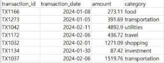
  - HDFS에 finance 디렉토리 만들기
    ```sh
    # HDFS에 데이터를 올리기 위함
    hdfs dfs -mkdir -p /user/local/hadoop_data/
    ```

  - 로컬에 있는 CSV 파일을 HDFS로 전송
    ```sh
    hdfs dfs -put transactions.csv /user/local/hadoop_data/transactions.csv
    ```

  - HDFS에서 파일 목록 확인
    ```sh
    hdfs dfs -ls /user/local/hadoop_data
    ```

  - HDFS → 로컬 CSV 파일 다운로드도 가능
    ```sh
    hdfs dfs -get /user/local/hadoop_data/transactions.csv
    ```

### PySpark로 HDFS에서 로컬로 불러오기
HDFS에 저장한 파일을 Spark를 통해 가공 처리를 함 

ex. 분석을 위해
- `data_engineering\08_Hadoop\Chapter3_HDFS&Elastic\test_read_hdfs.py`

  ```python
  from pyspark.sql import SparkSession

  # SparkSession 생성
  spark = SparkSession.builder \
      .appName("Read HDFS CSV") \
      .master("local[*]") \
      .getOrCreate()

  # HDFS의 CSV 파일 읽기
  df = spark.read.option("header", "true") \
      .csv("hdfs://localhost:9000/user/local/hadoop_data/transactions.csv")

  # 데이터 출력 (검증용)
  df.show()

  # JSON 파일로 로컬 디스크에 저장
  df.write.mode("overwrite").json("file:///home/my/hadoop_data/transactions")
  ```
  - Spark 세션 생성 필수
  - HDFS에 있는 파일 읽기 -> (가공) -> 처리 후 로컬로 이동
    - HDFS와 Elasticsearch에 직접적으로 연동하는게 불가능하진 않지만 호환 이슈
    - 안전하게 중간 단계로 로컬에 두고, bulk 형태로 Elasticsearch에 적재하는 형태로 하자
    - 또, HDFS의 데이터를 Spark로 처리하고 파일로 저장하면 Spark의 효율적인 데이터 처리 후 분석이 필요한 데이터만 Elasticsearch로 이동할 수 있게 됨

### Python 코드로 Elasticsearch로 업로드
- `data_engineering\08_Hadoop\Chapter3_HDFS&Elastic\upload_to_es.py`

  ```python
  import os
  import json
  from elasticsearch import Elasticsearch, helpers
  from elasticsearch.exceptions import RequestError

  # 1. Elasticsearch 연결
  es = Elasticsearch("http://localhost:9200")

  # 2. JSON 파일 경로 및 인덱스 이름
  data_dir = "/home/my/hdfs_to_es/transactions"
  index_name = "finance-transactions"

  # 3. 매핑 정의
  index_mapping = {
      "mappings": {
          "properties": {
              "transaction_id":   { "type": "keyword" },
              "transaction_date": { "type": "date", "format": "yyyy-MM-dd|| strict_date_optional_time" },
              "amount":           { "type": "float" },
              "category":         { "type": "keyword" }
          }
      }
  }
  ```
  - elasticsearch에 데이터 적재를 위한 인덱스 생성, 클라이언트 연결 단계

  ```python
  # 5. part-*.json 파일 찾기
  json_files = [
      os.path.join(data_dir, f)
      for f in os.listdir(data_dir)
      if f.startswith("part-") and f.endswith(".json")
  ]

  # 6. 모든 JSON 줄을 읽어 bulk action 리스트로 변환
  actions = []
  for file_path in json_files:
      with open(file_path, "r", encoding="utf-8") as f:
          for line in f:
              doc = json.loads(line)
              actions.append({
                  "_index": index_name,
                  "_source": doc
              })

  # 7. Elasticsearch로 bulk 적재
  if actions:
      response = helpers.bulk(es, actions)
      print(f"[SUCCESS] {len(actions)} documents indexed to [{index_name}]")
  else:
      print("[WARN] No documents found to index.")
  ```
  - json 파일들 리스트 형태로 읽고, bulk 형태로 넣기 위한 처리 과정(source)
    - 엘라스틱 서치에 데이터 적재하는 과정
    - 한건씩 넣는 것이 아닌, 여러 데이터를 한번에 적재함
  
  - 결과

    

### 확인
- Kibana → Dev Tools
  - mapping, 데이터 적재 확인

    ```http
    GET finance-transactions/_mapping
    ```
    ```json
    {
      "finance-transactions": {
        "mappings": {
          "properties": {
            "amount": {
              "type": "float"
            },
            "category": {
              "type": "keyword"
            },
            "transaction_date": {
              "type": "date",
              "format": "yyyy-MM-dd||strict_date_optional_time"
            },
            "transaction_id": {
              "type": "keyword"
            }
          }
        }
      }
    }
    ```

    ```http
    GET finance-transactions/_search
    ```
    ```json
    {
      "hits": {
        "total": {
          "value": 300,
          "relation": "eq"
        },
        "max_score": 1,
        "hits": [
          {
            "_index": "finance-transactions",
            "_id": "Kvjj0zBYB5SQALfF14zIV",
            "_score": 1,
            "_source": {
              "transaction_id": "TX1166",
              "transaction_date": "2024-01-08",
              "amount": 273.11,
              "category": "food"
            }
          },
          {
            "_index": "finance-transactions",
            "_id": "K_j0zBYB5SQALfF14zIV",
            "_score": 1,
            "_source": {
              "transaction_id": "TX1273",
              "transaction_date": "2024-01-05",
              "amount": 391.69,
              "category": "transportation"
            }
          }
        ]
      }
    }
    ```

### 고도화 방안
- 현재 구조
  - HDFS 내 CSV 파일을 로드
  - PySpark로 JSON 변환 및 파일 로컬로 이동 (Elasticsearch는 HDFS와 직접 통신하기 어려움)
  - JSON 변환 후 Elasticsearch에 일괄 적재

  | 고도화               | 개선 아이디어 및 기술             | 기대 효과                                |
  |----------------------|-----------------------------------|-------------------------------------------|
  | 적재 자동화          | Apache Airflow 도입               | 주기적 적재, 실패 자동 재시도 가능       |
  | 실시간 처리 전환     | Apache Kafka + Flink              | 실시간 데이터 흐름 → 분석 적시성 향상    |
  | 데이터 정합성 검증   | Elasticsearch ↔ HDFS 비교 로직 추가 | 오류 탐지 및 보정                        |
  | 대시보드 시각화 고도화 | Kibana Lens 및 Dashboard 활용     | 사용자 맞춤 시각화, 실시간 경보 가능     |


## Kibana로 데이터 검색 및 시각화
### Kibana Index 확인
- Kibana에서 finance_transactions 인덱스를 확인하는 방법
- Kibana 접속 (http://localhost:5601)
- Stack Management → Index Management
  - 현재 클러스터 화면이 뜸 -> 클러스터에 있는 모든 인덱스 확인

    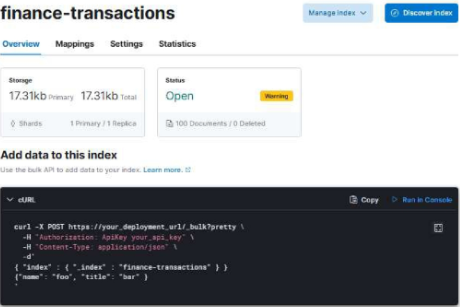
    - 인덱스 정보 요약 표시됨
    - 명령어 예시도 제시해줌

### Kibana Index 추가하는 방법
Kibana에서 finance-transactions 인덱스를 추가하는 방법

- Stack Management → Kibana(Data Views)
  - create data view 클릭

    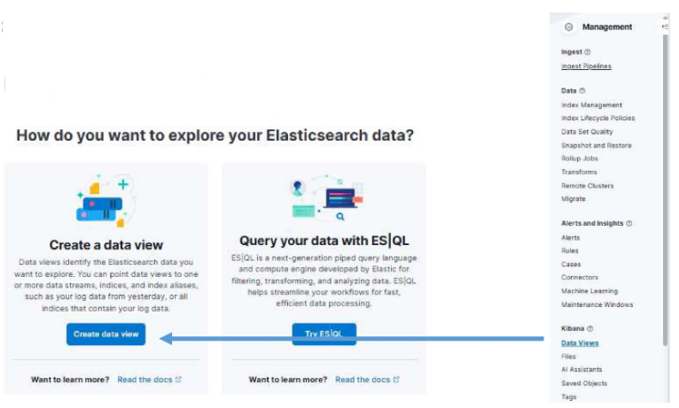

    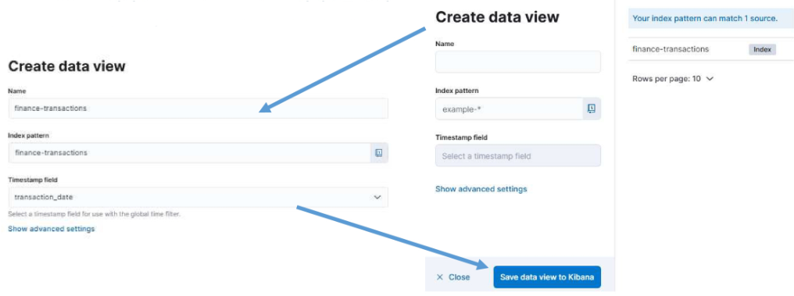

### Kibana를 통한 모니터링
- Kibana Discover 탐색
- Kibana 시각화
- Kibana 대시보드 구축  
  - 실시간으로 데이터가 추가되는 로그와 같은 데이터는 대시보드 상에서 데이터가 들어올 때마다 변화함

  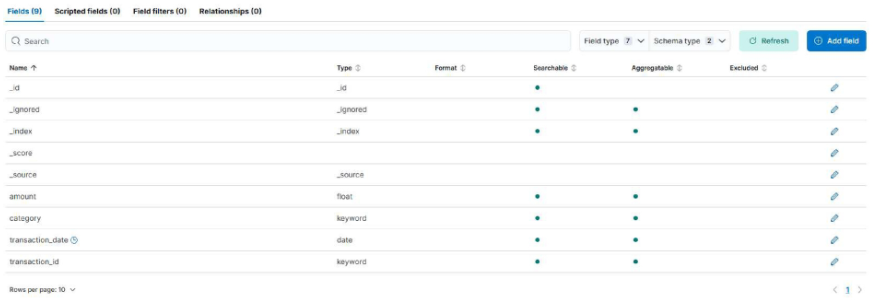

- Kibana Discover 탐색

  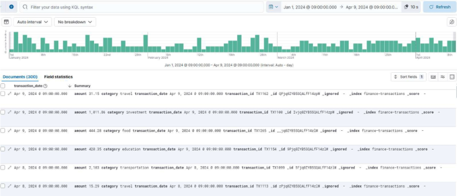
  - 어떤 요소를 모니터링하면 좋을지 확인

- Kibana Dashboard Create

  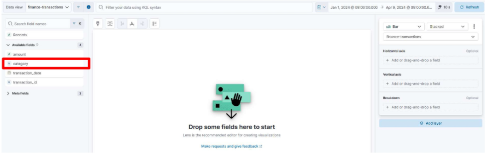

- 카테고리별 record 퍼센트 파악

  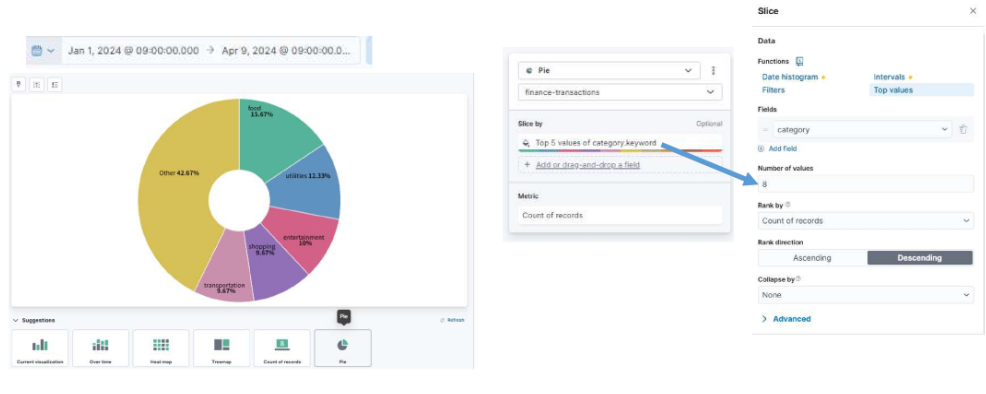

- 시간 흐름에 따른 대기질 수치의 변화

  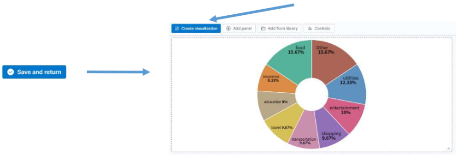

- 전체 날짜에 대한 각 날짜별 들어온 카테고리 개수

  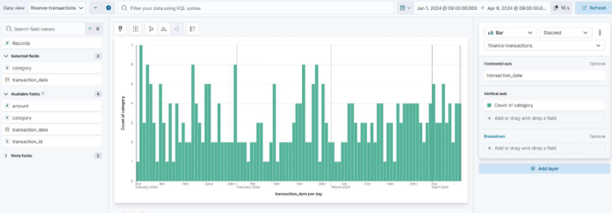

- 전체 날짜에 대한 각 날짜별 들어온 카테고리 개수

  

## Kibana 언어 KQL
- Kibana에서 제공하는 사용자 친화적인 쿼리 언어
- 검색창에서 실시간 필터링 가능
- amount > 300이 넘는 거래를 한 경우 사은품을 준다고 가정한다면 조건을 amount > 300으로 대시보드 확인

  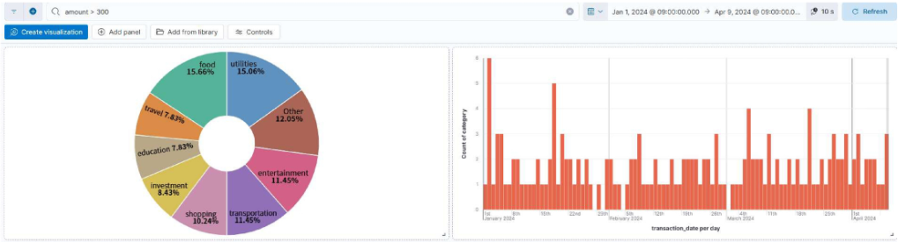