# Vue with DRF
## DRF 프로젝트 안내
- 스켈레톤 프로젝트 django-pjt 제공
- 외부 패키지 및 라이브러리는 requirements.txt에 작성되어 있음
    - DRF 프로젝트는 "주석을 해제"하며 진행

### Skeleton code 살펴보기
- Model 클래스 확인

    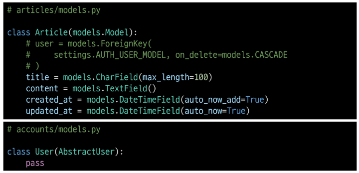
- URL 확인

    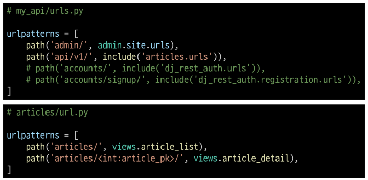
- Serializers 확인

    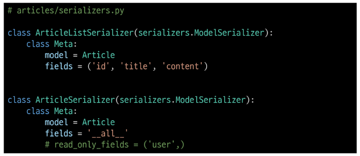
- views.py의 import 부분 확인

    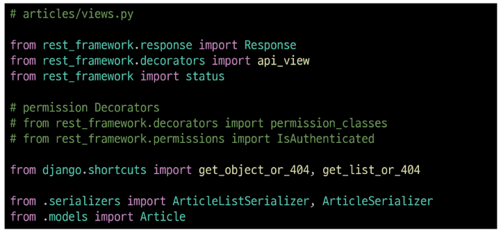
- View 함수 확인

    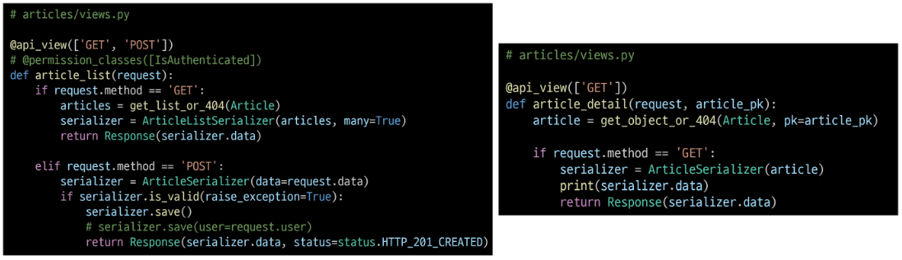
- settings.py 확인

    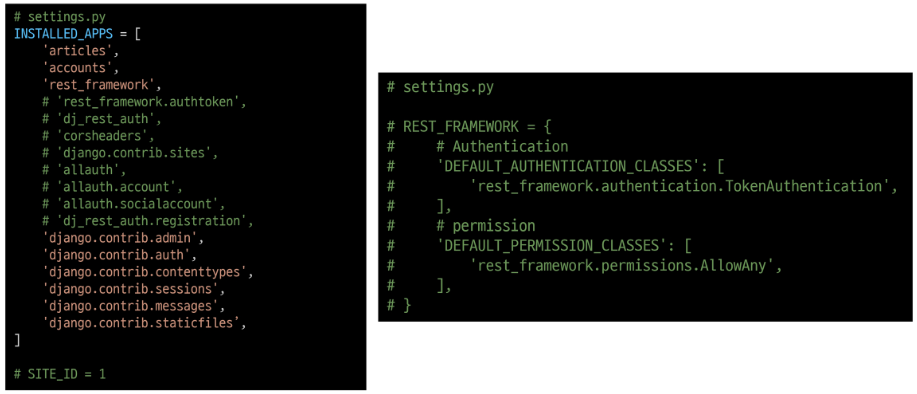
    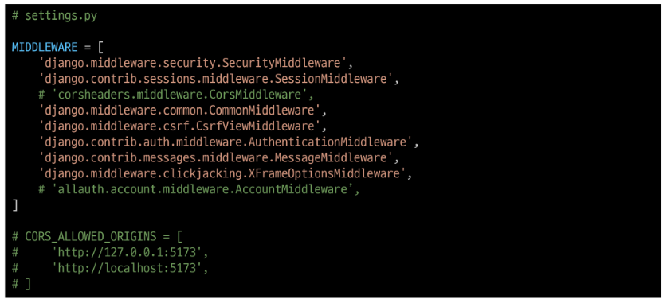

- Fixtures 확인

    
- 가상 환경 생성 및 활성화

    ```bash
    $ python -m venv venv
    $ source venv/Scripts/activate
    ```
- 패키지 설치

    ```bash
    $ pip install -r requirements.txt
    ```
- Migration 진행

    ```bash
    $ python manage.py makemigrations
    $ python manage.py migrate
    ```
- Fixtures 데이터 로드

    ```bash
    $ python manage.py loaddata articles.json
    ```
- Django 서버 실행 후, 전체 게시글 조회 요청
  - http://127.0.0.1:8000/api/v1/articles/
    
    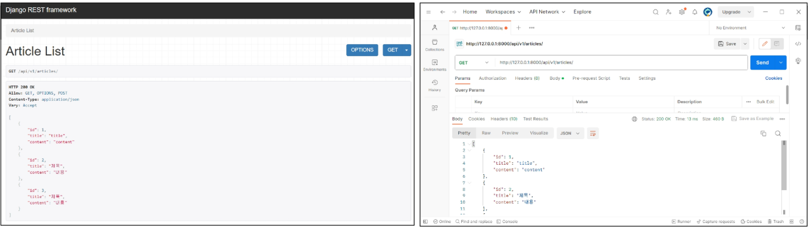


## Vue 프로젝트 안내
- 스켈레톤 프로젝트 vue-pjt 제공
- Vite를 사용해 Pinia 및 Vue Router가 추가 되어있음
- pinia-plugin-persistedstate

### 컴포넌트 구조
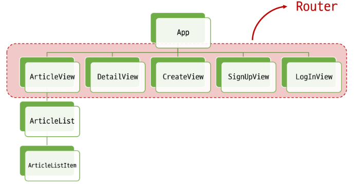

### 프로젝트 구조
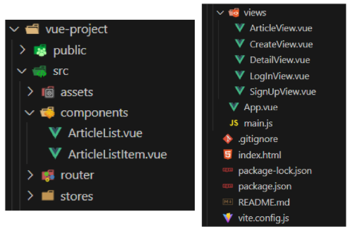

### Skeleton code 살펴보기
- App 컴포넌트

    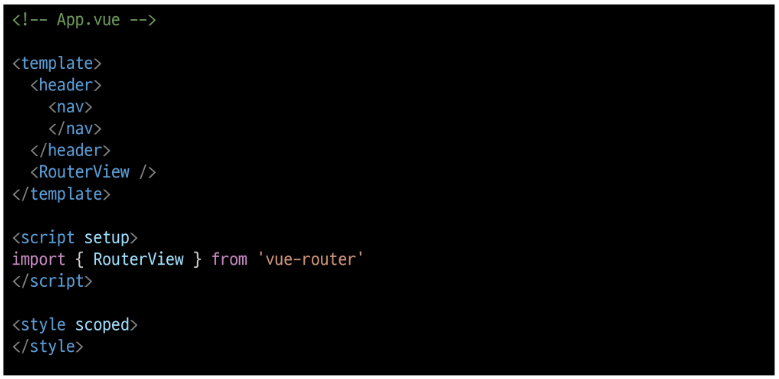
- route에 등록된 컴포넌트 (Article, Create, Detail, LogIn, SignUp)

    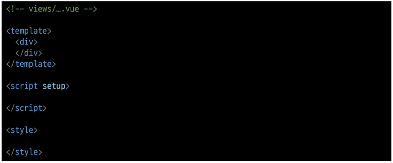
- ArticleList 컴포넌트

    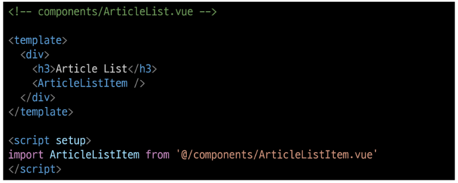
- ArticleListItem 컴포넌트

    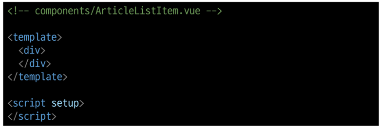
- routes 현황

    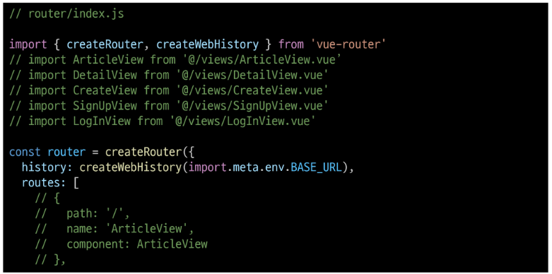
- store 현황

    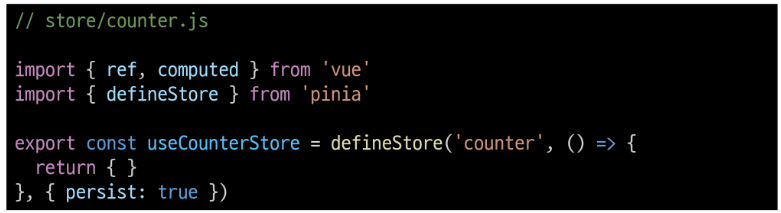
- main.js 현황

    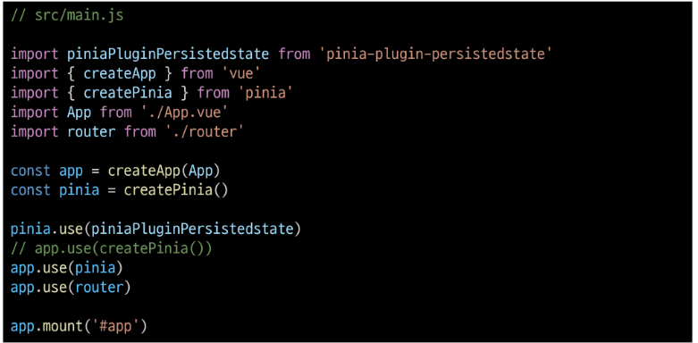
- 패키지 설치

    ```bash
    $ npm install
    ```
- 서버 실행

    ```bash
    $ npm run dev
    ```


## 메인 페이지 구현
### 게시글 목록 출력
- 개요
    - ArticleView 컴포넌트에 ArticleList 컴포넌트와 ArticleListItem 컴포넌트 등록 및 출력하기
    - ArticleList와 ArticleListItem은 각각 게시글 출력을 담당

- ArticleView의 route 관련 코드 주석 해제

    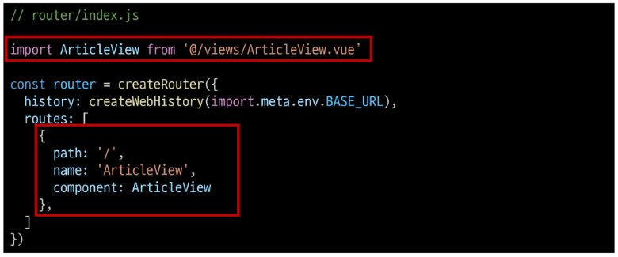
- App 컴포넌트에 ArticleView 컴포넌트로 이동하는 RouterLink 작성

    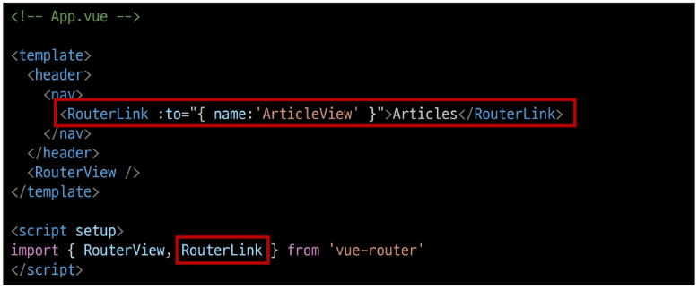
- ArticleView 컴포넌트에 ArticleList 컴포넌트 등록

    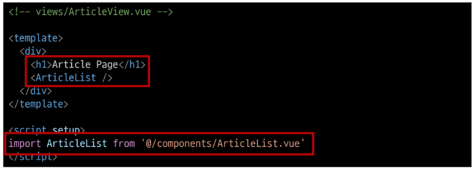
- store에 임시 데이터 articles 배열 작성하기

    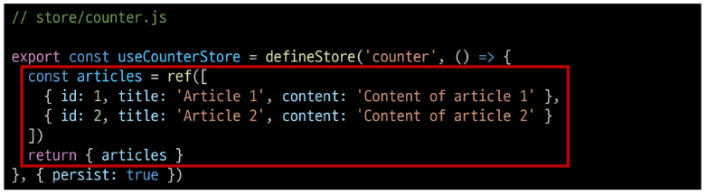
- ArticleList 컴포넌트에서 게시글 목록 출력  
    - store의 articles 데이터 참조  
    - v-for를 활용하여 하위 컴포넌트에서 사용  
    - article 단일 객체 정보를 props로 전달

        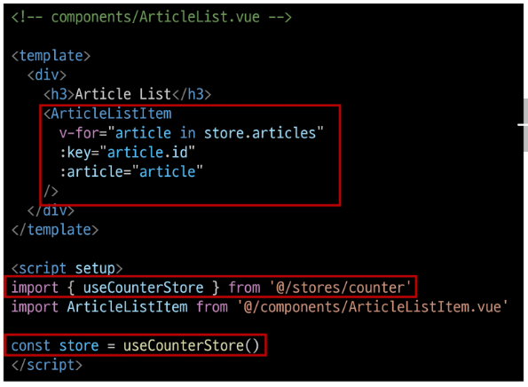
- ArticleListItem 컴포넌트는 내려 받은 props를 정의 후 출력

    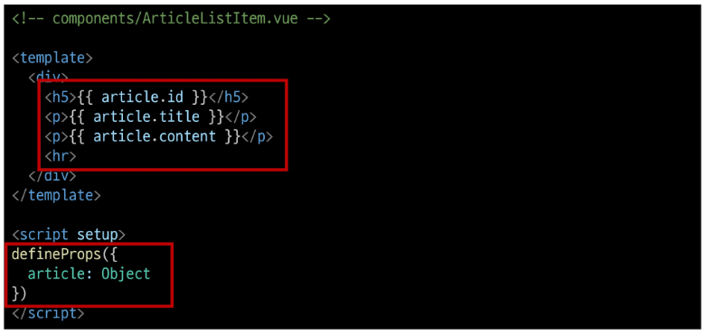
- 메인 페이지에서 게시글 목록 출력 확인

    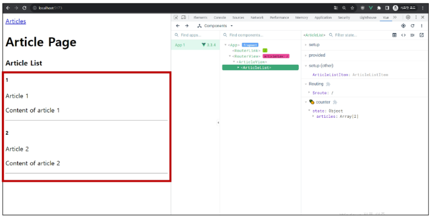

### DRF와의 요청과 응답
DRF 서버에 요청하여 데이터를 응답 받아 store에 저장 후 출력하기

- DRF 서버로의 AJAX 요청을 위한 axios 설치 및 관련 코드 작성  

    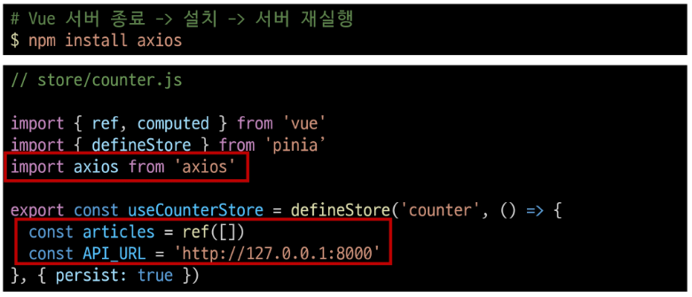
- DRF 서버로 요청을 보내고 응답 데이터를 처리하는 getArticles 함수  

    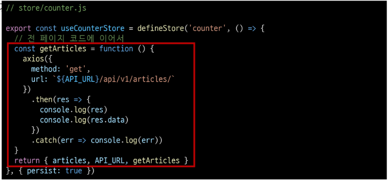
- ArticleView 컴포넌트가 마운트 될 때 getArticles 함수가 실행되도록 함  
    - 해당 컴포넌트가 렌더링 될 때 항상 최신 게시글 목록을 불러오기 위함  

    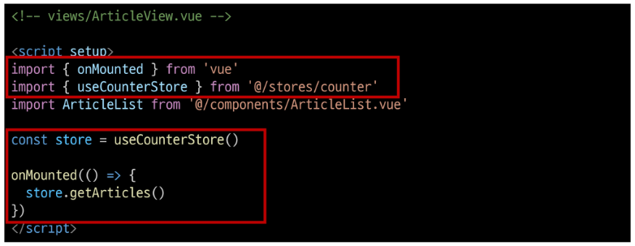
- Vue와 DRF 서버를 모두 실행한 후 응답 데이터 확인  
    - 에러 발생

        
- 그런데 DRF 서버 측에서는 문제 없이 응답했음 (200 OK)  

    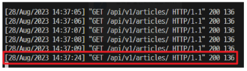
    - 서버는 응답했으나 브라우저 측에서 거절한 것
- 브라우저가 거절한 이유  

    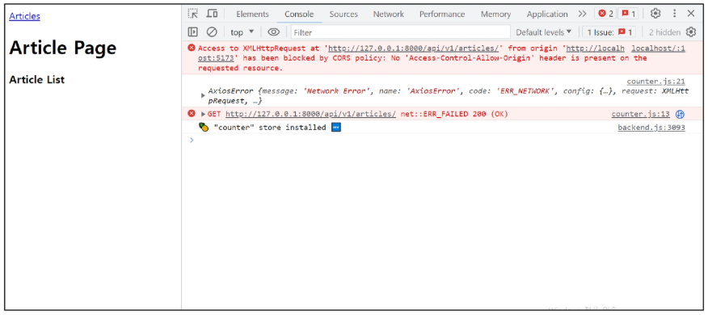
    - `localhost:5173`에서 `127.0.0.1:8000/api/v1/articles/`의 XMLHttpRequest에 대한 접근이 **CORS policy** 에 의해 차단됨


## CORS Policy
### SOP (Same-origin policy)
동일 출처 정책

- 어떤 출처(Origin)에서 불러온 문서나 스크립트가 다른 출처에서 가져온 리소스와 상호 작용하는 것을 제한하는 보안 방식
    - "다른 곳에서 가져온 자료는 일단 막는다."
    - 웹 애플리케이션의 도메인이 다른 도메인의 리소스에 접근하는 것을 제어하여 사용자의 개인 정보와 데이터의 보안을 보호하고, 잠재적인 보안 위협을 방지
    - 잠재적으로 해로울 수 있는 문서를 분리함으로써 공격받을 수 있는 경로를 줄임

### Origin (출처)
URL의 Protocol, Host, Port를 모두 포함하여 "출처"라고 부름

- Same Originm 예시
  - 아래 세 영역이 일치하는 경우에만 동일 출처(Same-origin)로 인정
    
    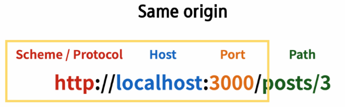

  - 기준: `http://localhost:3000/articles/3/` 을 기준으로 동일 출처 여부 비교
    
    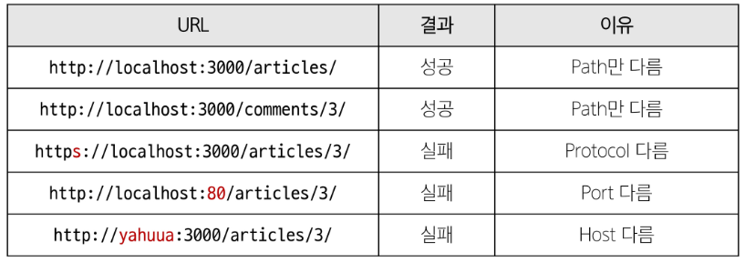

### CORS policy의 등장
- 기본적으로 웹 브라우저는 같은 출처에서만 요청하는 것을 허용하며, 다른 출처로의 요청은 보안상의 이유로 차단됨
  - SOP에 의해 다른 출처의 리소스와 상호작용 하는 것이 기본적으로 제한되기 때문
- 하지만 현대 웹 애플리케이션은 다양한 출처로부터 리소스를 요청하는 경우가 많기 때문에 CORS 정책이 필요하게 되었음
- CORS는 웹 서버가 리소스에 대한민국 서로 다른 출처 간 접근을 허용하도록 선택할 수 있는 기능을 제공

### CORS (Cross-Oirign Resource Sharing)
교차 출처 리소스 공유

- 특정 출처에서 실행 중인 웹 애플리케이션이 **다른 출처의 자원에 접근할 수 있는 권한을 부여**하도록 브라우저에 알려주는 체제
- 만약 다른 출처의 리소스를 가져오기 위해서는 이를 제공하는 서버가 브라우저에게 다른 출처지만 접근해도 된다는 사실을 알려야 함
- "CORS policy (교차 출처 리소스 공유 정책)"

### CORS Plicy (Cross-Origin Resource Sharing Plicy)
교차 출처 리소스 공유 정책

- 다른 출처에서 온 리소스를 공유하는 것에 대한 정책
- 서버에서 결정되며, 브라우저가 해당 정책을 확인하여 요청이 허용되는지 여부를 결정
- 다른 출처의 리소스를 불러오러면 그 다른 출처에서 올바른 **CORS header를 포함한 응답을 반환**해야 함

### CORS 적용 방법
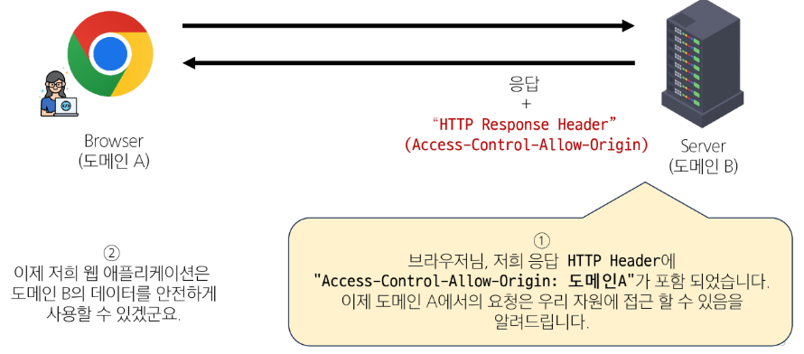

- CORS policy 정리
  - 웹 애플리케이션이 다른 도메인에 있는 리소스에 안전하게 접근할 수 있도록 허용 또는 차단하는 보안 메커니즘
  - 서버가 약속된 CORS Header를 포함하여 응답한다면 브라우저는 해당 요청을 허용
  - 즉, 서버에서 CORS Header를 만들어야 한다.

### CORS Headers 설정
- Django에서는 django-cors-headers 라이브러리 활용
- 손쉽게 응답 객체에 CORS header를 추가해주는 라이브러리

- django-cors-headers 사용하기
  - 설치 (requirements.txt.로 인해 사전에 설치되어 있음)

    ```
    $ pip install django-cors-headers
    ```

  - 관련 코드 주석 해제  

    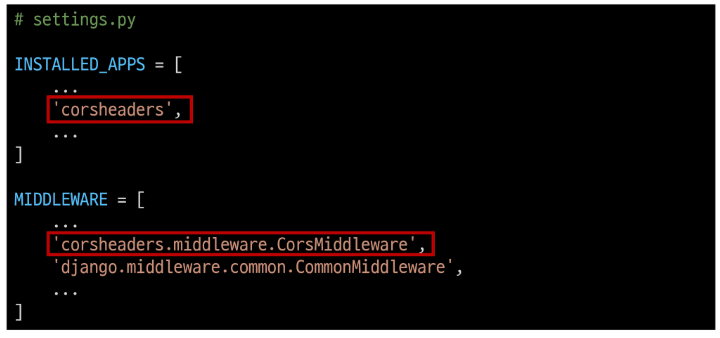

  - CORS를 허용할 Vue 프로젝트의 Domain 등록  

    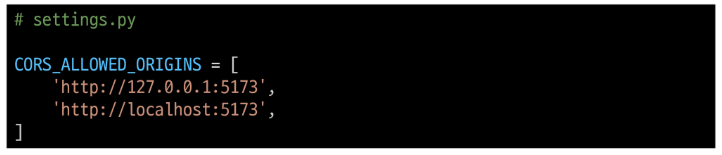

- CORS 처리 결과

  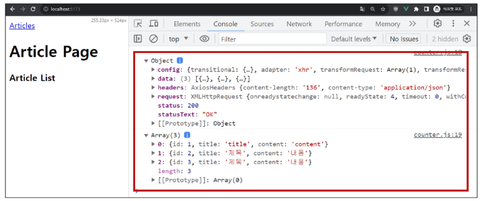

  - 메인 페이지에서 DRF 응답 데이터 재확인

    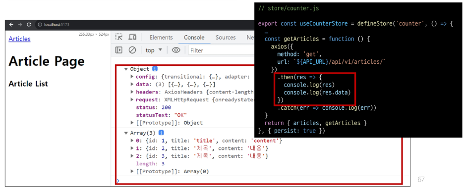

  - 응답 객체에서 'Access-Control-Allow-Origin' Header 확인
    - 개발자도구 - Network - Fetch/XHR

    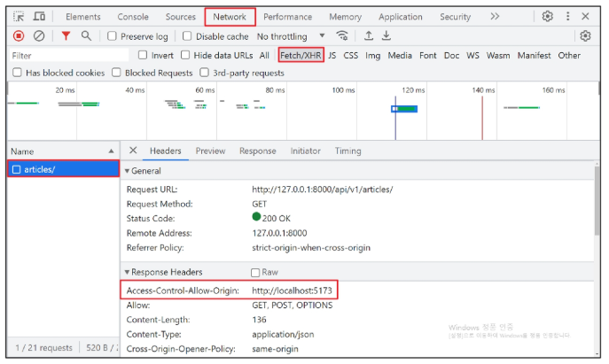


## Article Read 구현
- 전체 게시글 목록 출력
  - 응답 받은 데이터에서 각 게시글의 데이터 구성 확인 (id, title, content)

    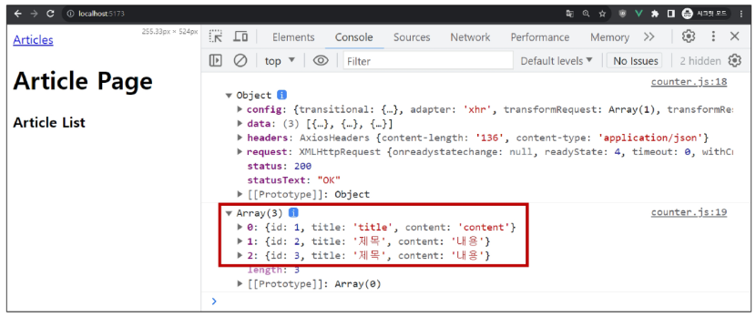
  - store에 게시글 목록 데이터 저장 
    
    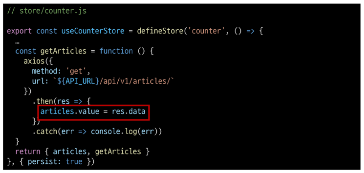
- store에 저장된 게시글 목록 출력 확인  
  - pinia-plugin-persistedstate에 의해 브라우저 Local Storage에 저장됨  

    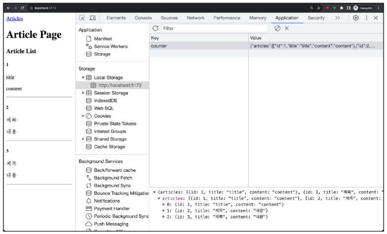

## 참고
### 인증 with Vue
- 시작하기 전에 (1/2)
1. DRF에서 인증 관련 코드를 미리 주석 해제 혹은 작성 완료 후 진행
    - dj-rest-auth[with-social]을 활용한 회원 관련 기능은 DRF 수업 내용 참고
2. Article과 User 간의 N:1 관계 형성 주석 해제 및 migrate 작업 진행
    - Article Serializer, Article save 로직 등 점검
3. DB 초기화
    - db.sqlite3 삭제
4. Migration 과정 재 진행
5. 관리자 계정 생성 후, 게시글 1개 이상 작성
    - 기존 fixtures 데이터는 user 정보가 없으므로 사용 불가능
6. 정상 작동하던 게시글 전체 조회가 작동하지 않음
    - 401 status code 확인
    - 게시글 조회 요청 시 인증에 필요한 수단(token)을 보내지 않고 있으므로 게시글 조회가 불가능해진 것

      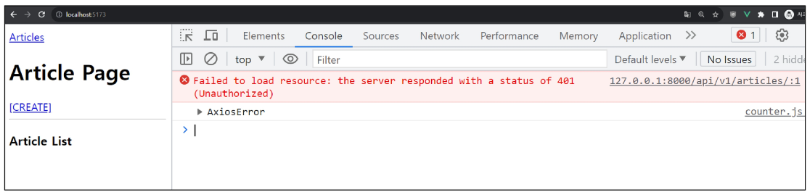

### 회원가입 로직 구현
- `SignUpView` route 관련 코드 주석 해제  

  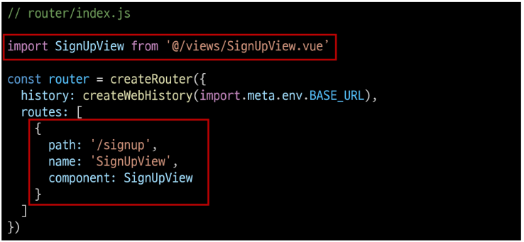
- `App` 컴포넌트에 `SignUpView` 컴포넌트로 이동하는 RouterLink 작성  

  
- `views/SignUpView.vue` 회원가입 form 작성  

  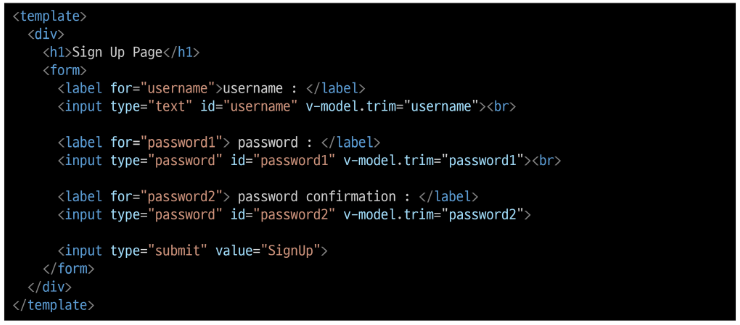
- 사용자 입력 데이터와 바인딩될 반응형 변수 작성  

  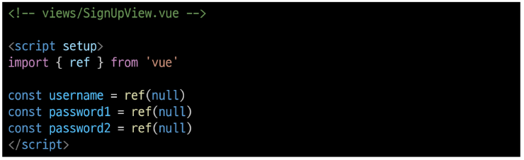
- `SignUpView` 컴포넌트 출력 확인  
  - 브라우저에서 `/signup` 페이지로 이동 시 form 렌더링 확인

    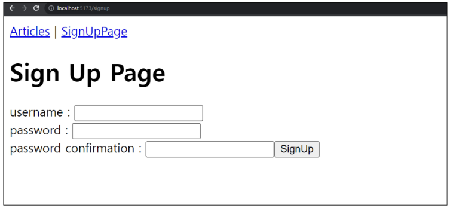
- 회원가입 요청을 보내기 위한 `signUp` 함수가 해야 할 일  
  1. 사용자 입력 데이터를 받아  
  2. 서버로 회원가입 요청을 보냄  

      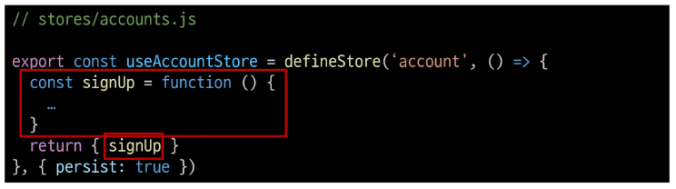

- 컴포넌트에 사용자 입력 데이터를 저장 후  
  store의 `signUp` 함수를 호출하는 함수 작성  

    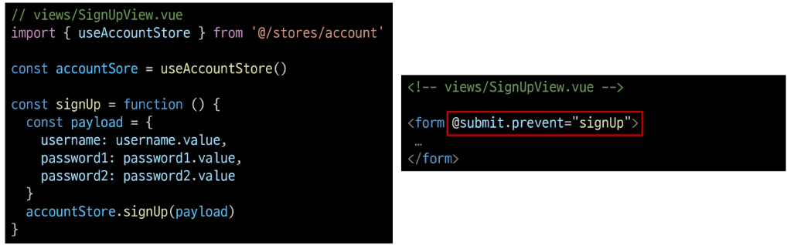
- 실제 회원가입 요청을 보내는 `store`의 `signUp` 함수 작성 
  
  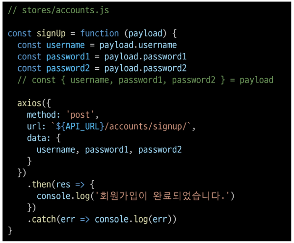
- 회원가입 테스트

  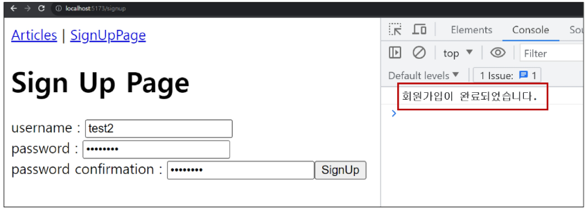
- Django DB 확인

  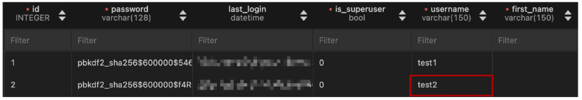

### 로그인 로직 구현
- LogInView route 관련 코드 주석 해제

    
- App 컴포넌트에 `LogInView` 컴포넌트로 이동하는 RouterLink 작성  

  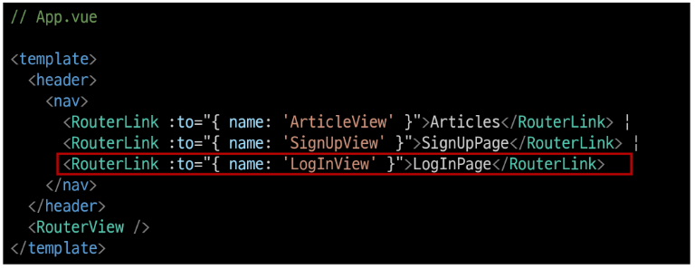
- 로그인 form 작성

  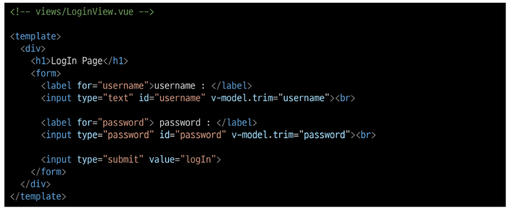
- 사용자 입력 데이터와 바인딩 될 반응형 변수 작성

  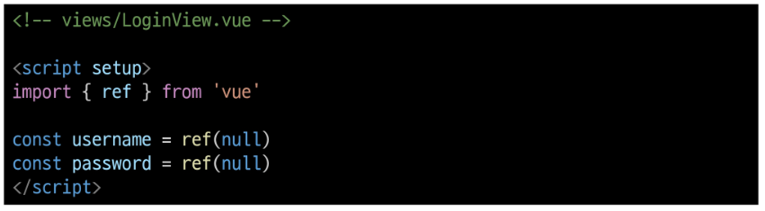
- LogInView 컴포넌트 출력 확인

  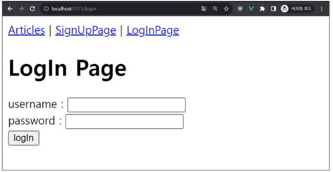
- 로그인 요청을 보내기 위한 `logIn` 함수가 해야 할 일  
  1. 사용자 입력 데이터를 받아  
  2. 서버로 로그인 요청 및 응답 받은 토큰 저장

      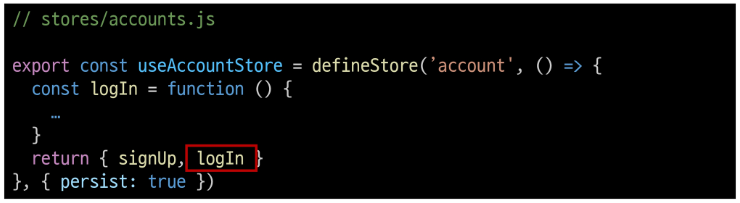
- 컴포넌트에 사용자 입력 데이터를 저장 후 store의 `logIn` 함수를 호출하는 함수 작성
  
  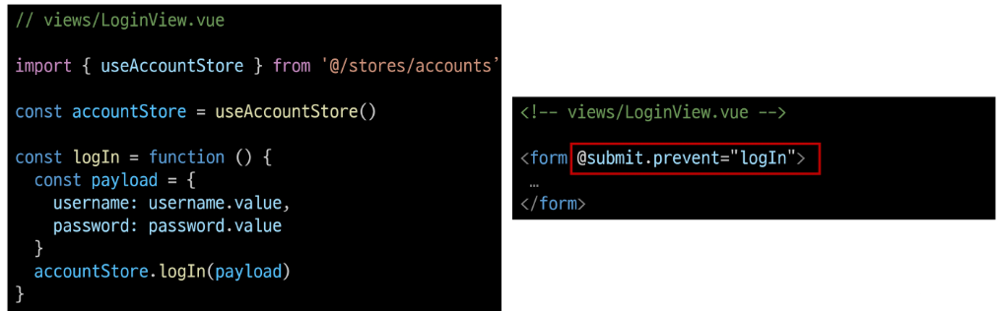
- 실제 로그인 요청을 보내는 store의 `logIn` 함수 작성  

  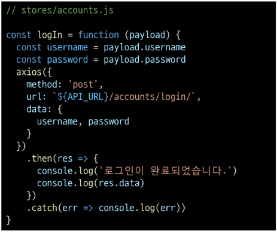
- 로그인 테스트

  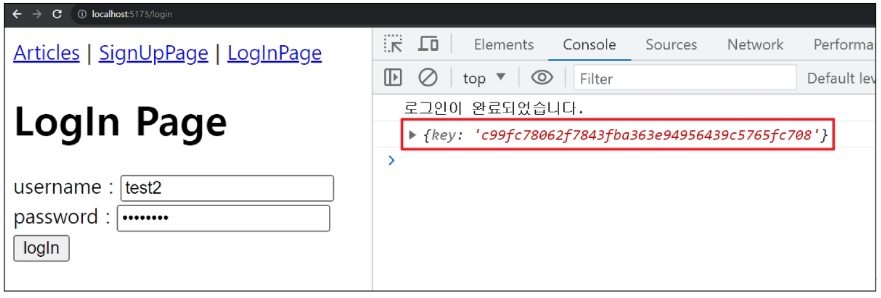
  - 응답 객체 안에 Django가 발급한 Token이 함께 온 것을 확인

### 요청과 토큰
"Token을 store에 저장하여 인증이 필요한 요청마다 함께 보낸다.""

### 토큰 저장 로직 구현
- 반응형 변수 token 선언 및 토큰 저장

  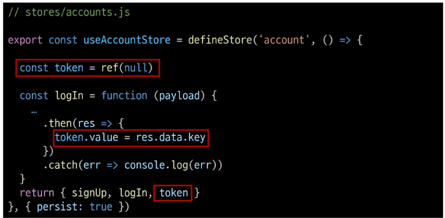
- 다시 로그인 요청 후 store에 저장된 토큰 확인

  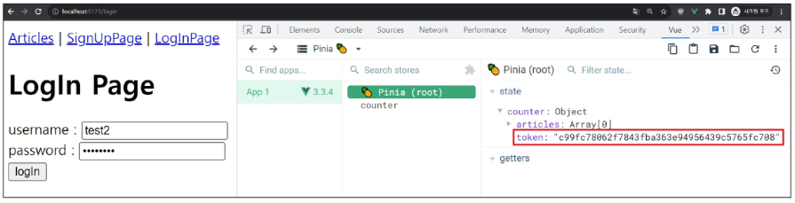

- 토큰이 필요한 요청
  1. 게시글 전체 목록 조회 시
  2. 게시글 작성 시
- 게시글 전체 목록 조회 요청 함수 getArticles에 token 추가

  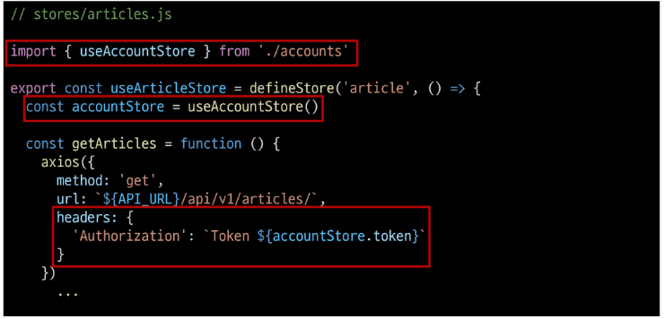
- 401 상태 코드가 사라지고 게시글이 정상적으로 출력되는 것을 확인

  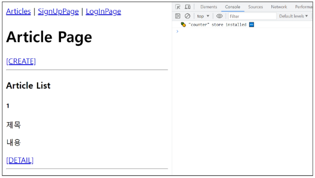
- 게시글 생성 요청 함수 createArticle에 token 추가

  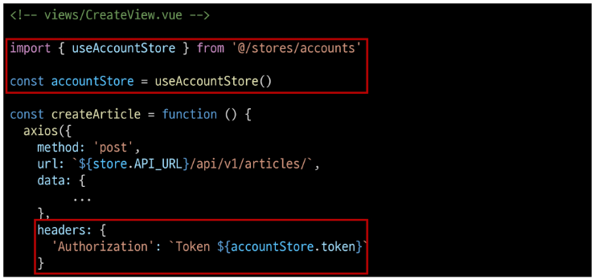
- 게시글 작성 확인

  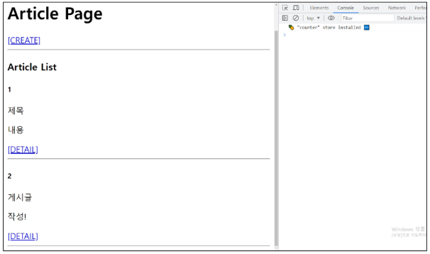

### 사용자의 인증(로그인) 여부에 따른 추가 기능 구현
1. 인증 되지 않은 사용자
    - 메인 페이지 접근 제한

2. 인증 된 사용자
    - 회원가입 및 로그인 페이지에 접근 제한

- 인증 상태 여부를 나타낼 속성 값 지정
  - token 소유 여부에 따라 로그인 상태를 나타낼 isLogin 변수 작성
  - 그리고 computed를 활용해 token 값이 변할 때만 상태를 계산하도록 함

    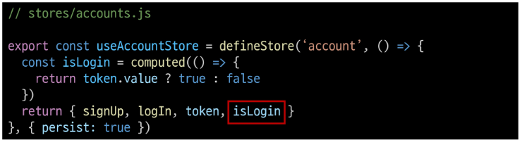

### 1. 인증 되지 않은 사용자는 메인 페이지 접근 제한
- 전역 네비게이션 가드 beforeEach를 활용해 다른 주소에서 메인 페이지로 이동 시 인증 되지 않은 사용자라면 로그인 페이지로 이동시키기

  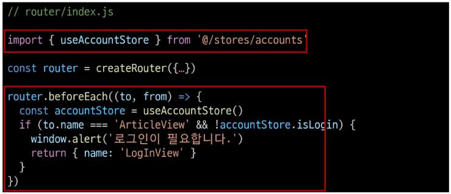
- 브라우저 local storage에서 token을 삭제 후 메인 페이지 접속 시도

  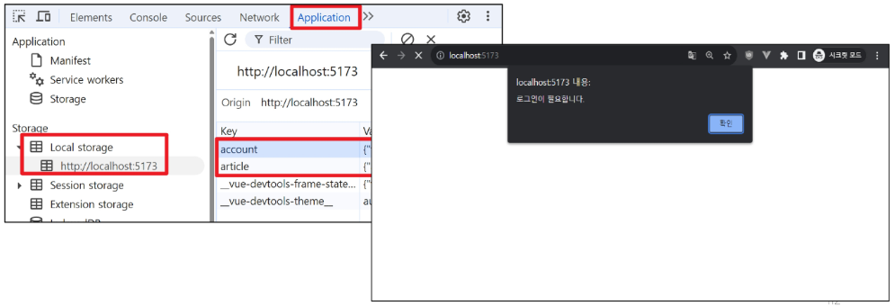

### 2. 인증 된 사용자는 회원가입과 로그인 페이지에 접근 제한
- 다른 주소에서 회원가입 또는 로그인 페이지로 이동 시 이미 인증 된 사용자라면 메인 페이지로 이동시키기

  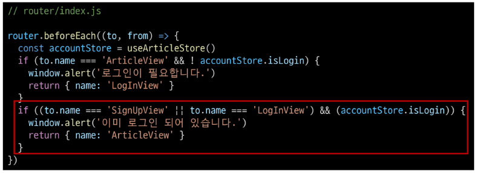
- 로그인 후 회원가입, 로그인 페이지 접속 시도

  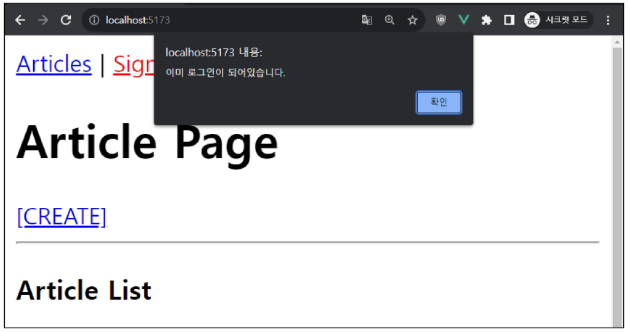

