# DB 설계를 활용한 REST API 설계
## DRF With MySQL
### 데이터 전처리
- 스켈레톤 코드 확인(`02-pjt/examples`)

  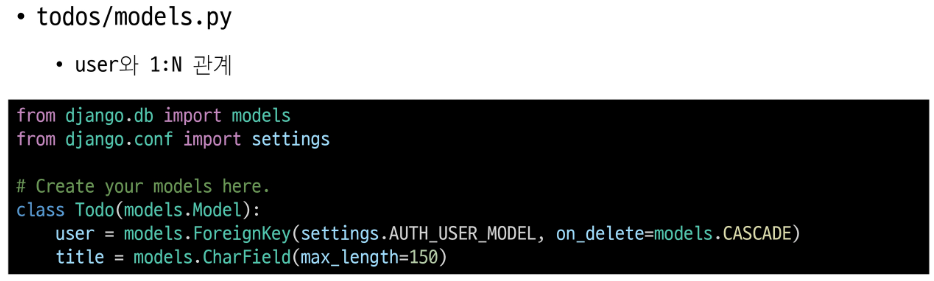

  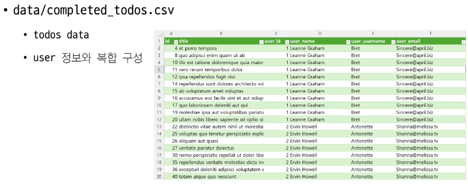
- 스켈레톤 코드 확인 순서
  1. `completed_todos.py`

    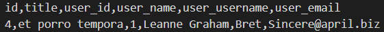
  2. crud 프로젝트에 뭐 있는지 확인
    - `crud/settings.py`

      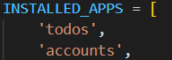
      - todos, account 등록 확인
  3. todos 모델 어떻게 정의되어있는지 확인

      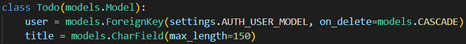
    - 할 일(todo)들을 저장하는 모델이 user, title 두 컬럼을 가짐
    - user는 FK 형식. 즉, todo들이 한 명의 유저와 1:N 관계
    
      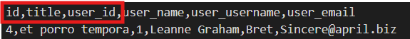
    - 그렇다면 우리가 가진 데이터는 여러가지 있지만, 실제 todo에 들어가는 데이터는 id, title, user_id까지 들어가야 함을 확인함
  4. accounts 모델도 확인

      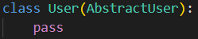
    - 이 프로젝트는 장고에서 기본적으로 제공해주는 User모델을 그대로 사용하는데, accounts에서 사용할 User 모델을 베이스로 하겠다고 설정을 바꿨겠구나!라고 생각해줘야 함
    - 장고에서 기본적으로 만들어주는 User테이블은 어떤 형태의 컬럼으로 만들어져있을까? -> User가 상속받은 클래스 AbstractUser를 확인해보자

      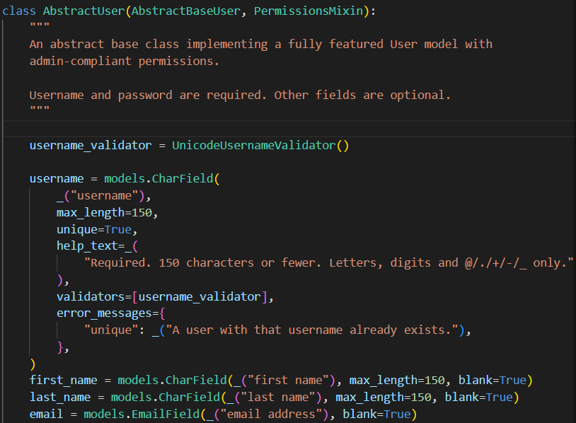
      - 내가가진 데이터는 user_id, user_name, user_username, user_email인데 AbstractUser를 보면 username, first_name, last_name, email 등등으로 정의되어 있음
      - 내 데이터에 공통적으로 들어가있는 user를 빼야겠구나
      - user_name은 first_name과 last_name으로 쪼개서 넣을 수 있어야 되겠구나
      - 등등의 처리를 해야됨을 확인
  5. 설정 확인
    - `crud/settings.py`
    - 장고가 준 AbstractUser를 그대로 사용할건데, accounts에 있는 User를 쓰겠다고 설정란에 정상적으로 작성했는지 확인

      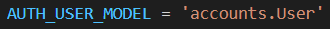
    - 또, 어떤 것들이 설치되어있는지 확인

      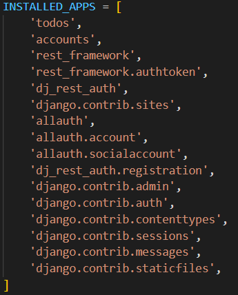
      - `rest_framework.authtoken` -> 토큰 형식으로 인증할 생각인가보구나 -> 그래서 `dj_rest_auth`를 사용하는구나
      - `allauth.socialaccount`, `dj_rest_auth.registration`를 보아하니 회원가입 기능이 구현되어 있구나

      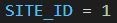
      - 소셜 로그인을 하기위한 외부 API를 쓸 때 필요한 설정도 되어있구나
    
    - **allauth 사용하려면 미들웨어에 추가되어있어야함!!**

      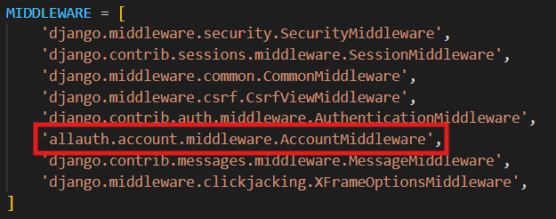
      - allauth 공식문서에 있다고 함
    
    - 장고는 자기가 연결할 Database를 아래와 같이 관리함

      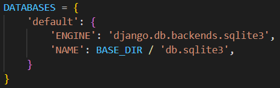
      - `BASE_DIR / 'db.sqlite3'` -> 루트 프로젝트에 있는 db.sqlite3 파일 형식
      - 장고는 유저에 대한 데이터가 정의되어 있고, 관리자에 대한 데이터도, 세션에 대한 데이터도 처리해야함 -> 장고 플젝을 만드는 순간 이 모든 것들이 DB로서 작동할 수 있어야 함 -> 그래서 파일 단위로 사용할 수 있도록 위 방식으로 DB를 관리하는 것

        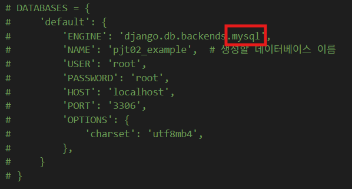
        - 그걸 우리는 sql로 바꿀 예정
    - 최근 장고 버전 업뎃되면서 발생한 이슈에 대한 코드

      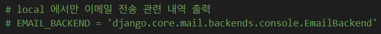

  6. 이 프로젝트를 위한 `requiremants.txt` 확인

    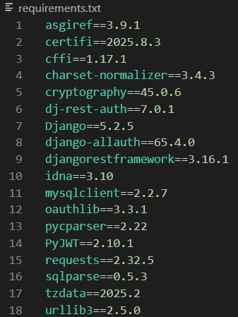

  7. 프로젝트 시작할 준비 끗.

- 데이터 구성 변경
  - todo 테이블에는 title field만 정의됨
    - user FK 정보는 유지
  
  - 그 외 user 정보는 user.csv로 별도 추출
    - name은 first_name과 last_name으로 구분하여 저장

  - 데이터 분리 함수 작성

    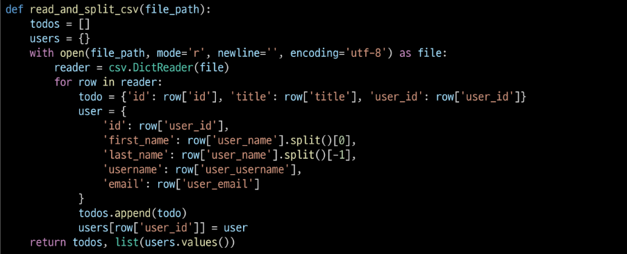
  
  - csv 파일 저장 함수 작성

    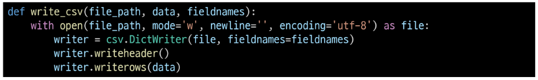
  
  - todo.csv, user.csv 분리하여 저장
    - todo에는 user FK를 저장하기 위해 user_id
    - user에는 user_id를 id로 저장

      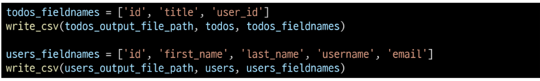

- 실습 `02-pjt\examples\data\01_separation_data.py`
  ```python
  import csv

  # 파일 경로 설정
  input_file_path = 'completed_todos.csv'
  todos_output_file_path = 'todos.csv'
  users_output_file_path = 'users.csv'

  # 입력 파일 읽고 데이터 분리
  def read_and_split_csv(file_path):
      todos = []
      users = {}
      # 파일 읽기
        # 읽기로 지정, newline, 인코딩 지정해서 이 파일을 with문 안에서 file 변수로 사용
        # with문 사용 이유: 이 리소스를 안전하게 종료해주기 위함
      with open(file_path, mode='r', newline='', encoding='utf-8') as file:
          # 읽을건데, 컬럼명 + 나머지 데이터들이 키,벨류 형식이었으면 함
          reader = csv.DictReader(file)   
          for row in reader:
              # 행 하나하나가 하나의 todo에 대한 정보
              todo = {'id': row['id'], 'title': row['title'], 'user_id': row['user_id']}
              user = {
                  'id': row['user_id'],
                  'first_name': row['user_name'].split()[0],
                  'last_name': row['user_name'].split()[-1],
                  'username': row['user_username'],
                  'email': row['user_email'],
              }
              # todos, users에 정보 넣어주기
              todos.append(todo)
              users[row['user_id']] = user
      # print(todos)
      # print(users)
      return todos, list(users.values())

  # CSV 파일로 저장
  def write_csv(file_path, data, fieldnames):
      # 쓰기, 쓰기는 newline 더더욱 중요, 인코딩 설정
      with open(file_path, mode='w', newline='', encoding='utf-8') as file:
          # 딕셔너리 형식으로 작성하는 것이니 fieldnames 지정해주면 좋겠다
          writer = csv.DictWriter(file, fieldnames=fieldnames)
          # 필드 지정했다고 컬럼 만들어지는거 아님
          writer.writeheader()  # 컬럼명 지정
          writer.writerows(data)  # 데이터 넣기

  def main():
      # read_and_split_csv에서 반환받은 값들로 csv 저장하기
      todos, users = read_and_split_csv(input_file_path)
      
      # todos.csv 저장
      todos_fieldnames = ['id', 'title', 'user_id']
      write_csv(todos_output_file_path, todos, todos_fieldnames)
      
      # users.csv 저장
      users_fieldnames = ['id', 'first_name', 'last_name', 'username', 'email']
      write_csv(users_output_file_path, users, users_fieldnames)
  
  # 01_separation_data.py 파일이 메인으로 실행되었을 때 main()함수를 실행시키겠다
    # python 한장짜리 스크립트 형식으로 코드 작성할 때 주로 사용
    # 이 파일이 메인임을 알리는 용도
  if __name__ == '__main__':  
      main()
  ```

- 장고에 만들어질 DB에 위에서 만든 데이터 삽입할 것임
  - sqplite3에 넣는게 아니라, 이제 mysql에 넣자
  
### MySQL 연동
- 장고가 기본적으로 만들어놓는 것은 sqlite3
  - 우리는 국내에서 많이 쓰는 mySQL 쓸 것임

- `myssqlclient`
  - support MySQL for python
  - 파이썬에서 MySQL을 클라이언트 형식으로써 내가 파이썬만으로 요청주고 응답받는 일종의 API형태의 라이브러리

- mysqlclient 설치

  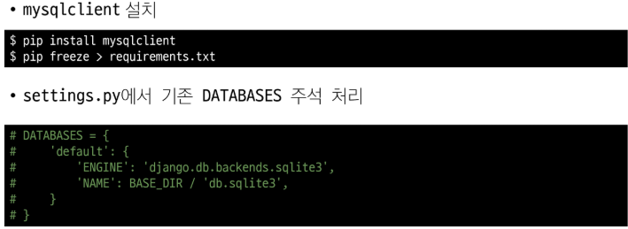
  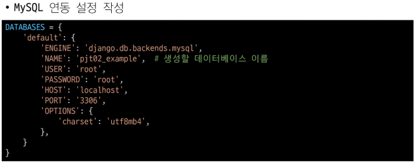
  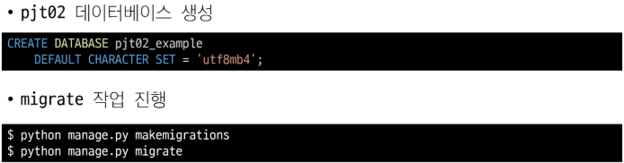

- 테이블 생성 확인 후, data import 

  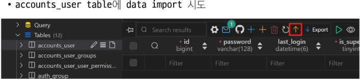
  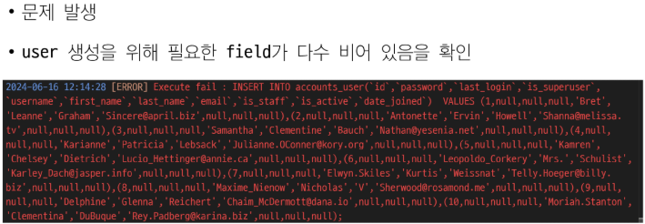

- 실습
  - `02-pjt/examples`에서 가상환경 생성
    - `python -m venv venv`
    - `source venv/Scripts/activate`
    - `pip install -r requirments.txt`
    - django-allauth가 업뎃되면서 최신버전에서는 email, user password 등등의 처리방식이 달라짐
    - 그래서 우리가 사용하는 dj-rest-auth 방식으로는 회원가입이 정상적으로 작동하지 않을 수 있음
    - 이를 해결하려면 직접 토큰 생성해서 유저에게 발급하고 그 토큰을 가지고 인증 시스템을 쓰도록 하면 됨
    - 또는 `pip install dj-rest-auth==65.4.0`으로 다운그레이드하기
  
  - `pip install mysqlclient` 설치
  - `pip freeze > requirements.txt` 추가로 설치한거 txt파일에 넣기

  - 장고가 기본 제공하는 sqlite3가 아니라 mysql 쓰겠다고 장고한테 알려주기
    ```python
    # Database
    # https://docs.djangoproject.com/en/4.2/ref/settings/#databases

    # DATABASES = {
    #     'default': {
    #         'ENGINE': 'django.db.backends.sqlite3',
    #         'NAME': BASE_DIR / 'db.sqlite3',
    #     }
    # }

    DATABASES = {
        'default': {
            'ENGINE': 'django.db.backends.mysql', 
            'NAME': 'pjt02_example',  # 생성할 데이터베이스 이름
            'USER': 'root',
            'PASSWORD': 'root',
            'HOST': 'localhost',   
            'PORT': '3306',        
            'OPTIONS': {
                'charset': 'utf8mb4',
            },
        }
    }
    # 엔진: 장고DB벡엔드에 있는 mysql을 쓰겠다
    # 이름: sqlite3는 파일 위치만 적어주면 됐는데, 내 로컬에 현재 실행되어있는 mysql 서버에있는 DB명을 적어줘야함
    # 유저: 내 mysql 서버에 장고가 연결할 수 있어야 하므로 내 mysql 서버의 유저명이 뭔지 입력해야 함
    # PSSWORD, HOST, PORT 등등도 유저와 같은 이유로 입력해줘야함
      # 기본적으로 입력되어있음
      # 이거 배포할 때 public한곳에 올리면 안댐
    ```

  - `python manage.py makemigrations` 설계도 만들기
    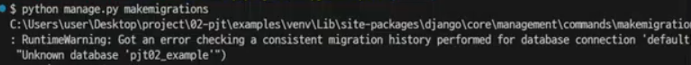
    - RuntimeWarning -> migrate하려는 pjt02_examplt이 없는 것 같으니 잘 처리하고 migrate하라는 경고
    - 경고 나와도 설계도 만들어주긴 함
  
  - DB 만들어주기
    - extensions -> database -> `+` new database
      ```sql
      CREATE DATABASE pjt02_example
        DEFAULT CHARACTER SET = 'utf8mb4';
      ```
    - 실행 `Run` -> DB 만들어짐
    - 이 안의 테이블들은 장고가 우리가 작성한 설계도를 기반으로 migrate 해줄 예정
  
  - `python manage.py migrate` 테이블 생성

    
    - MySQL은 unique 제약사항에 대한 것을 지원하지 않는다는 경고문구(EmailAddress에 대해서)
    - 그래서 해당하는 제약사항이 만들어지지 않았으니 주의해라
    - mysql은 고유값 설정 못하는게 아니고, 고유값 설정하는 제약사항 작성 방법이 다른 것임!
    - 지금은 이메일주소가 유니크하지 않아도 상관없지만, 정상적으로 다 만들고 싶다면 mySQL에서 고유값으로 지정하기 위한 제약사항은 어떻게 해야하는지 알아보면 됨
  
  - 테이블 정상적으로 만들어졌으니, user와 todo에 대한 정보를 삽입하자
    - 삽입 순서 중요함
    - todo는 FK로 user_id를 참조하고 있기 때문에 FK대한 정보가 필요하므로 user를 먼저 삽입해야함
    - accounts_user 테이블 -> `↑` import data -> Type은 csv, Encoding은 UTF8 -> 내 프로젝트에 있는 users.csv 하면? 안됨! 

      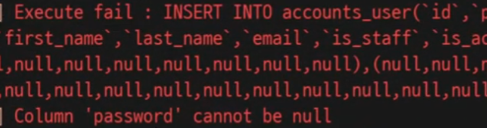
    - 장고에서 기본적으로 제공하는 password 등 유저 정보가 csv 파일에 없음
    - 우리 서비스는 웹서비스이고 API형식
    - 회원가입이나 유저에 관한 기능들은 djrest?한테 일임해놨음
    - 그래서 우리의 urls.py에는 회원가입 관련 기능들이 있다

      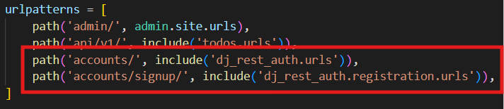
    - 그리고 우리에겐 username, first_name, email .. 이 있음
    - 지금은 test를 위한 더미 데이터이므로 이 데이터를 가지고 요청 보내서 회원가입을 하면될듯
    - user.csv파일을 읽어서 for문으로 api서버에 요청 보내서 회원가입 시키자(request사용해서 POST요청 보내면 됨)
    - 내 서버에 요청 보내기위해 서버를 키자
    - `python manage.py runserver`
  
  - 서버를 켜놓은 채로 회원가입 요청을 파이썬 명령어로 보냄
    - 터미널 창 하나 더 열기 -> 가상환경 활성화
    - `cd data/` -> 여기서 02_registration.py 실행시킬 예정

      
    - 장고 서버의 회원가입 엔드포인트로 users.csv파일 이용해서 request로 POST요청을 보낼 것임
  
  - 사용자 데이터로 회원가입 API 호출하는 함수 작성하기
    - `02_registration.py`
      ```python
      def register_users(users, api_url):
          # 모든 유저 정보를 토대로 회원가입 요청
          for user in users:  # 유저 정보 하나씩 가져옴
              # request로 post요청을 보낼건데, api_url로 내가가진 유저정보를 보냄
              response = requests.post(api_url, data=user)
              if response.status_code == 201: # `201` status 코드 받으면 성공
                  print('성공적으로 회원가입 완료!')
              else:
                  print('모종의 이유로 회원가입 실패!')
      ```
      - 


  
